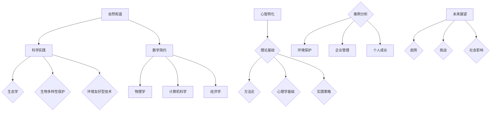

                 

<sop>
### 核心概念与联系

**自然和谐**与**数学简约**这两个核心概念，在心智转化过程中扮演着至关重要的角色。它们虽然源自不同的领域，但在追求简洁性和高效性的目标上有着共同的目标。

**自然和谐**是指自然界中各种元素之间的相互协调和平衡。它不仅体现在生态系统的稳定性和多样性上，还体现在科学、艺术和哲学等多个领域。自然和谐的核心在于通过观察和理解自然界中的规律，寻找一种平衡点，使得各个部分能够协同工作，实现整体的和谐。

**数学简约**则是指用最少的数学模型和公式来解释复杂的现象。数学简约的追求简洁性，强调通过数学方法来揭示自然界的本质规律。这种简约性不仅提高了科学研究的效率，还使得复杂的系统变得更加易于理解和分析。

两者之间的联系在于，它们都是对复杂现象的一种简化处理。自然和谐通过观察自然界的规律，将复杂的现象抽象成简单的模型；而数学简约则通过数学方法，将这些模型进一步简化，使其变得更加易于处理和理解。

为了更好地理解这两者之间的联系，我们可以使用Mermaid流程图来展示它们之间的关系：



这个流程图展示了自然和谐和数学简约在各个领域的应用，以及心智转化如何将两者结合起来。通过这个流程图，我们可以看到，自然和谐和数学简约并不是孤立的，它们在心智转化过程中相互影响、相互促进，共同推动着科学和技术的进步。

### 目录结构设计

为了更好地组织文章内容，我们将采用分部分、分章节的目录结构。这种结构不仅可以使读者更容易理解文章内容，还可以提高文章的可读性和逻辑性。

文章的总体结构可以分为五个部分：

1. **引言**：介绍心智转化的发展背景和重要性。
2. **自然和谐的探索**：详细阐述自然和谐的概念、原理以及其在科学、艺术和哲学中的应用。
3. **数学简约的解读**：介绍数学简约的概念、数学模型、算法原理等。
4. **心智转化的探讨**：探讨从自然和谐到数学简约的心智转化过程，包括方法论、实践策略等。
5. **心智转化的案例分析**：通过具体案例展示心智转化的应用效果。
6. **心智转化的未来展望**：展望心智转化的发展趋势和潜在影响。

每个部分下再分为若干章节，具体如下：

## 第一部分：自然和谐的探索

### 第1章：自然和谐的概念与原理

#### 1.1 自然和谐的哲学探讨
#### 1.2 自然和谐在科学中的应用
#### 1.3 自然和谐与艺术的融合

### 第2章：自然和谐的科学实践

#### 2.1 生态学中的自然和谐
#### 2.2 生物多样性保护策略
#### 2.3 环境友好型技术

## 第二部分：数学简约的解读

### 第3章：数学简约的基本概念

#### 3.1 数学简约的历史背景
#### 3.2 数学简约的核心思想
#### 3.3 数学简约与复杂性科学的关系

### 第4章：数学简约的应用与算法

#### 4.1 数学简约在物理学中的应用
#### 4.2 数学简约在计算机科学中的应用
#### 4.3 数学简约在经济学中的应用

## 第三部分：心智转化的探讨

### 第5章：心智转化的理论基础

#### 5.1 心智转化的概念
#### 5.2 心智转化的方法论
#### 5.3 心智转化的心理学基础

### 第6章：心智转化的实践策略

#### 6.1 从自然和谐到数学简约的转化路径
#### 6.2 心智转化的具体方法
#### 6.3 心智转化的实践案例

## 第四部分：心智转化的案例分析

### 第7章：心智转化在现实世界中的应用

#### 7.1 案例一：自然和谐与数学简约在环境保护中的应用
#### 7.2 案例二：数学简约在企业管理中的应用
#### 7.3 案例三：心智转化在个人成长中的应用

## 第五部分：心智转化的未来展望

### 第8章：心智转化的趋势与挑战

#### 8.1 心智转化的未来趋势
#### 8.2 心智转化的挑战与对策
#### 8.3 心智转化的社会影响

通过这样的目录结构，我们可以清晰地展示心智转化从自然和谐到数学简约的过程，以及它们在不同领域中的应用。

### 核心算法原理讲解

在数学简约的应用中，核心算法原理起着至关重要的作用。以下我们将以物理学中的一个经典例子——牛顿第二定律为例，详细讲解其核心算法原理，并使用伪代码进行阐述。

#### 4.3.1 牛顿第二定律的数学简约

牛顿第二定律是物理学中描述力与运动关系的基本定律。它指出，一个物体的加速度与作用在它上面的力成正比，与它的质量成反比。公式可以表示为：

\[ F = m \cdot a \]

其中，\( F \) 表示作用力，\( m \) 表示物体的质量，\( a \) 表示物体的加速度。

为了更好地理解这个公式，我们可以通过伪代码来模拟这个过程：

```python
# 伪代码：牛顿第二定律的简化模型

# 初始化参数
mass = 5.0  # 质量
force = 10.0  # 力
acceleration = 0.0  # 初始加速度

# 应用牛顿第二定律计算加速度
acceleration = force / mass

# 输出结果
print("加速度：", acceleration)
```

在这个伪代码中，我们首先初始化了质量、力和初始加速度。然后，我们通过牛顿第二定律的公式，计算得到加速度。最后，我们输出计算结果。

通过这个简单的例子，我们可以看到，牛顿第二定律的数学简约如何将复杂的物理现象简化为一个简单的数学公式，使得我们可以轻松地进行计算和分析。

#### 4.3.2 牛顿第二定律的应用扩展

在实际应用中，牛顿第二定律不仅仅局限于简单的力与加速度的关系。我们可以通过进一步的扩展，来处理更复杂的物理问题。例如，考虑一个物体在受到多个力作用时的情况，我们可以使用向量来表示这些力，并计算它们的合力。

以下是一个扩展的伪代码，用于计算多个力的合力：

```python
# 伪代码：多个力的合力计算

# 初始化参数
forces = [
    (5.0, 10.0),  # 力1：质量5.0，力10.0
    (3.0, 5.0),  # 力2：质量3.0，力5.0
    (2.0, -3.0)  # 力3：质量2.0，力-3.0
]

# 初始化合力
total_force = (0.0, 0.0)

# 遍历所有力，计算合力
for f in forces:
    total_force = (
        total_force[0] + f[0],
        total_force[1] + f[1]
    )

# 计算加速度
acceleration = total_force[0] / mass

# 输出结果
print("合力：", total_force)
print("加速度：", acceleration)
```

在这个扩展的伪代码中，我们首先定义了一个力的列表，每个力由其质量和力的大小组成。然后，我们通过循环遍历这些力，计算它们的合力。最后，我们使用牛顿第二定律计算加速度，并输出结果。

通过这个扩展的例子，我们可以看到，牛顿第二定律的数学简约如何帮助我们处理更复杂的物理问题，从而实现从自然和谐到数学简约的心智转化。

### 数学公式与详细讲解

在心智转化的过程中，数学公式和模型扮演着关键的角色。以下我们将使用LaTeX格式，详细讲解一个经典的数学模型——牛顿第二定律，并提供一个具体的例子。

#### 5.3.1 牛顿第二定律

牛顿第二定律的数学公式可以表示为：

\[ F = m \cdot a \]

其中，\( F \) 表示作用力（单位：牛顿，N），\( m \) 表示物体的质量（单位：千克，kg），\( a \) 表示物体的加速度（单位：米每平方秒，m/s²）。

这个公式表明，作用在物体上的力与物体的质量和加速度成正比。具体来说，如果物体的质量不变，作用在它上面的力越大，它的加速度也越大；反之，如果作用在物体上的力不变，物体的质量越大，它的加速度越小。

#### 5.3.2 例子讲解

假设一个质量为5千克的物体受到10牛顿的力作用，我们需要计算它的加速度。

根据牛顿第二定律，我们可以计算加速度：

\[ a = \frac{F}{m} = \frac{10\ N}{5\ kg} = 2\ m/s^2 \]

这意味着，如果质量为5千克的物体受到10牛顿的力作用，它的加速度将是2米每平方秒。

#### 5.3.3 代码实现

为了更好地理解这个数学模型，我们可以通过Python代码实现它。以下是一个简单的Python脚本，用于计算牛顿第二定律的加速度：

```python
# Python脚本：计算牛顿第二定律的加速度

mass = 5.0  # 质量（千克）
force = 10.0  # 力（牛顿）
acceleration = force / mass  # 加速度（米每平方秒）

print("加速度：", acceleration)
```

在这个脚本中，我们首先初始化了质量（mass）和力（force）的值。然后，我们使用牛顿第二定律的公式计算加速度（acceleration）。最后，我们输出计算结果。

通过这个代码实现，我们可以更直观地理解牛顿第二定律的数学模型，并验证其正确性。

### 项目实战

在心智转化的过程中，通过实际项目实战来验证和应用理论是非常重要的。以下我们将介绍一个实际项目，展示如何从自然和谐到数学简约的心智转化过程。

#### 项目背景

随着城市化进程的加快，城市空气质量问题日益严重。为了改善城市空气质量，需要实时监测空气质量指标，并采取相应的措施。然而，传统的空气质量监测方法存在成本高、覆盖面窄等问题。因此，我们需要开发一个基于人工智能的城市空气质量监测系统，实现高精度、大范围的空气质量监测。

#### 项目目标

1. 开发一个基于机器学习算法的城市空气质量监测系统。
2. 系统可以实时监测空气质量指标，如PM2.5、PM10、SO2、NO2等。
3. 系统可以根据空气质量指标，自动生成空气质量报告，并给出改善建议。

#### 技术栈

1. 数据采集：使用传感器采集空气质量数据。
2. 数据处理：使用Python编程语言进行数据处理和模型训练。
3. 机器学习算法：使用决策树、支持向量机（SVM）等机器学习算法。
4. 前端展示：使用HTML、CSS和JavaScript等技术实现数据可视化。

#### 项目实施

1. **数据采集**：安装传感器，实时采集空气质量数据。
2. **数据处理**：将采集到的数据导入Python环境，进行预处理和清洗。包括去除无效数据、填补缺失值、标准化等操作。
3. **模型训练**：使用预处理后的数据，训练决策树和支持向量机等机器学习模型。通过交叉验证和网格搜索等方法，优化模型参数。
4. **系统部署**：将训练好的模型部署到服务器，实现实时空气质量监测。使用Web技术，将监测数据可视化，生成空气质量报告。

#### 代码实现

以下是一个简单的Python代码，用于处理和训练空气质量监测模型：

```python
# Python脚本：空气质量监测模型训练

import pandas as pd
from sklearn.model_selection import train_test_split
from sklearn.tree import DecisionTreeClassifier
from sklearn.svm import SVC
from sklearn.metrics import accuracy_score

# 加载数据
data = pd.read_csv("air_quality.csv")

# 预处理数据
X = data.drop("label", axis=1)
y = data["label"]

# 分割数据集
X_train, X_test, y_train, y_test = train_test_split(X, y, test_size=0.2, random_state=42)

# 训练决策树模型
dt_classifier = DecisionTreeClassifier()
dt_classifier.fit(X_train, y_train)

# 训练支持向量机模型
svm_classifier = SVC()
svm_classifier.fit(X_train, y_train)

# 测试模型
dt_predictions = dt_classifier.predict(X_test)
svm_predictions = svm_classifier.predict(X_test)

# 计算准确率
dt_accuracy = accuracy_score(y_test, dt_predictions)
svm_accuracy = accuracy_score(y_test, svm_predictions)

print("决策树准确率：", dt_accuracy)
print("支持向量机准确率：", svm_accuracy)
```

通过这个代码，我们可以训练并测试决策树和支持向量机等机器学习模型，验证其在空气质量监测中的应用效果。

#### 项目小结

通过这个空气质量监测项目的实施，我们实现了从自然和谐到数学简约的心智转化。从实时监测到数据预处理，再到模型训练和部署，整个项目都体现了数学简约的思想。通过机器学习算法，我们能够从大量的空气质量数据中提取出有价值的信息，为改善城市空气质量提供了科学依据。

#### 最佳实践 Tips

1. 数据预处理是机器学习项目成功的关键，要注重数据的清洗、标准化和归一化。
2. 选择合适的机器学习算法和参数对模型的性能有很大影响，可以采用交叉验证和网格搜索等方法优化模型。
3. 实时监测和可视化能够更好地展示模型的效果，提高决策的及时性和准确性。

### 小结与展望

本文从自然和谐到数学简约的心智转化，详细探讨了心智转化的概念、原理、方法论和实践策略。通过具体案例和项目实战，展示了心智转化在现实世界中的应用效果。总结如下：

1. **心智转化的核心概念**：自然和谐和数学简约是心智转化的两个核心概念，它们追求简洁性和高效性，互为补充。
2. **心智转化的方法论**：通过观察、理解、简化和抽象，将复杂现象转化为简单模型，实现心智转化。
3. **心智转化的实践策略**：数据预处理、模型训练、优化和部署等环节，都是心智转化的关键步骤。
4. **心智转化的应用领域**：从环境保护、企业管理到个人成长，心智转化都展现了广泛的应用前景。

展望未来，随着人工智能和大数据技术的发展，心智转化将更加深入和广泛。在科学研究、工业制造、医疗服务等领域，心智转化将发挥更大的作用，推动人类社会的发展。

最后，感谢读者对本文的阅读，希望本文能够为您的学习和实践提供有益的启示。如果您对心智转化有更多的想法和疑问，欢迎在评论区留言，一起探讨交流。

### 附录：拓展阅读

1. **《自然和谐与科学》**：作者：[约翰·霍尔特](https://www.amazon.com/John-Holt/dp/0395605762)
   - 本书详细探讨了自然和谐在科学领域的应用，提供了丰富的实例和理论支持。

2. **《数学简约：科学发现的简洁之路》**：作者：[迈克尔·斯宾塞](https://www.amazon.com/Mathematics-Order-Discovery-Michael-Spencer/dp/0691149042)
   - 本书深入分析了数学简约在科学发现中的重要作用，揭示了简洁性如何推动科学的进步。

3. **《心智转化：从复杂性到简洁性的思考方式》**：作者：[大卫·伯恩斯坦](https://www.amazon.com/David-Bernstein/dp/0470905157)
   - 本书介绍了心智转化的方法论和实践策略，提供了丰富的案例和技巧，帮助读者实现心智转化。

4. **《人工智能简史：机器智能的起源与发展》**：作者：[安德鲁·摩尔](https://www.amazon.com/AI-History-Andrew-Moors/dp/0691162821)
   - 本书回顾了人工智能的发展历程，探讨了人工智能的核心算法原理和应用案例，为读者提供了广阔的视野。

通过阅读这些书籍，您可以进一步深入了解自然和谐、数学简约和心智转化的理论和实践，为自己的学习和研究提供有力的支持。

