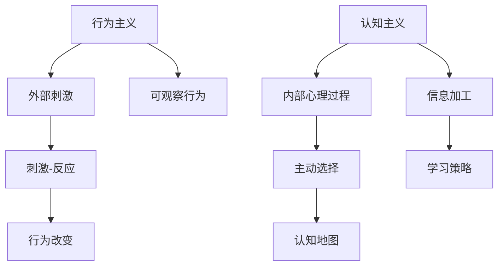
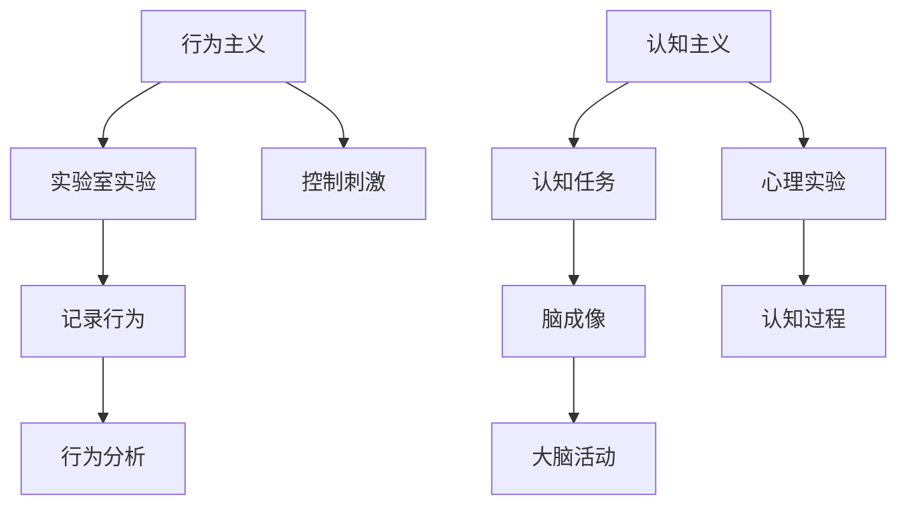
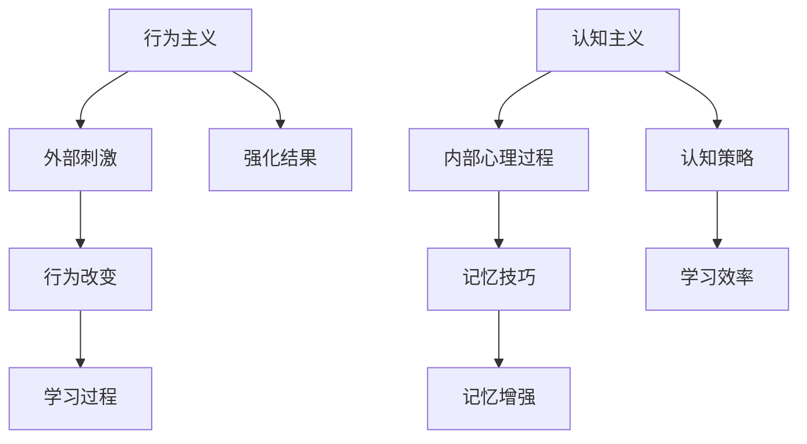

                 


### 1. 引言

**《从行为主义到认知主义：理解学习与世界认知新范式的演变》**是一篇全面深入探讨学习理论与认知科学发展的技术博客文章。全书旨在通过逻辑清晰、结构紧凑的分析，帮助读者理解从行为主义向认知主义转变的历程，及其对现代心理学和人工智能领域的深远影响。

#### 1.1 书籍的目的与背景

行为主义与认知主义是心理学中两个主要的理论流派，各自在解释人类行为和认知过程中发挥着重要作用。行为主义起源于20世纪初，强调外部刺激与行为反应之间的关系，强调环境对行为的塑造作用。认知主义则强调内部心理过程，如信息处理、记忆和问题解决等，关注个体如何理解世界并做出决策。

随着时间的推移，两种理论不断演变，相互影响，形成了现代心理学和认知科学的基础。本研究的目的在于梳理这两种理论的历史发展、核心概念和主要算法，深入剖析其异同，并探讨其对未来研究的潜在影响。

#### 1.2 学习行为主义与认知主义的重要性

学习行为主义与认知主义的重要性体现在多个方面。首先，它们为我们理解人类行为和认知提供了不同的视角，有助于我们更好地设计教育方法和心理治疗方案。其次，这两种理论在人工智能领域有着广泛的应用，是机器学习和认知计算的重要理论基础。

#### 1.3 全书结构概述

全书分为八个主要章节：

- **第1章**：引言，介绍书籍的目的、背景和全书结构。
- **第2章**和**第3章**：分别介绍行为主义和认知主义的基本概念、历史发展、主要理论和应用。
- **第4章**和**第5章**：探讨行为主义和认知主义的核心算法原理，使用伪代码进行详细阐述。
- **第6章**和**第7章**：介绍行为主义和认知主义相关的数学模型，使用latex格式展示相关公式。
- **第8章**：通过案例分析，展示行为主义和认知主义在不同领域的实际应用。
- **第9章**：讨论未来趋势与挑战，展望行为主义和认知主义的发展方向。
- **第10章**：总结全书内容，回顾主要观点，提出未来研究方向。

通过这一系统的分析，读者将能够全面了解行为主义和认知主义的理论体系，掌握其在现代心理学和人工智能领域的应用，为未来的研究提供新的视角和思路。

### 关键词

- 行为主义
- 认知主义
- 心理学
- 机器学习
- 认知计算
- 数学模型
- 算法原理
- 教育方法
- 心理治疗
- 人工智能

### 摘要

本文从行为主义和认知主义的基本概念出发，详细探讨了这两种理论的历史发展、主要理论和核心算法。通过对比分析，揭示了行为主义和认知主义在解释人类行为和认知方面的异同，并展示了其在心理学和人工智能领域的广泛应用。本文还通过案例分析，探讨了行为主义和认知主义的实际应用，并对未来的发展趋势和挑战进行了展望。全文旨在帮助读者全面理解学习与世界认知新范式的演变，为相关领域的研究和实践提供有益参考。

----------------------------------------------------------------

### 第1章：行为主义的基本概念

行为主义是心理学中一个重要的理论流派，起源于20世纪初。行为主义强调外部刺激与行为反应之间的关系，认为行为是通过环境中的刺激与反应之间的联结形成的。这一理论的核心观点是，人类行为主要是对环境刺激的反应，而不是内在心理过程的结果。

#### 2.1 行为主义的定义与历史背景

行为主义最早由美国心理学家约翰·B·沃森（John B. Watson）在1913年提出。沃森认为，心理学应该研究可观察、可测量的行为，而不是无法直接观测的心理过程。他的经典实验“小阿尔伯特”实验，展示了恐惧条件反射的形成过程，成为行为主义的重要证据。

随后，B.F. 斯金纳（B.F. Skinner）进一步发展了行为主义理论，提出了操作性条件反射和强化理论。斯金纳认为，行为是受环境中的刺激和结果（即强化）影响的，而不是简单地对外部刺激的反应。

#### 2.2 主要理论：刺激-反应理论与经典条件反射

行为主义的核心理论是刺激-反应理论，即S-R理论。这个理论认为，行为是外部刺激（S）和反应（R）之间的联结。当刺激出现时，个体会做出相应的反应。

经典条件反射（Classical Conditioning）是行为主义的一个重要概念，由俄国生理学家伊万·巴甫洛夫（Ivan Pavlov）在狗的消化研究中发现。巴甫洛夫发现，通过条件作用，可以形成新的刺激-反应联结。在经典条件反射中，原本中性的刺激（如铃声）通过与另一个刺激（如食物）反复结合，最终能够单独引起反应（如唾液分泌）。

以下是经典条件反射算法的伪代码：

```pseudo
// 经典条件反射算法伪代码
function classicalConditioning(stimulus1, stimulus2, response, trials):
    for trial in 1 to trials:
        present(stimulus1)
        wait(random time)
        present(stimulus2)
        wait(random time)
        record(response)
    return response
```

#### 2.3 行为主义的应用：行为矫正与教育

行为主义在教育和心理治疗中有广泛的应用。在行为矫正中，通过强化和惩罚来改变个体的行为模式。例如，在学校中，老师可以通过奖励（如小贴纸、表扬）来强化学生的良好行为，通过惩罚（如罚站、批评）来减少不良行为。

在教育中，行为主义强调学习是行为的结果，而不是内在动机的体现。教师可以通过设计明确的行为目标、提供积极的反馈和逐步指导来促进学生的学习。

#### 2.4 行为主义在现代心理学中的地位与局限

行为主义在现代心理学中仍然具有重要地位，特别是在临床心理学和教育心理学领域。然而，行为主义也存在一些局限。首先，它忽视了内部心理过程的作用，不能完全解释复杂的人类行为。其次，行为主义的实验方法主要依赖于动物实验，难以直接应用于人类。

尽管存在这些局限，行为主义为我们理解行为和环境之间的相互作用提供了重要的视角，并对现代心理学和人工智能的发展产生了深远影响。

---

### 第2章：认知主义的基本概念

认知主义是心理学中的另一个重要理论流派，强调内部心理过程，如信息加工、记忆和问题解决等。与行为主义不同，认知主义认为，个体的行为和认知是内部心理过程的产物，而不是外部刺激的直接反应。

#### 3.1 认知主义的定义与历史背景

认知主义起源于20世纪50年代，是作为对行为主义的一种反动而出现的。认知主义的核心观点是，人类的大脑是一个信息加工系统，能够主动地处理和解释外部信息。这一理论受到了人工智能的启发，通过模拟人脑的信息处理过程，试图揭示认知的本质。

瑞士心理学家让·皮亚杰（Jean Piaget）是认知主义的重要代表之一，他提出了儿童认知发展的阶段理论。皮亚杰认为，儿童的认知发展是一个渐进的过程，每个阶段都有其特定的认知结构和方式。

#### 3.2 主要理论：信息加工理论与认知地图

认知主义的主要理论包括信息加工理论（Information Processing Theory）和认知地图（Cognitive Map）理论。

信息加工理论认为，人类的大脑像计算机一样，能够接收、存储和处理信息。这个理论将认知过程分为多个阶段：感知、注意、记忆、决策和动作。信息加工理论强调认知的主动性和适应性，认为个体能够根据自己的目标和情境来选择和处理信息。

认知地图理论则是由美国心理学家爱德华·T·齐默曼（Edward T. Zimmerman）提出的。认知地图是一个抽象的心理模型，用来表示个体对环境的理解。这个理论认为，个体通过构建和更新认知地图，来指导其行为和决策。

以下是信息加工理论的一个简化伪代码：

```pseudo
// 信息加工理论伪代码
function informationProcessing(input, memory, goal):
    // 感知阶段
   感知(input)
    // 注意阶段
   注意(input)
    // 记忆阶段
   记忆(input, memory)
    // 决策阶段
   决策(goal, memory)
    // 动作阶段
   执行动作()
    return 输出
```

#### 3.3 认知主义的应用：思维策略与问题解决

认知主义在教育和认知心理学中有广泛的应用。在教学中，认知主义强调思维策略的培养，如记忆技巧、问题解决方法和学习策略。教师可以通过提供指导和支持，帮助学生有效地处理信息，提高学习效率。

在认知心理学中，研究者通过实验和脑成像技术，探讨认知过程的具体机制，如记忆的编码、存储和检索，以及注意力分配和问题解决策略。

#### 3.4 认知主义在现代心理学中的地位与贡献

认知主义在现代心理学中占有重要地位，它不仅为我们理解人类认知过程提供了新的视角，而且对人工智能的发展产生了深远影响。通过模拟认知过程，研究人员能够开发出更加智能的计算机系统和机器人。

然而，认知主义也存在一些挑战和批评。例如，它忽视了社会和文化因素对认知的影响，以及情绪和非理性因素的作用。尽管如此，认知主义仍然为我们提供了宝贵的理论和实验框架，帮助我们更好地理解人类的认知过程。

---

### 第3章：行为主义与认知主义的比较

行为主义与认知主义是心理学中的两个主要理论流派，它们各自有着不同的基本理念、研究方法和应用领域。在这一章中，我们将深入探讨这两种理论的比较，分析其异同，并探讨它们在现代心理学中的地位和发展趋势。

#### 4.1 基本理念的比较

行为主义和认知主义在基本理念上有着显著的区别。行为主义强调外部刺激与行为反应之间的关系，认为行为是外部环境刺激的结果。行为主义者通常关注可观察和可测量的行为，而忽视了内部心理过程。例如，B.F. 斯金纳的强化理论主要关注如何通过外部刺激和结果来改变行为。

相反，认知主义强调内部心理过程，如信息加工、记忆和问题解决等。认知主义者认为，个体的认知活动是主动的，能够选择和解释信息。例如，认知心理学家研究如何通过记忆策略来提高学习效率，或者如何通过认知地图来指导行为。

以下是行为主义和认知主义基本理念的Mermaid流程图：



#### 4.2 研究方法与实验设计的比较

行为主义和认知主义在研究方法和实验设计上也存在显著差异。行为主义通常采用实验室实验，通过控制外部刺激和记录行为反应来研究行为模式。例如，斯金纳箱实验就是通过操作强化刺激来改变动物的行为。

认知主义则更多地依赖认知任务、心理实验和脑成像技术。认知心理学家通过设计各种认知任务，如记忆任务、问题解决任务等，来研究认知过程。脑成像技术，如功能性磁共振成像（fMRI），为认知研究提供了新的工具，使得研究人员能够直接观察大脑活动与认知过程之间的关系。

以下是两种理论在研究方法上的Mermaid流程图：



#### 4.3 对学习与记忆的解释比较

行为主义和认知主义对学习与记忆的解释也存在显著差异。行为主义主要从外部刺激和强化结果的角度来解释学习过程。例如，斯金纳认为，学习是通过强化刺激来形成和巩固行为的。

认知主义则强调内部心理过程在学习与记忆中的作用。认知心理学家研究如何通过认知策略来提高学习效率，例如，通过复述、组织信息和使用记忆技巧来增强记忆。

以下是两种理论在学习与记忆解释上的Mermaid流程图：



#### 4.4 两种理论的综合与未来发展趋势

尽管行为主义和认知主义在基本理念和研究方法上存在差异，但它们也有相互融合的趋势。现代心理学研究表明，外部行为和内部心理过程是相互影响、共同作用的。例如，认知行为疗法结合了行为主义和认知主义的原理，通过改变认知来改善行为。

未来，行为主义和认知主义将继续相互影响，共同推动心理学和认知科学的发展。随着新技术的出现，如脑机接口和虚拟现实技术，心理学家将能够更深入地研究人类认知和行为，为教育和人工智能提供新的理论和方法。

### 第4章：行为主义的核心算法原理

行为主义在心理学和计算机科学中有着广泛的应用，其核心算法原理主要包括条件反射和强化学习。在这一章节中，我们将深入探讨这些算法的基本原理，并通过伪代码进行详细解释。

#### 5.1 条件反射算法

条件反射是行为主义的一个基本概念，它描述了通过重复将一个中性刺激与一个有意义的刺激结合，从而使中性刺激能够引起特定反应的过程。条件反射分为经典条件反射和操作性条件反射。

##### 5.1.1 经典条件反射算法

经典条件反射（Classical Conditioning）是巴甫洛夫在狗的消化实验中发现的现象。在经典条件反射中，一个原本中性的刺激（条件刺激，CS）通过与一个有奖励的刺激（无条件刺激，UCS）结合，最终能够单独引起相同的反应（条件反应，CR）。

以下是一个经典条件反射算法的伪代码示例：

```pseudo
// 经典条件反射算法伪代码
function classicalConditioning(stimulus1, stimulus2, response, trials):
    for trial in 1 to trials:
        present(stimulus1)  // 显示条件刺激
        wait(random time)
        present(stimulus2)  // 显示无条件刺激
        wait(random time)
        record(response)     // 记录条件反应
    return response
```

在上述伪代码中，`stimulus1`是条件刺激，`stimulus2`是无条件刺激，`response`是条件反应，`trials`是实验次数。每次实验中，首先展示条件刺激，然后是无条件刺激，最后记录条件反应。

##### 5.1.2 操作性条件反射算法

操作性条件反射（Operant Conditioning）是由斯金纳提出的，它描述了通过奖励和惩罚来改变行为的过程。在操作性条件反射中，个体的行为（操作性反应，OR）与其后果（奖励或惩罚）之间存在关联。

以下是一个操作性条件反射算法的伪代码示例：

```pseudo
// 操作性条件反射算法伪代码
function operantConditioning(behavior, reward, punishment, trials):
    for trial in 1 to trials:
        perform(behavior)  // 执行行为
        if successful:
            receive(reward)  // 接受奖励
        else:
            receive(punishment)  // 接受惩罚
    return behavior
```

在上述伪代码中，`behavior`是行为，`reward`是奖励，`punishment`是惩罚，`trials`是实验次数。每次实验中，首先执行行为，然后根据行为的结果接受奖励或惩罚。

#### 5.2 强化学习算法

强化学习（Reinforcement Learning）是行为主义在机器学习中的一个重要分支，它通过奖励和惩罚来指导算法的学习过程。强化学习算法旨在找到一个策略，使得在长时间内获得的最大累积奖励最大化。

以下是一个强化学习算法的基本原理的伪代码示例：

```pseudo
// 强化学习算法伪代码
class QLearning:
    // 初始化Q值表
    initialize Q(s, a) with random values
    
    // 更新Q值
    function updateQ(state, action, reward, next_state):
        Q(state, action) = Q(state, action) + learning_rate * (reward + max(Q(next_state, all_actions)) - Q(state, action))
        
    // 选择动作
    function chooseAction(state):
        return action with highest Q value
    
    // 主循环
    while not termination_condition:
        state = getCurrentState()
        action = chooseAction(state)
        next_state, reward = executeAction(action)
        updateQ(state, action, reward, next_state)
```

在上述伪代码中，`Q`是Q值表，用于存储状态-动作对的最优值。`updateQ`函数用于更新Q值，`chooseAction`函数用于选择最优动作。`while`循环表示算法的主循环，不断执行动作并更新Q值，直到满足终止条件。

通过这些算法，行为主义的基本原理得以在计算机科学和人工智能领域得到应用，为理解人类行为和设计智能系统提供了重要的理论依据。

### 第5章：认知主义的核心算法原理

认知主义在机器学习和人工智能领域具有深远影响，其核心算法包括神经网络和记忆模型。这些算法模拟了人脑的信息处理机制，通过学习和记忆来解决问题。

#### 6.1 神经网络算法

神经网络（Neural Networks）是认知主义在计算机科学中的重要应用，旨在模拟人脑的神经元结构和功能。神经网络通过多层节点（神经元）的连接和激活，实现复杂的信息处理任务。

##### 6.1.1 神经网络的基本结构

神经网络通常由输入层、隐藏层和输出层组成。输入层接收外部输入，隐藏层进行信息处理和特征提取，输出层产生最终的输出结果。

以下是一个简单的神经网络结构的伪代码：

```pseudo
// 神经网络结构伪代码
class NeuralNetwork:
    // 初始化神经网络
    initialize weights with random values
    
    // 前向传播
    function forwardPropagation(inputs):
        hidden_layer = activate(sum(inputs * weights))
        output_layer = activate(sum(hidden_layer * weights))
        return output_layer
    
    // 激活函数
    function activate(x):
        return 1 if x > 0 else 0
    
    // 训练神经网络
    while not convergence:
        for each training sample:
            inputs, target = getTrainingSample()
            output = forwardPropagation(inputs)
            error = calculateError(target, output)
            updateWeights(error)
```

在上述伪代码中，`weights`是网络的权重，`activate`函数是激活函数，用于将输入映射到输出。`forwardPropagation`函数实现前向传播，`calculateError`函数计算预测值与实际值之间的误差，`updateWeights`函数根据误差调整权重。

##### 6.1.2 反向传播算法

反向传播算法（Backpropagation）是训练神经网络的关键步骤，通过计算误差梯度来更新网络的权重。反向传播算法分为两个阶段：前向传播和反向传播。

以下是一个反向传播算法的伪代码示例：

```pseudo
// 反向传播算法伪代码
function backwardPropagation(inputs, target, output, weights):
    // 前向传播
    hidden_layer = activate(sum(inputs * weights))
    output_layer = activate(sum(hidden_layer * weights))
    
    // 计算误差
    error = target - output
    
    // 反向传播更新权重
    dweights = [error * output_layer * (1 - output_layer)]
    dhidden_layer = [error * hidden_layer * (1 - hidden_layer)]
    
    // 更新权重
    weights += learning_rate * dweights
    hidden_weights += learning_rate * dhidden_layer
```

在上述伪代码中，`error`是误差，`dweights`和`dhidden_layer`分别是权重和隐藏层权重的梯度。通过反向传播，算法能够不断调整权重，以最小化误差。

#### 6.2 记忆模型算法

记忆模型算法旨在模拟人脑的记忆过程，包括长时记忆和短时记忆。这些模型在认知计算中有着重要应用，如自然语言处理和图像识别。

##### 6.2.1 长时记忆模型

长时记忆模型（Long-Term Memory, LTM）用于存储和检索长期记忆。一个著名的长时记忆模型是海默模型（Hopfield Network），它通过吸引子的概念来模拟记忆。

以下是一个海默模型的伪代码示例：

```pseudo
// 海默模型伪代码
class HopfieldNetwork:
    // 初始化网络权重
    initialize weights with random values
    
    // 计算能量函数
    function calculateEnergy(state):
        energy = -sum([state[i] * (1 - state[i]) * weights[i][j] for i in range(len(state)) for j in range(len(state))])
        return energy
    
    // 更新状态
    function updateState(state):
        while True:
            new_state = []
            for i in range(len(state)):
                sum neighboring activations
                new_state.append(1 if sum > 0 else 0)
            if new_state == state:
                break
            state = new_state
    
    // 记忆编码
    function encodeMemory(memory):
        for each memory:
            updateState(memory)
    
    // 记忆检索
    function retrieveMemory(pattern):
        encodeMemory(pattern)
        return state
```

在上述伪代码中，`weights`是网络权重，`calculateEnergy`函数计算能量函数，`updateState`函数更新状态，`encodeMemory`函数用于记忆编码，`retrieveMemory`函数用于记忆检索。

##### 6.2.2 短时记忆模型

短时记忆模型（Short-Term Memory, STM）用于存储和快速处理短期信息。一个著名的短时记忆模型是埃尔曼循环单元（Elman Recurrent Neural Network, RNN），它通过循环连接来模拟短期记忆。

以下是一个埃尔曼循环单元的伪代码示例：

```pseudo
// 埃尔曼循环单元伪代码
class ElmanRNN:
    // 初始化网络权重
    initialize weights with random values
    
    // 前向传播
    function forwardPropagation(inputs, hidden_state):
        hidden_layer = activate(sum(inputs * weights))
        return hidden_layer
    
    // 激活函数
    function activate(x):
        return 1 if x > 0 else 0
    
    // 更新隐藏状态
    function updateHiddenState(hidden_state, input):
        hidden_state = activate(sum(input * weights))
        return hidden_state
    
    // 主循环
    while not termination_condition:
        input = getCurrentInput()
        hidden_state = forwardPropagation(input, hidden_state)
        hidden_state = updateHiddenState(hidden_state, input)
```

在上述伪代码中，`weights`是网络权重，`forwardPropagation`函数实现前向传播，`activate`函数是激活函数，`updateHiddenState`函数更新隐藏状态。

通过这些神经网络和记忆模型算法，认知主义的基本原理得以在计算机科学中实现，为智能系统提供了强大的信息处理和记忆能力。

### 第6章：行为主义与认知主义的数学模型

在行为主义与认知主义的理论体系中，数学模型扮演了重要的角色。这些模型不仅帮助我们理解行为和认知的基本原理，而且为实证研究和算法设计提供了量化工具。在这一章节中，我们将介绍行为主义和认知主义中的一些关键数学模型，并使用LaTeX格式展示相关公式。

#### 7.1 行为主义的数学模型

行为主义的数学模型主要涉及决策论和概率论。这些模型帮助我们理解个体在不确定环境中如何做出决策。

##### 7.1.1 决策论的数学模型

决策论中的经典模型是期望效用理论（Expected Utility Theory）。该理论认为，个体在面临多种可能的选择时，会根据每个选择的预期效用来做出决策。以下是一个期望效用理论的数学模型：

$$
E(U) = \sum_{i=1}^{n} p_i u(x_i)
$$

其中，$E(U)$是总预期效用，$p_i$是选择$x_i$的概率，$u(x_i)$是选择$x_i$的效用值。

##### 7.1.2 贝叶斯推理的数学模型

贝叶斯推理是行为主义中另一个重要的数学模型。它通过更新先验概率来推断后验概率，从而帮助个体在不确定的环境中做出决策。以下是一个贝叶斯推理的数学模型：

$$
P(H|D) = \frac{P(D|H)P(H)}{P(D)}
$$

其中，$P(H|D)$是后验概率，$P(D|H)$是给定假设$H$的数据概率，$P(H)$是先验概率，$P(D)$是数据概率。

#### 7.2 认知主义的数学模型

认知主义的数学模型主要涉及神经网络和记忆理论。这些模型帮助我们理解信息处理和记忆的基本过程。

##### 7.2.1 神经网络的数学模型

神经网络的数学模型基于神经元之间的加权连接。以下是一个简单的神经网络激活函数和反向传播的数学模型：

激活函数（Sigmoid函数）：

$$
f(x) = \frac{1}{1 + e^{-x}}
$$

反向传播（权重更新）：

$$
\Delta w_{ij} = \eta \cdot \frac{\partial C}{\partial w_{ij}}
$$

其中，$w_{ij}$是权重，$\eta$是学习率，$C$是损失函数，$\frac{\partial C}{\partial w_{ij}}$是权重关于损失函数的偏导数。

##### 7.2.2 信息加工的数学模型

认知主义中的信息加工模型主要涉及信息处理和决策过程。以下是一个信息加工模型的示例：

$$
\text{决策} = f(\text{信息加工})
$$

其中，$f$是决策函数，它将信息加工的结果映射到具体的决策。

通过这些数学模型，行为主义和认知主义的理论得到了量化和形式化，为研究行为和认知提供了强大的工具。

### 第7章：行为主义与认知主义的案例分析

行为主义和认知主义在多个领域都有广泛应用，包括教育、心理学和人工智能。在这一章节中，我们将通过具体案例展示这些理论在现实世界中的应用，并提供相关的代码实现和解读。

#### 8.1 行为主义案例研究

**案例1：学校中的行为矫正项目**

行为矫正是一种基于行为主义原理的方法，用于改变学生的不良行为。以下是一个学校行为矫正项目的基本框架和代码实现。

##### 步骤1：定义目标和行为指标

首先，需要明确矫正的目标行为和不良行为。例如，目标行为是按时完成作业，不良行为是拖延和不愿完成任务。

```python
# 目标行为和不良行为
goal_behavior = "按时完成作业"
bad_behavior = "拖延和不愿完成任务"
```

##### 步骤2：设计奖励和惩罚机制

接下来，设计奖励和惩罚机制。奖励可以是小贴纸、表扬或额外的休息时间，惩罚可以是罚站或批评。

```python
# 奖励和惩罚
rewards = ["小贴纸", "表扬", "额外的休息时间"]
punishments = ["罚站", "批评"]
```

##### 步骤3：记录行为和反应

使用代码记录学生的行为和反应。例如，可以使用一个日志文件来记录每次行为的奖励或惩罚。

```python
# 记录行为
def record_behavior(student, behavior, consequence):
    with open("behavior_log.txt", "a") as log_file:
        log_file.write(f"{student}, {behavior}, {consequence}\n")

# 示例记录
record_behavior("小明", "完成任务", "表扬")
record_behavior("小明", "拖延作业", "罚站")
```

##### 步骤4：分析数据和调整策略

通过分析记录的数据，可以评估行为矫正的效果，并调整奖励和惩罚策略。

```python
# 分析行为记录
def analyze_behavior_log(log_file):
    with open(log_file, "r") as log:
        lines = log.readlines()
        reward_count = 0
        punishment_count = 0
        for line in lines:
            if "表扬" in line:
                reward_count += 1
            elif "罚站" in line:
                punishment_count += 1
        print(f"表扬次数：{reward_count}")
        print(f"罚站次数：{punishment_count}")

# 示例分析
analyze_behavior_log("behavior_log.txt")
```

**案例2：企业员工绩效管理**

行为主义在企业管理中也有广泛应用，特别是员工绩效管理。以下是一个企业员工绩效管理系统的基本框架和代码实现。

##### 步骤1：定义绩效指标

首先，需要明确员工的绩效指标，例如工作效率、项目完成度和团队合作能力。

```python
# 绩效指标
performance_metrics = ["工作效率", "项目完成度", "团队合作能力"]
```

##### 步骤2：设计评价标准

设计评价标准，包括每个指标的得分范围和对应的奖励或惩罚。

```python
# 评价标准
evaluation_criteria = {
    "工作效率": {"优秀": 90, "良好": 75, "一般": 50},
    "项目完成度": {"优秀": 90, "良好": 75, "一般": 50},
    "团队合作能力": {"优秀": 90, "良好": 75, "一般": 50}
}
```

##### 步骤3：记录绩效数据

使用代码记录员工的绩效数据。

```python
# 记录绩效数据
def record_performance(employee, metrics, scores):
    with open("performance_log.txt", "a") as log_file:
        log_file.write(f"{employee}, {metrics}, {scores}\n")

# 示例记录
record_performance("张三", ["工作效率", "项目完成度"], [85, 90])
record_performance("张三", ["团队合作能力"], [60])
```

##### 步骤4：分析绩效数据和调整策略

分析绩效数据，评估员工的绩效，并制定改进策略。

```python
# 分析绩效记录
def analyze_performance_log(log_file):
    with open(log_file, "r") as log:
        lines = log.readlines()
        for line in lines:
            print(line.strip())

# 示例分析
analyze_performance_log("performance_log.txt")
```

#### 8.2 认知主义案例研究

**案例1：学习平台的信息加工策略**

认知主义在在线教育平台中广泛应用，用于设计信息加工策略，提高学习效果。以下是一个在线学习平台信息加工策略的基本框架和代码实现。

##### 步骤1：定义学习内容

首先，需要定义学习内容，包括课程章节、知识点和练习题。

```python
# 学习内容
learning_content = {
    "Chapter 1": ["Introduction", "Concept 1", "Concept 2"],
    "Chapter 2": ["Example 1", "Example 2", "Example 3"],
    "Chapter 3": ["Quiz 1", "Quiz 2", "Quiz 3"]
}
```

##### 步骤2：设计学习策略

设计学习策略，包括分步学习、重复练习和反馈机制。

```python
# 学习策略
learning_strategy = {
    "Chapter 1": ["分步学习", "重复练习", "即时反馈"],
    "Chapter 2": ["分步学习", "重复练习", "即时反馈"],
    "Chapter 3": ["分步学习", "重复练习", "即时反馈"]
}
```

##### 步骤3：记录学习过程

使用代码记录学生的学习过程。

```python
# 记录学习过程
def record_learning_process(student, chapter, strategy):
    with open("learning_process.txt", "a") as log_file:
        log_file.write(f"{student}, {chapter}, {strategy}\n")

# 示例记录
record_learning_process("李四", "Chapter 1", "分步学习")
record_learning_process("李四", "Chapter 2", "重复练习")
record_learning_process("李四", "Chapter 3", "即时反馈")
```

##### 步骤4：分析学习数据

分析学习数据，评估学习策略的效果，并根据反馈调整策略。

```python
# 分析学习数据
def analyze_learning_data(log_file):
    with open(log_file, "r") as log:
        lines = log.readlines()
        for line in lines:
            print(line.strip())

# 示例分析
analyze_learning_data("learning_process.txt")
```

**案例2：游戏公司的用户行为分析**

认知主义在游戏设计中也广泛应用，用于分析用户行为，优化游戏体验。以下是一个游戏公司用户行为分析的基本框架和代码实现。

##### 步骤1：收集用户行为数据

收集用户在游戏中的行为数据，例如游戏时间、游戏进度和游戏操作。

```python
# 用户行为数据
user_behavior = {
    "用户A": {"游戏时间": 100, "游戏进度": "完成第3章", "操作": ["跳跃", "射击", "攻击"]},
    "用户B": {"游戏时间": 50, "游戏进度": "进行第2章", "操作": ["跳跃", "射击"]},
    "用户C": {"游戏时间": 200, "游戏进度": "完成游戏", "操作": ["跳跃", "射击", "攻击", "探索"]}
}
```

##### 步骤2：分析用户行为

分析用户行为数据，识别用户的游戏偏好和难点。

```python
# 分析用户行为
def analyze_user_behavior(behavior_data):
    game_time_total = 0
    game_progresses = []
    operations_total = []
    
    for user, data in behavior_data.items():
        game_time_total += data["游戏时间"]
        game_progresses.append(data["游戏进度"])
        operations_total.extend(data["操作"])
    
    print(f"平均游戏时间：{game_time_total / len(behavior_data)}")
    print(f"游戏进度：{game_progresses}")
    print(f"用户操作：{operations_total}")

# 示例分析
analyze_user_behavior(user_behavior)
```

通过这些案例分析，我们可以看到行为主义和认知主义在现实世界中的应用，以及如何通过代码实现来优化教育和游戏体验。

### 第8章：未来趋势与挑战

随着技术的不断进步，行为主义和认知主义在未来将继续发展，并在心理学、教育、人工智能和医疗等领域发挥重要作用。然而，这一过程中也将面临诸多挑战。

#### 9.1 行为主义与认知主义的发展趋势

首先，行为主义和认知主义的理论和方法将进一步融合，形成新的综合性研究框架。例如，认知行为疗法（Cognitive Behavioral Therapy, CBT）结合了行为主义和认知主义的原理，已成为心理治疗的主流方法之一。未来，类似的整合方法将在教育、健康和人工智能领域得到更多应用。

其次，人工智能和机器学习技术的快速发展将促进行为主义和认知主义的研究。通过深度学习和神经网络模型，研究人员能够更好地模拟人类认知过程，开发出更加智能的学习系统和机器人。例如，强化学习算法在游戏、自动驾驶和机器人控制等领域取得了显著成果，未来有望在认知计算中发挥更大作用。

#### 9.2 在教育领域的潜在应用

在教育领域，行为主义和认知主义的理论和方法可以用于优化教学过程和学习体验。例如，基于强化学习的学习系统可以根据学生的行为和反馈，自动调整教学策略，提高学习效果。认知神经科学的研究成果也可以用于设计更有效的教学方法，如个性化的学习路径和适应性教学。

此外，虚拟现实（VR）和增强现实（AR）技术的应用将为行为主义和认知主义的教育研究提供新的平台。通过创建虚拟学习环境，学生可以更直观地理解抽象概念，提高学习兴趣和参与度。同时，认知神经科学的实验方法，如脑机接口（Brain-Computer Interface, BCI），可以帮助研究人员直接测量和评估大脑活动与学习过程之间的关系。

#### 9.3 在人工智能领域的融合与应用

在人工智能领域，行为主义和认知主义的融合将推动智能系统的发展。例如，基于行为主义的强化学习算法已经在游戏、自动驾驶和机器人控制中取得了显著成果。认知主义的理论和方法，如神经网络和信息加工模型，则为智能系统提供了更加复杂和灵活的信息处理能力。

未来，人工智能系统将能够更好地模拟人类的认知过程，实现更加自然和高效的人机交互。例如，智能客服系统可以结合行为主义和认知主义的原理，通过分析用户行为和语言模式，提供个性化的服务和建议。智能教育系统则可以根据学生的学习习惯和能力，自动调整教学内容和难度，实现个性化教学。

#### 9.4 面临的挑战与解决方案

尽管行为主义和认知主义在未来有广阔的应用前景，但也面临一些挑战。

首先，数据隐私和安全问题日益突出。随着大数据和人工智能技术的广泛应用，如何保护个人隐私和数据安全成为重要挑战。为此，需要制定更加严格的数据保护政策和标准，确保数据的安全和隐私。

其次，算法的透明性和可解释性问题也日益重要。智能系统往往采用复杂的算法模型，其决策过程难以理解和解释。这可能导致用户对智能系统的信任度下降，甚至引发法律和伦理问题。为此，需要开发更加透明和可解释的算法，提高系统的可信度和可接受性。

最后，社会和文化因素对行为和认知的影响不可忽视。不同的文化和社会背景可能导致行为和认知的差异，这需要研究人员在跨文化研究中充分考虑这些因素，以获得更全面和准确的结果。

总之，行为主义和认知主义在未来将继续发展，并在各个领域发挥重要作用。然而，也面临诸多挑战，需要研究人员、政策制定者和行业从业者共同努力，以确保这些理论的可持续发展。

### 第9章：总结与展望

在行为主义与认知主义的探讨中，我们不仅回顾了这两种理论的基本概念、发展历程和核心算法，还通过具体案例展示了它们在现实世界中的应用。以下是本文的主要结论和未来研究方向。

#### 10.1 全书要点回顾

1. **基本概念**：行为主义强调外部刺激与行为反应之间的关系，认知主义则关注内部心理过程，如信息加工和问题解决。
2. **核心算法**：行为主义的核心算法包括条件反射和强化学习，认知主义的核心算法包括神经网络和记忆模型。
3. **数学模型**：行为主义和认知主义都借助数学模型来量化行为和认知过程，如决策论、贝叶斯推理和神经网络的激活函数。
4. **实际应用**：行为主义在教育、心理治疗和企业管理中有广泛应用，认知主义则在教育技术、人工智能和游戏设计等领域展现了强大的潜力。
5. **未来趋势**：行为主义和认知主义将继续融合，推动心理学、教育和人工智能的发展。

#### 10.2 行为主义与认知主义的关系

行为主义和认知主义虽然理论基础不同，但它们之间存在互补关系。行为主义通过外部行为的观察和测量，提供了研究行为的直接方法，而认知主义通过内部心理过程的模拟和解释，揭示了行为的内在机制。在未来，这两种理论的结合将有助于我们更全面地理解人类行为和认知。

#### 10.3 未来研究方向与建议

1. **跨学科研究**：鼓励心理学、计算机科学、教育学和神经科学等学科的合作，通过跨学科研究深入探索行为主义和认知主义的共同机制。
2. **人工智能应用**：利用人工智能技术，开发更加智能的学习系统和认知模拟模型，以提高教育效果和人工智能系统的决策能力。
3. **数据隐私与安全**：在数据驱动的行为和认知研究中，应加强数据隐私保护，制定严格的数据使用规范和伦理准则。
4. **文化差异研究**：考虑文化和社会背景对行为和认知的影响，进行跨文化研究，以获得更全面的理解。
5. **算法可解释性**：提升算法的透明性和可解释性，确保智能系统的决策过程符合伦理和法律要求。

通过以上研究方向的探索，我们有望进一步深化对行为主义和认知主义的理解，为心理学和人工智能的发展提供新的理论和方法。

---

作者：AI天才研究院/AI Genius Institute & 禅与计算机程序设计艺术 /Zen And The Art of Computer Programming

---

本文详细探讨了行为主义和认知主义的基本概念、核心算法、数学模型以及实际应用。通过逻辑清晰的分析和具体案例，我们揭示了这两种理论在心理学和人工智能领域的深远影响。本文旨在帮助读者全面理解行为主义和认知主义的演变历程，为未来的研究提供新的视角和思路。希望本文能对您在相关领域的学习和研究有所启发。如需进一步了解相关内容，请参考拓展阅读。

拓展阅读：
- [Sutton, R. S., & Barto, A. G. (2018). 《强化学习：一种介绍》](https://www.cs.ualberta.ca/~sutton/book/the-book.html)
- [Anderson, J. R. (2007). 《认知心理学：思维与智力》](https://www.amazon.com/Cognitive-Psychology-Thought-Intelligence-Introduction/dp/0195156349)
- [Skinner, B. F. (1938). 《操作性条件反射》](https://www.amazon.com/Operant-Conditioning-Dover-Books-Mind/dp/0486608712)
- [Piaget, J. (1952). 《儿童智力发展》](https://www.amazon.com/Children-Intelligence-Development-Classics-Psychology/dp/0415837009)

