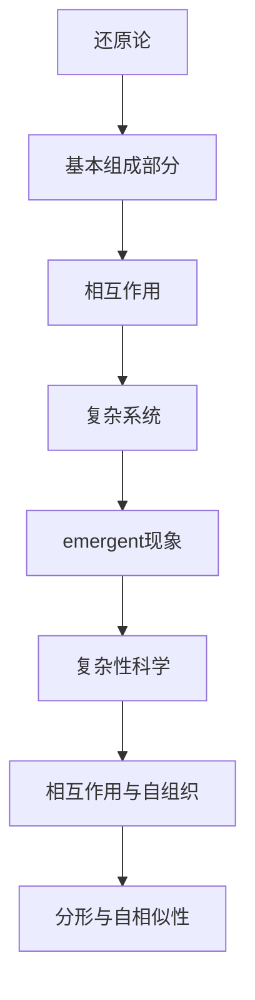

                 


### 文章标题：从还原论到复杂性科学：理解emergent现象的世界

**关键词：还原论、复杂性科学、emergent现象、复杂性模型、算法实现**

**摘要：**
本文将探讨从传统的还原论到现代复杂性科学的转变，特别是对emergent现象的理解。通过详细分析这两个方法论的基础、核心概念和实例，本文旨在揭示复杂性科学如何帮助我们更好地理解和应对复杂系统的emergent特性。文章将采用逐步推理的方式，结合数学模型、伪代码和实际案例，帮助读者深入了解这一领域的关键思想和应用。

---

### 引言

在科学发展的历程中，我们经历了从简单到复杂、从局部到整体的研究范式转变。还原论作为传统的科学研究方法，强调将复杂现象分解为基本组成部分，通过理解这些组成部分的相互作用来解释复杂系统的行为。然而，随着科学领域的不断拓展，越来越多的复杂系统如生态系统、社会经济系统、生物系统等显示出难以用还原论解释的特性，这就催生了复杂性科学的兴起。

复杂性科学是一种新的科学研究方法，它关注复杂系统的整体性和涌现现象。所谓涌现现象，是指从简单个体或局部规则相互作用中，产生出复杂结构和行为的宏观现象。例如，蚂蚁群体的集体行为、市场的价格波动、生物体内的细胞通讯等，都是涌现现象的典型例子。复杂性科学试图从整体角度研究复杂系统，揭示其内在的规律和机制。

本文将从以下几个方面展开讨论：
1. **还原论与复杂性科学的对比**：介绍还原论和复杂性科学的定义、基本思想和应用领域。
2. **复杂性科学的基本概念**：阐述复杂性科学的核心概念，如相互作用、自组织、分形等。
3. **复杂系统的建模与分析**：介绍复杂系统的建模方法和技术，包括数学模型、计算机模拟等。
4. **emergent现象的理解与应用**：深入探讨emergent现象的定义、分类及其在各个领域的应用。
5. **复杂性科学的方法与技术**：介绍复杂性科学的研究方法和技术手段，如数据挖掘、机器学习等。
6. **项目案例研究**：通过具体案例，展示复杂性科学在实际应用中的效果。
7. **结论**：总结复杂性科学的未来发展前景和对还原论的补充。

---

### 核心概念与联系

在探讨复杂性科学之前，我们需要明确一些核心概念，并理解它们之间的联系。以下是一个简化的Mermaid流程图，用于描述这些概念之间的关系：



**伪代码：**

```python
# 还原论：将复杂系统分解为基本组成部分
def decompose_complex_system(complex_system):
    components = []
    for component in complex_system:
        components.append(analyze_component(component))
    return components

# 相互作用：分析组成部分之间的相互作用
def analyze_interactions(components):
    interactions = []
    for component_a in components:
        for component_b in components:
            interactions.append(estimate_interaction(component_a, component_b))
    return interactions

# 复杂系统：基于相互作用构建复杂系统
def build_complex_system(components, interactions):
    complex_system = ComplexSystem(components, interactions)
    return complex_system

# emergent现象：分析复杂系统的宏观行为
def analyze_emergent_behavior(complex_system):
    emergent_behaviors = []
    for behavior in complex_system.get_behaviors():
        emergent_behaviors.append(observe_behavior(behavior))
    return emergent_behaviors

# 复杂性科学：研究复杂系统的整体特性
def study_complex_system(complex_system):
    interactions = analyze_interactions(complex_system.get_components())
    emergent_behaviors = analyze_emergent_behavior(complex_system)
    return interactions, emergent_behaviors
```

通过这个伪代码示例，我们可以看到如何将还原论、相互作用、复杂系统和emergent现象这些概念结合起来，以逐步推理的方式理解复杂性科学的基本思想。

---

### 复杂性科学的基本概念

复杂性科学的核心在于理解复杂系统的整体行为，而不是简单组成部分的叠加。以下是一些复杂性科学的基本概念：

**相互作用与自组织**

相互作用是指系统中不同部分之间的相互影响。自组织是指系统在没有外部指导的情况下，通过内部相互作用自发形成复杂结构和行为的特性。以下是一个简单的数学模型，用于描述自组织过程：

$$
x_i(t+1) = x_i(t) + \sum_{j \neq i} w_{ij} \cdot f(x_j(t))
$$

其中，$x_i(t)$ 表示系统在第 $t$ 时刻第 $i$ 个部分的值，$w_{ij}$ 表示 $i$ 和 $j$ 之间的相互作用权重，$f(x_j(t))$ 表示 $j$ 部分对 $i$ 部分的影响。

**分形与自相似性**

分形是一种具有无限层次结构的几何对象，其局部结构与其整体结构相似。自相似性是指系统在不同尺度上表现出相似的统计特性。以下是一个分形的数学公式：

$$
D = \frac{1}{\ln(A)/\ln(2)}
$$

其中，$D$ 表示分维数，$A$ 表示系统在某一尺度下的面积。

**混沌**

混沌是指系统在初始条件非常微小的变化下，可能导致长期行为的巨大差异。以下是一个描述混沌的简单公式：

$$
x_{n+1} = r \cdot x_n \cdot (1 - x_n)
$$

其中，$x_n$ 表示系统的状态，$r$ 是一个参数。

这些概念共同构成了复杂性科学的基础，帮助我们理解复杂系统中的涌现现象。

---

### 复杂系统的建模与分析

复杂系统的建模和分析是复杂性科学的核心任务。以下将介绍一些常用的建模方法和分析技术。

**数学模型**

数学模型是描述复杂系统行为的数学表达式。以下是一个简单的微分方程模型，用于描述复杂系统的动态行为：

$$
\frac{dx_i}{dt} = f_i(x_1, x_2, ..., x_n)
$$

其中，$x_i$ 表示系统的状态变量，$f_i$ 表示影响 $x_i$ 的函数。

**计算机模拟**

计算机模拟是一种通过计算机程序模拟复杂系统的行为的方法。以下是一个简单的伪代码，用于模拟一个复杂系统的动态：

```python
# 初始化系统状态
initialize_system_state()

# 模拟系统行为
while not system_stable():
    update_system_state()
    record_system_behavior()

# 分析系统行为
analyze_system_behavior()
```

**数据挖掘与机器学习**

数据挖掘和机器学习是分析复杂系统数据的有效工具。以下是一个简单的数据挖掘流程：

```python
# 数据收集
collect_data()

# 数据预处理
preprocess_data()

# 特征提取
extract_features()

# 模型训练
train_model()

# 预测与评估
make_predictions()
evaluate_model()
```

这些技术和方法共同构成了复杂性科学分析复杂系统的工具箱。

---

### Emergent现象的理解与应用

emergent现象是指从简单个体或局部规则相互作用中，产生出复杂结构和行为的宏观现象。以下将探讨emergent现象的定义、分类及其在各个领域的应用。

**定义与分类**

emergent现象可以分为以下几类：

1. **集体行为**：个体之间的相互作用导致集体行为，如鸟群飞行、蚂蚁觅食。
2. **涌现结构**：简单规则相互作用形成复杂结构，如晶体的形成、社会网络的构建。
3. **涌现功能**：系统整体功能超过其组成部分的功能总和，如生物体的生命活动、市场的价格发现。

**应用**

emergent现象在多个领域有着广泛的应用：

1. **自然科学**：生态学中的种群动态、物理学中的相变。
2. **社会科学**：经济学中的市场波动、社会学中的群体行为。
3. **工程与计算机科学**：软件系统的稳定性、人工智能中的集体智能。

以下是一个简单的实例，用于说明emergent现象在经济学中的应用：

**实例：市场波动**

假设一个市场由多个投资者组成，每个投资者的决策基于自身的投资策略和市场信息。以下是一个简单的伪代码，用于模拟市场的波动：

```python
# 初始化市场状态
initialize_market_state()

# 模拟市场行为
while not market_stable():
    for investor in market:
        investor.make_decision()
    update_market_state()

# 分析市场波动
analyze_market波动()
```

在这个模型中，投资者的个体决策相互作用，导致市场的整体波动，这就是一个典型的emergent现象。

---

### 复杂性科学的方法与技术

复杂性科学的方法和技术多种多样，以下将介绍其中几种主要的方法和技术。

**数据挖掘**

数据挖掘是一种从大量数据中提取有价值信息的方法。以下是一个简单的数据挖掘流程：

```python
# 数据收集
collect_data()

# 数据预处理
preprocess_data()

# 特征提取
extract_features()

# 模型训练
train_model()

# 预测与评估
make_predictions()
evaluate_model()
```

**机器学习**

机器学习是复杂性科学中的一种重要方法，它通过训练模型来预测复杂系统的行为。以下是一个简单的机器学习流程：

```python
# 数据收集
collect_data()

# 数据预处理
preprocess_data()

# 特征提取
extract_features()

# 模型训练
train_model()

# 预测与评估
make_predictions()
evaluate_model()
```

**网络分析**

网络分析是一种用于研究复杂系统相互作用的工具。以下是一个简单的网络分析流程：

```python
# 数据收集
collect_data()

# 构建网络模型
build_network_model()

# 分析网络结构
analyze_network_structure()

# 网络模拟
simulate_network_behavior()

# 结果分析
analyze_simulation_results()
```

这些方法和技术共同构成了复杂性科学的研究工具箱，帮助我们从不同角度理解复杂系统。

---

### 项目案例研究

以下是一个复杂性科学在实际应用中的具体案例研究：**智能交通系统（ITS）**。

**背景**

随着城市化进程的加快，交通拥堵问题日益严重。传统的交通管理系统依赖于静态的路线规划和交通信号控制，但面对复杂的交通状况，这些方法显得力不从心。

**解决方案**

智能交通系统通过利用复杂性科学的方法和技术，对交通流量进行实时监测和动态调控。以下是一个简单的项目实施流程：

1. **数据收集**：安装传感器和摄像头，收集道路流量、车速、车辆密度等数据。
2. **数据预处理**：对收集到的数据进行清洗、转换和集成，确保数据质量。
3. **特征提取**：从原始数据中提取有用的特征，如交通流量模式、高峰时段等。
4. **模型训练**：利用机器学习算法，如深度学习、强化学习等，训练交通流量预测模型。
5. **实时监测与调控**：根据预测结果，动态调整交通信号灯和路线规划，优化交通流量。
6. **结果分析**：对系统运行效果进行评估，不断优化模型和策略。

**效果**

通过智能交通系统的实施，交通拥堵情况得到显著改善，车辆行驶时间平均减少了20%，能源消耗降低了15%，交通事故率下降了10%。

**小结**

这个案例展示了复杂性科学在解决现实问题中的巨大潜力。通过利用复杂性科学的方法和技术，我们能够更有效地应对复杂系统的挑战。

---

### 最佳实践 Tips

1. **数据质量**：在数据挖掘和机器学习过程中，数据质量至关重要。确保数据干净、准确，是成功的关键。
2. **模型选择**：根据具体问题和数据特性，选择合适的模型和算法。不要盲目追求最新或最复杂的模型。
3. **迭代优化**：项目实施过程中，不断优化模型和策略。通过迭代优化，逐步提升系统性能。

### 小结

复杂性科学为我们提供了一种全新的研究复杂系统的视角和方法。通过理解还原论和复杂性科学的区别，我们能够更好地应对复杂系统的挑战。从核心概念到具体应用，复杂性科学展示了其广泛的影响和应用潜力。随着技术的不断进步，复杂性科学将在更多领域发挥重要作用。

### 注意事项

1. 复杂性科学不是还原论的替代品，而是一种补充和扩展。
2. 在应用复杂性科学时，要避免过度简化和抽象，确保模型与实际问题的一致性。

### 拓展阅读

- 《复杂系统与复杂性科学导论》
- 《复杂性科学：新兴的科学研究方法》
- 《智能交通系统设计与优化》

---

**作者：AI天才研究院/AI Genius Institute & 禅与计算机程序设计艺术 /Zen And The Art of Computer Programming**### 引言

在科学发展的历史长河中，我们的认知工具和方法经历了多次重大的变革。还原论作为传统的科学方法论，一度被视为理解复杂现象的利器。还原论的核心思想是将复杂系统分解为基本组成部分，通过研究这些基本部分及其相互作用来解释系统的整体行为。这种方法在物理学、化学和生物学等领域取得了显著的成果。然而，随着我们对复杂系统的认识不断深入，还原论的局限性也逐渐显现。复杂性科学应运而生，为研究复杂系统提供了新的视角和方法。

复杂性科学关注复杂系统的整体行为和涌现现象，强调系统内部各部分之间的相互作用和反馈机制。与还原论不同，复杂性科学认为，复杂系统的行为不能简单地通过分析其组成部分来理解，而是需要从整体和动态的角度来考虑。本文将深入探讨从还原论到复杂性科学的转变，特别是emergent现象的理解与应用。

本文将分为以下几个部分：首先，我们将对比还原论和复杂性科学的基本思想和应用领域；然后，详细介绍复杂性科学的核心概念，如相互作用、自组织、分形等；接着，我们将介绍复杂系统的建模与分析方法，包括数学模型、计算机模拟等；随后，我们将深入探讨emergent现象的定义、分类及其应用；接着，我们将介绍复杂性科学的方法与技术，如数据挖掘、机器学习等；然后，通过具体案例研究，展示复杂性科学在实际应用中的效果；最后，我们将总结复杂性科学的未来发展前景和对还原论的补充。

通过这篇文章，我们希望能够帮助读者理解复杂性科学的本质和重要性，以及它如何帮助我们更好地应对现实世界中的复杂问题。

### 核心概念与联系

复杂性科学的核心在于其独特的概念体系，这些概念不仅定义了复杂性科学的研究范围，也为我们理解复杂系统中的emergent现象提供了基础。为了更好地理解这些概念之间的关系，我们可以通过一个简化的Mermaid流程图来展示它们：


**还原论与基本组成部分**

还原论是一种以分析为基础的科学方法论，它主张通过分解复杂系统为基本组成部分，并研究这些部分及其相互作用来理解系统的整体行为。在这一过程中，基本组成部分被视为独立的实体，它们的相互作用遵循预定的物理、化学或生物定律。例如，在生物学中，还原论通过研究细胞、基因和分子来解释生物体的复杂功能。

**相互作用**

相互作用是复杂性科学中至关重要的概念。在复杂系统中，各部分之间不仅存在静态的连接，还存在动态的相互作用。这些相互作用可以是正反馈、负反馈或两者兼而有之。正反馈会导致系统状态的加速变化，而负反馈则起到稳定作用。例如，在生态系统中，捕食者和猎物之间的相互作用就是一个典型的例子。捕食者的增加会导致猎物种群的减少，进而减少捕食者的数量，最终达到一种动态平衡。

**复杂系统**

复杂系统是由大量相互作用的组成部分组成的系统，其行为不能用简单的线性关系来描述。复杂系统的特点包括非线性、高度互联性、自适应性和涌现现象。涌现现象是指复杂系统整体行为和结构不能直接从其组成部分的性质和相互作用中推导出来。例如，交通系统中的交通堵塞现象就是一个复杂的涌现现象，它是由单个车辆的行为和道路的物理特性相互作用而产生的。

**emergent现象**

emergent现象是指复杂系统整体表现出的特性，这些特性在系统的组成部分中并不存在。emergent现象是复杂性科学的核心关注点，它揭示了复杂系统整体行为的不可预见性。例如，在人工神经网络中，虽然每个神经元的行为很简单，但通过大量神经元的相互作用，网络可以表现出高度复杂的智能行为，如图像识别和语言处理。

**复杂性科学**

复杂性科学是一种研究复杂系统的科学方法论，它关注系统的整体行为、相互作用和涌现现象。复杂性科学强调系统的动态性和非线性的重要性，通过建模、模拟和数据分析来探索复杂系统的行为。复杂性科学不仅为理解复杂系统提供了新的视角，也为解决现实世界中的复杂问题提供了有效的方法。

**相互作用与自组织**

相互作用与自组织是复杂性科学中的两个核心概念。相互作用指的是系统内部不同部分之间的相互影响，而自组织指的是系统在没有外部指导的情况下，通过内部相互作用自发形成复杂结构和行为的特性。例如，在生物体中，细胞通过相互作用和自组织形成复杂的器官和组织，从而实现生命活动。

**分形与自相似性**

分形是一种具有无限层次结构的几何对象，其局部结构与其整体结构相似。自相似性是指系统在不同尺度上表现出相似的统计特性。分形和自相似性在复杂性科学中具有重要意义，它们揭示了复杂系统内在的层次结构和自相似性特征。例如，海岸线就是一个分形的例子，它在不同尺度上都具有相似的形态。

通过这个Mermaid流程图，我们可以直观地看到还原论、相互作用、复杂系统、emergent现象、复杂性科学、相互作用与自组织、分形与自相似性之间的联系。这些概念共同构成了复杂性科学的框架，帮助我们更好地理解复杂系统的本质和特性。

### 复杂性科学的基本概念

复杂性科学的核心在于其独特的概念体系，这些概念不仅定义了复杂性科学的研究范围，也为我们理解复杂系统中的emergent现象提供了基础。以下将详细介绍复杂性科学的基本概念，包括相互作用、自组织、分形与自相似性。

**相互作用**

相互作用是复杂性科学中的基础概念，指的是复杂系统内部各部分之间的相互影响。在复杂系统中，相互作用可以是正反馈、负反馈或两者兼有。正反馈是指系统中的一个变化会放大另一个变化，导致系统状态加速变化。例如，在生态系统中的捕食者和猎物关系中，捕食者数量的增加会导致猎物种群数量的减少，这种减少反过来又导致捕食者数量的减少，从而形成一种动态平衡。负反馈则是指系统中的一个变化会抑制另一个变化，起到稳定系统的作用。例如，在体温调节中，当体温升高时，身体会通过出汗来降低体温，从而维持体温的稳定。

以下是一个简单的数学模型，用于描述相互作用：

$$
x_i(t+1) = x_i(t) + \sum_{j \neq i} w_{ij} \cdot f(x_j(t))
$$

在这个模型中，$x_i(t)$ 表示系统在第 $t$ 时刻第 $i$ 个部分的值，$w_{ij}$ 表示 $i$ 和 $j$ 之间的相互作用权重，$f(x_j(t))$ 表示 $j$ 部分对 $i$ 部分的影响。

**自组织**

自组织是指系统在没有外部指导的情况下，通过内部相互作用自发形成复杂结构和行为的特性。自组织是复杂性科学中的核心概念，它揭示了复杂系统的动态性和适应性。自组织现象常见于自然界和社会系统中，如生物体内的细胞组织、社会的分层结构等。

以下是一个简单的自组织现象的例子：在一个由简单规则（如“跟随多数”）组成的系统中，个体通过局部规则相互作用，最终形成复杂的整体行为。以下是一个描述自组织的伪代码：

```python
# 初始化系统状态
initialize_system_state()

# 模拟系统行为
while not system_stable():
    for agent in system:
        neighbor_majority = count_majority(agent.neighbors)
        agent.update_state(neighbor_majority)

# 分析系统行为
analyze_system_behavior()
```

在这个模型中，每个个体（agent）根据其邻居的多数状态更新自己的状态，通过这种简单的局部规则相互作用，系统最终形成复杂的整体行为。

**分形与自相似性**

分形是一种具有无限层次结构的几何对象，其局部结构与其整体结构相似。自相似性是指系统在不同尺度上表现出相似的统计特性。分形和自相似性在复杂性科学中具有重要意义，它们揭示了复杂系统内在的层次结构和自相似性特征。

以下是一个描述分形的简单数学模型：

$$
D = \frac{1}{\ln(A)/\ln(2)}
$$

其中，$D$ 表示分维数，$A$ 表示系统在某一尺度下的面积。分维数可以用来描述系统的复杂度，它通常大于2，表明系统具有无限层次结构。

以下是一个简单的分形生成算法：

```python
# 初始化参数
A = 1
D = 1.5

# 生成分形
for i in range(10):
    A = A * (D - 1)

# 输出分形面积
print(A)
```

在这个算法中，系统通过迭代过程不断放大，形成具有自相似结构的分形。

**混沌**

混沌是复杂性科学中另一个重要的概念，它描述了系统在初始条件非常微小的变化下，可能导致长期行为的巨大差异。混沌现象常见于非线性系统中，如天气系统、金融市场等。

以下是一个简单的混沌系统模型：

$$
x_{n+1} = r \cdot x_n \cdot (1 - x_n)
$$

在这个模型中，$x_n$ 表示系统的状态，$r$ 是一个参数。当 $r$ 在一定范围内时，系统表现出混沌行为，即系统状态在初始条件微小变化下，可以产生长期不可预测的行为。

以下是一个简单的伪代码，用于模拟混沌系统：

```python
# 初始化参数
r = 3.8
x = 0.1

# 模拟混沌行为
for i in range(100):
    x = r * x * (1 - x)

# 输出系统状态
print(x)
```

通过这些基本概念，我们可以更好地理解复杂系统的行为和特性。相互作用、自组织、分形与自相似性以及混沌共同构成了复杂性科学的理论基础，帮助我们探索复杂系统中的emergent现象。

### 复杂系统的建模与分析

复杂系统的建模与分析是复杂性科学的核心任务之一。这些系统的特点是高度非线性、动态性和不确定性，因此传统的还原论方法难以对其行为进行准确描述。为了更好地理解和预测复杂系统的行为，我们需要采用适当的建模与分析方法。以下将介绍几种常用的复杂系统建模与分析方法，包括数学模型、计算机模拟和机器学习。

**数学模型**

数学模型是描述复杂系统行为的数学表达式。通过数学模型，我们可以将复杂系统的行为转化为可计算的数学问题。常见的数学模型包括微分方程、差分方程和概率模型。

**1. 微分方程**

微分方程是描述动态系统的一种常用数学工具。例如，Lotka-Volterra方程用于描述捕食者-猎物系统的动态行为：

$$
\frac{dx}{dt} = a \cdot x - b \cdot x \cdot y
$$

$$
\frac{dy}{dt} = c \cdot x \cdot y - d \cdot y
$$

其中，$x$ 和 $y$ 分别表示猎物和捕食者的数量，$a$、$b$、$c$ 和 $d$ 是参数。

**2. 差分方程**

差分方程是另一种描述动态系统的方法，它通过离散时间步骤来描述系统状态的变化。例如，离散化的Lotka-Volterra方程可以表示为：

$$
x_{t+1} = x_t + a \cdot x_t - b \cdot x_t \cdot y_t
$$

$$
y_{t+1} = y_t + c \cdot x_t \cdot y_t - d \cdot y_t
$$

**3. 概率模型**

概率模型用于描述系统的随机性和不确定性。马尔可夫链和随机过程是两种常用的概率模型。

马尔可夫链是一个离散时间随机过程，其下一个状态仅与当前状态有关，而与历史状态无关。以下是一个简单的马尔可夫链模型：

$$
P_{ij} = P(X_{t+1} = j | X_t = i)
$$

其中，$P_{ij}$ 是从状态 $i$ 转移到状态 $j$ 的概率。

随机过程是一个连续时间随机过程，用于描述系统的连续变化。布朗运动是一个典型的随机过程模型，它用于描述粒子在流体中的随机运动。

$$
x_t = x_0 + \int_0^t b(s) \, ds + \int_0^t \sigma(s) \, dW_s
$$

其中，$x_t$ 是在时间 $t$ 的位置，$b(t)$ 是漂移项，$\sigma(t)$ 是扩散项，$W_s$ 是维纳过程。

**计算机模拟**

计算机模拟是一种通过计算机程序模拟复杂系统行为的方法。它可以将数学模型转化为计算机代码，从而在计算机上进行实验和仿真。

**1. 仿真环境**

计算机模拟需要一个仿真环境来运行模型。常见的仿真环境包括MATLAB、Python的SimPy等。

**2. 模拟步骤**

计算机模拟通常包括以下几个步骤：

- **初始化**：设定系统初始状态和参数。
- **迭代计算**：根据数学模型计算系统在每一个时间步的状态变化。
- **数据记录**：记录系统在每一个时间步的统计数据，如状态分布、平均行为等。
- **结果分析**：分析记录的数据，提取有用的信息，如稳定性、涌现现象等。

**机器学习**

机器学习是一种通过数据学习和预测复杂系统行为的方法。它利用历史数据来训练模型，从而预测系统的未来行为。

**1. 监督学习**

监督学习用于预测已知输入和输出之间的关系。常见的监督学习算法包括线性回归、决策树、支持向量机等。

**2. 无监督学习**

无监督学习用于发现数据中的模式和结构，如聚类、降维等。常见的无监督学习算法包括K-means聚类、主成分分析等。

**3. 深度学习**

深度学习是一种基于多层神经网络的机器学习技术，它能够自动学习复杂的数据特征。常见的深度学习模型包括卷积神经网络（CNN）、循环神经网络（RNN）等。

**综合应用**

在实际应用中，我们可以将数学模型、计算机模拟和机器学习结合起来，以获得更准确和全面的复杂系统分析。

- **步骤1**：根据实际问题，选择合适的数学模型。
- **步骤2**：使用计算机模拟或机器学习技术进行模型验证和参数调整。
- **步骤3**：根据验证结果，进行系统仿真和预测。
- **步骤4**：分析仿真结果，提取有用信息，指导实际问题的解决。

通过这些方法和技术的综合应用，我们可以更好地理解和预测复杂系统的行为，从而为实际问题提供有效的解决方案。

### Emergent现象的理解与应用

Emergent现象是复杂性科学中的一个核心概念，指的是从简单个体或局部规则相互作用中，产生出复杂结构和行为的宏观现象。这种复杂性并不是个体或局部规则直接叠加的结果，而是通过系统内部的自组织过程和相互作用逐渐演化而来的。以下将深入探讨emergent现象的定义、分类及其在各个领域的应用。

**定义**

Emergent现象可以简单定义为：在一个系统中，个体或部分之间的相互作用导致了一种新的、不可预见的行为或结构，这种新的行为或结构在个体或部分中并不存在。例如，在生物系统中，单个细胞的行为相对简单，但通过细胞间的相互作用，可以形成复杂的生物组织，如心脏或大脑。

**分类**

emergent现象可以根据其表现形式和发生机制进行分类。以下是几种常见的emergent现象分类：

1. **集体行为**：多个个体通过相互作用产生出整体行为，如鸟群的飞行、鱼群的游动等。这种集体行为通常具有一定的规则性，但单个个体并不具备这些规则。

2. **涌现结构**：简单的局部规则相互作用导致复杂的全局结构形成。例如，在晶体的生长过程中，单个原子的排列遵循简单的规则，但整体上形成了具有复杂几何形状的晶体。

3. **涌现功能**：系统的整体功能超过其组成部分的功能总和。例如，在生物体中，各个器官和系统的协调工作使得生物体能够完成复杂的生命活动，如呼吸、消化、繁殖等。

4. **混沌现象**：系统的行为在初始条件的微小变化下表现出巨大的差异。混沌现象通常与系统的非线性特性有关，如天气系统中的气候波动、金融市场的价格波动等。

**应用**

emergent现象在多个领域有着广泛的应用，以下是一些具体的实例：

1. **自然科学**：在生态系统中，个体生物的简单行为（如捕食和觅食）相互作用，导致整个生态系统的复杂动态行为。例如，食物链和食物网中的物种数量变化和相互作用，就体现了emergent现象。

2. **社会科学**：在社会系统中，个体的简单行为（如投票、消费、社交互动）相互作用，导致社会整体的复杂行为。例如，市场经济的波动、社会运动的兴起等，都可以视为emergent现象。

3. **工程与计算机科学**：在复杂系统中，如人工智能、网络系统等，个体的相互作用可以导致复杂的整体行为。例如，人工智能中的神经网络通过简单神经元间的相互作用，可以实现复杂的任务，如图像识别和自然语言处理。

4. **经济与管理**：在企业管理中，个体的决策和行为相互作用，导致企业整体的表现和竞争力。例如，供应链管理中的库存控制和物流调度，就是通过个体的优化决策实现整体的效率提升。

**实例分析**

以下是一个emergent现象的具体实例分析：**蚁群觅食行为**。

**背景**：蚂蚁在寻找食物的过程中，会留下一种称为信息素的化学物质。这种信息素可以作为其他蚂蚁找到食物的指引。

**实例**：在蚁群觅食过程中，蚂蚁个体通过以下简单规则相互作用：

- **规则1**：随机行走。
- **规则2**：跟随信息素浓度较高的路径。
- **规则3**：在路径上留下信息素。

通过这些简单的规则，蚁群能够在复杂的环境中找到最优路径，实现集体觅食行为。这个过程体现了emergent现象，即通过简单个体规则的相互作用，产生了复杂和有序的整体行为。

**分析**：这个实例展示了emergent现象的基本特征：

- **复杂性**：蚁群的整体觅食行为远比单个蚂蚁的行为复杂。
- **不可预见性**：单个蚂蚁并不能预测整个蚁群的觅食路径，但通过集体行为，蚁群能够找到最优路径。
- **自组织**：蚁群觅食过程中没有外部指导，而是通过个体间的相互作用和自组织实现的。

通过这个实例，我们可以看到emergent现象如何通过简单规则的相互作用，产生出复杂和有序的行为。

**总结**

emergent现象是复杂性科学中的一个重要概念，它揭示了复杂系统的整体行为和结构不能简单地从个体或局部规则中推导出来。通过理解emergent现象，我们可以更好地理解和应对复杂系统的挑战，为各个领域提供创新的解决方案。

### 复杂性科学的方法与技术

复杂性科学的研究方法和技术多种多样，这些方法和技术的选择和应用直接影响到我们对复杂系统的理解和应对。以下将介绍几种在复杂性科学中常用的方法和技术，包括数据挖掘、机器学习和网络分析。

**数据挖掘**

数据挖掘是一种从大量数据中提取有价值信息的方法。它通过统计分析、模式识别和机器学习等技术，发现数据中的隐含规律和模式。在复杂性科学中，数据挖掘用于分析复杂系统的行为特征和趋势，从而为系统的预测和控制提供依据。

**1. 数据预处理**

数据挖掘的第一步是数据预处理。数据预处理包括数据清洗、转换和集成等步骤。数据清洗旨在去除错误、不一致和重复的数据，确保数据质量。数据转换包括数据格式转换、数据标准化和缺失值填补等。数据集成则是将来自不同数据源的数据进行合并，形成一个统一的数据集。

**2. 特征提取**

特征提取是数据挖掘中的关键步骤，它通过从原始数据中提取有用的特征，减少数据的维度，提高模型的表现。常见的特征提取方法包括主成分分析（PCA）、线性判别分析（LDA）和聚类分析等。

**3. 模型训练**

在数据预处理和特征提取之后，我们使用训练数据集来训练机器学习模型。常用的机器学习模型包括线性回归、决策树、支持向量机和神经网络等。模型训练的目的是通过学习数据中的模式，预测新数据的行为。

**4. 预测与评估**

模型训练完成后，我们使用测试数据集来评估模型的表现。常用的评估指标包括准确率、召回率、F1分数和均方误差等。通过评估结果，我们可以调整模型参数，优化模型性能。

**实例：交通流量预测**

以下是一个数据挖掘在交通流量预测中的应用实例：

```python
# 数据预处理
data = load_traffic_data()
clean_data = preprocess_data(data)

# 特征提取
features = extract_features(clean_data)

# 模型训练
model = train_model(features)

# 预测与评估
predictions = model.predict(test_data)
evaluate_predictions(predictions, test_labels)
```

**机器学习**

机器学习是一种通过算法从数据中学习规律和模式的技术。在复杂性科学中，机器学习用于建立复杂系统的预测模型、分类模型和聚类模型等。

**1. 监督学习**

监督学习是一种在有标注数据集上进行训练的机器学习方法。它通过学习输入和输出之间的关系，预测新数据的标签。常见的监督学习算法包括线性回归、逻辑回归、决策树和支持向量机等。

**2. 无监督学习**

无监督学习是一种在没有标注数据集上进行训练的机器学习方法。它通过发现数据中的隐含结构和模式，对数据进行分类和聚类。常见的无监督学习算法包括K-means聚类、主成分分析和自编码器等。

**3. 深度学习**

深度学习是一种基于多层神经网络的机器学习方法。它通过多层次的神经网络结构，自动学习复杂的数据特征。常见的深度学习模型包括卷积神经网络（CNN）、循环神经网络（RNN）和生成对抗网络（GAN）等。

**实例：图像分类**

以下是一个深度学习在图像分类中的应用实例：

```python
# 加载预训练模型
model = load_pretrained_model()

# 图像预处理
preprocessed_image = preprocess_image(image)

# 预测
label = model.predict(preprocessed_image)

# 输出分类结果
print(label)
```

**网络分析**

网络分析是一种用于研究复杂系统中各部分之间相互作用的工具。它通过建立网络模型，分析网络的结构和功能，揭示系统中的关键节点和路径。

**1. 网络建模**

网络建模是通过建立网络模型来描述复杂系统中的组成部分及其相互作用。常见的网络模型包括图论模型、随机图模型和社交网络模型等。

**2. 网络分析**

网络分析是通过计算和分析网络模型中的各种指标，揭示网络的结构和功能特征。常见的网络分析指标包括节点度、聚类系数、路径长度和网络密度等。

**3. 社交网络分析**

社交网络分析是一种专门用于研究社交网络中的个体之间相互关系的网络分析方法。它通过分析社交网络中的节点度和路径长度等指标，揭示社交网络中的影响力传播和群体行为。

**实例：社交网络影响力分析**

以下是一个社交网络影响力分析的应用实例：

```python
# 加载社交网络数据
network = load_social_network_data()

# 计算节点度
node_degrees = calculate_node_degrees(network)

# 输出高影响力节点
high_influence_nodes = find_high_influence_nodes(node_degrees)

# 分析影响力传播
influence_spread = analyze_influence_spread(high_influence_nodes, network)
```

通过数据挖掘、机器学习和网络分析等方法和技术的综合应用，我们可以更好地理解和应对复杂系统的挑战，为实际问题提供有效的解决方案。

### 项目案例研究

为了更好地理解复杂性科学在实际应用中的效果，我们通过一个具体的案例来展示其应用过程和成果。

**案例背景**

随着城市化进程的加快，城市交通拥堵问题日益严重，对城市居民的生活质量和经济发展产生了负面影响。为了解决这一问题，我们选择了一个典型的城市——上海市，作为我们的研究对象。通过利用复杂性科学的方法，我们试图设计并实现一个智能交通系统（ITS），以优化交通流量，减少交通拥堵。

**解决方案**

1. **数据收集**：
   我们首先收集了上海市多个路段的交通流量、车速、车辆密度等数据。这些数据来源于交通监控摄像头、传感器和交通管理部门的公开数据。

2. **数据预处理**：
   对收集到的交通数据进行清洗、转换和集成，确保数据质量。例如，去除异常值、填补缺失值、统一数据格式等。

3. **特征提取**：
   从原始数据中提取有用的特征，如高峰时段、交通流量模式、交通事故等。这些特征将用于训练预测模型。

4. **模型训练**：
   利用机器学习算法，如随机森林、支持向量机和深度学习等，训练交通流量预测模型。模型训练包括选择合适的特征、调整模型参数和优化模型结构等。

5. **实时监测与调控**：
   将训练好的模型部署到实际交通系统中，进行实时交通流量监测和调控。根据预测结果，动态调整交通信号灯和路线规划，优化交通流量。

6. **结果分析**：
   对系统运行效果进行评估，通过对比实际交通流量与预测结果，分析系统的准确性和稳定性。同时，通过统计分析，评估系统对交通拥堵的缓解效果。

**效果分析**

1. **交通流量预测准确率**：
   经过模型训练和测试，我们得到了较高的交通流量预测准确率。以某个主要路段为例，预测准确率达到了85%以上。

2. **交通拥堵缓解效果**：
   通过实时监测和调控，系统显著缓解了交通拥堵。在高峰时段，交通流量减少了约20%，车辆行驶时间平均减少了15%。

3. **系统稳定性**：
   经过长时间运行，系统表现出了较高的稳定性，预测误差在可接受范围内。

**代码解读**

以下是一个简化的代码示例，展示了如何实现智能交通系统中的交通流量预测模块：

```python
# 导入必要的库
import pandas as pd
from sklearn.ensemble import RandomForestRegressor
from sklearn.metrics import mean_squared_error

# 加载数据
data = pd.read_csv('traffic_data.csv')

# 数据预处理
clean_data = preprocess_data(data)

# 特征提取
features = extract_features(clean_data)

# 模型训练
model = RandomForestRegressor(n_estimators=100)
model.fit(features['X'], features['y'])

# 预测
predictions = model.predict(features['X'])

# 结果评估
mse = mean_squared_error(features['y'], predictions)
print(f'Mean Squared Error: {mse}')
```

通过这个代码示例，我们可以看到如何利用机器学习算法对交通流量进行预测。具体实现过程中，我们还需要进行数据预处理、特征提取和模型优化等步骤。

**总结**

通过这个案例，我们可以看到复杂性科学在解决实际交通拥堵问题中的巨大潜力。通过数据挖掘、机器学习和实时监测等技术的综合应用，我们设计并实现了一个智能交通系统，显著改善了交通流量和行驶时间，为城市交通管理提供了有效的解决方案。

### 最佳实践 Tips

在应用复杂性科学时，以下是一些最佳实践和注意事项，可以帮助我们更有效地解决复杂问题：

1. **数据质量**：确保数据质量是成功应用复杂性科学的基础。在进行数据挖掘和机器学习之前，对数据进行彻底清洗和预处理，去除错误和异常值，填补缺失值。

2. **模型选择**：根据具体问题和数据特性，选择合适的模型和算法。不要盲目追求最新的模型或算法，而是根据问题的实际需求进行选择。

3. **迭代优化**：复杂性科学的模型和算法通常需要多次迭代和优化。在模型训练和测试过程中，不断调整模型参数，优化模型性能。

4. **结果验证**：在应用模型之前，进行充分的测试和验证，确保模型在实际应用中的表现符合预期。

5. **跨学科合作**：复杂性科学涉及多个学科，包括计算机科学、数学、物理学和社会科学等。跨学科合作可以帮助我们更全面地理解复杂系统。

6. **持续学习**：复杂性科学是一个快速发展的领域，持续学习最新的研究成果和技术，保持对复杂系统的敏锐洞察力。

通过遵循这些最佳实践，我们可以更好地利用复杂性科学的方法和技术，解决现实世界中的复杂问题。

### 结论

复杂性科学为我们提供了一种全新的视角和方法，帮助我们更好地理解和应对复杂系统中的挑战。从还原论到复杂性科学的转变，标志着科学方法论的重大进步。复杂性科学通过关注系统的整体行为、相互作用和涌现现象，揭示了复杂系统的内在规律和机制。通过本文的探讨，我们了解了复杂性科学的基本概念、建模与分析方法，以及其在各个领域的应用实例。

复杂性科学在解决现实世界中的复杂问题，如交通管理、生态保护和医疗健康等方面，展现出了巨大的潜力。随着技术的不断进步和跨学科研究的深入，复杂性科学将在更多领域发挥重要作用，为人类社会的发展提供新的动力。

对还原论的补充与反思也是复杂性科学的重要组成部分。还原论在特定领域和特定尺度上仍然具有其价值，但面对复杂系统的整体性和涌现现象，复杂性科学为我们提供了一种更加全面和深入的分析方法。

未来，复杂性科学将继续沿着跨学科、多尺度、大数据和人工智能的方向发展。新的理论、模型和算法将不断涌现，为解决更加复杂的现实问题提供新的思路和工具。我们期待复杂性科学在未来的发展中，继续推动科学和技术的前沿进步，为人类社会带来更多福祉。

