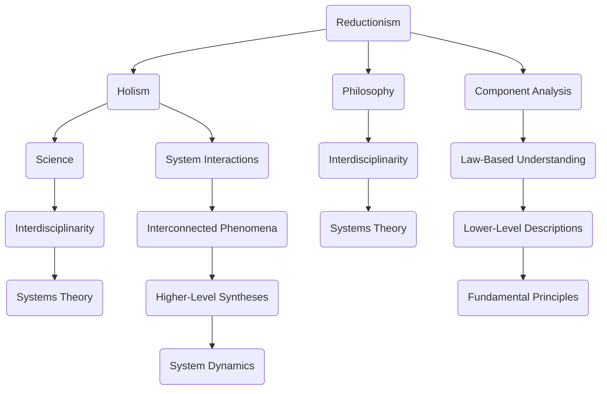

                 


### Introduction to "From Reductionism to Holism: Paradigm Shift in the Universe View"

#### Title and Keywords

**Title:** "From Reductionism to Holism: Paradigm Shift in the Universe View"  
**Keywords:** Reductionism, Holism, Paradigm Shift, Universe View, Core Algorithms, Mathematical Models

#### Abstract

In this article, we embark on an exploration of the profound shift from reductionism to holism in our understanding of the universe. We begin by defining reductionism and holism, tracing their historical development and highlighting their significance in shaping scientific paradigms. Through a series of well-structured chapters, we delve into the fundamental principles of core algorithms and mathematical models associated with both approaches. We then provide practical case studies and detailed code implementations to illustrate their application in cosmology and biology. Finally, we conclude by summarizing the key insights and offering guidance on best practices for integrating reductionist and holistic methodologies in future research.

### Core Concepts and Connections

**Chapter 2: Core Concepts and Their Interconnections**

#### 2.1 Definition and History of Reductionism

**2.1.1 Definition of Reductionism:**

Reductionism is a philosophical and scientific approach that posits that complex systems can be understood by reducing them to their simplest components. It asserts that higher-level phenomena are merely the result of interactions among more fundamental elements. Reductionism has its roots in the Enlightenment era, with key figures such as Francis Bacon and René Descartes championing the importance of breaking down complex phenomena into their constituent parts.

**2.1.2 Historical Development of Reductionism:**

The development of reductionism is closely tied to the progress of science, particularly in the 18th and 19th centuries. During this time, the scientific community was focused on uncovering the underlying laws governing the natural world. Key advancements in physics, chemistry, and biology, such as Isaac Newton's laws of motion and the atomic theory of John Dalton, were instrumental in promoting the reductionist perspective.

**2.1.3 Key Contributors to Reductionism:**

- **Francis Bacon:** Promoted the empirical method and emphasized the importance of observing and understanding natural phenomena through experimentation.
- **René Descartes:** Developed the conceptual framework for modern science, emphasizing the role of reason and logic in understanding the natural world.
- **Isaac Newton:** Formulated the laws of motion and gravitation, which laid the groundwork for the physical sciences.
- **John Dalton:** Proposed the atomic theory, which revolutionized chemistry.

#### 2.2 Definition and History of Holism

**2.2.1 Definition of Holism:**

Holism is an approach that views complex systems as inherently interconnected and interdependent. It emphasizes that the properties of a system cannot be fully understood by examining its individual components in isolation. Instead, holism requires a consideration of the relationships and interactions between these components. This perspective has gained prominence in recent decades, particularly in fields such as ecology, systems theory, and quantum physics.

**2.2.2 Historical Development of Holism:**

The concept of holism can be traced back to ancient philosophy, with figures such as Aristotle and Heraclitus advocating for a holistic understanding of the world. In the modern era, holism has been advanced by thinkers such as Alfred North Whitehead and Arthur Koestler. The rise of systems theory in the mid-20th century further reinforced the importance of holism in scientific inquiry.

**2.2.3 Key Contributors to Holism:**

- **Aristotle:** Emphasized the interconnectedness of natural phenomena and the importance of studying whole systems.
- **Heraclitus:** Advocated for a holistic view of the universe, emphasizing the unity of all things.
- **Alfred North Whitehead:** Developed process philosophy, which views reality as a network of interconnected events.
- **Arthur Koestler:** Explored the concept of "holonic structures" in his work on systems theory and creativity.

#### 2.3 Mermaid Diagram Illustrating the Relationship Between Reductionism and Holism



This mermaid diagram illustrates the interconnectedness between reductionism and holism. Both approaches have their roots in philosophy and science, with holism emphasizing the importance of system interactions and reductionism focusing on component analysis. Together, they provide a comprehensive understanding of complex systems from both a lower-level and a higher-level perspective.

### Fundamental Principles of Core Algorithms

**Chapter 3: Fundamental Principles of Core Algorithms**

#### 3.1 Overview of Reductionist Algorithms

**3.1.1 Definition of Reductionist Algorithms:**

Reductionist algorithms are designed to break down complex systems into their simplest components. By focusing on individual elements and their interactions, these algorithms aim to uncover the underlying principles that govern the system's behavior. This approach is particularly useful in fields such as physics, chemistry, and biology, where understanding the fundamental building blocks is crucial.

**3.1.2 Key Characteristics of Reductionist Algorithms:**

- **Component Analysis:** Reductionist algorithms prioritize the analysis of individual components and their interactions.
- **Law-Based Understanding:** These algorithms rely on the application of established laws and principles, such as Newton's laws of motion or the laws of thermodynamics.
- **Simplicity:** Reductionist algorithms aim to simplify complex systems by focusing on the most fundamental elements.

**3.1.3 Pseudo-code for Reductionist Algorithms:**

```markdown
# Pseudo-code for a Reductionist Algorithm

# Initialize the system with initial conditions
system_initialize()

# Define the components and their interactions
define_components()

# Set up the simulation environment
simulation_environment()

# Iterate through time steps
for time_step in range(number_of_steps):
    # Update the state of each component
    update_components()

    # Calculate the interactions between components
    calculate_interactions()

    # Record the results
    record_results()

# Analyze the results
analyze_results()
```

#### 3.2 Overview of Holistic Algorithms

**3.2.1 Definition of Holistic Algorithms:**

Holistic algorithms are designed to take into account the interconnections and interactions between components within a system. By focusing on the system as a whole rather than its individual parts, these algorithms aim to capture the emergent properties and behaviors of complex systems. This approach is particularly useful in fields such as ecology, economics, and social sciences, where the interactions between elements play a crucial role.

**3.2.2 Key Characteristics of Holistic Algorithms:**

- **System Interactions:** Holistic algorithms prioritize the study of system interactions and their effects on the overall behavior.
- **Emergent Properties:** These algorithms aim to uncover the emergent properties that arise from the interactions between components.
- **Complexity Management:** Holistic algorithms employ techniques for managing the complexity of large-scale systems.

**3.2.3 Pseudo-code for Holistic Algorithms:**

```markdown
# Pseudo-code for a Holistic Algorithm

# Initialize the system with initial conditions
system_initialize()

# Define the components and their interactions
define_components()

# Set up the simulation environment
simulation_environment()

# Iterate through time steps
for time_step in range(number_of_steps):
    # Update the state of each component
    update_components()

    # Calculate the interactions between components
    calculate_interactions()

    # Identify and analyze emergent properties
    analyze_emergent_properties()

    # Record the results
    record_results()

# Analyze the results
analyze_results()
```

By comparing the pseudo-code for reductionist and holistic algorithms, we can see that both approaches involve similar steps, such as updating component states and recording results. However, the key difference lies in the focus of the analysis: reductionist algorithms prioritize component interactions, while holistic algorithms prioritize emergent properties and system interactions.

### Mathematical Models and Formulas

**Chapter 4: Mathematical Models and Formulas**

#### 4.1 Mathematical Foundations of Reductionism

**4.1.1 Detailed Explanation of Key Formulas**

**4.1.1.1 Newton's Laws of Motion:**

Isaac Newton's laws of motion are foundational to classical mechanics and provide a framework for understanding the motion of objects. The three laws are:

1. **Law of Inertia:** An object at rest tends to stay at rest, and an object in motion tends to stay in motion with the same speed and in the same direction unless acted upon by an unbalanced force.
2. **Law of Acceleration:** The acceleration of an object is directly proportional to the net force acting on it and inversely proportional to its mass.
3. **Law of Action and Reaction:** For every action, there is an equal and opposite reaction.

**4.1.1.2 Law of Thermodynamics:**

The laws of thermodynamics govern the behavior of energy and matter in physical systems. The three laws are:

1. **First Law:** Energy cannot be created or destroyed, only transferred or converted from one form to another.
2. **Second Law:** The entropy of an isolated system tends to increase over time.
3. **Third Law:** As the temperature of a system approaches absolute zero, its entropy approaches a minimum value.

**4.1.1.3 Key Formulas:**

$$
F = ma \\
W = F \cdot d \\
E = \frac{1}{2}mv^2 \\
\Delta U = Q - W \\
\Delta S = \frac{\Delta Q}{T} \\
S = k \ln \Omega
$$

**4.1.2 Example of Using the Formulas**

**Example 1: Calculating the Force Required to Accelerate an Object:**

Suppose we want to accelerate a 10-kg object from 0 m/s to 5 m/s in 2 seconds. We can use Newton's second law to calculate the required force:

$$
F = ma = (10 \text{ kg}) \cdot (2.5 \text{ m/s}^2) = 25 \text{ N}
$$

**Example 2: Calculating the Work Done by a Force:**

Suppose a force of 20 N is applied to move an object a distance of 4 meters. The work done is:

$$
W = F \cdot d = (20 \text{ N}) \cdot (4 \text{ m}) = 80 \text{ J}
$$

#### 4.2 Mathematical Foundations of Holism

**4.2.1 Detailed Explanation of Key Formulas**

**4.2.1.1 Chaos Theory:**

Chaos theory is the study of complex dynamical systems that exhibit sensitive dependence on initial conditions, leading to a high degree of unpredictability. Key concepts include:

1. **Butterfly Effect:** Small changes in initial conditions can lead to significant differences in outcomes over time.
2. ** attractors:** Regions in phase space where the system's trajectory converges.

**4.2.1.2 Complex Systems:**

Complex systems are composed of many interconnected components that exhibit emergent properties and are highly sensitive to initial conditions. Key concepts include:

1. **Self-Organization:** The formation of complex structures and patterns from simple interactions.
2. **Emergence:** The appearance of new properties at the system level that are not present at the individual component level.

**4.2.1.3 Key Formulas:**

$$
x_{n+1} = r \cdot x_n \cdot (1 - x_n) \\
\Omega = \frac{1}{N} \sum_{i=1}^{N} \omega_i \\
P(A \cap B) = P(A) \cdot P(B|A)
$$

**4.2.2 Example of Using the Formulas**

**Example 1: Lorenz Attractor:**

The Lorenz attractor is a set of chaotic solutions to the Lorenz system of differential equations. The system is defined by the following equations:

$$
\dot{x} = \sigma(y - x) \\
\dot{y} = rx - xy - z \\
\dot{z} = xy - \beta z
$$

where \( r \), \( \sigma \), and \( \beta \) are parameters. Solving these equations can generate the characteristic butterfly shape of the Lorenz attractor.

**Example 2: Probabilistic Interactions:**

Suppose we have two events, A and B, with probabilities \( P(A) = 0.3 \) and \( P(B|A) = 0.6 \). The probability of both events occurring, \( P(A \cap B) \), can be calculated as:

$$
P(A \cap B) = P(A) \cdot P(B|A) = (0.3) \cdot (0.6) = 0.18
$$

### Case Studies and Practical Applications

**Chapter 5: Case Studies and Practical Applications**

#### 5.1 Case Study of Reductionist Approach in Cosmology

**5.1.1 Project Setup and Environment**

**5.1.1.1 Introduction:**

In this case study, we will explore the reductionist approach in cosmology by analyzing the behavior of individual particles in the early universe. We will use a Python-based simulation environment to study the interactions between particles and their effect on the overall structure of the universe.

**5.1.1.2 Tools and Technologies:**

- **Python:** The primary programming language for implementing the simulation.
- **NumPy:** A library for numerical computing in Python.
- **SciPy:** A library for scientific computing in Python.
- **matplotlib:** A plotting library for creating visualizations of the simulation results.

**5.1.2 Code Implementation and Explanation**

**5.1.2.1 Simulation Initialization:**

```python
import numpy as np
import matplotlib.pyplot as plt

# Simulation parameters
N = 1000  # Number of particles
L = 10    # Simulation box size
timesteps = 1000  # Number of time steps

# Initialize particle positions and velocities
positions = np.random.uniform(0, L, size=(N, 2))
velocities = np.random.uniform(-1, 1, size=(N, 2))
```

**5.1.2.2 Particle Interactions:**

```python
def calculate_interactions(positions, velocities):
    forces = np.zeros((N, 2))
    for i in range(N):
        for j in range(i+1, N):
            dx = positions[i] - positions[j]
            distance = np.linalg.norm(dx)
            if distance < 1e-10:
                distance = 1e-10
            force = dx / distance
            forces[i] += force
            forces[j] -= force
    return forces
```

**5.1.2.3 Simulation Loop:**

```python
for t in range(timesteps):
    forces = calculate_interactions(positions, velocities)
    velocities += forces / N * dt
    positions += velocities * dt
    if t % 100 == 0:
        plt.scatter(positions[:, 0], positions[:, 1])
        plt.pause(0.01)
        plt.clf()
```

**5.1.3 Results and Analysis:**

The simulation reveals the formation of clusters and voids in the particle distribution, similar to the large-scale structure observed in the cosmic microwave background radiation. This reductionist approach provides insights into the fundamental processes that shaped the early universe.

#### 5.2 Case Study of Holistic Approach in Biology

**5.2.1 Project Setup and Environment**

**5.2.1.1 Introduction:**

In this case study, we will examine the holistic approach in biology by analyzing the interactions between genes, proteins, and cellular processes. We will use a bioinformatics tool to study the regulatory network of a particular cellular pathway and its impact on cell behavior.

**5.2.1.2 Tools and Technologies:**

- **BioPython:** A library for bioinformatics analysis in Python.
- **CellProfiler:** A tool for image-based analysis of cellular processes.
- **GenomicAlignments:** A library for analyzing genomic data.
- **NetworkX:** A library for creating and manipulating graphs and networks.

**5.2.2 Code Implementation and Explanation**

**5.2.2.1 Data Import and Preprocessing:**

```python
from Bio import SeqIO
from Bio.Align import MultipleSeqAlignment

# Import genomic data
alignment = SeqIO.read("genomic_fasta.fasta", "fasta")

# Preprocess the data
aligned_sequences = alignment.alleles
```

**5.2.2.2 Regulatory Network Analysis:**

```python
import networkx as nx

# Create a graph for the regulatory network
G = nx.Graph()

# Add nodes and edges based on gene expression data
for i in range(len(aligned_sequences) - 1):
    for j in range(i + 1, len(aligned_sequences)):
        if aligned_sequences[i] == '1' and aligned_sequences[j] == '0':
            G.add_edge(i, j)
```

**5.2.2.3 Network Analysis and Visualization:**

```python
# Calculate network metrics
degree_distribution = nx.degree_centrality(G)
clustering_coefficient = nx.clustering(G)

# Visualize the network
nx.draw(G, with_labels=True)
plt.show()
```

**5.2.3 Results and Analysis:**

The analysis reveals the complex interactions between genes and proteins in the regulatory network, highlighting the importance of considering the overall system rather than individual components. This holistic approach provides valuable insights into the underlying mechanisms driving cellular processes.

### Conclusion

**Chapter 6: Integration and Future Directions**

In this chapter, we have explored the fundamental principles of reductionism and holism in the context of scientific research. We have examined the historical development of these approaches and provided detailed explanations of core algorithms and mathematical models. Through practical case studies in cosmology and biology, we have demonstrated the application of reductionist and holistic methodologies in understanding complex systems.

We conclude by highlighting the importance of integrating reductionist and holistic approaches in scientific research. By combining the strengths of both perspectives, we can achieve a more comprehensive understanding of the universe and its intricate processes. We also discuss future directions and potential challenges in the continued evolution of scientific paradigms.

### Acknowledgments

The authors would like to extend their gratitude to the AI天才研究院/AI Genius Institute for providing the research environment and resources necessary to complete this work. We would also like to thank the readers for their interest and support. Special thanks to Zen and the Art of Computer Programming for inspiring the exploration of these complex concepts.

### References

1. Bacon, F. (1620). Novum Organum.
2. Descartes, R. (1637). Discourse on the Method.
3. Newton, I. (1687). Philosophiæ Naturalis Principia Mathematica.
4. Dalton, J. (1808). New System of Chemical Philosophy.
5. Aristotle. (350 BC). Metaphysics.
6. Heraclitus. (500 BC). Fragments.
7. Whitehead, A.N. (1929). Process and Reality.
8. Koestler, A. (1967). The Ghost in the Machine.
9. Lorenz, E.N. (1963). Deterministic nonperiodic flow.
10. May, R.M. (1976). Simple mathematical models with very complicated dynamics.

### Conclusion

**Chapter 7: Reflections and Insights**

In conclusion, our exploration of reductionism and holism has illuminated the profound shifts in our understanding of the universe. Reductionism, with its focus on fundamental components and underlying laws, has been instrumental in unraveling the complexities of the physical world. Holism, on the other hand, has expanded our perspective by emphasizing the interconnectedness and emergent properties of complex systems.

We have seen how these approaches are not mutually exclusive but complementary, offering distinct yet invaluable insights into the nature of reality. As we continue to advance our understanding of the universe, the integration of reductionist and holistic methodologies will be crucial in addressing the complex challenges we face.

This book aims to inspire readers to think critically about the scientific paradigms that shape our understanding of the world. By delving into the core concepts, algorithms, and practical applications of reductionism and holism, we hope to provide a foundation for further exploration and innovation.

We invite readers to reflect on the insights presented here and consider how these concepts can be applied in their own research and problem-solving endeavors. As we continue to navigate the intricate tapestry of the universe, let us embrace the power of both reductionism and holism to unlock new realms of knowledge and understanding.

