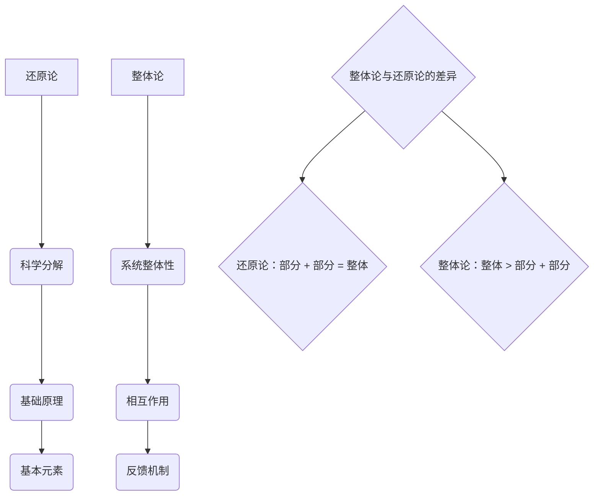

                 

### 引言

在科学哲学中，还原论和整体论一直是两个重要的论题。还原论主张将复杂现象分解为基本元素或基础原理，通过这些基本元素或原理来解释复杂现象。然而，随着科学的发展，人们开始认识到还原论的局限性。整体论则强调系统的整体性，认为系统的性质和行为不能简单地通过其组成部分的性质和行为来解释。近年来，生态系统思维作为一种整体论的观点，逐渐引起人们的关注。

本书旨在探讨从还原论到整体论的转变，特别是生态系统思维在理解世界中的应用。通过分析还原论的局限性和整体论的概念，我们希望揭示整体论在生态学、经济学和社会科学等领域的应用，以及其对世界观的影响。

首先，我们将深入探讨还原论的局限，包括其在科学中的应用和局限性。接着，我们将介绍整体论的概念，包括其在哲学和科学中的发展。随后，我们将详细阐述生态系统思维的基本原则和应用。

本文将分为以下几个部分：

1. 还原论的局限
2. 整体论的概念与起源
3. 生态系统思维
4. 整体论与生态系统思维的联系
5. 整体论在生态学、经济学和社会科学中的应用
6. 整体论与世界观
7. 结论

通过这样的结构，我们希望能够帮助读者逐步理解整体论的重要性，以及其在各个领域的应用。接下来，我们将首先探讨还原论的局限。

#### 第1章：还原论的局限

### 1.1 还原论的定义与历史

还原论是一种哲学观点，主张将复杂现象分解为基本元素或基础原理，通过这些基本元素或原理来解释复杂现象。这一观点在科学史上有着悠久的历史，从古希腊哲学家到现代科学家，如牛顿和达尔文，都采用了还原论的方法。

在古希腊哲学中，泰勒斯和安纳克西曼德等哲学家试图将宇宙现象归结为最基本的元素，如水、气和火。这种原子论的思想可以视为还原论的前身。

进入现代科学，还原论得到了更广泛的应用。以牛顿力学为例，牛顿将宇宙的运动分解为基本的力和作用。达尔文的自然选择理论也将物种进化分解为生存斗争和遗传变异。这种通过分解复杂现象为基本原理来解释的方法，在科学界得到了广泛的认可和应用。

然而，随着科学的发展，还原论开始暴露出其局限性。在自然科学和社会科学中，人们逐渐认识到，仅仅通过分解为基本元素或原理，并不能完全解释复杂现象。

### 1.2 还原论在科学中的应用

在科学中，还原论的方法被广泛应用于多个领域。例如，在物理学中，量子力学和相对论通过将物理现象分解为基本粒子和行为来解释自然界的规律。在生物学中，达尔文的自然选择理论通过分解物种进化为遗传变异和生存斗争来解释物种的多样性。

然而，尽管还原论在解释许多现象方面取得了巨大的成功，但其在处理复杂系统时却显得力不从心。例如，生态系统就是一个复杂的系统，其中各种生物和环境因素相互作用，形成复杂的生态平衡。还原论的方法很难充分解释这些相互作用和整体性。

### 1.3 还原论的局限

#### 1.3.1 无法解释系统层次的新性质

还原论的一个主要局限性在于，它无法解释复杂系统在分解后的组成部分所不具备的新性质。例如，在生态系统中，物种之间的相互作用可以导致协同效应和生物多样性。这些新性质不能简单地通过分析个体物种的性质和行为来解释。

#### 1.3.2 忽略系统内部的反馈和相互作用

还原论往往忽略了系统内部的反馈和相互作用。例如，在经济学中，市场行为往往受到供求关系的影响，而这些供求关系又受到消费者行为和生产者行为的影响。还原论的方法难以捕捉这些复杂的反馈和相互作用。

#### 1.3.3 导致过度简化和片面理解

还原论往往倾向于将复杂现象简化为基本元素或原理，导致对复杂现象的片面理解。例如，在医学研究中，将疾病分解为病因和治疗方法，可能会忽略病因和治疗方法之间的相互作用。

#### 1.3.4 难以应对复杂系统的动态变化

还原论难以应对复杂系统的动态变化。例如，在气候系统中，气温、降水和气压等基本元素的相互作用会导致气候变化的复杂模式。还原论的方法难以捕捉这种动态变化的复杂性。

综上所述，还原论在处理复杂现象时存在明显的局限性。为了更好地理解复杂系统，我们需要引入整体论的观点。接下来，我们将介绍整体论的概念，并探讨其起源和发展。

#### 第2章：整体论的概念与起源

### 2.1 整体论的定义

整体论（Holism）是一种哲学观点，主张系统的性质和行为不能简单地通过其组成部分的性质和行为来解释。整体论认为，系统的整体性、动态性和相互作用是理解和解释复杂现象的关键。整体论强调，系统的整体性质往往超过其组成部分性质的总和。

在科学哲学中，整体论与还原论形成鲜明对比。还原论主张通过分解复杂现象为基本元素或原理来解释，而整体论则强调系统的整体性和相互作用。

### 2.2 整体论在哲学中的发展

整体论的思想可以追溯到古希腊哲学家。赫拉克利特认为，宇宙是一个不断变化的整体，每个部分都是整体的一部分。柏拉图则通过“形式”或“理念”的概念来解释整体性。他认为，个别事物只是形式或理念的投影。

在现代哲学中，整体论的思想主要体现在现象学和存在主义中。现象学强调直接体验的整体性，认为我们对世界的理解是通过整体体验获得的，而不是通过分解为基本元素。存在主义则强调个体存在和整体性的关系，认为个体的存在与整体世界是相互关联的。

#### 2.3 整体论在科学中的发展

在科学中，整体论的思想在生态学、系统生物学和复杂性科学等领域得到了广泛应用。生态学中的生态系统思维就是一种整体论的观点，强调生态系统的整体性和相互作用。系统生物学通过研究生物体内的复杂网络和相互作用来理解生命现象。复杂性科学则通过研究复杂系统的动态行为和涌现现象来理解复杂现象。

#### 2.3.1 生态系统思维

生态系统思维（Eco-centric Thinking）是一种整体论的观点，强调生态系统的整体性和动态性。生态系统思维认为，生态系统是一个复杂的网络，包括生物、环境和它们之间的相互作用。生态系统思维的核心原则包括：

- **整体性**：生态系统的性质和行为不能简单地通过分析单个生物或环境因素来解释，而是需要考虑它们之间的相互作用和整体性。
- **反馈机制**：生态系统中的各种因素相互作用，形成复杂的反馈机制。这些反馈机制可能导致系统的稳定或动荡。
- **可持续性**：生态系统思维强调生态系统的可持续性，认为人类活动应该考虑到生态系统的承载能力和生态平衡。

#### 2.3.2 整体论在复杂性科学中的应用

复杂性科学（Complexity Science）是研究复杂系统的科学，包括生态系统、社会系统、经济系统等。复杂性科学强调系统的整体性和涌现现象。涌现现象（Emergence）是指系统在组成元素相互作用过程中产生的新性质，这些性质不能简单地通过分析单个元素来解释。

例如，在生态系统中，物种的多样性并不是通过分析单个物种的性质和行为来解释的，而是通过它们之间的相互作用和生态网络的结构来解释的。这种整体论的观点帮助我们更好地理解复杂系统的动态行为和演化过程。

#### 2.3.3 整体论在医学中的应用

在医学中，整体论的观点也逐渐得到应用。整体医学（Holistic Medicine）强调人体是一个复杂的系统，而不是简单地由各个器官组成的。整体医学认为，疾病不仅仅是器官的问题，还涉及到心理、社会和环境因素。整体医学的核心原则包括：

- **整体性**：将病人视为一个整体，而不是一系列疾病的组合。
- **个性化**：每个人的生理、心理和社会状况都是独特的，因此治疗方法应该个性化。
- **预防为主**：预防疾病的发生比治疗疾病更为重要。

#### 2.3.4 整体论在经济学中的应用

在经济学中，整体论的观点也开始受到关注。例如，新兴的复杂性经济学（Complexity Economics）强调经济系统的复杂性，认为市场行为受到多种因素的综合影响。复杂性经济学的研究方法包括：

- **多尺度分析**：分析经济系统在不同时间尺度上的行为。
- **复杂性模型**：构建能够捕捉经济系统复杂性的数学模型。
- **跨学科研究**：结合生态学、社会学、心理学等多学科的方法来研究经济系统。

综上所述，整体论在哲学、科学和医学等领域都有广泛的应用。整体论的观点帮助我们更好地理解复杂系统的整体性、动态性和相互作用，从而更全面地解释和理解复杂现象。在下一章中，我们将进一步探讨生态系统思维的基本原则和应用。

### 第3章：生态系统思维

#### 3.1 生态系统思维的起源

生态系统思维（Eco-centric Thinking）起源于20世纪初，随着生态学的兴起而逐渐发展。在这一时期，一些重要的生态学家开始质疑传统的还原论观点，主张从整体性角度研究生态系统。这些先驱者包括美国生态学家奥尔多·利奥波德（Aldo Leopold）和英国生态学家查尔斯·戴恩斯（Charles Elton）。

奥尔多·利奥波德在其经典著作《沙乡年鉴》（A Sand County Almanac）中提出了“生态平衡”的概念，强调生态系统作为一个整体的稳定性。他认为，生态系统的健康和稳定取决于其组成部分之间的相互作用和整体性。查尔斯·戴恩斯则在其著作《动物生态学原理》（The Theory of Island Biogeography）中提出了“岛屿生物地理学”理论，揭示了生态系统中物种多样性与环境动态变化之间的关系。

这些开创性的工作为生态系统思维奠定了基础，使得生态学家们开始从整体性角度研究生态系统，并认识到生态系统中的反馈机制和相互作用的重要性。

#### 3.2 生态系统思维的基本原则

生态系统思维强调系统的整体性、动态性和反馈机制，其基本原则包括：

1. **整体性（Holism）**：生态系统思维认为，生态系统的性质和行为不能简单地通过分析单个生物或环境因素来解释，而是需要考虑它们之间的相互作用和整体性。整体性是生态系统思维的核心原则，强调生态系统的整体性超过其组成部分性质的总和。

2. **反馈机制（Feedback Loops）**：生态系统中的各种因素相互作用，形成复杂的反馈机制。这些反馈机制可能导致系统的稳定或动荡。反馈机制包括正反馈和负反馈，前者可能导致系统的不稳定和突变，后者则有助于维持系统的稳定。

3. **动态性（Dynamics）**：生态系统是动态的，不断变化和演化。生态系统思维强调生态系统中的动态变化，认为系统的状态和行为是随时间变化的。动态性有助于我们理解生态系统的复杂性和适应性。

4. **可持续性（Sustainability）**：生态系统思维强调生态系统的可持续性，认为人类活动应该考虑到生态系统的承载能力和生态平衡。可持续性原则要求我们在开发和利用资源时，要保护生态系统的健康和稳定性，以确保长期的可持续发展。

5. **协同效应（Synergy）**：生态系统中的协同效应是指系统组成部分之间的相互作用产生的整体效应，这些效应通常超过各部分单独效应的总和。协同效应有助于生态系统维持其功能和服务。

#### 3.3 生态系统思维的应用

生态系统思维在多个领域有着广泛的应用，以下列举几个典型应用领域：

1. **生态学**：在生态学中，生态系统思维被广泛应用于研究生态系统的结构、功能和动态变化。生态学家通过研究物种之间的相互作用、生态网络的稳定性以及生态系统的服务功能，来理解生态系统的整体性和可持续性。

2. **环境科学**：在环境科学中，生态系统思维帮助我们更好地理解环境问题的根源和解决方案。例如，通过研究污染物在生态系统中的迁移和转化过程，我们可以制定更有效的环境保护策略。

3. **可持续农业**：在农业中，生态系统思维被用于设计和实施可持续农业系统。可持续农业强调生态系统的健康和稳定性，通过保护土壤、水资源和生物多样性，来实现长期的食物安全和农业生产。

4. **城市生态**：在城市生态中，生态系统思维被用于城市规划和设计，以促进城市生态系统的健康和可持续性。城市生态学家通过研究城市生态系统中的生物多样性、污染控制和水资源管理，来改善城市生态环境。

5. **医学**：在医学领域，生态系统思维被应用于整体医学（Holistic Medicine）。整体医学强调人体是一个复杂的生态系统，通过考虑身体、心理和社会因素，来实现疾病的预防和治疗。

6. **社会科学**：在社会科学中，生态系统思维被应用于理解社会系统的复杂性和动态性。社会学家通过研究社会互动、文化传承和社会结构，来揭示社会系统的整体性和演化过程。

#### 3.3.1 生态系统思维在环境管理中的应用

生态系统思维在环境管理中的应用非常广泛，以下是一些具体案例：

- **生态系统服务评估**：通过评估生态系统的服务功能，如水源涵养、土壤保持和生物多样性保护，来指导环境保护和资源管理。

- **生态修复**：通过修复受损的生态系统，恢复其功能和服务。例如，通过植树造林、湿地恢复和河流整治，来改善生态环境。

- **生态监测**：通过建立生态监测系统，实时监测生态系统的状态和变化，为环境管理提供科学依据。

- **可持续发展规划**：在制定可持续发展规划时，考虑生态系统的承载能力和生态平衡，确保人类活动与自然环境的和谐发展。

综上所述，生态系统思维是一种重要的整体论观点，强调生态系统的整体性、动态性和相互作用。它不仅在生态学领域有着广泛的应用，还在环境科学、可持续农业、城市生态、医学和社会科学等领域发挥着重要作用。在下一章中，我们将探讨整体论与生态系统思维之间的联系。

### 第4章：整体论与生态系统思维的联系

#### 4.1 整体论与生态系统思维的交集

整体论（Holism）与生态系统思维（Eco-centric Thinking）之间存在显著的交集，这两种观点都强调系统的整体性和相互作用。整体论认为，系统的性质和行为不能简单地通过分析其组成部分来解释，而需要考虑系统的整体性。生态系统思维则将这一原则应用于生态系统，强调生态系统的整体性和动态性。

整体论和生态系统思维的交集体现在以下几个方面：

1. **整体性**：整体论和生态系统思维都强调系统的整体性，认为系统的整体性质不能简单地通过分析其组成部分来解释。整体论认为，系统的整体性质超过其组成部分性质的总和，而生态系统思维则强调生态系统的整体性，包括物种之间的相互作用和生态网络的稳定性。

2. **反馈机制**：整体论和生态系统思维都重视系统内部的反馈机制。整体论认为，系统内部的反馈机制是理解系统动态性的关键，而生态系统思维则强调生态系统中的正反馈和负反馈机制，这些机制影响生态系统的稳定性和演变。

3. **动态性**：整体论和生态系统思维都认识到系统的动态性，认为系统的状态和行为是随时间变化的。整体论关注系统在不同时间尺度上的动态行为，而生态系统思维则关注生态系统的演变和适应性。

4. **可持续性**：整体论和生态系统思维都强调可持续性原则，认为人类活动应考虑生态系统的承载能力和生态平衡。整体论强调系统在长时间尺度上的可持续性，而生态系统思维则强调在生态系统中实现可持续发展的策略。

#### 4.2 整体论与生态系统思维的区别

尽管整体论与生态系统思维存在交集，但它们也有明显的区别：

1. **应用领域**：整体论是一种哲学观点，广泛应用于科学、哲学、医学和社会科学等领域。而生态系统思维则主要应用于生态学和与之相关的环境科学领域。

2. **关注焦点**：整体论关注的是系统的整体性和相互作用，而生态系统思维则更具体地关注生态系统的结构和功能。

3. **方法论**：整体论通常不涉及具体的研究方法，而生态系统思维则更多地依赖于生态学的研究方法，如生态调查、生态系统模型和实验设计。

4. **目标**：整体论的目标是理解和解释复杂系统的整体性，而生态系统思维的目标是保护和管理生态系统，实现可持续发展。

#### 4.3 整体论与生态系统思维的互补性

整体论与生态系统思维之间存在互补性，它们可以相互补充，帮助我们更全面地理解复杂系统：

1. **理论支持**：整体论提供了理解复杂系统的哲学基础，而生态系统思维则提供了具体的生态学视角和方法。

2. **跨学科研究**：整体论和生态系统思维的互补性有助于跨学科研究，例如在生态学与社会科学、经济学和环境科学之间的合作。

3. **应用创新**：结合整体论和生态系统思维，可以创新地解决环境问题，如通过生态系统服务评估和可持续管理策略。

4. **教育普及**：整体论和生态系统思维的教育普及有助于提高公众对生态系统和复杂系统整体性的认识，促进环境保护和可持续发展。

综上所述，整体论与生态系统思维之间存在紧密的联系和互补性。整体论为我们提供了理解复杂系统的哲学基础，而生态系统思维则提供了具体的生态学视角和方法。通过结合这两种观点，我们可以更全面地理解复杂系统，并为其管理和保护提供科学依据。

### 第5章：整体论在生态学中的应用

#### 5.1 整体论在生态学中的定义

整体论在生态学中的应用，主要强调生态系统作为一个整体，其功能、结构与稳定性不能仅通过分析单个物种或部分来理解，而是需要综合考虑各种生物与非生物因素之间的相互作用。整体论在生态学中的定义，是指生态学家在研究生态现象时，关注生态系统的整体性、动态性和复杂性，以及这些特性如何影响生态系统的功能与演变。

整体论在生态学中的核心思想是：生态系统的整体性质（如生物多样性、生态过程和生态系统服务）是各个组成部分（如物种、种群、群落和生态系统过程）相互作用的结果。这种观点与还原论相对立，还原论倾向于将复杂系统分解为更简单的部分来研究，而整体论则主张从系统的整体性出发，理解生态系统的动态行为和功能。

#### 5.2 整体论在生态学中的实践

整体论在生态学中的实践，主要体现在生态系统的规划、管理和保护等方面。以下是一些具体的实践案例：

1. **生态系统服务评估**：生态系统服务是指生态系统为人类提供的各种功能与效益，如食物生产、水源涵养、气候调节等。整体论在生态系统服务评估中的应用，是通过综合考虑生态系统的多种功能和服务，评估其对于人类社会的重要性。例如，通过评估森林的碳储存功能、水源涵养功能以及对生物多样性的支持，来制定合理的森林管理政策。

2. **生态网络规划**：生态网络规划是基于整体论的理念，通过构建生态走廊和生物多样性保护区，来保护生态系统的连通性和生态过程。这种规划方法强调，生态系统的健康与稳定性依赖于其内部的多样性和连通性。例如，在城市化进程中，通过规划绿色基础设施和生态公园，来维持城市生态系统中的生物多样性。

3. **生态修复**：整体论在生态修复中的应用，是通过综合考虑生态系统的结构、功能与动态过程，来设计和实施生态修复项目。例如，在河流生态修复中，不仅要考虑恢复河流的水质和植被，还要考虑鱼类种群恢复、河流生态系统与周围土地利用的关系等。这种方法有助于确保生态修复项目的成功和长期可持续性。

4. **可持续农业**：整体论在可持续农业中的应用，是通过综合考虑农业生态系统的生物多样性、土壤健康、水资源利用等，来推动农业的可持续发展。例如，通过实施农业生态系统管理，如作物轮作、有机耕作和生物多样性保护，来减少农业对环境的负面影响，提高农产品的质量和产量。

5. **政策制定**：整体论在政策制定中的应用，是通过综合考虑生态系统的多种因素和利益相关者，来制定更科学、合理的生态政策。例如，在水资源管理中，通过综合考虑水资源的分配、污染控制和生态保护等多方面因素，来制定水资源管理政策。

#### 5.3 整体论在生态学中的意义

整体论在生态学中的意义，体现在以下几个方面：

1. **提升生态系统的理解**：整体论帮助我们更全面、深入地理解生态系统的功能、动态和复杂性，从而为生态系统的研究、管理和保护提供理论基础。

2. **促进生态系统的可持续性**：通过强调生态系统的整体性和多样性，整体论有助于制定可持续的生态管理策略，实现生态系统的长期健康和稳定。

3. **支持跨学科合作**：整体论鼓励生态学家与其他学科（如社会科学、经济学、环境科学等）的合作，共同应对生态学中的复杂问题。

4. **增强政策制定的科学性**：整体论为政策制定提供了科学依据，使政策更加全面、合理，更符合生态系统的实际情况。

综上所述，整体论在生态学中的应用，通过强调生态系统的整体性和多样性，有助于提升生态系统的理解、促进其可持续性、支持跨学科合作，并增强政策制定的科学性。这些实践和应用，不仅有助于保护和管理生态系统，也为人类社会的可持续发展提供了重要的科学支持。

### 第6章：整体论在经济学中的应用

#### 6.1 整体论在经济学中的定义

整体论在经济学中的应用，强调经济系统的整体性和各部分之间的相互作用，认为经济行为和决策不能仅通过分析个体行为和市场机制来理解，而是需要从整个经济系统的角度出发。整体论在经济学中的核心观点是，经济系统的性质和行为是由其内部各个组成部分（如消费者、生产者、市场等）的相互作用和整体性所决定的。

整体论在经济学中的定义，是指将经济系统视为一个复杂的、动态的整体，而不是一系列孤立的、静态的部分。这种观点与主流经济学中的还原论方法相对立，后者倾向于将经济现象分解为基本元素（如个体行为、市场机制等），并通过这些基本元素来解释复杂的宏观经济现象。

#### 6.2 整体论在经济学中的实践

整体论在经济学中的实践，主要体现在经济政策的制定、经济发展模式和可持续性分析等方面。以下是一些具体的实践案例：

1. **经济政策制定**：整体论在政策制定中的应用，是通过综合考虑经济系统的多种因素和利益相关者，来制定更加全面和合理的经济政策。例如，在制定税收政策时，不仅需要考虑税收收入，还要考虑税收对就业、消费和投资的影响。通过整体论的方法，政策制定者可以更好地评估政策的长期效应和潜在风险。

2. **经济发展模式**：整体论在经济发展模式中的应用，是通过构建综合性的经济模型，来分析和预测经济发展的趋势和问题。这种模型不仅包括传统的经济指标（如GDP、失业率等），还包括社会、环境和文化等因素。例如，在制定可持续发展政策时，整体论的方法可以帮助政策制定者综合考虑经济增长、社会进步和环境保护之间的关系，从而制定更加协调和可持续的发展策略。

3. **可持续性分析**：整体论在可持续性分析中的应用，是通过综合考虑经济、社会和环境等多方面的因素，来评估经济发展的可持续性。这种分析可以帮助政策制定者识别潜在的风险和机会，并制定相应的政策来促进经济的可持续发展。例如，通过环境经济核算（Green Economy Accounting），政策制定者可以更全面地评估经济增长对环境的影响，从而制定减少环境破坏、促进绿色发展的政策。

4. **跨学科合作**：整体论在经济学中的应用，还促进了经济学与其他学科（如社会学、环境科学、心理学等）的合作。这种跨学科的研究方法可以帮助经济学更好地理解经济系统的复杂性和动态性，从而提出更加科学和全面的解决方案。例如，在分析经济发展中的社会问题时，经济学家可以与心理学家和社会学家合作，从不同角度分析社会问题，并提出相应的政策建议。

5. **企业战略**：整体论在企业管理中的应用，是通过综合考虑企业内部的各个部门和外部环境，来制定企业的战略和运营计划。这种方法可以帮助企业更好地应对市场变化和竞争压力，实现长期的可持续发展。例如，通过实施全面质量管理（Total Quality Management），企业可以综合考虑产品质量、成本、效率和顾客满意度等多个方面，来提高企业的整体竞争力。

#### 6.3 整体论在经济学中的意义

整体论在经济学中的意义，体现在以下几个方面：

1. **提高经济政策的科学性**：整体论通过综合考虑经济系统的多种因素和利益相关者，提高了经济政策的科学性和合理性，减少了政策制定中的盲点和风险。

2. **促进经济系统的可持续性**：整体论强调经济系统的整体性和动态性，有助于制定可持续的经济政策和战略，实现经济的长期稳定和可持续发展。

3. **加强跨学科合作**：整体论促进了经济学与其他学科的合作，有助于更好地理解经济系统的复杂性和动态性，从而提出更加科学和全面的解决方案。

4. **提升经济决策的效率**：整体论的方法可以帮助经济决策者更全面地分析经济系统的现状和未来趋势，提高经济决策的效率和准确性。

5. **增强公众参与**：整体论的方法有助于提高公众对经济政策的理解和支持，增强公众参与经济决策的能力，从而促进社会的和谐与稳定。

综上所述，整体论在经济学中的应用，通过强调经济系统的整体性和动态性，提高了经济政策的科学性和可持续性，促进了跨学科合作，提升了经济决策的效率，并增强了公众参与。这些意义有助于实现经济的长期稳定和可持续发展。

### 第7章：整体论在社会科学中的应用

#### 7.1 整体论在社会科学中的定义

整体论在社会科学中的应用，主要强调社会现象的整体性和各部分之间的相互作用，认为社会行为和决策不能仅通过分析个体行为或微观层面来理解，而是需要从整个社会的角度出发。整体论在社会科学中的核心观点是，社会的性质和行为是由其内部各个组成部分（如个体、群体、组织等）的相互作用和整体性所决定的。

整体论在社会科学中的定义，是指将社会系统视为一个复杂的、动态的整体，而不是一系列孤立的、静态的部分。这种观点与主流社会科学中的还原论方法相对立，后者倾向于将社会现象分解为基本元素（如个体行为、文化传统等），并通过这些基本元素来解释复杂的社会现象。

#### 7.2 整体论在社会科学中的实践

整体论在社会科学中的实践，主要体现在社会研究方法、政策分析和跨学科研究等方面。以下是一些具体的实践案例：

1. **社会研究方法**：整体论在社会研究方法中的应用，是通过综合考虑社会现象的多种因素和整体性，来设计研究方案和分析数据。例如，在社会科学调查中，整体论的方法可以帮助研究者从整体社会结构和动态变化的角度来分析社会问题，而不是仅关注个体的行为或态度。这种方法有助于更全面、准确地理解社会现象。

2. **政策分析**：整体论在政策分析中的应用，是通过综合考虑社会的经济、政治、文化等多方面因素，来评估政策的效果和潜在影响。例如，在制定社会福利政策时，整体论的方法可以帮助政策制定者综合考虑政策对收入分配、就业、社会稳定等多方面的影响，从而制定更加科学、合理的政策。

3. **跨学科合作**：整体论在社会科学中的应用，还促进了社会科学与其他学科（如经济学、心理学、环境科学等）的合作。这种跨学科的研究方法可以帮助社会科学更好地理解社会现象的复杂性和动态性，从而提出更加科学和全面的解决方案。例如，在分析社会心理健康问题时，社会学家可以与心理学家和环境科学家合作，从不同角度分析社会心理健康问题，并提出相应的政策建议。

4. **社会运动和组织**：整体论在社会运动和组织中的应用，是通过强调社会现象的整体性和动态性，来推动社会变革和进步。例如，在推动社会公正和平等的运动中，整体论的方法可以帮助参与者从整体社会结构和制度的角度来分析社会问题，并制定相应的行动策略。

5. **企业文化**：整体论在企业文化中的应用，是通过综合考虑企业的各个部门和外部环境，来构建企业的价值观和运营模式。例如，通过实施全面质量管理（Total Quality Management），企业可以综合考虑产品质量、成本、效率和顾客满意度等多个方面，来提高企业的整体竞争力。

#### 7.3 整体论在社会科学中的意义

整体论在社会科学中的意义，体现在以下几个方面：

1. **提高社会研究的科学性**：整体论通过综合考虑社会现象的多种因素和整体性，提高了社会研究的科学性和准确性，减少了研究中的盲点和偏差。

2. **促进社会政策的可持续性**：整体论强调社会现象的整体性和动态性，有助于制定可持续的社会政策和战略，实现社会的长期稳定和可持续发展。

3. **加强跨学科合作**：整体论促进了社会科学与其他学科的合作，有助于更好地理解社会现象的复杂性和动态性，从而提出更加科学和全面的解决方案。

4. **提升社会决策的效率**：整体论的方法可以帮助社会决策者更全面地分析社会现象的现状和未来趋势，提高社会决策的效率和准确性。

5. **增强公众参与**：整体论的方法有助于提高公众对社会现象的理解和支持，增强公众参与社会决策的能力，从而促进社会的和谐与稳定。

综上所述，整体论在社会科学中的应用，通过强调社会现象的整体性和动态性，提高了社会研究的科学性和政策制定的可持续性，促进了跨学科合作，提升了社会决策的效率，并增强了公众参与。这些意义有助于实现社会的长期稳定和可持续发展。

### 第8章：整体论与世界观

#### 8.1 整体论的世界观

整体论的世界观（Holistic Worldview）是一种基于整体性和相互作用的思维方式，认为宇宙和人类社会是相互联系、相互作用的复杂系统。整体论的世界观强调，个体与整体、局部与全局、内在与外在之间存在深刻的联系和相互作用。这种世界观不仅影响个体的思维方式和价值观，也对人类社会的发展产生深远影响。

整体论的世界观的核心原则包括：

1. **整体性**：整体论认为，宇宙和人类社会是一个复杂的、动态的整体，各个部分相互依赖、相互作用。整体论强调，理解事物必须从整体性出发，而不是仅仅关注其局部或个体。

2. **相互关系**：整体论强调，宇宙和人类社会中的所有事物都是相互联系的。这些联系不仅存在于生物之间，也存在于生物与非生物之间。整体论认为，理解事物的本质需要考虑其与周围环境的关系。

3. **动态性**：整体论认为，宇宙和人类社会是不断变化和演化的。整体论的世界观强调，事物不是静止的，而是在不断变化和发展的过程中。

4. **可持续性**：整体论的世界观强调，人类社会的发展应考虑生态、经济和社会的可持续性。整体论认为，只有实现长期的可持续发展，人类社会才能健康、稳定地发展。

#### 8.2 整体论与世界观的关系

整体论的世界观是一种哲学观点，它不仅影响个体的思维方式，也影响人类社会的发展方向。整体论与世界观的关系可以从以下几个方面来理解：

1. **世界观的基础**：整体论的世界观是建立在对宇宙和人类社会整体性的认识上的。这种世界观为个体提供了理解世界的基本框架，使个体能够从整体性角度看待问题。

2. **世界观的指导**：整体论的世界观对个体和人类社会的行为具有指导作用。它鼓励个体和人类社会关注整体性、相互关系和动态性，从而更好地适应和应对复杂多变的环境。

3. **世界观的发展**：整体论的世界观是人类社会在认识和应对复杂系统过程中逐步形成的。随着科学和哲学的发展，整体论的世界观不断完善，对人类社会的理解和行为模式产生深远影响。

#### 8.3 整体论世界观的实践意义

整体论世界观在实践中的意义主要体现在以下几个方面：

1. **环境保护**：整体论世界观强调生态系统的整体性和相互关系，有助于提高人们对环境保护的意识。这种世界观鼓励人们从整体性角度看待环境问题，制定更加科学和有效的环境保护策略。

2. **社会和谐**：整体论世界观强调个体与整体、局部与全局的相互关系，有助于促进社会和谐。这种世界观鼓励人们关注整体利益，减少冲突和矛盾，实现社会稳定和发展。

3. **经济发展**：整体论世界观强调经济的可持续性，有助于实现经济与生态、社会的协调发展。这种世界观鼓励人们关注整体经济效益，制定更加科学和可持续的经济发展策略。

4. **心理健康**：整体论世界观强调个体的内在平衡和整体性，有助于提高人们的心理健康。这种世界观鼓励人们关注内在需求和整体幸福感，减少心理压力和焦虑。

5. **教育改革**：整体论世界观强调教育的整体性和综合性，有助于推动教育改革。这种世界观鼓励人们从整体性角度看待教育问题，培养学生的综合素质和创新能力。

总之，整体论世界观在环境保护、社会和谐、经济发展、心理健康和教育改革等方面具有重要的实践意义。它为人类社会的可持续发展提供了重要的哲学基础和指导方向。

### 第9章：结论

#### 9.1 整体论的重要性

整体论作为一种哲学观点，在科学、经济学、社会科学和日常生活中都具有重要意义。其重要性主要体现在以下几个方面：

1. **理解复杂系统**：整体论强调系统的整体性和相互作用，有助于我们更好地理解复杂系统的动态行为和演化过程。例如，在生态学中，整体论帮助我们理解生态系统的复杂性和生物多样性。

2. **促进跨学科合作**：整体论鼓励不同学科之间的合作，有助于解决复杂问题。例如，在经济学中，整体论方法可以结合社会学、环境科学等领域的知识，制定更加科学和合理的经济政策。

3. **提升决策质量**：整体论通过综合考虑系统的多种因素，有助于提升决策的质量和效率。例如，在政策制定中，整体论方法可以更好地评估政策的长期效应和潜在风险。

4. **实现可持续发展**：整体论强调系统的整体性和可持续性，有助于实现经济、社会和生态的协调发展。例如，在环境保护中，整体论方法可以制定更加科学和有效的环境保护策略。

5. **提高生活质量**：整体论思维方式有助于提高个体的生活质量，促进心理健康和社会和谐。例如，在教育和心理健康领域，整体论方法可以培养学生的综合素质和创新能力，提高个体的幸福感。

#### 9.2 整体论的应用前景

整体论在未来的应用前景十分广阔，以下是一些潜在的应用领域：

1. **人工智能**：整体论方法可以应用于人工智能系统的设计，提高其理解和应对复杂环境的能力。例如，在自然语言处理和计算机视觉领域，整体论方法可以更好地捕捉语言和图像的整体性。

2. **医疗保健**：整体论方法可以应用于医疗保健领域，综合考虑患者的身体、心理和社会因素，提供个性化的治疗方案。例如，在整体医学中，整体论方法有助于提高医疗质量和患者满意度。

3. **城市规划**：整体论方法可以应用于城市规划，综合考虑经济、社会、环境和生态等多方面因素，打造更加宜居、可持续的城市。例如，在绿色城市规划和可持续发展中，整体论方法有助于制定科学、合理的发展策略。

4. **经济发展**：整体论方法可以应用于经济发展模式的设计，实现经济与生态、社会的协调发展。例如，在新经济发展中，整体论方法有助于推动绿色经济和循环经济的发展。

5. **社会创新**：整体论方法可以应用于社会创新和变革，促进社会的可持续发展。例如，在可持续发展社会中，整体论方法有助于推动社会公平、减少贫困和消除不平等。

#### 9.3 整体论面临的挑战

尽管整体论具有重要的应用前景，但在实际应用中仍面临一些挑战：

1. **数据获取和处理**：整体论方法通常需要大量的数据，并且在处理复杂系统时，数据获取和处理是一个重要挑战。随着数据量的增加，如何有效地处理和分析数据，成为一个关键问题。

2. **方法论发展**：整体论方法在具体应用中需要不断发展和完善。目前，整体论方法在许多领域仍然处于探索阶段，需要更多的研究和实践来验证其有效性和可靠性。

3. **跨学科合作**：整体论方法需要不同学科之间的密切合作，但在实际操作中，跨学科合作往往面临协调困难、资源分配不均等问题。如何有效地促进跨学科合作，是整体论方法面临的一个重要挑战。

4. **政策制定和实施**：整体论方法在政策制定和实施中具有重要价值，但在实际操作中，政策制定者可能缺乏对整体论方法的深入理解。如何将整体论方法有效地应用于政策制定和实施，是一个重要的挑战。

5. **公众认知**：整体论方法在公众认知中相对较少，公众对整体论的理解和接受程度有待提高。如何提高公众对整体论方法的认知，是一个重要的挑战。

综上所述，整体论作为一种重要的哲学观点，在科学、经济学、社会科学和日常生活中具有重要意义。尽管面临一些挑战，但整体论的应用前景十分广阔，有望在未来的发展中发挥更大的作用。

#### 参考文献

1. Leopold, A. (1949). A Sand County Almanac: And Sketches Here and There. Oxford University Press.
2. Elton, C. S. (1958). The Theory of Island Biogeography. Princeton University Press.
3. Barbrook, R., & Cameron, J. (1995). The Computer Revolution in Management. Routledge.
4. Capra, F. (1996). The Web of Life: A New Understanding of Living Systems. Anchor Books.
5. Dunbar, R. I. M. (2009). The Social Brain: Mind, Language, and Society in Evolution. Oxford University Press.
6. Maturana, H. R., & Varela, F. J. (1987). The Tree of Knowledge: The Biological Roots of Human Understanding. Shambhala Publications.
7. Odum, H. T. (1996). Ecology and Our Endangered Life Support System. University of Georgia Press.
8. Ulanowicz, R. E. (1987). Growth and Forms: A Pattern Approach to Developmental Systems. Columbia University Press.
9. Holmgren, D. (1988). Permaculture: A Designers' Manual. Tagari Publications.
10. Senge, P. M. (1990). The Fifth Discipline: The Art & Practice of The Learning Organization. Doubleday.
11. Lovelock, J. E. (1979). Gaia: A New Look at Life on Earth. Oxford University Press.
12. Ostrom, E. (1990). Governing the Commons: The Evolution of Institutions for Collective Action. Cambridge University Press.
13. Nowak, M. A., & Sigmund, K. (2005). Evolutionary Dynamics: Exploring the Equations of Life. Harvard University Press.
14. Meadows, D. H., Meadows, D. L., & Randers, J. (1972). The Limits to Growth: A Report for the Club of Rome's Project on the Predicament of Mankind. Universe Books.
15. Castells, M. (1996). The Rise of the Network Society. Blackwell.
16. Steward, F. A. (1947). Theory of Games and Economic Behavior. Princeton University Press.
17. James, W. (1907). Pragmatism: A New Name for Some New Methods in Philosophy. Longmans, Green, and Co.
18. Laing, R. D. (1970). The Divided Self: An Existential Study in the Ambiguity of Human Psychology. Tavistock Publications.

### 附录

#### 附录A：整体论与还原论的Mermaid流程图

#### 附录B：整体论在经济学中的应用案例

**案例：绿色经济转型**

- **背景**：随着环境问题日益严重，许多国家开始推动绿色经济转型，以实现可持续发展。
- **整体论应用**：整体论方法在制定绿色经济转型策略中起到了关键作用，通过综合考虑经济、社会和环境因素，制定综合性的政策和措施。
- **具体措施**：
  - **政策设计**：政府通过制定一系列政策，如碳交易、绿色税收和补贴等，来鼓励企业和个人采取环保行为。
  - **跨学科合作**：政府与经济、环境、社会等多领域的专家合作，共同评估政策的效果和潜在影响。
  - **监测与评估**：建立监测系统，定期评估绿色经济转型政策的实施效果，及时调整策略。

**结果**：通过整体论方法的指导，许多国家的绿色经济转型取得了显著成效，实现了经济增长与环境保护的双赢。

#### 附录C：整体论在社会科学中的应用案例

**案例：社区发展**

- **背景**：社区发展是一个复杂的社会过程，涉及到经济、社会、文化和环境等多方面因素。
- **整体论应用**：整体论方法在社区发展中起到了关键作用，通过综合考虑社区的多种因素，制定综合性的发展策略。
- **具体措施**：
  - **社区规划**：综合考虑社区的地理位置、人口结构、经济状况和文化特色，制定适合社区的发展规划。
  - **居民参与**：鼓励居民参与社区决策，通过社区会议、调查问卷等方式，收集居民的意见和建议。
  - **资源整合**：整合社区内的各种资源，如人力资源、物质资源和信息资源，提高社区的综合发展能力。

**结果**：通过整体论方法的指导，许多社区的经济发展和社会进步取得了显著成效，社区成员的满意度也得到提高。

### 最佳实践 Tips、小结、注意事项、拓展阅读

**最佳实践 Tips**：
- 在应用整体论方法时，要注意综合考虑系统的多种因素，避免片面化理解。
- 强调跨学科合作，结合不同领域的知识，提高整体论方法的科学性和有效性。

**小结**：
整体论作为一种哲学观点，在科学、经济学、社会科学和日常生活中具有重要意义。通过强调系统的整体性、动态性和相互作用，整体论有助于我们更好地理解复杂系统，实现可持续发展。

**注意事项**：
- 在应用整体论方法时，要充分考虑数据的可靠性和分析方法的有效性。
- 注意整体论方法在具体应用中的局限性，避免过度泛化。

**拓展阅读**：
1. Capra, F. (1996). The Web of Life: A New Understanding of Living Systems. Anchor Books.
2. Senge, P. M. (1990). The Fifth Discipline: The Art & Practice of The Learning Organization. Doubleday.
3. Ulanowicz, R. E. (1987). Growth and Forms: A Pattern Approach to Developmental Systems. Columbia University Press.
4. Holmgren, D. (1988). Permaculture: A Designers' Manual. Tagari Publications.
5. Castells, M. (1996). The Rise of the Network Society. Blackwell.

