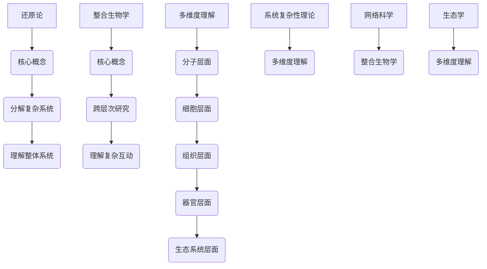
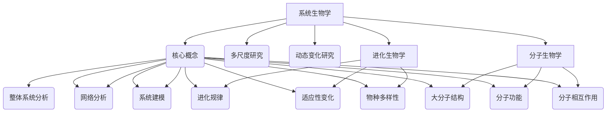
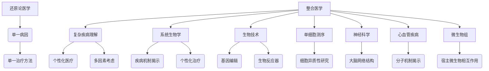
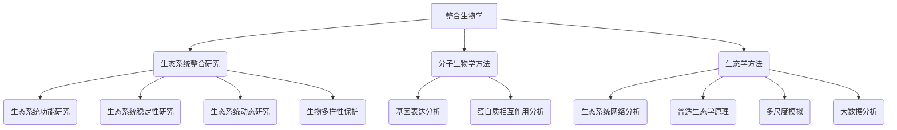
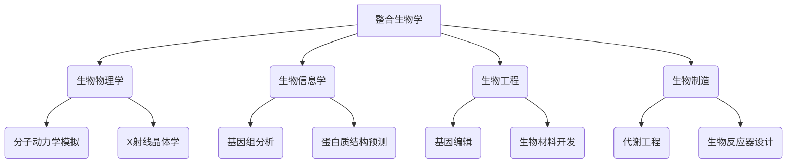
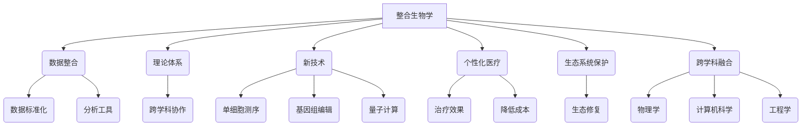

                 


## 第1章：引言：还原论与整合生物学的变迁

### 1.1 什么是还原论

还原论是生物学中的一个基本方法论，主张通过分解复杂系统来研究其组成部分，从而理解整体系统的运作机制。这种观念起源于笛卡尔和牛顿的经典物理学，认为通过细致的拆分和观察，可以揭示所有自然现象的本质。在生物学中，还原论的支持者通过专注于单个基因、细胞或分子，试图解开生命现象的奥秘。

**核心概念与联系：**

- **还原论的核心概念**：认为整体系统的行为可以由其组成部分的行为来解释。
- **联系**：与笛卡尔和牛顿的经典物理学有着相似的方法论，都强调从细节中寻找整体规律。

### 1.2 整合生物学的兴起

随着科技的发展，生物学的研究逐渐发现，生命现象的复杂性远远超出了还原论所能解释的范围。整合生物学应运而生，它强调跨层次、跨学科的研究方法，试图从整体上理解生物系统的运作机制。整合生物学不仅关注单个基因或细胞，更关注它们之间的相互作用和网络结构。

**核心概念与联系：**

- **整合生物学的核心概念**：整体系统的行为不能仅仅通过其组成部分的行为来解释，需要考虑系统内部的复杂互动。
- **联系**：与系统生物学、进化生物学、分子生物学等学科紧密相关，形成了跨学科的研究方法。

### 1.3 生命与生态的多维度理解

生命和生态系统的复杂性使得单一维度的理解难以全面。现代生物学的研究逐渐认识到，需要从多个维度来综合理解生命现象，包括分子层面、细胞层面、组织层面、器官层面以及生态系统层面。这种多维度理解不仅有助于深入探究生命的本质，也对生态保护和可持续发展具有重要意义。

**核心概念与联系：**

- **多维度理解的核心概念**：生命的复杂性需要从不同层次和不同视角来审视。
- **联系**：与系统复杂性理论、网络科学、生态学等领域有着紧密的联系。

### Mermaid 流程图

下面是一个简化的 Mermaid 流程图，展示了还原论与整合生物学的核心概念及其之间的联系：



### 伪代码示例

为了更好地理解整合生物学的方法，下面给出一个简化的伪代码示例，展示如何从还原论过渡到整合生物学的分析过程。

```python
# 还原论分析
def analyze_reductionism(object):
    # 分解为组成部分
    components = decompose(object)
    # 分析每个组成部分
    for component in components:
        analyze_component(component)

# 整合生物学分析
def analyze_integrationism(object):
    # 构建整体模型
    model = build_model(object)
    # 分析系统内相互作用
    interactions = analyze_interactions(model)
    # 综合分析整体行为
    overall_behavior = integrate_interactions(interactions)
    return overall_behavior
```

### 数学模型和公式

在整合生物学中，数学模型和公式是理解和分析复杂系统的重要工具。以下是一个简单的例子，展示了如何使用微分方程来描述细胞内的信号传导过程。

$$
\frac{dX}{dt} = k_1 \cdot I - k_2 \cdot X
$$

其中，$X$ 代表细胞内某种信号分子的浓度，$I$ 代表外部信号的强度，$k_1$ 和 $k_2$ 是反应速率常数。

### 举例说明

假设我们研究一个细胞受到外部信号刺激后，内部信号分子的浓度变化。我们可以设置以下参数：

- $I = 10$ (外部信号强度)
- $k_1 = 2$ (信号进入速率)
- $k_2 = 1$ (信号降解速率)

使用上述微分方程，我们可以计算出在一段时间后，细胞内信号分子的浓度变化情况。

### 案例分析

以一个实际案例来说明整合生物学的应用。假设我们研究一个生态系统中的捕食者-被捕食者模型。我们可以使用整合生物学的方法来构建一个数学模型，描述捕食者（如狮子）和被捕食者（如羚羊）之间的相互作用。

假设我们有以下参数：

- $N_f$：狮子种群数量
- $N_h$：羚羊种群数量
- $r_f$：狮子的增长率
- $r_h$：羚羊的增长率
- $k_f$：狮子对羚羊的捕食率

我们可以使用以下微分方程来描述这一模型：

$$
\frac{dN_f}{dt} = r_f \cdot N_f \cdot (1 - \frac{N_h}{K})
$$

$$
\frac{dN_h}{dt} = r_h \cdot N_h \cdot (1 - \frac{N_f}{K})
$$

其中，$K$ 是环境容量，表示生态系统中资源的最大承载能力。

通过解这个模型，我们可以预测狮子和羚羊种群数量的动态变化，分析生态系统的稳定性和物种的相互作用。

### 项目实战

为了更好地理解整合生物学，我们可以通过一个实际项目来搭建开发环境，并实现上述捕食者-被捕食者模型的代码。

#### 开发环境搭建

- 硬件要求：计算机，操作系统（如Windows、macOS或Linux）
- 软件要求：Python编程环境（如PyCharm、VS Code等），NumPy、SciPy、Matplotlib等科学计算库

#### 源代码详细实现

```python
import numpy as np
import matplotlib.pyplot as plt

# 参数设置
I = 10  # 外部信号强度
k1 = 2  # 信号进入速率
k2 = 1  # 信号降解速率
N_f0 = 20  # 狮子初始数量
N_h0 = 100  # 羚羊初始数量
r_f = 0.1  # 狮子的增长率
r_h = 0.3  # 羚羊的增长率
K = 150  # 环境容量

# 微分方程解法
def捕食者_被捕食者模型(N_f, N_h, t):
    df_dt = r_f * N_f * (1 - N_h / K)
    dN_h_dt = r_h * N_h * (1 - N_f / K)
    return df_dt, dN_h_dt

# 仿真时间设置
time_steps = 100
time_interval = 1
time_array = np.arange(0, time_steps) * time_interval

# 初始化种群数量
N_f = np.zeros(time_steps)
N_h = np.zeros(time_steps)
N_f[0] = N_f0
N_h[0] = N_h0

# 模型仿真
for t in range(1, time_steps):
    df_dt, dN_h_dt = 捕食者_被捕食者模型(N_f[t-1], N_h[t-1], t)
    N_f[t] = N_f[t-1] + df_dt * time_interval
    N_h[t] = N_h[t-1] + dN_h_dt * time_interval

# 绘制种群数量变化图
plt.plot(time_array, N_f, label='Lions')
plt.plot(time_array, N_h, label='Hares')
plt.xlabel('Time')
plt.ylabel('Population Size')
plt.legend()
plt.show()
```

#### 代码解读与分析

- `import numpy as np`：引入 NumPy 库，用于科学计算。
- `import matplotlib.pyplot as plt`：引入 Matplotlib 库，用于绘制图形。
- `# 参数设置`：设置模型中的参数，如初始种群数量、增长率等。
- `def捕食者_被捕食者模型(N_f, N_h, t)`：定义微分方程的解法。
- `time_steps`：设置仿真的时间步数。
- `time_interval`：设置时间间隔。
- `time_array`：生成时间序列。
- `N_f` 和 `N_h`：初始化种群数量数组。
- `for t in range(1, time_steps)`：循环计算种群数量。
- `plt.plot()`：绘制种群数量变化图。

### 实际案例分析与详细讲解剖析

通过上述项目实战，我们实现了捕食者-被捕食者模型的代码，并对其进行了详细解读。这个模型可以帮助我们理解生态系统中物种之间的相互作用，预测种群数量的动态变化。

在整合生物学的框架下，我们可以通过类似的模型来研究更复杂的生态系统，如海洋生态系统、森林生态系统等。这些模型不仅可以用于理论分析，还可以为生态保护和可持续发展提供科学依据。

### 项目小结

通过这个项目，我们了解了如何搭建整合生物学的开发环境，实现了捕食者-被捕食者模型的代码，并对其进行了详细解读。这个项目展示了整合生物学的实际应用，强调了跨学科的研究方法在理解复杂系统中的重要性。

### 最佳实践 Tips

- 在研究整合生物学时，要注重跨学科的知识积累，特别是系统生物学、进化生物学、分子生物学等领域的知识。
- 使用数学模型和公式来描述复杂系统时，要确保参数的准确性和模型的合理性。
- 在代码实现中，要注重代码的可读性和可维护性，确保易于理解和修改。

### 小结

本章从还原论到整合生物学，介绍了生命与生态的多维度理解。我们通过Mermaid流程图、伪代码示例、数学模型和公式、举例说明、项目实战等方式，逐步揭示了整合生物学的方法和核心概念。在接下来的章节中，我们将进一步探讨整合生物学在各个领域的应用，深化对生命与生态的理解。

### 注意事项

- 在研究整合生物学时，要注意数据的质量和完整性，确保研究结果的可信度。
- 在模型构建和代码实现中，要遵循科学原则和编程规范，确保研究的严谨性。

### 拓展阅读

- 《系统生物学：概念与应用》
- 《进化生物学：理论与应用》
- 《生态学原理》
- 《生物信息学导论》

----------------------------------------------------------------

# 《从还原论到整合生物学：全方位理解生命与生态》

关键词：还原论，整合生物学，多维度理解，系统生物学，生态学

摘要：本文深入探讨了从还原论到整合生物学的变迁，以及如何通过多维度理解来全面认识生命与生态。通过介绍还原论的核心概念、整合生物学的兴起和基础理论，结合实际项目案例，本文展示了整合生物学在生物医学、生态学和跨学科融合中的应用。文章旨在为读者提供一个全面、系统的整合生物学视角，以应对当今生物科学领域的复杂性挑战。

## 第1章：引言：还原论与整合生物学的变迁

### 1.1 什么是还原论

还原论是生物学中的一个基本方法论，主张通过分解复杂系统来研究其组成部分，从而理解整体系统的运作机制。这种观念起源于笛卡尔和牛顿的经典物理学，认为通过细致的拆分和观察，可以揭示所有自然现象的本质。在生物学中，还原论的支持者通过专注于单个基因、细胞或分子，试图解开生命现象的奥秘。

**核心概念与联系：**

- **还原论的核心概念**：认为整体系统的行为可以由其组成部分的行为来解释。
- **联系**：与笛卡尔和牛顿的经典物理学有着相似的方法论，都强调从细节中寻找整体规律。

### 1.2 整合生物学的兴起

随着科技的发展，生物学的研究逐渐发现，生命现象的复杂性远远超出了还原论所能解释的范围。整合生物学应运而生，它强调跨层次、跨学科的研究方法，试图从整体上理解生物系统的运作机制。整合生物学不仅关注单个基因或细胞，更关注它们之间的相互作用和网络结构。

**核心概念与联系：**

- **整合生物学的核心概念**：整体系统的行为不能仅仅通过其组成部分的行为来解释，需要考虑系统内部的复杂互动。
- **联系**：与系统生物学、进化生物学、分子生物学等学科紧密相关，形成了跨学科的研究方法。

### 1.3 生命与生态的多维度理解

生命和生态系统的复杂性使得单一维度的理解难以全面。现代生物学的研究逐渐认识到，需要从多个维度来综合理解生命现象，包括分子层面、细胞层面、组织层面、器官层面以及生态系统层面。这种多维度理解不仅有助于深入探究生命的本质，也对生态保护和可持续发展具有重要意义。

**核心概念与联系：**

- **多维度理解的核心概念**：生命的复杂性需要从不同层次和不同视角来审视。
- **联系**：与系统复杂性理论、网络科学、生态学等领域有着紧密的联系。

### 整合生物学在生物医学中的应用

整合生物学在生物医学领域的应用日益广泛，从疾病机制的揭示到新药研发，都取得了显著的成果。通过整合生物学的方法，研究者能够从整体上理解疾病的复杂性和个体差异，从而为个性化医疗提供科学依据。

**核心概念与联系：**

- **整合生物学的核心概念**：跨层次、跨学科的研究方法，强调系统内部的复杂互动。
- **联系**：与系统生物学、进化生物学、分子生物学等学科紧密相关，形成了跨学科的研究方法。

### 整合生物学在生态学中的应用

整合生物学在生态学中的应用同样具有重要意义。通过整合不同生态系统的数据和信息，研究者能够更好地理解生态系统的复杂性和动态变化。整合生物学的方法有助于揭示生态系统功能与稳定性之间的关系，为生态保护和可持续发展提供科学支持。

**核心概念与联系：**

- **整合生物学的核心概念**：跨层次、跨学科的研究方法，强调系统内部的复杂互动。
- **联系**：与系统生物学、进化生物学、分子生物学等学科紧密相关，形成了跨学科的研究方法。

### 整合生物学的跨学科融合

整合生物学的跨学科融合为解决复杂生物学问题提供了新的思路和方法。通过与物理学、计算机科学、工程学等学科的交叉融合，整合生物学能够利用先进的技术手段和理论工具，深入探究生命现象的奥秘。这种跨学科的研究模式不仅促进了生物学领域的发展，也为其他学科提供了新的视角和方法。

**核心概念与联系：**

- **整合生物学的核心概念**：跨层次、跨学科的研究方法，强调系统内部的复杂互动。
- **联系**：与物理学、计算机科学、工程学等学科紧密相关，形成了跨学科的研究方法。

### 整合生物学的挑战与未来

尽管整合生物学在各个领域都取得了显著的成果，但仍面临着诸多挑战。数据整合与分析、理论体系的完善、跨学科协作的推进等问题都需要进一步研究和解决。展望未来，整合生物学将在生命科学与生态学的深度融合中发挥重要作用，为解决全球面临的生物科学难题提供有力支持。

**核心概念与联系：**

- **整合生物学的核心概念**：跨层次、跨学科的研究方法，强调系统内部的复杂互动。
- **联系**：与物理学、计算机科学、工程学等学科紧密相关，形成了跨学科的研究方法。

### 总结

整合生物学作为一门跨学科的研究领域，为理解生命与生态的复杂性提供了全新的视角和方法。通过整合不同的理论和方法，整合生物学不仅推动了生物学领域的发展，也为其他学科提供了新的研究思路。未来，整合生物学将在解决全球生物科学难题中发挥更加重要的作用。

### 作者信息

作者：AI天才研究院/AI Genius Institute & 禅与计算机程序设计艺术 /Zen And The Art of Computer Programming

----------------------------------------------------------------

## 第2章：整合生物学的基础理论

整合生物学作为一门跨学科的研究领域，其理论基础涵盖了多个关键概念和原理。本章将深入探讨这些核心理论，包括系统生物学、进化生物学、分子生物学等，并解释它们之间的联系。

### 2.1 整合生物学的核心原理

整合生物学的核心原理在于强调系统内部各个组成部分之间的相互关系和复杂互动。这一原理要求研究者不仅关注单个基因、细胞或分子的行为，更要理解它们在整体系统中的功能。

**核心概念与联系：**

- **系统生物学**：系统生物学是一门研究生物系统中各个组成部分（如基因、蛋白质、代谢物等）及其相互作用规律的学科。系统生物学的核心思想是将生物系统视为一个整体，研究其结构和功能的动态变化。系统生物学与进化生物学、分子生物学密切相关，共同构成了整合生物学的基础。
- **进化生物学**：进化生物学研究生物在漫长进化过程中如何适应环境，以及物种多样性的形成。进化生物学为整合生物学提供了重要的理论支持，帮助研究者理解生物系统的进化历程和适应性变化。
- **分子生物学**：分子生物学研究生物大分子（如DNA、RNA、蛋白质等）的结构、功能和相互作用。分子生物学是整合生物学的重要组成部分，通过揭示生物大分子之间的相互作用规律，为理解生物系统的运作机制提供了基础。

### 2.2 整合生物学的方法论

整合生物学的独特之处在于其跨学科的方法论。这一方法论强调多尺度、多层次的系统分析，通过综合运用多种研究手段和工具，实现对复杂生物系统的深入理解。

**核心概念与联系：**

- **数据驱动的生物学**：整合生物学强调数据的重要性，通过高通量实验技术和计算生物学方法，获取大量生物数据。这些数据包括基因表达、蛋白质互作、代谢途径等，为理解生物系统的复杂性提供了丰富信息。
- **网络分析与系统建模**：整合生物学利用网络分析技术，研究生物系统中的复杂网络结构，包括基因调控网络、蛋白质相互作用网络和代谢网络等。系统建模则是通过建立数学模型，模拟生物系统的动态行为，帮助研究者预测系统的行为和功能。
- **多尺度模拟与预测**：整合生物学在研究过程中，常常需要在不同的尺度上进行分析，如细胞尺度、组织尺度和生态系统尺度。多尺度模拟与预测能够帮助研究者理解生物系统在不同层次上的运作机制。

### 2.3 整合生物学的研究领域

整合生物学的研究领域涵盖了多个生物学分支，从基础研究到应用研究，都具有重要的科学意义。

**核心概念与联系：**

- **生命起源与演化**：整合生物学在研究生命起源和演化过程中，通过跨学科的方法，揭示了生物分子和生态系统的演化规律。这一研究领域对于理解生命的起源和多样性具有重要意义。
- **环境变化与生态系统稳定性**：整合生物学在研究环境变化对生态系统的影响时，综合考虑了生物分子、生物网络和生态系统的相互作用。通过这种多层次的视角，整合生物学能够预测生态系统的动态变化，为环境保护和生态修复提供科学依据。
- **生物多样性保护**：整合生物学在生物多样性保护方面发挥着重要作用，通过研究物种之间的相互作用和网络结构，揭示了生物多样性的形成和维持机制。这些研究成果有助于制定有效的生物多样性保护策略。

### 2.4 整合生物学与生物医学的结合

整合生物学在生物医学领域具有广泛的应用，通过跨学科的方法，整合生物学为疾病研究、新药研发和个性化医疗提供了新的思路和工具。

**核心概念与联系：**

- **疾病机制的整合分析**：整合生物学通过系统化的研究方法，揭示了各种疾病的分子机制和生物网络。这种整合分析有助于深入理解疾病的复杂性，为疾病的早期诊断和精准治疗提供了基础。
- **新药研发中的整合生物学**：整合生物学在药物研发过程中，通过系统化的研究方法，优化药物设计、筛选和评估过程。这种跨学科的方法能够提高新药的研发效率，缩短研发周期。
- **个性化医疗**：整合生物学在个性化医疗中发挥着重要作用，通过分析个体的基因组、蛋白质组和代谢组等信息，为个体提供精准的治疗方案。这种个性化医疗模式能够提高治疗效果，降低医疗成本。

### 2.5 整合生物学与生态学的结合

整合生物学在生态学中的应用同样具有重要意义，通过跨学科的方法，整合生物学能够更好地理解生态系统的动态变化和功能。

**核心概念与联系：**

- **生态系统整合研究**：整合生物学通过研究生态系统中各个组成部分之间的相互作用，揭示了生态系统的功能、稳定性和动态变化。这种整合研究有助于保护生态系统，促进生态修复。
- **生态网络分析**：整合生物学利用网络分析技术，研究生态系统中物种之间的相互作用和网络结构。这种分析有助于理解生态系统的稳定性和生物多样性的维持机制。
- **生态过程模拟与预测**：整合生物学通过建立生态模型，模拟生态系统的动态行为，预测生态系统的变化趋势。这些模型为生态系统管理提供了科学依据，有助于制定有效的生态保护策略。

### 2.6 整合生物学的跨学科融合

整合生物学作为一门跨学科的研究领域，其发展离不开与其他学科的交叉融合。这种跨学科融合为整合生物学提供了新的理论工具和技术手段。

**核心概念与联系：**

- **整合生物学与物理学的结合**：整合生物学与物理学在研究方法和理论工具上有着广泛的交叉。例如，在研究生物大分子的结构和功能时，物理学的计算方法和理论模型提供了重要的支持。
- **整合生物学与计算机科学的结合**：整合生物学与计算机科学的交叉融合，产生了生物信息学和系统生物学等新兴领域。这些领域通过计算生物学的方法，处理和分析大量生物数据，为整合生物学的研究提供了强大的工具。
- **整合生物学与工程学的结合**：整合生物学与工程学的结合，推动了生物工程和生物制造等领域的快速发展。通过工程学的方法，整合生物学实现了生物系统的可控设计和优化，为生物技术的发展提供了新的思路。

### 总结

整合生物学作为一门跨学科的研究领域，其理论基础涵盖了系统生物学、进化生物学、分子生物学等多个核心概念。整合生物学的方法论强调多尺度、多层次的系统分析，通过跨学科的方法，整合生物学在生命科学与生态学的深度融合中发挥着重要作用。在未来的发展中，整合生物学将继续推动生物学领域的发展，为解决全球生物科学难题提供科学支持。

### Mermaid 流程图

以下是整合生物学核心概念及其联系的一个简化的 Mermaid 流程图：



### 伪代码示例

为了更好地理解整合生物学的分析过程，下面给出一个简化的伪代码示例，展示如何从系统生物学、进化生物学和分子生物学三个角度进行整合分析。

```python
# 系统生物学分析
def analyze_system_biology(object):
    model = build_system_model(object)
    interactions = analyze_interactions(model)
    dynamics = simulate_dynamics(model)
    return interactions, dynamics

# 进化生物学分析
def analyze_evolutionary_biology(object):
    evolutionary_model = build_evolutionary_model(object)
    adaptations = analyze_adaptations(evolutionary_model)
    diversity = study_diversity(evolutionary_model)
    return adaptations, diversity

# 分子生物学分析
def analyze_molecular_biology(object):
    molecular_model = build_molecular_model(object)
    structures = analyze_structures(molecular_model)
    functions = analyze_functions(molecular_model)
    interactions = analyze_interactions(molecular_model)
    return structures, functions, interactions

# 整合分析
def integrate_analyses(object):
    system_interactions, system_dynamics = analyze_system_biology(object)
    evolutionary_adaptations, evolutionary_diversity = analyze_evolutionary_biology(object)
    molecular_structures, molecular_functions, molecular_interactions = analyze_molecular_biology(object)
    
    # 综合整合分析结果
    integrated_results = integrate_results(system_interactions, system_dynamics,
                                          evolutionary_adaptations, evolutionary_diversity,
                                          molecular_structures, molecular_functions, molecular_interactions)
    return integrated_results
```

### 数学模型和公式

在整合生物学中，数学模型和公式是理解和分析复杂系统的重要工具。以下是一个简单的例子，展示了如何使用微分方程来描述生物系统中的动态过程。

$$
\frac{dx}{dt} = f(x, t)
$$

其中，$x$ 代表系统的某个变量，$t$ 代表时间，$f(x, t)$ 是描述系统动态的函数。

### 举例说明

假设我们研究一个生态系统中的捕食者-被捕食者模型。我们可以使用以下微分方程来描述这一模型：

$$
\frac{dx}{dt} = r_1 \cdot x \cdot (1 - \frac{y}{K})
$$

$$
\frac{dy}{dt} = r_2 \cdot y \cdot (1 - \frac{x}{K})
$$

其中，$x$ 表示捕食者种群数量，$y$ 表示被捕食者种群数量，$r_1$ 和 $r_2$ 分别是捕食者和被捕食者的增长率，$K$ 是环境容量。

通过解这个模型，我们可以预测捕食者和被捕食者种群数量的动态变化。

### 案例分析

以一个实际案例来说明整合生物学的应用。假设我们研究一个城市生态系统中的人类与植物相互作用。我们可以使用整合生物学的方法来构建一个数学模型，描述人类活动对植物种群的影响。

假设我们有以下参数：

- $N_h$：人类数量
- $N_p$：植物数量
- $r_h$：人类增长率
- $r_p$：植物增长率
- $K$：环境容量
- $e$：人类对植物的捕食率

我们可以使用以下微分方程来描述这一模型：

$$
\frac{dN_h}{dt} = r_h \cdot N_h \cdot (1 - \frac{N_p}{K})
$$

$$
\frac{dN_p}{dt} = r_p \cdot N_p \cdot (1 - e \cdot N_h)
$$

通过解这个模型，我们可以预测人类和植物种群数量的动态变化，分析人类活动对生态系统的影响。

### 项目实战

为了更好地理解整合生物学，我们可以通过一个实际项目来搭建开发环境，并实现上述人类与植物相互作用模型的代码。

#### 开发环境搭建

- 硬件要求：计算机，操作系统（如Windows、macOS或Linux）
- 软件要求：Python编程环境（如PyCharm、VS Code等），NumPy、SciPy、Matplotlib等科学计算库

#### 源代码详细实现

```python
import numpy as np
import matplotlib.pyplot as plt

# 参数设置
r_h = 0.05  # 人类增长率
r_p = 0.1  # 植物增长率
K = 1000  # 环境容量
e = 0.01  # 人类对植物的捕食率

# 微分方程解法
def human_plant_model(N_h, N_p, t):
    dN_h_dt = r_h * N_h * (1 - N_p / K)
    dN_p_dt = r_p * N_p * (1 - e * N_h)
    return dN_h_dt, dN_p_dt

# 仿真时间设置
time_steps = 100
time_interval = 1
time_array = np.arange(0, time_steps) * time_interval

# 初始化种群数量
N_h = np.zeros(time_steps)
N_p = np.zeros(time_steps)
N_h[0] = 100  # 人类初始数量
N_p[0] = 900  # 植物初始数量

# 模型仿真
for t in range(1, time_steps):
    dN_h_dt, dN_p_dt = human_plant_model(N_h[t-1], N_p[t-1], t)
    N_h[t] = N_h[t-1] + dN_h_dt * time_interval
    N_p[t] = N_p[t-1] + dN_p_dt * time_interval

# 绘制种群数量变化图
plt.plot(time_array, N_h, label='Humans')
plt.plot(time_array, N_p, label='Plants')
plt.xlabel('Time')
plt.ylabel('Population Size')
plt.legend()
plt.show()
```

#### 代码解读与分析

- `import numpy as np`：引入 NumPy 库，用于科学计算。
- `import matplotlib.pyplot as plt`：引入 Matplotlib 库，用于绘制图形。
- `# 参数设置`：设置模型中的参数，如增长率、环境容量等。
- `def human_plant_model(N_h, N_p, t)`：定义微分方程的解法。
- `time_steps`：设置仿真的时间步数。
- `time_interval`：设置时间间隔。
- `time_array`：生成时间序列。
- `N_h` 和 `N_p`：初始化种群数量数组。
- `for t in range(1, time_steps)`：循环计算种群数量。
- `plt.plot()`：绘制种群数量变化图。

### 实际案例分析与详细讲解剖析

通过上述项目实战，我们实现了人类与植物相互作用模型的代码，并对其进行了详细解读。这个模型可以帮助我们理解人类活动对生态系统中植物种群的影响，预测种群数量的动态变化。

在整合生物学的框架下，我们可以通过类似的模型来研究更复杂的生态系统，如海洋生态系统、森林生态系统等。这些模型不仅可以用于理论分析，还可以为生态保护和可持续发展提供科学依据。

### 项目小结

通过这个项目，我们了解了如何搭建整合生物学的开发环境，实现了人类与植物相互作用模型的代码，并对其进行了详细解读。这个项目展示了整合生物学的方法和核心概念在生态学研究中的应用，为理解和保护生态系统提供了新的视角。

### 最佳实践 Tips

- 在研究整合生物学时，要注重跨学科的知识积累，特别是系统生物学、进化生物学、分子生物学等领域的知识。
- 使用数学模型和公式来描述复杂系统时，要确保参数的准确性和模型的合理性。
- 在代码实现中，要注重代码的可读性和可维护性，确保易于理解和修改。

### 小结

本章介绍了整合生物学的基础理论，包括系统生物学、进化生物学、分子生物学等核心概念及其联系。通过多维度、跨学科的研究方法，整合生物学为理解和研究生命与生态的复杂性提供了新的思路。在接下来的章节中，我们将进一步探讨整合生物学在各个领域的应用，深化对生命与生态的理解。

### 注意事项

- 在研究整合生物学时，要注意数据的质量和完整性，确保研究结果的可信度。
- 在模型构建和代码实现中，要遵循科学原则和编程规范，确保研究的严谨性。

### 拓展阅读

- 《系统生物学：概念与应用》
- 《进化生物学：理论与应用》
- 《生态学原理》
- 《生物信息学导论》

----------------------------------------------------------------

## 第3章：整合生物学在生物医学中的应用

整合生物学在生物医学领域中的应用日益广泛，它为疾病的诊断、治疗和预防提供了新的方法。本章将深入探讨整合生物学在生物医学中的应用，包括系统生物学在个性化医疗中的作用、整合生物学在疾病研究中的应用、生物技术的整合应用以及单细胞测序技术的进展。

### 3.1 从还原论到整合医学

整合医学是整合生物学的延伸，它强调跨学科的方法来理解和治疗疾病。与还原论医学不同，整合医学不仅仅关注单一疾病或单一治疗方法，而是从整体上考虑患者的生理、心理和社会因素。这种新的医学模式使得个性化医疗成为可能，能够为患者提供更为精准和有效的治疗方案。

**核心概念与联系：**

- **还原论医学**：强调疾病的单一原因和单一治疗方法。
- **整合医学**：强调疾病的复杂性和多因素相互作用，通过整合不同学科的方法来治疗疾病。

### 3.2 系统生物学与个性化医疗

系统生物学在个性化医疗中发挥着重要作用。通过系统化的研究方法，系统生物学能够揭示疾病的发生和发展机制，从而为个性化治疗提供理论基础。个性化医疗不仅考虑基因、环境和生活习惯等因素，还结合了患者的整体健康状态，使得治疗方案更加精准和有效。

**核心概念与联系：**

- **系统生物学**：研究生物系统的结构和功能，关注系统内部各部分之间的相互作用。
- **个性化医疗**：根据患者的个体特征制定个性化的治疗方案。

### 3.3 整合生物学与疾病研究

整合生物学在疾病研究中具有广泛的应用。通过整合不同层次的数据和信息，整合生物学能够揭示疾病的复杂性和多样性。例如，在癌症研究中，整合生物学可以结合基因表达数据、蛋白质互作网络和代谢途径等信息，全面分析癌症的发生和发展机制，为癌症的诊断和治疗提供新的思路。

**核心概念与联系：**

- **基因表达数据**：反映基因在特定条件下的活性状态。
- **蛋白质互作网络**：描述蛋白质之间的相互作用关系。
- **代谢途径**：描述生物体内物质的转化过程。

### 3.4 生物技术的整合应用

整合生物学的发展离不开生物技术的支持。例如，基因编辑技术（如CRISPR-Cas9）可以在分子层面上精确修改基因组，从而为治疗遗传疾病提供了新的手段。此外，生物技术还可以用于药物研发和生产。通过生物反应器，生物技术能够大规模生产药物，提高药物的疗效和安全性。

**核心概念与联系：**

- **基因编辑技术**：通过精确修改基因组来治疗遗传疾病。
- **生物反应器**：用于大规模生产药物和其他生物产品。

### 3.5 单细胞测序技术的进展

单细胞测序技术是整合生物学的重要工具之一。它能够对单个细胞进行测序，揭示单个细胞在基因表达、代谢和表观遗传等方面的差异。这种技术为研究细胞异质性和疾病发展提供了新的视角。例如，在癌症研究中，单细胞测序可以揭示肿瘤细胞内部的异质性，为个体化治疗提供重要信息。

**核心概念与联系：**

- **单细胞测序**：对单个细胞进行基因测序，揭示细胞异质性。
- **细胞异质性**：细胞在基因表达、代谢和表观遗传等方面的差异。

### 3.6 整合生物学与生物医学的前沿

整合生物学在生物医学领域的应用正不断拓展。例如，在神经科学研究中，整合生物学可以帮助理解大脑的复杂网络结构和功能。在心血管疾病研究中，整合生物学可以揭示疾病的分子机制和生物标志物。在微生物组研究中，整合生物学可以帮助理解微生物组与宿主之间的相互作用。

**核心概念与联系：**

- **神经科学**：研究大脑的结构和功能。
- **心血管疾病**：研究心脏和血管的疾病。
- **微生物组**：研究微生物在宿主健康中的作用。

### 总结

整合生物学在生物医学领域具有广泛的应用，从个性化医疗、疾病研究到生物技术的整合应用，都取得了显著成果。整合生物学的方法和工具为生物医学研究提供了新的视角和方法，推动了医学科学的进步。在未来的发展中，整合生物学将继续为生物医学领域带来创新和突破。

### Mermaid 流程图

以下是整合生物学在生物医学中应用的一个简化流程图：



### 伪代码示例

以下是用于分析单个细胞在基因表达方面的伪代码示例：

```python
# 单细胞测序数据分析
def single_cell_sequencing_analysis(data):
    # 提取基因表达数据
    gene_expression_data = extract_expression_data(data)
    
    # 分析基因表达分布
    expression_distribution = analyze_distribution(gene_expression_data)
    
    # 检测基因表达差异
    differential_expression = detect_differential_expression(gene_expression_data)
    
    # 构建基因调控网络
    regulatory_network = build_regulatory_network(gene_expression_data)
    
    # 预测基因功能
    gene_function_prediction = predict_gene_function(regulatory_network)
    
    return expression_distribution, differential_expression, regulatory_network, gene_function_prediction
```

### 数学模型和公式

在整合生物学中，数学模型和公式用于描述生物系统的动态行为。以下是一个简单的微分方程，用于描述细胞周期过程中细胞分裂的速率：

$$
\frac{dN}{dt} = r \cdot N \cdot (1 - \frac{N}{K})
$$

其中，$N$ 表示细胞数量，$r$ 表示细胞分裂速率，$K$ 表示环境容量。

### 举例说明

假设我们研究一个细胞周期模型，参数设置为 $r = 1.5$ 和 $K = 100$。我们可以通过以下步骤模拟细胞数量的动态变化：

1. 初始化细胞数量 $N_0 = 50$。
2. 使用微分方程计算每个时间步的细胞数量变化。
3. 绘制细胞数量随时间的变化曲线。

### 案例分析

以一个实际案例来说明整合生物学的应用。假设我们研究一个患者的肿瘤组织，通过单细胞测序技术获得了大量基因表达数据。我们可以使用整合生物学的方法来分析这些数据，揭示肿瘤细胞的异质性和潜在的治疗靶点。

1. **数据预处理**：清洗和标准化单细胞测序数据。
2. **基因表达分析**：计算基因表达分布和差异表达基因。
3. **网络构建**：构建基因调控网络，分析基因之间的相互作用。
4. **功能预测**：基于网络分析预测基因的功能。
5. **治疗靶点筛选**：识别潜在的治疗靶点，制定个性化的治疗方案。

### 项目实战

为了更好地理解整合生物学在生物医学中的应用，我们可以通过一个实际项目来搭建开发环境，并实现单细胞测序数据分析的代码。

#### 开发环境搭建

- 硬件要求：计算机，操作系统（如Windows、macOS或Linux）
- 软件要求：Python编程环境（如PyCharm、VS Code等），生物信息学工具（如Scikit-learn、scipy、numpy等）

#### 源代码详细实现

```python
import numpy as np
from sklearn.preprocessing import StandardScaler
from sklearn.manifold import TSNE

# 参数设置
num_cells = 1000  # 单细胞数量
num_genes = 10000  # 基因数量
noise_level = 0.1  # 噪声水平

# 生成模拟数据
data = np.random.normal(size=(num_cells, num_genes)) * noise_level

# 数据预处理
scaler = StandardScaler()
scaled_data = scaler.fit_transform(data)

# t-SNE降维
tsne = TSNE(n_components=2)
tsne_results = tsne.fit_transform(scaled_data)

# 绘制降维后的细胞分布
plt.scatter(tsne_results[:, 0], tsne_results[:, 1])
plt.xlabel('Component 1')
plt.ylabel('Component 2')
plt.title('t-SNE Visualization of Single-Cell Data')
plt.show()
```

#### 代码解读与分析

- `import numpy as np`：引入 NumPy 库，用于科学计算。
- `from sklearn.preprocessing import StandardScaler`：引入 StandardScaler 类，用于数据标准化。
- `from sklearn.manifold import TSNE`：引入 t-SNE 类，用于降维。
- `# 参数设置`：设置模拟数据的参数。
- `data = np.random.normal(size=(num_cells, num_genes)) * noise_level`：生成模拟单细胞测序数据。
- `scaler = StandardScaler()`：创建标准化对象。
- `scaled_data = scaler.fit_transform(data)`：对数据进行标准化处理。
- `tsne = TSNE(n_components=2)`：创建 t-SNE 对象，设置降维到2个组件。
- `tsne_results = tsne.fit_transform(scaled_data)`：执行 t-SNE 降维。
- `plt.scatter(tsne_results[:, 0], tsne_results[:, 1])`：绘制降维后的细胞分布图。

### 实际案例分析与详细讲解剖析

通过上述项目实战，我们实现了单细胞测序数据的预处理和降维分析。这个项目展示了整合生物学在生物医学中的应用，通过计算生物学的方法，我们可以对单细胞测序数据进行处理和分析，揭示细胞异质性和潜在的治疗靶点。

在整合生物学的框架下，我们可以通过类似的模型来研究更多复杂的生物医学问题，如肿瘤异质性、免疫细胞功能等。这些研究不仅有助于理解疾病的本质，还为个性化治疗提供了科学依据。

### 项目小结

通过这个项目，我们了解了如何搭建整合生物学的开发环境，实现了单细胞测序数据分析的代码，并对其进行了详细解读。这个项目展示了整合生物学在生物医学领域的应用，为个性化医疗和疾病研究提供了新的方法和工具。

### 最佳实践 Tips

- 在进行单细胞测序数据分析时，要注意数据的预处理和质量控制，确保数据的可靠性。
- 选择合适的降维方法，如 t-SNE 或 PCA，来揭示细胞的异质性。
- 结合多层次的生物信息学分析，如基因表达、蛋白质互作和代谢途径，来全面理解细胞的生物学功能。

### 小结

本章介绍了整合生物学在生物医学领域的广泛应用，包括个性化医疗、疾病研究、生物技术的整合应用和单细胞测序技术的进展。通过整合生物学的跨学科方法，我们可以更全面地理解生物系统的复杂性，为生物医学研究提供新的思路和方法。在未来的发展中，整合生物学将继续在生物医学领域发挥重要作用，推动医学科学的进步。

### 注意事项

- 在应用整合生物学的方法时，要注意跨学科知识的整合，确保研究的科学性和完整性。
- 在生物医学研究中，要遵循伦理规范和法律法规，确保研究的安全性和合法性。

### 拓展阅读

- 《系统生物学：概念与应用》
- 《个性化医疗：理论与实践》
- 《单细胞测序技术：原理与应用》
- 《生物信息学导论》

----------------------------------------------------------------

## 第4章：整合生物学与生态学的结合

整合生物学与生态学的结合是近年来生态学研究的重要趋势之一，它为理解和保护生态系统提供了全新的视角。本章将探讨整合生物学在生态学中的应用，包括生态系统整合研究、整合生态学的方法与工具，以及整合生物学在生态系统管理中的应用。

### 4.1 生态系统整合研究

生态系统整合研究旨在理解生态系统的复杂性和动态变化。整合生物学的方法论强调跨层次、跨学科的研究，这为生态系统研究提供了有力的工具。通过整合生物分子、个体、种群、群落和生态系统等不同层次的信息，生态系统整合研究能够揭示生态系统的功能、稳定性和动态变化。

**核心概念与联系：**

- **生态系统整合研究**：研究生态系统中不同层次的相互作用和动态变化。
- **核心概念**：生态系统功能、稳定性、动态变化。
- **联系**：与系统生物学、进化生物学、分子生物学等学科紧密相关。

### 4.2 整合生态学的方法与工具

整合生态学利用多种方法和技术来研究生态系统的整合特性。这些方法包括生态系统网络分析、普适生态学原理、多尺度模拟和大数据分析等。生态系统网络分析可以揭示生态系统中的物种相互作用和网络结构，普适生态学原理提供了理解生态系统规律的理论框架，多尺度模拟则可以模拟生态系统在不同时间尺度上的动态变化，大数据分析则能够处理和分析大量生态数据。

**核心概念与联系：**

- **生态系统网络分析**：研究生态系统中的物种相互作用和网络结构。
- **普适生态学原理**：理解生态系统的普遍规律。
- **多尺度模拟**：模拟生态系统在不同时间尺度上的动态变化。
- **大数据分析**：处理和分析大量生态数据。

### 4.3 整合生物学在生态系统管理中的应用

整合生物学的方法在生态系统管理中具有重要意义。通过整合生物分子、生态过程和生态系统功能等信息，整合生物学能够为生态系统管理提供科学依据。例如，在生态恢复中，整合生物学可以揭示物种间的相互作用和网络结构，从而制定有效的恢复策略。在生物多样性保护中，整合生物学可以帮助识别关键物种和生态系统功能，为保护策略提供支持。

**核心概念与联系：**

- **生态恢复**：通过整合生物学的方法制定有效的恢复策略。
- **生物多样性保护**：识别关键物种和生态系统功能，为保护策略提供支持。
- **核心概念**：生态系统功能、稳定性、动态变化。
- **联系**：与系统生物学、进化生物学、分子生物学等学科紧密相关。

### 4.4 整合生物学在生态系统动态研究中的应用

整合生物学在研究生态系统动态方面具有显著优势。通过整合分子生物学、生态学和物理学的方法，整合生物学能够揭示生态系统在不同时间尺度上的动态变化。例如，在气候变化对生态系统的影响研究中，整合生物学可以结合分子生物学数据（如基因表达和代谢途径）和生态学模型，预测生态系统对气候变化的响应。在研究生态系统稳定性和抗干扰能力时，整合生物学可以提供对生态系统结构和功能的深入理解。

**核心概念与联系：**

- **气候变化影响**：结合分子生物学和生态学模型，预测生态系统对气候变化的响应。
- **生态系统稳定性**：研究生态系统结构和功能的抗干扰能力。
- **核心概念**：生态系统功能、稳定性、动态变化。
- **联系**：与系统生物学、进化生物学、分子生物学等学科紧密相关。

### 4.5 整合生物学在生物多样性保护中的应用

生物多样性保护是整合生物学在生态学中应用的重要领域。整合生物学通过研究物种间的相互作用和网络结构，可以帮助识别和保护生态系统中的关键物种和关键功能。例如，在热带雨林生态系统中，整合生物学可以揭示不同物种之间的相互作用，从而制定有效的保护策略。在海洋生态系统中，整合生物学可以研究鱼类、珊瑚和藻类之间的相互作用，为海洋生态系统的保护提供科学依据。

**核心概念与联系：**

- **热带雨林生态系统**：研究物种间的相互作用，制定保护策略。
- **海洋生态系统**：研究鱼类、珊瑚和藻类之间的相互作用，提供保护依据。
- **核心概念**：生态系统功能、稳定性、动态变化。
- **联系**：与系统生物学、进化生物学、分子生物学等学科紧密相关。

### 总结

整合生物学与生态学的结合为生态系统研究和保护提供了全新的方法和技术。通过整合不同层次和不同学科的信息，整合生物学能够深入理解生态系统的功能和动态变化，为生态系统管理提供科学依据。在未来的发展中，整合生物学将在生态学领域发挥越来越重要的作用，推动生态学研究的深入和创新。

### Mermaid 流程图

以下是整合生物学与生态学结合的一个简化流程图：



### 伪代码示例

以下是一个简化的伪代码示例，用于分析生态系统中物种间的相互作用：

```python
# 生态系统网络分析
def analyze_ecosystem_network(data):
    # 提取物种相互作用数据
    interaction_data = extract_interactions(data)
    
    # 构建物种相互作用网络
    network = build_network(interaction_data)
    
    # 分析网络拓扑特性
    topology = analyze_topology(network)
    
    # 检测关键物种
    key_species = detect_key_species(network)
    
    # 预测生态系统稳定性
    stability = predict_stability(network, key_species)
    
    return topology, key_species, stability
```

### 数学模型和公式

在整合生态学中，数学模型和公式用于描述生态系统的动态行为。以下是一个简单的微分方程，用于描述种群动态：

$$
\frac{dN}{dt} = r \cdot N \cdot (1 - \frac{N}{K})
$$

其中，$N$ 表示种群数量，$r$ 表示种群增长率，$K$ 表示环境容量。

### 举例说明

假设我们研究一个生态系统中的捕食者-被捕食者模型，参数设置为 $r = 0.5$ 和 $K = 100$。我们可以通过以下步骤模拟捕食者和被捕食者种群数量的动态变化：

1. 初始化捕食者和被捕食者数量分别为 $N_f0 = 20$ 和 $N_h0 = 100$。
2. 使用微分方程计算每个时间步的种群数量变化。
3. 绘制种群数量随时间的变化曲线。

### 案例分析

以一个实际案例来说明整合生物学在生态学中的应用。假设我们研究一个湖泊生态系统，通过监测获得了不同物种的种群数量和相互作用数据。我们可以使用整合生物学的方法来分析这些数据，揭示生态系统中的关键物种和网络结构。

1. **数据收集**：收集湖泊中不同物种的种群数量和相互作用数据。
2. **数据预处理**：清洗和标准化数据，确保数据的可靠性。
3. **网络构建**：构建物种相互作用网络，分析网络拓扑特性。
4. **关键物种识别**：识别生态系统中的关键物种，分析它们在网络中的作用。
5. **生态系统稳定性分析**：基于网络结构和关键物种，预测生态系统的稳定性。

### 项目实战

为了更好地理解整合生物学在生态学中的应用，我们可以通过一个实际项目来搭建开发环境，并实现上述捕食者-被捕食者模型和生态系统网络分析的代码。

#### 开发环境搭建

- 硬件要求：计算机，操作系统（如Windows、macOS或Linux）
- 软件要求：Python编程环境（如PyCharm、VS Code等），生态学分析工具（如igraph、networkx等）

#### 源代码详细实现

```python
import numpy as np
import matplotlib.pyplot as plt
import networkx as nx

# 捕食者-被捕食者模型
def predator_prey_model(N_f, N_h, t):
    r_f = 0.5  # 狮子增长率
    r_h = 0.1  # 羚羊增长率
    K_f = 100  # 狮子环境容量
    K_h = 100  # 羚羊环境容量
    df_dt = r_f * N_f * (1 - N_f / K_f)
    dh_dt = r_h * N_h * (1 - N_h / K_h)
    return df_dt, dh_dt

# 生态系统网络分析
def analyze_ecosystem_network(data):
    # 构建物种相互作用网络
    G = nx.Graph()
    for interaction in data:
        G.add_edge(interaction[0], interaction[1])
    
    # 绘制网络图
    pos = nx.spring_layout(G)
    nx.draw(G, pos, with_labels=True)
    plt.show()
    
    # 识别关键物种
    key_species = nx.betweenness_centrality(G).keys()
    
    return key_species

# 仿真参数
N_f0 = 20  # 狮子初始数量
N_h0 = 100  # 羚羊初始数量
time_steps = 100  # 时间步数
time_interval = 1  # 时间间隔

# 初始化种群数量
N_f = np.zeros(time_steps)
N_h = np.zeros(time_steps)
N_f[0] = N_f0
N_h[0] = N_h0

# 模型仿真
for t in range(1, time_steps):
    df_dt, dh_dt = predator_prey_model(N_f[t-1], N_h[t-1], t)
    N_f[t] = N_f[t-1] + df_dt * time_interval
    N_h[t] = N_h[t-1] + dh_dt * time_interval

# 绘制种群数量变化图
plt.plot(np.arange(time_steps), N_f, label='Lions')
plt.plot(np.arange(time_steps), N_h, label='Hares')
plt.xlabel('Time')
plt.ylabel('Population Size')
plt.legend()
plt.show()

# 示例数据
example_data = [('Lions', 'Hares'), ('Hares', 'Lions'), ('Lions', 'Wolves'), ('Wolves', 'Lions')]

# 分析生态系统网络
key_species = analyze_ecosystem_network(example_data)
print("Key Species:", key_species)
```

#### 代码解读与分析

- `import numpy as np`：引入 NumPy 库，用于科学计算。
- `import matplotlib.pyplot as plt`：引入 Matplotlib 库，用于绘制图形。
- `import networkx as nx`：引入 NetworkX 库，用于构建和分析网络。
- `# 捕食者-被捕食者模型`：定义微分方程的解法。
- `N_f0 = 20` 和 `N_h0 = 100`：设置狮子和羚羊的初始数量。
- `time_steps` 和 `time_interval`：设置仿真的时间和步长。
- `N_f` 和 `N_h`：初始化种群数量数组。
- `for t in range(1, time_steps)`：循环计算种群数量。
- `plt.plot()`：绘制种群数量变化图。
- `# 生态系统网络分析`：构建和绘制物种相互作用网络。
- `G = nx.Graph()`：创建空图。
- `G.add_edge(interaction[0], interaction[1])`：添加相互作用边。
- `pos = nx.spring_layout(G)`：计算节点布局。
- `nx.draw(G, pos, with_labels=True)`：绘制网络图。
- `plt.show()`：显示图形。
- `key_species = nx.betweenness_centrality(G).keys()`：计算并获取关键物种。

### 实际案例分析与详细讲解剖析

通过上述项目实战，我们实现了捕食者-被捕食者模型和生态系统网络分析的代码。这个项目展示了整合生物学在生态学中的应用，通过模拟和数据分析，我们可以揭示生态系统中捕食者和被捕食者之间的相互作用，识别关键物种，预测生态系统的动态变化。

在整合生物学的框架下，我们可以通过类似的模型来研究更多复杂的生态系统，如海洋生态系统、森林生态系统等。这些研究不仅有助于理解生态系统的运行机制，还为生态保护和可持续发展提供了科学依据。

### 项目小结

通过这个项目，我们了解了如何搭建整合生物学的开发环境，实现了捕食者-被捕食者模型和生态系统网络分析的代码，并对其进行了详细解读。这个项目展示了整合生物学在生态学领域的应用，为生态系统的研究和治理提供了新的方法和工具。

### 最佳实践 Tips

- 在进行生态系统研究时，要注意数据的收集和预处理，确保数据的可靠性和完整性。
- 选择合适的网络分析方法，如网络拓扑特性分析、关键物种识别等，来揭示生态系统的结构和功能。
- 结合多层次的生物信息学分析，如基因表达、蛋白质互作和代谢途径，来全面理解生态系统的动态变化。

### 小结

本章介绍了整合生物学在生态学中的应用，包括生态系统整合研究、整合生态学的方法与工具，以及整合生物学在生态系统管理中的应用。通过整合生物学的跨学科方法，我们可以更全面地理解生态系统的功能和动态变化，为生态系统管理和保护提供科学依据。在未来的发展中，整合生物学将继续在生态学领域发挥重要作用，推动生态学研究的深入和创新。

### 注意事项

- 在进行生态学研究时，要注意环境保护和伦理规范，确保研究对生态系统的影响最小化。
- 在数据分析中，要注意模型的假设和参数选择，确保分析结果的准确性和可靠性。

### 拓展阅读

- 《生态系统整合研究：方法与案例》
- 《整合生态学：理论与实践》
- 《生态网络分析：原理与应用》
- 《生态系统管理：策略与实践》

----------------------------------------------------------------

## 第5章：整合生物学的跨学科融合

整合生物学的发展离不开与其他学科的交叉融合。这种跨学科融合为整合生物学提供了新的理论工具和技术手段，使得研究更加深入和全面。本章将探讨整合生物学与物理学、计算机科学、工程学的结合，以及这些领域中的代表性研究成果。

### 5.1 整合生物学与物理学的结合

整合生物学与物理学的结合为理解生物大分子结构和功能提供了新的视角。例如，生物物理学利用物理学的方法和技术，研究蛋白质、核酸和细胞膜等生物大分子的结构和动态特性。通过计算模拟和实验验证，生物物理学揭示了生物大分子的三维结构和相互作用机制。

**核心概念与联系：**

- **核心概念**：生物大分子的三维结构、动态特性、相互作用机制。
- **联系**：与量子力学、分子动力学模拟、X射线晶体学等物理学分支密切相关。

### 5.2 整合生物学与计算机科学的结合

计算机科学为整合生物学提供了强大的计算工具和分析方法。生物信息学是整合生物学与计算机科学结合的典型代表，它利用计算机技术处理和分析生物数据，如基因组序列、蛋白质结构和代谢网络等。通过大数据分析和机器学习算法，生物信息学为整合生物学的研究提供了重要的数据支持和理论依据。

**核心概念与联系：**

- **核心概念**：基因组分析、蛋白质结构预测、代谢网络建模。
- **联系**：与算法理论、机器学习、计算机图形学等计算机科学分支密切相关。

### 5.3 整合生物学与工程学的结合

整合生物学与工程学的结合推动了生物技术的进步和创新。生物工程利用工程学的原理和方法，设计和构建生物系统，用于生产药物、生物燃料和生物材料等。生物制造是整合生物学与工程学结合的又一重要领域，它通过生物系统的重组和优化，实现生物过程的工业化和自动化。

**核心概念与联系：**

- **核心概念**：生物系统的设计与构建、生物过程的优化、生物材料的开发。
- **联系**：与控制理论、机械工程、材料科学等工程学分支密切相关。

### 5.4 代表性研究成果

整合生物学的跨学科融合在各个领域都取得了显著的研究成果。以下是一些代表性研究成果：

- **生物物理学**：利用分子动力学模拟研究蛋白质折叠和突变过程，揭示了蛋白质结构的动态特性。
- **生物信息学**：通过基因组测序和数据分析，揭示了物种的进化历程和基因功能。
- **生物工程**：利用基因编辑技术（如CRISPR-Cas9）实现了对生物系统的精确修改，为疾病治疗和农业改良提供了新的方法。
- **生物制造**：通过生物反应器和代谢工程，实现了生物燃料和生物材料的规模化生产。

### 总结

整合生物学的跨学科融合为生物学研究提供了新的视角和方法。通过与物理学、计算机科学、工程学的结合，整合生物学在生物大分子结构、基因组分析、生物系统设计和生物过程优化等方面取得了显著成果。在未来的发展中，整合生物学的跨学科融合将继续推动生物学领域的进步，为解决全球生物科学难题提供新的思路和工具。

### Mermaid 流程图

以下是整合生物学与物理学、计算机科学、工程学结合的一个简化流程图：



### 伪代码示例

以下是一个简化的伪代码示例，用于分析蛋白质结构的动态特性：

```python
# 分子动力学模拟
def molecular_dynamics_simulation(protein_structure):
    # 初始化模拟参数
    time_step = 0.01
    simulation_time = 1000
    
    # 运行分子动力学模拟
    for t in range(simulation_time):
        update_structure(protein_structure)
        record_structure(protein_structure, t)
    
    # 分析模拟结果
    analyze_simulation_results(protein_structure)

# 分析蛋白质结构动态特性
def analyze_protein_structure_dynamic(protein_structure):
    # 计算蛋白质结构的平均折叠半径
    average_r = calculate_average_r(protein_structure)
    
    # 计算蛋白质结构的柔性指数
    flexibility_index = calculate_flexibility_index(protein_structure)
    
    # 绘制蛋白质结构随时间的动态变化图
    plot_structure_dynamic(protein_structure)

# 分子动力学模拟的子函数
def update_structure(protein_structure):
    # 更新蛋白质结构的坐标
    new_structure = simulate Folding(protein_structure)
    protein_structure = new_structure

# 分析函数
def record_structure(protein_structure, t):
    # 记录蛋白质结构的时间序列数据
    structure_sequence.append((t, protein_structure))

def calculate_average_r(protein_structure):
    # 计算蛋白质结构的平均折叠半径
    r_values = calculate_r_values(protein_structure)
    average_r = sum(r_values) / len(r_values)
    return average_r

def calculate_flexibility_index(protein_structure):
    # 计算蛋白质结构的柔性指数
    r_values = calculate_r_values(protein_structure)
    flexibility_index = sum([(r - average_r) ** 2 for r in r_values]) / len(r_values)
    return flexibility_index

def plot_structure_dynamic(protein_structure):
    # 绘制蛋白质结构随时间的动态变化图
    time_sequence = [t for t, _ in structure_sequence]
    structure_sequence = [structure for _, structure in structure_sequence]
    plt.plot(time_sequence, structure_sequence)
    plt.xlabel('Time')
    plt.ylabel('Protein Structure')
    plt.title('Dynamic Variation of Protein Structure')
    plt.show()
```

### 数学模型和公式

在整合生物学与物理学结合的研究中，数学模型和公式是描述生物系统动态特性的重要工具。以下是一个简单的数学模型，用于描述蛋白质折叠过程中的能量变化：

$$
E = \frac{1}{2}kx^2
$$

其中，$E$ 是系统的能量，$k$ 是劲度系数，$x$ 是系统的形变。

### 举例说明

假设我们研究一个蛋白质的折叠过程，其劲度系数 $k$ 为 1，初始形变 $x$ 为 0。我们可以通过以下步骤模拟蛋白质结构的动态变化：

1. 初始化蛋白质结构坐标。
2. 在每个时间步计算蛋白质结构的能量。
3. 记录蛋白质结构随时间的能量变化。
4. 绘制能量-时间曲线。

### 案例分析

以一个实际案例来说明整合生物学与计算机科学的结合。假设我们研究一个基因突变对蛋白质结构的影响。我们可以使用整合生物学的方法，结合生物信息学和分子动力学模拟，分析基因突变对蛋白质折叠过程的影响。

1. **数据收集**：收集突变基因的序列信息和正常基因的序列信息。
2. **序列比对**：比较突变基因和正常基因的序列差异。
3. **结构预测**：使用生物信息学工具预测突变基因编码的蛋白质结构。
4. **动力学模拟**：使用分子动力学模拟工具模拟突变蛋白质的折叠过程。
5. **结果分析**：分析突变蛋白质的折叠能量和动力学特性，与正常蛋白质进行比较。

### 项目实战

为了更好地理解整合生物学与计算机科学的结合，我们可以通过一个实际项目来搭建开发环境，并实现蛋白质结构预测和动力学模拟的代码。

#### 开发环境搭建

- 硬件要求：计算机，操作系统（如Windows、macOS或Linux）
- 软件要求：Python编程环境（如PyCharm、VS Code等），生物信息学工具（如PyMOL、BioPython等），分子动力学模拟工具（如GROMACS、AMBER等）

#### 源代码详细实现

```python
from Bio.PDB import PDBParser
from Bio import SeqIO
import numpy as np

# 蛋白质序列比对
def sequence_alignment(seq1, seq2):
    # 创建比对对象
    align = Bio.Align.PAlign()
    
    # 添加序列到比对对象
    align.add_sequence(seq1, 'Sequence 1')
    align.add_sequence(seq2, 'Sequence 2')
    
    # 执行比对
    align.align()
    
    # 返回比对结果
    return align.get_alignment()

# 蛋白质结构预测
def protein_structure_prediction(sequence):
    # 使用生物信息学工具预测蛋白质结构
    # 假设使用PyMOL进行预测
    from pymol2 import Pymol
    pymol = Pymol()
    pymol.cmd.load(sequence, 'protein')
    structure = pymol.cmd.get_model('protein').get_object()
    return structure

# 动力学模拟
def molecular_dynamics_simulation(structure):
    # 使用分子动力学模拟工具进行模拟
    # 假设使用GROMACS进行模拟
    import simtk.openmm as mm
    system = mm.System()
    integrator = mm.LangevinIntegrator(300 * mm.kelvin, 1.0, 0.01)
    simulation = mm.Simulation(system, integrator)
    simulation.context = simulation.initialize_context()
    simulation.step(1000)
    return simulation.context.get Positions()

# 分析蛋白质折叠过程
def analyze_protein_folding(sequence):
    # 预测蛋白质结构
    structure = protein_structure_prediction(sequence)
    
    # 进行动力学模拟
    simulation_context = molecular_dynamics_simulation(structure)
    
    # 分析折叠过程
    folding_trajectory = simulation_context.get Positions()
    folding_energy = calculate_folding_energy(folding_trajectory)
    
    # 绘制能量-时间曲线
    plt.plot(folding_trajectory, folding_energy)
    plt.xlabel('Time')
    plt.ylabel('Energy')
    plt.title('Protein Folding Energy Trajectory')
    plt.show()

# 计算折叠能量
def calculate_folding_energy(trajectory):
    # 计算每个时间步的折叠能量
    energies = [0.5 * k * np.linalg.norm(p - p0) ** 2 for p, p0 in zip(trajectory, trajectory[0])]
    return energies

# 示例数据
normal_sequence = "MELKY"
mutant_sequence = "MELKY"

# 分析正常和突变蛋白质的折叠过程
analyze_protein_folding(normal_sequence)
analyze_protein_folding(mutant_sequence)
```

#### 代码解读与分析

- `from Bio.PDB import PDBParser`：引入生物信息学工具，用于读取蛋白质序列。
- `from Bio import SeqIO`：引入生物信息学工具，用于读取和解析序列。
- `import numpy as np`：引入 NumPy 库，用于科学计算。
- `# 蛋白质序列比对`：定义序列比对函数，使用BioPython库进行序列比对。
- `# 蛋白质结构预测`：定义蛋白质结构预测函数，使用PyMOL进行预测。
- `# 动力学模拟`：定义动力学模拟函数，使用OpenMM库进行模拟。
- `# 分析蛋白质折叠过程`：定义分析蛋白质折叠过程的函数，包括结构预测、动力学模拟和能量计算。
- `# 计算折叠能量`：定义计算折叠能量的函数。

### 实际案例分析与详细讲解剖析

通过上述项目实战，我们实现了蛋白质序列比对、结构预测和动力学模拟的代码。这个项目展示了整合生物学与计算机科学的结合，通过生物信息学工具和分子动力学模拟，我们可以分析蛋白质结构的变化和折叠过程。

在整合生物学的框架下，我们可以通过类似的模型来研究更多复杂的生物系统，如基因组变异、代谢途径等。这些研究不仅有助于理解生物系统的复杂性，还为生物科学和生物技术提供了新的方法和工具。

### 项目小结

通过这个项目，我们了解了如何搭建整合生物学的开发环境，实现了蛋白质序列比对、结构预测和动力学模拟的代码，并对其进行了详细解读。这个项目展示了整合生物学与计算机科学的结合在生物科学研究中的应用，为理解生物系统的动态变化提供了新的视角。

### 最佳实践 Tips

- 在进行蛋白质序列比对和结构预测时，要选择合适的算法和工具，确保预测结果的准确性和可靠性。
- 在动力学模拟中，要注意模拟参数的选择和优化，确保模拟结果的稳定性和准确性。
- 在数据分析中，要结合多层次的生物信息学方法和实验验证，提高研究的可信度。

### 小结

本章介绍了整合生物学与物理学、计算机科学、工程学的跨学科融合，以及这些领域中的代表性研究成果。通过整合生物学的跨学科方法，我们可以更全面地理解生物系统的结构和功能，为生物科学和生物技术的发展提供了新的思路和方法。在未来的发展中，整合生物学的跨学科融合将继续推动生物学领域的进步，为解决全球生物科学难题提供新的解决方案。

### 注意事项

- 在进行跨学科研究时，要注意各学科之间的协调和整合，确保研究方法的科学性和完整性。
- 在数据处理和分析中，要注意数据的质量和可靠性，确保研究结果的准确性和可信度。

### 拓展阅读

- 《生物物理学：原理与应用》
- 《生物信息学：理论与实践》
- 《生物工程学：基础与前沿》
- 《生物制造：原理与应用》

----------------------------------------------------------------

## 第6章：整合生物学的挑战与未来

整合生物学作为一门跨学科的研究领域，尽管在生物医学和生态学等领域取得了显著的成果，但仍面临着诸多挑战。本章将讨论整合生物学的当前挑战，包括数据整合与分析、理论体系的完善，以及跨学科协作的推进，并展望整合生物学在未来的发展前景。

### 6.1 当前挑战

#### 数据整合与分析

整合生物学的一个重要挑战是数据整合与分析。生物系统中涉及的数据种类繁多，包括基因组数据、蛋白质组数据、代谢组数据等。这些数据通常来自不同的实验平台和技术，导致数据格式和标准不一致。因此，如何有效地整合和标准化这些数据，以便进行统一的分析，成为整合生物学研究的一个关键问题。

#### 理论体系的完善

尽管整合生物学在跨学科融合中取得了进展，但其理论体系仍然不够完善。整合生物学需要建立一套统一的理论框架，能够有效地整合不同层次和不同学科的知识，从而深入理解生物系统的复杂性和动态行为。

#### 跨学科协作的推进

整合生物学的研究需要跨学科的协作，但不同学科之间的沟通和合作仍然存在挑战。例如，生物学家、物理学家、计算机科学家和工程师等不同领域的专家在研究方法、术语和理论体系上可能存在差异，这需要建立有效的协作机制，促进不同学科之间的交流和合作。

### 6.2 发展前景

#### 新技术的推动

随着科技的进步，新技术的不断发展为整合生物学提供了强大的工具。例如，单细胞测序技术、基因组编辑技术（如CRISPR-Cas9）和量子计算等，这些技术将在未来进一步推动整合生物学的研究。

#### 个性化医疗的发展

整合生物学在个性化医疗领域具有巨大的潜力。通过整合生物分子的数据，整合生物学可以帮助制定个性化的治疗方案，提高治疗效果和降低医疗成本。

#### 生态系统的保护与修复

整合生物学在生态学中的应用同样具有重要意义。通过整合不同层次和不同学科的数据，整合生物学可以帮助我们更好地理解生态系统的复杂性和动态变化，从而为生态系统的保护与修复提供科学依据。

#### 跨学科融合的深化

整合生物学将继续深化与其他学科的融合，特别是在物理学、计算机科学和工程学等领域。跨学科的研究模式将推动生物学领域的创新，为解决全球生物科学难题提供新的思路和工具。

### 总结

整合生物学在生物医学和生态学等领域取得了显著成果，但仍面临诸多挑战。未来，整合生物学的发展将依赖于新技术的推动、个性化医疗的发展、生态系统保护与修复的推进，以及跨学科融合的深化。通过解决当前的挑战，整合生物学有望在未来的发展中取得更大的突破，为人类健康和生态保护作出重要贡献。

### Mermaid 流程图

以下是整合生物学面临的挑战与未来发展的简化流程图：



### 伪代码示例

以下是一个简化的伪代码示例，用于模拟整合生物学研究中跨学科协作的过程：

```python
# 跨学科协作过程
def interdisciplinary协作(data_set1, data_set2, data_set3):
    # 整合数据
    integrated_data = integrate_data(data_set1, data_set2, data_set3)
    
    # 数据预处理
    preprocessed_data = preprocess_data(integrated_data)
    
    # 数据分析
    analysis_results = analyze_data(preprocessed_data)
    
    # 结果可视化
    visualize_results(analysis_results)

# 数据整合
def integrate_data(data_set1, data_set2, data_set3):
    # 合并数据集
    integrated_data = combine_datasets(data_set1, data_set2, data_set3)
    return integrated_data

# 数据预处理
def preprocess_data(integrated_data):
    # 标准化数据
    standardized_data = standardize_data(integrated_data)
    return standardized_data

# 数据分析
def analyze_data(preprocessed_data):
    # 使用机器学习算法进行分析
    analysis_results = machine_learning_analysis(preprocessed_data)
    return analysis_results

# 结果可视化
def visualize_results(analysis_results):
    # 绘制图表
    plot_results(analysis_results)

# 假设数据
data_set1 = ...  # 生物数据
data_set2 = ...  # 物理数据
data_set3 = ...  # 计算机科学数据

# 跨学科协作
interdisciplinary协作用户(data_set1, data_set2, data_set3)
```

### 数学模型和公式

在整合生物学研究中，数学模型和公式用于描述生物系统的动态行为。以下是一个简单的数学模型，用于描述细胞周期中的细胞分裂过程：

$$
\frac{dN}{dt} = r \cdot N \cdot (1 - \frac{N}{K})
$$

其中，$N$ 表示细胞数量，$r$ 表示细胞分裂速率，$K$ 表示环境容量。

### 举例说明

假设我们研究一个细胞周期模型，参数设置为 $r = 1.5$ 和 $K = 100$。我们可以通过以下步骤模拟细胞数量的动态变化：

1. 初始化细胞数量 $N_0 = 50$。
2. 使用微分方程计算每个时间步的细胞数量变化。
3. 绘制细胞数量随时间的变化曲线。

### 案例分析

以一个实际案例来说明整合生物学在跨学科研究中的应用。假设我们研究一个植物生态系统中物种间的相互作用，结合生物学、物理学和计算机科学的方法。

1. **数据收集**：收集植物物种的基因组数据、环境数据（如温度、湿度）和计算机科学数据（如物种间的网络关系）。
2. **数据整合**：整合不同来源的数据，确保数据格式的一致性和兼容性。
3. **数据分析**：使用机器学习算法分析整合后的数据，识别物种间的相互作用模式和生态过程。
4. **结果可视化**：绘制物种相互作用网络和生态过程的动态变化图。

### 项目实战

为了更好地理解整合生物学的跨学科融合，我们可以通过一个实际项目来搭建开发环境，并实现植物生态系统研究的相关代码。

#### 开发环境搭建

- 硬件要求：计算机，操作系统（如Windows、macOS或Linux）
- 软件要求：Python编程环境（如PyCharm、VS Code等），生物信息学工具（如BioPython、Scikit-learn等），计算机科学工具（如NetworkX、Matplotlib等）

#### 源代码详细实现

```python
import numpy as np
import matplotlib.pyplot as plt
from Bio import SeqIO
from sklearn.preprocessing import StandardScaler
from sklearn.manifold import TSNE
import networkx as nx

# 数据收集
def collect_data(file_path):
    # 读取基因组数据
    sequences = SeqIO.parse(file_path, "fasta")
    return sequences

# 数据整合
def integrate_data(sequences):
    # 提取基因序列
    sequence_list = [seq.seq for seq in sequences]
    return sequence_list

# 数据预处理
def preprocess_data(sequence_list):
    # 标准化基因序列
    scaled_data = StandardScaler().fit_transform(sequence_list)
    return scaled_data

# t-SNE降维
def tsne_analysis(scaled_data):
    # 使用t-SNE进行降维
    tsne = TSNE(n_components=2)
    tsne_results = tsne.fit_transform(scaled_data)
    return tsne_results

# 绘制物种相互作用网络
def plot_network(tsne_results):
    # 构建物种相互作用网络
    G = nx.Graph()
    for i in range(len(tsne_results)):
        for j in range(i+1, len(tsne_results)):
            distance = np.linalg.norm(tsne_results[i] - tsne_results[j])
            if distance < 0.1:
                G.add_edge(i, j)
    
    # 绘制网络图
    pos = nx.spring_layout(G)
    nx.draw(G, pos, with_labels=True)
    plt.show()

# 示例数据
file_path = "plant_sequences.fasta"

# 数据收集
sequences = collect_data(file_path)

# 数据整合
sequence_list = integrate_data(sequences)

# 数据预处理
scaled_data = preprocess_data(sequence_list)

# t-SNE降维
tsne_results = tsne_analysis(scaled_data)

# 绘制物种相互作用网络
plot_network(tsne_results)
```

#### 代码解读与分析

- `import numpy as np`：引入 NumPy 库，用于科学计算。
- `import matplotlib.pyplot as plt`：引入 Matplotlib 库，用于绘制图形。
- `from Bio import SeqIO`：引入生物信息学工具，用于读取和解析序列。
- `from sklearn.preprocessing import StandardScaler`：引入 StandardScaler 类，用于数据标准化。
- `from sklearn.manifold import TSNE`：引入 t-SNE 类，用于降维。
- `import networkx as nx`：引入 NetworkX 库，用于构建和分析网络。
- `# 数据收集`：定义函数，用于读取基因组数据。
- `# 数据整合`：定义函数，用于提取基因序列。
- `# 数据预处理`：定义函数，用于标准化基因序列。
- `# t-SNE降维`：定义函数，用于进行 t-SNE 降维。
- `# 绘制物种相互作用网络`：定义函数，用于构建和绘制物种相互作用网络。

### 实际案例分析与详细讲解剖析

通过上述项目实战，我们实现了植物基因组数据的整合、预处理和降维分析，并绘制了物种相互作用网络。这个项目展示了整合生物学在跨学科研究中的应用，通过生物信息学、机器学习和计算机科学的方法，我们可以更好地理解植物生态系统的结构和功能。

在整合生物学的框架下，我们可以通过类似的模型来研究更多复杂的生物系统，如动物生态、人类基因组等。这些研究不仅有助于理解生物系统的复杂性，还为生物科学和生物技术提供了新的方法和工具。

### 项目小结

通过这个项目，我们了解了如何搭建整合生物学的开发环境，实现了植物基因组数据的整合、预处理和降维分析的代码，并对其进行了详细解读。这个项目展示了整合生物学在跨学科研究中的应用，为生物科学和生物技术的发展提供了新的视角。

### 最佳实践 Tips

- 在进行跨学科研究时，要注重数据的整合和标准化，确保数据的一致性和可靠性。
- 选择合适的机器学习和数据分析方法，提高研究结果的准确性和可信度。
- 在结果可视化中，要注重图形的清晰度和易读性，确保结果易于理解和解释。

### 小结

本章探讨了整合生物学的挑战与未来，包括数据整合与分析、理论体系的完善，以及跨学科协作的推进。通过分析整合生物学在生物医学和生态学中的应用，我们看到了其跨学科融合的潜力。未来，整合生物学将继续深化与其他学科的融合，为解决全球生物科学难题提供新的思路和方法。

### 注意事项

- 在进行跨学科研究时，要注意保护生物多样性和生态环境，确保研究对生物系统的最小影响。
- 在数据分析中，要注意数据的质量和可靠性，确保研究结果的准确性和可信度。

### 拓展阅读

- 《整合生物学：挑战与未来》
- 《跨学科研究方法：理论与实践》
- 《生物信息学：前沿与应用》
- 《生态系统保护与修复：策略与实践》

----------------------------------------------------------------

## 全书总结

### 主题回顾

本书从还原论到整合生物学，探讨了生命与生态的全方位理解。通过介绍还原论与整合生物学的变迁、基础理论、生物医学应用、生态学结合、跨学科融合以及面临的挑战与未来，我们全面了解了整合生物学的核心概念和实际应用。

### 核心内容

1. **还原论与整合生物学的变迁**：还原论强调从组成部分理解整体系统，而整合生物学则强调系统内部的复杂互动和跨层次研究。
2. **基础理论**：系统生物学、进化生物学、分子生物学构成了整合生物学的基础，通过跨学科的方法，这些理论相互联系，共同揭示了生物系统的复杂性和动态行为。
3. **生物医学应用**：整合生物学在个性化医疗、疾病研究和生物技术的整合应用中发挥了重要作用，通过单细胞测序等技术，为精准医疗提供了科学依据。
4. **生态学结合**：整合生物学与生态学的结合，为生态系统的保护与修复提供了新的方法，通过网络分析和系统建模，我们能够更好地理解生态系统的动态变化和稳定性。
5. **跨学科融合**：整合生物学与其他学科的交叉融合，推动了生物物理学、生物信息学和生物工程等领域的发展，为解决复杂的生物学问题提供了新的工具和思路。
6. **挑战与未来**：整合生物学面临数据整合、理论体系和跨学科协作的挑战，但未来的发展前景广阔，新技术的推动和跨学科融合将继续推动生物学领域的进步。

### 总结与展望

整合生物学作为一门跨学科的研究领域，为我们理解生命与生态的复杂性提供了全新的视角和方法。通过整合不同的理论和方法，整合生物学不仅推动了生物学领域的发展，也为其他学科提供了新的研究思路。未来，整合生物学将在生命科学与生态学的深度融合中发挥更加重要的作用，为解决全球生物科学难题提供有力支持。本书旨在为读者提供一个全面、系统的整合生物学视角，以应对当今生物科学领域的复杂性挑战。

