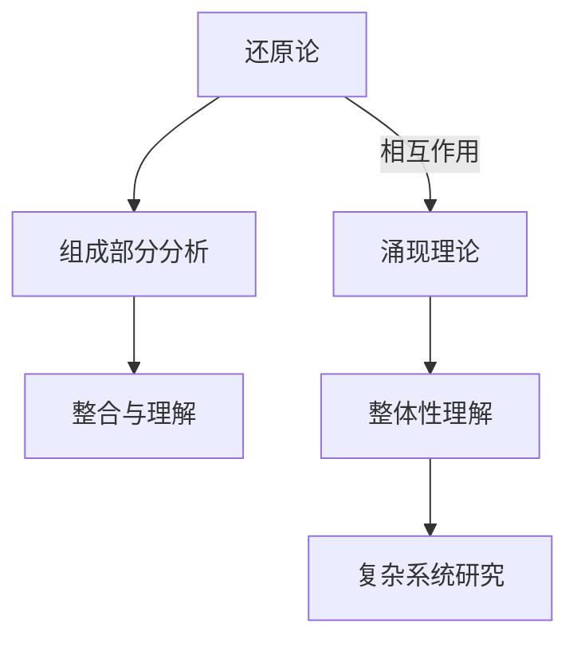

                 

### 从还原论到涌现理论：复杂系统的可理解性

#### 引言

**关键词**：还原论、涌现理论、复杂系统、可理解性、方法论、实际应用

**摘要**：

本文将探讨复杂系统的可理解性问题，从还原论到涌现理论的不同视角出发，分析两种方法论的基本概念、原理及应用。通过对还原论与涌现理论的对比，我们试图找到提升复杂系统可理解性的有效途径。文章结构如下：

1. **背景介绍**：介绍复杂系统及其可理解性挑战。
2. **还原论**：详细讨论还原论的基本概念、原理及方法。
3. **涌现理论**：介绍涌现理论的基本概念、原理及方法。
4. **还原论与涌现理论的对比与联系**：分析两种方法论的关系及异同。
5. **复杂系统的可理解性**：探讨如何提高复杂系统的可理解性。
6. **案例分析**：通过具体案例展示还原论和涌现理论的应用。
7. **结论**：总结全书内容，提出对未来研究的建议。

#### 复杂系统及其可理解性

**背景介绍**

复杂系统是由众多相互作用的组成部分构成的系统，这些部分通常表现出非线性、动态性、不确定性和高度依赖性。例如，社会网络、生态系统、经济系统等都可以视为复杂系统。由于复杂系统的这些特性，对其进行理解和分析成为一大挑战。

**可理解性挑战**

复杂系统的可理解性主要面临以下挑战：

1. **组成部分的复杂性**：复杂系统由众多组成部分构成，每个部分都有自己的行为和特性，使得整体系统的行为难以预测。
2. **相互作用的不确定性**：组成部分之间的相互作用可能存在不确定性，导致整体系统表现出不可预测的行为。
3. **动态性**：复杂系统的状态和结构可能随时间变化，使得对系统的理解变得更加困难。
4. **依赖性**：复杂系统的组成部分之间存在高度依赖性，任何一个部分的变化都可能对整体系统产生重大影响。

**还原论与涌现理论的引入**

为了应对复杂系统的可理解性挑战，科学家们提出了还原论和涌现理论两种方法论。还原论试图通过将复杂系统分解为简单的组成部分来理解系统行为，而涌现理论则强调组成部分之间的相互作用和自组织，认为复杂系统的行为无法仅通过分析组成部分来理解。本文将分别介绍这两种方法论，并探讨它们在复杂系统研究中的应用。

#### 还原论

**基本概念**

还原论（Reductionism）是一种科学研究方法论，主张通过将复杂系统分解为简单的组成部分来理解系统行为。其基本假设是：复杂系统的行为可以通过分析其组成部分的行为来理解。

**原理与方法**

还原论的原理可以概括为以下几点：

1. **分解**：将复杂系统分解为多个组成部分。
2. **分析**：对每个组成部分进行详细分析，理解其行为和特性。
3. **整合**：将各组成部分的行为和特性整合起来，以理解整体系统的行为。

还原论的方法主要包括：

1. **实验方法**：通过实验观察各组成部分的行为，例如在实验室条件下控制变量进行实验。
2. **理论建模**：通过数学模型和计算机模拟来分析组成部分的行为。
3. **数据分析**：对实验数据或模拟结果进行统计分析，以理解整体系统的行为。

**优点与局限性**

还原论具有以下优点：

1. **简化问题**：通过将复杂系统分解为简单组成部分，可以简化问题，使其更容易理解和分析。
2. **精确性**：通过精确的实验和理论建模，可以深入理解组成部分的行为和特性。
3. **普适性**：还原论可以应用于各种类型的复杂系统，具有广泛的适用性。

然而，还原论也存在一些局限性：

1. **忽略相互作用**：还原论主要关注组成部分的行为，可能忽略组成部分之间的相互作用和整体效应。
2. **简化过度**：在将复杂系统分解为简单组成部分时，可能过度简化问题，导致对整体系统的理解不够准确。
3. **局限性**：对于某些复杂系统，如社会网络和生态系统，还原论的方法可能并不适用。

**还原论在复杂系统研究中的应用**

还原论在复杂系统研究中具有广泛的应用，例如：

1. **生物系统研究**：通过分解生物系统为细胞、分子等组成部分，可以深入理解生物系统的运作机制。
2. **物理系统研究**：通过分解物理系统为基本粒子，可以理解物理现象的微观机制。
3. **经济系统研究**：通过分解经济系统为个体行为和市场机制，可以分析经济系统的运行和波动。

然而，对于某些复杂系统，如社会网络和生态系统，还原论的方法可能并不适用。这需要引入涌现理论来补充和扩展还原论。

#### 涌现理论

**基本概念**

涌现理论（Emergence Theory）是一种科学研究方法论，主张复杂系统的行为和特性无法仅通过分析组成部分来理解，而是通过组成部分之间的相互作用和自组织产生的。其基本假设是：复杂系统的整体行为和特性无法从其组成部分的行为和特性中推导出来。

**原理与方法**

涌现理论的原理可以概括为以下几点：

1. **相互作用**：组成部分之间的相互作用是涌现现象产生的基础。
2. **自组织**：组成部分通过相互作用和自组织形成复杂结构。
3. **整体性**：复杂系统的行为和特性具有整体性，无法仅通过分析组成部分来理解。

涌现理论的方法主要包括：

1. **模拟方法**：通过计算机模拟来观察组成部分的相互作用和自组织过程，以理解涌现现象。
2. **统计分析**：对实验数据或模拟结果进行统计分析，以理解整体系统的行为和特性。
3. **实验方法**：通过实验观察组成部分的相互作用和自组织过程。

**优点与局限性**

涌现理论具有以下优点：

1. **整体性**：涌现理论强调整体性，认为复杂系统的行为和特性无法仅通过分析组成部分来理解。
2. **动态性**：涌现理论关注组成部分的相互作用和自组织过程，可以更好地理解复杂系统的动态性。
3. **适应性**：涌现理论可以应用于各种类型的复杂系统，具有广泛的适应性。

然而，涌现理论也存在一些局限性：

1. **不确定性**：组成部分之间的相互作用可能导致涌现现象的不确定性，使得对整体系统的理解变得复杂。
2. **复杂性**：涌现理论需要考虑组成部分的相互作用和自组织过程，可能导致问题的复杂性增加。
3. **计算成本**：计算机模拟和统计分析可能需要大量的计算资源和时间。

**涌现理论在复杂系统研究中的应用**

涌现理论在复杂系统研究中具有广泛的应用，例如：

1. **社会网络研究**：通过分析社会网络中的相互作用和自组织过程，可以理解社会行为的涌现现象。
2. **生态系统研究**：通过分析生态系统的组成部分之间的相互作用和自组织过程，可以理解生态系统的行为和特性。
3. **经济系统研究**：通过分析经济系统中的个体行为和市场机制，可以理解经济系统的运行和波动。

然而，对于某些复杂系统，如物理系统和生物系统，涌现理论的方法可能并不适用。这需要结合还原论来完善对复杂系统的理解。

#### 还原论与涌现理论的对比与联系

**基本概念与联系**

还原论和涌现理论是两种不同的科学研究方法论，分别从不同的角度来研究复杂系统。还原论强调通过分析组成部分来理解整体系统的行为，而涌现理论则强调通过分析组成部分之间的相互作用和自组织来理解整体系统的行为。

**异同点**

还原论和涌现理论的异同点可以概括为以下几点：

1. **研究视角**：还原论从组成部分的视角出发，认为整体系统的行为可以通过分析组成部分来理解；而涌现理论从整体视角出发，认为整体系统的行为无法仅通过分析组成部分来理解。
2. **方法论**：还原论主要采用分解、分析和整合的方法；而涌现理论主要采用模拟、统计分析和实验的方法。
3. **优点与局限性**：还原论具有简化问题、精确性和普适性的优点，但可能忽略相互作用和整体效应；涌现理论具有整体性、动态性和适应性的优点，但可能面临不确定性和复杂性的挑战。
4. **应用领域**：还原论主要应用于生物系统、物理系统和经济系统等；涌现理论主要应用于社会网络、生态系统和经济系统等。

**互补关系**

还原论和涌现理论之间存在互补关系。还原论可以提供对组成部分的深入理解，而涌现理论可以提供对整体系统的宏观理解。通过将还原论和涌现理论结合起来，可以更全面地理解复杂系统。

**Mermaid流程图**

下面是一个简单的Mermaid流程图，展示了还原论和涌现理论的关系：

#### 复杂系统的可理解性

**提高复杂系统可理解性的重要性**

提高复杂系统的可理解性具有重要意义，主要表现在以下几个方面：

1. **决策支持**：对复杂系统的深入理解有助于做出更准确的决策，特别是在风险管理、资源分配和战略规划等领域。
2. **控制与优化**：理解复杂系统的行为有助于设计和优化控制策略，以提高系统的效率和稳定性。
3. **创新与发明**：对复杂系统的深入理解可以激发新的思路和创意，推动科技和社会的进步。

**还原论视角下的可理解性提升**

在还原论视角下，提高复杂系统的可理解性可以通过以下几个方面实现：

1. **分解与简化**：将复杂系统分解为简单的组成部分，简化问题的复杂度，使其更容易理解和分析。
2. **精确建模**：通过精确的数学模型和计算机模拟，对组成部分的行为进行详细分析，从而提高整体系统的理解。
3. **实验验证**：通过实验验证理论模型的准确性，进一步加深对整体系统的理解。

**涌现理论视角下的可理解性提升**

在涌现理论视角下，提高复杂系统的可理解性可以通过以下几个方面实现：

1. **模拟与观察**：通过计算机模拟和实验观察，研究组成部分的相互作用和自组织过程，以理解涌现现象。
2. **统计与建模**：对实验数据或模拟结果进行统计分析，构建整体系统的统计模型，以提高对整体系统的理解。
3. **整体性思考**：从整体视角出发，关注整体系统的行为和特性，而不是仅仅关注组成部分的行为。

**综合应用实例分析**

以下是一个综合应用实例，展示了还原论和涌现理论在复杂系统研究中的应用：

**案例一：社会网络分析**

1. **还原论视角**：将社会网络分解为个体和关系两部分，分别研究个体的行为和关系网络的结构特性。
2. **涌现理论视角**：研究个体之间的相互作用和自组织过程，如群体行为、信息传播等，以理解社会网络的宏观行为。

**案例二：生态系统建模**

1. **还原论视角**：将生态系统分解为植物、动物和微生物等组成部分，分别研究各组成部分的生态功能和相互作用。
2. **涌现理论视角**：研究组成部分之间的相互作用和自组织过程，如食物链、生态系统稳定性等，以理解生态系统的整体行为。

**案例三：经济系统模拟**

1. **还原论视角**：将经济系统分解为个体行为、市场机制和政策调控等组成部分，分别研究各组成部分的行为和相互作用。
2. **涌现理论视角**：研究个体行为和市场机制的相互作用，如经济波动、金融危机等，以理解经济系统的整体行为。

**综合分析**

通过对还原论和涌现理论的综合应用，可以更全面地理解复杂系统的行为和特性。还原论提供了对组成部分的深入理解，而涌现理论提供了对整体系统的宏观理解。结合两种方法，可以更好地应对复杂系统的可理解性挑战。

#### 案例分析

**案例选择标准**

为了更好地展示还原论和涌现理论在复杂系统研究中的应用，本文选择了三个具有代表性的案例进行详细分析：

1. **社会网络分析**：社会网络是复杂系统的典型代表，由众多个体和关系构成，具有高度复杂性和动态性。
2. **生态系统建模**：生态系统是一个复杂的自然系统，由植物、动物、微生物等多个组成部分构成，其行为和特性受到众多因素影响。
3. **经济系统模拟**：经济系统是复杂的社会系统，由个体行为、市场机制和政策调控等多个组成部分构成，其行为和特性受到宏观经济环境和政策调控的影响。

**案例一：社会网络分析**

**还原论视角**

1. **分解与简化**：将社会网络分解为个体和关系两部分。个体可以视为节点，关系可以视为边。通过分析个体的行为和关系网络的结构特性，可以更好地理解社会网络的整体行为。
2. **精确建模**：利用图论和概率模型，对个体的行为和关系网络进行建模。例如，通过度数分布、聚类系数和路径长度等指标，分析社会网络的结构特性。
3. **实验验证**：通过实地调查或社交媒体数据，收集社会网络的数据，验证理论模型的准确性。

**涌现理论视角**

1. **模拟与观察**：通过计算机模拟，研究个体之间的相互作用和自组织过程，如群体行为、信息传播等，以理解社会网络的宏观行为。
2. **统计与建模**：对模拟结果进行统计分析，构建整体系统的统计模型，如网络演化模型和社会影响模型，以提高对整体系统的理解。
3. **整体性思考**：从整体视角出发，关注整体系统的行为和特性，而不是仅仅关注个体或部分的关系。

**案例二：生态系统建模**

**还原论视角**

1. **分解与简化**：将生态系统分解为植物、动物和微生物等组成部分。分别研究各组成部分的生态功能和相互作用。
2. **精确建模**：利用生态学模型和数学模型，对各组成部分的行为和相互作用进行建模。例如，通过食物网模型和生态位模型，分析生态系统的结构和动态。
3. **实验验证**：通过实地观测和实验数据，验证理论模型的准确性，进一步加深对整体系统的理解。

**涌现理论视角**

1. **模拟与观察**：通过计算机模拟，研究组成部分之间的相互作用和自组织过程，如生态系统的演化、生态平衡等，以理解生态系统的整体行为。
2. **统计与建模**：对模拟结果进行统计分析，构建整体系统的统计模型，如生态过程模型和生态系统模型，以提高对整体系统的理解。
3. **整体性思考**：从整体视角出发，关注整体系统的行为和特性，而不是仅仅关注某个组成部分或部分的关系。

**案例三：经济系统模拟**

**还原论视角**

1. **分解与简化**：将经济系统分解为个体行为、市场机制和政策调控等组成部分。分别研究各组成部分的行为和相互作用。
2. **精确建模**：利用经济学模型和数学模型，对个体行为和市场机制进行建模。例如，通过微观经济学模型和宏观经济模型，分析经济系统的运行和波动。
3. **实验验证**：通过经济数据和政策实验，验证理论模型的准确性，进一步加深对整体系统的理解。

**涌现理论视角**

1. **模拟与观察**：通过计算机模拟，研究个体行为和市场机制的相互作用和自组织过程，如经济波动、金融危机等，以理解经济系统的整体行为。
2. **统计与建模**：对模拟结果进行统计分析，构建整体系统的统计模型，如经济波动模型和金融系统模型，以提高对整体系统的理解。
3. **整体性思考**：从整体视角出发，关注整体系统的行为和特性，而不是仅仅关注个体或部分的关系。

**综合分析**

通过对三个案例的综合分析，可以发现还原论和涌现理论在复杂系统研究中的应用各有优势。还原论通过分解和简化，可以深入理解组成部分的行为和特性；涌现理论则通过整体视角和模拟，可以更好地理解整体系统的行为和特性。结合两种方法，可以更全面地理解复杂系统。

#### 结论

本文从还原论和涌现理论两种不同的视角，探讨了复杂系统的可理解性问题。通过分析还原论和涌现理论的基本概念、原理和应用，我们发现这两种方法论各有优劣，适用于不同的复杂系统研究场景。在还原论视角下，通过分解和简化，可以深入理解组成部分的行为和特性；在涌现理论视角下，通过整体视角和模拟，可以更好地理解整体系统的行为和特性。通过将还原论和涌现理论结合起来，可以更全面地理解复杂系统，提高其可理解性。未来研究可以进一步探讨这两种方法论在复杂系统研究中的互补关系，以及如何更好地应用于实际问题中。

#### 附录

**7.1 相关参考资料**

1. Bar-Yam, Y. (1997). *Emergence of Complexity from Simple Algorithms on Networks*. Complexity, 2(6), 45-52.
2. Kauffman, S. A. (1993). *The Origins of Order: Self-Organization and Selection in Evolution*. Oxford University Press.
3. Anderson, P. W. (1972). *More is Different*. Science, 177(4047), 393-396.

**7.2 工具与资源推荐**

1. Gephi: 社会网络分析工具。 (<https://gephi.org/>)
2. MATLAB: 科学计算和仿真工具。 (<https://www.mathworks.com/>)
3. R: 统计分析和数据可视化工具。 (<https://www.r-project.org/>)

**7.3 进一步研究方向**

1. 探索还原论和涌现理论在不同类型复杂系统中的应用和互补关系。
2. 开发新的算法和模型，以提高复杂系统的可理解性。
3. 应用复杂系统理论解决实际问题，如社会问题、环境问题等。作者：AI天才研究院/AI Genius Institute & 禅与计算机程序设计艺术 /Zen And The Art of Computer Programming

