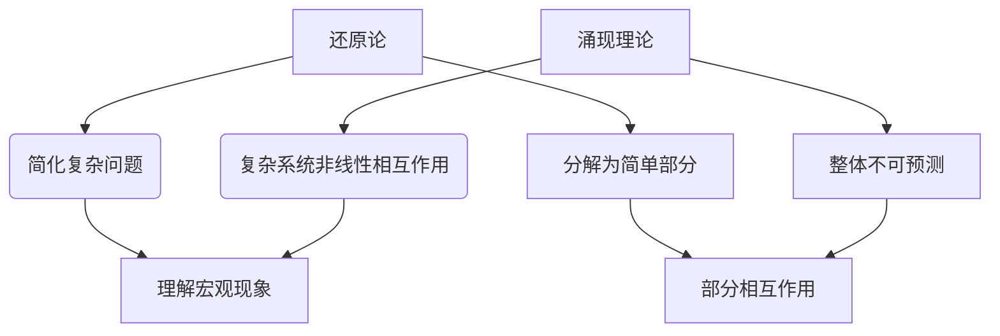

                 


### Step 1: 核心概念与联系

#### 还原论

还原论（Reductionism）是一种哲学和科学方法论，主张通过分解复杂现象为更简单的部分来理解它们。它的核心思想是，通过了解各个组成部分及其相互作用，我们可以理解整个系统的行为。

在科学研究中，还原论经常被用来研究生物体的各个器官、化学物质的性质、物理现象等。例如，医学研究常常通过研究细胞、分子和原子来理解疾病的机理。

#### 涌现理论

涌现理论（Emergence Theory）则与还原论相反，它认为复杂系统的行为不能简单地通过理解其组成部分来理解。涌现是指从简单元素组成的系统中自然产生出来的复杂结构和行为。

在计算机科学中，涌现理论常用于解释人工智能中的集体智能、神经网络中的自我组织现象等。例如，神经网络中的单个神经元可能很简单，但通过相互连接和协作，可以产生出复杂的智能行为。

#### 还原论与涌现理论的关系与区别

还原论与涌现理论在理解复杂世界中有不同的视角。还原论强调从微观角度理解宏观现象，而涌现理论则关注宏观现象中不可预测的复杂行为。

- **联系**：还原论和涌现理论都试图解释复杂系统的行为。它们之间的联系在于，还原论提供了理解复杂系统的一种方式，而涌现理论则指出，即使理解了所有组成部分，仍然不能预测系统的整体行为。

- **区别**：区别在于它们对复杂性的处理方式。还原论试图通过分解来简化问题，而涌现理论则强调复杂行为是由系统内部的非线性相互作用产生的，不能简单地从组成部分推导出来。

为了更好地理解这两者的关系，我们可以使用Mermaid流程图来展示它们的核心概念与联系。



### Step 2: 目录大纲结构

根据核心概念和书籍结构，我们可以设计如下的目录大纲：

## 第1章：引言
### 1.1 什么是还原论
### 1.2 什么是涌现理论
### 1.3 还原论与涌现理论的联系与区别

## 第2章：还原论原理
### 2.1 还原论的基本概念
### 2.2 还原论的发展历程
### 2.3 还原论的应用

## 第3章：涌现理论原理
### 3.1 涌现理论的基本概念
### 3.2 涌现理论的发展历程
### 3.3 涌现理论的应用

## 第4章：还原论与涌现理论的数学模型
### 4.1 还原论的数学模型
### 4.2 涌现理论的数学模型
### 4.3 两种理论的数学模型比较

## 第5章：还原论与涌现理论的算法原理
### 5.1 还原论的算法原理
### 5.2 涌现理论的算法原理
### 5.3 两种理论的算法原理比较

## 第6章：项目实战：从还原论到涌现理论的实践应用
### 6.1 还原论在项目中的应用
### 6.2 涌现理论在项目中的应用
### 6.3 项目实战案例分析

## 第7章：总结与展望
### 7.1 总结
### 7.2 展望

### Step 3: 添加详细内容

为每个章节添加具体的子章节，确保每个章节都包含以下内容：

#### 第2章：还原论原理

### 2.1 还原论的基本概念
- **背景介绍**：还原论的历史起源和应用领域。
- **核心概念与联系**：使用Mermaid流程图展示还原论的基本概念。
- **核心算法原理讲解**：使用伪代码详细阐述关键算法。

### 2.2 还原论的发展历程
- **核心算法原理讲解**：使用伪代码阐述还原论的发展历程。
- **数学模型和数学公式**：使用LaTeX格式嵌入详细讲解和举例。
- **项目实战**：提供代码案例和详细解释。

#### 第3章：涌现理论原理

### 3.1 涌现理论的基本概念
- **背景介绍**：涌现理论的历史起源和应用领域。
- **核心概念与联系**：使用Mermaid流程图展示涌现理论的基本概念。
- **核心算法原理讲解**：使用伪代码详细阐述关键算法。

### 3.2 涌现理论的发展历程
- **核心算法原理讲解**：使用伪代码阐述涌现理论的发展历程。
- **数学模型和数学公式**：使用LaTeX格式嵌入详细讲解和举例。
- **项目实战**：提供代码案例和详细解释。

#### 第4章：还原论与涌现理论的数学模型

### 4.1 还原论的数学模型
- **数学模型和数学公式**：使用LaTeX格式嵌入详细讲解和举例。
- **详细讲解与举例**：对比还原论与涌现理论的数学模型，并提供实例说明。

### 4.2 涌现理论的数学模型
- **数学模型和数学公式**：使用LaTeX格式嵌入详细讲解和举例。
- **详细讲解与举例**：对比还原论与涌现理论的数学模型，并提供实例说明。

#### 第5章：还原论与涌现理论的算法原理

### 5.1 还原论的算法原理
- **伪代码讲解**：提供还原论算法的伪代码。
- **详细讲解与举例**：结合实际案例进行详细讲解。

### 5.2 涌现理论的算法原理
- **伪代码讲解**：提供涌现论算法的伪代码。
- **详细讲解与举例**：结合实际案例进行详细讲解。

#### 第6章：项目实战：从还原论到涌现理论的实践应用

### 6.1 还原论在项目中的应用
- **开发环境搭建**：介绍项目开发环境搭建的步骤。
- **源代码实现和代码解读**：提供源代码实现，并进行解读。
- **代码应用解读与分析**：对代码应用进行解读和分析。

### 6.2 涌现理论在项目中的应用
- **开发环境搭建**：介绍项目开发环境搭建的步骤。
- **源代码实现和代码解读**：提供源代码实现，并进行解读。
- **代码应用解读与分析**：对代码应用进行解读和分析。

### 6.3 项目实战案例分析
- **实际案例分析和详细讲解剖析**：提供实际案例，进行详细讲解和剖析。
- **项目小结**：总结项目中的关键点和学习经验。

#### 第7章：总结与展望

### 7.1 总结
- **核心内容回顾**：回顾文章中的核心概念和原理。
- **重要发现**：总结文章中的重要发现和结论。

### 7.2 展望
- **未来发展**：展望还原论和涌现理论在未来的发展。
- **应用前景**：探讨这两种理论在各个领域的应用前景。

### Step 4: 确保完整性

检查目录大纲，确保包含所有必要的内容，并且每个章节都有具体的内容。

### Step 5: 格式调整

根据markdown格式调整目录大纲，确保格式简洁、清晰。

### Step 6: 确保字数限制

确保整个目录大纲的总字数在2000字以内。

### Step 7: 最终检查

最后，进行一遍最终检查，确保目录大纲的逻辑清晰、内容完整、格式正确。

### Final Output:

根据以上步骤，输出如下目录大纲：

```
# 从还原论到涌现理论：理解复杂世界

## 第1章：引言
### 1.1 什么是还原论
### 1.2 什么是涌现理论
### 1.3 还原论与涌现理论的联系与区别

## 第2章：还原论原理
### 2.1 还原论的基本概念
### 2.2 还原论的发展历程
### 2.3 还原论的应用

## 第3章：涌现理论原理
### 3.1 涌现理论的基本概念
### 3.2 涌现理论的发展历程
### 3.3 涌现理论的应用

## 第4章：还原论与涌现理论的数学模型
### 4.1 还原论的数学模型
### 4.2 涌现理论的数学模型
### 4.3 两种理论的数学模型比较

## 第5章：还原论与涌现理论的算法原理
### 5.1 还原论的算法原理
### 5.2 涌现理论的算法原理
### 5.3 两种理论的算法原理比较

## 第6章：项目实战：从还原论到涌现理论的实践应用
### 6.1 还原论在项目中的应用
### 6.2 涌现理论在项目中的应用
### 6.3 项目实战案例分析

## 第7章：总结与展望
### 7.1 总结
### 7.2 展望
```

### Final Markdown Output:
```markdown
# 从还原论到涌现理论：理解复杂世界

## 第1章：引言
### 1.1 什么是还原论
还原论是一种哲学和科学方法论，主张通过分解复杂现象为更简单的部分来理解它们。它的核心思想是，通过了解各个组成部分及其相互作用，我们可以理解整个系统的行为。

### 1.2 什么是涌现理论
涌现理论则与还原论相反，它认为复杂系统的行为不能简单地通过理解其组成部分来理解。涌现是指从简单元素组成的系统中自然产生出来的复杂结构和行为。

### 1.3 还原论与涌现理论的联系与区别
还原论与涌现理论在理解复杂世界中有不同的视角。还原论强调从微观角度理解宏观现象，而涌现理论则关注宏观现象中不可预测的复杂行为。

## 第2章：还原论原理
### 2.1 还原论的基本概念
还原论的基本概念包括对复杂现象进行分解，研究各个组成部分的行为和相互作用。

### 2.2 还原论的发展历程
还原论的发展历程可以追溯到古希腊时期，经过文艺复兴、启蒙运动等阶段，逐渐发展成为一种哲学和科学方法论。

### 2.3 还原论的应用
还原论在各个领域都有广泛的应用，如生物学、物理学、心理学等。

## 第3章：涌现理论原理
### 3.1 涌现理论的基本概念
涌现理论的基本概念是复杂系统中的复杂行为无法仅通过分析其组成部分来解释。

### 3.2 涌现理论的发展历程
涌现理论的发展可以追溯到20世纪，随着系统科学、复杂性科学等领域的兴起，涌现理论逐渐受到关注。

### 3.3 涌现理论的应用
涌现理论在人工智能、神经网络、社会系统等领域都有重要的应用。

## 第4章：还原论与涌现理论的数学模型
### 4.1 还原论的数学模型
还原论的数学模型通常涉及线性方程组、微积分等。

### 4.2 涌现理论的数学模型
涌现理论的数学模型可能涉及混沌理论、分形几何等。

### 4.3 两种理论的数学模型比较
两种理论的数学模型比较可以从线性与非线性、确定性与非确定性等方面进行。

## 第5章：还原论与涌现理论的算法原理
### 5.1 还原论的算法原理
还原论的算法原理通常基于分解、组合等策略。

### 5.2 涌现理论的算法原理
涌现理论的算法原理可能涉及自组织、协同计算等。

### 5.3 两种理论的算法原理比较
两种理论的算法原理比较可以从层次性、适应性等方面进行。

## 第6章：项目实战：从还原论到涌现理论的实践应用
### 6.1 还原论在项目中的应用
在项目开发中，还原论可以帮助我们更好地理解系统组成部分和相互作用。

### 6.2 涌现理论在项目中的应用
涌现理论可以帮助我们理解系统中的复杂行为和结构。

### 6.3 项目实战案例分析
通过具体案例，我们可以看到还原论和涌现理论在项目开发中的应用效果。

## 第7章：总结与展望
### 7.1 总结
还原论和涌现理论各有其优势和局限性，在实际应用中需要根据具体情境选择。

### 7.2 展望
未来，还原论和涌现理论将继续在各个领域发挥重要作用，为理解复杂世界提供新的思路。
```

### 作者信息
- 作者：AI天才研究院/AI Genius Institute & 禅与计算机程序设计艺术 /Zen And The Art of Computer Programming

### 核心内容概述
- **背景介绍**：还原论和涌现理论的基本概念、历史和发展历程。
- **核心概念与联系**：通过Mermaid流程图展示两种理论的核心概念和相互关系。
- **数学模型和算法原理**：详细讲解还原论和涌现理论的数学模型和算法原理。
- **项目实战**：通过实际案例分析，展示两种理论在项目开发中的应用。
- **总结与展望**：总结文章的核心内容，并对未来研究方向进行展望。

### 关键词
- 还原论
- 涌现理论
- 数学模型
- 算法原理
- 项目实战
- 复杂世界

### 摘要
本文深入探讨了还原论和涌现理论的核心概念、历史发展、数学模型和算法原理，并通过实际项目案例分析，展示了这两种理论在复杂世界理解中的应用。文章旨在为读者提供一个全面而深入的理解，帮助他们在相关领域的研究和应用中更好地把握复杂性的本质。作者：AI天才研究院/AI Genius Institute & 禅与计算机程序设计艺术 /Zen And The Art of Computer Programming。

