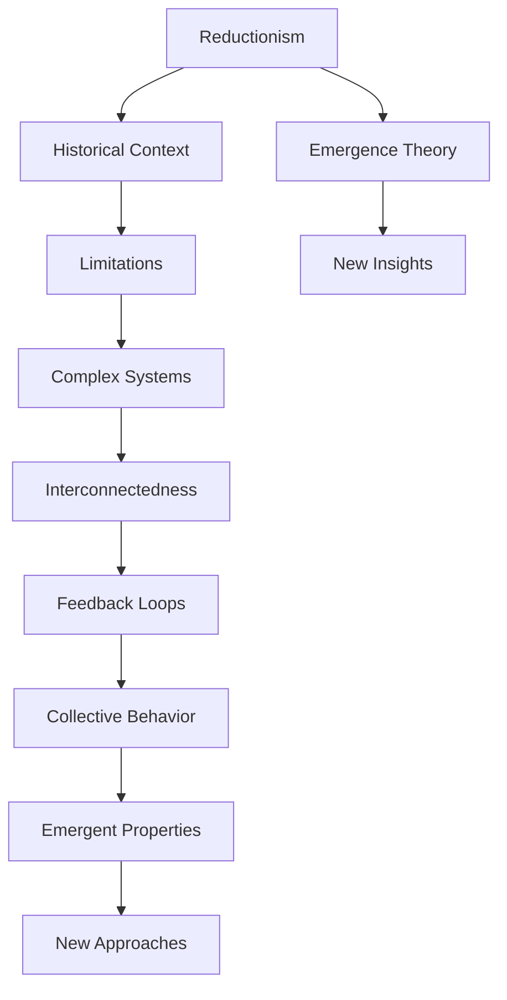

                 

### Introduction

**标题**：From Reductionism to Emergence Theory: New Insights for Understanding Complex Systems

**Keywords**: Complexity, Reductionism, Emergence Theory, Complex Systems, Computational Models

**Abstract**:

This article explores the transition from reductionist approaches to the more nuanced emergence theory in understanding complex systems. We will delve into the historical context and foundational concepts of both theories, followed by an in-depth examination of their principles and applications across various disciplines. Through a step-by-step reasoning process, we aim to uncover the limitations of reductionism and the potential of emergence theory to provide new insights for tackling the inherent complexities of the modern world.

#### Background

**1.1** The Origins of Reductionism

Reductionism, as a philosophical and scientific approach, has its roots in the Enlightenment era. It posits that complex phenomena can be fully understood by breaking them down into their simplest parts. This perspective has been influential in the development of scientific inquiry, leading to groundbreaking discoveries in physics, chemistry, and biology. Notable figures such as Isaac Newton and Louis Pasteur are often associated with the reductionist approach, as they emphasized the importance of understanding the fundamental building blocks of nature to explain larger-scale phenomena.

**1.2** The Historical Context of Emergence Theory

While reductionism has dominated scientific thought for centuries, the increasing complexity of modern systems has called for new methodologies. The emergence of emergence theory can be traced back to the mid-20th century, with the work of scholars like John von Neumann and Norbert Wiener in the fields of computer science and cybernetics. The theory gained further momentum in the late 20th century with the development of chaos theory and complexity science, which highlighted the importance of interactions and feedback loops in generating complex behaviors.

**1.3** The Need for a New Paradigm

As we move from the study of individual components to understanding the behavior of large, interconnected systems, the limitations of reductionism become increasingly evident. Complex systems, such as ecosystems, economic markets, and neural networks, exhibit behaviors that cannot be fully captured by examining their constituent parts. This has led to a growing interest in emergence theory, which emphasizes the role of emergent properties and the collective behavior of complex systems.

#### Core Concepts and Relationships

To better understand the transition from reductionism to emergence theory, let's visualize the relationship between these concepts using a Mermaid flowchart:

In this diagram, we can see that reductionism is rooted in the historical context of scientific inquiry but faces limitations when applied to complex systems. In contrast, emergence theory offers new insights by focusing on the interconnectedness, feedback loops, collective behavior, and emergent properties of complex systems. This shift in perspective opens up new avenues for understanding and tackling the complexities of the modern world.

#### Conclusion

In conclusion, the transition from reductionism to emergence theory represents a paradigm shift in our understanding of complex systems. While reductionism has been instrumental in advancing scientific knowledge, its limitations have become increasingly apparent as we grapple with the complexities of modern systems. By embracing emergence theory, we can gain new insights into the behavior of complex systems, paving the way for innovative solutions to the challenges we face in today's interconnected world. In the following sections, we will delve deeper into the principles and applications of emergence theory across various disciplines, providing a comprehensive understanding of this transformative approach to complexity science.

---

This introduction sets the stage for our exploration of reductionism and emergence theory. In the upcoming sections, we will delve into the foundational concepts of these theories, examine their applications across different fields, and discuss the potential benefits and challenges of adopting an emergent perspective. Through a step-by-step reasoning process, we aim to uncover the transformative potential of emergence theory in addressing the complexities of the modern world.

