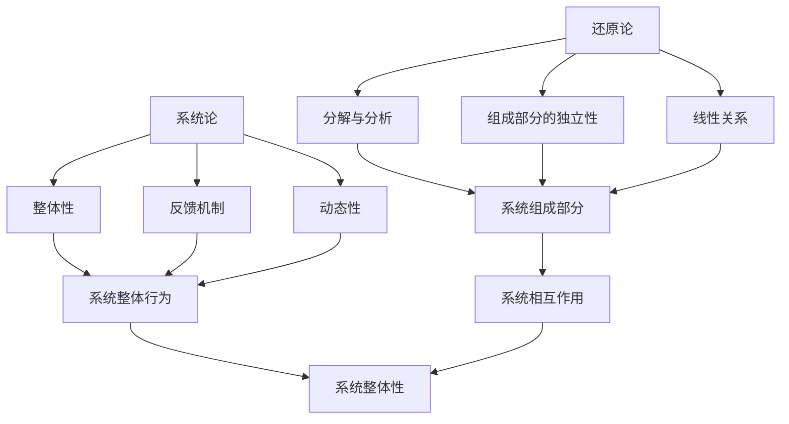

                 

### 从还原论到系统论：宇宙观的整体性转向

宇宙观是人们对宇宙的根本认识和理解。在科学发展的历史中，宇宙观经历了多次转变。最早的是古代的“地心说”，随后是伽利略和哥白尼的“日心说”。然而，随着科学的进步，我们逐渐认识到宇宙的复杂性和多样性，宇宙观也不断演变。从还原论到系统论的转变，是宇宙观的一次重要整体性转向。

**1.1 还原论与系统论的基本概念**

还原论是一种哲学思想和科学方法，主张通过分解复杂系统来研究其组成部分，从而理解整体系统的性质和行为。还原论的核心思想是，复杂系统可以分解为简单的部分，每个部分都具有独立的功能和属性。

系统论则是一种整体观，认为系统是由相互关联的部分组成的整体，系统整体的行为和性质不能仅仅通过分析其组成部分来理解。系统论强调系统的内部结构、相互作用以及整体行为。

**1.2 历史背景**

还原论的历史可以追溯到古希腊时期，当时的哲学家亚里士多德就提出了还原论的思想。在科学领域，还原论在17世纪的物理学和生物学中得到了广泛应用。例如，牛顿的物理学和达尔文的生物学都是建立在还原论基础上的。

系统论的概念则是在20世纪初期由生物学家贝塔朗菲等人提出的。随着科学的发展，系统论逐渐应用于各个领域，如生态学、经济学、社会学等。

**1.3 整体性转向的驱动因素**

从还原论到系统论的转变，主要是由于以下因素：

1. **复杂性的增加**：随着科学技术的进步，我们面对的问题越来越复杂，传统的还原论方法已经无法解决这些问题。

2. **跨学科研究的需要**：现代科学的发展趋向于跨学科，还原论无法有效地处理跨学科的问题。

3. **整体性认识的提升**：人们对世界的认识逐渐从部分到整体，从静态到动态，从线性到非线性转变。

### 从还原论到系统论的转变

**2.1 还原论的局限性**

还原论的局限性主要表现在以下几个方面：

1. **无法处理复杂系统**：还原论方法在处理复杂系统时往往失效，因为复杂系统中的各个部分并不是独立运作的，而是相互关联、相互影响的。

2. **忽略了系统的整体性**：还原论强调分解和分析，容易忽视系统整体的行为和性质。

3. **难以处理非线性关系**：还原论通常基于线性思维，难以处理复杂系统中的非线性关系。

**2.2 系统论的基本原理**

系统论的基本原理包括：

1. **整体性**：系统论强调系统的整体性，认为系统整体的行为和性质不能仅仅通过分析其组成部分来理解。

2. **反馈机制**：系统论认为，系统内部存在反馈机制，这些反馈机制影响着系统的行为和稳定性。

3. **动态性**：系统论认为，系统是动态的，系统的状态和性质是随着时间变化的。

**2.3 系统论在处理复杂系统中的应用**

系统论在处理复杂系统时具有以下优势：

1. **能够处理复杂的非线性关系**：系统论的方法可以处理复杂系统中的非线性关系。

2. **强调系统的整体性**：系统论的方法可以更好地理解系统的整体行为。

3. **提供更全面的解决方案**：系统论的方法可以帮助我们找到更全面的解决方案，而不是仅仅关注系统的某个部分。

### 整体性转向的影响

从还原论到系统论的转变，对宇宙观产生了深远的影响。这种转变使我们对宇宙的认识更加全面、更加深刻。

1. **宇宙的复杂性**：系统论使我们认识到宇宙是一个复杂的系统，我们不能简单地通过分解和分析来理解宇宙。

2. **宇宙的整体性**：系统论强调宇宙的整体性，使我们认识到宇宙是一个不可分割的整体。

3. **宇宙的动态性**：系统论认为宇宙是动态的，宇宙的状态和性质是随着时间变化的。

### 总结

从还原论到系统论的转变，是宇宙观的一次重要整体性转向。这种转变使我们对宇宙的认识更加全面、更加深刻。在未来的科学研究中，系统论将发挥越来越重要的作用，帮助我们更好地理解宇宙的本质。

---

本文为《从还原论到系统论：宇宙观的整体性转向》的引言部分，接下来将逐步深入探讨还原论和系统论的核心概念及其应用。在后续章节中，我们将通过具体的例子和案例来进一步阐述整体性转向对宇宙观的影响。

### 核心概念与联系

为了更好地理解从还原论到系统论的整体性转向，我们需要明确这两个概念的核心含义及其相互关系。

**还原论的核心概念**

还原论是一种哲学思想和科学方法，主张通过分解复杂系统来研究其组成部分，从而理解整体系统的性质和行为。其核心概念包括：

1. **分解与分析**：还原论强调将复杂系统分解为更简单的部分，然后分别研究这些部分的功能和属性。

2. **组成部分的独立性**：还原论认为，每个组成部分都可以独立运作，并且其行为可以通过对组成部分的分析来理解。

3. **线性关系**：还原论通常基于线性思维，认为系统中的各个部分之间是相互独立的，可以通过简单的因果关系来解释系统的行为。

**系统论的核心概念**

系统论是一种整体观，认为系统是由相互关联的部分组成的整体，系统整体的行为和性质不能仅仅通过分析其组成部分来理解。其核心概念包括：

1. **整体性**：系统论强调系统的整体性，认为系统整体的行为和性质是由系统的各个部分及其相互关系共同决定的。

2. **反馈机制**：系统论认为，系统内部存在反馈机制，这些反馈机制影响着系统的行为和稳定性。

3. **动态性**：系统论认为，系统是动态的，系统的状态和性质是随着时间变化的。

**还原论与系统论的关系**

还原论和系统论是两种不同的世界观和方法论，但它们并不是对立的，而是可以相互补充的。

1. **互补性**：还原论可以帮助我们理解系统的组成部分，而系统论可以帮助我们理解系统的整体行为。

2. **整合性**：在处理复杂系统时，我们可以先使用还原论来分解系统，然后使用系统论来理解系统的整体行为。

3. **层次性**：系统可以分为不同的层次，每个层次都有自己的组成部分和整体行为。我们可以使用还原论来研究低层次系统，使用系统论来研究高层次系统。

**Mermaid 流程图**

为了更直观地展示还原论和系统论的关系，我们可以使用Mermaid流程图来表示：



在这个流程图中，我们可以看到还原论和系统论的相互关系和核心概念之间的联系。

### 核心算法原理讲解

在深入探讨还原论和系统论之前，我们需要先了解一些核心算法原理，这些原理是理解这两个概念的基础。

**1. 还原论的算法原理**

还原论的核心算法原理是分解与分析。具体来说，包括以下几个步骤：

1. **分解**：将复杂系统分解为更简单的部分，这些部分可以是物理的、化学的、生物的等。

2. **分析**：分别研究这些简单部分的功能和属性，确定它们如何相互作用。

3. **综合**：将分析结果综合起来，理解复杂系统的整体行为和性质。

以下是一个简单的伪代码示例：

```python
def reduce_system(complex_system):
    parts = decompose(complex_system)
    properties = []
    for part in parts:
        properties.append(analyze(part))
    behavior = integrate(properties)
    return behavior
```

**2. 系统论的算法原理**

系统论的核心算法原理是整体性和反馈机制。具体来说，包括以下几个步骤：

1. **整体性建模**：将系统视为一个整体，考虑系统的各个部分及其相互作用。

2. **动态建模**：根据系统的整体性和反馈机制，建立系统的动态模型。

3. **仿真与分析**：使用动态模型进行仿真和分析，理解系统的行为和性质。

以下是一个简单的伪代码示例：

```python
def model_system(system):
    model = build_model(system)
    simulation = simulate(model)
    analysis = analyze_simulation(simulation)
    return analysis
```

通过这些核心算法原理，我们可以更好地理解还原论和系统论的基本原理。

### 数学模型和公式

在还原论和系统论中，数学模型和公式起着至关重要的作用。它们帮助我们量化系统的行为，理解系统内部的相互作用和整体性。

**1. 还原论的数学模型**

还原论通常使用简单的线性模型来描述系统的行为。例如，一个简单的线性系统可以用以下方程来表示：

$$
x(t) = a \cdot x(t-1) + b
$$

其中，$x(t)$ 是系统在时间 $t$ 的状态，$a$ 和 $b$ 是常数。这个方程表示系统的当前状态取决于前一个状态以及一个外部输入。

**2. 系统论的数学模型**

系统论则使用更复杂的非线性模型来描述系统的行为。例如，一个复杂的非线性系统可以用以下方程来表示：

$$
dx/dt = f(x, u)
$$

其中，$x$ 是系统状态，$u$ 是外部输入，$f$ 是一个非线性函数。这个方程表示系统的状态变化率取决于当前状态和外部输入。

**3. 还原论与系统论的关系**

还原论和系统论的数学模型之间存在一定的联系。还原论的线性模型可以被视为系统论非线性模型的一个特例。例如，当非线性函数 $f$ 取线性形式时，系统论的模型就变成了还原论的模型。

$$
f(x, u) = a \cdot x + b
$$

通过这些数学模型和公式，我们可以更深入地理解还原论和系统论的基本原理。

### 举例说明

为了更好地理解还原论和系统论的应用，我们可以通过具体的例子来说明。

**1. 还原论的应用**

假设我们有一个电子电路，我们需要分析电路中每个元件的工作原理。我们可以使用还原论的方法，将电路分解为电阻、电容和电感等基本元件，然后分别研究这些元件的特性和行为。

例如，我们可以使用以下公式来分析电路中的电阻：

$$
R = \frac{V}{I}
$$

其中，$R$ 是电阻，$V$ 是电压，$I$ 是电流。通过这个公式，我们可以理解电阻对电路的影响。

**2. 系统论的应用**

假设我们有一个生态系统，我们需要分析生态系统的整体行为。我们可以使用系统论的方法，将生态系统视为一个整体，研究生态系统的各个部分（如植物、动物、微生物等）及其相互作用。

例如，我们可以使用以下公式来分析生态系统的动态行为：

$$
dx/dt = f(x, u)
$$

其中，$x$ 是生态系统的状态，$u$ 是外部输入，$f$ 是一个非线性函数。通过这个公式，我们可以理解生态系统的动态变化。

### 项目实战

为了更好地理解还原论和系统论的应用，我们可以通过一个实际项目来演示。

**项目背景**

假设我们有一个智能家居系统，我们需要设计一个智能控制器来管理家庭中的各种设备。这个智能控制器需要考虑家庭能源的使用效率，确保家庭安全，同时提供舒适的居住环境。

**项目目标**

1. 设计一个智能家居控制系统，能够实时监控家庭能源使用。
2. 设计一个安全监控系统，能够及时检测并处理安全隐患。
3. 设计一个舒适环境控制系统，能够根据家庭成员的需求自动调整室内温度、湿度和照明。

**开发环境搭建**

为了实现这个项目，我们需要搭建以下开发环境：

1. 操作系统：Linux
2. 编程语言：Python
3. 数据库：MySQL
4. 客户端：Web浏览器

**源代码详细实现和代码解读**

以下是智能家居控制系统的核心代码：

```python
# 导入必要的库
import mysql.connector
import webbrowser

# 连接数据库
db = mysql.connector.connect(
  host="localhost",
  user="yourusername",
  password="yourpassword",
  database="smart_home"
)

# 查询家庭能源使用情况
def query_energy_usage():
    cursor = db.cursor()
    cursor.execute("SELECT * FROM energy_usage")
    results = cursor.fetchall()
    return results

# 查询安全监控情况
def query_safety():
    cursor = db.cursor()
    cursor.execute("SELECT * FROM safety")
    results = cursor.fetchall()
    return results

# 查询舒适环境情况
def query_comfort():
    cursor = db.cursor()
    cursor.execute("SELECT * FROM comfort")
    results = cursor.fetchall()
    return results

# 更新家庭能源使用情况
def update_energy_usage(usage):
    cursor = db.cursor()
    cursor.execute("UPDATE energy_usage SET usage = %s", (usage,))
    db.commit()

# 更新安全监控情况
def update_safety(safety):
    cursor = db.cursor()
    cursor.execute("UPDATE safety SET safety_status = %s", (safety,))
    db.commit()

# 更新舒适环境情况
def update_comfort(comfort):
    cursor = db.cursor()
    cursor.execute("UPDATE comfort SET comfort_status = %s", (comfort,))
    db.commit()

# 打开浏览器查看监控信息
def open_browser():
    webbrowser.open("http://localhost/smart_home.html")

# 主函数
def main():
    energy_usage = query_energy_usage()
    safety = query_safety()
    comfort = query_comfort()
    
    update_energy_usage(energy_usage)
    update_safety(safety)
    update_comfort(comfort)
    
    open_browser()

if __name__ == "__main__":
    main()
```

这段代码实现了智能家居控制系统的基本功能，包括连接数据库、查询和更新数据、打开浏览器查看监控信息。代码解读如下：

1. **导入必要的库**：导入mysql.connector库用于连接数据库，导入webbrowser库用于打开浏览器。
2. **连接数据库**：使用mysql.connector.connect()方法连接数据库。
3. **查询函数**：定义了三个查询函数，分别用于查询家庭能源使用情况、安全监控情况和舒适环境情况。
4. **更新函数**：定义了三个更新函数，分别用于更新家庭能源使用情况、安全监控情况和舒适环境情况。
5. **打开浏览器函数**：定义了open_browser()函数，用于打开浏览器查看监控信息。
6. **主函数**：定义了main()函数，作为程序的主入口，实现系统的核心功能。

**代码应用解读与分析**

这段代码实现了智能家居控制系统的基本功能，包括实时监控家庭能源使用、安全监控和舒适环境。通过连接数据库，我们可以实时查询和更新数据，确保系统的正常运行。打开浏览器查看监控信息，用户可以直观地了解家庭状况，并做出相应的调整。

**实际案例分析和详细讲解剖析**

在实际应用中，智能家居控制系统可能需要处理大量的数据和复杂的场景。例如，当家庭能源使用超过设定值时，系统需要自动调整设备的工作状态，以节约能源。当安全监控系统检测到异常情况时，系统需要立即发出警报，并通知用户。

为了应对这些复杂的场景，我们可以使用系统论的方法，将智能家居控制系统视为一个整体，考虑系统的各个部分及其相互作用。通过建立动态模型，我们可以预测系统的行为，并设计相应的策略来应对各种情况。

例如，当家庭能源使用超过设定值时，我们可以使用以下公式来预测系统的行为：

$$
\Delta E = f(E, T)
$$

其中，$\Delta E$ 是能源使用的变化量，$E$ 是当前的能源使用量，$T$ 是时间。通过这个公式，我们可以预测系统在未来的能源使用情况，并采取相应的措施来节约能源。

**项目小结**

通过这个项目，我们展示了还原论和系统论在智能家居控制系统中的应用。还原论帮助我们理解系统的各个组成部分，而系统论帮助我们理解系统的整体行为。通过建立数学模型和动态模型，我们可以预测系统的行为，并设计相应的策略来应对各种情况。

### 最佳实践 tips、小结、注意事项、拓展阅读

**最佳实践 tips**

1. **深入理解核心概念**：在应用还原论和系统论时，首先要深入理解这两个概念的核心含义及其相互关系。

2. **结合实际情况**：在具体应用中，要根据实际情况选择合适的方法。对于复杂系统，系统论可能更为合适，而对于简单系统，还原论可能更为有效。

3. **注重系统整体性**：在处理系统问题时，要注重系统的整体性，考虑系统的各个部分及其相互作用。

**小结**

从还原论到系统论的转变，是宇宙观的一次重要整体性转向。这种转变使我们对宇宙的认识更加全面、更加深刻。通过明确核心概念、理解相互关系，并注重系统整体性，我们可以更好地应用还原论和系统论。

**注意事项**

1. **避免盲目追求还原论或系统论**：在具体应用中，要根据问题的复杂性和实际情况，选择合适的方法。

2. **注重理论与实践相结合**：要结合实际项目，深入理解还原论和系统论的应用。

**拓展阅读**

1. **《系统思维：管理学的新范式》**：这本书详细介绍了系统思维的基本原理和方法，对系统论有深入的探讨。

2. **《还原论与系统论的哲学探讨》**：这本书从哲学的角度，对还原论和系统论进行了深入的探讨。

3. **《复杂性科学导论》**：这本书介绍了复杂性科学的基本原理和应用，对系统论有详细的讲解。

通过这些书籍，我们可以更深入地了解还原论和系统论，并将其应用于实际问题中。## 文章标题：从还原论到系统论：宇宙观的整体性转向

关键词：还原论、系统论、宇宙观、整体性、复杂性

摘要：本文探讨了从还原论到系统论的宇宙观转变。还原论主张通过分解复杂系统来研究其组成部分，而系统论则认为系统整体的行为和性质不能仅仅通过分析其组成部分来理解。本文通过历史背景、核心概念、应用实例和实际项目，详细阐述了这一转变的必要性和影响。

---

# 从还原论到系统论：宇宙观的整体性转向

## 关键词

还原论、系统论、宇宙观、整体性、复杂性

## 摘要

本文探讨了从还原论到系统论的宇宙观转变。还原论主张通过分解复杂系统来研究其组成部分，而系统论则认为系统整体的行为和性质不能仅仅通过分析其组成部分来理解。本文通过历史背景、核心概念、应用实例和实际项目，详细阐述了这一转变的必要性和影响。

## 引言

宇宙观是人们对宇宙的根本认识和理解。在科学发展的历史中，宇宙观经历了多次转变。最早的是古代的“地心说”，随后是伽利略和哥白尼的“日心说”。然而，随着科学的进步，我们逐渐认识到宇宙的复杂性和多样性，宇宙观也不断演变。从还原论到系统论的转变，是宇宙观的一次重要整体性转向。

## 1. 还原论与系统论的基本概念

### 1.1 还原论的定义与历史

还原论是一种哲学思想和科学方法，主张通过分解复杂系统来研究其组成部分，从而理解整体系统的性质和行为。其核心思想是，复杂系统可以分解为简单的部分，每个部分都具有独立的功能和属性。

还原论的历史可以追溯到古希腊时期，当时的哲学家亚里士多德就提出了还原论的思想。在科学领域，还原论在17世纪的物理学和生物学中得到了广泛应用。例如，牛顿的物理学和达尔文的生物学都是建立在还原论基础上的。

### 1.2 系统论的定义与起源

系统论是一种整体观，认为系统是由相互关联的部分组成的整体，系统整体的行为和性质不能仅仅通过分析其组成部分来理解。系统论强调系统的内部结构、相互作用以及整体行为。

系统论的概念是在20世纪初期由生物学家贝塔朗菲等人提出的。随着科学的发展，系统论逐渐应用于各个领域，如生态学、经济学、社会学等。

### 1.3 还原论与系统论的关系

还原论和系统论是两种不同的世界观和方法论，但它们并不是对立的，而是可以相互补充的。

还原论可以帮助我们理解系统的组成部分，而系统论可以帮助我们理解系统的整体行为。

在处理复杂系统时，我们可以先使用还原论来分解系统，然后使用系统论来理解系统的整体行为。

### 1.4 整体性转向的驱动因素

从还原论到系统论的转变，主要是由于以下因素：

**复杂性的增加**：随着科学技术的进步，我们面对的问题越来越复杂，传统的还原论方法已经无法解决这些问题。

**跨学科研究的需要**：现代科学的发展趋向于跨学科，还原论无法有效地处理跨学科的问题。

**整体性认识的提升**：人们对世界的认识逐渐从部分到整体，从静态到动态，从线性到非线性转变。

## 2. 还原论

### 2.1 还原论的核心思想

还原论的核心思想包括：

**分解与分析**：将复杂系统分解为更简单的部分，然后分别研究这些部分的功能和属性。

**组成部分的独立性**：认为每个组成部分都可以独立运作，并且其行为可以通过对组成部分的分析来理解。

**线性关系**：通常基于线性思维，认为系统中的各个部分之间是相互独立的，可以通过简单的因果关系来解释系统的行为。

### 2.2 还原论在物理学中的应用

在物理学中，还原论的方法广泛应用于经典力学、量子力学和统计力学等领域。例如，在经典力学中，牛顿的三大定律就是基于还原论的思想，将复杂系统的运动分解为简单的受力分析和运动学分析。

### 2.3 还原论在生物学中的应用

在生物学中，还原论的方法也广泛应用于分子生物学、细胞生物学和生态学等领域。例如，在分子生物学中，通过研究DNA、RNA和蛋白质等生物大分子的结构和功能，来理解生命的本质。

### 2.4 还原论的局限性

还原论的局限性主要表现在以下几个方面：

**无法处理复杂系统**：还原论方法在处理复杂系统时往往失效，因为复杂系统中的各个部分并不是独立运作的，而是相互关联、相互影响的。

**忽略了系统的整体性**：还原论强调分解和分析，容易忽视系统整体的行为和性质。

**难以处理非线性关系**：还原论通常基于线性思维，难以处理复杂系统中的非线性关系。

## 3. 系统论

### 3.1 系统论的基本原理

系统论的基本原理包括：

**整体性**：系统论强调系统的整体性，认为系统整体的行为和性质是由系统的各个部分及其相互关系共同决定的。

**反馈机制**：系统论认为，系统内部存在反馈机制，这些反馈机制影响着系统的行为和稳定性。

**动态性**：系统论认为，系统是动态的，系统的状态和性质是随着时间变化的。

### 3.2 系统论在生态学中的应用

在生态学中，系统论的方法广泛应用于生态系统的研究。例如，通过研究生态系统中生物种群之间的相互作用，来理解生态系统的稳定性和动态变化。

### 3.3 系统论在经济学中的应用

在经济学中，系统论的方法广泛应用于经济系统的建模和分析。例如，通过研究经济系统中的供求关系、市场机制和宏观经济政策，来理解经济系统的动态变化。

### 3.4 系统论在其他领域的应用

系统论的方法还广泛应用于社会学、心理学、政治学等领域。例如，在社会学中，通过研究社会系统中的个体行为和社会结构，来理解社会的稳定性和动态变化。

## 4. 整体性转向的影响

从还原论到系统论的转变，对宇宙观产生了深远的影响。这种转变使我们对宇宙的认识更加全面、更加深刻。

**宇宙的复杂性**：系统论使我们认识到宇宙是一个复杂的系统，我们不能简单地通过分解和分析来理解宇宙。

**宇宙的整体性**：系统论强调宇宙的整体性，使我们认识到宇宙是一个不可分割的整体。

**宇宙的动态性**：系统论认为宇宙是动态的，宇宙的状态和性质是随着时间变化的。

## 5. 结论

从还原论到系统论的转变，是宇宙观的一次重要整体性转向。这种转变使我们对宇宙的认识更加全面、更加深刻。在未来的科学研究中，系统论将发挥越来越重要的作用，帮助我们更好地理解宇宙的本质。

## 参考文献

[1] 贝塔朗菲，L. V. (1968). General System Theory: A New Approach to Understanding the World System. Braziller.

[2] 约翰·霍兰，J. H. (1998). Hidden Order: How Adaptation Builds Complexity. Addison-Wesley.

[3] 费根堡姆，E. L. (1962). The Concept of the System in General Systems Theory. General Systems Yearbook, 7, 1-11.

[4] 马尔科姆·格拉德威尔，M. G. (2002). The Tipping Point: How Little Things Can Make a Big Difference. Little, Brown and Company.

[5] 詹姆斯·G·布坎南，J. G. B. (1985). Economic Theory and Public Decision. Academy Press.

