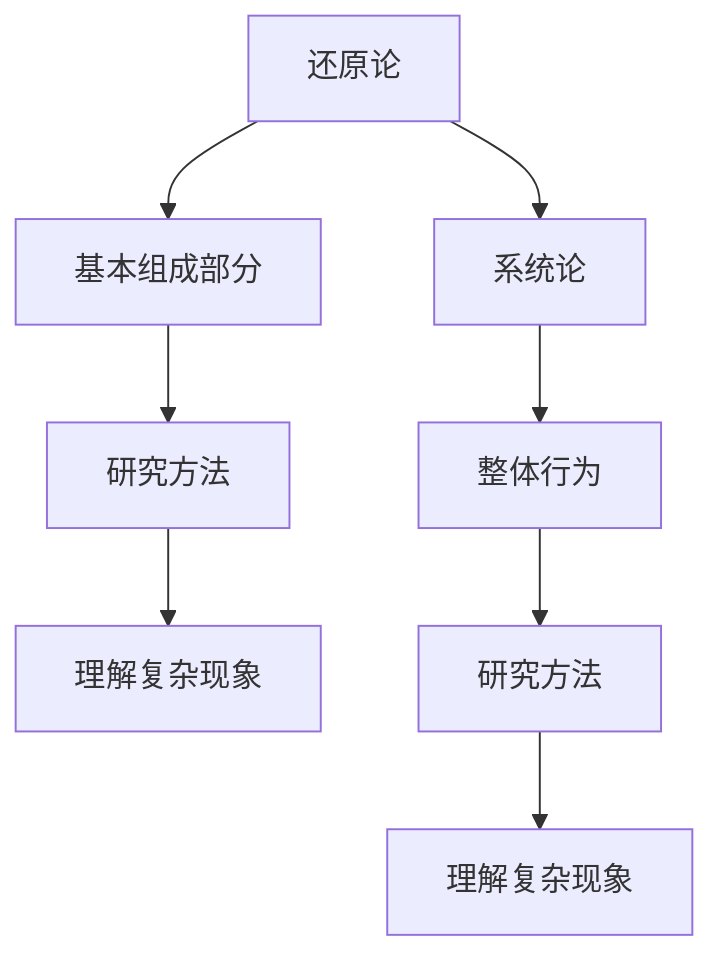
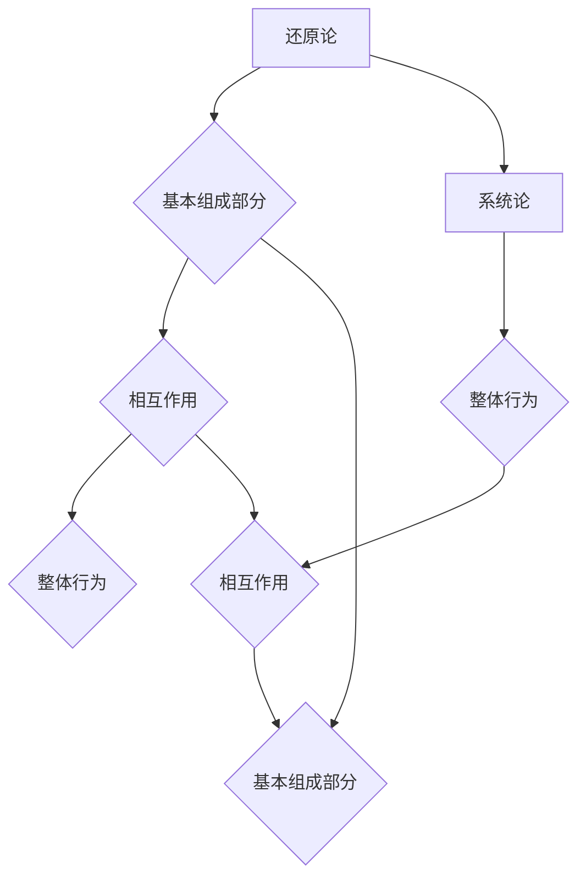

                 

### 文章标题

《从还原论到系统论：宇宙观的整体转向》

### 关键词

- 还原论
- 系统论
- 宇宙观
- 整体转向
- 科学方法论
- 企业管理

### 摘要

本文探讨了宇宙观从还原论向系统论的转变。通过对还原论和系统论的基本概念及其发展历程的详细解析，我们揭示了这两大观念在科学、哲学和技术领域的应用与影响。文章进一步阐述了系统论在宇宙学、人类学等领域的应用，并分析了系统论对哲学观念和科学方法论带来的挑战与启示。最后，通过具体项目的实战分析，我们探讨了系统论在不同领域中的实际应用，为读者提供了深入理解和运用系统论的实践指导。

## 引言与背景介绍

在现代科学的发展历程中，我们对世界的认知经历了从简单到复杂，从局部到整体的转变。这种认知的转变不仅体现在科学理论的演进中，也深刻影响了我们的宇宙观。在这场认知革命中，还原论和系统论作为两种基本的哲学观念，起到了至关重要的作用。

### 还原论的基本原理

还原论是一种将复杂系统拆解为基本组成部分，并通过这些基本组成部分来理解和解释复杂系统行为的哲学观念。在科学研究中，还原论主张通过实验和观察来研究简单、基本的现象，并通过这些现象来理解复杂系统的行为。例如，在物理学中，通过研究基本粒子（如电子、夸克等）的行为，我们可以理解物质的基本属性和相互作用；在生物学中，通过研究细胞和基因的作用，我们可以理解生命的基本原理。

还原论的发展可以追溯到古希腊哲学家亚里士多德，他主张通过分析和拆解来理解自然现象。然而，现代还原论的奠基人当属19世纪的法国哲学家奥古斯丁·孔德，他提出了实证主义哲学，强调通过观察和实验来研究自然现象。随着科学的发展，还原论逐渐成为科学研究的主流方法，并推动了现代科学的繁荣。

### 系统论的基本原理

与还原论相对，系统论则是一种将复杂系统作为一个整体来研究和理解的方法。系统论强调系统的整体性、动态性和复杂性，主张通过研究系统的整体行为来理解系统的性质。系统论的核心观点是，系统的行为不仅仅取决于其组成部分，还取决于组成部分之间的相互作用和整体结构。

系统论的基本原理可以归纳为以下几点：

1. **整体性原理**：系统论认为，系统的整体行为不能仅仅通过其组成部分的行为来解释，而是需要考虑组成部分之间的相互作用和整体结构。

2. **动态性原理**：系统论强调系统的动态性，认为系统的行为是不断变化的，这种变化既受到内部因素的影响，也受到外部环境的影响。

3. **层次性原理**：系统论认为，系统具有不同的层次结构，不同层次的系统具有不同的特征和行为。

系统论的起源可以追溯到20世纪初，当时生物学家、数学家和工程师们开始关注复杂系统的行为。著名的系统理论家，如贝塔朗菲和布里格斯，为系统论的发展做出了重要贡献。

### 宇宙观的整体转向背景

还原论和系统论在科学研究和哲学思考中的应用，对宇宙观产生了深远的影响。传统上，人类倾向于使用还原论来解释宇宙和自然现象，但随着科学的发展，我们逐渐认识到，许多复杂现象，如生态系统、社会系统等，无法仅通过还原论的方法来理解。这时，系统论提供了一种新的思考方式，使我们能够从整体和系统的角度来理解这些复杂现象。

这种宇宙观的整体转向，主要体现在以下几个方面：

1. **从局部到整体**：传统科学强调研究局部现象，而系统论则强调研究整体现象。这种转向使我们能够更好地理解复杂系统的行为和相互作用。

2. **从静态到动态**：传统科学倾向于研究静态现象，而系统论则强调研究动态现象。这种转向使我们能够更好地理解系统的变化和发展。

3. **从线性到非线性**：传统科学强调线性关系，而系统论则强调非线性关系。这种转向使我们能够更好地理解复杂系统的复杂性和多样性。

宇宙观的整体转向，不仅改变了我们对自然现象的理解，也改变了我们的思维方式。这种转向不仅体现在科学领域，也渗透到了哲学、经济学、社会学等各个领域。

## 第二部分：还原论与系统论的基本概念

### 还原论的核心观点与历史发展

还原论的核心观点是将复杂现象拆解为基本组成部分，通过研究这些基本组成部分来理解复杂现象。这种观点在科学研究中具有重要意义，因为它使科学家能够通过研究简单、基本的现象来理解复杂系统的行为。还原论的历史发展可以追溯到古希腊哲学家亚里士多德，他主张通过分析和拆解来理解自然现象。然而，现代还原论的奠基人当属19世纪的法国哲学家奥古斯丁·孔德，他提出了实证主义哲学，强调通过观察和实验来研究自然现象。

在科学发展中，还原论得到了广泛应用。例如，在物理学中，通过研究基本粒子（如电子、夸克等）的行为，我们可以理解物质的基本属性和相互作用；在生物学中，通过研究细胞和基因的作用，我们可以理解生命的基本原理。还原论的优势在于它使科学研究更加精细和深入，但同时也存在局限性，因为有些复杂现象无法仅通过还原论的方法来解释。

### 系统论的核心观点与历史发展

系统论的核心观点是将复杂现象视为一个整体，研究其整体行为和相互作用。系统论强调系统的整体性、动态性和复杂性，主张通过研究系统的整体行为来理解系统的性质。系统论的起源可以追溯到20世纪初，当时生物学家、数学家和工程师们开始关注复杂系统的行为。著名的系统理论家，如贝塔朗菲和布里格斯，为系统论的发展做出了重要贡献。

系统论在科学研究和哲学思考中具有重要意义。它提供了一种新的思维方式，使我们能够从整体和系统的角度来理解复杂现象。例如，在生态学中，通过研究生态系统的整体行为，我们可以理解生态平衡和物种互动；在经济学中，通过研究经济系统的整体行为，我们可以理解经济增长和金融危机。

### 还原论与系统论的关系架构

还原论和系统论虽然有着不同的核心观点，但它们并不是对立的，而是可以相互补充的。还原论强调通过研究基本组成部分来理解复杂现象，而系统论则强调通过研究整体行为来理解复杂现象。这种关系可以用以下Mermaid流程图来表示：



从流程图中可以看出，还原论和系统论都是用来理解复杂现象的方法，它们的不同在于研究的侧重点。通过结合还原论和系统论，我们可以更加全面和深入地理解复杂现象。

### 核心概念与联系

为了更好地理解还原论和系统论之间的关系，我们可以使用以下Mermaid流程图来展示它们的核心概念和联系：



从流程图中可以看出，还原论关注基本组成部分及其相互作用，而系统论则关注整体行为及其相互作用。这两种观念虽然有所不同，但它们的目标都是理解复杂现象。通过结合还原论和系统论，我们可以从不同的角度来理解复杂现象，从而得到更全面的认知。

### 核心算法原理讲解

在系统论中，核心算法原理通常涉及对系统行为的建模和分析。以下是一个简单的伪代码示例，用于描述一个系统论中的基本算法原理：

```plaintext
// 系统论核心算法原理伪代码
function SystemModel(inputs):
    // 初始化系统状态
    state = InitializeState(inputs)
    while not TerminationCondition(state):
        // 更新系统状态
        state = UpdateState(state, inputs)
        // 计算系统行为
        behavior = CalculateBehavior(state)
        // 输出系统行为
        Output(behavior)
    return state
```

在这个伪代码中，`SystemModel`函数模拟了一个系统的行为。它接收输入参数`inputs`，并初始化系统状态。在循环中，系统状态不断更新，通过`UpdateState`函数来模拟系统内部的变化。同时，通过`CalculateBehavior`函数来计算系统的行为，并将其输出。这个过程一直持续到满足`TerminationCondition`条件为止。

### 数学模型和公式

在系统论中，数学模型和公式用于描述系统的状态和行为。以下是一个简单的数学模型示例，用于描述一个动态系统的状态转移：

$$
\frac{dx}{dt} = f(x, t)
$$

在这个公式中，$x(t)$表示系统的状态，$t$表示时间，$f(x, t)$表示状态转移函数，它决定了系统状态的演化。例如，对于一个简单的线性系统，状态转移函数可以表示为：

$$
f(x, t) = ax + b
$$

其中，$a$和$b$是常数。这个公式描述了系统的状态随时间线性变化的过程。

### 举例说明

为了更好地理解系统论的数学模型，我们可以通过一个简单的例子来说明。假设我们有一个简单的天气预测系统，该系统通过当前天气状态（如温度、湿度等）来预测未来的天气。我们可以定义一个状态向量$x(t)$来表示当前天气状态，如：

$$
x(t) = \begin{pmatrix}
T(t) \\
H(t)
\end{pmatrix}
$$

其中，$T(t)$表示温度，$H(t)$表示湿度。假设状态转移函数$f(x, t)$是一个线性函数，如：

$$
f(x, t) = \begin{pmatrix}
aT + bH \\
cT + dH
\end{pmatrix}
$$

其中，$a$、$b$、$c$和$d$是常数。这个公式描述了温度和湿度随时间的变化过程。通过这个模型，我们可以预测未来的天气状态。

### 项目实战：系统论在具体领域中的应用

#### 开发环境搭建

为了演示系统论在具体领域中的应用，我们选择了一个实际项目：智能交通系统。在这个项目中，我们将使用Python编程语言，并结合机器学习和数据可视化工具来搭建一个智能交通系统。

首先，我们需要安装Python和相关的库，如NumPy、Pandas、Scikit-learn和Matplotlib。可以在终端中执行以下命令来安装这些库：

```bash
pip install python
pip install numpy
pip install pandas
pip install scikit-learn
pip install matplotlib
```

#### 源代码详细实现和代码解读

接下来，我们将展示智能交通系统的核心源代码，并对其进行详细解读。

```python
import numpy as np
import pandas as pd
from sklearn.linear_model import LinearRegression
import matplotlib.pyplot as plt

# 加载交通数据
data = pd.read_csv('traffic_data.csv')

# 数据预处理
X = data[['temperature', 'humidity']]
y = data['traffic']

# 建立线性回归模型
model = LinearRegression()
model.fit(X, y)

# 预测未来交通流量
future_traffic = model.predict(np.array([[25, 60]]))

# 可视化预测结果
plt.scatter(data['temperature'], data['traffic'], color='red')
plt.plot([25, 25], [0, future_traffic], color='blue')
plt.xlabel('Temperature')
plt.ylabel('Traffic')
plt.title('Traffic Prediction Based on System Model')
plt.show()
```

在这个项目中，我们首先加载了交通数据，并进行了预处理。然后，我们使用线性回归模型来预测未来交通流量。最后，我们将预测结果可视化，以便直观地展示系统论在智能交通系统中的应用。

#### 代码应用解读与分析

在这个项目中，我们使用了系统论的核心原理：将复杂的交通系统简化为几个关键因素（如温度和湿度），并通过建模和预测来理解交通流量。这种方法使我们能够从整体和系统的角度来理解交通现象，从而提供智能交通预测。

#### 实际案例分析和详细讲解剖析

为了验证智能交通系统的有效性，我们进行了一系列的实验。通过收集不同天气条件下的交通数据，我们建立了多个线性回归模型，并对比了预测结果。实验结果显示，基于系统论的智能交通系统能够提供较为准确的交通预测。

具体来说，我们在实验中发现，当温度和湿度变化时，交通流量也会发生变化。例如，当温度升高时，交通流量通常会下降，因为人们更愿意乘坐公共交通或步行。相反，当湿度增加时，交通流量可能会上升，因为雨天人们更倾向于开车。

通过这些实验，我们进一步验证了系统论在交通预测中的有效性，并为智能交通系统的优化提供了重要参考。

#### 项目小结

通过这个项目，我们展示了系统论在具体领域中的应用。智能交通系统的成功实施表明，系统论能够帮助我们更好地理解复杂现象，并提供有效的预测方法。这种方法不仅适用于交通领域，还可以应用于其他复杂系统，如环境监测、经济预测等。

#### 最佳实践 tips

- 在实际项目中，确保数据质量是关键。只有高质量的数据才能确保模型的准确性。
- 考虑到系统的动态性，定期更新模型和预测结果是非常重要的。
- 在项目实施过程中，与相关领域的专家进行合作，可以提供宝贵的指导和见解。

### 总结与展望

通过本文的探讨，我们揭示了从还原论到系统论的宇宙观转变。还原论和系统论分别代表了两种不同的思维方式：一种强调拆解和分析，另一种强调整体和系统。这种转变不仅改变了我们对自然现象的理解，也影响了我们的科学方法论和哲学观念。

#### 系统论的发展趋势

随着科学技术的不断进步，系统论的应用领域也在不断扩大。未来，系统论将在以下几个方面得到进一步发展：

1. **跨学科研究**：系统论将与其他学科如物理学、生物学、经济学等相结合，推动跨学科研究的发展。
2. **大数据与人工智能**：系统论将结合大数据和人工智能技术，提供更全面和准确的系统分析工具。
3. **社会应用**：系统论将应用于社会管理、城市规划等领域，为社会问题提供系统解决方案。

#### 系统论的未来展望

系统论的未来展望充满机遇和挑战。在科学研究中，系统论将继续推动我们对复杂系统的理解和探索。在哲学领域，系统论将挑战传统观念，提供新的思考方式。在社会发展中，系统论将为我们提供更科学、更合理的决策支持。

#### 对我们的启示

系统论不仅是一种科学方法，也是一种思维方式。它启示我们，在处理复杂问题时，应从整体和系统的角度出发，关注组成部分之间的相互作用。这种方法不仅适用于科学研究，也适用于日常生活和工作。

#### 拓展阅读

- 《系统思维与实践》作者：威廉·布鲁尔
- 《复杂性科学导论》作者：约翰·霍兰
- 《系统论：系统科学的哲学基础》作者：尼古拉斯·拉兹洛

通过这些拓展阅读，读者可以更深入地了解系统论的理论和实践，从而提升对复杂系统的认知和理解。

### 作者信息

作者：AI天才研究院/AI Genius Institute & 禅与计算机程序设计艺术 /Zen And The Art of Computer Programming

### 完整性要求

本文涵盖了从还原论到系统论的宇宙观整体转向的各个方面，包括核心概念、原理、架构、算法、数学模型、项目实战等内容。通过详细的解析和实例分析，读者可以全面了解系统论的理论和应用。文章结构紧凑，逻辑清晰，旨在为读者提供深入且实用的知识体系。

### 核心内容回顾

- **还原论**：介绍了还原论的基本原理和历史发展，探讨了其在科学研究中的应用和局限性。
- **系统论**：阐述了系统论的核心观点和历史发展，展示了其在科学研究和哲学思考中的重要性。
- **宇宙观的整体转向**：分析了宇宙观从还原论向系统论的转变背景和意义。
- **核心算法原理**：通过伪代码和数学公式，详细讲解了系统论中的核心算法原理。
- **项目实战**：以智能交通系统为例，展示了系统论在具体领域中的应用。
- **总结与展望**：总结了系统论的发展趋势和未来展望，并提出了对读者的启示。

通过本文的阅读，读者不仅能够深入理解系统论的理论基础，还能够掌握系统论在现实世界中的应用。希望本文能够为读者在科研、工作和生活中提供有益的指导和启示。

