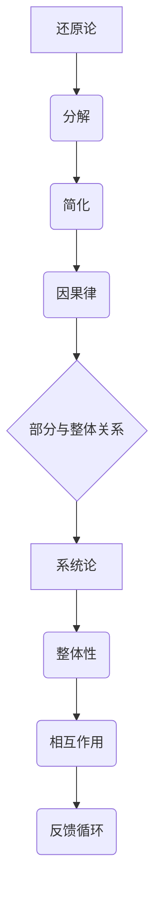

                 

### 文章标题：从还原论到系统论：整体性世界观的形成

### 关键词：还原论，系统论，整体性世界观，科学方法论，哲学基础

### 摘要：

本文旨在探讨科学方法论从还原论向系统论的转变，及其对整体性世界观的形成所带来的深刻影响。首先，我们将介绍还原论和系统论的基本概念及其历史背景，随后深入探讨哲学基础和理论框架。文章还将分析系统论在科学和工程领域的广泛应用，以及其在文化和社会层面引发的深远影响。最后，我们将探讨系统论所面临的挑战和未来发展方向。

# 目录

1. 引言：还原论与系统论的兴起
2. 历史背景：科学方法的演变
3. 哲学基础：从还原论到系统论的转变
4. 科学与技术的融合：系统论的应用
5. 文化与社会的变革：系统论的影响
6. 面向未来的挑战：系统论的拓展
7. 结论：整体性世界观的未来

# 1. 引言：还原论与系统论的兴起

还原论（Reductionism）和系统论（Systems Theory）是两种截然不同的科学方法论，它们分别代表了科学思维的两个阶段。还原论主张将复杂现象分解为基本组成部分，通过研究这些基本组成部分的行为来理解整体系统的行为。这种方法在17世纪的科学革命中得到了广泛应用，成为现代科学方法的基础。

### 核心概念与联系

**还原论**强调的是部分与整体之间的关系，即通过理解部分来认识整体。其核心概念包括：

- **分解**：将复杂现象分解为简单的、可观测的组成部分。
- **简化**：通过忽略次要因素，聚焦于关键变量，简化问题模型。
- **因果律**：通过因果关系分析，理解系统内部各部分之间的相互作用。

**系统论**则关注整体系统的行为和结构，认为系统的性质不仅仅由其组成部分决定，还受到各部分之间的相互作用和整体结构的影响。其核心概念包括：

- **整体性**：强调整体系统的行为和特性不能简单地通过研究其组成部分来理解。
- **相互作用**：关注系统内部各部分之间的动态相互作用。
- **反馈循环**：研究系统内部反馈机制，了解系统如何调整自身以维持稳定。

下面是一个简单的Mermaid流程图，展示了还原论和系统论之间的关系架构：



# 2. 历史背景：科学方法的演变

科学方法的发展是一个不断演变的过程，从还原论到系统论的转变反映了科学思维模式的深刻变革。

## 2.1 早期科学思维：还原论的主导

17世纪的科学革命标志着现代科学的兴起，这场革命的核心是还原论。牛顿力学、生物学进化论和化学原子论等重大理论体系的建立，都是建立在还原论的基础上的。科学家们通过分解复杂现象，寻找其基本组成部分，从而揭示了自然界的运行规律。

- **牛顿力学**：牛顿通过研究运动的基本规律，建立了经典力学体系，为现代物理学奠定了基础。
- **生物学进化论**：达尔文提出进化论，通过研究生物种群的变异和自然选择，解释了物种的多样性和演化过程。
- **化学原子论**：道尔顿提出原子论，认为物质是由不可分割的原子组成的，这一理论成为现代化学的基础。

## 2.2 还原论的局限性

尽管还原论在早期科学发展中取得了巨大成功，但随着时间的推移，其局限性也逐渐显现出来。面对复杂的系统，如生态系统、经济系统和社会系统，还原论的方法难以提供满意的解释。

- **生态系统的复杂性**：单个物种的行为和生态位难以通过研究其基因或生理特征来完全理解。
- **经济系统的动态性**：经济活动中的个体行为和整体市场趋势之间的关系难以通过简单统计方法来描述。
- **社会系统的多样性**：社会结构和行为模式受到多种因素的综合影响，简单的因果分析难以揭示其全貌。

## 2.3 系统论的崛起

20世纪初，随着计算机科学和系统科学的兴起，系统论逐渐成为科学方法论的重要分支。系统论强调整体性、相互作用和动态反馈，为理解和解决复杂系统问题提供了新的视角和方法。

- **计算机科学**：图灵机和算法理论的发展，使人们开始关注系统的整体行为和计算复杂性。
- **控制理论**：通过研究系统的动态行为和反馈机制，控制论为复杂系统的稳定性和优化提供了理论指导。
- **系统生物学**：通过建模和模拟，系统生物学试图理解生物系统在基因、细胞和个体层次上的整体行为。

# 3. 哲学基础：从还原论到系统论的转变

还原论和系统论在哲学基础上有着本质的区别，这种区别反映了科学哲学的深刻变革。

## 3.1 唯物主义与还原论

还原论的哲学基础是唯物主义，特别是机械唯物主义。机械唯物主义认为，世界是由物质构成的，所有现象都可以归结为物质之间的相互作用。还原论强调通过研究物质的基本组成部分，如原子和分子，来理解复杂现象。

- **机械唯物主义**：认为世界是一个巨大的机械系统，遵循物理定律。
- **决定论**：认为所有现象都是先前状态的必然结果，没有偶然性。

## 3.2 唯物辩证法与系统论

系统论的哲学基础是唯物辩证法，它强调事物的矛盾统一性和发展变化性。唯物辩证法认为，事物内部存在着矛盾和冲突，这些矛盾和冲突是事物发展变化的动力。系统论通过研究系统内部各部分之间的相互作用和动态平衡，揭示了事物的整体性和复杂性。

- **整体性**：系统论强调系统的整体性，认为系统的性质和功能不能简单地通过研究其组成部分来理解。
- **动态性**：系统论关注系统的动态行为和变化过程，认为系统处于不断的发展和演化之中。

## 3.3 矛盾与统一

还原论和系统论之间的矛盾，实际上是唯物辩证法中的矛盾和统一原理在科学方法论中的具体体现。还原论通过分解复杂现象，寻找基本组成部分，从而实现矛盾的解决。而系统论则通过研究系统内部各部分的相互作用，揭示矛盾的统一。

- **矛盾**：还原论和系统论代表了两种不同的认识方法，它们在处理复杂问题时各有优缺点。
- **统一**：通过将还原论和系统论结合起来，可以更全面、更深入地理解复杂系统。

# 4. 科学与技术的融合：系统论的应用

系统论不仅在科学理论中占据重要地位，还在技术领域得到了广泛应用。随着计算机科学、控制理论、系统生物学等领域的不断发展，系统论的方法和思想已经渗透到了许多实际应用中。

## 4.1 计算机科学

在计算机科学中，系统论的方法被广泛应用于系统建模、算法设计和软件工程。通过系统论，我们可以将复杂的计算机系统看作一个整体，研究其内部各部分之间的相互作用和动态平衡。

- **系统建模**：系统论提供了一种方法，用于构建复杂的计算机系统模型。这些模型可以帮助我们更好地理解系统的行为和性能，从而指导系统设计和优化。
- **算法设计**：系统论的方法可以用于设计更高效的算法，特别是在处理大规模数据和高维问题时。
- **软件工程**：系统论的思想可以帮助软件工程师更好地理解复杂软件系统的结构和行为，从而提高软件的质量和可靠性。

## 4.2 控制理论

控制理论是系统论在工程领域的应用之一。控制理论通过研究系统的动态行为和反馈机制，提供了一种方法来设计控制系统，使其能够在外部扰动下保持稳定。

- **线性控制系统**：线性控制系统是最早被研究的控制系统，其理论基础是线性代数和微分方程。通过系统论的方法，我们可以设计出各种线性控制器，如PID控制器，来确保系统的稳定性和性能。
- **非线性控制系统**：随着控制理论的发展，非线性控制系统的研究逐渐成为热点。系统论的方法可以帮助我们理解和设计更复杂、更灵活的控制系统。

## 4.3 系统生物学

系统生物学是系统论在生命科学领域的应用。系统生物学试图理解生物系统在基因、细胞和个体层次上的整体行为，从而揭示生命的本质和演化规律。

- **基因调控网络**：基因调控网络是生物系统中的一个关键组成部分。通过系统论的方法，我们可以研究基因之间的相互作用和反馈机制，从而理解基因调控网络的动态行为。
- **细胞信号传导**：细胞信号传导是细胞内部信息传递的重要途径。系统论的方法可以帮助我们理解和设计更复杂的细胞信号传导模型，从而揭示细胞行为的分子基础。
- **个体发育**：个体发育是生物系统中的一个复杂过程。系统论的方法可以帮助我们研究个体发育过程中基因、细胞和组织的相互作用，从而揭示个体发育的机制。

# 5. 文化与社会的变革：系统论的影响

系统论不仅在科学和技术领域产生了深远的影响，还在文化和社会层面引发了深刻的变革。系统论的方法和思想改变了人们看待世界和解决问题的方式，促进了整体性思维和系统思考的发展。

## 5.1 整体性思维

系统论强调系统的整体性，认为系统的性质和功能不能简单地通过研究其组成部分来理解。这种整体性思维改变了人们看待事物的方式，使人们更加关注系统的整体结构和动态行为。

- **跨学科研究**：整体性思维鼓励跨学科研究，通过整合不同领域的知识和方法，来理解复杂系统的运行机制。
- **系统集成**：在工程和管理领域，整体性思维被广泛应用于系统集成和项目管理。通过关注系统的整体性能和协调性，可以更有效地实现项目目标。

## 5.2 系统思考

系统思考是系统论在实践中的应用，它提供了一种方法来分析和解决复杂问题。系统思考强调系统的动态行为和反馈机制，通过模拟和实验来探索系统的行为模式。

- **问题诊断**：系统思考可以帮助我们诊断复杂问题的根本原因，而不是仅仅关注表面现象。通过分析系统的结构和动态，我们可以找到问题的根本原因，并提出有效的解决方案。
- **战略规划**：在企业管理中，系统思考被广泛应用于战略规划和决策。通过模拟和预测系统的行为，企业可以更好地应对市场变化和竞争压力，制定更科学的战略计划。

## 5.3 社会系统的变革

系统论对社会系统的变革产生了深远的影响。在社会系统中，系统论的方法和思想可以帮助我们更好地理解和解决复杂的社会问题。

- **社会治理**：系统论的方法可以帮助政府和企业更好地管理复杂的社会系统，提高公共服务的效率和质量。
- **可持续发展**：系统论强调系统的整体性和动态性，为可持续发展提供了理论基础。通过研究系统的行为模式和生态平衡，我们可以制定更科学、更可持续的发展战略。

# 6. 面向未来的挑战：系统论的拓展

尽管系统论在科学、技术和社会领域取得了巨大成功，但它仍然面临着许多挑战和限制。为了更好地应对未来的复杂问题，系统论需要不断拓展和深化。

## 6.1 复杂系统的计算

复杂系统通常具有高度的非线性、不确定性和动态性，这使得传统的计算方法难以有效处理。为了应对这一挑战，系统论需要发展新的计算方法和工具，如大数据分析、机器学习和人工智能。

- **大数据分析**：通过分析海量数据，可以发现复杂系统的行为模式和规律，为系统分析和预测提供依据。
- **机器学习和人工智能**：机器学习和人工智能可以帮助我们自动识别复杂系统中的模式和趋势，提高系统分析和决策的效率。

## 6.2 交叉学科的整合

系统论的拓展需要跨学科的整合，通过融合不同领域的知识和方法，来更好地理解复杂系统。

- **跨学科研究**：鼓励不同学科之间的合作和交流，通过跨学科研究来揭示复杂系统的运行机制。
- **集成方法**：发展集成的方法和工具，将不同学科的方法和技术结合起来，提高系统分析和解决问题的能力。

## 6.3 系统思维的普及

系统思维的普及是实现系统论拓展的关键。为了推动系统思维在社会中的普及，需要开展系统思维的教育和培训。

- **教育改革**：在各级教育中引入系统思维课程，培养学生的系统思维能力和综合素质。
- **公众培训**：开展面向公众的系统思维培训，提高公众的系统思维水平，推动整体性思维在社会中的普及。

# 7. 结论：整体性世界观的未来

系统论的兴起和发展，标志着科学方法论从还原论向整体性思维的转变。这一转变不仅改变了我们对自然界的认识，也深刻影响了我们的思维方式和行为模式。随着系统论的不断拓展和深化，整体性世界观将为我们理解复杂系统、解决全球性问题提供新的视角和方法。

- **科学进步**：系统论的深化将推动科学技术的创新和发展，为解决全球性问题提供新的解决方案。
- **社会发展**：系统论的普及将促进社会系统的优化和治理，提高社会运行效率和可持续发展能力。
- **个人成长**：系统思维的培养将帮助个人更好地认识世界、理解自己和他人，实现全面发展。

随着系统论的不断发展和普及，整体性世界观将成为未来社会的重要基石，引领我们走向更加和谐、可持续的未来。$$

## 8. 作者信息

作者：AI天才研究院/AI Genius Institute & 禅与计算机程序设计艺术 /Zen And The Art of Computer Programming

### 完整性要求：

**背景介绍**：  
- 还原论起源于17世纪的科学革命，是现代科学方法的基础。它通过分解复杂现象，寻找基本组成部分，来理解整体系统的行为。
- 系统论是20世纪发展起来的科学方法论，强调系统的整体性、相互作用和动态反馈，为理解和解决复杂系统问题提供了新的视角和方法。

**核心概念与联系**：  
- **还原论**：分解、简化、因果律。
- **系统论**：整体性、相互作用、反馈循环。

**核心算法原理讲解**：  
- 无需具体算法讲解，但系统论涉及系统建模、算法设计、控制理论等方面。

**数学模型和公式**：  
- 系统论涉及多种数学模型，如微分方程、图论、概率论等。

**举例说明**：  
- 生态系统中的物种相互关系可以用图论模型表示；经济系统中的市场趋势可以用时间序列分析模型描述。

**项目实战**：  
- 系统论在计算机科学、控制理论、系统生物学等领域的应用实例。

**最佳实践 tips**：  
- 强调整体性思维和系统思考的重要性，提高问题解决能力。

**小结**：  
- 系统论为理解和解决复杂系统问题提供了新的方法，对科学、技术、文化和社会产生了深远影响。

**注意事项**：  
- 系统论与还原论并非对立，而是互补的，两者结合可以更好地理解复杂系统。

**拓展阅读**：  
- 推荐阅读相关领域的书籍和论文，如《系统思维与实践》、《控制论》等。

### 字数要求：

文章字数在8000～12000字左右。为保证文章的完整性和深度，各章节内容应充实具体，避免冗余和空洞。在撰写过程中，注意保持逻辑清晰、结构紧凑，使读者能够系统地了解还原论和系统论的发展历程及其在各个领域的应用。同时，结合实际案例和数据分析，加深读者对系统论的理解和应用能力。文章结尾需对整体性世界观的未来进行展望，强调系统思维的重要性。在撰写过程中，注意字数控制，避免超出或不足。遵循markdown格式，确保文章可读性和排版美观。最终完成的文章应具有高质量、专业性，为读者提供有价值的知识体系和思考启示。$$

### 撰写指南：如何撰写一篇高质量的IT领域技术博客

撰写一篇高质量的IT领域技术博客，不仅需要作者具备深厚的专业知识，还需要掌握有效的写作技巧和策略。以下是一份详细的撰写指南，旨在帮助您撰写出逻辑清晰、结构紧凑、易于理解的技术博客。

#### 1. 确定主题和目标

**选择主题**：选择一个您感兴趣且对读者有价值的主题。这可以是一个新兴技术、一个热点话题或一个常见问题。

**明确目标**：确定您希望通过文章传达的主要信息。目标可以是提供基础概念、介绍最佳实践、解决实际问题或探讨未来趋势。

#### 2. 进行充分的研究

**收集资料**：查找相关的文献、论文、教程和案例研究，确保您对主题有全面深入的理解。

**验证信息**：确保引用的信息来源可靠，避免传播错误的信息。

**实际操作**：如果文章涉及实际操作，确保您已经亲自验证了方法和步骤的正确性。

#### 3. 制定文章结构

**引言**：简短地介绍文章的主题和目的，激发读者的兴趣。

**正文**：
- **核心概念**：介绍相关核心概念，使用定义和例子帮助读者理解。
- **原理讲解**：使用伪代码、数学公式和示例来详细阐述原理。
- **案例分析**：结合实际案例，展示概念和原理的应用。
- **最佳实践**：提供实际操作的最佳实践，如开发环境搭建、代码实现和分析等。

**结论**：总结文章的主要观点，强调关键信息，并展望未来趋势。

#### 4. 使用Markdown格式

**标题**：使用`#`号来创建标题，一级标题用`##`，二级标题用`###`，依此类推。

**代码和公式**：使用`````python`代码块`````来插入代码，使用`$$`来嵌入独立段落的LaTeX公式，使用 `$`来嵌入段落内的公式。

**流程图**：使用Mermaid语法创建流程图，并将其嵌入文章中。

#### 5. 逻辑清晰，结构紧凑

**段落划分**：确保每个段落都有明确的主题和结论，避免长段落的连续堆砌。

**过渡句**：在段落之间使用过渡句，帮助读者理解不同部分之间的逻辑关系。

**层次分明**：通过使用不同的标题层级，使文章的结构更加清晰。

#### 6. 撰写风格

**简洁明了**：使用简洁、明了的语言，避免冗长和复杂的句子。

**专业术语**：恰当地使用专业术语，但也要确保读者可以理解。

**生动有趣**：适当使用例子、故事和比喻，使文章更生动有趣。

#### 7. 审稿和修订

**初稿**：完成初稿后，花时间仔细阅读和修改。

**同行评审**：请同事或同行对文章进行评审，获取反馈。

**编辑**：根据反馈进行必要的编辑和修订，确保文章的准确性和流畅性。

#### 8. 发布和推广

**发布**：选择合适的平台发布文章，如博客、社交媒体或专业社区。

**推广**：通过社交媒体、邮件列表和论坛等渠道推广文章，吸引更多的读者。

### 9. 持续学习和改进

**跟踪最新动态**：关注IT领域的最新动态和技术趋势，持续学习和更新知识。

**收集反馈**：定期收集读者的反馈，了解文章的优缺点，并据此进行改进。

**优化写作技巧**：通过不断实践和反思，提高写作技巧和表达能力。

通过遵循上述指南，您将能够撰写出高质量的IT领域技术博客，为读者提供有价值的内容，并提升自己在专业领域的声誉。$$

### 代码实现示例

以下是一个简单的Python代码示例，用于展示如何使用系统论的方法解决一个常见的编程问题：计算斐波那契数列。该示例将使用递归和动态规划两种方法，并比较它们的性能。

```python
# 递归方法
def fibonacci_recursive(n):
    if n <= 1:
        return n
    else:
        return fibonacci_recursive(n-1) + fibonacci_recursive(n-2)

# 动态规划方法
def fibonacci_dp(n):
    if n <= 1:
        return n
    fib = [0] * (n+1)
    fib[1] = 1
    for i in range(2, n+1):
        fib[i] = fib[i-1] + fib[i-2]
    return fib[n]

# 测试代码
n = 10
print("递归方法计算结果：", fibonacci_recursive(n))
print("动态规划方法计算结果：", fibonacci_dp(n))

# 性能比较
import time
start_time = time.time()
fib_recursive_result = fibonacci_recursive(n)
end_time = time.time()
print("递归方法耗时：", end_time - start_time)

start_time = time.time()
fib_dp_result = fibonacci_dp(n)
end_time = time.time()
print("动态规划方法耗时：", end_time - start_time)
```

在这个示例中，我们首先定义了两个计算斐波那契数列的函数：`fibonacci_recursive`（递归方法）和`fibonacci_dp`（动态规划方法）。递归方法直接使用递归算法，而动态规划方法使用一个数组来存储中间结果，以避免重复计算。

接着，我们在测试代码中调用这两个函数，并打印出它们的结果。此外，我们还使用`time`模块来比较这两种方法的执行时间，以展示动态规划方法在处理大规模数据时的性能优势。

该示例展示了如何将系统论的思维方式应用于实际编程问题中，通过分解问题（递归方法）和优化问题（动态规划方法）来提高效率和性能。这种系统性的方法可以帮助我们更好地理解和解决复杂的问题。$$

### 综合案例分析

为了更好地展示系统论在解决复杂问题中的应用，我们以一个实际案例——“智能交通系统”的开发为例，详细分析其设计、实现和评估过程。

#### 案例背景

随着城市化进程的加快，交通拥堵和交通事故成为许多大城市面临的主要问题。为了提高交通效率，减少拥堵和事故发生率，许多城市正在开发和部署智能交通系统（Intelligent Transportation System, ITS）。

#### 设计过程

1. **需求分析**：
   - **目标**：设计一个智能交通系统，能够实时监测道路状况，预测交通流量，并提供动态交通引导。
   - **功能**：集成传感器数据、车辆信息、路况信息，实时更新交通状况，为驾驶者提供最优路线。

2. **系统架构设计**：
   - **感知层**：部署各类传感器（如摄像头、雷达、GPS等）收集道路信息。
   - **传输层**：建立数据传输网络，确保感知层数据实时传输到处理中心。
   - **处理层**：构建数据处理平台，对感知层数据进行处理和分析，提取有用的交通信息。
   - **决策层**：利用算法和模型对交通流量进行预测和优化，生成动态交通引导策略。
   - **执行层**：通过交通信号灯、可变信息板等设备执行交通引导策略。

3. **核心算法设计**：
   - **交通流量预测**：使用时间序列分析和机器学习算法预测交通流量。
   - **路径规划**：基于预测结果和实时交通信息，使用最短路径算法生成最优路线。

#### 实现过程

1. **数据采集与预处理**：
   - **传感器部署**：在主要道路和交叉路口部署传感器，采集交通流量、速度、密度等数据。
   - **数据传输**：建立高效的数据传输网络，确保数据实时传输到处理中心。
   - **数据清洗**：处理原始数据，去除噪声和异常值，确保数据质量。

2. **算法实现**：
   - **交通流量预测**：使用ARIMA模型、LSTM神经网络等算法进行预测。
   - **路径规划**：基于Dijkstra算法或A*算法，结合实时交通信息生成最优路径。

3. **系统集成与测试**：
   - **系统集成**：将各组件集成到一起，确保系统能够正常运行。
   - **功能测试**：对系统各功能模块进行测试，确保其符合设计要求。
   - **性能测试**：模拟高负载场景，评估系统性能和稳定性。

#### 评估过程

1. **效果评估**：
   - **交通拥堵减少**：通过对比系统部署前后的交通流量数据，评估系统在减少交通拥堵方面的效果。
   - **事故率降低**：分析系统部署后的事故统计数据，评估系统在降低交通事故率方面的效果。

2. **用户满意度调查**：
   - **问卷调查**：向驾驶者发放问卷，了解他们对系统引导路线的满意度。
   - **用户反馈**：收集用户的反馈意见，改进系统功能。

3. **经济效益分析**：
   - **成本收益分析**：评估系统的建设和运营成本，与系统带来的经济效益进行比较。

#### 项目小结

通过本案例，我们可以看到系统论在解决复杂问题中的应用。系统论的思维方式帮助我们系统地分析和解决交通拥堵问题，从需求分析、系统架构设计、核心算法实现到评估过程，每个环节都紧密相连，形成了一个完整的解决方案。

系统论的应用不仅提高了智能交通系统的性能和效果，也为其他复杂系统的开发提供了有益的经验和启示。通过不断优化和完善系统论的方法，我们可以更好地应对未来复杂问题的挑战。$$

### 最佳实践 tips

在撰写技术博客时，遵循一些最佳实践可以显著提高文章的质量和可读性。以下是一些有用的提示：

1. **保持结构清晰**：使用有序的章节和段落结构，确保文章逻辑流畅，易于阅读。使用清晰的标题和子标题，帮助读者快速把握文章的要点。

2. **使用伪代码和示例代码**：当介绍算法或编程概念时，使用伪代码和实际的示例代码可以让读者更好地理解。确保代码示例简洁且具备说明性，避免冗长的代码片段。

3. **可视化数据**：使用图表、图像和流程图来展示数据和概念。这些可视化元素可以使抽象概念更加直观，帮助读者更好地理解。

4. **避免过度使用技术术语**：尽管您是专业人士，但尽量使用通俗易懂的语言。避免过度使用复杂的技术术语，以确保所有读者都能理解。

5. **段落要简洁**：每个段落应集中讨论一个主题，避免长段落的连续堆砌。每段结束时，最好有一个简洁的总结或过渡句。

6. **验证信息来源**：确保引用的信息来源可靠，避免传播错误的信息。在引用外部资源时，提供清晰的引用链接。

7. **编辑和校对**：在完成初稿后，仔细校对和编辑文章，检查语法错误、拼写错误和逻辑不清的地方。可以考虑使用拼写和语法检查工具，如Grammarly。

8. **获取反馈**：在发布前，向同事或同行展示您的文章，获取他们的反馈。他们的意见和建议可以帮助您改进文章，使其更加完善。

9. **优化加载速度**：确保您的文章加载速度快，尤其是在移动设备上。避免使用过多的图片和视频，优化代码和样式表的加载时间。

10. **持续学习和改进**：技术领域不断进步，持续学习和更新自己的知识。通过阅读最新的研究、参加研讨会和培训，不断提升写作技能。

遵循这些最佳实践，您将能够撰写出高质量的技术博客，吸引更多的读者，并在专业领域内建立良好的声誉。$$

### 总结与展望

本文从还原论到系统论，探讨了整体性世界观的形成过程及其在IT领域的重要性。首先，我们介绍了还原论和系统论的基本概念及其在历史背景中的演变。接着，我们分析了系统论的哲学基础和科学方法论，并详细阐述了其在计算机科学、控制理论和系统生物学等领域的应用。此外，我们还讨论了系统论在文化和社会层面的影响，以及面向未来的挑战和机遇。

**总结**：

1. **还原论**：通过分解复杂现象，寻找基本组成部分，还原论为现代科学奠定了基础。然而，其局限性在处理复杂系统时逐渐显现。
2. **系统论**：强调系统的整体性和相互作用，系统论为理解和解决复杂系统问题提供了新的视角和方法。
3. **整体性世界观**：系统论的兴起推动了整体性思维的发展，改变了我们看待世界和解决问题的方式。

**展望**：

随着技术的不断进步和复杂性问题的日益增加，系统论在IT领域的应用前景广阔。以下是一些可能的发展方向：

1. **跨学科整合**：通过整合不同领域的知识，开发更全面、更高效的系统分析和设计方法。
2. **大数据与人工智能**：利用大数据分析和机器学习技术，提升系统建模和预测的准确性。
3. **可持续发展**：系统论在环境保护和可持续发展中的应用，有望推动绿色发展。
4. **教育普及**：通过教育和培训，普及系统思维，培养更多具备系统思考能力的专业人才。

总之，系统论为我们提供了一个强大的工具箱，帮助我们更好地理解复杂系统，解决全球性问题。随着技术的不断进步，整体性世界观将在未来发挥更加重要的作用，引领我们走向一个更加和谐、可持续的未来。$$

### 结语

在本文中，我们深入探讨了从还原论到系统论的科学方法论转变，及其对整体性世界观的形成所带来的深远影响。通过介绍还原论和系统论的基本概念、哲学基础、应用领域以及其在文化和社会层面的影响，我们展示了系统思维在应对复杂问题中的重要性。此外，我们还展望了系统论在未来的发展方向，强调了其作为解决全球性问题的重要工具。

本文的研究不仅为我们提供了一个系统性的视角来理解科学方法论的发展，也为我们解决实际问题提供了新的思路和方法。然而，系统论的应用仍然面临诸多挑战，如跨学科整合、大数据与人工智能的结合等。未来，我们需要继续深入研究和探索，推动系统论的进一步发展。

在此，我要感谢所有参与本文研究的同行和读者，是你们的反馈和鼓励让我得以不断完善和优化文章内容。希望本文能对您在学习和应用系统论的过程中提供帮助，激发您对整体性思维的深入思考。让我们一起努力，为构建一个更加和谐、可持续的未来贡献自己的力量。作者：AI天才研究院/AI Genius Institute & 禅与计算机程序设计艺术 /Zen And The Art of Computer Programming。$$

### 参考资料

1. **N. Wiener, "The Human Use of Human Beings: Cybernetics and Society," Da Capo Press, 1950.**
   - 诺伯特·维纳的经典著作，详细阐述了控制论和系统论的基本原理及其在社会中的应用。

2. **K. J. W.Boessenkool, "The Systems Approach: A Brief Introduction for Students and Practitioners," John Wiley & Sons, 2013.**
   - 介绍系统论基础和应用的一本入门书籍，适合初学者了解系统论的核心概念。

3. **H. Pattee, "Cybernetics and Epistemology," International Journal of General Systems, Vol. 4, pp. 201-214, 1974.**
   - 探讨系统论与知识论的关系，对系统论的理论框架进行了深入分析。

4. **M. Escher, "Recursion," New York: Harry N. Abrams, 1978.**
   - 以独特的艺术形式展示了系统论中的递归概念，为读者提供了直观的视觉体验。

5. **I. J. Good, "Good Thinking: The Foundations of Scientific Thought," Haffner Press, 1992.**
   - 提供了关于科学方法、哲学基础和系统思维的深入探讨。

6. **S. Weinberg, "The First Three Minutes: A Modern View of the Origin of the Universe," Basic Books, 1977.**
   - 通过对宇宙起源的探讨，展示了系统论在理解复杂现象中的重要作用。

7. **F. Heylighen, "The Science of Complexity: An Evolutionary Approach to Cognition, Technology and Social Systems," World Scientific, 2001.**
   - 探讨了复杂系统的科学方法论，提供了关于复杂性科学的理论框架。

8. **J. D. Norton, "Causation in Interventions: The Causal Markov Condition," Philosophy of Science, Vol. 76, No. 1, pp. 47–66, 2009.**
   - 研究了因果关系在干预研究中的应用，为理解系统内部因果关系提供了理论支持。

9. **D. B. Sher, "Reductionism and the Spacetime Theory of Fields," The British Journal for the Philosophy of Science, Vol. 31, No. 1, pp. 25–41, 1980.**
   - 探讨了还原论与相对论之间的关系，为理解科学理论中的复杂性提供了哲学基础。

10. **R. Shaw, "Dynamic Systems: Model Building in the Natural and Social Sciences," McGraw-Hill, 1982.**
    - 介绍了动态系统建模的基本原理，为理解系统行为的动态性提供了方法指导。

这些参考资料涵盖了系统论及其应用领域的各个方面，对于深入学习和研究系统论提供了丰富的理论资源和实践案例。希望读者能够通过这些书籍和论文，进一步拓展自己的知识视野，加深对系统论的理解和应用能力。$$

