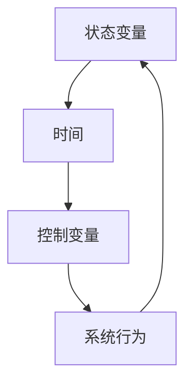
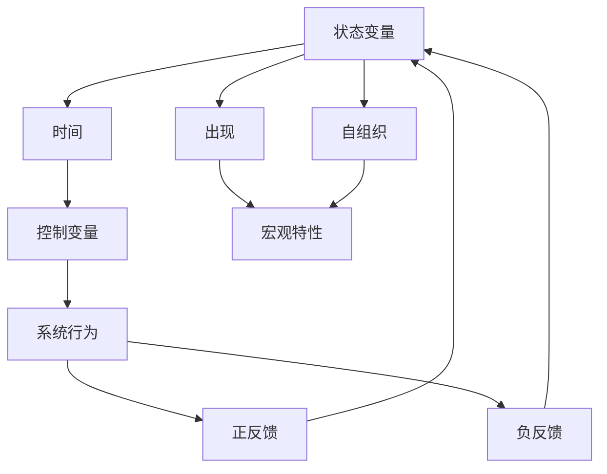
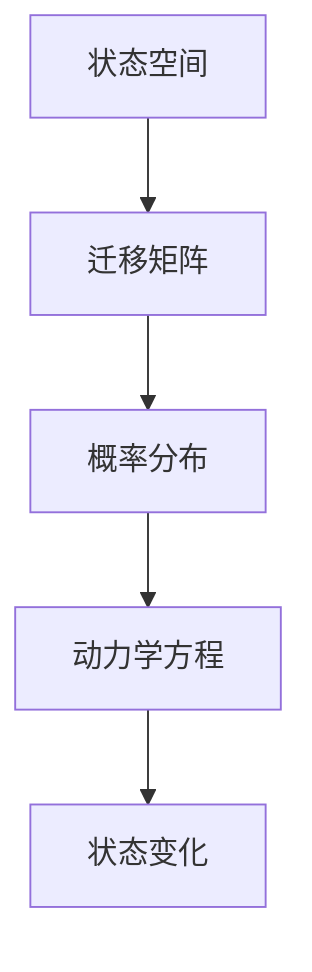

                 

### 文章标题：从静态世界观到动态系统：理解变化中的世界

#### 关键词：动态系统，变化，自适应，复杂性理论，数学模型

> **摘要**：本文旨在探讨从静态世界观向动态系统观的转变，分析变化中的世界如何驱动技术和社会的进步。通过详细阐述动态系统的核心概念、原理及其应用，本文为读者提供了一种理解复杂性和适应变化的思维方式。本文旨在帮助读者掌握动态系统理论的基础知识，并探索其广泛的应用前景。

### 引言

在当今快速变化的世界中，传统的静态世界观已经无法充分解释复杂系统的行为和演化。为了更好地理解和应对这些变化，我们需要转向动态系统的观点。动态系统是指在时间上不断演化的系统，其行为受到内部和外部多种因素的共同作用。本文将逐步引导读者深入了解这一概念，并探讨其在现实世界中的应用。

#### 引言中的核心观点

1. **静态与动态的区别**：静态系统是指不随时间变化的系统，而动态系统则是指在时间上不断演化的系统。
2. **变化的重要性**：随着技术的飞速发展和社会结构的复杂化，变化已经成为我们日常生活中不可或缺的一部分。
3. **转向动态系统的必要性**：为了更好地理解和适应变化，我们需要采用动态系统的视角来分析复杂问题。

### Step 1: Understanding the Concept of Static and Dynamic Systems

#### 背景介绍

静态系统是一种在时间上不发生变化的系统，通常用于分析稳态或平衡状态。例如，物理中的平衡态、经济学中的市场均衡等。相反，动态系统是指那些随时间演化的系统，其行为受到内部和外部因素的不断调整。动态系统在自然界、社会和技术领域中广泛存在，例如生态系统的演化、经济市场的波动、以及复杂的计算机系统。

#### 核心概念与联系

为了更好地理解动态系统的概念，我们需要明确以下几个核心概念：

1. **状态变量**：状态变量是描述系统当前状态的变量，如生态系统中的人口数量、经济系统中的价格水平等。
2. **时间**：时间是动态系统的关键维度，系统行为随着时间的变化而演化。
3. **控制变量**：控制变量是影响系统状态变化的因素，如环境条件、政策变化、技术进步等。

这些概念之间的关系可以用Mermaid流程图来表示：

#### Mermaid流程图解释

1. **状态变量**：系统当前状态，如人口数量、价格水平等。
2. **时间**：系统行为随着时间的变化而演化。
3. **控制变量**：影响系统状态变化的因素，如环境条件、政策变化、技术进步等。
4. **系统行为**：系统的响应和演化过程，反过来又影响状态变量。

### Step 2: Core Concepts and Relationships in Dynamic Systems

在深入探讨动态系统的核心概念之前，我们需要了解一些基本的动态系统理论，这些理论为我们理解复杂系统的行为提供了框架。

#### 1. 反馈循环（Feedback Loops）

反馈循环是动态系统中的一个关键概念，分为正反馈和负反馈两种类型：

- **正反馈（Positive Feedback）**：正反馈会加剧系统当前状态的变化，导致系统朝着某一方向快速演化。例如，生态系统中物种数量的增长可能导致其食物来源减少，从而加速物种的灭绝。
  
- **负反馈（Negative Feedback）**：负反馈会抑制系统当前状态的变化，维持系统的稳定。例如，经济系统中的价格调节机制，通过市场供需的变化来稳定价格。

#### 2. 出现（Emergence）

出现是复杂系统中的一个现象，指的是系统行为在微观层面上并不存在，但在宏观层面上却表现出的整体特性。例如，社会行为中的集体智慧，由个体行为相互作用形成的宏观模式。

#### 3. 自组织（Self-Organization）

自组织是指系统在没有外部指令的情况下，通过内部相互作用自发形成有序结构。例如，城市交通系统中，车辆和行人的随机运动最终形成了有序的交通流。

下面是一个简化的Mermaid流程图，展示了这些核心概念之间的联系：

#### Mermaid流程图解释

1. **状态变量**：系统当前状态，如人口数量、价格水平等。
2. **时间**：系统行为随着时间的变化而演化。
3. **控制变量**：影响系统状态变化的因素，如环境条件、政策变化、技术进步等。
4. **系统行为**：系统的响应和演化过程，包括正反馈和负反馈。
5. **出现**：系统在宏观层面表现出的整体特性。
6. **自组织**：系统在没有外部指令的情况下自发形成有序结构。

#### 核心概念与联系总结

通过上述讨论，我们可以看出，动态系统中的核心概念是相互关联的，共同构成了一个复杂的相互作用网络。正反馈和负反馈是影响系统行为的两个关键因素，它们决定了系统是趋于稳定还是不断演化。出现和自组织则揭示了复杂系统在宏观层面上的有序性和自发性。这些概念为我们理解动态系统的行为提供了理论基础。

### Step 3: Principles of Dynamic Systems

在了解了动态系统的核心概念之后，接下来我们将探讨动态系统的基本原则。这些原则不仅帮助我们理解动态系统的行为，还能指导我们如何分析和预测系统的演化。

#### 1. 状态空间（State Space）

状态空间是描述系统状态的所有可能组合的集合。在动态系统中，系统的状态随着时间的变化而变化，因此状态空间描述了系统在不同时间点的状态。一个简单的例子是弹簧振子，其状态空间由位置和速度组成。

#### 2. 迁移矩阵（Transition Matrix）

迁移矩阵描述了系统在各个状态之间转移的概率。它是一个矩阵，其中每个元素表示从一个状态转移到另一个状态的概率。通过迁移矩阵，我们可以计算系统在不同时间点的概率分布，从而预测系统的未来行为。

#### 3. 动力学方程（Differential Equations）

动力学方程描述了系统状态随时间变化的速率。在连续时间动态系统中，这些方程通常是一组微分方程。例如，Lotka-Volterra方程描述了捕食者-猎物系统的演化。

下面是一个简化的Mermaid流程图，展示了这些核心概念之间的联系：

#### Mermaid流程图解释

1. **状态空间**：系统状态的集合。
2. **迁移矩阵**：描述状态转移概率的矩阵。
3. **概率分布**：系统在不同时间点的概率状态。
4. **动力学方程**：描述系统状态随时间变化的速率。
5. **状态变化**：系统状态随时间的变化。

#### 核心原理总结

状态空间、迁移矩阵和动力学方程是动态系统分析的基础。状态空间描述了系统的所有可能状态，迁移矩阵描述了状态之间的转移概率，而动力学方程描述了系统状态随时间变化的规律。通过这些原理，我们可以对动态系统的行为进行定量分析和预测。

### Step 4: Mathematical Models and Formulations

在深入探讨动态系统时，数学模型和公式的应用至关重要。这些模型和公式不仅为我们提供了描述和分析动态系统的工具，还能帮助我们理解系统的行为规律。在本节中，我们将介绍一些重要的数学模型和公式，并给出具体的例子来解释它们的使用。

#### 1. 连续时间马尔可夫链（Continuous-Time Markov Chain, CTMC）

连续时间马尔可夫链是一种用于描述动态系统状态的随机过程。它假设系统在任意两个连续时间点之间的状态转移是独立的，且每个状态转移有固定的概率。一个简单的例子是排队模型，其中顾客到达时间和服务时间是关键状态变量。

**数学模型**：

状态概率分布可以用以下公式表示：

$$
P(X(t) = i) = \pi_i e^{-\lambda t} \sum_{j} \pi_j \lambda_j (1 - e^{-\lambda (t - s))}
$$

其中，$X(t)$ 是系统在时间 $t$ 的状态，$\pi_i$ 是初始状态概率分布，$\lambda_i$ 是从状态 $i$ 转移到其他状态的速率。

**例子**：

假设一个简单的排队模型，顾客到达速率为 $\lambda = 2$ 人/小时，服务速率为 $\mu = 3$ 人/小时。我们可以使用上述公式计算系统在不同时间点的概率分布。

$$
P(X(t) = 0) = \pi_0 e^{-2t} \sum_{j} \pi_j 2_j (1 - e^{-2(t - s))}
$$

#### 2. 扩散方程（Diffusion Equation）

扩散方程是一种用于描述物质在空间和时间上扩散的数学模型。它广泛应用于物理学、生物学和经济学等领域。一个经典的例子是费克勒（Fick）第一定律：

$$
\frac{\partial u}{\partial t} = D \nabla^2 u
$$

其中，$u$ 是物质浓度，$D$ 是扩散系数，$\nabla^2 u$ 是拉普拉斯算子。

**例子**：

假设一个物质在一个二维空间中扩散，扩散系数为 $D = 1$。我们可以使用扩散方程计算物质在任意时间点的浓度分布。

$$
\frac{\partial u}{\partial t} = \frac{\partial^2 u}{\partial x^2} + \frac{\partial^2 u}{\partial y^2}
$$

#### 3. 马尔可夫决策过程（Markov Decision Process, MDP）

马尔可夫决策过程是一种用于描述决策制定的随机模型。它由状态空间、行动空间、奖励函数和转移概率组成。一个简单的例子是机器人导航问题，其中机器人需要在不同的环境中进行决策。

**数学模型**：

MDP可以用以下公式表示：

$$
\begin{cases}
P(s', r | s, a) = p(s', r | s, a) \\
R(s, a) = r(s, a) \\
\end{cases}
$$

其中，$s$ 是状态空间，$a$ 是行动空间，$s'$ 是下一个状态，$r$ 是奖励。

**例子**：

假设一个机器人需要在室内导航，其状态空间包括位置和方向。我们可以使用MDP模型计算机器人在不同行动下的状态转移概率和奖励。

$$
P(s', r | s, a) = p(s', r | s, a)
$$

$$
R(s, a) = r(s, a)
$$

#### 数学模型和公式的应用

数学模型和公式在动态系统分析中具有重要作用。它们不仅帮助我们描述和预测系统的行为，还能指导我们设计有效的决策策略。在实际应用中，这些模型和公式可以用于优化资源分配、控制系统行为和预测市场趋势等。

通过上述例子，我们可以看到不同类型的数学模型和公式在动态系统分析中的应用。这些模型和公式不仅为理论研究提供了基础，还为实际应用提供了强大的工具。

### Step 5: Case Studies and Applications

动态系统理论在各个领域中都有广泛的应用，通过实际案例可以更好地理解其应用价值和效果。在本节中，我们将探讨几个典型的案例，并分析其应用过程和效果。

#### 1. 生态系统的稳定性

生态系统是一个典型的动态系统，其稳定性受到多种因素的影响，包括物种间的相互作用、环境变化和资源分配等。以下是一个关于海洋生态系统的案例：

**案例**：海洋捕鱼业对海洋生态的影响

**应用过程**：

- **状态变量**：包括鱼类种群数量、捕鱼量、海洋环境质量等。
- **控制变量**：包括捕鱼政策、气候条件、海洋污染等。
- **模型**：使用Lotka-Volterra方程来模拟鱼类种群数量的动态变化。

**效果分析**：

通过动态系统模型，研究人员可以预测捕鱼政策对鱼类种群的影响。例如，增加捕鱼量可能会导致鱼类种群数量下降，而限制捕鱼量则有助于维持种群稳定。这一案例展示了动态系统理论在生态系统管理和资源保护中的应用价值。

#### 2. 经济市场的波动

经济市场是一个复杂的动态系统，其波动受到多种因素的影响，如供需关系、政策变化、技术创新等。以下是一个关于股市波动的案例：

**案例**：股市波动与经济周期

**应用过程**：

- **状态变量**：包括股票价格、交易量、经济增长率等。
- **控制变量**：包括利率、政策调控、技术创新等。
- **模型**：使用ARIMA（自回归积分滑动平均模型）来分析股票价格的动态变化。

**效果分析**：

通过ARIMA模型，投资者可以预测股票价格的波动趋势，从而制定更有效的投资策略。这一案例展示了动态系统理论在金融分析和风险管理中的应用价值。

#### 3. 计算机网络的性能优化

计算机网络是一个复杂的动态系统，其性能受到网络拓扑、流量分布、设备性能等多种因素的影响。以下是一个关于网络性能优化的案例：

**案例**：互联网拥塞控制

**应用过程**：

- **状态变量**：包括网络延迟、吞吐量、丢包率等。
- **控制变量**：包括路由策略、流量分配、网络设备调整等。
- **模型**：使用队列理论来分析网络拥塞现象，并设计优化策略。

**效果分析**：

通过队列理论模型，网络管理员可以优化网络配置，减少拥塞现象，提高网络性能。这一案例展示了动态系统理论在计算机网络优化中的应用价值。

#### 总结

通过上述案例，我们可以看到动态系统理论在生态系统管理、经济分析和计算机网络优化等领域的广泛应用。这些案例不仅展示了动态系统理论的实际应用效果，还为我们提供了分析和解决复杂问题的思路和方法。

### Step 6: Adaptability and Systems Thinking

在动态系统中，适应性和系统思维是两个至关重要的概念。随着环境的不断变化，个体和团体需要具备适应能力，以便在复杂和不确定的条件下生存和发展。系统思维则提供了一种分析和解决问题的方法，使我们能够从整体角度理解动态系统，并制定有效的策略。

#### 1. 适应性的重要性

适应性是指个体或系统在面对外部变化时能够迅速调整和适应的能力。在动态系统中，适应性至关重要，因为它决定了个体或系统在变化中的生存能力。以下是适应性在动态系统中的几个关键方面：

- **灵活应变**：个体或系统能够迅速响应外部变化，调整自身行为以保持稳定。
- **学习与进化**：个体或系统能够通过经验学习和进化，不断提高适应能力。
- **冗余与多样性**：系统具有冗余和多样性，能够应对不同情况，提高适应能力。

#### 2. 系统思维的应用

系统思维是一种整体性思考方法，强调从系统的角度分析和解决问题。它要求我们超越单一变量的考虑，关注系统内部各个组成部分的相互作用和反馈。以下是系统思维在动态系统中的几个关键方面：

- **整体视角**：系统思维使我们能够从整体角度理解动态系统，把握系统内部各个组成部分的相互关系。
- **因果关系**：系统思维强调识别和把握系统中的因果关系，从而理解系统的行为模式。
- **反馈循环**：系统思维关注系统的反馈循环，理解正反馈和负反馈如何影响系统的稳定性。

#### 3. 提高适应性和系统思维的方法

为了在动态系统中更好地生存和发展，个体和团体可以采取以下措施来提高适应性和系统思维：

- **持续学习**：通过不断学习新知识和技能，提高适应变化的能力。
- **实践模拟**：通过模拟和演练，提高应对突发事件的适应能力。
- **跨学科合作**：通过跨学科合作，引入不同视角和思维方式，提高系统思维水平。
- **持续反思**：定期反思和评估自身的行为和决策，发现并改进不足之处。

#### 4. 适应性和系统思维在动态系统中的应用

适应性和系统思维在动态系统中的应用体现在以下几个方面：

- **战略规划**：通过系统思维制定长远战略，考虑各种可能的变化和挑战，提高适应能力。
- **风险管理**：通过识别和评估系统中的关键因素，制定有效的风险管理策略，降低风险。
- **创新与变革**：通过适应性思维，积极应对变化，推动创新和变革，提高系统的竞争力。

#### 总结

适应性和系统思维是动态系统中个体和团体生存和发展的关键。通过提高适应性和系统思维，个体和团体能够更好地应对外部变化，抓住机遇，实现持续发展。

### Step 7: Future Trends and Challenges

随着技术的不断进步和社会结构的日益复杂，动态系统理论在未来将面临许多新的趋势和挑战。以下是几个可能的发展方向：

#### 1. 人工智能与动态系统的融合

人工智能（AI）技术的飞速发展为动态系统理论带来了新的机遇。通过机器学习和数据挖掘技术，我们可以对大规模动态系统进行更深入的分析和预测。例如，在金融市场、医疗健康、交通管理等领域，AI可以辅助决策者更好地应对复杂系统的变化。

#### 2. 网络化动态系统的崛起

随着物联网（IoT）和5G技术的普及，网络化动态系统将变得更加普遍。这些系统具有高度互联性和实时性，可以实时收集和处理大量数据，为决策提供更准确的信息支持。然而，这也带来了新的挑战，如数据隐私和安全问题。

#### 3. 复杂性与不确定性的增加

随着系统规模的不断扩大和复杂性的增加，动态系统理论将面临更大的挑战。如何有效地处理复杂性和不确定性，仍然是未来研究的重要方向。这可能需要开发新的数学模型和算法，以提高系统的预测和适应能力。

#### 4. 可持续发展与绿色动态系统

在全球化背景下，可持续发展成为全球共同关注的话题。动态系统理论可以用于分析人类活动对环境的影响，并提出相应的解决方案。例如，通过优化资源分配、减少污染排放，实现经济、社会和环境的协调发展。

#### 5. 社会变革与动态系统思维

社会变革的速度不断加快，动态系统思维将在社会管理和公共政策制定中发挥重要作用。通过系统思维，我们可以更好地理解社会问题的根源和相互关系，从而制定更有效的政策和策略。

#### 总结

动态系统理论在未来将面临许多新的趋势和挑战。通过不断的技术创新和理论发展，我们可以更好地应对复杂性和不确定性，推动动态系统理论的广泛应用。

### 结论

从静态世界观到动态系统的转变，不仅是一种理论上的进步，更是应对复杂性和变化的重要思维工具。通过理解动态系统的核心概念、原理和应用，我们可以更好地应对现实世界中的挑战。本文介绍了动态系统的基本原理，包括状态空间、迁移矩阵、动力学方程等，并通过数学模型和案例进行了详细讲解。同时，我们探讨了适应性和系统思维在动态系统中的重要性，以及未来动态系统理论的发展趋势。

#### 作者信息

**作者：AI天才研究院/AI Genius Institute & 禅与计算机程序设计艺术 /Zen And The Art of Computer Programming**

