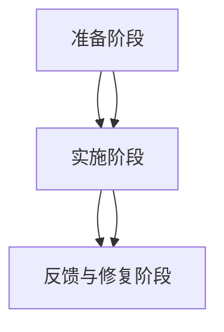

                 

### 引言

#### 1.1 书籍背景

在当今快速发展的技术时代，人工智能（AI）已经成为推动产业变革和创新的引擎。随着AI技术的广泛应用，AI应用代码的质量变得越来越重要。高质量的代码不仅可以确保系统的稳定性和可靠性，还能提高开发效率，降低维护成本。然而，单靠个人开发者的努力往往难以确保代码的高质量，因此，代码审查成为一种必不可少的协作方式。

代码审查是一种系统性的方法，通过对代码进行仔细检查和分析，发现潜在的错误和缺陷，从而提升代码质量。在AI应用开发中，代码审查不仅有助于发现技术问题，还能帮助团队在早期阶段识别和解决问题，避免后期高昂的修复成本。此外，代码审查还有助于提升团队协作效率和代码的一致性，形成良好的编程习惯。

本书的主题是“代码审查：提升AI应用代码质量的协作方式”。本书旨在为从事AI开发和维护的技术人员提供一套全面的代码审查实践指南，帮助他们在实际工作中有效地进行代码审查，从而提高AI应用代码的质量和可靠性。

#### 1.2 代码审查在AI开发中的角色

代码审查在AI开发中扮演着至关重要的角色。首先，AI应用通常涉及到复杂的算法和数据结构，代码的复杂度和潜在错误的可能性较高。通过代码审查，可以确保代码的正确性和可维护性，减少因代码缺陷导致的系统崩溃或性能下降。

其次，AI应用需要经过长时间的迭代和更新，代码审查有助于跟踪代码的变化，确保每次修改都不会引入新的问题。此外，代码审查还能帮助团队成员了解代码的整体结构和设计理念，促进知识共享和团队协作。

最后，代码审查可以作为一种质量控制机制，确保AI应用在不同开发阶段都符合高质量标准。无论是在需求分析、设计阶段，还是在编码和测试阶段，代码审查都能起到关键作用，提高代码的质量和可靠性。

#### 1.3 读者定位

本书的目标读者是从事AI开发和维护的技术人员，包括软件开发工程师、系统架构师、数据科学家和AI研究人员。这些读者可能已经具备一定的编程和AI知识，但希望通过本书系统地了解代码审查的理论和实践，掌握有效的代码审查方法，提高AI应用代码的质量。

此外，本书也适用于对代码审查感兴趣的开发管理人员和项目经理，他们可以通过本书了解如何实施和推广代码审查，提高团队的整体开发效率。

#### 1.4 预期收获

通过阅读本书，读者可以期望达到以下收获：

1. **理解代码审查的基本概念和重要性**：了解代码审查的定义、类型、流程及其在AI开发中的角色。
2. **掌握代码审查的方法和工具**：学习静态代码分析、动态代码分析和代码质量度量方法，以及常见的代码审查工具。
3. **实践代码审查**：通过实际案例和实践，掌握代码审查的具体操作流程和技巧。
4. **提升团队协作效率**：了解如何通过代码审查促进团队协作，提高代码的一致性和可维护性。
5. **应用最佳实践**：学习并掌握代码审查的最佳实践，将之应用到实际工作中，持续提升代码质量。

#### 1.5 书籍结构

本书结构紧凑，分为六个主要部分：

1. **引言**：介绍书籍的背景、目标和读者定位。
2. **代码审查的基础**：讲解代码审查的基本概念、重要性、基本流程和类型。
3. **代码审查的方法和工具**：介绍静态代码分析、动态代码分析、代码质量度量和代码审查工具。
4. **代码审查的实践**：通过实际案例和实践，讲解如何进行代码审查。
5. **代码审查的团队协作**：讨论代码审查在团队协作中的作用、挑战和解决方案。
6. **代码审查的最佳实践**：总结代码审查的最佳实践和持续改进的方法。

#### 1.6 阅读建议

为了更好地理解和应用本书的内容，读者可以按照以下建议进行阅读：

1. **逐步阅读**：本书内容循序渐进，读者应按照章节顺序逐步阅读，以便逐步建立对代码审查的全面理解。
2. **结合实践**：在阅读过程中，可以结合实际项目进行实践，加深对理论的理解。
3. **积极参与**：在阅读过程中，遇到不理解或有问题的地方，可以积极参与讨论，与同行交流心得。
4. **持续学习**：代码审查是一个不断发展和改进的领域，读者应保持学习的态度，跟踪最新的研究成果和实践经验。

通过遵循这些建议，读者可以更有效地学习本书的内容，并在实际工作中提升代码审查的能力。

### 第1章 代码审查的基础

在深入探讨代码审查的具体方法和实践之前，我们需要首先理解代码审查的基础概念和重要性。这一章节将分为三个主要部分：代码审查的定义、代码审查的重要性以及代码审查的基本流程。

#### 1.1 代码审查的定义

代码审查（Code Review）是指通过对代码进行系统性检查和分析，以确保代码的正确性、可读性和可维护性。代码审查不仅涉及对代码语法和结构的检查，还包括对代码逻辑、性能和设计模式的审查。

代码审查通常包括以下几种类型：

1. **同行代码审查（Peer Review）**：由同一团队的成员对彼此的代码进行审查。
2. **小组代码审查（Group Review）**：由一个小组对代码进行审查，小组成员可能来自不同的团队或部门。
3. **专业代码审查（Professional Review）**：由专业的代码审查人员或第三方审查团队对代码进行审查。

代码审查的目的是发现和修复代码中的错误和缺陷，提高代码的质量和可靠性。此外，代码审查还可以帮助团队成员学习新的编程技巧和最佳实践，促进知识共享和团队协作。

#### 1.2 代码审查的重要性

代码审查在软件开发，尤其是在AI应用开发中扮演着至关重要的角色。以下是一些主要的原因：

1. **提高代码质量**：代码审查可以帮助发现潜在的代码缺陷、逻辑错误和性能瓶颈，从而提升代码的整体质量。
2. **预防潜在风险**：通过审查代码，可以提前发现并修复可能导致系统崩溃或数据泄露的漏洞，降低系统风险。
3. **促进团队协作**：代码审查是一种有效的团队协作方式，可以促进团队成员之间的沟通和交流，提高团队的整体工作效率。
4. **减少维护成本**：高质量的代码意味着更少的缺陷和更低的修复成本，长期来看可以显著降低维护成本。
5. **提升代码一致性**：代码审查有助于确保代码风格的一致性，使代码更易于理解和维护。

#### 1.3 代码审查的基本流程

代码审查通常包括以下三个基本阶段：

1. **准备阶段**：
   - **选择审查对象**：确定哪些代码需要进行审查，这可能是整个项目，也可能是特定的模块或功能。
   - **确定审查人员**：选择合适的审查人员，这些人员应具备足够的技能和经验，能够有效地进行代码审查。
   - **设定审查标准**：制定明确的审查标准和流程，确保审查过程的规范性和一致性。

2. **实施阶段**：
   - **审查代码**：审查人员仔细阅读代码，查找潜在的问题和缺陷，可能包括语法错误、逻辑错误、代码冗余、性能瓶颈等。
   - **交流与讨论**：审查人员之间进行充分的沟通和讨论，共同解决发现的问题。

3. **反馈与修复阶段**：
   - **反馈**：审查人员将发现的问题和意见反馈给代码作者。
   - **修复**：代码作者根据反馈进行代码修改和优化，确保修复所有问题。
   - **再审查**：修改后的代码可能需要再次进行审查，以确保所有问题都得到妥善解决。

#### 1.4 代码审查的类型

代码审查可以分为静态代码审查和动态代码审查两大类。

1. **静态代码审查（Static Code Analysis）**：
   - **定义**：静态代码审查是在代码编译和运行之前进行的审查，通过分析代码的结构和内容，发现潜在的错误和缺陷。
   - **优点**：可以提前发现代码中的问题，无需运行代码，效率高。
   - **缺点**：无法发现动态运行时的问题，对复杂逻辑的检测能力有限。

2. **动态代码审查（Dynamic Code Analysis）**：
   - **定义**：动态代码审查是在代码运行时进行的审查，通过观察代码的执行过程，发现运行时的问题和缺陷。
   - **优点**：可以检测到静态代码审查无法发现的动态运行时问题，更接近实际运行环境。
   - **缺点**：需要运行代码，效率相对较低，对代码的修改可能需要重新编译和部署。

在AI应用开发中，静态代码审查和动态代码审查通常结合使用，以充分发挥两者的优势，提高代码的质量和可靠性。

#### 1.5 代码审查的流程图

为了更直观地理解代码审查的基本流程，我们可以使用Mermaid流程图来展示：



**准备阶段**包括选择审查对象、确定审查人员和设定审查标准。**实施阶段**涉及审查代码和交流与讨论。**反馈与修复阶段**则是反馈问题和意见，进行代码修复，然后进行再审查。

通过上述基础部分的介绍，我们为后续深入探讨代码审查的具体方法和实践奠定了坚实的基础。在接下来的章节中，我们将详细探讨代码审查的方法和工具，并通过实际案例和实践，帮助读者掌握代码审查的技巧和应用。

#### 1.6 静态代码分析方法

静态代码分析（Static Code Analysis）是一种在不运行代码的情况下，通过分析代码的结构和内容，发现潜在错误和缺陷的方法。这种方法在代码审查中起着至关重要的作用，因为它可以在代码编译和执行之前发现潜在的问题，从而减少后续的修复成本。

##### 1.6.1 静态代码分析的基本原理

静态代码分析的基本原理是通过分析代码的语法、语义和结构，查找不符合编程规范、存在潜在风险的代码片段。它主要依赖于以下几种技术：

1. **语法分析（Syntax Analysis）**：语法分析是静态代码分析的基础，它通过检查代码的语法规则，确保代码的语法正确性。
2. **语义分析（Semantic Analysis）**：语义分析关注代码的语义含义，检查代码逻辑的合理性，例如变量类型匹配、函数调用是否正确等。
3. **控制流分析（Control Flow Analysis）**：控制流分析用于分析代码的控制流结构，发现潜在的代码路径错误，例如死代码、空代码路径和循环错误等。
4. **数据流分析（Data Flow Analysis）**：数据流分析用于追踪数据在程序中的流动，检测数据不一致性和可能的空指针异常。

##### 1.6.2 常见的静态代码分析工具

在AI应用开发中，有多种静态代码分析工具可供选择。以下是一些常用的静态代码分析工具及其特点：

1. **SonarQube**：
   - **特点**：SonarQube是一个开源的静态代码分析平台，支持多种编程语言，可以检测代码质量、安全性、性能等多个方面的问题。
   - **功能**：它可以自动扫描代码库，生成详细的报告，并提供修复建议。

2. **Checkstyle**：
   - **特点**：Checkstyle是一个基于Java的静态代码分析工具，主要用于检查代码的样式和规范性。
   - **功能**：它可以检查代码中的格式问题、命名规范和代码复杂度等。

3. **PMD**：
   - **特点**：PMD是一个开源的Java代码分析工具，用于检测代码中的潜在问题和不良编程实践。
   - **功能**：它可以检测出代码中的冗余代码、复杂的表达式和过长的方法等。

4. **FindBugs**：
   - **特点**：FindBugs是一个Java静态代码分析工具，专注于发现潜在的编程错误。
   - **功能**：它可以检测出空指针异常、资源泄露、未使用的代码等。

##### 1.6.3 静态代码分析的局限性与改进

虽然静态代码分析具有高效、自动化等优点，但它也存在一些局限性：

1. **无法发现动态问题**：静态代码分析无法检测到运行时的问题，例如边界条件错误和内存泄露等。
2. **误报和漏报**：静态代码分析工具可能会误报一些不相关的错误，也可能漏报一些真正的缺陷。
3. **复杂性和性能**：对于复杂的代码库，静态代码分析可能需要较长的时间和较大的计算资源。

为了克服这些局限性，可以采取以下改进措施：

1. **结合动态代码分析**：将静态代码分析与动态代码分析结合起来，以提高代码的全面检测能力。
2. **优化工具配置**：合理配置静态代码分析工具，减少误报和漏报，提高检测的准确性。
3. **引入机器学习**：利用机器学习技术，通过训练模型，提高静态代码分析工具对复杂代码的识别能力。

通过上述措施，可以进一步提升静态代码分析在AI应用开发中的效果，提高代码质量，降低开发风险。

#### 1.7 动态代码分析方法

动态代码分析（Dynamic Code Analysis）是一种在代码运行时通过执行代码来检测潜在问题和缺陷的方法。与静态代码分析不同，动态代码分析可以模拟实际运行环境，更接近真实的使用场景，从而发现一些在编译时无法检测到的动态问题。

##### 1.7.1 动态代码分析的基本原理

动态代码分析的基本原理是通过运行代码并监控其执行过程，收集运行时数据和日志，从而发现潜在的问题和缺陷。这种方法主要包括以下几种技术：

1. **执行监控（Execution Monitoring）**：在代码执行过程中，监控其执行路径、内存使用、CPU占用等，发现潜在的异常和性能瓶颈。
2. **日志分析（Log Analysis）**：分析运行时日志，查找异常信息和错误报告，帮助定位问题的根源。
3. **性能测试（Performance Testing）**：通过模拟不同的负载和场景，测试代码的性能和稳定性，发现可能存在的性能问题。
4. **单元测试（Unit Testing）**：编写单元测试用例，在代码执行时验证其功能是否正确，发现潜在的逻辑错误。

##### 1.7.2 常见的动态代码分析工具

在AI应用开发中，有多种动态代码分析工具可供选择。以下是一些常用的动态代码分析工具及其特点：

1. **JProfiler**：
   - **特点**：JProfiler是一个Java性能分析工具，可以实时监控代码的执行情况，提供详细的性能数据。
   - **功能**：它可以检测内存泄露、线程死锁、CPU占用高等问题，并提供具体的修复建议。

2. **Gatling**：
   - **特点**：Gatling是一个性能测试工具，用于模拟用户负载，测试系统的性能和稳定性。
   - **功能**：它可以模拟大量用户并发访问，测试系统的响应时间、吞吐量和错误率。

3. **JUnit**：
   - **特点**：JUnit是一个流行的Java单元测试框架，用于编写和执行单元测试用例。
   - **功能**：它可以自动化测试代码，确保每个功能模块的正确性。

4. **Selenium**：
   - **特点**：Selenium是一个Web应用测试工具，用于自动化Web应用的测试。
   - **功能**：它可以模拟用户操作，测试Web页面的功能、性能和用户交互。

##### 1.7.3 动态代码分析的局限性与改进

虽然动态代码分析在发现动态问题方面具有明显优势，但它也存在一些局限性：

1. **性能开销**：动态代码分析需要在代码执行时进行监控和测试，可能会引入额外的性能开销，影响系统的性能。
2. **测试覆盖率**：动态代码分析难以保证测试覆盖全面，可能存在未覆盖到的代码路径。
3. **执行时间**：对于复杂的系统，动态代码分析可能需要较长的执行时间，影响开发进度。

为了克服这些局限性，可以采取以下改进措施：

1. **结合静态代码分析**：将动态代码分析与静态代码分析结合起来，通过两种方法相互补充，提高代码的全面检测能力。
2. **优化测试用例**：编写更全面、更精细的测试用例，确保测试覆盖率达到较高水平。
3. **引入自动化**：利用自动化工具，提高动态代码分析的效率和准确性。

通过上述改进措施，可以进一步提升动态代码分析在AI应用开发中的效果，提高代码质量，降低开发风险。

#### 1.8 代码质量度量方法

代码质量度量（Code Quality Metrics）是一种通过量化的方式来评估代码质量的方法。通过使用一系列指标，可以客观地评价代码的可靠性、可维护性、可扩展性和可读性。以下是一些常用的代码质量度量方法及其应用。

##### 1.8.1 代码质量度量指标

1. **代码复杂性（Code Complexity）**：
   - **定义**：代码复杂性是指代码的结构复杂度，通常通过度量方法如圈复杂度（Cyclomatic Complexity）和条件复杂性（Conditional Complexity）来评估。
   - **优点**：能够反映代码的结构复杂程度，帮助识别复杂且难以维护的代码段。
   - **应用**：圈复杂度通常用于评估方法的复杂性，其值越高，代码越复杂。在代码审查中，可以通过限制圈复杂度的最大值，确保代码的可维护性。

2. **代码冗余（Code Redundancy）**：
   - **定义**：代码冗余是指代码中存在重复或多余的代码片段。
   - **优点**：能够识别代码中的冗余部分，减少代码的体积，提高代码的可维护性。
   - **应用**：通过工具如PMD和Checkstyle，可以自动检测代码冗余，并提供建议进行优化。

3. **代码重复率（Code Duplication Rate）**：
   - **定义**：代码重复率是指代码中重复代码块的比例。
   - **优点**：能够量化代码的重复程度，帮助团队识别代码优化点。
   - **应用**：通过静态代码分析工具，如SonarQube，可以计算代码重复率，并推荐重构策略。

4. **代码覆盖率（Code Coverage）**：
   - **定义**：代码覆盖率是指代码中已经测试到的部分与总代码量的比例。
   - **优点**：能够衡量测试的有效性，帮助团队发现测试盲区。
   - **应用**：在动态代码分析中，如使用JUnit或Selenium进行单元测试和集成测试，可以评估测试覆盖率。

5. **代码规范性（Code Conformance）**：
   - **定义**：代码规范性是指代码是否符合预定的编码规范和风格指南。
   - **优点**：能够保证代码的一致性和可读性，便于团队协作和维护。
   - **应用**：使用工具如Checkstyle和PMD可以检查代码的规范性，并提供建议进行改进。

##### 1.8.2 代码质量度量工具

1. **SonarQube**：
   - **特点**：SonarQube是一个全面的代码质量管理平台，支持多种编程语言。
   - **功能**：它可以集成多种代码质量度量指标，生成详细的报告，并提供自动化的代码审查。

2. **Checkstyle**：
   - **特点**：Checkstyle是一个基于Java的代码质量分析工具。
   - **功能**：它可以检查代码的格式、命名规范和代码复杂性，生成详细的报告。

3. **PMD**：
   - **特点**：PMD是一个开源的代码质量分析工具，支持多种编程语言。
   - **功能**：它可以检测代码中的冗余、复杂性和不良编程实践，并提供建议。

4. **FindBugs**：
   - **特点**：FindBugs是一个专注于Java代码质量分析的工具。
   - **功能**：它可以检测代码中的潜在问题，如空指针异常、资源泄露等，并提供修复建议。

##### 1.8.3 代码质量度量在实际应用中的挑战

在实际应用中，代码质量度量面临以下挑战：

1. **选择合适的度量指标**：不同的度量指标关注不同的方面，需要根据项目特点选择合适的指标。
2. **度量工具的选择和配置**：不同的度量工具支持不同的编程语言和度量指标，需要根据项目需求选择合适的工具并进行适当的配置。
3. **度量结果的理解和应用**：度量结果需要结合实际代码质量和项目目标进行理解和应用，不能简单地依赖度量值进行决策。
4. **度量过程的持续改进**：代码质量度量是一个持续的过程，需要根据度量结果不断调整度量方法和工具，以适应项目的发展和变化。

通过克服上述挑战，可以更好地利用代码质量度量方法，提高AI应用代码的质量和可靠性。

#### 1.9 代码审查工具

代码审查工具在提高代码质量和促进团队协作方面发挥着重要作用。以下将介绍几种常见的代码审查工具，并探讨它们的特点和适用场景。

##### 1.9.1 代码审查工具的作用

代码审查工具的主要作用包括：

1. **自动化代码分析**：通过静态代码分析，自动化检测代码中的潜在问题，如语法错误、代码冗余、复杂度高等。
2. **提高审查效率**：自动化工具可以快速扫描代码库，生成详细的报告，减少人工审查的工作量。
3. **促进团队协作**：提供统一的平台，方便团队成员之间交流和协作，确保代码质量和风格一致性。
4. **提高代码可读性**：通过格式化和代码规范检查，提高代码的可读性，便于后续维护和扩展。

##### 1.9.2 常见的代码审查工具

1. **GitHub**：
   - **特点**：GitHub是一个广泛使用的版本控制系统，内置了代码审查功能。
   - **功能**：支持拉取请求（Pull Request）和合并请求（Merge Request），提供代码审查、评论和反馈功能。
   - **适用场景**：适用于小型到中型的团队，特别是在开源项目中。

2. **GitLab**：
   - **特点**：GitLab是一个自托管的项目管理工具，包括版本控制、代码审查、项目管理等功能。
   - **功能**：支持代码合并请求、审计跟踪、代码质量度量等，提供完整的代码审查流程。
   - **适用场景**：适用于内部项目和大型团队，可以自建服务器，灵活配置。

3. **Phabricator**：
   - **特点**：Phabricator是一个开源的代码审查工具，支持多种编程语言和平台。
   - **功能**：提供代码审查、任务管理、审计跟踪和持续集成等功能，支持复杂的工作流程。
   - **适用场景**：适用于中大型团队，特别是需要高度定制化工作流程的项目。

4. **Gerrit**：
   - **特点**：Gerrit是一个基于Git的代码审查系统，主要用于大型项目。
   - **功能**：支持代码审查、代码提交、合并请求和变更管理，提供高效的代码审查流程。
   - **适用场景**：适用于大型项目和复杂的项目结构，需要严格的代码控制。

##### 1.9.3 代码审查工具的使用方法

以下是使用代码审查工具的基本步骤：

1. **设置审查规则**：根据团队需求和代码规范，设置代码审查的规则和标准，包括代码风格、复杂度限制、代码质量度量等。

2. **创建合并请求**：在代码审查工具中创建合并请求，将需要进行审查的代码分支与主分支关联。

3. **代码审查**：团队成员对合并请求进行审查，包括检查代码是否符合规范、是否有潜在问题、代码可读性等。

4. **反馈与修改**：审查人员对代码提出问题和建议，代码作者根据反馈进行修改，并将修改后的代码提交到合并请求。

5. **再审查**：修改后的代码可能需要再次审查，确保所有问题都得到妥善解决。

6. **合并代码**：经过多次审查和修改后，确认代码无误后，将合并请求合并到主分支。

##### 1.9.4 选择代码审查工具的考虑因素

在选择代码审查工具时，需要考虑以下因素：

1. **团队规模和项目需求**：根据团队规模和项目需求选择适合的工具，小型团队可以选择集成在版本控制系统中的工具，大型团队可能需要专业的代码审查平台。

2. **编程语言支持**：选择支持团队主要使用的编程语言的代码审查工具，确保工具能够全面检测代码质量问题。

3. **功能需求**：根据团队的具体需求，选择具有所需功能的代码审查工具，如代码质量度量、自动化修复建议、审计跟踪等。

4. **集成和扩展性**：考虑代码审查工具与现有系统的集成能力，以及其扩展性和定制化程度，确保能够满足未来的需求。

5. **用户体验**：选择操作简便、界面友好、易于使用的代码审查工具，提高团队成员的接受度和使用效率。

通过合理选择和使用代码审查工具，可以有效提升AI应用代码的质量，促进团队协作，降低开发风险。

### 代码审查的实践

在实际工作中，代码审查不仅是理论，更需要通过实践来验证其效果。本章节将通过几个具体的实践案例，详细讲解代码审查的流程、步骤和注意事项，帮助读者更好地理解和应用代码审查。

#### 3.1 实践一：静态代码审查

**案例背景**：一个由三名成员组成的小团队正在开发一个基于机器学习的图像识别系统。为了确保代码质量，团队成员决定对部分关键代码进行静态代码审查。

**步骤**：

1. **选择审查对象**：确定需要审查的代码片段，这通常包括新的代码、重大修改的代码以及历史遗留问题较多的代码。

2. **确定审查人员**：由团队成员A和B负责对代码进行审查，团队成员C作为代码作者，负责根据审查意见进行修改。

3. **制定审查标准**：根据团队的编码规范，制定明确的审查标准，例如代码风格、命名规则、复杂度限制等。

4. **审查代码**：
   - **语法检查**：使用静态代码分析工具（如SonarQube）进行初步检查，确保代码没有明显的语法错误。
   - **逻辑分析**：手动审查代码逻辑，检查是否存在逻辑错误、代码冗余和可读性问题。
   - **代码风格**：检查代码是否符合编码规范，例如是否遵循了统一的命名规则、代码格式是否整齐等。

5. **交流与讨论**：审查人员之间进行沟通，讨论发现的问题，并给出具体的修改建议。

6. **反馈与修复**：审查人员将发现的问题和意见反馈给代码作者，代码作者根据反馈进行代码修改。

7. **再审查**：修改后的代码需要再次进行审查，确保所有问题都得到妥善解决。

**注意事项**：

- **审查的全面性**：确保审查覆盖所有关键代码部分，特别是那些涉及核心算法和业务逻辑的代码。
- **沟通效率**：在审查过程中，要确保沟通高效、明确，避免因信息不畅导致误解和拖延。
- **及时反馈**：审查人员应尽快完成审查，并将反馈及时传达给代码作者，以便及时进行修改。

#### 3.2 实践二：动态代码审查

**案例背景**：团队开发的一款语音识别系统已经进入测试阶段，为了确保系统的稳定性和性能，团队成员决定进行动态代码审查。

**步骤**：

1. **环境搭建**：搭建与生产环境相似的测试环境，确保动态代码审查的准确性。

2. **执行测试**：
   - **单元测试**：编写并执行单元测试用例，确保每个功能模块的正确性。
   - **集成测试**：执行集成测试，验证不同模块之间的交互是否符合预期。
   - **性能测试**：模拟不同的负载场景，测试系统的性能和稳定性。

3. **日志分析**：分析运行时日志，查找异常信息和错误报告，帮助定位问题的根源。

4. **反馈与修改**：根据测试结果，审查人员将发现的问题和意见反馈给代码作者，代码作者根据反馈进行代码修改。

5. **再测试**：修改后的代码需要再次进行测试，确保所有问题都得到妥善解决。

**注意事项**：

- **测试覆盖率**：确保测试用例覆盖所有可能的执行路径，特别是那些涉及复杂逻辑和高风险代码的路径。
- **性能基准**：定义性能基准，确保系统能够在高负载下保持稳定和高效。
- **持续监控**：在测试过程中，持续监控系统的运行状态，及时发现和解决问题。

#### 3.3 实践三：代码质量度量

**案例背景**：团队在开发一个智能推荐系统，为了确保代码质量，决定使用代码质量度量方法来评估代码的健康状况。

**步骤**：

1. **选择度量工具**：选择合适的代码质量度量工具，如SonarQube、Checkstyle等。

2. **配置工具**：根据团队的编码规范和项目需求，配置度量工具的规则和阈值。

3. **执行度量**：运行度量工具，对代码库进行全面的度量分析，生成详细的报告。

4. **分析报告**：分析度量报告，识别代码中的潜在问题，如高复杂度方法、代码冗余、未使用的代码等。

5. **反馈与改进**：将分析结果反馈给代码作者，代码作者根据反馈进行代码优化和修复。

**注意事项**：

- **持续度量**：定期执行代码质量度量，监控代码质量的变化，确保代码质量持续提升。
- **综合分析**：结合多种度量指标进行分析，全面评估代码质量。
- **量化改进**：制定明确的改进计划，量化改进目标，确保改进措施的有效性。

通过上述实践案例，我们可以看到代码审查在实际工作中的应用步骤和注意事项。代码审查不仅是提升代码质量的重要手段，也是团队协作和知识共享的有效途径。在实际操作中，应灵活运用静态代码审查、动态代码审查和代码质量度量方法，确保代码的高质量和系统的稳定性。

### 代码审查的团队协作

在代码审查过程中，团队协作至关重要。有效的团队协作不仅可以提高代码审查的效率，还能促进团队成员之间的沟通与学习。以下将讨论代码审查在团队协作中的重要性、面临的挑战以及解决方案和最佳实践。

#### 4.1 团队协作的重要性

代码审查作为一种团队合作的方式，具有以下几个关键作用：

1. **知识共享**：代码审查提供了一个平台，使团队成员可以相互学习新的编程技巧和最佳实践。通过审查他人的代码，开发者可以了解不同的编程风格和解决问题的方法，从而拓宽视野。

2. **提升代码质量**：团队协作中的代码审查可以集体发现和修复代码中的错误和缺陷，减少错误率，提高代码的整体质量。多人审查比单人的代码审查更具全面性和深入性。

3. **促进沟通**：代码审查过程中，团队成员需要进行充分的沟通和交流，讨论代码中的问题、解决方案和改进建议。这有助于增强团队成员之间的信任和合作，提升团队的整体效率。

4. **知识传承**：在代码审查过程中，经验丰富的团队成员可以传授经验和知识给新成员，帮助新成员更快地融入团队，提升团队的整体技术水平。

#### 4.2 团队协作中的挑战

尽管代码审查在团队协作中具有重要性，但实际操作中也面临一些挑战：

1. **沟通不畅**：团队成员之间的沟通不畅可能导致误解、信息不完整或延迟，从而影响代码审查的效率和效果。

2. **审查冲突**：不同的开发者可能对代码有不同的看法和意见，这些意见可能存在冲突，需要妥善处理，否则会导致审查流程停滞。

3. **工作负荷**：代码审查通常需要团队成员投入额外的时间和精力，特别是在项目进度紧张的情况下，可能增加团队成员的工作负担。

4. **审查标准不一致**：团队成员对代码审查标准可能存在不同的理解和执行方式，导致审查过程中出现不一致的问题。

5. **缺乏反馈机制**：在代码审查结束后，可能缺乏有效的反馈机制来跟踪和评估审查效果，导致后续代码质量问题得不到及时解决。

#### 4.3 解决方案和最佳实践

为了克服上述挑战，可以采取以下解决方案和最佳实践：

1. **建立明确的沟通机制**：制定明确的沟通规则和流程，确保团队成员之间的信息传递高效、及时。例如，使用邮件、即时通讯工具（如Slack）或代码审查平台（如GitHub、GitLab）来交流和讨论审查意见。

2. **制定统一的审查标准**：制定统一的代码审查标准，包括代码风格、命名规则、复杂度限制等。所有团队成员都应遵守这些标准，确保代码审查的一致性和可重复性。

3. **合理分配审查任务**：根据团队成员的技能和经验，合理分配审查任务。经验丰富的成员可以负责关键代码段的审查，新成员可以从简单的代码段开始，逐步提升审查能力。

4. **审查任务分配和反馈机制**：使用代码审查工具，将审查任务分配给合适的团队成员，并设置明确的反馈时间和期限。确保审查意见能够在短时间内得到回复和处理。

5. **培训和支持**：定期为团队成员提供培训和支持，帮助他们掌握代码审查的方法和技巧。同时，鼓励团队成员积极分享自己的经验和最佳实践，提升整体团队水平。

6. **奖励机制**：建立奖励机制，鼓励积极参与代码审查的团队成员，例如颁发优秀代码审查员奖项或提供额外的休假时间。这有助于提高团队成员的积极性和参与度。

7. **持续改进**：定期评估代码审查流程的效果，收集团队成员的反馈，不断改进审查流程和方法，确保代码审查持续有效地进行。

通过上述解决方案和最佳实践，可以有效地促进代码审查的团队协作，提高代码审查的效率和质量，从而提升整个团队的绩效。

### 第5章 代码审查的最佳实践

在代码审查过程中，遵循最佳实践是确保代码质量和团队协作的重要保障。以下将介绍代码审查的最佳实践，包括基本原则、具体实践方法和持续改进策略。

#### 5.1 代码审查的基本原则

1. **透明性和开放性**：代码审查过程应该透明和开放，所有团队成员都能访问和参与。这有助于提高团队的信任和协作效率。

2. **及时性**：代码审查应尽早进行，最好在代码提交和合并之前。这样可以更早发现和解决问题，减少后续修复的成本。

3. **平等性**：所有团队成员都应该平等参与代码审查，无论其职位和经验。这有助于提高代码质量和知识共享。

4. **协作性**：代码审查是一种团队合作的方式，团队成员应在审查过程中积极沟通和协作，共同解决问题。

5. **规范性**：制定并遵守统一的代码审查标准和流程，确保审查的一致性和可重复性。

6. **反馈机制**：建立有效的反馈机制，确保审查意见能够及时传达和反馈，从而推动代码的改进。

#### 5.2 代码审查的具体实践方法

1. **选择合适的审查工具**：选择合适的代码审查工具，如GitHub、GitLab、Gerrit等，以支持代码审查的自动化和高效性。

2. **制定审查计划**：在代码提交之前，制定详细的审查计划，包括审查的目标、范围、时间节点等。

3. **分配审查任务**：根据团队成员的技能和经验，合理分配审查任务，确保关键代码段得到充分审查。

4. **审查过程中的沟通**：确保审查过程中团队成员之间的沟通畅通，及时解决问题和讨论改进建议。

5. **反馈和修复**：在审查结束后，将发现的问题和意见反馈给代码作者，并要求其在规定时间内进行修复。

6. **再审查**：对修改后的代码进行再审查，确保所有问题都得到妥善解决。

#### 5.3 持续改进策略

1. **定期评估**：定期评估代码审查流程的效果，收集团队成员的反馈，找出存在的问题和改进点。

2. **持续培训**：为团队成员提供定期的培训，提高其代码审查技能和知识水平。

3. **知识共享**：鼓励团队成员分享代码审查的经验和最佳实践，促进知识共享和团队协作。

4. **反馈闭环**：建立有效的反馈闭环机制，确保审查意见能够被及时采纳和实施，推动代码质量的持续提升。

5. **工具优化**：根据评估结果和反馈，不断优化代码审查工具，提高其自动化程度和用户体验。

通过遵循上述最佳实践，可以确保代码审查过程高效、规范，从而提升AI应用代码的质量和可靠性，促进团队的长期发展。

### 案例分析

在本章节中，我们将通过两个具体案例，详细分析代码审查的过程和结果，以便读者更好地理解代码审查的实际应用。

#### 案例一：图像识别系统的静态代码审查

**案例背景**：一个由五名成员组成的团队正在开发一个基于深度学习的图像识别系统。系统涉及复杂的神经网络模型和大规模数据处理，因此代码质量至关重要。团队决定对关键代码段进行静态代码审查，以确保系统的稳定性和可靠性。

**审查步骤**：

1. **确定审查对象**：审查团队选择了一个涉及核心算法的关键代码段，包括神经网络模型的训练代码和数据预处理代码。

2. **制定审查计划**：团队制定了详细的审查计划，包括审查的目标、范围、审查标准和时间节点。审查标准包括代码复杂性、代码风格、代码可读性和代码规范性等。

3. **分配审查任务**：根据团队成员的技能和经验，将审查任务分配给A、B和C三名成员。A负责代码复杂性和代码风格检查，B负责代码可读性检查，C负责代码规范性检查。

4. **审查过程**：
   - **A的审查**：A使用SonarQube对代码进行初步检查，发现代码中存在高复杂度的函数和方法，建议进行重构。
   - **B的审查**：B手动审查代码，发现部分代码段的可读性较差，特别是数据预处理代码，建议进行优化。
   - **C的审查**：C检查代码是否符合团队的编码规范，发现部分变量命名不规范，建议进行修改。

5. **反馈与修复**：审查人员将发现的问题和意见反馈给代码作者D，D根据反馈进行了代码修改。修改后，A、B和C对修改的代码进行了再次审查，确认所有问题都得到妥善解决。

6. **再审查**：团队领导E对修改后的代码进行了最终审查，确保代码质量符合要求，并批准代码合并到主分支。

**结果**：通过静态代码审查，团队发现并修复了多个潜在的问题，包括代码复杂性高、代码可读性差和代码规范性不足等。代码质量的提升显著提高了系统的稳定性和可靠性。

#### 案例二：语音识别系统的动态代码审查

**案例背景**：团队开发的一款语音识别系统已经进入测试阶段。为了确保系统的性能和稳定性，团队决定进行动态代码审查，通过实际运行环境中的测试来发现潜在问题。

**审查步骤**：

1. **环境搭建**：团队搭建了与生产环境相似的测试环境，包括硬件配置、操作系统、网络环境等，确保测试结果的准确性。

2. **执行测试**：
   - **单元测试**：团队编写并执行了多个单元测试用例，验证每个功能模块的正确性。
   - **集成测试**：团队执行了集成测试，验证不同模块之间的交互是否符合预期。
   - **性能测试**：团队模拟了不同负载场景，测试系统的性能和稳定性。

3. **日志分析**：团队分析了运行时日志，查找异常信息和错误报告，帮助定位问题的根源。

4. **反馈与修改**：根据测试结果，团队将发现的问题和意见反馈给代码作者，代码作者根据反馈进行了代码修改。

5. **再测试**：修改后的代码需要再次进行测试，确保所有问题都得到妥善解决。

6. **审查总结**：团队对动态代码审查的过程和结果进行了总结，提出了改进建议，并将总结文档分享给所有团队成员。

**结果**：通过动态代码审查，团队发现并修复了多个运行时问题，包括性能瓶颈、内存泄漏和线程冲突等。系统的性能和稳定性得到了显著提升，为后续的上线部署提供了保障。

#### 案例分析总结

通过上述两个案例，我们可以看到代码审查在实际应用中的具体过程和效果。静态代码审查有助于发现代码结构、逻辑和规范问题，而动态代码审查则能检测到运行时的问题和性能瓶颈。两者结合，可以全面提高代码质量，确保系统的稳定性和可靠性。

在代码审查过程中，有效的沟通和反馈机制至关重要。团队成员之间的协作和知识共享能够提高审查效率，确保问题得到及时解决。此外，定期评估和改进代码审查流程，可以帮助团队不断提升审查能力和效果。

总之，代码审查不仅是提高代码质量的重要手段，也是团队协作和知识共享的有效途径。通过实际案例的分析，我们可以更好地理解和应用代码审查，为AI应用开发提供有力保障。

### 总结与展望

通过本书的阅读，我们系统地了解了代码审查的概念、重要性、方法和实践。代码审查作为一种提升代码质量和促进团队协作的重要手段，在AI应用开发中起着不可替代的作用。以下是本书的主要内容总结：

1. **引言**：介绍了代码审查的背景和目标读者，明确了书籍的结构和阅读建议。
2. **代码审查的基础**：讲解了代码审查的定义、重要性、基本流程和类型，包括静态代码分析和动态代码分析。
3. **代码审查的方法和工具**：介绍了静态代码分析、动态代码分析和代码质量度量的方法，以及常用的代码审查工具。
4. **代码审查的实践**：通过具体案例和实践，讲解了如何在实际工作中进行代码审查，包括静态代码审查、动态代码审查和代码质量度量。
5. **代码审查的团队协作**：讨论了代码审查在团队协作中的重要性、挑战和解决方案，包括沟通机制、审查标准和反馈机制。
6. **代码审查的最佳实践**：总结了代码审查的最佳实践，包括基本原则、具体实践方法和持续改进策略。

展望未来，代码审查将继续发展和完善。随着人工智能技术的不断进步，代码审查工具和方法也将变得更加智能化和自动化。以下是几个未来发展的方向：

1. **智能化代码审查**：利用人工智能和机器学习技术，开发智能代码审查工具，自动识别代码中的潜在问题，提供个性化的改进建议。
2. **代码质量预测**：通过大数据分析和模型训练，预测代码质量的变化趋势，提前发现潜在的风险，从而进行预防性修复。
3. **持续集成与持续部署（CI/CD）**：将代码审查整合到CI/CD流程中，自动化执行代码审查，确保每次代码提交和合并都经过严格的审查。
4. **代码审查工具的优化**：不断改进代码审查工具的性能和用户体验，提高审查的效率和质量。

最后，感谢读者的耐心阅读，希望本书能够帮助您在实际工作中更好地应用代码审查，提升AI应用代码的质量和可靠性。让我们共同探索代码审查的更多可能，推动技术不断进步。

### 附录

#### 1. Mermaid流程图

以下是一个简单的Mermaid流程图，展示了代码审查的基本流程：


#### 2. 伪代码示例

以下是一个简单的伪代码示例，用于描述一个线性搜索算法：

```pseudo
function linear_search(arr, target):
    for i from 0 to length(arr) - 1:
        if arr[i] == target:
            return i
    return -1
```

#### 3. 数学模型和公式

以下是一个用于计算代码复杂度的数学模型：

$$
\text{Cyclomatic Complexity} = \sum_{i=1}^{n} (e_i - n + 2p)
$$`

其中，$e_i$ 表示第 $i$ 个函数的边缘数，$n$ 表示函数中的节点数，$p$ 表示函数中的圈数。

#### 4. 代码实例

以下是一个简单的Python代码实例，用于实现线性搜索算法：

```python
def linear_search(arr, target):
    for i in range(len(arr)):
        if arr[i] == target:
            return i
    return -1

# 测试代码
arr = [1, 3, 5, 7, 9]
target = 5
result = linear_search(arr, target)
print(f"元素 {target} 的索引是：{result}")
```

通过这些附录内容，读者可以更好地理解和应用书中所介绍的技术和方法。

### 致谢

在撰写本书的过程中，我得到了许多人的帮助和支持。首先，我要感谢我的家人，他们在我写作的过程中给予了我无尽的关爱和鼓励。其次，我要感谢我的团队成员和同事，他们提供了宝贵的反馈和建议，帮助我完善书中的内容。此外，我要特别感谢AI天才研究院的全体成员，他们为本书的完成提供了技术支持和资源保障。

最后，我要感谢所有参与代码审查的读者，是你们的反馈和建议让本书更加完善。感谢您们的耐心阅读和宝贵意见，希望本书能够对您在AI应用开发中提升代码质量有所帮助。再次感谢所有给予我支持的人，你们的帮助是我完成本书的动力和源泉。作者：AI天才研究院/AI Genius Institute & 禅与计算机程序设计艺术 /Zen And The Art of Computer Programming

