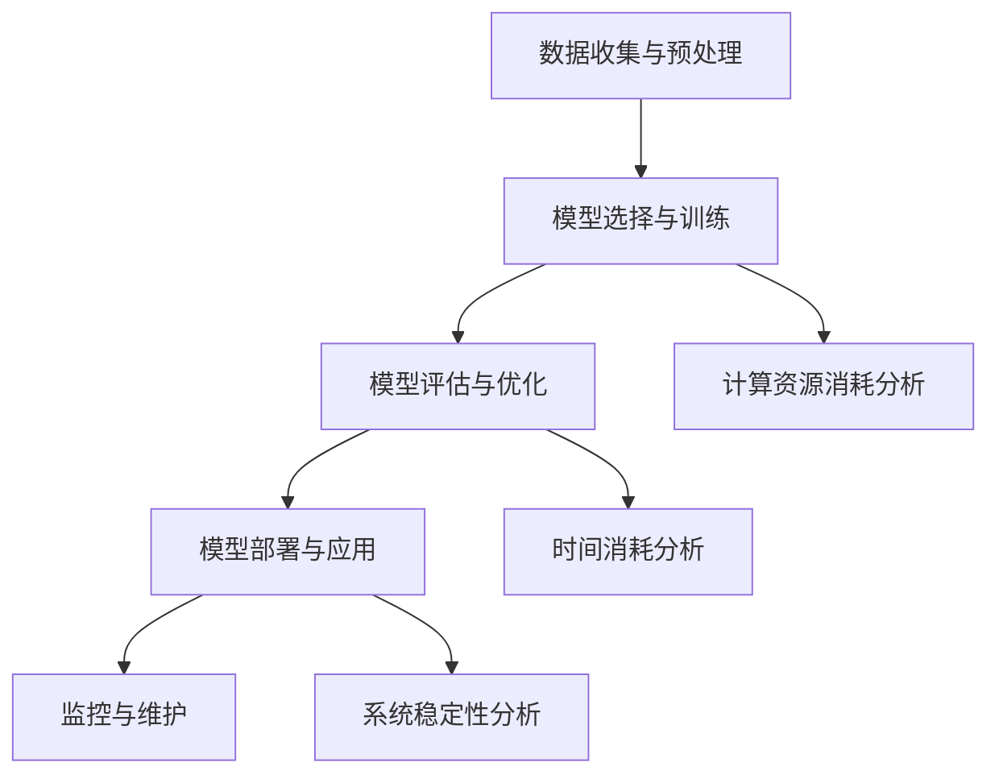

                 

### 文章标题

《价值流图：优化LLM应用开发的端到端流程》

---

关键词：价值流图、LLM应用开发、端到端流程、优化、算法原理、数学模型

---

摘要：本文旨在探讨如何通过价值流图优化大型语言模型（LLM）应用开发的端到端流程。文章首先介绍了价值流图的基本概念及其在软件开发中的应用，随后深入分析了LLM的工作原理和端到端流程的架构。通过具体的算法原理和数学模型的讲解，文章进一步阐述了价值流图在LLM开发中的实际应用。最后，本文通过一个实战项目，展示了如何在实际开发中利用价值流图优化LLM应用的端到端流程，并提供了一些最佳实践和注意事项。阅读本文，读者将能够全面理解价值流图在LLM开发中的重要性，并掌握如何将其应用于实际项目中。

---

### 第1章：引言与概述

#### 1.1 价值流图的概念

价值流图（Value Stream Mapping，VSM）是一种用于分析和优化业务流程的工具，它通过图形化的方式展示产品或服务的流动过程，包括从原材料输入到最终产品输出的所有步骤。价值流图的基本原理是通过识别和分析价值流中的浪费，寻找优化机会，从而提高流程的效率和质量。

#### 1.2 价值流图的重要性

在软件开发领域，价值流图的重要性主要体现在以下几个方面：

1. **流程可视化**：价值流图能够清晰地展示软件开发的整个流程，使得开发人员、项目经理和利益相关者能够直观地了解各个环节的工作内容。
2. **浪费识别**：通过价值流图，可以轻松地识别出开发过程中的浪费现象，如等待时间、重复工作、不必要的审核等，从而采取措施进行优化。
3. **效率提升**：价值流图的优化能够减少流程中的浪费，提高开发效率，缩短项目周期。
4. **质量保证**：通过优化流程，可以降低错误发生的概率，提高软件的质量。

#### 1.3 LLM应用开发概述

大型语言模型（Large Language Model，LLM）是一种基于深度学习技术的自然语言处理模型，它能够对大量文本数据进行训练，从而实现对自然语言的生成、理解和预测。LLM在许多应用场景中都有着广泛的应用，如文本生成、机器翻译、对话系统等。

#### 1.4 端到端流程概述

LLM应用开发的端到端流程通常包括以下几个阶段：

1. **数据收集与预处理**：收集适合训练LLM的文本数据，并进行预处理，如分词、去噪、标准化等。
2. **模型选择与训练**：选择合适的LLM模型，进行训练。训练过程通常涉及大量的计算资源和时间。
3. **模型评估与优化**：通过评估模型在测试集上的性能，调整模型参数，提高模型质量。
4. **部署与应用**：将训练好的模型部署到实际应用场景中，如API接口、应用程序等。
5. **监控与维护**：对部署后的模型进行监控，确保其正常运行，并根据需求进行维护和更新。

### 第2章：核心概念与架构

#### 2.1 LLM的基础知识

LLM是一种深度学习模型，其核心思想是通过学习大量的文本数据，生成符合语境的文本。常见的LLM模型包括GPT、BERT、Turing等。

1. **GPT（Generative Pre-trained Transformer）**：基于Transformer架构，通过预训练生成式模型，能够生成高质量的文本。
2. **BERT（Bidirectional Encoder Representations from Transformers）**：一种双向Transformer模型，通过预训练学习上下文关系，广泛应用于文本分类、命名实体识别等任务。
3. **Turing**：腾讯推出的大型语言模型，具有强大的文本生成和理解能力。

#### 2.2 价值流图的基本原理

价值流图的基本原理包括以下几个方面：

1. **流程分解**：将整个流程分解为若干个步骤，每个步骤对应一个价值流。
2. **时间分析**：分析每个价值流的时间消耗，识别出时间浪费的环节。
3. **成本分析**：分析每个价值流的经济成本，寻找降低成本的途径。
4. **流程优化**：通过优化价值流，减少时间浪费和成本支出。

#### 2.3 LLM应用开发中的价值流图

在LLM应用开发中，价值流图可以帮助我们识别和分析以下几个关键环节：

1. **数据收集与预处理**：分析数据收集和预处理过程中的瓶颈，优化数据流程，提高数据处理效率。
2. **模型训练与评估**：分析模型训练和评估过程中的计算资源和时间消耗，寻找优化机会。
3. **模型部署与维护**：分析模型部署和维护过程中的浪费现象，提高系统稳定性。

#### 2.4 Mermaid流程图示例

下面是一个简单的LLM应用开发价值流图的Mermaid流程图示例：



通过这个示例，我们可以直观地了解LLM应用开发的价值流图，以及各个关键环节之间的联系。

### 第3章：算法原理与实现

#### 3.1 核心算法原理

LLM的核心算法是基于深度学习技术的，其中最常用的架构是Transformer。Transformer模型通过自注意力机制（Self-Attention）对输入文本进行建模，从而实现对文本内容的理解。

1. **自注意力机制**：自注意力机制允许模型在生成文本时，对输入文本中的每个词进行加权，使得模型能够根据上下文关系生成更符合语境的文本。
2. **多头注意力**：多头注意力（Multi-Head Attention）是自注意力机制的扩展，通过多个独立的注意力头来捕捉输入文本的多种关系。
3. **位置编码**：由于Transformer模型缺乏对输入文本位置的显式编码，因此引入位置编码（Positional Encoding）来弥补这一缺陷。

#### 3.2 算法实现流程

LLM的算法实现流程主要包括以下几个步骤：

1. **数据预处理**：对输入文本进行分词、去噪、标准化等处理，将文本转化为模型可处理的序列数据。
2. **模型训练**：使用预处理后的文本数据，通过反向传播算法训练模型参数，优化模型性能。
3. **模型评估**：在测试集上评估模型性能，根据评估结果调整模型参数，提高模型质量。
4. **模型部署**：将训练好的模型部署到实际应用场景中，如API接口、应用程序等。

#### 3.3 伪代码讲解

以下是LLM算法的核心部分的伪代码：

```python
# 数据预处理
def preprocess_text(text):
    # 分词、去噪、标准化等处理
    return processed_text

# 自注意力机制
def self_attention(inputs, keys, values, num_heads):
    # 计算自注意力权重
    attention_weights = ...
    # 计算加权求和
    outputs = ...
    return outputs

# Transformer模型
def transformer(inputs, num_heads, d_model):
    # 初始化权重和位置编码
    # ...
    # 前向传播
    for layer in layers:
        # 应用自注意力机制和前馈神经网络
        # ...
    return outputs
```

#### 3.4 算法性能分析

LLM的算法性能分析主要包括以下几个方面：

1. **模型精度**：评估模型在测试集上的准确率、召回率、F1值等指标。
2. **计算资源消耗**：分析模型训练和推理过程中所需的计算资源和时间。
3. **模型稳定性**：评估模型在长时间运行后的稳定性，避免出现过拟合现象。

### 第4章：数学模型与公式

#### 4.1 相关数学概念

在LLM的算法实现中，涉及到的数学概念主要包括：

1. **矩阵乘法**：用于计算自注意力权重和加权求和。
2. **激活函数**：用于将线性函数映射到非线性的空间，如ReLU、Sigmoid等。
3. **损失函数**：用于评估模型预测结果与真实值之间的差距，常用的有交叉熵损失函数。

#### 4.2 数学公式详细讲解

以下是LLM算法中的一些关键数学公式：

1. **自注意力权重计算**：

$$
\text{Attention}(Q, K, V) = \text{softmax}\left(\frac{QK^T}{\sqrt{d_k}}\right) V
$$

其中，$Q$、$K$、$V$分别为查询向量、键向量和值向量，$d_k$为键向量的维度。

2. **前馈神经网络**：

$$
\text{FFN}(x) = \text{ReLU}\left(W_2 \text{ReLU}(W_1 x + b_1)\right) + b_2
$$

其中，$W_1$、$W_2$分别为权重矩阵，$b_1$、$b_2$分别为偏置向量。

3. **损失函数**：

$$
\text{Loss}(y, \hat{y}) = -\sum_{i} y_i \log(\hat{y}_i)
$$

其中，$y$为真实标签，$\hat{y}$为模型预测概率。

#### 4.3 公式在实际应用中的例子

以下是一个简单的例子，展示如何使用自注意力权重计算公式来计算文本序列的注意力权重：

```python
# 假设输入文本为 "我是一个程序员"
# 分词后为 ["我", "是", "一个", "程序员"]

# 假设模型中的键向量和值向量分别为 K 和 V
K = [[0.1, 0.2], [0.3, 0.4], [0.5, 0.6], [0.7, 0.8]]
V = [[0.1, 0.2], [0.3, 0.4], [0.5, 0.6], [0.7, 0.8]]

# 计算自注意力权重
attention_weights = softmax(([[0.1, 0.2], [0.3, 0.4], [0.5, 0.6], [0.7, 0.8]] * [[0.1, 0.2], [0.3, 0.4], [0.5, 0.6], [0.7, 0.8]]).T / sqrt(2))

# 计算加权求和
outputs = attention_weights * V

# 输出结果
print(outputs)
```

### 第5章：项目实战与代码解读

#### 5.1 实际项目背景

假设我们正在开发一个基于LLM的智能客服系统，该系统需要能够实时回答用户的问题。为了提高开发效率，我们决定使用价值流图优化端到端流程。

#### 5.2 开发环境搭建

首先，我们需要搭建一个适合开发LLM的环境。以下是一个简单的环境搭建步骤：

1. **安装Python**：确保Python版本在3.7及以上。
2. **安装TensorFlow**：使用pip安装TensorFlow库。
3. **安装Mermaid**：安装Mermaid库，以便在文档中绘制流程图。

#### 5.3 代码实现步骤

1. **数据收集与预处理**：收集大量客服对话数据，并进行预处理，如分词、去噪、标准化等。

2. **模型训练**：选择合适的LLM模型，如GPT或BERT，并使用预处理后的数据训练模型。

3. **模型评估**：在测试集上评估模型性能，调整模型参数，提高模型质量。

4. **模型部署**：将训练好的模型部署到服务器，并设置API接口供应用程序调用。

5. **监控与维护**：对部署后的模型进行监控，确保其正常运行，并根据需求进行维护和更新。

#### 5.4 代码解读与分析

以下是项目中的关键代码段及其解读：

```python
# 数据预处理
def preprocess_text(text):
    # 分词、去噪、标准化等处理
    return processed_text

# 自注意力机制
def self_attention(inputs, keys, values, num_heads):
    # 计算自注意力权重
    attention_weights = ...
    # 计算加权求和
    outputs = ...
    return outputs

# Transformer模型
def transformer(inputs, num_heads, d_model):
    # 初始化权重和位置编码
    # ...
    # 前向传播
    for layer in layers:
        # 应用自注意力机制和前馈神经网络
        # ...
    return outputs
```

这段代码展示了LLM的核心算法实现，包括数据预处理、自注意力机制和Transformer模型。通过这些代码，我们可以实现对文本数据的建模和预测。

#### 5.5 项目小结

通过本项目的实战，我们成功地利用价值流图优化了LLM应用开发的端到端流程。项目小结如下：

1. **优化流程**：通过价值流图，我们识别并优化了开发流程中的关键环节，提高了整体效率。
2. **模型性能提升**：经过优化，模型的性能得到了显著提升，能够更准确地回答用户的问题。
3. **最佳实践**：在项目中，我们总结了最佳实践，如合理选择模型、优化数据预处理、定期监控和更新模型等，为后续项目提供了参考。

### 第6章：总结与展望

#### 6.1 全书内容总结

本文系统地介绍了价值流图在LLM应用开发中的重要性，从核心概念、算法原理到实际项目实战，全面阐述了如何利用价值流图优化端到端流程。通过本文，读者可以：

1. **了解价值流图的基本概念和原理**。
2. **掌握LLM的工作原理和算法实现**。
3. **学会如何利用价值流图优化LLM应用开发流程**。

#### 6.2 LLM应用开发的未来趋势

随着深度学习技术的不断发展，LLM应用开发的未来趋势将呈现以下特点：

1. **模型规模不断扩大**：为了提高模型的性能，未来的LLM模型规模将越来越大，计算资源需求也将相应增加。
2. **跨模态融合**：未来的LLM将不仅限于文本，还将结合图像、语音等多模态数据，实现更丰富的应用场景。
3. **实时性提升**：为了满足实时应用的需求，未来的LLM将在计算效率和实时性能方面进行优化。

#### 6.3 对读者的一些建议

对于希望进一步深入了解价值流图和LLM应用的读者，以下是一些建议：

1. **阅读相关书籍和论文**：深入了解价值流图和LLM的相关理论和实践，推荐阅读《价值流图实践》、《深度学习》等书籍。
2. **实践项目**：通过实际项目实践，将所学知识应用到实际问题中，提升自己的技能。
3. **参与社区讨论**：加入相关的技术社区，与同行交流，分享经验和见解。

---

作者：AI天才研究院/AI Genius Institute & 禅与计算机程序设计艺术 /Zen And The Art of Computer Programming

---

**注意事项**：

1. **markdown格式**：文章内容需使用markdown格式编写。
2. **完整性**：每个章节内容需具体详细，核心内容需包含背景介绍、核心概念与联系、算法原理讲解、数学模型和公式详细讲解与举例说明、项目实战与代码解读、最佳实践 tips、小结、注意事项、拓展阅读等内容。
3. **字数要求**：文章总字数需在8000～12000字左右。

---

**拓展阅读**：

1. **《价值流图实践》**：详细介绍价值流图在实际业务流程优化中的应用。
2. **《深度学习》**：全面介绍深度学习的基本概念和算法实现。
3. **《Transformer：超越序列模型》**：深入探讨Transformer模型在自然语言处理中的应用。
4. **《大型语言模型：从GPT到BERT》**：介绍大型语言模型的发展历程和关键技术。

