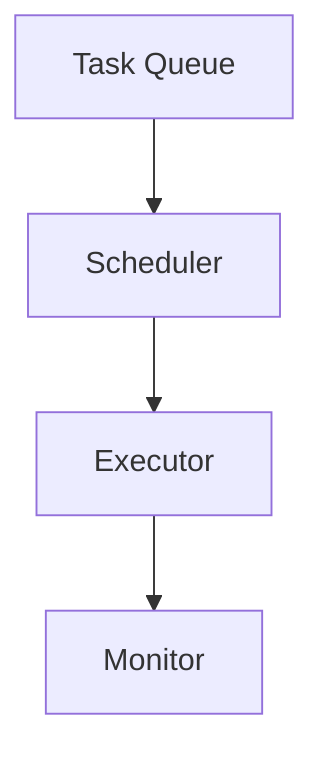
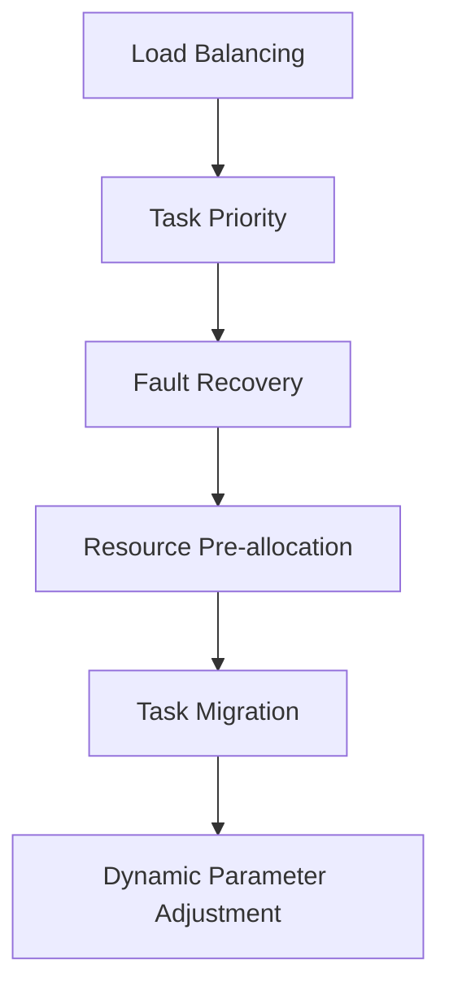
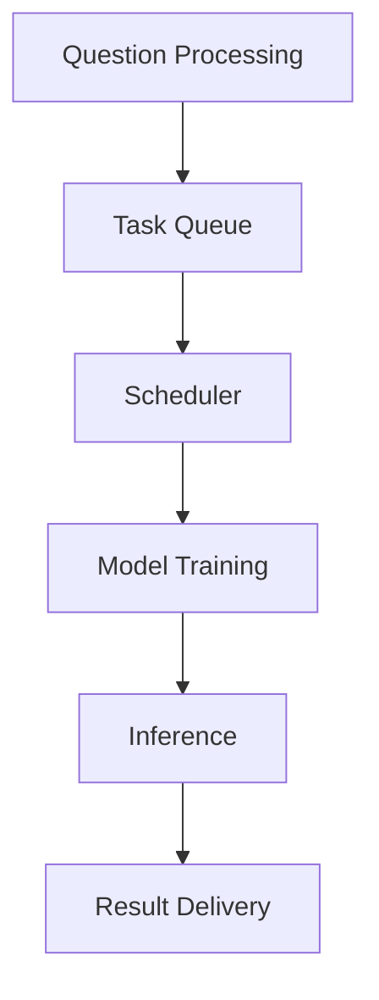
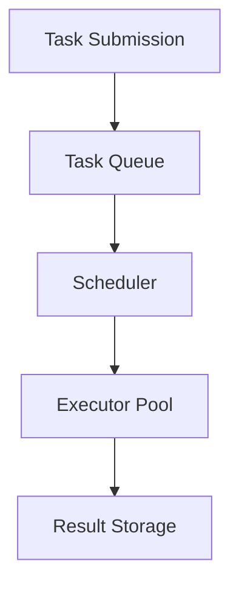
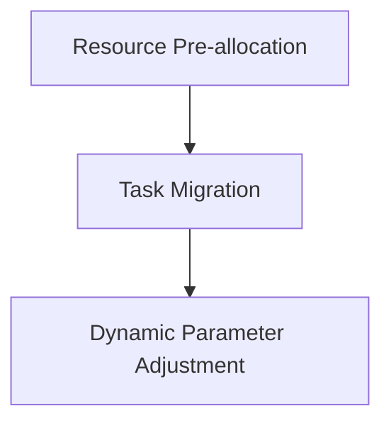
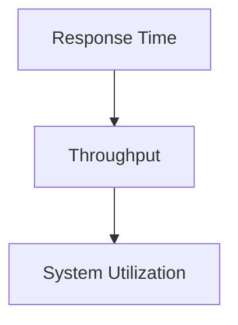
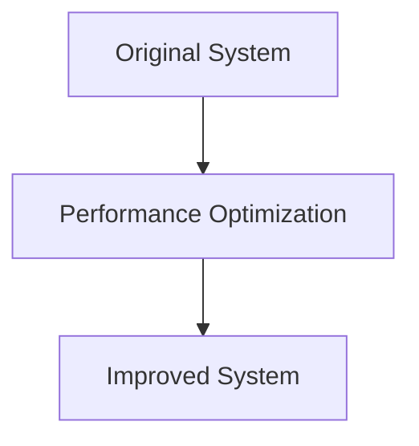

                 

### 文章标题

《任务调度系统在LLM应用后台处理中的应用》

### 关键词

任务调度系统，大型语言模型（LLM），后台处理，分布式系统，性能优化，应用场景

### 摘要

本文深入探讨了任务调度系统在大型语言模型（LLM）应用后台处理中的关键作用。首先，我们介绍了任务调度系统的基础理论和核心概念，包括定义、架构和调度算法。接着，我们分析了任务调度系统在LLM中的应用场景和需求，并通过具体的实践案例展示了其应用效果。文章还详细讲解了任务调度系统的实现、性能优化和未来发展趋势，为LLM应用的优化提供了理论指导和实践参考。

---

### 第一部分：任务调度系统基础理论

#### 第1章：任务调度系统概述

##### 1.1.1 任务调度系统的定义

任务调度系统是一种自动化管理系统，负责在多个任务处理单元（如计算机节点、服务器）之间分配任务，确保任务的高效完成。在分布式系统中，任务调度系统尤为关键，它能够平衡系统负载，提高资源利用率，确保系统稳定性和响应速度。

##### 1.1.2 任务调度系统的核心概念

任务调度系统的核心概念包括任务（Task）、任务队列（Task Queue）、调度器（Scheduler）、执行器（Executor）、资源管理（Resource Management）和负载均衡（Load Balancing）等。

- **任务（Task）**：需要执行的工作单元，可以是计算、数据传输或其他操作。
- **任务队列（Task Queue）**：用于存储待执行的任务。
- **调度器（Scheduler）**：负责将任务分配给执行器。
- **执行器（Executor）**：负责执行分配的任务。
- **资源管理（Resource Management）**：确保任务有足够的资源进行执行。
- **负载均衡（Load Balancing）**：将任务均衡分配到不同的执行器上，避免资源过度集中。

##### 1.1.3 任务调度系统的发展历程

任务调度系统的发展经历了从简单的作业调度到复杂的分布式调度系统的演变。早期的任务调度系统主要基于单机模型，随着云计算和大数据技术的发展，任务调度系统逐渐转向分布式计算环境，如MapReduce、Hadoop、Spark等。

#### 第2章：任务调度系统原理

##### 2.1.1 任务调度系统的架构

任务调度系统的典型架构包括任务队列、调度器、执行器和监控模块。调度器负责任务分配和调度，执行器负责任务执行，监控模块负责系统状态监控和性能分析。



##### 2.1.2 任务调度算法原理

任务调度算法主要有静态调度和动态调度两大类。静态调度算法包括轮询、最少连接、负载均衡等；动态调度算法包括动态负载均衡、基于反馈的调度等。

```python
# 轮询调度算法伪代码
while True:
    for executor in executors:
        if executor.is_idle():
            assign_task_to_executor(executor)
            break

# 动态负载均衡算法伪代码
while True:
    for executor in executors:
        if executor.load() > threshold:
            migrate_task(executor)
```

##### 2.1.3 调度策略与优化

调度策略包括负载均衡、任务优先级、故障恢复等。优化策略包括资源预分配、任务迁移、动态调度参数调整等。



### 第二部分：任务调度系统在LLM中的应用

#### 第3章：任务调度系统在LLM中的应用

##### 3.1.1 LLM应用场景与需求

大型语言模型（LLM）在自然语言处理、问答系统、机器翻译等应用中发挥着重要作用。这些应用通常需要处理海量数据，具有高实时性、高并发性的特点，因此对任务调度系统有较高的需求。

##### 3.1.2 任务调度系统在LLM中的应用原理

任务调度系统在LLM中的应用主要包括模型训练、推理和部署等环节。调度系统需要根据不同应用场景动态调整任务分配，确保模型的高效运行。

##### 3.1.3 任务调度系统在LLM中的实践案例

以某问答系统为例，介绍任务调度系统在该系统中的应用，包括任务分配、执行和监控等环节。



### 第三部分：任务调度系统的实现与优化

#### 第4章：任务调度系统的实现

##### 4.1.1 任务调度系统的设计

设计任务调度系统需要考虑系统的可扩展性、容错性和性能优化。以下是一个简单的任务调度系统设计：



##### 4.1.2 任务调度系统的编码实现

编码实现任务调度系统需要选择合适的编程语言和框架。以下是一个简单的任务调度系统实现（Python）：

```python
class TaskScheduler:
    def __init__(self):
        self.task_queue = Queue()
        self.executor_pool = Pool()

    def submit_task(self, task):
        self.task_queue.put(task)

    def run(self):
        while not self.task_queue.empty():
            task = self.task_queue.get()
            executor = self.executor_pool.get_executor()
            executor.execute(task)

    def shutdown(self):
        self.executor_pool.shutdown()
```

##### 4.1.3 任务调度系统的测试与调试

在实现任务调度系统后，需要进行测试和调试以确保系统的稳定性和性能。以下是一个测试用例：

```python
def test_task_scheduler():
    scheduler = TaskScheduler()
    tasks = [Task("Task 1"), Task("Task 2"), Task("Task 3")]
    for task in tasks:
        scheduler.submit_task(task)
    scheduler.run()
    assert scheduler.task_queue.empty()
```

#### 第5章：任务调度系统的性能优化

##### 5.1.1 性能优化策略

性能优化策略包括资源预分配、任务迁移、动态调度参数调整等。



##### 5.1.2 调度系统性能评估指标

调度系统性能评估指标包括响应时间、吞吐量、系统利用率等。



##### 5.1.3 性能优化案例分析

以某问答系统为例，介绍任务调度系统的性能优化过程。



### 第四部分：任务调度系统实战案例

#### 第6章：任务调度系统实战案例

##### 6.1.1 实战案例一：XX平台任务调度系统优化

介绍XX平台任务调度系统的优化过程，包括设计思路、实现方法和优化效果。

##### 6.1.2 实战案例二：YY平台任务调度系统应用

介绍YY平台任务调度系统的应用场景、任务调度策略和性能优化方案。

### 第五部分：未来发展趋势与挑战

#### 第7章：未来发展趋势与挑战

##### 7.1.1 任务调度系统发展趋势

任务调度系统在未来将朝着智能化、自动化和高效化的方向发展，如引入人工智能、机器学习等技术，实现自适应调度和优化。

##### 7.1.2 任务调度系统面临的挑战

任务调度系统在面临海量数据、高并发性和动态变化的环境下，如何实现高效稳定的调度仍然是一个挑战。

##### 7.1.3 未来发展方向

未来发展方向包括：智能化调度算法、分布式任务调度、跨平台兼容性和系统性能优化等。

## 附录

### 附录A：任务调度系统常用算法与数据结构

介绍任务调度系统中常用的算法和数据结构，如队列、栈、二叉树、图等。

### 附录B：任务调度系统开发工具与资源

列出任务调度系统开发中常用的工具和资源，如编程语言、框架、文档等。

### 附录C：参考文献

列出本文引用的参考文献，包括书籍、论文、网站等。

---

### 作者

**作者：AI天才研究院/AI Genius Institute & 禅与计算机程序设计艺术 /Zen And The Art of Computer Programming**

---

### 完整性要求

#### 核心内容包含：

- **背景介绍**：任务调度系统的基本概念和作用，以及其在LLM应用中的重要性。
- **核心概念与联系**：任务调度系统的核心概念及其相互关系，通过Mermaid流程图展示。
- **核心算法原理讲解**：详细讲解任务调度算法，使用伪代码展示。
- **数学模型和公式**：介绍相关的数学模型和公式，使用LaTeX格式表示。
- **项目实战**：包括开发环境搭建、源代码实现、代码解读、实际案例分析和项目小结。

---

### 文章摘要

本文深入探讨了任务调度系统在大型语言模型（LLM）应用后台处理中的关键作用。首先介绍了任务调度系统的定义、架构和调度算法。接着分析了任务调度系统在LLM中的应用场景和需求，并通过具体案例展示了其应用效果。文章还详细讲解了任务调度系统的实现、性能优化和未来发展趋势，为LLM应用的优化提供了理论指导和实践参考。通过本文的阅读，读者将能够全面了解任务调度系统在LLM应用中的重要性及其实现方法。总字数控制在8000～12000字左右。

