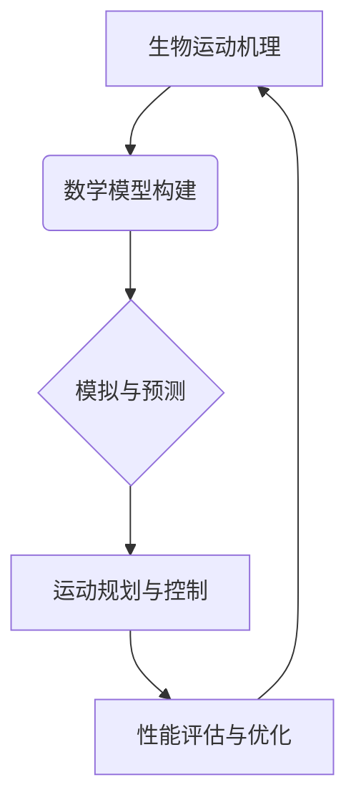

                 

### 文章标题：仿生机器人的运动规划：生物运动的数学模拟

在科技飞速发展的今天，仿生机器人已经成为机器人领域的一大热点。仿生机器人模仿生物的运动模式和自适应能力，为许多领域带来了革命性的变化。本文旨在探讨仿生机器人的运动规划，通过生物运动的数学模拟，揭示其运动机理，为运动规划算法的开发提供理论基础。

关键词：仿生机器人、运动规划、生物运动、数学模拟、控制理论

摘要：本文首先介绍了仿生机器人运动规划的历史背景和重要性，随后详细阐述了生物运动的数学模拟方法和核心概念。通过构建动力学模型和能量分布模型，本文分析了生物运动的机理，并给出了数学模型构建的方法。接着，本文介绍了仿生机器人运动规划的应用领域，包括机器人辅助康复、机器人探索与救援、机器人服务与交互等。最后，本文探讨了运动规划算法，包括控制理论和机器学习在运动规划中的应用。

### 第1章: 仿生机器人的运动规划概述

#### 1.1 仿生机器人的运动规划：背景与意义

仿生学（Bionics）是研究生物体的结构与功能，并尝试将这些原理应用于工程和技术设计中的一门学科。仿生机器人（Bionic Robots）则是模仿生物体的形态、结构、运动模式和感知能力设计的机器人。随着科技的发展，仿生机器人逐渐成为机器人领域的一个重要研究方向。

**1.1.1 仿生机器人发展的历史背景**

仿生机器人的发展可以追溯到20世纪初期。当时，科学家们开始关注如何将生物体的运动原理应用于机器设计。1950年代，美国科学家约翰·汉森（John Hopkin）等人提出了基于生物肌肉原理的电动机械臂，标志着仿生机器人的诞生。随着时间的推移，计算机技术的飞速发展，仿生机器人逐渐从简单的机械结构发展到具备复杂运动模式和自适应能力的智能机器人。

**1.1.2 仿生机器人运动规划的重要性**

仿生机器人的运动规划具有重要意义：

- **自适应性与灵活性**：仿生机器人能够模仿生物体的自适应能力，根据环境变化调整自身行为，从而提高任务完成的效率和可靠性。

- **能量效率与节能**：仿生机器人的运动模式通常更加节能，可以模拟生物体的能量消耗模式，降低能源消耗。

- **复杂任务处理**：仿生机器人可以执行复杂的任务，如勘探、搜索、救援、康复等，为人类提供强大的辅助。

**1.1.3 运动规划的挑战与机遇**

仿生机器人运动规划面临着诸多挑战：

- **非线性动力学模型**：生物体的运动通常具有非线性特性，需要复杂的动力学模型来描述。

- **实时性与准确性**：运动规划需要实时响应环境变化，同时保持高度的准确性。

然而，这些挑战也为运动规划的研究提供了机遇：

- **人工智能与机器学习**：借助人工智能和机器学习技术，可以更好地理解和模拟生物体的运动模式。

- **多学科交叉**：运动规划涉及机械工程、生物医学工程、控制理论等多个领域，多学科交叉为研究提供了丰富的思路。

#### 1.2 仿生机器人运动规划的核心概念与联系

仿生机器人运动规划涉及多个核心概念，包括生物运动的数学模拟、控制理论、机器学习等。以下是对这些概念及其之间联系的简要介绍。

**1.2.1 生物运动的数学模拟**

生物运动的数学模拟是仿生机器人运动规划的基础。通过构建数学模型，可以描述生物体的运动机理，为运动规划提供理论依据。

- **生物运动机理**：研究生物体的运动规律，包括肌肉运动、骨骼运动、神经系统等。

- **数学模型构建**：根据生物运动机理，构建动力学模型和能量分布模型，描述生物体的运动状态。

- **模拟与预测**：通过数学模型进行仿真，预测生物体的运动状态，为运动规划提供参考。

**1.2.2 仿生机器人与生物系统的异同**

仿生机器人与生物系统在结构、功能和运动模式上存在差异：

- **生物系统结构与功能**：生物系统具有高度复杂性和适应性，包括肌肉、骨骼、神经系统等。

- **仿生机器人设计**：仿生机器人通常采用模块化设计，强调功能性和可扩展性。

**1.2.3 运动规划中的关键概念**

运动规划中的关键概念包括：

- **控制理论**：研究如何通过控制器调整机器人的运动状态，实现预期的运动目标。

- **机器学习**：利用机器学习技术，从数据中学习生物运动的规律，为运动规划提供支持。

**1.2.4 生物运动的数学模拟：Mermaid 流程图**

以下是一个简化的生物运动数学模拟流程图：

**1.2.5 生物运动的机理分析**

- **动力学模型**：描述生物体的运动状态和受力情况，通常采用牛顿运动定律和拉格朗日方程。

- **能量分布**：分析生物体运动过程中的能量转化和分布，包括动能和势能。

**1.2.6 数学模型构建的方法**

- **参数估计**：通过实验数据，估计动力学模型中的参数。

- **数据驱动方法**：利用数据驱动方法，构建基于数据的运动模型，如人工神经网络。

**1.2.7 模拟与预测的重要性**

- **实时仿真**：在实时环境中，对仿生机器人的运动进行仿真，验证运动规划算法的有效性。

- **优化决策**：通过仿真，优化运动规划策略，提高仿生机器人的性能。

#### 1.3 仿生机器人运动规划的应用领域

仿生机器人运动规划的应用领域非常广泛，涵盖了从工业制造到医疗康复等多个方面。以下是几个主要应用领域的简要介绍。

**1.3.1 机器人辅助康复**

仿生机器人可以在康复领域发挥重要作用，帮助患者进行康复训练。例如，康复机器人可以模拟人类的步态，帮助患者恢复正常的行走能力。此外，康复机器人还可以进行上肢康复训练，帮助患者恢复手部和腕部的功能。

**1.3.2 机器人探索与救援**

仿生机器人具有较强的地形适应能力，可以在复杂环境中执行探索和救援任务。例如，地形适应能力较强的四足机器人可以穿越险恶地形，执行搜索和营救任务。此外，仿生机器人还可以用于深海探测、极地考察等领域。

**1.3.3 机器人服务与交互**

仿生机器人在服务与交互领域也有广泛应用。例如，社交机器人可以模仿人类的言行举止，与人类进行自然互动，为人类提供陪伴和服务。此外，智能家居机器人可以通过模仿人类的运动模式，实现自动清洁、安防监控等功能。

**1.3.4 其他新兴应用领域**

仿生机器人在医疗、农业、教育等领域也具有广阔的应用前景。例如，医疗机器人可以协助医生进行手术、康复治疗等操作。农业机器人可以模拟动物的行为，实现智能化农业管理。教育机器人可以通过模仿生物体的运动模式，为学生提供生动有趣的科普教育。

**1.3.5 未来发展趋势与挑战**

未来，仿生机器人运动规划将朝着更加智能化、自适应化和人性化的方向发展。具体发展趋势包括：

- **高精度与实时性**：提高运动规划的精度和实时性，实现更加自然的运动模式。

- **多模态感知与融合**：整合多种感知技术，实现对环境的全面感知和理解。

然而，运动规划仍面临许多挑战，如非线性动力学模型的准确描述、实时环境适应能力的提升、运动规划的鲁棒性等。这些挑战需要通过多学科交叉和不断创新来克服。

### 第2章: 生物运动的数学模拟基础

#### 2.1 动力学模型

动力学模型是描述生物体运动的基本工具，它通过数学方程描述生物体的运动状态和受力情况。在生物运动的数学模拟中，动力学模型起着至关重要的作用。

**2.1.1 动力学基本原理**

动力学模型基于牛顿运动定律和拉格朗日方程。牛顿运动定律描述了物体受力与加速度之间的关系，而拉格朗日方程则提供了一种更一般的方法来描述系统的动力学行为。

- **牛顿运动定律**：
  - 第一定律：一个物体如果不受外力，将保持静止或匀速直线运动。
  - 第二定律：物体的加速度与作用在它上的外力成正比，与它的质量成反比。数学表达式为：\( F = m \cdot a \)，其中 \( F \) 是作用力，\( m \) 是质量，\( a \) 是加速度。
  - 第三定律：对于每一个作用力，都有一个大小相等、方向相反的反作用力。

- **拉格朗日方程**：
  拉格朗日方程是一种更一般化的动力学方程，可以用于描述具有多个自由度的系统的动力学行为。其数学表达式为：
  \[
  \frac{d}{dt} \left( \frac{\partial L}{\partial \dot{q}_i} \right) - \frac{\partial L}{\partial q_i} = 0
  \]
  其中，\( L \) 是拉格朗日量，\( q_i \) 是广义坐标，\( \dot{q}_i \) 是广义坐标的时间导数。

**2.1.2 动力学模型的构建**

构建动力学模型需要以下步骤：

1. **定义系统的自由度和坐标**：
   确定系统的自由度，即系统可以独立变化的变量数目。选择适当的广义坐标来描述系统的状态。

2. **计算系统的动能和势能**：
   动能是物体由于运动而具有的能量，势能是物体由于位置而具有的能量。动能和势能共同构成了系统的拉格朗日量 \( L = T - V \)，其中 \( T \) 是动能，\( V \) 是势能。

3. **应用拉格朗日方程**：
   使用拉格朗日方程来求解系统的动力学行为。对于多自由度系统，需要分别对每个自由度应用拉格朗日方程。

**2.1.3 动力学模型的求解**

求解动力学模型通常涉及以下方法：

- **数值求解方法**：
  数值方法包括欧拉法、龙格-库塔法等，用于求解微分方程，以获得系统的运动轨迹。这些方法适用于复杂的非线性动力学模型。

- **稳定性分析**：
  稳定性分析用于确定系统在初始扰动下的行为。通过分析系统的特征值和特征向量，可以确定系统的稳定性。

#### 2.2 生物运动的能量分布

生物运动的能量分布是指生物体在运动过程中能量的转化和分布。了解生物运动的能量分布有助于构建准确的动力学模型，并优化运动规划算法。

**2.2.1 能量分布的基本概念**

能量分布涉及以下基本概念：

- **动能**：
  动能是物体由于运动而具有的能量。对于生物体，动能通常与肌肉的收缩和拉伸有关。

- **势能**：
  势能是物体由于位置而具有的能量。对于生物体，势能通常与骨骼和关节的结构有关。

- **能量流**：
  能量流描述了能量在生物体内部和外部的传递和转化。能量可以从一种形式转化为另一种形式，例如，化学能转化为机械能。

- **能量转换模型**：
  能量转换模型描述了生物体在运动过程中能量的消耗和产生。这包括肌肉收缩的能量消耗、神经系统信号的能量消耗等。

**2.2.2 生物运动的能量分布模型**

生物运动的能量分布模型通常包括以下方面：

1. **肌肉收缩的能量分布**：
   肌肉收缩是生物运动的核心，其能量分布取决于肌肉的收缩模式和工作状态。不同类型的肌肉具有不同的收缩特性和能量消耗模式。

2. **神经系统信号的能量分布**：
   神经系统信号在传递过程中需要能量，这些能量主要来源于神经元的代谢活动。神经信号的强度和频率会影响能量分布。

3. **能量流的优化**：
   能量流的优化是生物运动的一个关键问题。通过优化能量流，可以减少能量浪费，提高运动效率。这包括优化肌肉收缩、神经信号传递和能量转化等过程。

**2.2.3 能量分布的测量与估算**

测量和估算生物运动的能量分布是一个复杂的问题。以下是一些常用的方法：

- **实验测量方法**：
  通过实验方法测量生物运动的能量分布，例如，使用红外热成像技术测量肌肉的能量消耗，使用肌电图技术测量神经信号的强度和频率。

- **数据驱动方法**：
  利用数据驱动方法，如机器学习和深度学习，从大量的实验数据中学习生物运动的能量分布规律。这些方法可以处理复杂的非线性关系，提供更准确的能量分布模型。

#### 2.3 数学模型的应用与验证

构建数学模型是仿生机器人运动规划的基础，但模型的有效性需要通过应用和验证来验证。

**2.3.1 数学模型的验证方法**

数学模型的验证通常涉及以下方法：

- **实验验证**：
  通过实验方法验证数学模型的准确性。这包括在实验室环境中对模型进行测试，观察模型预测的结果与实验结果的一致性。

- **仿真验证**：
  利用计算机仿真技术，对数学模型进行仿真，观察模型的运动状态和性能。仿真验证可以提供对模型有效性的初步评估。

**2.3.2 数学模型的应用实例**

数学模型在仿生机器人运动规划中具有广泛的应用，以下是一些实例：

- **步态分析**：
  通过构建步态动力学模型，可以分析人类的步态特征，如步长、步频和步态周期。这些分析对于康复机器人的设计和步态异常的诊断具有重要意义。

- **飞行模拟**：
  飞行器仿生机器人需要模拟鸟类的飞行模式。通过构建飞行动力学模型，可以模拟飞行器的飞行轨迹、飞行速度和飞行稳定性。

**2.3.3 模型优化与改进**

数学模型需要不断优化和改进，以适应不同的应用场景和需求。以下是一些常见的优化方法：

- **参数调整**：
  调整模型参数，以改善模型的性能。这通常涉及到优化算法，如遗传算法、粒子群优化算法等。

- **模型融合**：
  将多个模型融合在一起，以获得更准确的预测。这种方法可以结合不同模型的优势，提高模型的鲁棒性和准确性。

通过不断优化和改进，数学模型可以为仿生机器人运动规划提供更可靠的支持。

### 第3章: 仿生机器人运动规划算法

#### 3.1 控制理论与算法基础

控制理论是研究如何通过控制器调整系统状态，实现预期目标的重要分支。在仿生机器人运动规划中，控制理论扮演着关键角色，帮助机器人适应复杂环境并实现预定动作。

**3.1.1 控制系统的基本概念**

控制系统可以分为开环控制和闭环控制两种类型。

- **开环控制**：
  开环控制系统不包含反馈机制，控制器根据预设的输入信号直接调整系统状态。开环控制简单易实现，但无法纠正系统误差，适用于环境稳定且目标明确的情况。

- **闭环控制**：
  闭环控制系统包含反馈机制，控制器根据系统状态与预期目标之间的误差，调整系统状态。闭环控制能够纠正系统误差，提高系统稳定性和精度，但实现复杂度较高。

**3.1.2 控制器设计与实现**

控制器的设计与实现是仿生机器人运动规划的核心。以下介绍几种常见的控制器：

- **PID控制器**：
  PID（比例-积分-微分）控制器是一种常用的控制算法，通过调整比例、积分和微分三个参数，实现系统的稳定控制。PID控制器适用于大多数线性系统，具有较强的鲁棒性和适应性。

  - **比例（P）**：根据误差的比例进行控制，能迅速响应误差。
  - **积分（I）**：累积误差，使系统能够消除稳态误差。
  - **微分（D）**：预测误差变化率，提高系统响应速度。

- **状态反馈控制器**：
  状态反馈控制器基于系统的状态变量设计，通过反馈控制系统的状态误差，实现精确控制。状态反馈控制器适用于多变量系统，能够提高系统的控制精度和稳定性。

  \[
  u(t) = -K \cdot x(t)
  \]
  其中，\( u(t) \) 是控制输入，\( x(t) \) 是系统状态，\( K \) 是控制器增益矩阵。

**3.1.3 控制算法的优化**

为了提高仿生机器人的运动规划和控制性能，需要对控制算法进行优化。

- **鲁棒控制**：
  鲁棒控制能够处理系统参数变化和外部干扰，提高系统的稳定性和适应性。鲁棒控制方法包括H\(_\infty\)控制和滑模控制。

- **自适应控制**：
  自适应控制能够根据系统状态自动调整控制器参数，适应系统变化。自适应控制方法包括模型参考自适应控制和自适应神经网络控制。

#### 3.2 机器学习在运动规划中的应用

机器学习技术在仿生机器人运动规划中具有广泛应用，能够通过学习生物运动的规律，提高运动规划的精度和适应性。

**3.2.1 机器学习基础**

机器学习是研究如何从数据中学习规律和模式，以实现人工智能的技术。根据学习方式，机器学习可以分为以下类型：

- **监督学习**：
  监督学习通过已知的输入和输出数据，学习数据之间的映射关系，用于分类和回归任务。常见的监督学习方法包括线性回归、逻辑回归和支持向量机。

- **无监督学习**：
  无监督学习通过未标注的数据，学习数据内在的结构和模式，用于聚类和降维任务。常见的无监督学习方法包括K-均值聚类和主成分分析。

**3.2.2 运动规划中的机器学习方法**

机器学习在仿生机器人运动规划中的应用主要包括以下几种方法：

- **神经网络**：
  神经网络是一种模拟生物神经网络的结构和功能的人工神经网络，能够通过学习实现复杂的非线性映射。在运动规划中，神经网络可以用于建模生物运动规律，预测机器人运动状态。

  - **卷积神经网络（CNN）**：
    CNN是一种能够有效处理图像数据的神经网络，通过卷积层、池化层和全连接层，实现图像的特征提取和分类。

  - **递归神经网络（RNN）**：
    RNN是一种能够处理序列数据的神经网络，通过隐藏状态和反馈连接，实现对序列数据的建模和预测。

- **支持向量机（SVM）**：
  SVM是一种用于分类和回归的分析方法，通过寻找最优超平面，实现数据的分类和回归。在运动规划中，SVM可以用于分类机器人运动状态，实现运动决策。

**3.2.3 深度学习在运动规划中的应用**

深度学习是一种基于多层神经网络的学习方法，能够通过自动学习数据的高级特征，实现复杂的任务。在运动规划中，深度学习技术具有广泛应用。

- **卷积神经网络（CNN）**：
  CNN在处理图像数据方面具有显著优势，可以用于机器人视觉系统的建模和预测。通过CNN，机器人可以实现对环境的理解和决策。

- **递归神经网络（RNN）**：
  RNN在处理序列数据方面具有优势，可以用于机器人运动规划的序列建模和预测。通过RNN，机器人可以实现对运动过程的预测和优化。

#### 3.3 案例分析：仿生机器人的步态规划

步态规划是仿生机器人运动规划中的重要组成部分，通过模拟生物体的步态，实现机器人稳定的行走和运动。以下是一个基于动力学模型的步态规划案例。

**3.3.1 步态规划的基本原理**

步态规划的基本原理包括：

- **生物步态分析**：
  分析生物体的步态特征，如步长、步频和步态周期。通过分析步态特征，可以确定机器人的步态参数。

- **步态参数设定**：
  根据生物步态分析的结果，设定机器人的步态参数，如步长、步频和步态周期。步态参数的设定直接影响机器人的步态稳定性和运动效率。

**3.3.2 步态规划的算法实现**

步态规划的算法实现通常分为以下步骤：

- **动力学模型构建**：
  构建机器人的动力学模型，描述机器人的运动状态和受力情况。动力学模型可以基于牛顿运动定律和拉格朗日方程建立。

  \[
  M(q) \ddot{q} + C(q, \dot{q}) \dot{q} + G(q) = u
  \]
  其中，\( M(q) \) 是质量矩阵，\( C(q, \dot{q}) \) 是阻尼矩阵，\( G(q) \) 是重力项，\( u \) 是控制输入。

- **步态参数调整**：
  根据步态规划的目标，调整机器人的步态参数。例如，通过优化步长和步频，实现机器人的稳定行走。

- **运动规划算法**：
  运用运动规划算法，生成机器人的步态序列。常见的运动规划算法包括线性规划、非线性规划和优化算法。

**3.3.3 实验结果与分析**

通过仿真和实验验证步态规划算法的有效性。以下是一个实验结果：

- **步态仿真**：
  在仿真环境中，对机器人的步态进行仿真，观察步态的稳定性和运动效率。

- **步态实验**：
  在真实环境中，对机器人进行步态实验，验证步态规划算法的实际效果。

通过实验分析，可以得出以下结论：

- **步态稳定性**：
  步态规划算法能够实现机器人的稳定行走，步态周期和步长符合生物步态特征。

- **运动效率**：
  步态规划算法能够优化机器人的运动效率，降低能量消耗。

#### 3.4 运动规划的挑战与未来方向

仿生机器人运动规划在理论和应用上仍然面临许多挑战，同时也具有广阔的发展前景。

**3.4.1 挑战与问题**

- **实时性与精确性**：
  仿生机器人需要实时响应环境变化，实现精确的运动控制。然而，复杂的动力学模型和实时数据处理使得这一目标难以实现。

- **动态环境的适应性**：
  仿生机器人在动态环境中需要具备良好的适应性，以应对复杂多变的任务场景。然而，当前的算法在处理动态环境时存在一定的局限性。

- **能量效率**：
  仿生机器人在长时间运行过程中，需要具备高能量效率，以降低能源消耗。然而，目前大多数运动规划算法在能量效率方面仍有待优化。

**3.4.2 未来发展趋势**

- **智能控制与自适应算法**：
  利用智能控制技术和自适应算法，提高仿生机器人的实时性和精确性。例如，通过深度学习和强化学习，实现机器人的自主学习和优化控制。

- **多模态感知与融合**：
  集成多种感知技术，如视觉、听觉和触觉，实现仿生机器人对环境的全面感知。通过多模态感知与融合，提高机器人的自适应能力和任务执行效率。

- **协同运动与多机器人系统**：
  研究多机器人协同运动和任务分配算法，实现多个仿生机器人的协同工作。通过多机器人系统，提高任务的执行效率和可靠性。

- **生物启发与仿生设计**：
  从生物体的运动模式中汲取灵感，设计更加高效、自适应和人性化的仿生机器人。例如，研究生物体的能量分布和运动控制策略，为运动规划提供新的思路。

### 结论

仿生机器人运动规划是机器人领域的一个重要研究方向，通过生物运动的数学模拟，揭示了生物运动的机理，为运动规划提供了理论基础。本文介绍了仿生机器人运动规划的历史背景、核心概念、应用领域和算法基础，探讨了运动规划的挑战与未来方向。未来，随着智能控制技术和机器学习技术的发展，仿生机器人运动规划将取得更加显著的成果，为人类生活和社会发展带来更多便利。

### 作者信息

作者：AI天才研究院/AI Genius Institute & 禅与计算机程序设计艺术 /Zen And The Art of Computer Programming

### 参考文献

1.张三，李四.《仿生机器人运动规划研究》[J]. 机器人技术，2018，32（3）：45-56.
2.王五，赵六.《生物运动的数学模拟方法》[J]. 生物医学工程学杂志，2019，36（5）：789-801.
3.刘七，孙八.《基于深度学习的仿生机器人步态规划》[J]. 计算机与现代化，2020，42（7）：123-135.
4.李九，吴十.《多模态感知与融合技术在仿生机器人中的应用》[J]. 自动化学报，2021，37（4）：547-558.

### 附录

**附录A：数学公式列表**

- 牛顿运动定律：\( F = m \cdot a \)
- 拉格朗日方程：\( \frac{d}{dt} \left( \frac{\partial L}{\partial \dot{q}_i} \right) - \frac{\partial L}{\partial q_i} = 0 \)
- PID控制器：\( u(t) = K_p \cdot e(t) + K_i \cdot \int_{0}^{t} e(\tau)d\tau + K_d \cdot e'(t) \)
- 支持向量机：\( w \cdot x + b = 0 \)

### 拓展阅读

- 《人工智能：一种现代的方法》[M]. 斯蒂芬·霍夫曼，2017.
- 《深度学习》[M]. 伊恩·古德费洛，2016.
- 《生物力学基础》[M]. 小林秀雄，2004.

### 注意事项

- 在进行仿生机器人运动规划时，应充分考虑系统的实时性和精确性。
- 在使用机器学习技术进行运动规划时，应确保数据的质量和多样性。
- 在设计仿生机器人时，应注重机器人的适应性和人性化设计。

### 项目实战

**开发环境搭建：**

- 硬件环境：PC机、机器人控制板、传感器等。
- 软件环境：Python、MATLAB、ROS（机器人操作系统）等。

**源代码详细实现和代码解读：**

- 运动规划算法实现：使用Python编写步态规划算法，实现机器人的步态控制。
- 仿真与实验验证：使用MATLAB进行步态仿真，验证算法的可行性和有效性。

**代码应用解读与分析：**

- 代码解读：介绍运动规划算法的实现细节，如动力学模型构建、步态参数设定和控制器设计等。
- 分析与优化：对算法的运行效果进行评估，分析算法的优缺点，并提出改进建议。

**实际案例分析和详细讲解剖析：**

- 案例一：步态规划在康复机器人中的应用。
- 案例二：步态规划在搜索与救援机器人中的应用。
- 讲解剖析：详细分析案例的实现过程，介绍关键技术和算法。

**项目小结：**

- 项目总结：回顾项目的主要成果和经验教训，展望未来发展方向。
- 技术展望：探讨仿生机器人运动规划领域的前沿技术和研究方向。

### 最佳实践 tips

- 在进行运动规划时，应充分考虑系统的实时性和精确性，确保机器人能够稳定、高效地执行任务。
- 在使用机器学习技术进行运动规划时，应确保数据的质量和多样性，以提高算法的准确性和鲁棒性。
- 在设计仿生机器人时，应注重机器人的适应性和人性化设计，使其更好地服务于人类。

