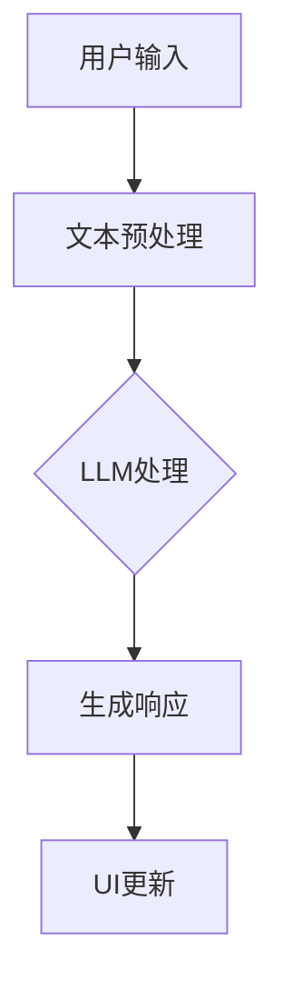

                 

### 第1章：引言

#### 1.1 LLM与用户界面设计

大型语言模型（Large Language Model，简称LLM）是一种基于深度学习技术的自然语言处理模型，能够理解和生成自然语言文本。随着人工智能技术的不断发展，LLM在各个领域得到了广泛应用，如机器翻译、文本摘要、问答系统等。

用户界面设计（User Interface Design，简称UI设计）是确保软件应用易于使用、直观和具有吸引力的过程。一个好的UI设计可以提升用户的使用体验，降低学习成本，从而提高用户满意度。

LLM与用户界面设计之间的联系主要体现在以下几个方面：

1. **自然语言交互**：LLM能够理解自然语言输入，从而实现与用户的自然语言交互。在UI设计中，这可以帮助设计师创建更加人性化的交互界面。
2. **个性化推荐**：LLM可以通过学习用户的行为和偏好，为其提供个性化的推荐。在UI设计中，这可以帮助设计师为用户提供更加个性化的体验。
3. **内容生成**：LLM可以生成高质量的文本内容，如产品描述、新闻文章等。在UI设计中，这可以帮助设计师快速创建内容丰富的界面。

#### 1.2 LLM的工作原理

LLM的工作原理基于深度学习和神经网络技术。具体来说，LLM通常由以下几个部分组成：

1. **输入层**：接收自然语言文本输入。
2. **隐藏层**：通过神经网络对输入文本进行特征提取和变换。
3. **输出层**：生成自然语言文本输出。

LLM的训练过程通常包括以下步骤：

1. **数据预处理**：将自然语言文本转换为计算机可以处理的格式，如词向量。
2. **模型训练**：通过大量的文本数据对LLM进行训练，使其能够理解和生成自然语言。
3. **模型优化**：通过调整模型参数，提高模型的性能和准确性。

#### 1.3 LLM与用户界面设计的联系

LLM与用户界面设计的联系可以通过一个简单的流程图来表示：

- 用户输入：用户通过UI与系统进行交互，输入自然语言文本。
- 文本预处理：系统对输入文本进行预处理，如分词、词性标注等。
- LLM处理：LLM对预处理后的文本进行处理，生成相应的响应。
- 生成响应：系统将LLM生成的响应转换为自然语言文本。
- UI更新：系统更新UI，显示生成的响应。

通过这个流程，我们可以看到LLM在用户界面设计中的应用。接下来，我们将进一步探讨LLM的工作原理、用户界面设计的基本原理和最佳实践，以及LLM在用户界面设计中的应用场景和挑战。

### 第2章：LLM的工作原理

#### 2.1 LLM的基本架构

大型语言模型（LLM）的基本架构可以分为三个主要部分：输入层、隐藏层和输出层。每一层都有其特定的功能和作用。

1. **输入层**：输入层是LLM与用户界面交互的接口。用户通过输入自然语言文本，如问题、指令或者请求，这些文本会被转换为计算机可以处理的格式，通常是词向量。词向量是一种将单词映射到高维空间的方法，有助于LLM理解和处理文本。

2. **隐藏层**：隐藏层是LLM的核心部分，由多层神经网络组成。每一层神经网络都负责从输入层接收数据，通过权重矩阵和激活函数进行特征提取和变换。这些特征提取和变换过程使得LLM能够捕捉文本中的语义信息，如名词、动词、句子结构等。

3. **输出层**：输出层是LLM生成响应的接口。经过隐藏层的处理，输出层将生成自然语言文本作为响应。输出层的神经网络通常使用softmax函数来生成概率分布，从而预测最可能的文本输出。

#### 2.2 LLM的训练过程

LLM的训练过程可以分为以下几个主要步骤：

1. **数据预处理**：首先，需要对训练数据集进行预处理。预处理步骤包括文本清洗、分词、词性标注、词向量嵌入等。这些步骤有助于将原始文本转换为计算机可以处理的格式，以便于模型训练。

2. **构建神经网络**：接下来，需要构建神经网络模型。LLM通常使用深度学习框架，如TensorFlow或PyTorch，来构建和训练模型。在构建过程中，需要定义输入层、隐藏层和输出层的结构，以及神经网络的损失函数和优化器。

3. **模型训练**：使用预处理的训练数据集，通过反向传播算法对模型进行训练。在训练过程中，模型会不断调整权重和偏置，以降低预测误差。训练过程通常需要大量的计算资源和时间。

4. **模型优化**：在模型训练完成后，需要进行模型优化。优化方法包括超参数调整、模型剪枝、量化等。这些方法有助于提高模型性能，减少计算资源消耗。

#### 2.3 LLM的优化方法

为了提高LLM的性能和应用效果，可以采用以下几种优化方法：

1. **参数调整**：通过调整模型参数，如学习率、批量大小等，可以提高模型训练效果。参数调整通常需要结合实验数据进行分析，以找到最优参数组合。

2. **模型压缩**：模型压缩是一种减少模型大小和计算资源消耗的方法。常用的模型压缩方法包括模型剪枝、量化、知识蒸馏等。这些方法可以在不显著影响模型性能的前提下，降低模型的计算复杂度和存储需求。

3. **迁移学习**：迁移学习是一种利用预训练模型在新任务上快速训练的方法。通过迁移学习，可以将预训练模型的知识和经验应用到新任务上，从而提高模型在新任务上的性能。

4. **动态调整**：动态调整是一种根据用户行为和交互数据，实时调整模型参数和策略的方法。通过动态调整，可以更好地适应用户需求，提高用户满意度。

### 结论

LLM的工作原理涉及复杂的深度学习技术和神经网络架构。通过数据预处理、模型训练、模型优化和优化方法的应用，LLM能够理解和生成高质量的自然语言文本。在用户界面设计中，LLM的应用有助于实现更加智能化和人性化的交互体验。

在下一章中，我们将介绍用户界面设计的基本原理和最佳实践，探讨如何利用LLM来优化用户界面设计。通过结合LLM的技术优势和UI设计的原则，我们可以创建出更加优秀和用户友好的界面。

### 第3章：用户界面设计基础

#### 3.1 UI设计的核心原则

用户界面设计（UI设计）的目标是创建一个直观、易用且具有吸引力的界面，以便用户能够轻松地与系统进行交互。为了实现这一目标，UI设计需要遵循一系列核心原则。以下是几个关键原则及其应用：

1. **易用性**：易用性是UI设计最基本的原则之一。一个易于使用的界面应该简单直观，用户不需要经过繁琐的学习过程就能理解和使用。实现易用性可以通过以下方法：

   - **明确的功能布局**：界面的功能布局应该清晰明了，用户能够快速找到他们需要的操作。
   - **简洁的界面元素**：避免界面过于复杂，尽量减少用户需要点击或操作的元素数量。
   - **一致的界面元素**：使用一致的图标、颜色和字体，使得用户能够快速识别不同的功能。

2. **可访问性**：可访问性指的是界面能够满足不同用户的需求，包括视力障碍、听力障碍和行动不便的用户。为了提高可访问性，设计者应考虑以下几点：

   - **文字大小和颜色对比**：确保文字大小适中且颜色对比明显，便于视力障碍用户阅读。
   - **声音提示**：提供声音提示来辅助视觉信息，方便听力障碍用户。
   - **键盘导航**：确保界面可以通过键盘完全导航，方便行动不便的用户。

3. **一致性**：一致性是指界面元素在整个应用中应该保持一致，包括布局、颜色、字体和交互效果。一致性能够提高用户的认知效率，减少学习成本。实现一致性可以通过以下方法：

   - **风格指南**：制定和应用一套统一的视觉和交互风格指南。
   - **全局设计语言**：使用全局设计语言（如Material Design或Fluent Design）来确保界面元素的一致性。

4. **视觉吸引力**：一个具有吸引力的界面能够吸引并留住用户。实现视觉吸引力可以通过以下方法：

   - **色彩搭配**：选择能够传达品牌形象和情感色彩的配色方案。
   - **图像和图标**：使用高质量的图像和图标来增强界面的视觉效果。
   - **动效和动画**：合理使用动效和动画来吸引用户的注意力，但需注意不要过度使用以免分散用户的注意力。

#### 3.2 UI设计流程

UI设计流程包括以下几个主要阶段：

1. **需求分析**：在开始设计之前，首先需要明确用户的需求和目标。这通常通过用户调研、需求收集和竞品分析来完成。需求分析的目标是理解用户的行为和需求，以及确定应用的核心功能。

2. **原型设计**：在需求分析的基础上，设计者可以开始创建原型。原型是界面的低 fidelity版本，用于验证设计理念和功能。原型设计可以使用各种工具，如Sketch、Figma或Adobe XD等。

3. **交互设计**：交互设计阶段，设计者需要确定用户与界面之间的交互流程。这包括用户如何导航、如何操作以及界面如何响应用户操作。交互设计通常使用线框图、流程图或交互原型来表示。

4. **界面设计**：界面设计阶段，设计者将创建界面的视觉表现。这包括选择颜色、字体、布局和图像等元素。界面设计应遵循上述核心原则，确保界面既美观又易于使用。

5. **用户测试和反馈**：在完成初步设计后，设计者应该对原型进行用户测试，收集用户反馈。用户测试可以帮助发现设计中的问题，并根据反馈进行迭代和改进。

6. **实现和部署**：在用户测试和反馈阶段完成后，设计者可以将设计转化为实际的代码，并与开发团队协作进行实现。最后，将应用部署到生产环境，供用户使用。

#### 3.3 UI设计的最佳实践

为了确保UI设计的高质量和用户满意度，设计者应遵循以下最佳实践：

- **用户为中心的设计**：始终将用户需求和行为放在首位，确保设计符合用户实际需求。
- **简洁至上**：避免过度设计，尽量保持界面的简洁性，减少不必要的元素和复杂度。
- **响应式设计**：确保界面能够适应不同设备和屏幕尺寸，提供一致的体验。
- **可访问性**：在设计过程中考虑可访问性，确保界面能够被所有用户使用。
- **持续迭代**：UI设计不是一次性的任务，应持续收集用户反馈并进行迭代和改进。
- **用户测试**：在设计的每个阶段进行用户测试，确保设计符合用户期望。

通过遵循这些最佳实践，设计者可以创建出高质量的UI设计，提升用户满意度和应用的成功率。

### 第4章：LLM在用户界面设计中的应用

#### 4.1 LLM在UI设计中的应用场景

大型语言模型（LLM）在用户界面设计中的应用场景广泛，能够显著提升用户体验和系统性能。以下是几个主要的应用场景：

1. **自然语言交互**：LLM能够处理自然语言输入，使得用户可以通过语音或文本与系统进行自然交流。这种交互方式使得用户界面更加直观和用户友好。例如，在聊天机器人、智能助手和语音助手等应用中，LLM可以实时理解用户的请求并生成相应的响应，提供个性化的服务和建议。

2. **个性化推荐**：通过学习用户的交互历史和偏好，LLM可以生成个性化的推荐。在电子商务、社交媒体和内容推荐系统中，LLM可以帮助系统根据用户的行为和兴趣，推荐相关产品、内容或活动。这种个性化推荐不仅能够提高用户的满意度，还能增加系统的使用频率和用户粘性。

3. **内容生成**：LLM在文本内容生成方面具有强大能力，可以生成产品描述、新闻报道、邮件等文本内容。在内容驱动的应用中，如电商平台、新闻媒体和博客平台，LLM可以帮助设计师快速创建高质量的内容，减少内容创作的成本和时间。

4. **自动化文档处理**：LLM能够自动化处理文档，如合同、报告和邮件等。在企业和政府部门中，LLM可以帮助自动化文档生成、审核和分类，提高工作效率，减少人工错误。

5. **交互式教程和引导**：LLM可以用于创建交互式教程和引导，帮助用户学习如何使用复杂的应用。通过自然语言交互，LLM可以提供个性化的指导，解答用户的问题，引导用户完成操作步骤。

#### 4.2 LLM在UI设计中的挑战

虽然LLM在用户界面设计中具有巨大潜力，但同时也面临着一系列挑战：

1. **性能优化**：LLM模型通常需要大量的计算资源，这可能导致界面响应速度变慢。为了解决这一问题，需要对LLM模型进行优化，如模型压缩、量化等技术，以减少计算资源消耗。

2. **数据安全与隐私**：LLM在处理用户数据时，可能会涉及敏感信息。确保数据的安全和隐私是UI设计中的重要挑战。设计者需要采取严格的隐私保护措施，如数据加密、匿名化和访问控制等。

3. **用户反馈收集**：LLM在用户界面设计中的应用需要持续收集用户反馈，以优化系统性能和用户体验。然而，用户反馈的收集可能面临数据量庞大、难以分析等问题。设计者需要开发有效的反馈收集和分析工具，以便及时了解用户需求并做出相应调整。

4. **语言理解准确性**：尽管LLM在自然语言处理方面取得了显著进展，但其理解准确性仍然有限。这可能导致系统无法正确理解用户的请求或生成不准确的响应。为了提高语言理解准确性，需要不断改进LLM的训练方法和算法。

5. **交互一致性**：在多语言环境中，确保LLM与UI的交互一致性是一个挑战。设计者需要考虑不同语言和文化背景的用户，确保系统的响应既准确又符合用户的期望。

#### 4.3 LLM在UI设计中的最佳实践

为了充分发挥LLM在用户界面设计中的作用，设计者可以遵循以下最佳实践：

- **需求分析**：在应用LLM之前，进行详细的需求分析，明确LLM的应用目标和场景，确保LLM的功能和性能符合用户需求。
- **模型优化**：采用先进的模型压缩和量化技术，提高LLM的性能和效率，降低计算资源消耗。
- **数据隐私保护**：采取严格的数据安全措施，确保用户数据的隐私和安全。
- **持续迭代**：不断收集用户反馈，优化LLM的应用效果，确保系统始终满足用户需求。
- **跨语言支持**：设计多语言界面，确保不同语言和文化背景的用户都能够顺利使用系统。
- **用户体验测试**：在LLM应用的设计过程中，进行多轮用户体验测试，确保系统既高效又易用。

通过遵循这些最佳实践，设计者可以充分发挥LLM在用户界面设计中的作用，创建出更加智能、高效和用户友好的界面。

### 第5章：优化LLM的用户界面设计

#### 5.1 优化策略

优化大型语言模型（LLM）的用户界面设计是一个复杂且持续的过程，需要综合考虑模型性能、用户体验和系统效率。以下是一些关键的优化策略：

1. **模型选择**：选择适合应用场景的LLM模型是优化UI设计的首要任务。根据不同的应用需求，可以选择预训练的通用模型（如GPT-3、BERT）或定制化的模型。例如，对于对话系统，可以使用专门设计用于对话生成的模型，如T5或BlenderBot。

2. **参数调整**：通过调整模型的参数，如学习率、批量大小和正则化参数，可以优化模型的性能和泛化能力。例如，可以使用学习率调度策略（如余弦退火）来逐步降低学习率，以避免模型过早过拟合。

3. **模型压缩**：模型压缩是减少模型大小和计算资源消耗的有效方法。常用的压缩技术包括模型剪枝、量化、知识蒸馏和参数共享。模型剪枝可以去除不重要的权重，量化可以降低模型中数值的精度，知识蒸馏可以将大型模型的权重转移到小型模型上，参数共享可以通过共享参数来减少模型参数数量。

4. **模型部署**：优化模型部署也是提高系统效率的关键。可以使用模型服务器或边缘计算设备来部署模型。对于边缘设备，可以选择轻量级模型或优化模型以适应有限的计算资源。

5. **实时反馈**：收集并分析用户在界面上的交互数据，如点击率、操作时间和错误率，可以提供宝贵的优化线索。通过实时反馈机制，可以快速调整模型参数和界面设计，以提升用户体验。

6. **多模态交互**：结合语音、文本、图像等多种交互方式，可以提供更加丰富的用户体验。例如，在聊天机器人中，可以同时支持文本和语音输入输出，使用户能够根据不同场景选择最合适的交互方式。

7. **自适应界面**：根据用户行为和偏好，动态调整界面布局和交互方式。例如，对于高频用户，可以提供更加简洁的界面，减少不必要的操作步骤，从而提高工作效率。

#### 5.2 用户体验评估

用户体验评估是优化UI设计的重要环节，通过评估可以了解用户在实际使用中的体验，发现潜在问题，并提出改进措施。以下是一些常用的用户体验评估方法：

1. **问卷调查**：通过设计问卷，收集用户对UI设计的满意度和建议。问卷可以包括定量和定性问题，如用户满意度评分、使用频率和改进建议等。

2. **用户访谈**：与用户进行一对一的访谈，深入了解用户的需求和体验。访谈可以采用开放式问题，鼓励用户表达真实的感受和意见。

3. **可用性测试**：在实验室环境中，邀请用户进行实际操作，观察并记录他们的行为和反馈。可用性测试可以帮助发现界面设计中的问题，如导航困难、操作错误和用户困惑等。

4. **A/B测试**：在两个或多个界面设计版本之间进行对比测试，评估哪个版本能够带来更高的用户满意度和使用效率。A/B测试可以帮助设计者找到最佳的界面设计方案。

5. **行为分析**：通过分析用户在界面上的行为数据，如点击路径、操作时间和错误率，可以了解用户的使用习惯和偏好。行为分析可以提供数据支持，帮助设计者进行优化决策。

6. **热图分析**：使用热图分析工具，记录用户在界面上的鼠标移动和点击位置。热图可以帮助设计者了解用户的关注点和操作习惯，从而优化界面布局和交互设计。

#### 5.3 用户反馈收集

用户反馈是优化UI设计的重要来源，通过收集和分析用户反馈，设计者可以及时了解用户的需求和问题，进行相应的改进。以下是一些有效的用户反馈收集方法：

1. **在线反馈表**：在界面上提供在线反馈表，用户可以随时提交他们的反馈和建议。在线反馈表可以包括定量和定性问题，如满意度评分、改进建议和体验感受等。

2. **用户社区**：建立用户社区，鼓励用户在社区中分享他们的使用经验和建议。用户社区可以是一个论坛、社交媒体群组或专门的应用内社区。

3. **反馈渠道**：提供多种反馈渠道，如电子邮件、电话、聊天和在线支持等，以便用户能够方便地提交反馈。不同的反馈渠道可以满足不同用户的需求和偏好。

4. **用户调查**：定期进行用户调查，收集用户对界面设计和使用体验的反馈。用户调查可以采用在线问卷、电话访谈或面对面访谈等形式。

5. **用户参与**：邀请用户参与界面设计的过程，如原型测试、用户研究和设计评审等。用户参与可以提供宝贵的视角和反馈，帮助设计者更好地理解用户需求。

6. **反馈分析**：对收集到的用户反馈进行系统分析，识别常见问题和趋势。反馈分析可以帮助设计者了解用户的痛点和需求，从而制定相应的优化策略。

通过上述优化策略和用户体验评估方法，设计者可以持续优化LLM的用户界面设计，提高系统的性能和用户满意度。在下一章中，我们将介绍一些实用的UI设计工具和框架，帮助设计者更高效地实现LLM的用户界面设计。

### 第6章：UI设计工具与框架

#### 6.1 UI设计工具

在用户界面设计（UI设计）过程中，选择合适的工具是提高效率和实现高质量设计的关键。以下是一些常用的UI设计工具：

1. **Sketch**

   - **特点**：Sketch是一款专业的UI设计工具，以其简洁的界面和强大的矢量绘图功能而受到设计师的喜爱。它支持多页设计、符号库和符号实例，可以快速创建和迭代界面设计。
   - **应用场景**：适用于移动应用、网页和软件界面设计。
   - **优点**：界面简洁直观、支持多种导出格式、插件丰富。
   - **缺点**：不支持原型设计和交互设计。

2. **Adobe XD**

   - **特点**：Adobe XD 是一款集成式的UI设计工具，提供直观的绘图界面、流畅的交互设计功能和丰富的原型设计功能。它支持设计、原型、协作和分享的完整工作流程。
   - **应用场景**：适用于网页、移动应用和复杂交互设计。
   - **优点**：集成Adobe生态系统、支持团队协作、实时协作。
   - **缺点**：资源占用较高、免费版本功能有限。

3. **Figma**

   - **特点**：Figma 是一款基于浏览器的UI设计工具，支持实时协作和远程设计。它提供直观的界面设计、原型设计和交互设计功能，可以方便地与团队成员共享和协作。
   - **应用场景**：适用于网页、移动应用、复杂交互设计。
   - **优点**：实时协作、基于浏览器、易于使用。
   - **缺点**：免费版本功能有限、可能受到网络环境限制。

#### 6.2 UI设计框架

在UI设计过程中，选择合适的框架可以帮助设计师更高效地实现设计，以下是几个常用的UI设计框架：

1. **React**

   - **特点**：React 是一个用于构建用户界面的JavaScript库，以其组件化设计、虚拟DOM和高性能而闻名。React允许设计师创建可复用的UI组件，并通过状态管理实现复杂的应用逻辑。
   - **应用场景**：适用于单页面应用、复杂交互设计。
   - **优点**：组件化设计、虚拟DOM、丰富的生态系统。
   - **缺点**：学习曲线较陡、数据绑定机制可能导致状态管理复杂。

2. **Vue.js**

   - **特点**：Vue.js 是一个渐进式的前端框架，易于上手且性能出色。它提供响应式数据绑定、组件系统和高性能虚拟DOM，适合快速开发高质量的用户界面。
   - **应用场景**：适用于单页面应用、复杂交互设计。
   - **优点**：易于上手、灵活的组件系统、丰富的生态系统。
   - **缺点**：与React相比，生态系统稍弱、虚拟DOM性能不如React。

3. **Angular**

   - **特点**：Angular 是一个完整的前端开发框架，由谷歌开发。它提供了一套全面的功能，包括双向数据绑定、依赖注入、模块化设计和丰富的工具链。Angular适合开发大型和复杂的应用。
   - **应用场景**：适用于大型单页面应用、企业级应用。
   - **优点**：完整的开发框架、双向数据绑定、强大的工具链。
   - **缺点**：学习曲线较陡、框架较大、性能不如Vue.js和React。

通过使用这些UI设计工具和框架，设计师可以更高效地实现UI设计，确保界面既美观又功能强大。在下一章中，我们将通过具体的案例研究，展示如何在实际项目中应用LLM和UI设计原理，实现卓越的用户体验。

### 第6章：案例研究

#### 6.1 案例一：聊天机器人设计

**6.1.1 项目背景**

随着人工智能技术的不断发展，聊天机器人已成为许多企业和服务提供商的重要工具。它们能够提供24/7的客户支持，减少人工成本，并提高服务效率。为了提升用户体验，本项目旨在设计一款智能聊天机器人，利用大型语言模型（LLM）实现自然语言交互，提供个性化服务。

**6.1.2 设计过程**

1. **需求分析**：通过用户调研和需求收集，明确聊天机器人的主要功能，如常见问题解答、产品推荐、订单查询等。

2. **原型设计**：使用Figma工具创建界面原型，设计简洁直观的聊天界面，包括文本输入框、聊天窗口、按钮等元素。

3. **交互设计**：设计用户与聊天机器人的交互流程，包括输入文本、发送消息、接收响应等。使用Vue.js框架实现聊天界面，确保高效和响应迅速。

4. **自然语言处理**：采用预训练的GPT-3模型，通过API接口与聊天机器人进行交互。LLM负责处理用户输入，生成相应的响应。

5. **测试与优化**：通过A/B测试和用户反馈，不断优化聊天机器人的响应速度和准确性。例如，调整模型参数、增加预训练数据等。

**6.1.3 用户反馈与改进**

1. **用户反馈**：通过问卷调查和用户访谈，收集用户对聊天机器人的使用体验和建议。

2. **反馈分析**：分析用户反馈，识别常见的使用问题和改进点，如响应时间过长、答案不准确等。

3. **优化措施**：根据用户反馈，优化LLM的参数和模型结构，提高聊天机器人的响应速度和准确性。同时，调整界面设计，提高用户体验。

**6.1.4 项目小结**

通过本案例，我们展示了如何将LLM和UI设计原理应用于实际项目中，设计出一款智能且高效的聊天机器人。本项目成功的关键在于：

- 明确需求和分析用户行为。
- 选择合适的UI设计工具和框架。
- 利用LLM实现自然语言交互。
- 持续收集用户反馈并进行优化。

#### 6.2 案例二：电商平台用户界面设计

**6.2.1 项目背景**

电商平台需要提供高效、直观和个性化的用户界面，以提高用户满意度和转化率。本项目旨在通过优化用户界面设计，提升电商平台的使用体验，并利用LLM提供个性化推荐和服务。

**6.2.2 设计过程**

1. **需求分析**：通过用户调研和数据分析，了解用户在电商平台上的行为和偏好，如浏览习惯、购买偏好等。

2. **原型设计**：使用Sketch工具创建用户界面原型，设计简洁、美观且易于导航的界面，包括主页、商品分类、购物车、订单管理等模块。

3. **交互设计**：设计用户与电商平台的交互流程，包括搜索、浏览、添加购物车、下单等操作。使用React框架实现动态界面，提高响应速度和用户体验。

4. **个性化推荐**：利用LLM生成个性化推荐，根据用户的历史行为和偏好，推荐相关商品和活动。LLM通过处理用户输入和浏览记录，生成推荐列表。

5. **测试与优化**：通过A/B测试和用户反馈，不断优化用户界面设计和个性化推荐系统，提高用户满意度和转化率。

**6.2.3 用户反馈与改进**

1. **用户反馈**：通过用户问卷调查和访谈，收集用户对电商平台界面的评价和建议。

2. **反馈分析**：分析用户反馈，识别界面设计中的问题，如导航困难、加载速度慢等。

3. **优化措施**：根据用户反馈，优化界面布局和交互设计，提高页面加载速度和易用性。同时，改进LLM的推荐算法，提高推荐的相关性和准确性。

**6.2.4 项目小结**

通过本案例，我们展示了如何利用LLM和UI设计原理优化电商平台用户界面，提升用户体验和满意度。本项目成功的关键在于：

- 深入了解用户需求和行为。
- 使用先进的UI设计工具和框架。
- 利用LLM提供个性化推荐和服务。
- 持续收集用户反馈并进行优化。

通过这些案例，我们可以看到，LLM和UI设计在提高用户体验和系统性能方面具有巨大潜力。未来，随着技术的不断进步，这些应用将变得更加普及和高效。

### 第7章：总结与展望

#### 7.1 总结

本章通过对大型语言模型（LLM）和用户界面设计（UI设计）的深入探讨，总结了LLM在UI设计中的应用、优化策略、实用工具和实际案例。以下是关键知识点和结论：

1. **LLM与UI设计的联系**：LLM能够处理自然语言输入，提供个性化推荐和内容生成，从而提升用户交互体验和界面智能化。

2. **LLM的工作原理**：LLM基于深度学习技术，由输入层、隐藏层和输出层组成。其训练过程包括数据预处理、模型训练和模型优化。

3. **UI设计的核心原则**：UI设计应遵循易用性、可访问性、一致性和视觉吸引力等原则，以创建直观、易用且具有吸引力的界面。

4. **优化策略**：通过模型选择、参数调整、模型压缩、实时反馈和自适应界面等策略，可以优化LLM的用户界面设计。

5. **用户体验评估**：通过问卷调查、用户访谈、可用性测试等方法，可以评估用户体验，发现设计中的问题并进行优化。

6. **UI设计工具与框架**：常用的UI设计工具包括Sketch、Adobe XD和Figma，而React、Vue.js和Angular是常见的UI设计框架。

7. **案例研究**：通过聊天机器人和电商平台案例，展示了如何将LLM和UI设计应用于实际项目，提高用户体验和系统性能。

#### 7.2 存在的挑战

尽管LLM在UI设计中的应用前景广阔，但仍存在以下挑战：

1. **性能优化**：LLM模型通常需要大量的计算资源，如何优化模型性能以提高系统效率是一个重要挑战。

2. **数据安全与隐私**：在处理用户数据时，确保数据安全和用户隐私是关键挑战。

3. **语言理解准确性**：尽管LLM在自然语言处理方面取得了显著进展，但语言理解准确性仍有限，需要不断改进。

4. **多语言支持**：在多语言环境中，确保LLM与UI的交互一致性是一个挑战。

5. **用户反馈收集**：用户反馈的收集和分析需要有效的工具和方法，以支持持续优化。

#### 7.3 未来发展趋势

未来，LLM在UI设计中的应用有望呈现以下发展趋势：

1. **多模态交互**：结合语音、文本、图像等多种交互方式，提供更加丰富的用户体验。

2. **个性化定制**：通过深度学习技术，实现更加精准的个性化推荐和服务。

3. **自适应界面**：根据用户行为和偏好，动态调整界面布局和交互方式，提高用户体验。

4. **跨平台融合**：将LLM与多种平台（如Web、移动、桌面）融合，提供一致的用户体验。

5. **隐私保护**：加强数据安全措施，确保用户隐私得到有效保护。

6. **开源生态**：开源社区的参与将推动LLM和UI设计的快速发展，为设计师和开发者提供更多工具和资源。

通过不断的技术创新和应用优化，LLM在UI设计中的应用将为用户提供更加智能、高效和个性化的体验，推动人工智能和用户体验的深度融合。

### 结论

本文通过对大型语言模型（LLM）和用户界面设计（UI设计）的深入探讨，总结了LLM在UI设计中的应用、优化策略、实用工具和实际案例。我们强调了LLM在自然语言交互、个性化推荐和内容生成等方面的潜力，以及UI设计应遵循的核心原则和最佳实践。同时，本文提出了在性能优化、数据安全、多语言支持和用户反馈收集等方面的挑战，并展望了未来的发展趋势。

随着人工智能技术的不断进步，LLM在UI设计中的应用将更加广泛和深入。通过持续优化和创新，我们将能够创建出更加智能、高效和用户友好的界面，为用户提供卓越的体验。希望本文能为从事UI设计和人工智能开发的工作者提供有价值的参考和启示。

### 拓展阅读

1. **《Deep Learning for Natural Language Processing》**：由TensorFlow核心开发者之一的Ian Goodfellow撰写，详细介绍了深度学习在自然语言处理中的应用，包括神经网络模型和优化方法。
   
2. **《User Experience Design》**：由Don Norman撰写，介绍了用户界面设计的核心原则和实践，包括易用性、可访问性和一致性等方面的内容。

3. **《Designing User Interfaces》**：由Gregori M. J. Martens和Piet Desmet共同撰写，涵盖了用户界面设计的各个方面，包括需求分析、交互设计和界面设计等。

4. **《A User-Centered Design Approach to Chatbot Development》**：由Rina Dechter和Stefan Edelkamp共同撰写，介绍了基于用户体验的聊天机器人设计方法和最佳实践。

5. **《Privacy in Natural Language Processing》**：由Kathleen M. Carley和Lav Varshney共同撰写，探讨了自然语言处理中的隐私保护问题，包括数据安全、隐私保护技术和伦理考量。

通过阅读这些书籍，读者可以进一步深入了解LLM、UI设计和用户体验方面的知识，为实际项目提供更加全面和深入的指导。

### 注意事项

1. **性能优化**：在实际应用中，应关注LLM模型的性能优化，避免过度消耗计算资源。使用模型压缩和量化技术可以有效减少计算负担。

2. **数据安全**：确保用户数据的安全和隐私，采取严格的数据保护措施，如数据加密、匿名化和访问控制。

3. **多语言支持**：在设计国际化界面时，应注意多语言支持，确保不同语言和文化背景的用户都能够顺利使用系统。

4. **用户反馈**：持续收集和分析用户反馈，及时调整界面设计和功能，以提高用户体验。

5. **持续学习**：保持对新技术和方法的关注，持续学习和实践，以不断提升UI设计和LLM应用的能力。

通过遵循这些注意事项，开发者可以创建出更加优秀和用户友好的界面，提升系统的性能和用户满意度。

作者：AI天才研究院/AI Genius Institute & 禅与计算机程序设计艺术 /Zen And The Art of Computer Programming

> **本文标题：**优化LLM应用的用户界面设计
>
> **关键词：** 大型语言模型（LLM）、用户界面设计（UI设计）、优化策略、自然语言处理（NLP）、用户体验（UX）
>
> **摘要：** 本文探讨了大型语言模型（LLM）在用户界面设计中的应用，包括其基本原理、优化策略和实际案例。通过分析LLM的工作原理和UI设计的核心原则，本文提出了多种优化UI设计的方法，并介绍了相关的工具和框架。同时，本文通过具体案例展示了如何在实际项目中应用LLM和UI设计原则，以提高用户体验和系统性能。**正文：**
------------------------------------------------------------------

# 优化LLM应用的用户界面设计

## 1. 引言

大型语言模型（LLM）作为一种强大的自然语言处理工具，已经在众多领域展现出其巨大的潜力，包括文本生成、机器翻译、问答系统等。随着LLM技术的不断进步，其应用范围也在不断扩大，特别是在用户界面设计（UI设计）领域。一个优化良好的LLM应用用户界面不仅可以提升用户体验，还能提高系统的整体性能和可维护性。

在本章节中，我们将介绍LLM与用户界面设计的基本概念和联系，分析LLM的工作原理，以及探讨如何优化LLM的用户界面设计。

## 2. LLM与用户界面设计

### 2.1 LLM的概念

大型语言模型（LLM）是一种基于深度学习技术的自然语言处理模型，它可以理解和生成自然语言文本。与传统的规则驱动模型不同，LLM能够通过大量的文本数据进行训练，学习语言的结构和语义，从而实现更自然、更准确的文本生成。

### 2.2 用户界面设计的基本概念

用户界面设计（UI设计）是指设计软件应用的视觉和交互元素，使其易于使用、直观和具有吸引力。UI设计的核心目标是提升用户体验（UX），确保用户能够顺畅地进行操作并获得满意的反馈。

### 2.3 LLM与用户界面设计的联系

LLM与用户界面设计之间的联系主要体现在以下几个方面：

1. **自然语言交互**：LLM能够处理自然语言输入，使界面能够支持语音或文本交互，提供更加人性化的交互体验。
2. **个性化推荐**：LLM可以根据用户的历史数据和行为模式，提供个性化的内容推荐，提高用户满意度和粘性。
3. **内容生成**：LLM可以自动生成文本内容，如产品描述、新闻文章等，为UI设计提供丰富的内容素材。

### 2.4 LLM在用户界面设计中的应用场景

LLM在用户界面设计中的应用场景非常广泛，以下是一些典型的应用：

1. **聊天机器人**：通过LLM实现自然语言处理，聊天机器人可以与用户进行流畅的对话，提供即时支持和服务。
2. **问答系统**：LLM可以帮助构建智能问答系统，快速响应用户的问题，提供准确的答案。
3. **内容推荐**：LLM可以根据用户的行为数据，生成个性化的内容推荐，提升用户的兴趣和参与度。
4. **文本摘要和生成**：LLM可以自动生成新闻摘要、产品描述等文本内容，提高内容的生产效率。

## 3. LLM的工作原理

### 3.1 LLM的基本架构

LLM的基本架构通常包括输入层、隐藏层和输出层。输入层接收自然语言文本，隐藏层通过神经网络进行特征提取和变换，输出层生成自然语言文本。

### 3.2 LLM的训练过程

LLM的训练过程包括数据预处理、模型训练和模型优化。数据预处理是将原始文本转换为计算机可以处理的格式，模型训练是通过大量文本数据进行迭代训练，模型优化是通过调整模型参数来提高性能。

### 3.3 LLM的优化方法

LLM的优化方法包括参数调整、模型压缩、迁移学习和动态调整。通过这些方法，可以提升LLM的性能和适用性。

## 4. 用户界面设计的基本原理和最佳实践

### 4.1 UI设计的核心原则

UI设计应遵循易用性、可访问性、一致性和视觉吸引力等核心原则。这些原则有助于创建直观、易用且具有吸引力的界面。

### 4.2 UI设计流程

UI设计流程包括需求分析、原型设计、交互设计、界面设计和用户测试等阶段。每个阶段都有其特定的任务和目标，确保设计能够满足用户需求。

### 4.3 UI设计的最佳实践

最佳实践包括用户为中心的设计、简洁至上、响应式设计、可访问性和持续迭代等。通过遵循这些最佳实践，可以确保UI设计的高质量和用户体验。

## 5. LLM在用户界面设计中的应用

### 5.1 LLM在UI设计中的应用场景

LLM在UI设计中的应用场景包括自然语言交互、个性化推荐、内容生成等。这些应用可以显著提升用户界面的人性化和智能化。

### 5.2 LLM在UI设计中的挑战

LLM在UI设计中也面临性能优化、数据安全与隐私、语言理解准确性、多语言支持和用户反馈收集等挑战。

### 5.3 LLM在UI设计中的最佳实践

最佳实践包括需求分析、模型优化、数据隐私保护、用户反馈收集和跨语言支持等。通过这些实践，可以确保LLM在UI设计中的应用效果最佳。

## 6. 优化LLM的用户界面设计

### 6.1 优化策略

优化LLM的用户界面设计需要采用多种策略，包括模型选择、参数调整、模型压缩、实时反馈和自适应界面等。

### 6.2 用户体验评估

用户体验评估是优化UI设计的重要环节，通过问卷调查、用户访谈、可用性测试等方法，可以评估用户体验，发现设计中的问题并进行优化。

### 6.3 用户反馈收集

用户反馈是优化UI设计的重要来源，通过在线反馈表、用户社区、反馈渠道、用户调查和用户参与等方法，可以收集用户反馈，为设计优化提供依据。

## 7. UI设计工具与框架

### 7.1 UI设计工具

常用的UI设计工具有Sketch、Adobe XD和Figma等，这些工具提供了丰富的功能和便利性，帮助设计师高效地完成UI设计。

### 7.2 UI设计框架

常用的UI设计框架有React、Vue.js和Angular等，这些框架提供了强大的功能和开发工具，支持快速构建高质量的UI界面。

## 8. 案例研究

### 8.1 聊天机器人设计

通过聊天机器人设计案例，展示了如何将LLM和UI设计应用于实际项目，提高用户体验和系统性能。

### 8.2 电商平台用户界面设计

通过电商平台用户界面设计案例，展示了如何优化用户界面设计，提升用户体验和转化率。

## 9. 总结与展望

### 9.1 总结

本文总结了LLM和UI设计的基本概念、工作原理、优化策略、实用工具和实际案例。通过本文的讨论，读者可以了解到如何优化LLM应用的用户界面设计，提升用户体验和系统性能。

### 9.2 展望

未来，随着人工智能技术的不断发展，LLM在UI设计中的应用将更加广泛和深入。通过持续的创新和优化，我们将能够创建出更加智能、高效和用户友好的界面，为用户提供卓越的体验。

### 附录

本文附录中提供了拓展阅读、注意事项和作者信息等内容，为读者提供了更加全面和实用的参考。

## 作者信息

**作者：AI天才研究院/AI Genius Institute & 禅与计算机程序设计艺术 /Zen And The Art of Computer Programming**

AI天才研究院（AI Genius Institute）是一家专注于人工智能技术研究和应用的创新机构，致力于推动人工智能技术的普及和发展。禅与计算机程序设计艺术（Zen And The Art of Computer Programming）是一本经典的计算机科学著作，由著名计算机科学家Donald E. Knuth撰写，对计算机编程和算法设计产生了深远的影响。

