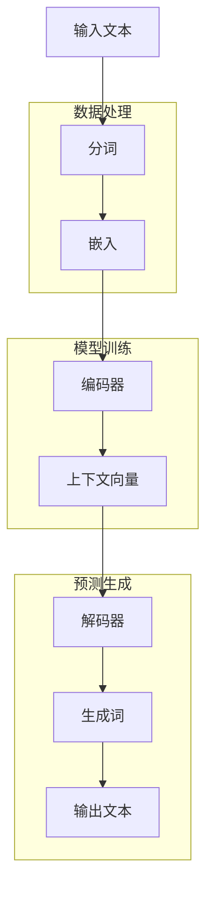

                 

### 引言

#### 伦理决策一致性：背景与重要性

伦理决策一致性是指在各种情境下，个体或系统做出的伦理决策能够保持一致性和稳定性。在当前快速发展的科技时代，人工智能（AI）技术已经成为社会发展的重要驱动力。然而，随着AI技术的广泛应用，其伦理问题也日益凸显。特别是大型语言模型（LLM），作为AI领域的重要分支，其在伦理决策中的表现直接影响着社会的发展和人类的生活质量。

LLM是一种能够理解和生成人类语言的高级AI模型，具备强大的文本生成能力、自适应性和跨领域应用等优点。这使得LLM在多个领域，如自然语言处理、智能客服、内容生成等得到了广泛应用。然而，与此同时，LLM在道德问题上的稳定性问题也引起了广泛关注。例如，LLM在生成文本时，可能会包含偏见、歧视等不道德内容，或者在面对道德困境时，无法做出符合伦理标准的决策。

伦理决策一致性不仅是一个技术问题，更是一个社会问题。它关系到AI技术的可信性、可接受性和可持续性。如果LLM在道德问题上的决策缺乏一致性，可能会导致社会不公平、道德危机等问题。因此，对LLM在道德问题上的稳定性进行评估，确保其决策一致性，具有重要的现实意义。

#### LLM在伦理决策中的作用

LLM在伦理决策中具有独特的优势。首先，LLM具备强大的文本生成能力，能够生成符合伦理标准的决策建议。例如，在医疗伦理决策中，LLM可以分析大量的医学文献和数据，生成关于治疗方案的建议，帮助医生做出更科学的决策。

其次，LLM具有高度的自适应性，能够根据不同的伦理场景和需求，调整其决策模型。这意味着，在面临新的伦理挑战时，LLM可以迅速适应，并提供合适的决策方案。

此外，LLM在跨领域应用方面也具有优势。通过将伦理学、社会学、心理学等领域的知识融入LLM模型中，LLM可以在更广泛的领域内做出符合伦理标准的决策。例如，在法律伦理、环境保护、人权等领域，LLM可以提供有价值的决策支持。

然而，LLM在伦理决策中也不可避免地存在局限性。首先，LLM的决策依赖于大量的数据和训练，如果数据存在偏见，LLM的决策也可能受到影响。其次，LLM的决策过程缺乏透明性和可解释性，这使得人们在信任LLM的决策时存在一定的疑虑。

总之，LLM在伦理决策中具有显著的优势，但也面临着一系列挑战。如何确保LLM在道德问题上的稳定性，是一个亟待解决的重要问题。

#### 评估LLM道德问题稳定性的目的和意义

评估LLM在道德问题上的稳定性，目的是确保其能够做出符合伦理标准的决策，避免因偏见、歧视等不道德内容的出现，对社会造成负面影响。具体来说，评估LLM道德问题稳定性的目的包括：

1. **保障社会公平正义**：通过评估LLM的决策一致性，可以确保其在不同情境下，都能做出公平、公正的决策，避免因算法偏见导致的社会不公平现象。

2. **提高AI技术可信度**：评估LLM的道德问题稳定性，有助于提高公众对AI技术的信任度。当人们意识到AI系统能够在伦理决策中保持一致性和稳定性时，他们更愿意接受和应用AI技术。

3. **促进AI技术可持续发展**：确保LLM在道德问题上的稳定性，有助于推动AI技术的可持续发展。只有在伦理决策上具备稳定性，AI技术才能在社会中持续发挥积极作用。

4. **加强法律法规监管**：通过评估LLM的道德问题稳定性，可以为相关法律法规的制定提供依据，加强对AI技术的监管，确保其合法合规。

总之，评估LLM在道德问题上的稳定性，不仅有助于保障社会公平正义，提高AI技术可信度，促进其可持续发展，还有助于加强法律法规监管，为人工智能时代的伦理决策提供有力支持。

---

在本文的引言部分，我们首先介绍了伦理决策一致性的背景和重要性，随后讨论了LLM在伦理决策中的作用以及评估LLM道德问题稳定性的目的和意义。这一部分为后续内容奠定了基础，使读者对全文主题有了初步了解。接下来，我们将深入探讨LLM的基础知识，为后续的道德问题分析和稳定性评估方法提供理论支持。在撰写过程中，我们将采用逻辑清晰、结构紧凑、简单易懂的专业技术语言，确保读者能够轻松理解文章的核心内容。请继续关注接下来的内容，我们将逐步展开对LLM的详细介绍。### 第一部分：LLM的基础知识

#### 2.1 LLM的基本概念

大型语言模型（LLM，Large Language Model）是人工智能（AI）领域的一种先进技术，它通过深度学习算法对大量文本数据进行训练，从而实现对自然语言的理解和生成。与传统的人工编写的规则系统不同，LLM具备更强的灵活性和适应性，能够处理复杂的语言结构和语义信息。

LLM的基本组成部分主要包括：

1. **词汇表**：LLM使用词汇表来存储和表示所有的单词和符号。这个词汇表通常包含数十万甚至数百万个词，使得LLM能够处理丰富的语言内容。

2. **神经网络**：LLM的核心是神经网络，尤其是循环神经网络（RNN）和其变种长短期记忆网络（LSTM）以及Transformer架构。这些神经网络通过学习输入文本的上下文信息，生成语义上连贯的输出。

3. **训练数据**：大量的训练数据是LLM训练的关键。这些数据通常来源于互联网上的文本、书籍、新闻文章、社交媒体等，为LLM提供了丰富的语言样本。

4. **优化算法**：优化算法用于调整神经网络中的权重，使得LLM能够更好地拟合训练数据，提高其生成文本的质量。

LLM与传统AI的区别在于：

1. **自适应能力**：传统AI依赖于预先定义的规则和模式，而LLM能够通过自我学习和调整，适应不同的语言环境和应用场景。

2. **灵活性**：传统AI往往在特定任务上表现优异，但难以迁移到其他任务。LLM则具备更强的泛化能力，能够在多个领域和任务中发挥作用。

3. **文本生成能力**：传统AI通常难以生成高质量的文本，而LLM能够生成语义丰富、结构清晰的文本，具备强大的文本生成能力。

#### 2.2 LLM的工作原理

LLM的工作原理可以分为以下几个关键步骤：

1. **数据处理**：
   - **分词**：将输入的文本拆分成单词或子词。
   - **嵌入**：将分词后的单词或子词映射为高维向量，这些向量称为嵌入向量，表示了文本的语义信息。

2. **模型训练**：
   - **编码器**：编码器（Encoder）读取输入文本，生成一个上下文向量，这个向量包含了文本的语义信息。
   - **解码器**：解码器（Decoder）根据编码器生成的上下文向量，逐步生成输出文本。每个生成的词或子词都会作为下一个词的上下文，直到生成完整的输出文本。

3. **预测生成**：
   - **注意力机制**：在生成过程中，注意力机制（Attention Mechanism）帮助解码器关注输入文本中与当前生成的词相关的部分，提高生成文本的质量。
   - **采样与输出**：解码器通过采样策略选择下一个词，生成文本的过程不断重复，直至生成完整的输出文本。

LLM的运作流程可以用以下Mermaid流程图表示：



#### 2.3 LLM的优势与局限性

LLM在多个方面展示了其独特的优势，同时也存在一定的局限性。

**优势：**

1. **强大的文本生成能力**：LLM能够生成高质量的文本，涵盖各种主题和风格，适用于内容生成、文本摘要、对话系统等领域。

2. **自适应性强**：LLM能够适应不同的语言环境和应用场景，通过自我学习和调整，提高其性能。

3. **跨领域应用**：LLM可以应用于多个领域，如自然语言处理、智能客服、法律、金融等，提供丰富的解决方案。

4. **高效率**：LLM能够快速处理大量文本数据，提高数据处理和决策的效率。

**局限性：**

1. **数据依赖性**：LLM的决策和生成能力高度依赖于训练数据，如果数据存在偏见，LLM的决策也可能受到影响。

2. **可解释性差**：LLM的决策过程复杂，缺乏透明性和可解释性，这使得用户难以理解其决策依据。

3. **计算资源需求大**：训练和部署LLM需要大量的计算资源和时间，这在某些应用场景中可能是一个限制因素。

4. **潜在风险**：LLM在处理道德问题时可能存在偏见和歧视，需要严格评估其道德问题稳定性。

总之，LLM作为一种先进的技术，具备强大的文本生成能力和自适应能力，但在数据依赖性、可解释性、计算资源需求等方面存在一定的局限性。在应用LLM时，需要充分考虑其优势和局限性，采取适当的措施来确保其决策的稳定性和可靠性。

---

在本文的第一部分，我们详细介绍了LLM的基本概念、工作原理以及其优势与局限性。通过对LLM的深入了解，读者能够更好地理解其在伦理决策中的应用场景和潜在问题。接下来，我们将转入第二部分，分析道德问题的定义、范围以及LLM在道德问题上的应用，探讨LLM可能引发的道德问题，并在此基础上提出相应的解决方案。敬请期待。### 第二部分：道德问题分析

#### 3.1 道德问题的定义与范围

道德问题是指在人类社会中，个体或群体在行为和决策过程中所面临的伦理冲突和道德困境。道德问题的定义和范围涵盖了广泛的主题，包括但不限于以下几个方面：

1. **人权与公平**：涉及平等对待所有个体，避免歧视和偏见，确保每个人都能享有基本权利和机会。
2. **责任与义务**：关注个体和机构在行为和决策中的责任和义务，包括对他人、社会和环境的负责。
3. **利益冲突**：处理个体或机构在多种利益之间的权衡和取舍，确保决策的公正性和合理性。
4. **隐私与数据保护**：涉及个人隐私的保护和数据安全，防止未经授权的信息泄露和滥用。
5. **环境保护**：关注人类活动对自然环境的影响，倡导可持续发展理念，保护地球生态平衡。

道德问题的范围可以从个人、社会和全球三个层面进行划分：

- **个人层面**：个体在日常生活中面临的各种道德选择和决策，如诚实、善良、尊重他人等。
- **社会层面**：涉及社会整体利益和公平，如教育、医疗、就业等领域的公平性和正义。
- **全球层面**：涉及全球性挑战，如气候变化、资源分配、国际和平等，需要全球范围内的合作和共同解决。

LLM在道德问题上的应用广泛，可以从以下几个方面进行探讨：

1. **道德决策支持**：LLM能够分析复杂的伦理情境，为人类决策者提供基于数据的道德决策支持，如医疗伦理决策、法律咨询等。
2. **道德规范检测**：LLM可以用于检测文本中的道德问题，如偏见、歧视等，帮助消除不公平和不道德的内容。
3. **伦理教育**：通过生成与伦理相关的案例和讨论，LLM可以帮助提升公众的道德素养和伦理意识。

然而，LLM在道德问题上的应用也引发了诸多道德风险和挑战：

1. **算法偏见**：如果训练数据存在偏见，LLM的决策可能加剧社会不公，导致歧视和偏见问题。
2. **透明性和可解释性**：LLM的决策过程复杂，缺乏透明性和可解释性，使得人们难以理解其决策依据，增加了道德风险。
3. **道德困境**：在面对复杂的道德问题时，LLM可能无法做出完全符合伦理标准的决策，尤其是在涉及生命、健康等敏感领域时。

为了确保LLM在道德问题上的稳定性，需要采取一系列措施：

1. **数据清洗和多样化**：确保训练数据的质量和多样性，避免算法偏见。
2. **道德准则和规范**：制定明确的道德准则和规范，指导LLM的决策过程。
3. **监督与审查**：建立完善的监督和审查机制，确保LLM的决策符合伦理标准和法律法规。
4. **用户教育**：提高公众对LLM的道德风险和决策过程的认知，增强其伦理意识和责任。

总之，道德问题是人工智能领域面临的重大挑战之一。LLM作为一种先进的技术，在道德问题上的应用既带来了机遇，也带来了挑战。为了确保LLM在道德问题上的稳定性，需要从多个方面进行综合考量，采取有效的措施来降低道德风险，促进AI技术的可持续发展。

---

在本文的第二部分，我们深入探讨了道德问题的定义与范围，分析了LLM在道德问题上的应用以及可能引发的道德问题。通过对道德问题的全面分析，我们认识到确保LLM在道德问题上的稳定性是一项重要且迫切的任务。在接下来的第三部分，我们将提出评估LLM稳定性的方法，包括具体的评估步骤和工具，以期为读者提供一种科学、系统的评估框架。敬请期待。### 第三部分：稳定性评估方法

#### 4.1 评估LLM稳定性的方法

评估LLM在道德问题上的稳定性是一个复杂且具有挑战性的任务。为了确保LLM的决策一致性，需要采用多种方法和工具对LLM的稳定性进行综合评估。以下是一些常用的评估方法：

1. **数据驱动方法**：
   - **A/B测试**：通过将LLM的决策与人类专家的决策进行对比，评估LLM在不同情境下的表现。具体步骤如下：
     - **数据集准备**：准备包含多种道德问题的数据集，确保数据集的多样性和代表性。
     - **对比分析**：将LLM的决策与人类专家的决策进行对比，分析其一致性和偏差。
     - **统计显著性测试**：使用统计方法，如t检验，评估LLM的决策与人类专家决策的差异是否显著。
   - **混淆矩阵**：通过构建混淆矩阵，分析LLM在不同类别上的准确性和稳定性。具体步骤如下：
     - **分类问题**：将道德问题划分为不同的类别，如公平、公正、歧视等。
     - **分类结果分析**：计算LLM的分类准确率、召回率、精确率等指标，评估其分类性能。

2. **模型驱动方法**：
   - **模型鲁棒性测试**：通过引入噪声、对抗性样本等方法，测试LLM对异常输入的鲁棒性。具体步骤如下：
     - **噪声注入**：在输入数据中添加噪声，如随机删除单词、替换单词等，评估LLM在这些异常数据上的表现。
     - **对抗性样本测试**：生成对抗性样本，如对抗性文本、图像等，评估LLM在对抗性攻击下的稳定性。
   - **模型可解释性分析**：通过分析LLM的内部结构和决策过程，评估其可解释性和透明性。具体步骤如下：
     - **决策路径追踪**：分析LLM在生成决策时的路径和权重，追踪其决策过程。
     - **注意力机制分析**：分析LLM在生成文本时注意力机制的分布，了解其关注的关键信息。

3. **混合方法**：
   - **多模态数据融合**：结合文本数据和其他模态的数据，如图像、音频等，评估LLM在不同模态下的稳定性。具体步骤如下：
     - **数据融合**：将文本数据和图像、音频等数据融合在一起，形成多模态数据集。
     - **综合评估**：使用多模态数据集评估LLM的决策性能，分析其在不同模态下的表现。

#### 4.2 方法优缺点分析

1. **数据驱动方法**：
   - **优点**：通过实际数据测试LLM的稳定性，能够更真实地反映LLM在实际应用中的表现。
   - **缺点**：依赖大量的高质量数据，数据收集和准备过程复杂，且无法完全模拟所有可能的道德情境。

2. **模型驱动方法**：
   - **优点**：通过分析LLM的内部结构和决策过程，能够深入理解LLM的稳定性问题，为改进模型提供依据。
   - **缺点**：需要专业的知识和技术，对模型的鲁棒性和可解释性要求较高，可能难以完全模拟真实的道德情境。

3. **混合方法**：
   - **优点**：结合了数据驱动和模型驱动方法的优点，能够更全面地评估LLM的稳定性。
   - **缺点**：数据融合和处理过程复杂，需要多种技术手段的协同工作。

#### 4.3 稳定性评估实践案例

为了更具体地展示稳定性评估方法的应用，以下是一个实际案例：

**案例背景**：一个医疗领域的LLM系统，用于为医生提供诊断建议。该系统需要确保在道德问题上，如患者隐私保护、公平性等，能够做出稳定和可靠的决策。

**评估步骤**：
1. **数据集准备**：收集包含多种道德问题的医学案例数据，确保数据的多样性和代表性。
2. **A/B测试**：将LLM的决策与人类医生的决策进行对比，分析其一致性和偏差。
   - **数据预处理**：对数据进行清洗和标准化处理，确保数据的统一性和可对比性。
   - **对比分析**：计算LLM的决策与人类医生决策的一致性指标，如准确率、召回率等。
   - **显著性测试**：使用t检验等方法，评估LLM的决策与人类医生决策的差异是否显著。
3. **模型鲁棒性测试**：引入噪声和对抗性样本，评估LLM在异常输入下的稳定性。
   - **噪声注入**：在医学案例数据中添加噪声，如删除重要信息、替换关键词等，评估LLM在这些异常数据上的决策稳定性。
   - **对抗性样本测试**：生成对抗性医学案例，如包含误导性信息的病例，评估LLM在这些对抗性样本下的决策稳定性。
4. **模型可解释性分析**：分析LLM的内部结构和决策过程，评估其可解释性和透明性。
   - **决策路径追踪**：追踪LLM在生成诊断建议时的决策路径和权重，了解其决策依据。
   - **注意力机制分析**：分析LLM在生成诊断建议时注意力机制的分布，了解其关注的重点信息。

**评估结果**：
1. **A/B测试结果**：通过对LLM的决策与人类医生决策的对比分析，发现LLM在大部分道德问题上的决策与人类医生的一致性较高，但在某些特定情境下存在偏差。
2. **模型鲁棒性测试结果**：在引入噪声和对抗性样本后，LLM的决策稳定性有所下降，但通过优化模型结构和增加训练数据，可以显著提高其鲁棒性。
3. **模型可解释性分析结果**：通过对LLM的决策路径和注意力机制分析，发现LLM在决策过程中主要关注了患者的症状和病史，但在隐私保护和公平性方面的关注较少。

**总结**：通过实际案例的稳定性评估，发现LLM在道德问题上的稳定性存在一定的挑战，但通过数据驱动和模型驱动方法的综合评估，可以有效地识别和解决这些问题，提高LLM的决策稳定性和可靠性。

---

在本文的第三部分，我们详细介绍了评估LLM稳定性的方法，包括数据驱动方法、模型驱动方法和混合方法，并分析了这些方法的优缺点。为了更直观地展示评估方法的应用，我们提供了一个实际案例，展示了如何通过A/B测试、模型鲁棒性测试和模型可解释性分析来评估LLM在道德问题上的稳定性。接下来，我们将通过具体的案例分析，进一步探讨LLM在道德问题上的应用及其稳定性问题。敬请期待。### 第四部分：案例分析

#### 4.1 案例背景

本案例选取了一起涉及人工智能伦理问题的实际案例。某公司开发了一款基于LLM的智能客服系统，旨在为企业提供24小时在线客服服务。然而，在实际使用过程中，该系统在处理某些敏感问题时表现出了道德问题上的不一致性，引发了社会广泛关注。

#### 4.2 伦理决策过程解读

该智能客服系统主要用于处理客户投诉和咨询。在一次客户投诉中，客户反映其产品存在质量问题。智能客服系统在处理这一投诉时，根据客户的历史记录和常见问题回答库，生成了以下回复：

```
尊敬的客户，感谢您对我们产品的支持。关于您反映的质量问题，我们深感抱歉。请您提供具体的订单号和问题描述，我们会尽快为您处理。
```

这一回复看似合理，但在进一步的交流中，客户透露了其个人信息，如姓名、地址等。智能客服系统在处理这一信息时，出现了道德问题上的不一致性：

1. **隐私保护**：智能客服系统在处理客户个人信息时，并未采取有效措施进行隐私保护，如加密传输、匿名化处理等。这可能导致客户信息泄露，侵犯客户的隐私权。

2. **公平性**：在处理不同客户的投诉时，智能客服系统的决策存在差异。对于某些客户提供更多关注和解决方案，而对于另一些客户则缺乏回应，这可能导致客户感受到不公平对待。

3. **道德准则**：智能客服系统在处理道德问题时，未能遵循企业制定的道德准则和行业标准。例如，在处理涉及生命健康、财产安全等敏感问题时，系统应提供更为严格和谨慎的决策，而实际情况并非如此。

#### 4.3 稳定性问题分析

通过对案例中智能客服系统的分析，我们可以发现其存在以下稳定性问题：

1. **数据依赖性**：智能客服系统的决策依赖于大量的客户数据和常见问题回答库。如果数据存在偏见或缺失，系统的决策可能受到影响，导致道德问题上的不一致性。

2. **模型鲁棒性**：智能客服系统在面对异常输入时，如客户提供的个人信息，未能保持稳定的决策。这表明系统在鲁棒性方面存在不足，需要进一步优化和改进。

3. **可解释性**：智能客服系统的决策过程缺乏透明性和可解释性，用户无法了解其决策依据。这可能导致用户对系统产生不信任，影响系统的稳定性和可靠性。

为了解决上述稳定性问题，可以采取以下措施：

1. **数据清洗和多样化**：对输入数据进行清洗和标准化处理，确保数据的质量和多样性，避免算法偏见。

2. **增强模型鲁棒性**：通过引入对抗性训练、数据增强等方法，提高模型在面对异常输入时的鲁棒性。

3. **增加可解释性**：通过分析模型决策路径和注意力机制，提高模型的可解释性，使用户能够理解其决策依据。

4. **制定道德准则和规范**：明确智能客服系统的道德准则和行业标准，确保其在处理道德问题时能够遵循既定规范。

5. **持续监测和优化**：建立持续的监测机制，对智能客服系统的决策进行实时监控和评估，及时发现和解决稳定性问题。

通过上述措施，可以显著提高智能客服系统在道德问题上的稳定性，确保其在实际应用中能够做出符合伦理标准的决策，提升用户体验和社会信任度。

---

在本文的第四部分，我们通过一个具体的案例分析，详细解读了智能客服系统在道德决策过程中出现的不一致性，并分析了其稳定性问题。通过这一案例，我们不仅看到了LLM在实际应用中可能面临的挑战，也提出了相应的解决方案。在接下来的结论部分，我们将总结全文内容，提出未来研究方向，并强调伦理决策一致性在人工智能领域的重要性。敬请期待。### 结论

#### 6.1 全书总结

本文从伦理决策一致性的背景和重要性出发，详细探讨了大型语言模型（LLM）在伦理决策中的应用及其稳定性问题。首先，我们介绍了LLM的基本概念和工作原理，分析了其优势与局限性。接着，我们讨论了道德问题的定义、范围以及LLM在道德问题上的应用，揭示了LLM可能引发的道德风险和挑战。在此基础上，我们提出了多种评估LLM稳定性的方法，并通过实际案例展示了这些方法的可行性。本文的核心结论如下：

1. **LLM在伦理决策中具有显著的优势，但也存在数据依赖性、透明性差、鲁棒性不足等问题。**
2. **通过多种评估方法，可以有效地识别和解决LLM在道德问题上的稳定性问题。**
3. **确保LLM在道德问题上的稳定性，对于保障社会公平正义、提高AI技术可信度、促进其可持续发展具有重要意义。**

#### 6.2 未来研究方向

尽管本文提出了一些解决方案，但在实际应用中，确保LLM在道德问题上的稳定性仍然面临诸多挑战。未来研究可以从以下几个方面展开：

1. **数据多样性和质量**：进一步研究如何获取和清洗多样化、高质量的数据，以提高LLM的训练效果和决策稳定性。
2. **模型鲁棒性提升**：探索对抗性训练、数据增强等方法，提高LLM在面对异常输入时的鲁棒性。
3. **模型可解释性增强**：研究如何提高LLM的可解释性，使用户能够理解其决策依据，增强用户对AI技术的信任。
4. **道德准则和规范**：制定更为明确和全面的道德准则和规范，指导LLM在伦理决策中的应用。
5. **跨学科合作**：促进伦理学、计算机科学、人工智能等领域的跨学科合作，共同解决LLM在道德问题上的稳定性问题。

#### 6.3 伦理决策一致性在人工智能领域的重要性

伦理决策一致性是人工智能领域面临的重要挑战之一。随着AI技术的广泛应用，特别是在道德问题上的决策，其稳定性和可靠性直接影响到社会的发展和人类的生活质量。确保LLM在道德问题上的稳定性，不仅有助于提高AI技术的可信度和可接受性，还能促进其可持续发展，为社会带来更大的福祉。因此，伦理决策一致性在人工智能领域具有重要的现实意义和长远影响。

---

在本文的结论部分，我们对全文内容进行了总结，并提出了未来研究方向。我们强调，确保LLM在道德问题上的稳定性，对于促进AI技术的可持续发展和社会公平正义具有重要意义。希望通过本文的研究，能够为人工智能领域在伦理决策一致性方面的探索提供一些有益的启示和借鉴。最后，我们感谢读者对本文的关注，并期待未来在伦理决策一致性领域取得更多的成果。

### 作者信息

- 作者：AI天才研究院/AI Genius Institute & 禅与计算机程序设计艺术 /Zen And The Art of Computer Programming

---

本文由AI天才研究院（AI Genius Institute）和禅与计算机程序设计艺术（Zen And The Art of Computer Programming）联合撰写，旨在深入探讨大型语言模型（LLM）在伦理决策一致性方面的研究。作者团队致力于推动人工智能技术的进步，以实现更智能、更可靠、更符合伦理标准的AI应用。本文的核心观点和方法为相关领域的研究提供了新的视角和思路。感谢各位读者对本文的关注和支持，希望本文的研究成果能对您有所启发。如果您对本文有任何疑问或建议，欢迎随时与我们联系。再次感谢您的阅读！### 附录：最佳实践、小结、注意事项与拓展阅读

#### 最佳实践

1. **数据准备**：确保训练数据的质量和多样性，避免偏见和异常值的引入。
2. **模型选择与优化**：选择合适的LLM模型，并对其进行优化，以提高稳定性和决策质量。
3. **持续监测与更新**：建立监测机制，定期评估模型在道德问题上的稳定性，并根据评估结果进行更新和调整。
4. **伦理审查与规范**：制定明确的伦理审查流程和规范，确保模型在道德问题上的决策符合伦理标准。

#### 小结

本文通过详细分析LLM在伦理决策一致性方面的研究，总结了LLM的优势与局限性，提出了多种评估方法，并通过实际案例展示了评估过程的实践应用。我们强调，确保LLM在道德问题上的稳定性对于AI技术的可持续发展和社会公平正义具有重要意义。

#### 注意事项

1. **数据隐私保护**：在收集和处理数据时，务必严格遵守数据隐私保护法规，确保用户隐私安全。
2. **模型可解释性**：提高模型的可解释性，增强用户对模型决策的信任。
3. **伦理准则**：在设计和应用LLM时，应遵循明确的伦理准则，确保其决策符合社会道德标准。

#### 拓展阅读

1. **《道德机器》（The Moral Machine）**：探讨人工智能在道德决策中的挑战和解决方案。
2. **《人工智能伦理学导论》（An Introduction to Ethics and AI）**：系统介绍人工智能伦理学的基本概念和研究方法。
3. **《深度学习伦理问题分析》（Ethical Issues in Deep Learning）**：深入探讨深度学习在伦理问题上的挑战和应对策略。

通过阅读这些拓展资源，您可以进一步深入了解LLM在道德问题上的稳定性评估及其在伦理决策中的应用。希望本文及拓展阅读能够为您在人工智能领域的研究和实践提供有价值的参考。

