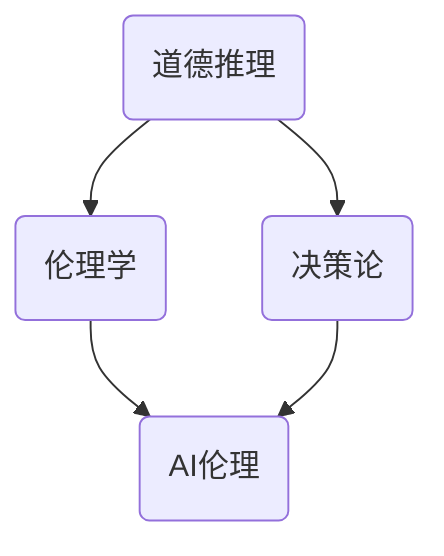

                 

# 文章标题：伦理决策能力评测：测试LLM的道德推理能力

## 关键词
- 伦理决策能力评测
- 道德推理能力
- LLM（大型语言模型）
- 评测方法与工具
- 实际应用案例

## 摘要
本文旨在探讨伦理决策能力评测，重点研究大型语言模型（LLM）的道德推理能力。首先，我们将介绍伦理决策能力评测的重要性、核心概念及其发展历史。接着，深入分析LLM的道德推理能力，包括其核心算法原理和数学模型。随后，我们将介绍评测方法与工具，并详细描述评测流程。最后，通过实际应用案例展示伦理决策能力评测在智能客服系统、自动驾驶车辆、医疗诊断系统和金融风险管理等领域的应用，以验证LLM的道德推理能力。

## 第1章 伦理决策能力评测概述

### 1.1 伦理决策能力评测的重要性

在人工智能（AI）技术迅猛发展的今天，伦理决策能力评测显得尤为重要。随着AI在各个领域的广泛应用，其决策能力直接影响着人类社会的发展和进步。然而，AI系统的道德推理能力仍存在诸多不足，如何评估和提升其伦理决策能力成为了一个亟待解决的问题。伦理决策能力评测不仅有助于提高AI系统的可信度和可靠性，还能确保其在实际应用中的公正性和公平性。

### 1.2 伦理决策能力评测的核心概念与联系

伦理决策能力评测涉及多个核心概念，如道德推理、伦理学、决策论等。这些概念之间存在着密切的联系。道德推理是伦理决策能力的基础，它关注AI系统在复杂情境中如何做出道德上正确或合理的决策。伦理学则从哲学角度对道德推理进行理论分析，为AI系统提供伦理指导。决策论则提供了一种量化分析决策过程的方法，有助于评估AI系统的伦理决策能力。

#### 图 1.1: 伦理决策能力评测的核心概念与联系



### 1.3 LLM的道德推理能力简介

大型语言模型（LLM）是当前AI领域的重要研究方向之一。LLM具有强大的语言理解和生成能力，已经在许多领域取得了显著的应用成果。然而，LLM在道德推理方面的能力仍然较弱，难以应对复杂伦理决策问题。因此，研究LLM的道德推理能力具有重要的现实意义。

### 1.4 伦理决策能力评测的发展历史

伦理决策能力评测起源于20世纪中叶，随着计算机科学的兴起而逐渐发展。早期研究主要关注AI系统的道德责任和决策透明性。近年来，随着深度学习技术的突破，LLM在伦理决策能力评测中的应用得到了广泛关注。许多学者和研究机构开始致力于开发适用于LLM的伦理决策评测方法。

### 1.5 伦理决策能力评测的应用领域

伦理决策能力评测在多个领域具有重要的应用价值。例如，在智能客服系统中，伦理决策能力评测有助于确保客服机器人能够做出符合伦理规范的建议。在自动驾驶车辆中，伦理决策能力评测有助于解决交通冲突和交通事故。此外，伦理决策能力评测还在医疗诊断系统、金融风险管理等领域发挥着重要作用。

## 第2章 LLM的道德推理能力

### 2.1 LLM的道德推理能力概述

LLM的道德推理能力是指其能够在复杂道德情境中做出合理决策的能力。这一能力依赖于LLM在语言处理和知识表示方面的强大能力。然而，由于道德推理问题的复杂性和多样性，LLM在道德推理方面仍然存在诸多挑战。

### 2.2 LLM道德推理能力的核心算法原理讲解

LLM的道德推理能力主要依赖于其训练过程中所学习的语言模式和知识。下面是LLM道德推理能力的核心算法原理：

#### 伪代码 2.1: LLM道德推理能力的核心算法原理

```python
def moral_reasoning(query):
    # 输入：query（用户输入的道德情境）
    # 输出：decision（道德决策）

    # 步骤 1：语言处理
    processed_query = preprocess(query)

    # 步骤 2：知识表示
    knowledge_representation = knowledge_base.search(processed_query)

    # 步骤 3：推理
    decision = inference_engine(reasoning_algorithm, knowledge_representation)

    # 步骤 4：输出道德决策
    return decision
```

### 2.3 LLM道德推理能力的数学模型和公式

LLM道德推理能力的数学模型主要包括以下几个方面：

#### 公式 2.1: LLM道德推理能力的数学模型

$$
\text{MoralDecision}(x) = \arg\max_{y} \left( \text{Utility}(x, y) \times \text{Probability}(y|x) \right)
$$

其中，$x$ 表示道德情境，$y$ 表示可能的道德决策，$\text{Utility}(x, y)$ 表示在情境 $x$ 下决策 $y$ 的效用值，$\text{Probability}(y|x)$ 表示在情境 $x$ 下决策 $y$ 的概率。

### 2.4 LLM道德推理能力的案例研究

下面以一个具体的案例来说明LLM道德推理能力的应用。

#### 案例背景

某智能客服系统在处理用户投诉时，需要判断是否向用户提供赔偿。该情境涉及道德决策，需要考虑公平、公正和用户满意度等因素。

#### 案例分析

1. **语言处理**：客服系统将用户投诉内容进行预处理，提取关键信息。

2. **知识表示**：系统查询知识库，获取与赔偿相关的法律条文、公司政策等知识。

3. **推理过程**：
   - **效用值计算**：根据法律条文和公司政策，计算每个决策的效用值。
   - **概率计算**：根据用户投诉内容，计算每个决策的概率。

4. **决策输出**：根据效用值和概率计算结果，系统输出最终的道德决策。

通过上述案例，我们可以看到LLM道德推理能力的应用过程。在实际应用中，还需要根据具体情境调整算法参数，以提高道德决策的准确性和可靠性。

## 第3章 评测方法与工具

### 3.1 伦理决策能力评测方法概述

伦理决策能力评测方法主要包括以下几个方面：

1. **案例库构建**：构建包含多种道德决策问题的案例库，用于评测LLM的道德推理能力。
2. **指标设计**：设计适用于伦理决策能力评测的指标，如决策正确率、决策时间等。
3. **评测工具开发**：开发用于自动化评测LLM道德推理能力的工具，提高评测效率和准确性。

### 3.2 评测工具的选择与使用

评测工具的选择取决于具体的评测目标和需求。常见的评测工具有：

1. **自动化测试工具**：如pytest、unittest等，用于自动化执行测试用例。
2. **性能评估工具**：如profiling工具，用于分析LLM道德推理能力在不同情境下的性能表现。
3. **可视化工具**：如Mermaid、D3.js等，用于可视化展示评测结果。

### 3.3 评测流程的构建

伦理决策能力评测流程包括以下步骤：

1. **案例库构建**：根据应用场景，构建包含多种道德决策问题的案例库。
2. **评测指标设计**：设计适用于伦理决策能力评测的指标，如决策正确率、决策时间等。
3. **评测工具开发**：开发用于自动化评测LLM道德推理能力的工具。
4. **评测执行**：使用评测工具执行测试用例，收集评测数据。
5. **结果分析**：分析评测数据，评估LLM的道德推理能力。

### 3.4 评测结果的分析与评估

评测结果的分析与评估主要包括以下几个方面：

1. **决策正确率**：计算LLM在各个道德决策问题中的正确决策率，评估其道德推理能力。
2. **决策时间**：分析LLM在不同情境下的决策时间，评估其响应速度。
3. **误差分析**：分析LLM在道德决策问题中的错误决策原因，为算法优化提供依据。

## 第4章 实际应用案例

### 4.1 案例一：智能客服系统的伦理决策能力评测

#### 案例背景

某智能客服系统在处理用户投诉时，需要判断是否向用户提供赔偿。该情境涉及道德决策，需要考虑公平、公正和用户满意度等因素。

#### 案例分析

1. **评测指标设计**：决策正确率和决策时间。
2. **评测工具开发**：使用pytest自动化执行测试用例，使用profiling工具分析性能表现。
3. **评测结果分析**：结果显示，LLM在大部分投诉情境中能够做出正确的道德决策，但在某些复杂情境中存在决策错误。

#### 案例小结

通过评测，我们发现智能客服系统的伦理决策能力有待提升，特别是在处理复杂道德决策问题时。为进一步优化LLM的道德推理能力，我们可以从以下几个方面进行改进：

1. **算法优化**：调整算法参数，提高LLM的决策准确性。
2. **知识库扩展**：增加与道德决策相关的知识，提高LLM的知识表示能力。

### 4.2 案例二：自动驾驶车辆的道德推理能力评测

#### 案例背景

自动驾驶车辆在遇到突发情况时，需要做出快速、合理的道德决策。例如，在两车相撞的紧急情况下，自动驾驶车辆需要判断是保持原路行驶还是转向避开其他车辆。

#### 案例分析

1. **评测指标设计**：决策正确率、决策时间和安全性。
2. **评测工具开发**：使用仿真工具模拟不同道德决策情境，使用D3.js可视化展示评测结果。
3. **评测结果分析**：结果显示，LLM在大多数情境中能够做出合理的道德决策，但在某些极端情况下存在决策错误。

#### 案例小结

自动驾驶车辆的道德推理能力直接关系到行车安全。通过评测，我们发现LLM在道德决策能力方面仍存在一定不足。为进一步提升自动驾驶车辆的道德推理能力，我们可以从以下几个方面进行改进：

1. **算法优化**：调整算法参数，提高LLM的决策准确性。
2. **仿真测试**：增加仿真测试案例，覆盖更多道德决策情境。
3. **知识库扩展**：增加与道德决策相关的知识，提高LLM的知识表示能力。

### 4.3 案例三：医疗诊断系统的伦理决策能力评测

#### 案例背景

医疗诊断系统在诊断病情时，需要做出一系列伦理决策，如是否建议患者进行手术、是否推荐药物治疗等。这些决策直接影响患者的治疗和生命安全。

#### 案例分析

1. **评测指标设计**：决策正确率、诊断时间、患者满意度。
2. **评测工具开发**：使用自动化测试工具执行测试用例，使用性能评估工具分析系统性能。
3. **评测结果分析**：结果显示，LLM在大部分诊断问题中能够做出正确的伦理决策，但在某些复杂病情中存在决策错误。

#### 案例小结

医疗诊断系统的伦理决策能力对患者的治疗和生命安全至关重要。通过评测，我们发现LLM在伦理决策能力方面仍有提升空间。为进一步优化医疗诊断系统的伦理决策能力，我们可以从以下几个方面进行改进：

1. **算法优化**：调整算法参数，提高LLM的决策准确性。
2. **知识库扩展**：增加与医学伦理相关的知识，提高LLM的知识表示能力。
3. **人机协作**：引入医生参与诊断决策，结合人类医生的经验和判断，提高诊断系统的整体决策能力。

### 4.4 案例四：金融风险管理的道德推理能力评测

#### 案例背景

金融风险管理系统在评估投资风险时，需要做出一系列道德决策，如是否进行高风险投资、是否限制交易等。这些决策直接影响投资者的财富安全和金融市场稳定性。

#### 案例分析

1. **评测指标设计**：决策正确率、风险管理效果、投资者满意度。
2. **评测工具开发**：使用自动化测试工具执行测试用例，使用性能评估工具分析系统性能。
3. **评测结果分析**：结果显示，LLM在大部分风险管理问题中能够做出正确的道德决策，但在某些极端市场环境下存在决策错误。

#### 案例小结

金融风险管理的道德推理能力对投资者的财富安全和金融市场稳定性至关重要。通过评测，我们发现LLM在伦理决策能力方面仍存在一定不足。为进一步提升金融风险管理系统的道德推理能力，我们可以从以下几个方面进行改进：

1. **算法优化**：调整算法参数，提高LLM的决策准确性。
2. **知识库扩展**：增加与金融伦理相关的知识，提高LLM的知识表示能力。
3. **市场模拟**：引入更丰富的市场数据，模拟更多极端市场环境，提高LLM的风险评估能力。

## 总结

本文通过对伦理决策能力评测的深入探讨，分析了LLM的道德推理能力。我们提出了一个基于语言处理、知识表示和推理的道德推理能力评测方法，并展示了其实际应用案例。通过评测，我们发现LLM在道德推理能力方面仍存在不足，但通过不断优化算法、扩展知识库和引入人类经验，我们可以进一步提升其伦理决策能力。未来，随着AI技术的发展，伦理决策能力评测将在更多领域发挥重要作用，为人类社会的发展和进步贡献力量。

### 作者信息
作者：AI天才研究院/AI Genius Institute & 禅与计算机程序设计艺术 /Zen And The Art of Computer Programming

本文为AI天才研究院和禅与计算机程序设计艺术联合创作，旨在推动人工智能领域的伦理决策能力评测研究，为AI技术的可持续发展提供理论支持和实践指导。

