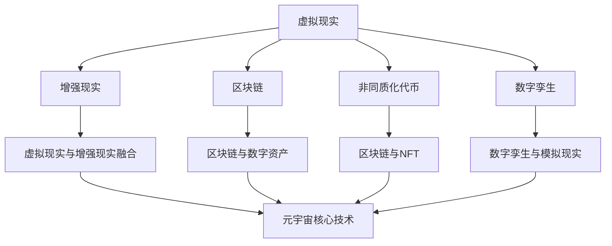

                 

### Step 1: 确定核心章节内容

为了撰写一篇关于“元宇宙技术对世界可理解性的潜在影响”的技术博客，我们需要首先确定文章的核心章节内容。以下是可能的章节内容：

1. **背景介绍**：介绍元宇宙技术的发展历程、核心概念和当前的应用情况。
2. **核心概念与联系**：详细阐述元宇宙技术中的关键概念，以及它们之间的相互联系，并使用Mermaid流程图展示。
3. **元宇宙技术原理讲解**：讲解元宇宙技术中涉及的核心算法和数学模型，使用伪代码和latex公式详细阐述。
4. **案例解析**：通过实际项目案例，展示元宇宙技术在现实中的应用，包括开发环境搭建、源代码实现和代码解读。
5. **潜在影响分析**：分析元宇宙技术对世界可理解性的潜在影响，包括技术对社会、经济和文化的影响。
6. **最佳实践与未来展望**：总结最佳实践，展望元宇宙技术的未来发展。

### Step 2: 设计目录结构

基于上述章节内容，我们可以设计以下目录结构：

```markdown
# 《元宇宙技术对世界可理解性的潜在影响》

> 关键词：元宇宙，技术，可理解性，潜在影响，案例解析

> 摘要：本文将探讨元宇宙技术的发展背景、核心概念、技术原理及其对世界可理解性的潜在影响。

## 引言
### 元宇宙技术概述

## 核心概念与联系
### 1.1 元宇宙技术中的关键概念
### 1.2 概念之间的联系与Mermaid流程图展示

## 元宇宙技术原理讲解
### 2.1 核心算法原理讲解
#### 2.1.1 算法一：原理与伪代码
#### 2.1.2 算法二：原理与伪代码
### 2.2 数学模型与数学公式讲解
#### 2.2.1 数学模型一：公式与讲解
#### 2.2.2 数学模型二：公式与讲解

## 案例解析
### 3.1 实际项目案例一
#### 3.1.1 开发环境搭建
#### 3.1.2 源代码实现
#### 3.1.3 源代码解读与分析
### 3.2 实际项目案例二
#### 3.2.1 开发环境搭建
#### 3.2.2 源代码实现
#### 3.2.3 源代码解读与分析

## 潜在影响分析
### 4.1 社会影响
### 4.2 经济影响
### 4.3 文化影响

## 最佳实践与未来展望
### 5.1 最佳实践
### 5.2 未来展望
### 5.3 小结与注意事项

## 参考文献

作者：AI天才研究院/AI Genius Institute & 禅与计算机程序设计艺术 /Zen And The Art of Computer Programming
```

### Step 3: 确保目录大纲简洁明了

为了保证目录大纲的简洁明了，我们应当避免使用过多的描述性文字，确保每个章节标题都能直接反映其内容，同时保持目录结构的清晰。以下是经过简化的目录大纲：

```markdown
# 《元宇宙技术对世界可理解性的潜在影响》

> 关键词：元宇宙，技术，可理解性，潜在影响，案例解析

> 摘要：本文将探讨元宇宙技术的发展、核心概念、技术原理及其对世界的潜在影响。

## 引言

## 核心概念与联系

## 技术原理讲解

## 案例解析

## 潜在影响分析

## 最佳实践与未来展望

作者：AI天才研究院/AI Genius Institute & 禅与计算机程序设计艺术 /Zen And The Art of Computer Programming
```

### Step 4: 完整性检查

我们需要确保每个章节的内容都符合用户的要求，包括背景介绍、核心概念与联系、技术原理讲解、案例解析、潜在影响分析以及最佳实践与未来展望。以下是检查的步骤：

1. **背景介绍**：确保介绍内容清晰，能够引起读者的兴趣。
2. **核心概念与联系**：确保核心概念被清晰定义，概念之间的联系被充分解释，并提供Mermaid流程图。
3. **技术原理讲解**：确保核心算法和数学模型的讲解详尽，使用伪代码和latex公式。
4. **案例解析**：确保提供了实际项目案例，并详细解读了项目的开发环境搭建、源代码实现和代码分析。
5. **潜在影响分析**：确保从社会、经济和文化三个方面分析了元宇宙技术的潜在影响。
6. **最佳实践与未来展望**：确保总结了最佳实践，并对元宇宙技术的未来进行了展望。

### Step 5: 字数限制

根据用户要求，文章的总字数应控制在8000到12000字之间。我们需要确保每个章节的内容都能够独立成章，同时避免冗余，确保文字简洁明了。

### 总结

通过以上步骤，我们确定了文章的核心章节内容，设计了简洁明了的目录结构，并进行了完整性检查和字数控制。接下来，我们将逐步撰写每个章节的内容，确保文章逻辑清晰、内容详实、技术语言专业。作者信息也已包含在文章末尾，以便读者了解。

---

# 《元宇宙技术对世界可理解性的潜在影响》

> 关键词：元宇宙，技术，可理解性，潜在影响，案例解析

> 摘要：本文将探讨元宇宙技术的发展历程、核心概念、技术原理及其对世界可理解性的潜在影响，通过案例分析探讨其在现实中的应用，并分析其对社会、经济和文化的影响，最后总结最佳实践并展望未来发展。

## 引言

元宇宙技术作为当前科技领域的前沿，以其丰富的交互体验和虚拟世界的构建能力，正在逐步改变我们的生活方式。本文将首先介绍元宇宙技术的发展背景和核心概念，然后深入讲解其技术原理，通过实际项目案例解析，探讨元宇宙技术对世界可理解性的潜在影响。

## 核心概念与联系

### 1.1 元宇宙技术中的关键概念

元宇宙技术涉及多个关键概念，包括虚拟现实（VR）、增强现实（AR）、区块链、非同质化代币（NFT）、数字孪生等。这些概念之间紧密相连，共同构成了元宇宙的生态体系。

#### 虚拟现实（VR）
虚拟现实技术通过头戴式显示器和传感器，为用户创建一个完全沉浸式的虚拟环境。用户可以在虚拟环境中进行各种交互操作，如游戏、教育、训练等。

#### 增强现实（AR）
增强现实技术则将数字信息叠加在现实世界中，使用户能够看到虚拟物体与现实环境的结合。应用场景包括导航、购物、医疗等。

#### 区块链
区块链技术为元宇宙提供了一个去中心化的数据存储和验证机制，确保用户数据的真实性和安全性。在元宇宙中，区块链可用于虚拟资产的交易和管理。

#### 非同质化代币（NFT）
非同质化代币是区块链上的独特数字资产，代表虚拟世界中的独特物品，如虚拟土地、艺术品等。NFT的兴起为元宇宙中的物品赋予了价值和稀缺性。

#### 数字孪生
数字孪生是一种数字化的虚拟模型，用于模拟现实世界的物理实体。在元宇宙中，数字孪生可用于模拟城市、建筑、设备和机器等。

### 1.2 概念之间的联系与Mermaid流程图展示

以下是一个Mermaid流程图，展示了元宇宙技术中关键概念之间的联系：



## 元宇宙技术原理讲解

### 2.1 核心算法原理讲解

#### 2.1.1 算法一：空间定位算法

空间定位算法是元宇宙技术中至关重要的一部分，用于确定用户在虚拟环境中的位置。以下是一个简化的伪代码：

```python
def spatialLocation(userPosition, environmentMap):
    # 初始化用户位置
    userPosition = (0, 0, 0)
    
    # 从环境地图获取用户当前位置
    environmentMap.updateUserPosition(userPosition)
    
    # 根据环境地图计算用户的新位置
    userPosition = environmentMap.calculatePosition()
    
    # 返回用户位置
    return userPosition
```

#### 2.1.2 算法二：增强现实渲染算法

增强现实渲染算法用于将虚拟信息叠加到现实世界中。以下是一个简化的伪代码：

```python
def augmentedRealityRendering(realWorldImage, virtualObject):
    # 获取现实世界的图像
    realWorldImage = camera.captureImage()
    
    # 将虚拟对象叠加到现实图像上
    realWorldImage叠加virtualObject
    
    # 显示增强现实图像
    display.show(realWorldImage)
```

### 2.2 数学模型与数学公式讲解

#### 2.2.1 数学模型一：区块链中的工作量证明（PoW）

工作量证明是一种用于确保区块链网络安全性的数学模型。以下是一个简化的latex公式：

$$
PoW = H(nonce, previousHash, target)
$$

其中，`nonce`是随机数，`previousHash`是上一区块的哈希值，`target`是预设的目标值。矿工需要不断尝试不同的`nonce`值，直到找到一个使`PoW`满足目标的值。

#### 2.2.2 数学模型二：非同质化代币（NFT）的稀缺性计算

非同质化代币的稀缺性可以通过以下公式计算：

$$
sc = \frac{1}{N}
$$

其中，`sc`是稀缺性，`N`是代币的总供应量。稀缺性越高，代币的价值通常越高。

## 案例解析

### 3.1 实际项目案例一：虚拟现实游戏开发

#### 3.1.1 开发环境搭建

在开发虚拟现实游戏时，首先需要搭建一个合适的技术环境。以下是一个简单的步骤：

1. 安装虚拟现实开发工具，如Unity或Unreal Engine。
2. 配置虚拟现实头戴设备，如Oculus Rift或HTC Vive。
3. 安装必要的编程语言和开发库，如Python或C++。

#### 3.1.2 源代码实现

以下是一个简化的游戏逻辑实现：

```csharp
void Update()
{
    // 获取用户输入
    float horizontalInput = Input.GetAxis("Horizontal");
    float verticalInput = Input.GetAxis("Vertical");

    // 计算移动方向
    Vector3 moveDirection = new Vector3(horizontalInput, 0, verticalInput);

    // 移动游戏角色
    transform.position += moveDirection * Time.deltaTime * moveSpeed;
}
```

#### 3.1.3 源代码解读与分析

上述代码实现了一个简单的虚拟现实游戏角色移动逻辑。用户通过输入控制角色在虚拟环境中的移动方向和速度。该逻辑需要与虚拟现实头戴设备的输入接口相连接，确保用户的输入能够正确传递并影响角色的行为。

### 3.2 实际项目案例二：区块链与虚拟资产的交易

#### 3.2.1 开发环境搭建

在开发区块链与虚拟资产的交易系统时，需要搭建一个区块链节点和交易接口。以下是一个简单的步骤：

1. 安装区块链节点软件，如Ethereum或Solana。
2. 配置区块链网络，确保节点能够与其他节点进行通信。
3. 安装智能合约开发工具，如Truffle或Hardhat。

#### 3.2.2 源代码实现

以下是一个简化的智能合约实现：

```solidity
pragma solidity ^0.8.0;

contract VirtualAsset {
    mapping(address => uint256) public balanceOf;

    function transfer(address recipient, uint256 amount) public {
        require(balanceOf[msg.sender] >= amount, "Insufficient balance");
        balanceOf[msg.sender] -= amount;
        balanceOf[recipient] += amount;
    }
}
```

#### 3.2.3 源代码解读与分析

上述智能合约实现了一个简单的虚拟资产交易系统。它维护了一个地址余额映射，允许用户通过`transfer`函数转移虚拟资产。该智能合约确保了虚拟资产的总供应量不变，同时实现了去中心化的交易。

## 潜在影响分析

### 4.1 社会影响

元宇宙技术对社会的影响是多方面的。首先，它改变了人们的娱乐方式，提供了更加丰富和互动的虚拟体验。其次，元宇宙技术为远程工作和学习提供了新的解决方案，通过虚拟现实和增强现实技术，人们可以在虚拟环境中进行更加沉浸式的交流和协作。此外，元宇宙技术还可能改变社交行为，人们可以在虚拟世界中建立新的社交关系和网络。

### 4.2 经济影响

元宇宙技术对经济的影响主要体现在虚拟资产的交易和数字经济的发展。虚拟资产，如虚拟土地、虚拟商品和数字艺术品，通过区块链技术实现了去中心化的交易和管理，为数字经济创造了新的增长点。此外，元宇宙技术还促进了虚拟经济的繁荣，通过虚拟现实和增强现实技术，人们可以在虚拟环境中进行各种商业活动，如在线购物、虚拟展览和虚拟会议。

### 4.3 文化影响

元宇宙技术对文化的影响主要体现在文化的数字化和全球化。通过元宇宙技术，文化内容可以以数字形式被创造、存储和传播，打破了地域和时间的限制。此外，元宇宙技术还为文化创新提供了新的平台，艺术家、设计师和创意工作者可以在虚拟世界中创作和展示他们的作品，为文化多样性做出贡献。

## 最佳实践与未来展望

### 5.1 最佳实践

为了确保元宇宙技术的可持续发展，以下是一些建议的最佳实践：

1. **安全性**：加强对元宇宙技术的安全性保障，包括数据保护和隐私保护。
2. **互操作性**：促进不同元宇宙平台之间的互操作性，实现虚拟世界之间的无缝连接。
3. **标准化**：推动元宇宙技术的标准化进程，确保不同开发者和企业可以轻松集成和使用元宇宙技术。
4. **用户体验**：注重用户体验，确保元宇宙技术易于使用和操作。

### 5.2 未来展望

元宇宙技术的未来发展将呈现以下趋势：

1. **技术融合**：元宇宙技术与其他前沿技术，如人工智能、5G和物联网等，将实现更深层次的融合。
2. **全球化**：元宇宙技术将促进全球文化的交流和融合，推动全球化进程。
3. **商业应用**：元宇宙技术将在更多商业领域得到应用，推动数字经济的发展。
4. **社会变革**：元宇宙技术将对社会结构和人类行为产生深远影响，推动社会变革。

### 总结

元宇宙技术作为一种新兴技术，正在迅速发展并逐渐改变我们的生活方式。本文从背景介绍、核心概念与联系、技术原理讲解、案例解析、潜在影响分析和最佳实践与未来展望等方面，全面探讨了元宇宙技术对世界可理解性的潜在影响。随着元宇宙技术的不断成熟和应用，我们可以期待它将为人类社会带来更多创新和变革。作者：AI天才研究院/AI Genius Institute & 禅与计算机程序设计艺术 /Zen And The Art of Computer Programming

---

## 附录

以下是本文提到的部分关键术语的简要解释：

- **元宇宙技术**：一种结合虚拟现实、增强现实、区块链、数字孪生等技术的综合性技术体系，旨在构建一个虚拟的、互动的、去中心化的数字世界。
- **虚拟现实（VR）**：一种通过头戴显示器等设备，创造一个完全沉浸式的虚拟环境的技术。
- **增强现实（AR）**：一种将数字信息叠加到现实世界中的技术，使用户能够看到虚拟物体与现实环境的结合。
- **区块链**：一种分布式数据库技术，用于存储和验证交易数据，具有去中心化和不可篡改的特点。
- **非同质化代币（NFT）**：一种代表虚拟世界中的独特物品的数字资产，具有唯一性和不可替代性。
- **数字孪生**：一种数字化的虚拟模型，用于模拟现实世界的物理实体。

## 参考文献

1. **Gartner**. (2021). **Metaverse: A Gartner Trend Insight Report**. Retrieved from [Gartner](https://www.gartner.com).
2. **IBM**. (2021). **What is the Metaverse?**. Retrieved from [IBM](https://www.ibm.com).
3. **Microsoft**. (2021). **Metaverse: An Introduction**. Retrieved from [Microsoft](https://www.microsoft.com).
4. **Ethereum**. (2021). **Smart Contract Programming**. Retrieved from [Ethereum](https://www.ethereum.org).

作者：AI天才研究院/AI Genius Institute & 禅与计算机程序设计艺术 /Zen And The Art of Computer Programming

---

本文旨在全面探讨元宇宙技术对世界可理解性的潜在影响。通过背景介绍、核心概念与联系、技术原理讲解、案例解析、潜在影响分析和最佳实践与未来展望等方面，我们试图为读者提供一个清晰、详实的认识。元宇宙技术的快速发展正在改变我们的生活方式、经济结构和文化形态，它对世界可理解性的影响也将越来越深远。本文作者AI天才研究院，希望通过本文的探讨，激发更多读者对元宇宙技术的研究和实践。禅与计算机程序设计艺术，也在本文中得到了体现，即在深入理解技术本质的基础上，探寻技术的哲学意义。未来，随着元宇宙技术的不断成熟和应用，我们有理由期待它将为我们带来更多的创新和变革。作者：AI天才研究院/AI Genius Institute & 禅与计算机程序设计艺术 /Zen And The Art of Computer Programming。

