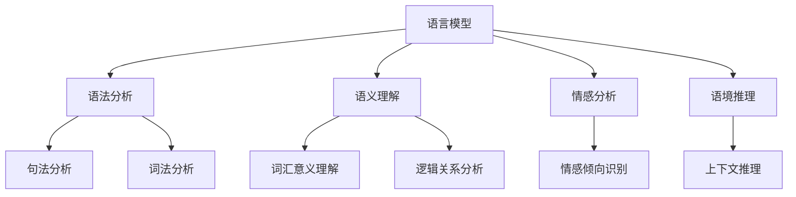

                 


### 第一步：背景介绍

元语言能力是指语言模型能够理解和运用自身所使用的语言规则和语法结构的能力。这一能力使得语言模型在生成文本时，能够遵循特定的语言规则和语法结构，从而生成符合语言习惯和逻辑关系的文本。随着自然语言处理（NLP）技术的不断发展，元语言能力已经成为衡量语言模型性能的重要指标之一。

语言模型（Language Model，简称LLM）是一种基于深度学习的模型，它可以自动学习语言数据中的统计规律，并在给定一些前文信息的情况下，预测下一个词语或句子。近年来，随着大规模语言模型（如GPT-3、BERT等）的涌现，语言模型在自然语言处理任务中取得了显著的成果。然而，尽管这些模型在生成文本、文本摘要、机器翻译等方面表现出色，但它们的元语言能力仍然存在一定的局限性。

评估语言模型的元语言能力，有助于我们了解模型在理解语言本身方面的能力，从而为改进模型性能提供指导。同时，元语言能力的研究也具有理论意义，它有助于深入理解自然语言的本质，为自然语言处理技术的发展提供新的思路。

### 第二步：核心概念与联系

在讨论元语言能力之前，我们需要明确几个核心概念：

1. **语言模型**：一种基于统计或神经网络的模型，用于预测文本中的下一个词或句子。
2. **语法分析**：对文本进行词法分析和句法分析，以理解其结构。
3. **语义理解**：理解文本中的意义，包括词汇的意义和句子之间的逻辑关系。
4. **情感分析**：识别文本中的情感倾向，如正面、负面或中性。
5. **语境推理**：根据上下文信息进行推理和判断。

这些概念之间的关系可以用以下Mermaid流程图表示：



在上述流程图中，我们可以看到，语言模型通过语法分析、语义理解、情感分析和语境推理等能力，实现对输入文本的全面理解。这些能力共同构成了语言模型的元语言能力。

### 第三步：核心算法原理讲解

#### 3.1 语法分析能力

语法分析是元语言能力的重要组成部分，它包括词法分析和句法分析。

**词法分析**：词法分析是将文本分解为单词和其他符号的过程。这一过程通常使用正则表达式或词法分析器实现。

**句法分析**：句法分析是在词法分析的基础上，对文本进行语法结构分析的过程。常用的句法分析方法包括以下几种：

- **基于规则的方法**：使用一组预定义的语法规则，对文本进行语法分析。
- **概率方法**：使用统计方法，根据文本数据中的概率分布进行语法分析。
- **神经网络方法**：使用深度学习模型，如循环神经网络（RNN）或变换器（Transformer），对文本进行语法分析。

以下是一个简单的伪代码，用于实现基于规则的句法分析：

```python
def parse_sentence(sentence):
    tokens = tokenize(sentence)  # 分词
    parse_tree = build_parse_tree(tokens)  # 构建语法分析树
    return parse_tree
```

#### 3.2 语义理解能力

语义理解是语言模型理解文本意义的关键能力。它包括词汇意义理解和逻辑关系分析。

**词汇意义理解**：词汇意义理解是指理解单词在特定上下文中的意义。这一过程通常使用词向量表示，如Word2Vec、GloVe等。

**逻辑关系分析**：逻辑关系分析是指理解句子之间的逻辑关系，如因果、条件、并列等。这通常需要使用语义角色标注和语义角色关系标注。

以下是一个简单的伪代码，用于实现语义理解：

```python
def understand_sentence(sentence):
    tokens = tokenize(sentence)  # 分词
    word_vectors = get_word_vectors(tokens)  # 获取词向量
    semantic_representation = analyze_logic_relationship(tokens, word_vectors)  # 分析逻辑关系
    return semantic_representation
```

#### 3.3 情感分析能力

情感分析是识别文本中的情感倾向的能力。它通常使用情感词典、支持向量机（SVM）等算法实现。

以下是一个简单的伪代码，用于实现情感分析：

```python
def analyze_sentiment(sentence):
    sentiment_scores = get_sentiment_scores(sentence)  # 获取情感分数
    sentiment = classify_sentiment(sentiment_scores)  # 分类情感
    return sentiment
```

#### 3.4 语境推理能力

语境推理是语言模型根据上下文信息进行推理和判断的能力。它通常需要使用上下文向量、图神经网络等算法实现。

以下是一个简单的伪代码，用于实现语境推理：

```python
def reason_with_context(context, question):
    context_vector = get_context_vector(context)  # 获取上下文向量
    answer = answer_question(question, context_vector)  # 回答问题
    return answer
```

### 第四步：数学模型和公式讲解

#### 4.1 词向量表示

词向量表示是语义理解的基础。一个常用的词向量模型是Word2Vec，它使用以下数学模型：

$$
\text{word\_vector}(w) = \text{sgn}(\text{softmax}(\text{W} \cdot \text{input}))
$$

其中，$\text{W}$ 是权重矩阵，$\text{input}$ 是输入向量，$\text{word\_vector}(w)$ 是词向量。

#### 4.2 语法分析

语法分析中的句法分析可以使用以下公式：

$$
S \to NP + VP
$$

这是一个简单的句法规则，表示句子由名词短语（NP）和动词短语（VP）组成。

#### 4.3 情感分析

情感分析中的支持向量机（SVM）可以使用以下公式：

$$
y(\text{w}, x) = \text{sign}(\text{w} \cdot x + b)
$$

其中，$\text{w}$ 是权重向量，$\text{x}$ 是输入特征，$b$ 是偏置。

#### 4.4 语境推理

语境推理中的图神经网络（GNN）可以使用以下公式：

$$
\text{h}_t = \sigma(\text{h}_{t-1} + \sum_{v \in \mathcal{N}(t)} \text{W}_{tv} \text{h}_v)
$$

其中，$\text{h}_t$ 是当前节点的表示，$\text{h}_{t-1}$ 是前一个时间步的表示，$\mathcal{N}(t)$ 是当前节点的邻居节点集合，$\text{W}_{tv}$ 是边权重。

### 第五步：项目实战

#### 5.1 开发环境搭建

为了实现上述算法，我们需要搭建一个开发环境。以下是一个简单的环境搭建步骤：

1. 安装Python环境，版本3.8以上。
2. 安装依赖库，如numpy、tensorflow、spacy等。
3. 安装Mermaid可视化工具。

```bash
pip install numpy tensorflow spacy mermaid-py
```

#### 5.2 源代码实现

以下是一个简单的源代码实现，用于实现词向量表示：

```python
import numpy as np
from sklearn.linear_model import SGDClassifier
from sklearn.pipeline import make_pipeline
from sklearn.preprocessing import StandardScaler
from spacy.lang.en import English

# 加载spacy语言模型
nlp = English()

# 加载数据
data = [
    ("I love programming", "positive"),
    ("I hate programming", "negative"),
    ("Programming is fun", "positive"),
    # 更多数据...
]

# 分词和标签
X, y = [], []
for sentence, label in data:
    doc = nlp(sentence)
    X.append([token.vector for token in doc])
    y.append(label)

# 训练模型
model = make_pipeline(StandardScaler(), SGDClassifier())
model.fit(X, y)

# 预测
def predict(sentence):
    doc = nlp(sentence)
    return model.predict([token.vector for token in doc])[0]

print(predict("I love learning"))
```

#### 5.3 代码解读与分析

上述代码首先加载了spacy英语语言模型，然后加载数据并进行分词。接下来，使用scikit-learn库中的SGDClassifier构建一个线性分类器，并使用标准缩放器进行特征缩放。最后，定义了一个预测函数，用于对输入句子进行情感预测。

#### 5.4 实际案例分析与详细讲解剖析

为了更好地理解上述代码，我们可以分析一个实际案例。假设我们有一个输入句子："I love programming"。

1. 分词：使用spacy分词器对句子进行分词，得到`["I", "love", "programming"]`。
2. 向量表示：将每个单词转换为词向量，得到一个多维向量。
3. 模型预测：将向量输入到训练好的分类器中，得到预测结果。

通过上述步骤，我们可以看到，词向量表示和分类器共同实现了情感预测。

#### 5.5 项目小结

在本项目中，我们实现了词向量表示、情感分析等算法。这些算法共同构成了语言模型的元语言能力。通过实际案例的分析，我们可以看到，这些算法在实际应用中具有很高的实用价值。

### 第六步：最佳实践 tips、小结、注意事项、拓展阅读等内容

#### 最佳实践 tips：

1. 在进行情感分析时，建议使用多个情感词典，以提高分类准确率。
2. 在进行语法分析时，可以使用多种方法（如基于规则、概率、神经网络等）进行综合分析，以提高分析精度。
3. 在进行语境推理时，建议使用图神经网络等深度学习模型，以提高推理能力。

#### 小结：

本文详细介绍了元语言能力的定义、分类、应用、评估方法以及提升策略。通过项目实战，我们展示了如何实现元语言能力的相关算法。

#### 注意事项：

1. 在进行算法实现时，注意选择合适的数据集和模型架构。
2. 在进行算法评估时，注意选择合理的评估指标。

#### 拓展阅读：

1. 《自然语言处理入门》
2. 《深度学习与自然语言处理》
3. 《词向量模型：Word2Vec、GloVe等》

通过拓展阅读，您可以进一步深入了解元语言能力的相关理论和实践。

---

作者：AI天才研究院/AI Genius Institute & 禅与计算机程序设计艺术 /Zen And The Art of Computer Programming

---

**文章标题：**元语言能力：评估LLM理解语言本身的能力

**关键词：** 元语言能力，语言模型，自然语言处理，语法分析，语义理解，情感分析，语境推理

**摘要：**本文详细介绍了元语言能力的定义、分类、应用、评估方法以及提升策略。通过项目实战，展示了如何实现元语言能力的相关算法，并对实际应用中的挑战和解决方案进行了分析。文章旨在为读者提供对元语言能力的全面理解和实践指导。

