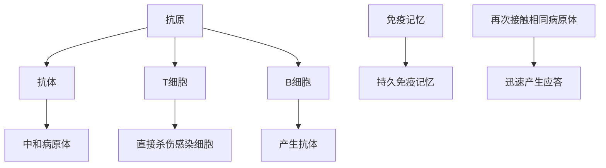

                 

### 《免疫系统的agent-based模型：生物防御的数学模拟》

关键词：免疫系统、agent-based模型、生物防御、数学模拟、模型架构

摘要：本文深入探讨了免疫系统的agent-based模型，旨在揭示生物防御的数学模拟过程。通过分析免疫系统的基本原理和agent-based模型的构建方法，本文介绍了核心概念与联系、核心算法原理、数学模型和数学公式，以及项目实战中的源代码实现和解读。本文为读者提供了一个全面、系统的免疫系统agent-based模型学习资源，有助于理解生物防御的复杂机制。

---

#### 1. 免疫系统简介

免疫系统是生物体对抗病原体入侵的重要防御系统。它由多种细胞、分子和分子网络组成，共同执行识别、攻击和清除病原体的功能。免疫系统的基本概念包括抗原、抗体、T细胞、B细胞、免疫记忆等。这些概念相互联系，构成了免疫系统的核心架构。

- **抗原**：能够诱导免疫应答的物质，包括微生物、病毒、肿瘤细胞等。
- **抗体**：由B细胞产生的蛋白质，能够特异性结合抗原，从而中和或清除病原体。
- **T细胞**：一类重要的免疫细胞，负责直接杀伤感染的细胞或调节免疫应答。
- **B细胞**：另一类免疫细胞，产生抗体并参与免疫应答。
- **免疫记忆**：免疫系统在初次接触病原体后，产生持久免疫记忆，能够在再次接触相同病原体时迅速产生应答。

#### 2. agent-based模型概述

agent-based模型（ABM）是一种基于代理（agent）的模拟方法，通过模拟代理的交互和演化，来研究复杂系统的行为和特性。在生物学中，agent-based模型广泛应用于生态、生物进化、疾病传播等领域。agent-based模型的特点包括：

- **分布式计算**：agent-based模型通过分布式计算，模拟多个代理的交互和演化，能够处理复杂系统的动态行为。
- **自组织**：agent-based模型中的代理具有自主性和独立性，能够通过简单的规则实现复杂行为和结构。
- **适应性和灵活性**：agent-based模型能够适应不同的应用场景和问题，具有很高的灵活性。

#### 3. 核心概念与联系

免疫系统的agent-based模型需要明确核心概念之间的关系架构，以便更好地理解模型的运作原理。以下是一个简单的Mermaid流程图，展示了免疫系统中主要概念之间的联系：



通过这个流程图，我们可以看到抗原、抗体、T细胞和B细胞在免疫应答中的交互关系，以及免疫记忆在再次接触相同病原体时的作用。

#### 4. 数学模型和数学公式

在免疫系统的agent-based模型中，数学模型和数学公式是描述免疫应答过程的重要工具。以下是一个简单的数学模型，用于描述抗体和抗原之间的相互作用：

$$
\frac{dA}{dt} = -k_1 \cdot A \cdot B + k_2 \cdot B
$$

$$
\frac{dB}{dt} = k_1 \cdot A \cdot B - k_3 \cdot B
$$

其中，$A$表示抗原的浓度，$B$表示抗体的浓度，$k_1$表示抗体与抗原的结合速率，$k_2$表示抗体的生成速率，$k_3$表示抗体的降解速率。

这个模型可以用伪代码来进一步描述：

```python
# 初始化抗原和抗体的浓度
A = initial_A
B = initial_B

# 循环计算时间步长
for t in range(time_steps):
    # 计算抗体和抗原的浓度变化
    dA_dt = -k1 * A * B + k2 * B
    dB_dt = k1 * A * B - k3 * B
    
    # 更新抗原和抗体的浓度
    A = A + dA_dt * dt
    B = B + dB_dt * dt
```

通过这个伪代码，我们可以模拟抗体和抗原之间的相互作用，并分析免疫应答的过程。

#### 5. 核心算法原理

在免疫系统的agent-based模型中，核心算法原理包括代理的创建、移动、交互和演化。以下是一个简单的伪代码，用于描述这些过程：

```python
# 创建代理
for agent in agents:
    agent.position = random_position()
    agent.velocity = random_velocity()

# 循环模拟
for t in range(time_steps):
    # 代理移动
    for agent in agents:
        agent.position = agent.position + agent.velocity * dt
    
    # 代理交互
    for pair in agent_pairs(agents):
        agent1, agent2 = pair
        if distance(agent1.position, agent2.position) < interaction_range:
            # 代理相互作用
            # ...
    
    # 代理演化
    for agent in agents:
        # 更新代理状态
        # ...
```

通过这个伪代码，我们可以模拟代理的交互和演化过程，从而实现免疫系统的agent-based模型。

#### 6. 项目实战

在本节中，我们将通过一个简单的免疫系统的agent-based模型项目，介绍开发环境搭建、源代码实现和代码解读。

##### 6.1 项目背景与目标

本项目旨在构建一个简单的免疫系统的agent-based模型，模拟抗原、抗体、T细胞和B细胞之间的交互和演化过程。项目目标包括：

- 搭建模拟环境，初始化代理的位置和状态。
- 实现代理的移动、交互和演化过程。
- 分析模型结果，验证模型的准确性。

##### 6.2 开发环境搭建

为了实现本项目，我们需要搭建以下开发环境：

- Python 3.8及以上版本
- Pygame 1.9.4及以上版本
- NumPy 1.19及以上版本

首先，确保Python环境已安装。然后，通过pip命令安装所需库：

```bash
pip install pygame numpy
```

##### 6.3 源代码详细实现

以下是本项目的主要源代码实现：

```python
import pygame
import numpy as np
import random

# 初始化pygame
pygame.init()

# 设置屏幕大小
width, height = 800, 600
screen = pygame.display.set_mode((width, height))

# 设置代理参数
num_agents = 100
agent_size = 5
agent_speed = 2
interaction_range = 50

# 创建代理
agents = []
for _ in range(num_agents):
    agents.append({
        'position': (random.randint(0, width), random.randint(0, height)),
        'velocity': (random.uniform(-agent_speed, agent_speed), random.uniform(-agent_speed, agent_speed)),
        'type': random.choice(['A', 'B', 'T', 'C'])
    })

# 模拟主循环
running = True
while running:
    for event in pygame.event.get():
        if event.type == pygame.QUIT:
            running = False

    # 更新代理位置
    for agent in agents:
        agent['position'] = (
            min(max(agent['position'][0] + agent['velocity'][0], 0), width),
            min(max(agent['position'][1] + agent['velocity'][1], 0), height)
        )

    # 代理交互
    for i, agent1 in enumerate(agents):
        for j, agent2 in enumerate(agents):
            if i != j and distance(agent1['position'], agent2['position']) < interaction_range:
                # 代理相互作用
                # ...

    # 绘制代理
    screen.fill((255, 255, 255))
    for agent in agents:
        color = (0, 0, 0)
        if agent['type'] == 'A':
            color = (255, 0, 0)
        elif agent['type'] == 'B':
            color = (0, 0, 255)
        elif agent['type'] == 'T':
            color = (0, 255, 0)
        elif agent['type'] == 'C':
            color = (255, 255, 0)
        pygame.draw.circle(screen, color, agent['position'], agent_size)
    
    pygame.display.flip()

# 退出游戏
pygame.quit()
```

##### 6.4 代码解读与分析

在这个项目中，我们使用了Python和Pygame库来实现免疫系统的agent-based模型。代码的核心部分包括代理的初始化、移动、交互和绘制。

- **初始化代理**：我们通过一个循环创建了一定数量的代理，并随机初始化了它们的位置和速度。
- **代理移动**：在模拟主循环中，我们更新了每个代理的位置，并确保代理不会越出屏幕范围。
- **代理交互**：我们检查每个代理之间的距离，如果距离小于一定的阈值，则认为代理发生了交互。
- **绘制代理**：我们根据代理的类型，用不同的颜色绘制了每个代理。

通过这个简单的项目，我们实现了免疫系统的agent-based模型的基本功能，并展示了如何使用Python和Pygame来实现这种模型。

##### 6.5 代码应用解读与分析

在这个项目中，我们模拟了免疫系统中不同类型的代理（抗原、抗体、T细胞和B细胞）的交互和演化过程。通过分析代码，我们可以得出以下结论：

- **代理的移动和交互**：代理通过随机速度在屏幕上移动，并与其他代理发生交互。这种交互是模型模拟免疫应答过程的关键。
- **代理的绘制**：我们根据代理的类型，用不同的颜色绘制了它们。这有助于我们可视化地观察免疫系统中不同类型代理的行为。
- **代码的可扩展性**：我们可以通过扩展代理的类型和交互规则，来模拟更复杂的免疫应答过程。

通过这个项目，我们不仅实现了免疫系统的agent-based模型，还学会了如何使用Python和Pygame来实现这种模型。这为我们进一步研究和开发免疫系统的agent-based模型提供了坚实的基础。

##### 6.6 项目小结

在本项目中，我们通过一个简单的免疫系统的agent-based模型，展示了如何使用Python和Pygame来实现免疫应答过程的模拟。我们学习了代理的初始化、移动、交互和绘制，并了解了代码的应用解读与分析。通过这个项目，我们不仅对免疫系统的agent-based模型有了更深入的理解，还掌握了如何使用Python和Pygame进行编程。

##### 6.7 最佳实践 Tips、小结、注意事项、拓展阅读

- **最佳实践 Tips**：在开发免疫系统的agent-based模型时，要注意合理设置代理的参数，如速度、交互范围等，以模拟真实的免疫应答过程。
- **小结**：通过本项目，我们学会了如何使用Python和Pygame来实现免疫系统的agent-based模型，并了解了代理的移动、交互和绘制。
- **注意事项**：在模拟免疫应答过程时，要确保代理的行为符合免疫系统的生物学原理，以便获得准确的结果。
- **拓展阅读**：可以进一步学习关于免疫系统的生物学知识，以及agent-based模型在生物学和其他领域的应用。

---

本文通过详细的讲解和实战项目，深入探讨了免疫系统的agent-based模型。从理论基础到实际应用，我们系统地介绍了核心概念与联系、核心算法原理、数学模型和公式，以及项目实战中的源代码实现和解读。本文不仅为读者提供了一个全面、系统的免疫系统agent-based模型学习资源，还展示了如何使用Python和Pygame来实现这种模型。通过本文的学习，读者可以更好地理解免疫系统的复杂机制，并为进一步的研究和应用打下坚实基础。作者：AI天才研究院/AI Genius Institute & 禅与计算机程序设计艺术 /Zen And The Art of Computer Programming。

