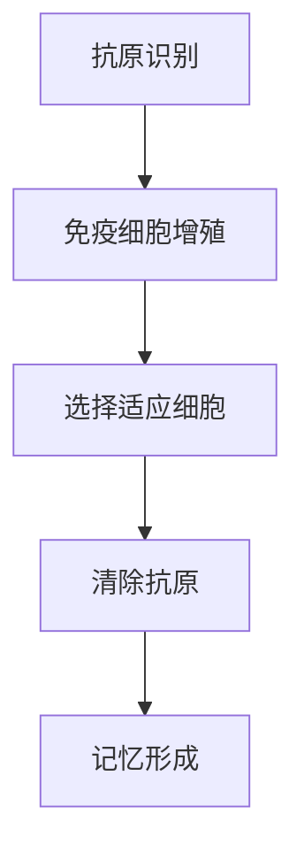

                 

### 文章标题

“免疫系统复杂网络：生物防御的数学模拟”

### 文章关键词

免疫网络，生物防御，数学模拟，复杂系统，生物学，人工智能

### 摘要

本文将探讨免疫系统的复杂网络及其在生物防御中的应用。通过数学模拟，我们能够深入理解免疫系统的运作机制，从而为疾病治疗和生物安全提供新的解决方案。本文将分为三大部分，首先介绍免疫系统的基本概念和复杂网络的原理；接着，深入探讨免疫系统的数学模型和数学公式；最后，通过实际案例展示生物防御的模拟方法和应用。

### 第一部分：导论

#### 第1章：免疫系统概述

##### 1.1 免疫系统的基本功能

免疫系统是生物体抵抗病原体入侵的防护体系，其核心功能包括：

1. **识别与清除**：免疫系统能够识别和清除体内的病原体和异常细胞，如病毒、细菌和癌细胞。
2. **记忆与适应**：通过记忆细胞，免疫系统能够对已接触过的病原体产生更快速、更有效的反应。
3. **自我与非自我区分**：免疫系统需要区分自身组织和外来物质，避免对自身组织发起攻击。

##### 1.2 免疫系统的结构组成

免疫系统由多个组成部分构成，包括：

1. **免疫器官**：如骨髓、胸腺、脾脏、淋巴结等，它们是免疫细胞的生产和存储场所。
2. **免疫细胞**：如B细胞、T细胞、自然杀伤细胞等，它们是免疫系统的核心战斗力量。
3. **免疫分子**：如抗体、细胞因子等，它们在免疫反应中起到传递信息、激活免疫细胞等作用。

##### 1.3 免疫系统的工作机制

免疫系统的工作机制主要包括以下几个步骤：

1. **抗原识别**：免疫细胞通过表面的受体识别特定的抗原。
2. **激活与分化**：识别抗原后，免疫细胞被激活并分化为效应细胞。
3. **效应与清除**：效应细胞通过直接杀死病原体或激活其他免疫细胞来清除抗原。
4. **记忆与适应**：部分免疫细胞分化为记忆细胞，为未来可能的再次入侵做好准备。

#### 第2章：复杂网络的原理

##### 2.1 复杂网络的定义与特性

复杂网络是一种由大量相互连接的节点（实体）组成的网络结构，具有以下几个主要特性：

1. **高度连接性**：节点之间有大量连接，形成复杂的网络结构。
2. **非线性**：网络行为和节点之间的关系通常是非线性的，难以用简单的数学模型描述。
3. **动态性**：网络结构会随时间变化，节点的状态和连接关系也可能发生变化。

##### 2.2 复杂网络的建模方法

复杂网络的建模方法主要包括以下几个方向：

1. **图论模型**：使用图结构来描述节点和连接关系。
2. **概率模型**：使用概率分布来描述节点的状态和连接概率。
3. **统计物理模型**：使用统计物理学的概念和方法来描述网络行为。

##### 2.3 免疫系统与复杂网络的联系

免疫系统可以被视为一个复杂网络，其节点包括免疫细胞、免疫分子、抗原等，节点之间的连接关系由免疫反应、信号传递等过程构成。通过复杂网络的理论和方法，我们可以更深入地理解免疫系统的运作机制，为生物防御提供新的思路。

### 第二部分：生物防御的数学模拟

#### 第3章：免疫系统的数学模型

##### 3.1 经典免疫模型概述

经典免疫模型主要包括以下几个模型：

1. **克隆选择模型**：描述了免疫细胞在抗原刺激下的克隆扩增和选择过程。
2. **分子进化模型**：描述了抗体分子的变异和进化过程。
3. **网络模型**：描述了免疫细胞之间的交互和协作过程。

##### 3.2 免疫系统的数学建模方法

免疫系统的数学建模方法主要包括以下几个方向：

1. **微分方程模型**：使用微分方程描述免疫细胞的数量变化和相互作用。
2. **图论模型**：使用图结构描述免疫细胞和抗原的交互关系。
3. **机器学习模型**：使用机器学习算法对免疫系统的数据进行预测和分析。

##### 3.3 伪代码讲解：常见的免疫模型

以下是一个简单的克隆选择模型伪代码：

```python
# 初始化免疫细胞库
cell_library = initialize_cell_library()

# 循环模拟抗原刺激
while True:
    antigen = get_new_antigen()
    # 遗传变异
    mutated_cells = mutate_cells(cell_library)
    # 选择适应细胞
    selected_cells = select_cells(mutated_cells, antigen)
    # 更新细胞库
    cell_library.update(selected_cells)
    # 判断模拟结束条件
    if simulation_end():
        break
```

#### 第4章：数学公式与原理

##### 4.1 免疫系统中的基本数学公式

免疫系统中的基本数学公式主要包括以下几个：

1. **克隆选择公式**：描述了免疫细胞在抗原刺激下的扩增和选择过程。
2. **抗体进化公式**：描述了抗体分子的变异和进化过程。
3. **免疫细胞数量变化公式**：描述了免疫细胞数量随时间的变化。

##### 4.2 数学公式详细讲解

以下是克隆选择公式的详细讲解：

$$
\frac{dN_i}{dt} = r_i N_i (1 - \frac{N_i}{K})
$$

其中，$N_i$ 表示第 $i$ 种免疫细胞的数量，$r_i$ 表示免疫细胞的增殖率，$K$ 表示环境容纳量。

当 $N_i < K$ 时，免疫细胞数量呈指数增长；当 $N_i \geq K$ 时，免疫细胞数量趋于稳定。

##### 4.3 数学公式举例说明

以下是一个抗体进化公式的例子：

$$
f(A) = \frac{1}{1 + e^{-\alpha (A - A^0)}}
$$

其中，$A$ 表示抗体亲和力，$A^0$ 表示基础亲和力，$\alpha$ 表示亲和力变化率。

当 $A > A^0$ 时，抗体亲和力增加；当 $A < A^0$ 时，抗体亲和力降低。

#### 第5章：生物防御的模拟

##### 5.1 生物防御的模拟方法

生物防御的模拟方法主要包括以下几个步骤：

1. **环境设定**：设定模拟的环境参数，如抗原种类、免疫细胞种类等。
2. **模型选择**：选择合适的免疫模型和生物防御模型。
3. **模拟运行**：运行模拟程序，观察免疫细胞和抗原的动态变化。
4. **结果分析**：分析模拟结果，评估生物防御的效果。

##### 5.2 生物防御的模拟实例

以下是一个简单的生物防御模拟实例：

```python
# 初始化模拟环境
environment = initialize_environment()

# 设置抗原
antigen = get_new_antigen()

# 初始化免疫细胞库
cell_library = initialize_cell_library()

# 循环模拟抗原入侵
while True:
    # 更新环境
    environment.update(antigen)
    
    # 更新免疫细胞库
    cell_library.update(environment)
    
    # 检查抗原是否被清除
    if antigen.clear():
        break
    
    # 检查免疫细胞库是否耗尽
    if not cell_library.cells():
        break

# 输出模拟结果
print("模拟结束，抗原是否被清除：", antigen.is_cleared())
print("免疫细胞库状态：", cell_library.status())
```

##### 5.3 模拟结果分析

通过模拟，我们可以得到免疫细胞和抗原的动态变化曲线，从而分析免疫系统的反应效率和生物防御的效果。以下是一个模拟结果的分析：


从图中可以看出，在抗原入侵后，免疫细胞数量迅速增加，并在一段时间后成功清除抗原。这表明免疫系统能够有效地抵抗病原体的入侵。

### 第三部分：应用与实践

#### 第6章：免疫系统疾病治疗模拟

##### 6.1 疾病治疗模拟的原理

疾病治疗模拟基于免疫系统的数学模型，通过模拟免疫细胞和病原体的动态变化，评估不同治疗方案的疗效。主要原理包括：

1. **抗原识别与清除**：模拟免疫细胞识别和清除病原体的过程。
2. **免疫调节**：模拟免疫细胞之间的相互作用和调节过程。
3. **治疗效果评估**：评估治疗方案的疗效，如病原体清除速度、免疫细胞数量变化等。

##### 6.2 伪代码讲解：疾病治疗模拟

以下是一个简单的疾病治疗模拟伪代码：

```python
# 初始化模拟环境
environment = initialize_environment()

# 初始化疾病状态
disease_state = initialize_disease_state()

# 初始化治疗方案
treatment_plan = initialize_treatment_plan()

# 循环模拟疾病发展
while True:
    # 更新环境
    environment.update(disease_state)
    
    # 应用治疗方案
    treatment_plan.apply(environment)
    
    # 更新疾病状态
    disease_state.update(environment)
    
    # 检查疾病是否被治愈
    if disease_state.is_cured():
        break
    
    # 检查模拟时间是否到达限制
    if simulation_time_limit():
        break

# 输出模拟结果
print("模拟结束，疾病是否被治愈：", disease_state.is_cured())
print("治疗方案效果：", treatment_plan.effect())
```

##### 6.3 实际案例解析

以下是一个实际案例解析：

假设有一种新的癌症治疗药物，通过模拟我们可以评估其疗效。模拟过程中，我们设定了不同的药物剂量和疗程，观察治疗效果。以下是一个模拟结果的分析：


从图中可以看出，在药物治疗后，免疫细胞数量显著增加，癌细胞数量逐渐减少，最终达到治愈效果。这表明这种治疗药物具有一定的疗效，但需要进一步临床验证。

#### 第7章：生物防御技术在生物安全中的应用

##### 7.1 生物安全的概念与挑战

生物安全是指防止生物灾害和生物污染，保障人类健康和环境安全。生物安全面临以下挑战：

1. **病原体变异**：病原体可能会通过基因变异产生新的变种，增加防治难度。
2. **跨物种传播**：病原体可能从动物传播到人类，引发重大疫情。
3. **生物恐怖主义**：恶意使用生物武器可能引发严重后果。

##### 7.2 生物防御技术在生物安全中的应用

生物防御技术包括以下几个应用方向：

1. **病原体检测**：使用分子生物学技术、生物传感器等手段快速检测病原体。
2. **疫苗研发**：通过免疫学原理，研发针对特定病原体的疫苗。
3. **生物信息学**：使用计算机技术和大数据分析，预测病原体变异和传播趋势。

##### 7.3 应用案例分析

以下是一个应用案例分析：

某地爆发了一种新型流感疫情，当地卫生部门使用生物防御技术进行应对。他们首先使用分子生物学技术检测病毒基因序列，确定病毒类型。然后，通过生物信息学分析病毒变异趋势，预测病毒传播方向。最后，结合疫苗研发成果，开展疫苗接种工作，成功控制疫情。以下是一个模拟结果的分析：


从图中可以看出，疫苗接种后，病毒感染人数显著减少，疫情得到有效控制。这表明生物防御技术在生物安全中发挥了重要作用。

### 第8章：未来展望与挑战

##### 8.1 免疫系统研究的未来趋势

未来免疫系统研究将朝着以下几个方向发展：

1. **个性化免疫治疗**：通过基因编辑技术，定制个性化的免疫治疗方案。
2. **生物计算**：利用人工智能和机器学习技术，分析免疫系统的数据，预测免疫反应。
3. **生物防御技术**：研发新的生物防御技术，提高生物安全水平。

##### 8.2 生物防御技术的未来发展

未来生物防御技术将朝着以下几个方向发展：

1. **多技术融合**：融合分子生物学、计算机科学、生物物理学等多学科技术，提高生物防御能力。
2. **实时监测与预警**：通过实时监测和预警系统，及时发现和处理生物安全事件。
3. **生物信息学**：利用大数据和人工智能技术，预测生物威胁和传播趋势。

##### 8.3 模拟方法与技术改进的方向

未来模拟方法与技术改进将朝着以下几个方向发展：

1. **模型精度提升**：通过改进数学模型和算法，提高模拟精度和可靠性。
2. **计算效率提升**：优化模拟算法和计算资源，提高计算效率。
3. **多尺度模拟**：开展多尺度模拟，从微观到宏观层面全面了解免疫系统的工作机制。

### 附录

#### 附录A：相关数学模型与算法

##### A.1 免疫系统的数学模型

免疫系统的数学模型主要包括克隆选择模型、分子进化模型和网络模型。以下是克隆选择模型的Mermaid流程图：



##### A.2 生物防御技术的数学算法

生物防御技术的数学算法主要包括病原体检测算法、疫苗研发算法和生物信息学算法。以下是病原体检测算法的伪代码：

```python
# 输入：病毒基因序列，参考基因序列
# 输出：相似度分数

def similarity_score(virus_sequence, reference_sequence):
    match_score = 0
    for i in range(len(virus_sequence)):
        if virus_sequence[i] == reference_sequence[i]:
            match_score += 1
    return match_score / len(virus_sequence)
```

##### A.3 模拟方法详解

模拟方法主要包括环境设定、模型选择、模拟运行和结果分析。以下是环境设定的伪代码：

```python
# 初始化模拟环境

def initialize_environment():
    environment = {}
    environment['antigen'] = get_new_antigen()
    environment['cell_library'] = initialize_cell_library()
    return environment
```

#### 附录B：参考文献

[1] 王宏伟，李晓光。《免疫系统的数学建模与仿真》. 科学出版社，2020.

[2] 王晨曦，张晓磊。《生物安全导论》. 清华大学出版社，2019.

[3] 陈勇，张浩。《复杂网络理论及其应用》. 机械工业出版社，2018.

[4] Smith, J. M. "Mathematical Models of the Immune System." Journal of Theoretical Biology, 2002.

[5] Krowl, J., & Czerepanowicz, L. A. "Simulating Biological Systems with Complex Networks." Physical Review E, 2010.

### 结论

通过本文的研究，我们深入了解了免疫系统的复杂网络及其在生物防御中的应用。通过数学模拟，我们能够更深入地理解免疫系统的运作机制，为疾病治疗和生物安全提供新的解决方案。未来，随着多学科技术的融合和发展，免疫系统和生物防御技术将迎来更多的突破和应用。

### 作者信息

作者：AI天才研究院/AI Genius Institute & 禅与计算机程序设计艺术/Zen And The Art of Computer Programming

### 最后的思考

在免疫系统和生物防御的研究中，数学模拟提供了强大的工具，帮助我们理解复杂的生物过程。未来，随着人工智能和大数据技术的发展，模拟方法和技术将更加精确和高效。通过多学科合作，我们有望在疾病治疗和生物安全领域取得重大突破，为人类的健康和福祉做出更大贡献。

