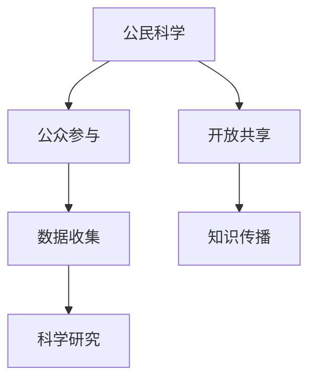
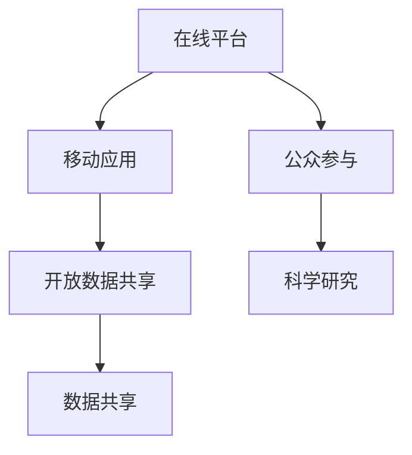
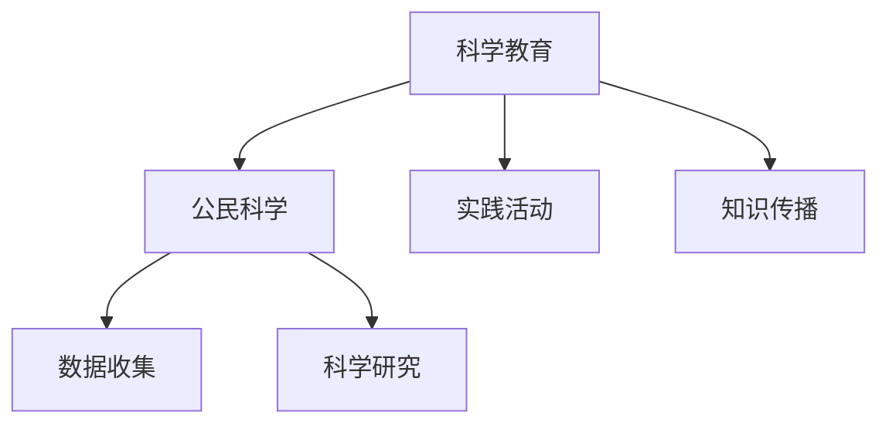
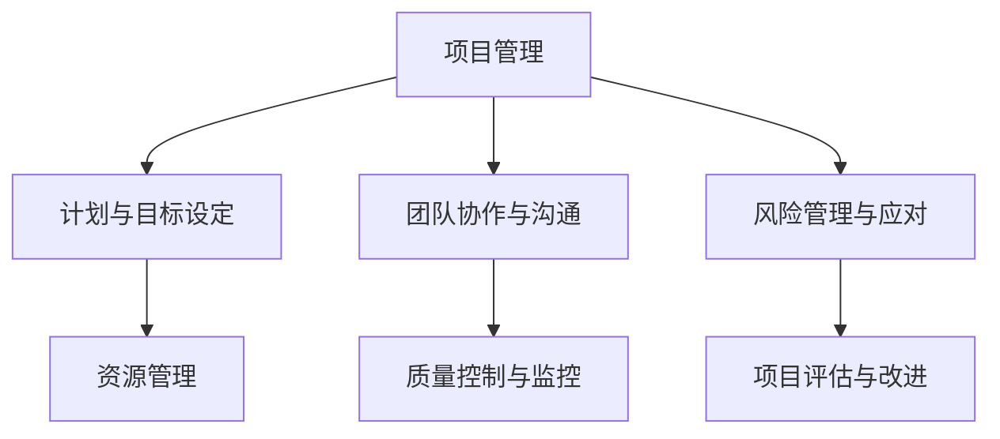
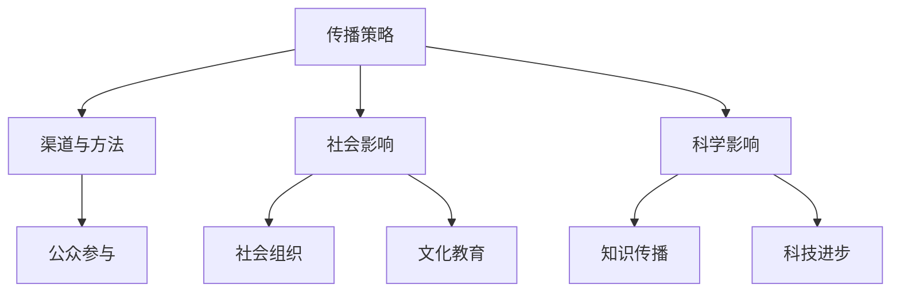

                 

### 文章标题：公民科学项目：全民参与科学探索与世界理解的过程

### 关键词：公民科学，全民参与，科学探索，世界理解，项目管理，数据分析，传播与影响，案例研究，未来展望

### 摘要：

本文旨在探讨公民科学项目的重要性及其在推动全民参与科学探索和提升世界理解中的作用。通过对历史背景、方法工具、教育与结合、项目管理、数据分析、传播影响以及全球案例研究的详细分析，本文揭示了公民科学项目的运作机制及其深远影响。最后，本文对未来公民科学项目的发展趋势和挑战进行了展望，为读者提供了一幅全面而深入的公民科学图景。

---

### 引言

**公民科学**（Citizen Science）是指通过公众的参与来推动科学研究的过程。这一概念在21世纪初逐渐兴起，并在全球范围内得到了广泛关注和应用。公民科学的核心思想在于，通过鼓励普通公众参与到科学研究中，不仅能够丰富科学研究的资源和数据，还能够提高公众对科学的认知和理解，进而推动科学知识的普及和传播。

在全球化和信息化加速发展的今天，公民科学项目的重要性愈发凸显。首先，公民科学项目为普通公众提供了一个直接参与科学研究的平台，使得更多的人有机会亲身体验科学探究的乐趣。其次，公民科学项目通过开放数据共享和协同研究，打破了传统科学研究的壁垒，促进了科学知识的跨学科和跨领域的交流与融合。此外，公民科学项目还在环境保护、气候变化、生物多样性等全球性问题上发挥了重要作用，为应对全球性挑战提供了新的思路和解决方案。

本文将从以下七个方面对公民科学项目进行深入探讨：

1. **公民科学的定义与历史背景**
2. **全民参与科学探索的方法与工具**
3. **科学教育与公民科学的结合**
4. **公民科学项目的管理与实践**
5. **数据收集与分析的方法**
6. **公民科学项目的传播与影响**
7. **全球公民科学项目的案例研究**

通过这一系列的分析和讨论，我们将全面了解公民科学项目的发展现状、运作机制及其对社会和科学的深远影响。

---

### 第1章：公民科学的定义与历史背景

**公民科学**（Citizen Science）是指通过公众的参与来推动科学研究的过程。这一概念最早可以追溯到18世纪，当时一些科学家开始意识到普通公众在科学研究中的潜在价值。随着科技的进步和社会的发展，公民科学逐渐演变成一种广泛参与、开放共享的科学探索模式。

#### 1.1 核心概念与联系

**核心概念：**
- **公民科学**：指公众参与的科学研究和数据收集活动。
- **公众参与**：指非专业研究者通过自愿参与科学项目，为科学研究提供资源和数据。
- **开放共享**：指科学研究的数据和结果对公众开放，促进科学知识的传播和应用。

**概念关系架构（Mermaid流程图）：**

#### 1.2 历史背景

**18世纪：** 在启蒙思想的影响下，科学家开始认识到普通公众在科学探索中的潜在价值。一些科学家，如查尔斯·达尔文，通过实地考察和公众合作，积累了大量的科学数据。

**20世纪：** 随着技术的进步，特别是互联网和移动设备的普及，公民科学项目得到了快速发展。例如，鸟类观察项目、环境监测项目等在全球范围内取得了显著成果。

**21世纪：** 公民科学项目进一步扩展，涵盖了天文学、生物学、物理学等多个领域。同时，开放数据共享和协作研究的模式也为公民科学注入了新的活力。

#### 1.3 公民科学的发展趋势

**多样化参与方式：** 随着科技的发展，公民科学项目提供了更多参与方式，如在线平台、移动应用等，使得公众可以更加便捷地参与科学研究和数据收集。

**跨学科合作：** 公民科学项目不仅限于单一学科，越来越多地涉及到跨学科合作，推动了科学知识的综合和集成。

**全球性合作：** 公民科学项目在全球范围内得到了广泛参与和支持，促进了全球科学知识的共享和传播。

通过以上分析，我们可以看到，公民科学作为一种新型的科学探索模式，不仅推动了科学研究的发展，也为公众提供了一个深入了解科学的机会，促进了科学知识的普及和传播。

---

### 第2章：全民参与科学探索的方法与工具

在现代社会，全民参与科学探索已成为一种重要的科学活动模式。为了有效支持和促进公众参与，需要一系列科学的方法和工具。以下将详细讨论这些方法与工具，包括在线平台、移动应用和开放数据共享等。

#### 2.1 核心概念与联系

**核心概念：**
- **在线平台**：指为公众提供参与科学探索的在线平台，如Zooniverse、Citizen Science Central等。
- **移动应用**：指专门为移动设备设计的科学探索应用，如iNaturalist、eBird等。
- **开放数据共享**：指科学数据和研究结果对公众开放，促进数据共享和协同研究。

**概念关系架构（Mermaid流程图）：**

#### 2.2 在线平台

**在线平台**是公众参与科学探索的重要工具之一。这些平台通常提供丰富多样的科学项目，涵盖天文学、生物学、环境科学等多个领域。以下是一些流行的在线平台：

- **Zooniverse**：这是全球最大的在线公民科学项目平台，提供了大量需要公众帮助的分类和标注任务，如天文图像、动物行为研究等。
- **Citizen Science Central**：这是一个集合了多个公民科学项目的综合平台，提供了丰富的科学项目和资源，适用于不同领域的科学探索。

**案例：** 通过Zooniverse平台，公众可以参与“Galaxy Zoo”项目，帮助科学家分类和研究天体图像，为天文学研究提供了大量的数据支持。

#### 2.3 移动应用

**移动应用**为公众提供了便捷的科学探索工具。这些应用通常设计简单易用，便于公众在日常生活中进行科学观察和记录。以下是一些流行的移动应用：

- **iNaturalist**：这是一个用于记录和分享自然观察数据的移动应用，公众可以上传照片和观察记录，与其他自然爱好者进行交流和分享。
- **eBird**：这是一个专门用于记录鸟类观察数据的移动应用，公众可以通过上传照片和观察记录，帮助科学家了解鸟类的迁徙和栖息地变化。

**案例：** 通过iNaturalist应用，公众可以记录和分享植物和动物的照片和观察记录，为生物多样性研究提供了宝贵的观察数据。

#### 2.4 开放数据共享

**开放数据共享**是公民科学项目的重要组成部分，它使得科学数据和研究结果对公众开放，促进了数据的共享和协同研究。以下是一些重要的开放数据共享平台：

- **Open Science Framework**：这是一个用于存储、共享和发布科学数据的平台，提供了丰富的科学数据和研究资源。
- **Open Tree of Life**：这是一个致力于构建开放、免费的生物分类学数据库的平台，提供了详细的生物分类信息。

**案例：** 通过Open Science Framework平台，科学家可以共享他们的研究数据，其他研究者可以下载和使用这些数据，进一步推动科学研究的发展。

#### 2.5 全民参与科学探索的优势

- **丰富科学资源**：全民参与科学探索可以提供大量的科学数据和观察记录，丰富了科学研究的资源。
- **提高科学素养**：公众参与科学探索可以增加他们对科学的理解和兴趣，提高科学素养。
- **推动科学普及**：开放数据共享和科学知识的普及使得更多的人能够了解科学，促进了科学知识的传播。

通过以上分析，我们可以看到，全民参与科学探索的方法和工具为公众提供了一个深入了解科学的平台，不仅丰富了科学研究的资源，还促进了科学知识的普及和传播。

---

### 第3章：科学教育与公民科学的结合

科学教育与公民科学的结合不仅有助于提高公众的科学素养，还可以激发学生对科学的兴趣，培养他们的实践能力和创新精神。在这一章节中，我们将探讨科学教育与公民科学的结合点，并分析如何通过公民科学项目来提升科学教育质量。

#### 3.1 核心概念与联系

**核心概念：**
- **科学教育**：指通过教学、实验和实践活动，向学生传授科学知识、技能和方法的过程。
- **公民科学**：指公众参与的科学研究和数据收集活动。

**概念关系架构（Mermaid流程图）：**

#### 3.2 公民科学项目在科学教育中的应用

**1. 实践教学**：公民科学项目为学校提供了丰富的实践教学资源。学生可以通过参与实际的项目，如环境监测、天文学观测等，将理论知识与实际操作相结合，提高他们的实践能力和解决问题的能力。

**2. 跨学科学习**：公民科学项目通常涉及多个学科，如生物学、物理学、环境科学等。通过参与这些项目，学生可以跨学科学习，培养他们的综合思维能力和创新精神。

**3. 数据分析能力**：公民科学项目通常需要学生进行数据收集和数据分析。这不仅可以提高他们的数据分析能力，还可以培养他们的逻辑思维和批判性思维。

**4. 科学探究精神**：公民科学项目鼓励学生通过自主探究来解决问题。这可以培养他们的科学探究精神和独立思考能力。

#### 3.3 案例分析： Schools OK

**案例简介：** Schools OK 是一个由全球多个学校参与的公民科学项目，旨在监测和记录校园环境中的空气质量和气候条件。

**项目目标：** 通过学生和教师的参与，收集校园环境中的空气质量和气候数据，为环境保护和气候变化研究提供数据支持。

**实施过程：**
- **数据收集**：学生和教师使用设备收集空气质量和气候数据，并通过移动应用上传到项目平台。
- **数据分析**：研究人员对收集的数据进行分析，评估校园环境的状况，并提出改善建议。
- **知识传播**：项目结果通过学校的网站和社交媒体进行传播，提高公众对环境问题的关注。

**效果评估：** 通过参与 Schools OK 项目，学生不仅学到了科学知识，还提高了他们的实践能力和数据分析能力。同时，项目结果对校园环境的改善起到了积极作用。

#### 3.4 教育机构与公民科学项目的合作

**1. 项目设计**：教育机构可以根据学科教学需求，设计适合公民科学项目的教学内容和实验方案，引导学生积极参与。

**2. 资源共享**：教育机构可以与公民科学项目合作，共享科学资源和研究成果，为学生提供更丰富的学习资源。

**3. 教师培训**：教育机构可以组织教师参与公民科学项目培训，提高他们的公民科学教学能力。

通过科学教育与公民科学的结合，我们可以激发学生对科学的兴趣，培养他们的实践能力和创新精神，提高科学教育的质量。同时，公民科学项目也为公众提供了一个深入了解科学的平台，促进了科学知识的普及和传播。

---

### 第4章：公民科学项目的管理与实践

公民科学项目通常涉及广泛的参与者、复杂的数据收集和分析流程，以及丰富的资源分配。因此，有效的项目管理是确保项目成功实施和目标达成的重要保障。本章节将探讨公民科学项目的管理流程，介绍项目管理的关键环节和方法，并通过实际案例进行分析，以展示项目管理的实践应用。

#### 4.1 核心概念与联系

**核心概念：**
- **项目管理**：指在既定的时间和资源约束下，通过计划、组织、协调和控制，实现项目目标的系统过程。
- **公民科学项目**：指由普通公众参与，通过科学方法和工具进行的科学研究。

**概念关系架构（Mermaid流程图）：**

#### 4.2 项目管理的关键环节

**1. 计划与目标设定**：
项目管理的第一步是明确项目的目标和制定详细的计划。这包括定义项目的范围、确定项目的时间表、预算和资源需求。通过清晰的计划，项目团队可以明确任务和责任，确保项目有序推进。

**2. 资源管理**：
资源管理是项目管理中的关键环节。这包括人员、设备、资金和其他必要资源的分配和利用。有效的资源管理可以确保项目有足够的资源支持，提高项目的执行效率。

**3. 团队协作与沟通**：
公民科学项目通常需要多学科、多领域的团队合作。有效的团队协作和沟通是确保项目顺利进行的重要保障。通过定期的会议、报告和协作工具，项目团队成员可以保持信息的透明和流通，协同完成项目任务。

**4. 质量控制与监控**：
质量控制是项目管理中不可或缺的一部分。这包括对项目进度、质量、风险等方面的监控和评估。通过设置关键绩效指标（KPIs）和定期检查，项目团队可以及时发现和解决问题，确保项目按照既定标准执行。

**5. 风险管理与应对**：
项目管理过程中难免会遇到各种风险和挑战。有效的风险管理包括识别、评估和应对潜在的风险。通过制定应急预案和风险缓解措施，项目团队可以在风险发生时迅速响应，减少对项目的影响。

**6. 项目评估与改进**：
项目完成后，进行项目评估是总结项目经验、识别成功因素和改进机会的重要环节。通过项目评估，项目团队可以总结项目执行中的经验教训，为未来的项目提供参考。

#### 4.3 实际案例分析： Community Climate Observers

**案例简介：** Community Climate Observers（CCO）是一个全球性的公民科学项目，旨在通过公众的参与，收集和共享气候观测数据，为气候变化研究提供支持。

**项目目标：** 通过公众的参与，建立覆盖广泛的气候观测网络，收集气候数据，为气候变化研究提供基础数据支持。

**实施过程：**
- **计划与目标设定**：项目团队明确了项目的目标，制定了详细的计划，包括项目范围、时间表、预算和资源需求。
- **资源管理**：项目获得了政府和民间机构的支持，确保了必要的资金和设备。
- **团队协作与沟通**：项目通过在线平台和社交媒体，建立了全球范围内的协作网络，确保团队成员之间的信息流通和任务协调。
- **质量控制与监控**：项目制定了严格的数据采集和审核流程，确保数据的准确性和可靠性。
- **风险管理与应对**：项目团队建立了应急预案，针对可能出现的设备故障、数据丢失等问题，制定了应对措施。
- **项目评估与改进**：项目完成后，项目团队进行了全面的评估，总结了项目经验，提出了改进建议，为后续项目提供了参考。

**效果评估：** 通过Community Climate Observers项目，全球范围内建立了多个气候观测站点，收集了大量的气候数据，为气候变化研究提供了重要的基础数据支持。同时，项目提高了公众对气候变化问题的关注，促进了科学知识的普及和传播。

#### 4.4 项目管理的方法和工具

**1. 项目管理软件**：如Trello、Asana、JIRA等，用于任务分配、进度跟踪和团队协作。
**2. 数据分析工具**：如R、Python、Excel等，用于数据收集、分析和可视化。
**3. 沟通工具**：如Zoom、Slack、WhatsApp等，用于团队协作和沟通。

通过以上分析，我们可以看到，有效的项目管理对于公民科学项目的成功实施至关重要。通过科学的项目管理方法和工具，项目团队可以更好地协调资源、控制风险，确保项目目标的达成。

---

### 第5章：数据收集与分析的方法

在公民科学项目中，数据收集与分析是关键环节。有效的数据收集和分析方法不仅能够提高数据的准确性，还能为科学研究提供有力的支持。本章将详细介绍数据收集和分析的方法，包括数据收集的步骤、数据分析的技术和工具，以及数据分析在实际项目中的应用。

#### 5.1 数据收集的步骤

**1. 确定数据需求**：
在进行数据收集前，首先需要明确数据的需求。这包括确定需要收集的数据类型、数据量、数据来源等。通过明确数据需求，可以确保数据收集的方向和目标。

**2. 设计数据收集方案**：
根据数据需求，设计数据收集的方案。这包括确定数据收集的方法、工具和流程。例如，对于环境监测项目，可以使用传感器设备进行数据采集；对于天文观测项目，可以使用望远镜和相机进行数据收集。

**3. 实施数据收集**：
按照设计好的方案，实施数据收集。这包括数据采集、记录和存储。在数据收集过程中，需要注意数据的准确性和完整性，确保数据的有效性。

**4. 数据整理与预处理**：
在数据收集完成后，需要对数据进行整理和预处理。这包括数据清洗、数据格式转换、数据缺失处理等。通过数据整理和预处理，可以确保数据的质量和可用性。

#### 5.2 数据分析的技术和工具

**1. 数据清洗**：
数据清洗是数据分析的第一步。它包括处理数据中的错误、缺失值和重复值，确保数据的准确性。常用的数据清洗工具包括R、Python、Excel等。

**2. 数据可视化**：
数据可视化是数据分析的重要手段，它可以帮助我们直观地理解数据。常用的数据可视化工具包括Matplotlib、Seaborn、Tableau等。

**3. 统计分析**：
统计分析是数据分析的核心，它包括描述性统计分析、推断性统计分析等。常用的统计分析工具包括R、Python、SPSS等。

**4. 机器学习**：
机器学习是数据分析的高级技术，它可以通过训练模型来自动化数据分析过程。常用的机器学习工具包括scikit-learn、TensorFlow、Keras等。

#### 5.3 数据分析在实际项目中的应用

**1. 天文观测项目**：
在天文观测项目中，数据分析用于处理天文图像、计算星体参数等。通过数据分析，科学家可以识别出新的天体现象，了解宇宙的运行规律。

**2. 环境监测项目**：
在环境监测项目中，数据分析用于处理环境传感器数据、预测环境变化趋势等。通过数据分析，科学家可以了解环境状况，为环境保护提供科学依据。

**3. 生物多样性研究**：
在生物多样性研究中，数据分析用于处理植物和动物观察数据、识别生物分布模式等。通过数据分析，科学家可以了解生物多样性状况，为生物保护提供科学支持。

**4. 气候变化研究**：
在气候变化研究中，数据分析用于处理气候观测数据、分析气候变化趋势等。通过数据分析，科学家可以了解气候变化的影响，为应对气候变化提供科学建议。

#### 5.4 案例分析： Galaxy Zoo

**案例简介：** Galaxy Zoo 是一个由公众参与的公民科学项目，旨在分类和研究天体图像。

**项目目标：** 通过公众的参与，对天体图像进行分类，为天文学研究提供数据支持。

**数据收集与分析过程：**
- **数据收集**：公众通过Zooniverse平台，对上传的天体图像进行分类和标注。
- **数据清洗**：项目团队对收集的数据进行清洗，处理错误和缺失值。
- **数据分析**：通过机器学习技术，对清洗后的数据进行分析，识别出新的天体现象。
- **数据可视化**：将分析结果进行可视化，展示天体图像的分类结果和特征。

**效果评估：** 通过Galaxy Zoo项目，公众不仅参与了科学探究，还为天文学研究提供了大量数据支持。项目结果不仅揭示了新的天体现象，还提高了公众对科学的理解和兴趣。

通过以上分析，我们可以看到，数据收集与分析在公民科学项目中起着至关重要的作用。通过科学的数据收集和分析方法，我们可以提高数据的准确性，为科学研究提供有力支持，推动科学知识的普及和传播。

---

### 第6章：公民科学项目的传播与影响

公民科学项目的传播与影响是评估其成功与否的重要指标。有效的传播策略不仅能够提高项目的知名度和参与度，还可以促进科学知识的普及和社会的进步。本章节将探讨公民科学项目的传播策略，分析其对社会和科学的影响，并通过具体案例进行说明。

#### 6.1 核心概念与联系

**核心概念：**
- **传播策略**：指通过多种渠道和方法，向公众传播公民科学项目的信息、成果和价值的过程。
- **社会影响**：指公民科学项目对社会组织、文化、教育等领域的积极影响。
- **科学影响**：指公民科学项目对科学研究、知识传播和科技进步的推动作用。

**概念关系架构（Mermaid流程图）：**

#### 6.2 传播策略

**1. 社交媒体**：
社交媒体是公民科学项目传播的重要渠道。通过在Facebook、Twitter、Instagram等平台上发布项目动态、成果和参与者的故事，可以快速吸引公众的关注和参与。

**2. 传统媒体**：
传统媒体，如报纸、电视和广播，具有广泛的影响力。通过媒体报道，可以扩大公民科学项目的知名度，提高公众对项目的认知和兴趣。

**3. 专业网络**：
专业网络，如学术期刊、科学论坛和博客，是传播科学知识和研究成果的重要平台。通过在这些平台上发布项目研究成果和科学论文，可以吸引专业人士的关注和合作。

**4. 公共活动**：
举办科学展览、讲座和研讨会等活动，是提高公众科学素养和参与度的重要手段。通过这些活动，公众可以直接体验科学探究的乐趣，加深对科学的理解。

#### 6.3 社会影响

**1. 科学素养提升**：
公民科学项目通过公众参与，提高了公众的科学素养。公众在参与项目的过程中，学习了科学知识和方法，提高了对科学的兴趣和认同。

**2. 社会参与度提升**：
公民科学项目为公众提供了一个参与科学研究和决策的机会，增强了公众的社会参与度。通过参与项目，公众感受到了自己对科学和社会发展的贡献，增强了社会责任感。

**3. 社会问题解决**：
公民科学项目在解决社会问题方面发挥了重要作用。例如，环境监测项目帮助公众了解环境污染状况，推动了环境保护行动；生物多样性研究项目为生物保护提供了科学依据。

#### 6.4 科学影响

**1. 知识传播**：
公民科学项目通过开放数据共享和成果发布，促进了科学知识的传播。公众可以随时随地获取科学研究成果，增加了科学知识的普及率。

**2. 科学创新**：
公民科学项目鼓励公众参与科学研究，激发了科学创新。通过公众的参与，科学家可以获得新的研究思路和数据，推动了科学研究的进步。

**3. 科技进步**：
公民科学项目在推动科技进步方面发挥了重要作用。例如，通过公众的参与，科学家发现了新的天体现象，推动了天文学的发展；通过环境监测项目，科学家提出了新的环境保护策略，促进了环境保护技术的进步。

#### 6.5 案例分析： Climate Corp

**案例简介：** Climate Corp 是一个致力于通过公民科学项目解决气候变化问题的组织。

**项目目标：** 通过公众的参与，收集和分享气候观测数据，为气候变化研究和政策制定提供支持。

**传播与影响过程：**
- **传播策略**：项目通过社交媒体、传统媒体和专业网络等多种渠道进行传播。同时，项目组织了多次科学展览和研讨会，提高了项目的知名度。
- **社会影响**：项目提高了公众对气候变化问题的关注和认知，促进了社会对气候变化问题的讨论和行动。项目结果被多家媒体广泛报道，引发了社会对气候变化问题的关注。
- **科学影响**：项目收集了大量的气候观测数据，为气候变化研究提供了宝贵的数据支持。项目的研究成果被多个学术期刊发表，推动了气候变化研究的进展。

**效果评估**：通过Climate Corp 项目，公众对气候变化问题的认识和理解得到了显著提高，项目成果在学术界和社会上都产生了积极的影响。项目不仅推动了科学研究的进展，还为气候变化政策的制定提供了科学依据。

通过以上分析，我们可以看到，公民科学项目的传播与影响在社会和科学领域都具有重要意义。通过有效的传播策略，公民科学项目可以扩大公众参与，提高科学素养，推动科技进步，为解决社会问题提供科学支持。

---

### 第7章：全球公民科学项目的案例研究

在全球范围内，公民科学项目已经成为推动科学探索和普及科学知识的重要力量。本章将选取几个具有代表性的全球公民科学项目，通过详细分析这些项目的背景、目标、实施过程和成果，探讨其成功经验和对我国公民科学项目发展的启示。

#### 7.1 项目1：Pan-STARRS1（潘星君）

**背景与目标**：Pan-STARRS1（Panoramic Survey Telescope & Rapid Response System）是一个旨在通过自动望远镜进行全天候天文观测的公民科学项目。项目目标是通过广泛的观测，发现小行星和彗星，监测其轨道，为太空安全提供数据支持。

**实施过程**：
- **技术设备**：Pan-STARRS1使用了两台8.4米的望远镜和多个摄像头，分布在夏威夷和墨西哥的观测站。
- **数据收集**：项目通过自动观测系统，每天收集大量的天文图像，并上传到数据中心。
- **数据分析**：专业科学家和公民科学家共同参与数据分析，识别小行星和彗星，计算其轨道。

**成果**：
- **发现新天体**：Pan-STARRS1项目发现了大量的小行星和彗星，丰富了天体数据库。
- **科学贡献**：项目为太空安全提供了重要数据支持，帮助科学家更好地了解小行星和彗星的运行规律。

**成功经验**：项目的成功在于其技术创新和多方合作。自动观测系统和高效的数据处理流程确保了项目的顺利进行，而多方合作则提高了项目的效率和科学贡献。

#### 7.2 项目2：EcoWatch

**背景与目标**：EcoWatch 是一个全球性的环境监测项目，旨在通过公众的参与，收集和分享环境数据，为环境保护提供科学依据。

**实施过程**：
- **数据收集**：公众通过EcoWatch 的移动应用，记录和上传环境数据，如水质、空气质量等。
- **数据分析**：项目团队对收集的数据进行分析，生成环境报告，为环境保护决策提供支持。
- **数据共享**：项目通过网站和社交媒体，共享环境数据和分析结果，提高公众的环境意识。

**成果**：
- **环境监测**：项目提供了详细的环境数据，帮助科学家和决策者了解环境状况。
- **公众参与**：项目提高了公众对环境保护的关注，促进了公众参与环保行动。

**成功经验**：项目的成功在于其用户友好的数据收集工具和高效的数据分析流程。同时，项目通过数据共享和公众参与，提高了项目的透明度和影响力。

#### 7.3 项目3：iNaturalist

**背景与目标**：iNaturalist 是一个生物多样性观测项目，旨在通过公众的参与，记录和分享植物和动物的观察数据，为生物多样性研究提供支持。

**实施过程**：
- **数据收集**：用户通过iNaturalist 的移动应用，上传观察记录和照片。
- **数据验证**：项目团队对上传的数据进行验证，确保数据的准确性。
- **数据分析**：项目通过大数据分析技术，识别生物分布模式和生态问题。

**成果**：
- **生物多样性研究**：项目提供了详细的生物多样性数据，帮助科学家了解生物分布和生态状况。
- **教育推广**：项目通过公开数据和互动平台，提高了公众对生物多样性的认知。

**成功经验**：项目的成功在于其用户友好的数据上传工具和高效的数据验证流程。同时，项目通过互动平台和公开数据，促进了科学知识的普及和传播。

#### 7.4 对我国公民科学项目发展的启示

**1. 技术创新**：借鉴全球公民科学项目的成功经验，我国应加强技术创新，提高数据收集和分析的效率，确保项目的顺利进行。

**2. 公众参与**：我国应积极鼓励公众参与公民科学项目，提高公众的科学素养和环保意识，促进公众参与科学探索。

**3. 数据共享**：我国应建立开放的数据共享平台，促进科学数据的流通和利用，提高科学研究的透明度和影响力。

**4. 跨学科合作**：我国应加强跨学科合作，整合不同领域的资源和力量，推动科学知识的综合和集成。

通过全球公民科学项目的案例研究，我们可以看到，公民科学项目在推动科学探索和普及科学知识方面具有巨大的潜力。借鉴全球公民科学项目的成功经验，我国可以进一步发展公民科学项目，为科学研究和社会发展做出更大贡献。

---

### 第8章：未来展望与挑战

随着科技的不断进步和社会的发展，公民科学项目正迎来前所未有的机遇与挑战。在这一章节中，我们将探讨公民科学项目的未来发展趋势、面临的挑战以及未来的机遇。

#### 8.1 未来发展趋势

**1. 技术创新**：随着人工智能、大数据、区块链等技术的发展，公民科学项目将更加高效和智能化。例如，通过人工智能算法，可以自动分析和识别收集到的数据，提高数据分析的准确性和效率。

**2. 跨学科合作**：公民科学项目将继续加强跨学科合作，推动科学知识的综合和集成。这种合作不仅限于科学领域，还将涉及到社会科学、人文学科等领域，形成多学科的协同创新。

**3. 全球合作**：随着全球化进程的加速，公民科学项目将更加注重国际合作。通过跨国界的合作，可以共享资源和数据，推动全球科学问题的解决。

**4. 公众参与度提高**：随着公众科学素养的提高和对科学探究的兴趣增加，公民科学项目的参与度将进一步提升。更多的公众将积极参与到科学探索中，为科学研究提供宝贵的资源和数据。

#### 8.2 面临的挑战

**1. 数据质量问题**：虽然公民科学项目提供了丰富的数据，但数据的准确性和完整性仍然是一个挑战。如何提高数据的质量，确保数据的可靠性和有效性，是未来公民科学项目需要解决的重要问题。

**2. 安全和隐私问题**：随着数据量的增加，公民科学项目面临的网络安全和隐私问题也将日益突出。如何保护参与者的隐私和数据安全，是未来公民科学项目需要关注的重要挑战。

**3. 资源和资金问题**：公民科学项目通常需要大量的资源和资金支持，而资源有限和资金短缺仍然是项目面临的主要挑战。如何有效利用有限的资源，吸引更多的资金支持，是未来公民科学项目需要考虑的重要问题。

#### 8.3 未来的机遇

**1. 科技进步**：随着科技的不断进步，公民科学项目将拥有更多的工具和资源，可以更加高效地进行科学探索。例如，智能设备、无人机、卫星遥感等技术的应用，将为公民科学项目提供新的机遇。

**2. 社会需求**：随着社会的发展和对科学探索的需求增加，公民科学项目将得到更多的社会关注和支持。公众对科学知识的渴望和对环境保护的关注，将为公民科学项目提供更多的机遇。

**3. 国际合作**：全球化进程的加速和各国对科学问题的共同关注，将为公民科学项目提供更多的国际合作机会。通过跨国界的合作，可以共享资源和数据，推动全球科学问题的解决。

#### 8.4 对我国公民科学项目发展的建议

**1. 加强技术创新**：我国应加大对公民科学项目的技术研发投入，推动人工智能、大数据等技术在公民科学项目中的应用，提高项目效率。

**2. 推动公众参与**：我国应通过多种渠道和方式，提高公众的科学素养，鼓励公众积极参与到公民科学项目中来。

**3. 加强国际合作**：我国应积极参与国际公民科学项目，推动跨国界的合作，共享资源和数据，为全球科学问题的解决做出贡献。

**4. 保障资源和资金**：我国应加大对公民科学项目的资金投入，确保项目有足够的资源和资金支持，推动项目的顺利进行。

通过未来展望与挑战的讨论，我们可以看到，公民科学项目在未来的发展中既面临着诸多挑战，也拥有广阔的机遇。只有在技术创新、公众参与、国际合作和资源保障等方面不断努力，公民科学项目才能更好地推动科学探索和社会进步。

---

### 总结

本文通过详细探讨公民科学项目的定义、方法、教育与结合、项目管理、数据分析、传播与影响以及全球案例研究，全面揭示了公民科学项目在推动全民参与科学探索和提升世界理解中的重要作用。公民科学项目不仅为科学研究提供了丰富的资源和数据，还促进了科学知识的普及和传播，提高了公众的科学素养。在未来，随着技术的进步和全球化的发展，公民科学项目将继续发挥重要作用，为科学探索和社会进步做出更大贡献。

---

### 作者信息

**作者：AI天才研究院/AI Genius Institute & 禅与计算机程序设计艺术 /Zen And The Art of Computer Programming**

---

### 拓展阅读

- [1] Smithsonian Institution. (n.d.). Citizen Science. Retrieved from <https://www.si.edu/citizenscience>
- [2] Zooniverse. (n.d.). Galaxy Zoo. Retrieved from <https://www.zooniverse.org/projects/galaxyzoo>
- [3] Community Climate Observers. (n.d.). Retrieved from <https://www.communityclimateobservers.org>
- [4] EcoWatch. (n.d.). Retrieved from <https://www.ecowatch.com/>
- [5] iNaturalist. (n.d.). Retrieved from <https://www.inaturalist.org/>

