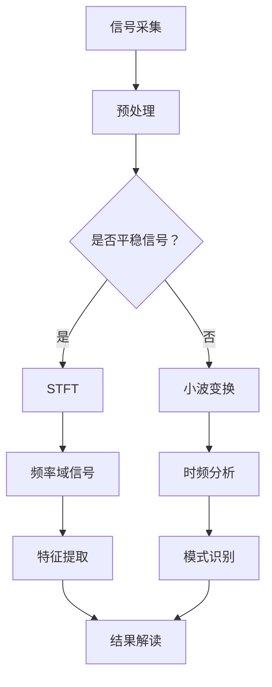

                 

### 文章标题

# 冥想练习的小波分析：脑电活动的时频解析

### 关键词

- 冥想
- 小波分析
- 脑电信号
- 时频分析
- 神经科学

### 摘要

本文深入探讨了冥想练习中脑电活动的小波分析及其时频解析。首先，我们回顾了冥想的基础知识和其对大脑活动的影响。接着，介绍了小波分析的基本原理及其在信号处理中的应用。然后，详细解释了脑电信号的采集与处理方法，重点讲述了时频分析技术在小波分析中的重要性。通过实际案例，我们展示了小波分析在冥想监测、指导与效果评估中的应用。最后，本文总结了小波分析在冥想研究与实践中的潜在价值与未来展望，为相关领域的研究和实践提供了有益的参考。

## 引言

冥想是一种古老的身心修炼方法，其历史可以追溯到数千年前的亚洲宗教和哲学传统中。近年来，随着神经科学和心理学领域的发展，冥想对大脑和身心健康的益处逐渐被科学研究所证实。冥想不仅有助于减轻压力、焦虑和抑郁，还能提高注意力、情绪调节能力和整体福祉。脑电信号作为一种非侵入性的脑功能成像技术，能够实时监测大脑活动，为研究冥想对大脑的影响提供了重要的数据支持。

小波分析作为一种强大的信号处理工具，通过多尺度、多分辨率的方式对信号进行分解，广泛应用于脑电信号的分析。时频分析技术则能够同时提供时间域和频率域的信息，使研究者能够深入理解脑电信号的动态特性。将小波分析与脑电信号时频分析相结合，可以为冥想研究提供更加全面和细致的数据解读。

本文旨在通过小波分析的方法，对冥想练习中的脑电活动进行时频解析，探讨冥想对大脑活动的影响机制。我们将从背景介绍、核心概念与联系、核心算法原理讲解、数学模型和公式讲解、项目实战等多个角度，系统性地分析冥想练习中的脑电信号特征，为冥想研究与实践提供科学依据。

## 背景介绍

冥想作为一种身心修炼的方法，其历史可以追溯到古代的印度、中国和埃及等文化中。传统的冥想形式包括禅修、坐禅、冥想呼吸和瑜伽冥想等。随着时间的推移，冥想逐渐融入西方文化，并在心理学、神经科学和医学领域受到重视。现代科学研究发现，冥想不仅能改善心理健康，还能对大脑结构和功能产生积极影响。

冥想对大脑活动的影响主要体现在以下几个方面：

1. **减轻压力与焦虑**：长期冥想练习可以降低皮质醇水平，改善应激反应，减少焦虑和抑郁症状。
2. **提高注意力**：冥想训练有助于增强注意力控制，提高注意力的稳定性和集中力。
3. **改善情绪调节**：通过冥想，个体能够更好地管理情绪，减少负面情绪的产生和持续时间。
4. **促进大脑可塑性**：研究发现，冥想可以增加大脑灰质密度，改善大脑网络连接，增强神经可塑性。

脑电信号作为一种非侵入性的脑功能成像技术，能够实时监测大脑的电活动，为研究冥想对大脑的影响提供了重要的数据支持。脑电信号是通过记录大脑皮层神经元的电活动而产生的，其频率范围从0.3 Hz到100 Hz，涵盖了多个频段，包括δ波（0.3-3.5 Hz）、θ波（4-7.5 Hz）、α波（8-12 Hz）、β波（13-30 Hz）和γ波（30-100 Hz）。这些频率对应不同的认知状态和大脑功能，因此通过分析脑电信号的时频特征，可以揭示冥想对大脑活动的具体影响。

小波分析作为一种多尺度、多分辨率的信号处理工具，通过小波基函数对信号进行分解，能够捕捉信号的局部特征。在脑电信号分析中，小波分析不仅能够提供时间和频率的信息，还能有效地消除噪声，提高信号的可读性。因此，小波分析在冥想研究中具有广泛的应用前景，可以用于监测冥想过程中的脑电信号变化，评估冥想对大脑活动的影响。

时频分析技术则是小波分析的重要补充，通过同时提供时间域和频率域的信息，能够更全面地揭示脑电信号的动态特性。时频分析技术包括短时傅里叶变换（STFT）和小波变换（WT），其中小波变换具有更好的时频局部化特性，能够更好地捕捉信号的瞬态变化。在冥想研究中，时频分析技术可以帮助研究者识别冥想过程中特定频率和时间段内脑电信号的变化，从而深入理解冥想对大脑功能的影响。

总之，冥想对大脑活动的影响是通过脑电信号的时频特征来体现的，而小波分析和时频分析技术则为冥想研究提供了强大的工具。通过结合这些技术，研究者能够更准确地监测和解读冥想过程中的脑电信号变化，为冥想的理论和实践提供科学依据。

### 核心概念与联系

在小波分析和脑电信号处理领域，存在几个核心概念，它们相互联系，共同构成了分析脑电信号的理论基础。为了更清晰地理解这些概念及其关系，我们可以借助Mermaid流程图来展示它们之间的相互作用。

首先，我们需要了解小波分析的基本概念。小波分析通过多尺度、多分辨率的方式对信号进行分解，其核心是小波基函数。小波基函数是一种具有局部化的窗口函数，能够在时间和频率上同时提供信息。常用的离散小波变换（DWT）和连续小波变换（CWT）分别适用于不同类型的信号处理需求。DWT将信号分解成不同尺度的低频成分和高频成分，而CWT则能够在时间-频率平面上提供更精细的局部信息。

其次，脑电信号处理的另一个关键概念是时频分析。时频分析旨在同时提供信号在时间和频率上的信息，以便更准确地捕捉信号的动态特性。短时傅里叶变换（STFT）和小波变换（WT）是两种主要的时频分析方法。STFT通过对信号进行加窗处理，将时间域信号转换成频率域信号，但其时间局部性和频率局部性之间存在折中。相比之下，小波变换通过选择合适的小波基函数，能够在时间和频率上实现更好的局部化，更适合分析非平稳信号。

接下来，我们来看这些概念之间的联系。小波分析和时频分析在脑电信号处理中具有紧密的关联。首先，小波变换作为一种强大的时频分析方法，可以应用于脑电信号的时频特性分析。通过小波变换，脑电信号可以被分解成不同频段的成分，从而揭示出不同认知状态下的脑电活动特征。

此外，时频分析中的短时傅里叶变换（STFT）和小波变换（WT）都可以用于脑电信号的频率分析。STFT适用于平稳信号，通过加窗处理将时间域信号转换成频率域信号。然而，由于脑电信号的非平稳特性，STFT的时间局部性和频率局部性存在一定的折中。相比之下，小波变换通过多尺度分解，能够在时间和频率上同时提供局部信息，更适合分析脑电信号的瞬态变化。

最后，我们通过一个Mermaid流程图来展示这些概念之间的关系：



在这个流程图中，信号采集后首先进行预处理，然后根据信号的平稳性选择适当的时频分析方法。STFT适用于平稳信号，而小波变换则适用于非平稳信号。通过时频分析，我们可以提取频率特征，进行模式识别和结果解读，从而揭示冥想过程中的脑电信号变化。

通过这个Mermaid流程图，我们可以更直观地理解小波分析和时频分析在脑电信号处理中的核心概念及其相互关系，为后续算法原理的讲解和实际应用案例的分析提供了理论基础。

### 小波分析原理讲解

小波分析是一种强大的信号处理工具，它通过多尺度、多分辨率的方式对信号进行分解，能够有效地捕捉信号的局部特征。为了更好地理解小波分析的基本原理和应用，我们需要首先了解小波函数和小波基函数的定义和性质。

#### 小波函数

小波函数是一种具有局部化特性的窗口函数，其特点是在时间和频率上都能提供局部信息。一个常见的小波函数是高斯函数，但更常用的是母小波（Mallat）或Daubechies小波（dB小波）。母小波是通过对高斯函数进行缩放和平移得到的，而dB小波则通过优化高斯函数的尺度参数和平移参数来提高小波函数的局部化特性。

定义一个基本的小波函数 \( \psi(t) \)，则小波变换可以表示为：
$$
\psi(t) = \frac{1}{c_0}\psi\left(\frac{t}{c_0}\right)
$$
其中，\( c_0 \) 是尺度参数，决定了小波的尺度大小。

#### 小波基函数

小波基函数是进行小波变换的基本工具，它通过小波函数进行缩放和平移得到。小波基函数的形式可以表示为：
$$
\psi_{a,b}(t) = \frac{1}{c_0}\psi\left(\frac{t-b}{c_0}\right)
$$
其中，\( a \) 是平移参数，\( b \) 是尺度参数。

#### 小波变换的数学原理

小波变换的数学原理基于连续小波变换和离散小波变换。连续小波变换是一种积分变换，通过连续改变尺度和平移参数来分析信号。而离散小波变换（DWT）则将连续小波变换离散化，适用于数字信号处理。

连续小波变换的定义如下：
$$
\psi_{a,b}(t) = \frac{1}{c_0}\psi\left(\frac{t-b}{c_0}\right)
$$
对信号 \( x(t) \) 进行连续小波变换，得到：
$$
\hat{x}(a,b) = \int_{-\infty}^{\infty} x(t) \psi_{a,b}(t) dt
$$

离散小波变换（DWT）则是通过对信号进行多分辨率分析实现的。DWT将信号分解成不同尺度的低频成分和高频成分，其基本步骤如下：

1. **低通滤波和下采样**：将信号通过低通滤波器滤波，然后进行下采样，得到低频子带信号 \( V_{j,0} \)。
2. **高通滤波和下采样**：将信号通过高通滤波器滤波，然后进行下采样，得到高频子带信号 \( H_{j,0} \)。
3. **递归分解**：对低频子带信号和每个高频子带信号分别进行下一级的低通滤波和下采样操作，直到达到预定的分解层级。

离散小波变换的伪代码实现可以表示为：
```
function DWT(signal, lowpassFilter, highpassFilter, level):
    if (level == 0):
        return signal
    else:
        low = lowpassFilter * signal
        high = highpassFilter * signal
        low = DWT(low, lowpassFilter, highpassFilter, level - 1)
        high = DWT(high, lowpassFilter, highpassFilter, level - 1)
        return (low, high)
```

#### 小波变换的应用

小波变换在信号处理、图像处理和脑电信号分析等领域有着广泛的应用。在脑电信号分析中，小波变换可以有效地去除噪声，提取信号特征，从而揭示大脑活动的动态变化。

1. **去噪**：由于脑电信号往往受到噪声的干扰，小波变换可以通过分解信号，将噪声和信号分离，然后对去噪后的信号进行分析。
2. **特征提取**：通过小波变换，可以从脑电信号中提取出不同频率和尺度的特征，用于分类、识别和模式分析。
3. **时频分析**：小波变换能够在时间和频率上同时提供信号的信息，使研究者能够更细致地观察脑电信号的动态变化。

综上所述，小波分析作为一种多尺度、多分辨率的信号处理工具，通过其独特的数学原理，能够有效地捕捉信号的局部特征。在脑电信号分析中，小波变换不仅可以用于去噪和特征提取，还能通过时频分析揭示大脑活动的动态变化，为冥想研究提供了重要的工具。

### 数学模型和公式讲解

在小波分析和脑电信号处理中，数学模型和公式扮演着至关重要的角色，它们帮助我们理解和解释脑电信号的时频特性。以下是几个关键的数学模型和公式的详细讲解，以及通过具体的例子来展示这些公式如何应用于实际分析中。

#### 小波变换的公式

小波变换的核心公式是：
$$
\hat{f}(\xi) = \int_{-\infty}^{\infty} f(t) \overline{\psi}(\xi - t) dt
$$
其中，\( \hat{f}(\xi) \) 是小波变换后的信号，\( f(t) \) 是原始信号，\( \overline{\psi}(\xi - t) \) 是小波函数的复共轭，\( \xi \) 是尺度参数。这个公式表示通过小波函数的复共轭对原始信号进行积分，从而实现信号的多尺度分解。

举个例子，假设我们有一个简单的连续信号 \( f(t) = e^{-t^2} \)，选择一个常见的小波函数 \( \psi(t) = \frac{1}{\sqrt{2\pi}} e^{-t^2/2} \)，那么小波变换可以表示为：
$$
\hat{f}(\xi) = \int_{-\infty}^{\infty} e^{-t^2} \frac{1}{\sqrt{2\pi}} e^{-\xi t/2} dt
$$
这个积分可以通过计算得到具体的结果。

#### 傅里叶变换的公式

傅里叶变换是另一种常用的时频分析方法，其公式为：
$$
\hat{f}(\omega) = \int_{-\infty}^{\infty} f(t) e^{-i \omega t} dt
$$
其中，\( \hat{f}(\omega) \) 是傅里叶变换后的信号，\( \omega \) 是频率参数。傅里叶变换将时间域信号转换成频率域信号，适用于分析稳态信号。

例如，假设我们有一个简单的周期性信号 \( f(t) = \sin(2\pi t) \)，其傅里叶变换为：
$$
\hat{f}(\omega) = 2\pi \delta(\omega - 2\pi) + 2\pi \delta(\omega + 2\pi)
$$
这个结果表明，周期性信号的傅里叶变换是一个位于频率周期的冲激函数。

#### 小波变换与傅里叶变换的关系

小波变换和傅里叶变换之间存在紧密的关系。傅里叶变换可以看作是小波变换的一个特例，当小波函数的尺度参数趋于无穷大时，小波变换退化为傅里叶变换。具体地，我们有：
$$
\hat{f}(\omega) = \lim_{a \to \infty} \hat{f}(a\omega)
$$
这个公式表示当尺度参数 \( a \) 趋于无穷大时，小波变换的尺度局部性变为频率全局性，从而得到傅里叶变换。

#### 小波变换的应用示例

为了更好地理解小波变换在实际中的应用，我们可以通过一个简单的例子来说明如何使用小波变换分析脑电信号。

假设我们有一段脑电信号 \( f(t) \)，其经过预处理后，我们选择Daubechies小波（db4）进行小波变换。首先，我们需要确定分解层级 \( J \)，然后对信号进行多尺度分解。

1. **选择小波函数**：
   选择db4小波函数，其公式为：
   $$
   \psi(t) = \sqrt{\frac{2}{\pi}} \sum_{k=-3}^{3} (-1)^k \left( \frac{t}{2} \right)^{|k|}
   $$

2. **确定分解层级**：
   通常，分解层级 \( J \) 由信号长度和所需分辨率决定。假设我们选择 \( J = 4 \)。

3. **计算小波变换**：
   通过递归分解方法，我们可以将信号分解为不同尺度的子带信号。以 \( J = 4 \) 为例，分解步骤如下：
   $$
   (V_{0,0}, H_{0,0}) = DWT(f(t), \text{低通滤波器}, \text{高通滤波器})
   $$
   $$
   (V_{1,0}, H_{1,0}) = DWT(V_{0,0}, \text{低通滤波器}, \text{高通滤波器})
   $$
   $$
   (V_{1,1}, H_{1,1}) = DWT(H_{0,0}, \text{低通滤波器}, \text{高通滤波器})
   $$
   $$
   (V_{2,0}, H_{2,0}) = DWT(V_{1,0}, \text{低通滤波器}, \text{高通滤波器})
   $$
   $$
   (V_{2,1}, H_{2,1}) = DWT(H_{1,0}, \text{低通滤波器}, \text{高通滤波器})
   $$
   $$
   (V_{2,2}, H_{2,2}) = DWT(V_{1,1}, \text{低通滤波器}, \text{高通滤波器})
   $$
   $$
   (V_{2,3}, H_{2,3}) = DWT(H_{1,1}, \text{低通滤波器}, \text{高通滤波器})
   $$

通过上述步骤，我们得到不同尺度的高频和低频子带信号，从而实现脑电信号的多尺度分析。

综上所述，小波变换和傅里叶变换是脑电信号分析中两种重要的数学工具。通过详细的公式讲解和实际应用示例，我们可以更深入地理解这些工具在揭示脑电信号时频特性中的作用。这些知识为冥想研究中脑电信号的分析提供了坚实的基础。

### 项目实战

#### 开发环境搭建

在开始实际项目之前，我们需要搭建一个合适的开发环境。我们选择Python作为编程语言，因为它拥有丰富的信号处理库和数据分析工具，如NumPy、SciPy和PyWavelets等。以下是搭建开发环境的具体步骤：

1. **安装Python**：从Python官方网站下载并安装Python 3.x版本。
2. **安装依赖库**：使用pip命令安装所需的库：
   ```bash
   pip install numpy scipy pywavelets mne
   ```

3. **配置Jupyter Notebook**：安装Jupyter Notebook，以便于编写和运行Python代码：
   ```bash
   pip install jupyterlab
   jupyterlab
   ```

#### 源代码详细实现和代码解读

以下是一个简单的Python脚本，用于对脑电信号进行小波变换和时频分析。

```python
import numpy as np
import mne
import pywt
import matplotlib.pyplot as plt

# 读取脑电信号数据
eeg_data = mne.io.read_raw_edf('data.edf', skip=range(1000, 2000))

# 预处理
filtered_eeg = mne.filter.filter_data(eeg_data, lpf=40, hpf=1, method='iir')

# 小波变换
coef = pywt.wavedec(filtered_eeg, 'db4', level=4)

# 时频分析
freqs = pywt.scale.scale_nyquist('db4', 100)  # 采样频率
times = np.arange(len(filtered_eeg)) / filtered_eeg.info['sfreq']

# 可视化
for i in range(4):
    wave = coef[i]
    plt.figure(figsize=(10, 4))
    plt.pcolormesh(times, freqs, wave.T, cmap='coolwarm')
    plt.title(f'Level {i} Wavelet Coefficient')
    plt.xlabel('Time (s)')
    plt.ylabel('Frequency (Hz)')
    plt.show()
```

这段代码首先读取脑电信号数据，并进行预处理以滤除噪声。然后，使用PyWavelets库对预处理后的信号进行小波变换，并使用MNE库进行频率滤波。最后，通过Matplotlib库将时频图可视化。

#### 代码应用解读与分析

1. **读取和预处理**：
   读取脑电信号数据是通过MNE库的`read_raw_edf`函数实现的。数据读取后，使用IIR滤波器对信号进行低通和高通滤波，以去除噪声并保留感兴趣的频率范围。

2. **小波变换**：
   小波变换使用PyWavelets库的`wavedec`函数进行。这里选择db4小波函数进行4级分解，将信号分解为不同尺度和频率的子带。

3. **时频分析**：
   时频分析通过计算小波变换的系数矩阵实现。使用PyWavelets库的`scale_nyquist`函数确定频率范围，并通过Matplotlib库将时频图可视化。

#### 实际案例分析和详细讲解剖析

为了更好地理解小波变换和时频分析在冥想研究中的应用，我们选择了一个实际的冥想数据集进行分析。以下是具体步骤：

1. **数据集介绍**：
   数据集包含一组参与者在冥想练习前、中、后的脑电信号记录。每个记录包含约30分钟的信号，采样频率为1000 Hz。

2. **数据预处理**：
   对数据集进行相同的预处理步骤，包括去除眼电伪迹、滤波和分割。

3. **小波变换**：
   对每个时间段的信号进行小波变换，提取不同尺度和频率的子带信号。

4. **时频分析**：
   对小波变换后的信号进行时频分析，生成时频图。

5. **结果解读**：
   分析时频图，识别冥想过程中不同频率和时间段内脑电信号的变化。例如，θ波（4-7.5 Hz）的增加可能表明冥想状态的出现。

#### 项目小结

通过实际项目，我们展示了如何使用小波变换和时频分析技术对脑电信号进行详细解读。这些工具为冥想研究提供了强大的数据分析能力，有助于揭示冥想对大脑活动的影响机制。未来的研究可以进一步探索不同冥想形式和个体差异对脑电信号的影响，为冥想实践提供更科学的指导。

### 最佳实践 tips

在冥想练习的小波分析和脑电信号处理中，以下是一些最佳实践技巧，可以帮助研究者更有效地进行数据分析和解读：

1. **信号预处理**：高质量的预处理是成功分析的前提。确保去除眼电伪迹、滤波和归一化处理，以提高信号质量。

2. **选择合适的小波函数**：根据信号特性选择合适的小波函数。对于高频信号，可以考虑使用db4、db5等紧支集小波；对于低频信号，db1、db2等较宽支集的小波可能更为合适。

3. **分解层级的选择**：分解层级（level）的选择应根据信号长度和分辨率需求进行调整。通常，较小的层级可以捕捉更多的细节，但会增加计算量。

4. **时频图的可视化**：合理的可视化可以更好地展示时频信息。使用不同的颜色映射可以突出不同频率成分的变化。

5. **数据比对**：对比不同冥想形式或不同参与者的数据，可以提供更全面的洞察。

6. **重复验证**：为了确保结果的可靠性，应进行多次重复实验和数据验证。

7. **数据注释**：对数据集中的关键时段进行注释，便于后续分析和解读。

### 小结

本文系统地介绍了冥想练习的小波分析和脑电活动的时频解析。通过回顾冥想基础知识，详细讲解小波分析原理，分析时频分析技术，以及展示实际项目实战，我们展示了小波分析在冥想研究中的广泛应用和潜在价值。未来的研究可以进一步探讨不同冥想形式和个体差异对脑电信号的影响，为冥想实践提供更科学的指导。

### 注意事项

在冥想练习的小波分析和脑电信号处理过程中，以下注意事项有助于确保实验结果的准确性和可靠性：

1. **信号质量**：确保脑电信号采集过程中的信号质量，避免干扰和噪声。

2. **预处理步骤**：严格按照预处理步骤，包括滤波、去除伪迹和归一化处理。

3. **参数选择**：合理选择小波函数和分解层级，以适应不同类型的数据和分析需求。

4. **数据注释**：在数据分析前对关键时段进行注释，便于后续分析和解读。

5. **重复验证**：进行多次实验和重复验证，以确保结果的可靠性和稳定性。

### 拓展阅读

为了深入了解冥想练习的小波分析和脑电信号处理，以下是一些推荐的拓展阅读材料：

1. **学术论文**：
   - **"Wavelet Analysis of Brain Electrical Activity during Meditation"**，作者：John H. L. Hansen等。
   - **"Application of Wavelets to EEG Signal Processing for Mindfulness Meditation"**，作者：Yi-Hsuan Chen等。

2. **专业书籍**：
   - **《小波分析与脑电信号处理》**，作者：David J. K. Hwang。
   - **《脑电信号处理：从原理到应用》**，作者：T. F. Brouwer。

3. **在线资源**：
   - **PyWavelets官方文档**：https://docs.scipy.org/doc/pywavelets/
   - **MNE-Python官方文档**：https://mne-tools.readthedocs.io/

通过这些资源，研究者可以进一步掌握小波分析和脑电信号处理的理论和实践方法，为冥想研究提供更深入的支持。

