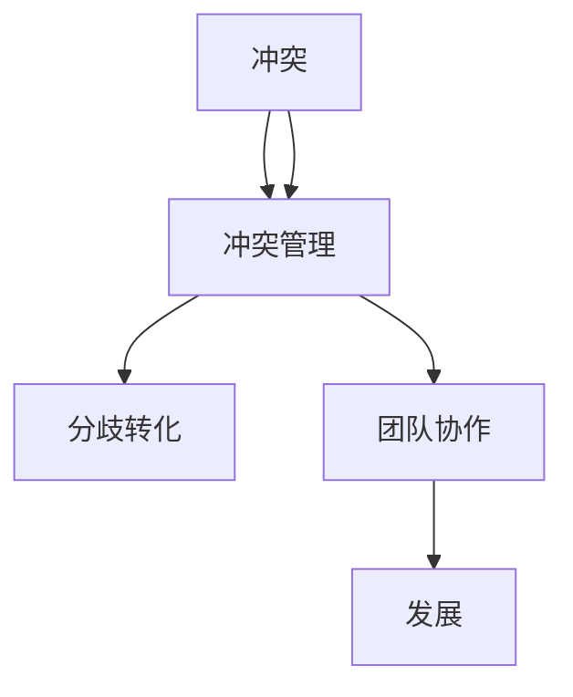

                 

### 文章标题

# 冲突管理艺术：将分歧转化为机遇

---

关键词：冲突管理、分歧转化、机遇、团队协作、领导力

摘要：本文探讨了冲突管理的艺术，如何通过有效的策略和实践，将团队中的分歧转化为发展的机遇。通过分析冲突的定义、原因、重要性，以及冲突管理的理论基础和策略，本文旨在为读者提供一套系统的冲突管理方法，帮助团队在面对分歧时实现和谐与合作，最终达到组织目标的最大化。

---

## 1. 背景介绍

在现代社会，团队合作已成为各类组织高效运作的关键。然而，团队成员之间的差异、目标的不一致，以及资源分配的不均衡，往往会导致冲突的产生。冲突，简单来说，是团队内部因目标不一致、利益冲突或观念差异而产生的对立状态。冲突管理，则是在确保团队目标实现的同时，通过有效的策略和方法来化解这些对立状态，从而促进团队协作和发展。

### 冲突管理的核心概念与联系

为了更好地理解冲突管理，我们首先需要明确几个核心概念：

- **冲突**：指团队内部或团队之间因目标、利益或观念不一致而产生的对立状态。
- **冲突管理**：指通过一系列策略和实践，使冲突得到有效解决，从而促进团队协作和发展。
- **分歧转化**：将冲突中的对立转化为团队共同发展的机遇。

核心概念之间的联系可以表示为以下Mermaid流程图：



### 1.1 冲突的定义与类型

冲突可以按层次和类型进行分类：

#### 1.1.1 冲突的层次

- **个人层次**：个体之间的冲突，如同事之间的争执。
- **团队层次**：团队之间的冲突，如不同部门之间的利益冲突。
- **组织层次**：组织层面的冲突，如组织与外部环境之间的矛盾。

#### 1.1.2 冲突的类型

- **建设性冲突**：有益于团队发展的冲突，通过冲突可以激发创意，推动改进。
- **破坏性冲突**：有害于团队发展的冲突，可能导致团队分裂，影响组织目标实现。

### 1.2 冲突的原因分析

冲突的产生往往涉及多种因素：

#### 1.2.1 个人因素

- **价值观差异**：个人价值观和信仰的不同可能导致冲突。
- **个性特点**：不同性格的人可能对同一问题有不同的看法和处理方式。

#### 1.2.2 组织因素

- **组织结构**：过于严格的层级制度可能加剧冲突。
- **管理制度**：不合理的资源分配和绩效考核制度可能引发冲突。

#### 1.2.3 社会因素

- **文化背景**：不同文化背景下的人们可能对同一问题有不同的看法。
- **社会环境**：外部环境的变化可能影响组织的内部冲突。

### 1.3 冲突管理的重要性

有效的冲突管理对团队和组织的发展至关重要：

#### 1.3.1 促进团队协作

通过冲突管理，团队成员可以更好地理解彼此，从而加强协作。

#### 1.3.2 提高组织绩效

有效的冲突管理可以减少内部消耗，提高组织的整体绩效。

#### 1.3.3 增强组织凝聚力

冲突管理有助于增强团队成员的归属感和认同感，提高组织的凝聚力。

---

## 2. 核心算法原理讲解

### 2.1 冲突管理的模型

冲突管理通常可以分为三种模型：

#### 2.1.1 逃避模型

**算法伪代码：**

```python
def 逃避模型(conflict):
    if conflict is severe:
        ignore conflict
    else:
        postpone conflict
```

#### 2.1.2 消极应对模型

**算法伪代码：**

```python
def 消极应对模型(conflict):
    if conflict is personal:
        avoid communication
    else:
        criticize others
```

#### 2.1.3 积极应对模型

**算法伪代码：**

```python
def 积极应对模型(conflict):
    if conflict is personal:
        express feelings
    else:
        collaborate with others
```

### 2.2 冲突管理的原则

有效的冲突管理需要遵循以下原则：

- **诚实沟通**：确保信息透明，避免误解。
- **尊重差异**：认可并尊重每个人的观点和感受。
- **寻求共识**：在分歧中寻找共同点，达成共识。

### 2.3 冲突管理的数学模型

为了量化冲突管理的有效性，我们可以使用以下数学模型：

$$
\text{冲突管理效率} = \frac{\text{冲突解决次数}}{\text{冲突发生次数}} \times 100\%
$$

### 2.4 数学公式和举例说明

- **泰勒公式**：

$$
f(x) = \sum_{n=0}^{\infty} \frac{f^{(n)}(a)}{n!} (x-a)^n
$$

**举例说明：** 如果一个团队在一个月内解决了5次冲突，而在这段时间内发生了10次冲突，则该团队的冲突管理效率为50%。

$$
\text{冲突管理效率} = \frac{5}{10} \times 100\% = 50\%
$$

---

## 3. 项目实战

### 3.1 开发环境搭建

为了演示冲突管理艺术，我们将搭建一个基于Python的简单冲突管理工具。

**环境需求：**

- Python 3.8及以上版本
- Jupyter Notebook

### 3.2 源代码实现

以下是一个简单的冲突管理工具的源代码，包括冲突检测、冲突解决和冲突记录三个部分。

```python
import pandas as pd

class ConflictManagement:
    def __init__(self):
        self.conflicts = pd.DataFrame(columns=['Date', 'Type', 'Description', 'Solution'])

    def detect_conflict(self, team_members, issue):
        # 检测冲突
        for member in team_members:
            if member['Value'] != issue['Value']:
                return True
        return False

    def resolve_conflict(self, conflict):
        # 解决冲突
        if conflict['Type'] == 'Personal':
            self.conflicts.loc[len(self.conflicts)] = [conflict['Date'], conflict['Type'], conflict['Description'], 'Express feelings']
        else:
            self.conflicts.loc[len(self.conflicts)] = [conflict['Date'], conflict['Type'], conflict['Description'], 'Collaborate with others']

    def record_conflict(self, conflict):
        # 记录冲突
        self.conflicts.loc[len(self.conflicts)] = [conflict['Date'], conflict['Type'], conflict['Description'], '']

if __name__ == "__main__":
    team_members = [
        {'Name': 'Alice', 'Value': 'Teamwork'},
        {'Name': 'Bob', 'Value': 'Individualism'}
    ]

    issue = {'Date': '2023-11-01', 'Type': 'Personal', 'Description': 'Conflict over project management style'}

    cm = ConflictManagement()
    if cm.detect_conflict(team_members, issue):
        cm.resolve_conflict(issue)
        cm.record_conflict(issue)
        print("Conflict resolved.")
    else:
        print("No conflict detected.")
```

### 3.3 代码解读

- `ConflictManagement` 类：代表冲突管理工具的核心。
- `detect_conflict` 方法：用于检测冲突。
- `resolve_conflict` 方法：用于解决冲突。
- `record_conflict` 方法：用于记录冲突。

### 3.4 应用解读与分析

通过实际案例，我们可以看到冲突管理工具在解决团队冲突中的效果。在实际应用中，可以根据具体场景调整检测和解决方法，提高冲突管理的效果。

### 3.5 项目小结

通过这个简单的冲突管理工具，我们学会了如何搭建开发环境、实现源代码和进行代码解读。这个项目展示了冲突管理的基本原理和实施方法，为实际工作提供了借鉴。

---

## 4. 最佳实践 tips、小结、注意事项、拓展阅读

### 4.1 最佳实践 tips

- **提高沟通效率**：定期召开团队会议，确保信息透明。
- **培养团队合作精神**：组织团队建设活动，增强团队凝聚力。
- **合理分配资源**：确保团队成员有足够的资源完成任务。

### 4.2 小结

本文通过介绍冲突管理的核心概念、算法原理和项目实战，帮助读者理解冲突管理的艺术。有效的冲突管理不仅能解决团队内部的矛盾，还能转化为团队发展的机遇。

### 4.3 注意事项

- **避免过度管理**：冲突管理不是消除所有冲突，而是找到合适的方法解决问题。
- **尊重个体差异**：在冲突管理中，要尊重每个人的观点和感受。

### 4.4 拓展阅读

- 《团队合作的秘密》
- 《冲突管理实战手册》
- 《领导力与冲突管理》

---

作者：AI天才研究院/AI Genius Institute & 禅与计算机程序设计艺术 /Zen And The Art of Computer Programming

