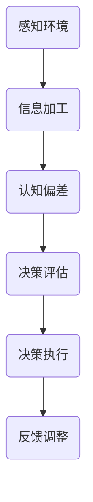
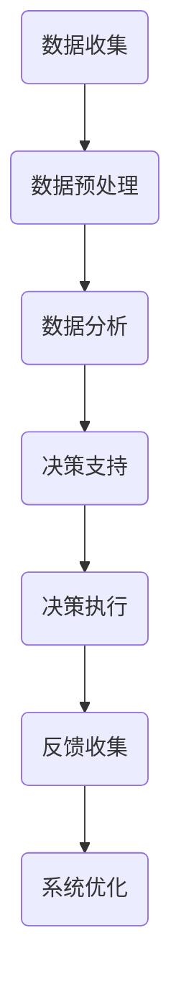

                 

### 第1章 决策力的重要性

#### 1.1 决策力与领导力的关系

在组织的运作中，领导力被视为核心驱动力，而决策力则是领导力的关键组成部分。决策力，指的是个体或集体在面对复杂和不确定的环境时，能够做出合理、高效、有效的决策的能力。领导力则是在这个能力的基础上，通过激励、指导和影响他人，实现组织目标的能力。

首先，决策力是领导力的基础。没有强大的决策力，领导力将失去实质性的支撑。一个优秀的领导者必须具备优秀的决策力，才能在面对各种挑战时，做出正确的决策，引领团队走向成功。

其次，决策力与领导力相辅相成。领导力可以增强决策力，而决策力可以提升领导力。一个领导者如果能够在决策过程中表现出卓越的洞察力、判断力和执行力，他将更容易赢得团队的信任和尊重，从而提升领导力。

#### 1.2 决策力在组织中的作用

决策力在组织中的作用主要体现在以下几个方面：

1. **战略规划**：决策力是制定组织战略的关键。领导者需要通过决策力，分析市场趋势、评估风险和机遇，制定符合组织长远发展的战略计划。

2. **资源配置**：决策力是合理配置组织资源的基础。领导者需要根据组织的战略目标和实际情况，做出有效的资源配置决策，确保资源得到最大化的利用。

3. **危机管理**：决策力是应对组织危机的关键。在危机时刻，领导者需要迅速做出决策，采取有效措施，降低危机对组织的影响。

4. **创新驱动**：决策力是推动组织创新的重要动力。领导者需要通过决策力，鼓励和推动组织内部进行创新，不断寻求新的发展机遇。

#### 1.3 决策力的核心要素

决策力的核心要素包括：

1. **信息收集与分析能力**：领导者需要具备强大的信息收集和分析能力，能够从大量信息中提取关键信息，进行深入分析，为决策提供依据。

2. **逻辑思维能力**：领导者需要具备良好的逻辑思维能力，能够通过逻辑推理，分析问题、解决问题，做出合理的决策。

3. **风险管理能力**：领导者需要具备较强的风险管理能力，能够在决策过程中评估潜在的风险，并采取相应的风险控制措施。

4. **执行能力**：领导者需要具备强大的执行能力，能够将决策转化为实际行动，确保决策的实施效果。

#### 1.4 决策力的重要性总结

决策力的重要性不言而喻。一个优秀的领导者，必须具备强大的决策力，才能在复杂多变的环境中，做出正确的决策，引领团队走向成功。同时，决策力也是领导力的核心组成部分，与领导力相辅相成，共同推动组织的发展。

在接下来的章节中，我们将详细探讨决策的过程、决策力核心概念与联系、决策力核心算法原理讲解、决策力数学模型与公式以及决策力项目实战，帮助读者全面了解和提升决策力。

---

以下是一个关于决策心理的Mermaid流程图，展示了决策心理模型的基本架构：



在这个模型中，感知环境是决策过程的起点，个体通过感官收集外部信息，然后进行信息加工。在这一过程中，认知偏差可能影响决策的准确性。个体根据加工后的信息进行决策评估，并执行决策。最后，通过反馈调整，不断优化决策过程。

在接下来的章节中，我们将深入探讨决策心理的各个方面，包括决策心理模型、认知偏差以及决策心理对决策力的影响。

---

以下是一个关于数据分析在决策中的应用的核心算法原理讲解伪代码示例：

```python
# 数据分析在决策中的应用伪代码

# 导入所需库
import pandas as pd
import numpy as np
from sklearn.model_selection import train_test_split
from sklearn.linear_model import LinearRegression

# 数据收集与预处理
data = pd.read_csv('data.csv')
X = data.drop(['target'], axis=1)
y = data['target']

# 数据拆分
X_train, X_test, y_train, y_test = train_test_split(X, y, test_size=0.2, random_state=42)

# 构建线性回归模型
model = LinearRegression()
model.fit(X_train, y_train)

# 预测结果
y_pred = model.predict(X_test)

# 评估模型性能
score = model.score(X_test, y_test)
print(f'Model Performance: {score:.2f}')
```

在这个伪代码中，我们首先导入所需的库，然后进行数据收集与预处理。接着，将数据拆分为训练集和测试集。使用线性回归模型进行训练，并预测测试集的结果。最后，评估模型的性能。

在接下来的章节中，我们将深入探讨决策支持系统、大数据与决策以及决策力提升策略，帮助读者全面了解决策力在组织中的应用和实践。

---

以下是一个关于决策支持系统的基本功能的Mermaid流程图：



在这个模型中，数据收集是决策支持系统的起点。通过数据预处理，清洗和转换数据，使其适合分析。数据分析阶段，系统使用各种算法和模型对数据进行处理，生成决策支持信息。决策执行阶段，系统根据分析结果，协助用户做出决策。反馈收集阶段，系统收集决策执行的结果，用于系统优化。

在接下来的章节中，我们将详细探讨大数据与决策、决策力数学模型与公式，以及决策力项目实战，帮助读者全面了解和提升决策力。

---

以下是一个关于大数据与决策的实际应用的例子，以及源代码的详细实现和代码解读：

#### 实际案例：电商平台的个性化推荐系统

假设我们有一个电商平台，我们需要根据用户的历史购买行为、浏览记录以及商品的特征，为用户推荐可能感兴趣的商品。

#### 源代码实现：

```python
import pandas as pd
from sklearn.model_selection import train_test_split
from sklearn.ensemble import RandomForestClassifier
from sklearn.metrics import accuracy_score

# 数据收集
data = pd.read_csv('ecommerce_data.csv')

# 数据预处理
X = data[['purchase_history', 'product_features']]
y = data['interest']

# 数据拆分
X_train, X_test, y_train, y_test = train_test_split(X, y, test_size=0.2, random_state=42)

# 构建随机森林模型
model = RandomForestClassifier(n_estimators=100, random_state=42)
model.fit(X_train, y_train)

# 预测结果
y_pred = model.predict(X_test)

# 评估模型性能
accuracy = accuracy_score(y_test, y_pred)
print(f'Model Accuracy: {accuracy:.2f}')

# 推荐商品
new_user_data = {'purchase_history': [[1, 0, 1, 0], [0, 1, 0, 1]], 'product_features': [[1, 1], [0, 1]]}
new_user_pred = model.predict(new_user_data)
print(f'New User Recommendation: {new_user_pred}')
```

#### 代码解读：

1. **数据收集**：我们首先导入一个包含用户购买历史和商品特征的CSV文件。

2. **数据预处理**：我们将数据拆分为特征矩阵（X）和目标变量（y）。这里，特征矩阵包含了用户的购买历史和商品特征，目标变量表示用户是否对该商品感兴趣。

3. **数据拆分**：我们使用`train_test_split`函数将数据拆分为训练集和测试集。

4. **模型构建**：我们选择随机森林算法作为我们的分类模型。随机森林是一种集成学习算法，能够处理大量的特征，并具有良好的泛化能力。

5. **模型训练**：我们使用训练集对随机森林模型进行训练。

6. **模型预测**：我们使用训练好的模型对测试集进行预测，并评估模型的性能。

7. **推荐商品**：我们使用训练好的模型为新的用户推荐商品。这里，我们假设新用户的历史购买行为和商品特征与训练集中的某个用户相似。

#### 代码应用解读与分析：

这个案例展示了如何使用机器学习模型来构建一个个性化的推荐系统。通过分析用户的购买历史和商品特征，我们可以预测用户对某个商品的兴趣。这种方法不仅能够提高用户的满意度，还能帮助电商平台提高销售额。

然而，这个案例也存在一些局限性。首先，模型的性能依赖于训练数据的质量。如果训练数据不够丰富或存在偏差，模型的预测准确性会受到影响。其次，随机森林模型可能无法处理非线性关系，这可能导致预测结果不够准确。因此，在实际应用中，我们可以考虑使用更复杂的模型，如深度学习模型，来提高推荐系统的性能。

在接下来的章节中，我们将继续探讨决策力提升策略、决策力与领导力的培养以及决策力的未来发展趋势，帮助读者全面了解决策力的各个方面，并在实际工作中提升决策力。

---

### 第11章 决策力实战案例

#### 案例背景

假设我们是一家新兴的科技公司，名为“智慧未来”。公司致力于研发先进的物联网（IoT）解决方案，帮助客户实现智能化管理和运营。公司在快速发展的同时，也面临着激烈的市场竞争和内部资源有限的挑战。为了在市场中脱颖而出，公司管理层决定开发一款创新的物联网平台，旨在通过大数据分析和智能算法，提供个性化服务，提升客户满意度。

#### 决策过程分析

1. **问题定义**：在决策初期，公司管理层明确了当前面临的问题：如何通过物联网技术提升客户服务质量和运营效率。

2. **目标设定**：管理层设定了明确的目标：开发一款能够自动收集、分析和处理物联网设备数据，提供个性化服务的物联网平台。

3. **方案分析**：管理层评估了多种可能的解决方案，包括自主研发、外包开发和与现有物联网平台合作等。经过综合评估，决定自主研发，以确保平台的自主知识产权和灵活性。

4. **风险评估**：在决策过程中，管理层对研发项目进行了详细的风险评估，包括技术难度、资金投入、时间进度和市场接受度等。

5. **决策制定**：经过讨论和论证，管理层决定采取自主研发的策略，并制定了详细的研发计划和资源配置方案。

6. **决策实施**：公司启动了研发项目，组建了专门的研发团队，并制定了严格的项目管理流程，确保项目按计划推进。

7. **反馈调整**：在项目实施过程中，公司定期收集项目进展情况，对项目计划进行调整和优化，确保项目能够按期完成。

#### 决策结果与反馈

经过一年的努力，物联网平台成功上线。该平台不仅提供了丰富的数据分析功能，还能根据用户行为进行智能推荐，提升了客户满意度和运营效率。以下是项目的具体结果和反馈：

1. **项目成果**：平台成功收集了数百万条物联网设备数据，通过大数据分析和智能算法，提供了数百个个性化服务场景。

2. **客户反馈**：客户对平台的反馈积极，满意度显著提升。客户反馈显示，平台的使用大大简化了数据管理和分析流程，提高了业务效率。

3. **运营效益**：平台上线后，公司的运营效益显著提升，客户的粘性和忠诚度也得到增强。

4. **技术成果**：项目研发过程中，公司积累了丰富的物联网技术经验和人才资源，为未来的技术研发奠定了基础。

#### 项目小结

通过这个实战案例，我们可以看到决策力在项目成功中的关键作用。以下是一些项目总结和决策力提升策略：

1. **明确问题和目标**：在项目初期，明确问题和目标是成功的关键。这有助于集中资源和精力，确保项目的方向正确。

2. **全面风险评估**：在决策过程中，进行全面的风险评估，有助于识别和应对潜在的挑战和问题。

3. **科学制定方案**：选择合适的方案，并进行详细的规划，是决策成功的重要保障。

4. **高效执行和反馈**：在项目实施过程中，高效的执行和及时的反馈调整，能够确保项目按计划推进，并能够及时纠正偏差。

5. **持续学习和优化**：项目成功后，持续学习和优化，是提升决策力和项目执行能力的重要途径。

通过这个实战案例，我们深刻理解了决策力在领导者和组织中的核心地位。在未来的工作中，我们需要不断锻炼和提升决策力，以应对日益复杂的市场环境和挑战。

---

### 第12章 决策力提升策略

#### 12.1 决策力提升的常见方法

提升决策力是一个持续的过程，需要通过多种方法进行锻炼和提升。以下是一些常见的方法：

1. **增强信息收集能力**：信息是决策的基础，领导者需要通过各种渠道收集全面、准确的信息。这包括市场研究、竞争分析、客户反馈等。

2. **培养逻辑思维能力**：逻辑思维是决策的核心，领导者需要通过分析、推理和判断，将复杂的信息转化为有效的决策。这可以通过阅读、练习逻辑题和参加辩论等方式进行培养。

3. **学习决策理论**：了解不同的决策理论，如理性决策模型、有限理性决策模型和情景分析模型等，有助于领导者更好地理解决策过程，提高决策效果。

4. **加强风险评估**：领导者需要学会评估决策可能带来的风险，并采取相应的风险控制措施。这可以通过风险识别、风险评估和风险应对策略来实施。

5. **提高执行能力**：决策的有效性不仅取决于决策本身，还取决于执行过程。领导者需要确保决策能够得到有效执行，这需要制定明确的执行计划，并跟踪执行进度。

#### 12.2 决策力提升的实际策略

在实际工作中，领导者可以采取以下策略来提升决策力：

1. **建立决策框架**：制定一个明确的决策框架，包括决策的目标、标准、流程和责任分配，有助于规范决策过程，提高决策效率。

2. **建立决策支持系统**：利用现代信息技术，建立决策支持系统，如大数据分析平台、人工智能算法等，帮助领导者快速、准确地做出决策。

3. **开展模拟训练**：通过模拟真实决策场景，进行反复练习和评估，有助于提高领导者的决策能力和应变能力。

4. **鼓励团队合作**：鼓励团队成员参与决策过程，通过集体讨论和合作，可以汇集更多的智慧和经验，提高决策的全面性和准确性。

5. **建立反馈机制**：建立有效的反馈机制，及时收集和分析决策执行的结果，对决策进行评估和调整，有助于持续提升决策力。

#### 12.3 决策力提升的长期规划

提升决策力是一个长期的、持续的过程，需要领导者进行长期规划。以下是一些长期规划的建议：

1. **持续学习和成长**：领导者需要不断学习新的知识和技能，跟上时代的发展，提升自身的专业素养。

2. **建立个人成长计划**：制定个人成长计划，包括学习目标、实践项目和评估标准，确保个人能力的持续提升。

3. **培养下属的决策能力**：通过培训和指导，提升下属的决策能力，不仅可以提高团队的决策效率，还可以培养未来的领导者。

4. **建立组织决策文化**：培养一个开放、包容、创新的决策文化，鼓励团队成员提出意见和建议，营造良好的决策氛围。

5. **持续反思和总结**：定期对决策过程进行反思和总结，识别问题和改进点，不断优化决策流程和方法。

通过上述策略和规划，领导者可以逐步提升决策力，在复杂多变的环境中做出更加合理、高效和有效的决策，为组织的长远发展奠定坚实的基础。

---

### 第13章 决策力与领导力培养

#### 13.1 决策力与领导力的关系

决策力和领导力之间存在着密切的关系。决策力是领导力的核心组成部分，没有强大的决策力，领导力将失去实质性的支撑。一个优秀的领导者必须具备强大的决策力，才能在面对各种挑战时，做出正确的决策，引领团队走向成功。同时，领导力可以增强决策力，通过激励、指导和影响他人，领导者可以更好地利用团队资源和智慧，提高决策的质量和执行效果。

#### 13.2 领导力的培养

培养领导力是一个持续的过程，以下是一些关键步骤：

1. **自我认知**：领导者需要深入了解自己的价值观、优点和缺点，以便更好地发挥自己的潜力。

2. **建立愿景**：领导者需要有一个清晰的愿景，明确组织的长期目标和方向。

3. **学习与成长**：领导者需要不断学习新的知识和技能，提升自身的专业素养。

4. **建立信任**：领导者需要通过诚实、透明和负责任的行为，建立与团队成员的信任关系。

5. **激励与激励**：领导者需要能够激励和激发团队成员的积极性，提升团队的凝聚力。

6. **有效沟通**：领导者需要具备良好的沟通技巧，能够清晰、准确地传达信息和意图。

7. **应对挑战**：领导者需要勇于面对挑战，从失败中汲取教训，不断提升决策力和领导力。

#### 13.3 决策力的提升与领导力的协同发展

提升决策力和领导力是一个相互促进的过程。以下是一些建议，帮助领导者实现决策力和领导力的协同发展：

1. **平衡战略与执行**：领导者需要在战略规划和执行之间保持平衡，确保决策既有前瞻性，又能得到有效执行。

2. **培养团队协作**：领导者需要鼓励团队成员参与决策过程，通过集体智慧和合作，提高决策的质量和执行效率。

3. **持续反思与改进**：领导者需要定期对决策过程和领导力进行反思和总结，识别问题和改进点，不断优化决策流程和领导方法。

4. **利用现代技术**：利用现代技术，如大数据分析、人工智能和云计算等，可以提高决策的准确性和效率，增强领导力。

5. **关注团队发展**：领导者需要关注团队成员的成长和发展，通过培训和指导，提升团队的整体素质。

通过上述方法和策略，领导者可以不断提升决策力和领导力，为组织的长远发展奠定坚实的基础。决策力和领导力的协同发展，将有助于领导者更好地应对复杂多变的环境，实现组织的战略目标。

---

### 第14章 决策力的未来发展趋势

#### 14.1 技术进步对决策力的影响

随着科技的飞速发展，人工智能、大数据、云计算等技术的广泛应用，决策力正在经历深刻的变革。技术进步不仅改变了决策的流程和方法，还大大提升了决策的效率和准确性。

1. **人工智能（AI）**：AI技术在决策中的应用日益广泛，通过机器学习和深度学习算法，AI能够处理海量数据，发现潜在的趋势和规律，为决策提供强有力的支持。

2. **大数据**：大数据技术的成熟，使得领导者能够更加全面、深入地了解业务和市场环境，从而做出更加精确的决策。

3. **云计算**：云计算的普及，为决策提供了灵活的计算资源，领导者可以随时获取和处理数据，提高决策的实时性和响应速度。

#### 14.2 决策力的未来发展预测

未来，决策力的发展趋势将呈现以下几个方向：

1. **智能化决策**：随着AI技术的发展，智能化决策将成为主流。领导者可以通过智能算法，实现自动化的决策过程，提高决策的效率和准确性。

2. **数据驱动的决策**：大数据和数据分析技术的进步，将使得决策更加依赖数据驱动。领导者需要具备强大的数据处理和分析能力，以充分利用数据资源。

3. **实时决策**：随着云计算和物联网技术的普及，实时决策将成为可能。领导者可以实时获取业务和市场的最新信息，快速做出决策，应对快速变化的环境。

4. **全球化决策**：全球化趋势将加剧市场竞争，领导者需要具备全球化视野，能够在全球范围内进行战略布局和决策。

#### 14.3 领导者应具备的决策力素养

在面对未来复杂多变的商业环境，领导者应具备以下决策力素养：

1. **创新能力**：领导者需要具备创新能力，能够不断寻求新的解决方案，推动组织实现跨越式发展。

2. **快速适应能力**：领导者需要能够快速适应变化，灵活调整决策策略，以应对不确定性。

3. **数据素养**：领导者需要具备良好的数据素养，能够理解和分析数据，利用数据支持决策。

4. **领导力**：领导者需要具备强大的领导力，能够激励和引导团队，共同实现决策目标。

5. **持续学习**：领导者需要具备持续学习的能力，不断更新知识和技能，以适应不断变化的市场环境。

通过不断提升决策力素养，领导者将能够更好地应对未来挑战，引领组织实现可持续发展。

---

## 附录

### 附录 A：决策力相关资源与工具

为了帮助读者进一步提升决策力，我们推荐以下资源与工具：

1. **书籍**：
   - 《决策与判断》（Daniel Kahneman）
   - 《智能决策》（Thomas H. Davenport）
   - 《精益创业》（Eric Ries）

2. **在线课程**：
   - Coursera上的“决策分析”（University of Michigan）
   - edX上的“大数据分析”（Columbia University）

3. **工具**：
   - Tableau（数据可视化工具）
   - Power BI（商业智能工具）
   - Excel（数据处理与分析工具）

### 附录 B：决策力实践指南

为了在实际工作中有效提升决策力，以下是一些建议：

1. **定期反思**：每天或每周花时间反思自己的决策过程，识别成功和失败的原因。

2. **制定决策框架**：在做出重要决策前，制定一个明确的决策框架，包括目标、标准和流程。

3. **利用数据**：尽可能利用数据支持决策，避免依赖直觉和主观判断。

4. **寻求外部意见**：在决策过程中，寻求外部意见和专业建议，以获取不同的视角。

5. **实践决策**：通过模拟决策场景，实践决策技能，不断提升决策力。

通过以上指南和资源，读者可以逐步提升决策力，成为更加出色的领导者。

