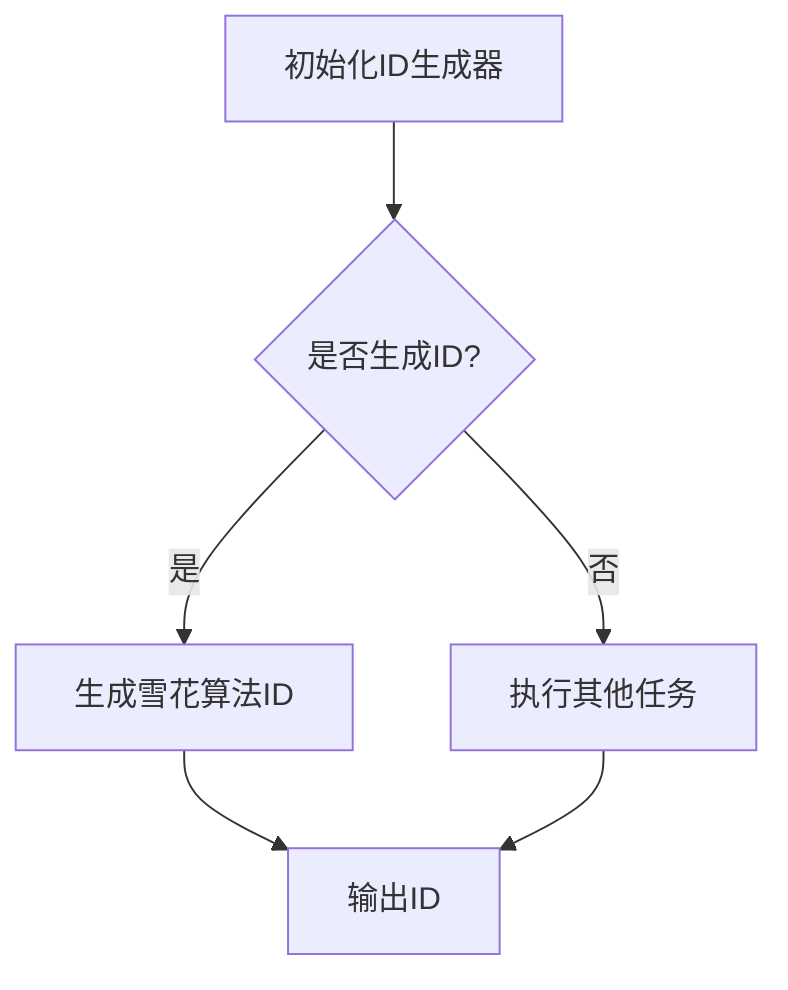

                 

### 文章标题

# 分布式ID生成器在大规模LLM应用中的实现

> 关键词：分布式ID生成器、大规模LLM应用、雪花算法、DB分配器、性能优化、稳定性保障

> 摘要：本文将深入探讨分布式ID生成器在大规模LLM（大型语言模型）应用中的实现。通过详细分析分布式ID生成器的基本概念、核心算法、数学模型，并结合实际案例，探讨如何在大规模LLM应用中高效、可靠地实现分布式ID生成器，为开发者提供实用的性能优化与稳定性保障策略。

### 第1章：分布式ID生成器概述

#### 1.1 分布式ID生成器的概念与重要性

在分布式系统中，ID生成器的作用至关重要。分布式ID生成器的主要功能是生成全局唯一的ID，确保在分布式环境下，每个节点生成的ID不会发生冲突。在传统单体系统中，ID生成通常由单一数据库或序列号来实现，但在分布式系统中，这种单一生成方式容易导致ID冲突，影响系统的稳定性和一致性。

分布式ID生成器的重要性主要体现在以下几个方面：

1. **全局唯一性**：确保每个生成的ID在整个分布式系统中唯一，避免重复。
2. **高性能**：在分布式系统中，ID生成需要快速响应，以支撑高并发的请求处理。
3. **高可用性**：分布式ID生成器需要具备高可用性，即使在部分节点发生故障的情况下，也能确保ID的连续生成。

#### 1.2 分布式ID生成器的类型与特点

分布式ID生成器有多种实现方式，常见的有以下几种：

1. **雪花算法**：雪花算法（Snowflake）是一种经典的分布式ID生成算法，由Twitter公司开源。它通过一个64位的整数来表示ID，其中包含了时间戳、数据中心ID、工作机器ID和序列号。

2. **DB分配器**：DB分配器通过预先在数据库中分配ID段，然后由各个节点从对应的ID段中取值。这种方式简单高效，但需要定期维护ID段分配。

3. **UUID**：UUID（通用唯一标识符）是一种基于128位的数字序列的ID生成方式，具有全局唯一性。但UUID的生成速度较慢，不适用于高性能要求的应用。

#### 1.3 分布式ID生成器在大规模LLM应用中的角色

在大规模LLM应用中，分布式ID生成器的作用尤为重要。LLM应用通常涉及到海量的数据和高并发的请求处理，ID生成器需要能够快速、高效地生成唯一的ID，以保证系统的稳定运行。具体来说，分布式ID生成器在大规模LLM应用中的角色包括：

1. **唯一标识生成**：为每个用户、会话、请求等生成唯一的标识，便于系统进行管理和追踪。
2. **数据分片**：在分布式数据库中，ID生成器可以辅助实现数据的分片策略，提高系统的水平扩展能力。
3. **事务管理**：在分布式事务中，ID生成器可以帮助确保事务的唯一性，防止并发冲突。

### Mermaid流程图：分布式ID生成器的工作流程



通过以上流程图，我们可以清晰地看到分布式ID生成器的基本工作流程，包括初始化、是否生成ID的判断、ID生成以及输出ID等关键步骤。

### 第2章：分布式ID生成器算法

#### 2.1 雪花算法原理与实现

雪花算法是一种时间戳序列算法，其核心思想是将一个64位的整数分割成多个部分，分别表示时间戳、数据中心ID、工作机器ID和序列号。具体来说，雪花算法的64位整数分为三部分：时间戳部分（41位）、数据中心ID部分（5位）和工作机器ID部分（5位），序列号部分（12位）。

##### 2.1.1 雪花算法的组成部分

1. **时间戳部分**：41位用于表示时间戳，可以表示约69年（$2^{41}$），确保时间戳的连续性和唯一性。
2. **数据中心ID部分**：5位用于表示数据中心ID，可以区分不同的数据中心。
3. **工作机器ID部分**：5位用于表示工作机器ID，可以区分不同的工作机器。
4. **序列号部分**：12位用于表示序列号，确保每个工作机器在每个毫秒内生成唯一的序列号。

##### 2.1.2 雪花算法的伪代码实现

```python
function generateSnowflakeID():
    timestampPart = getCurrentTimestamp().mod(2^41)
    dataCenterIDPart = getDataCenterID()
    workerIDPart = getWorkerID()
    sequencePart = getSequence().mod(2^12)
    
    snowflakeID = (timestampPart << 12) | (dataCenterIDPart << 5) | workerIDPart | sequencePart
    return snowflakeID
```

##### 2.1.3 雪花算法的优势与局限性

雪花算法的优势主要体现在以下几个方面：

1. **全局唯一性**：通过时间戳和序列号确保全局唯一性。
2. **高效性**：雪花算法的生成速度非常快，能够满足高性能要求。
3. **可扩展性**：雪花算法支持数据中心和工作机器的扩展。

然而，雪花算法也存在一些局限性：

1. **时间戳依赖**：雪花算法依赖于时间戳，如果时间回绕，可能导致ID冲突。
2. **数据中心和工作机器ID分配**：需要提前分配好数据中心和工作机器ID，否则可能导致ID分配不均匀。

##### 2.2 DB分配器算法原理与实现

DB分配器算法通过预先在数据库中分配ID段，然后由各个节点从对应的ID段中取值。具体实现时，通常会在数据库中创建一个ID段表，记录每个节点的可用ID段。

##### 2.2.1 DB分配器的基本原理

1. **初始化**：初始化时，将ID段表中的ID段分配给各个节点。
2. **取值**：每个节点在生成ID时，从自己的ID段中取出一个值。
3. **更新**：每次取值后，更新ID段表，标记已使用的ID段。

##### 2.2.2 DB分配器的伪代码实现

```sql
-- 创建ID段表
CREATE TABLE id_segment (
    node_id INT,
    start_id BIGINT,
    end_id BIGINT
);

-- 初始化ID段表
INSERT INTO id_segment (node_id, start_id, end_id) VALUES (1, 1, 1000);
INSERT INTO id_segment (node_id, start_id, end_id) VALUES (2, 1001, 2000);

-- 获取可用ID
SELECT start_id + RAND() * (end_id - start_id) FROM id_segment WHERE node_id = 1;

-- 更新ID段
UPDATE id_segment SET start_id = start_id + 1 WHERE node_id = 1 AND start_id = end_id;
```

##### 2.2.3 DB分配器的性能优化策略

1. **数据库优化**：使用高性能数据库，确保ID段表的操作效率。
2. **缓存机制**：在内存中缓存部分ID段，减少数据库访问次数。
3. **分布式锁**：在取值和更新ID段时，使用分布式锁确保操作的原子性和一致性。

### 第3章：分布式ID生成器的数学模型

#### 3.1 ID分配冲突概率模型

ID分配冲突概率模型主要用于评估分布式ID生成器在生成ID时的冲突概率。冲突概率取决于ID生成算法的设计、ID位数、节点数量等因素。

##### 3.1.1 冲突概率的计算方法

假设ID为$n$位，节点数为$m$，每次生成的ID为随机值，则每次生成的ID与其他ID冲突的概率为：

$$P_{conflict} = 1 - \left(1 - \frac{1}{2^n}\right)^{m^2}$$

其中，$m^2$表示每个节点与其他所有节点的冲突次数。

##### 3.1.2 降低冲突概率的策略

1. **增加ID位数**：增加ID位数可以降低冲突概率，但会提高ID生成的开销。
2. **优化节点分布**：尽量保证节点分布均匀，减少冲突概率。
3. **使用分段算法**：如DB分配器，将ID分段分配给节点，降低冲突概率。

#### 3.2 负载均衡模型

负载均衡模型主要用于评估分布式ID生成器在不同节点之间的负载均衡情况。负载均衡的目的是确保每个节点生成的ID数量大致相同，避免某些节点过载。

##### 3.2.1 负载均衡的数学模型

假设节点数为$m$，每个节点的平均负载为$P$，则节点的负载均衡度可以通过以下公式计算：

$$D = \frac{\sum_{i=1}^{m} (P_i - P)^2}{m}$$

其中，$P_i$表示第$i$个节点的负载。

##### 3.2.2 负载均衡算法的选择

1. **随机负载均衡**：随机选择节点进行ID分配，简单易实现，但可能存在负载不均衡的问题。
2. **轮询负载均衡**：按照顺序选择节点进行ID分配，确保负载均衡，但可能导致某些节点负载过重。
3. **最小负载均衡**：选择当前负载最小的节点进行ID分配，确保负载均衡，但需要实时计算每个节点的负载。

### 第4章：分布式ID生成器在大规模LLM应用中的实现

#### 4.1 大规模LLM应用中的ID生成器需求分析

大规模LLM应用通常具有以下特点：

1. **海量数据**：LLM应用处理的数据量通常非常庞大，需要高效、可靠的ID生成器来唯一标识每个数据条目。
2. **高并发**：LLM应用需要处理海量的并发请求，ID生成器需要具备快速响应能力。
3. **数据一致性**：在分布式环境中，ID生成器需要确保全局数据的一致性。

因此，大规模LLM应用对ID生成器的要求主要包括：

1. **全局唯一性**：确保每个生成的ID在全局范围内唯一。
2. **高性能**：ID生成器需要能够快速响应并发请求。
3. **高可用性**：ID生成器需要具备高可用性，确保系统在部分节点故障时仍能正常运行。

#### 4.2 ID生成器在大规模LLM应用中的性能要求

1. **响应时间**：ID生成器的响应时间需要尽可能短，以确保系统的整体性能。
2. **并发能力**：ID生成器需要能够处理高并发的请求，避免成为系统的瓶颈。
3. **稳定性**：ID生成器需要具备良好的稳定性，避免因故障导致ID生成中断。

#### 4.3 ID生成器在大规模LLM应用中的可靠性需求

1. **故障恢复**：ID生成器需要具备故障恢复能力，确保在节点故障时能够自动恢复。
2. **数据一致性**：在分布式环境中，ID生成器需要确保数据的一致性，避免因数据不一致导致系统故障。
3. **安全性**：ID生成器需要确保生成的ID安全可靠，防止恶意攻击。

### 第5章：分布式ID生成器在大规模LLM应用中的实现

#### 5.1 实现方案概述

在大规模LLM应用中，分布式ID生成器的实现方案通常包括以下几个关键步骤：

1. **需求分析**：分析大规模LLM应用的特点，明确ID生成器在系统中的具体需求。
2. **算法选择**：选择适合大规模LLM应用的分布式ID生成器算法，如雪花算法或DB分配器。
3. **系统设计**：设计分布式ID生成器的系统架构，包括ID生成器、存储、负载均衡等组件。
4. **代码实现**：根据系统设计，实现分布式ID生成器的代码，包括核心算法、API接口等。
5. **性能优化**：对分布式ID生成器进行性能优化，包括缓存机制、数据库优化、网络传输优化等。
6. **稳定性保障**：通过异常处理机制、容灾备份策略等保障分布式ID生成器的稳定性。

#### 5.2 开发环境搭建

在大规模LLM应用中，分布式ID生成器的开发环境搭建主要包括以下几个方面：

1. **操作系统**：选择适合大规模分布式应用的操作系统，如Linux。
2. **编程语言**：选择高性能编程语言，如Java或Go，确保系统的稳定性和性能。
3. **开发工具**：选择合适的开发工具和IDE，如IntelliJ IDEA或Visual Studio Code。
4. **依赖库**：引入必要的依赖库，如数据库驱动、分布式锁等，确保系统的可扩展性和可维护性。
5. **部署环境**：搭建适合大规模分布式应用的部署环境，如Docker或Kubernetes。

#### 5.2.1 操作系统与编程语言选择

1. **操作系统**：Linux操作系统具有高性能、高稳定性和良好的可扩展性，适合大规模分布式应用。常见的Linux发行版有Ubuntu、CentOS等。
2. **编程语言**：Java和Go都是适合大规模分布式应用的高性能编程语言。Java具有丰富的生态系统和成熟的框架，但性能稍逊于Go。Go语言简洁高效，适合快速开发和部署。

#### 5.2.2 开发工具与依赖库

1. **开发工具**：IntelliJ IDEA和Visual Studio Code都是功能强大的开发工具，支持多种编程语言和框架。IntelliJ IDEA提供丰富的插件和强大的代码分析功能，适合大型项目开发。Visual Studio Code则轻量级、跨平台，适合快速开发和调试。
2. **依赖库**：分布式ID生成器需要引入以下依赖库：
   - **数据库驱动**：如MySQL、PostgreSQL等，用于存储ID段。
   - **分布式锁**：如Redisson，用于实现分布式锁，保障数据一致性。
   - **负载均衡**：如Nginx，用于实现负载均衡，提高系统的并发处理能力。

#### 5.3 源代码实现

在大规模LLM应用中，分布式ID生成器的源代码实现是关键部分。以下是一个基于Java和Redisson的分布式ID生成器的实现示例：

```java
import org.redisson.Redisson;
import org.redisson.api.RedissonClient;
import java.util.Random;

public class DistributedIDGenerator {
    private static final String REDISSON_ADDRESS = "redis://127.0.0.1:6379";
    private static final String ID_SEGMENT_PREFIX = "id_segment_";
    private static final int SEGMENT_SIZE = 1000;

    private RedissonClient redissonClient;
    private String nodeId;
    private String idSegmentKey;
    private Random random;

    public DistributedIDGenerator(String nodeId) {
        this.nodeId = nodeId;
        this.idSegmentKey = ID_SEGMENT_PREFIX + nodeId;
        this.random = new Random();
        this.redissonClient = Redisson.create().useSingleServerConfig()
                .setAddress(REDISSON_ADDRESS)
                .setConnectionPoolSize(10)
                .setSlaveConnectionPoolSize(10)
                .setTimeout(10000)
                .connect();
    }

    public long generateID() {
        long startId = redissonClient.getMap(idSegmentKey).getLong("start_id");
        long endId = redissonClient.getMap(idSegmentKey).getLong("end_id");
        long randomId = startId + random.nextInt((int) (endId - startId + 1));
        redissonClient.getMap(idSegmentKey).put("start_id", randomId + 1);
        return randomId;
    }
}
```

#### 5.4 代码解读与分析

上述代码实现了一个基于Redisson的分布式ID生成器，主要包括以下几个关键部分：

1. **RedissonClient**：初始化Redisson客户端，连接到Redis服务器，用于实现分布式锁和数据一致性。
2. **IDSegmentKey**：定义ID段键，用于存储ID段的起始值和结束值。
3. **generateID()**：生成ID的核心方法，通过随机取值的方式从ID段中获取一个ID，并将起始值更新为下一个可用值。

代码解读与分析：

1. **初始化**：通过`Redisson.create().useSingleServerConfig()`创建Redisson客户端，配置连接地址、连接池大小、超时时间等参数。
2. **ID段存储**：使用Redis的`HashMap`存储ID段，包括起始值和结束值。这样可以实现高效的ID段读写操作。
3. **生成ID**：通过随机取值的方式从ID段中获取一个ID，并将起始值更新为下一个可用值，确保每个节点生成的ID唯一。
4. **分布式锁**：虽然此示例中没有显式使用分布式锁，但Redisson提供了分布式锁功能，可以在需要确保数据一致性的场景中使用。

通过以上代码实现，分布式ID生成器可以高效、可靠地在大规模LLM应用中生成唯一的ID，满足系统性能和稳定性要求。

#### 5.5 代码应用解读与分析

在实际应用中，分布式ID生成器需要结合具体的业务场景进行部署和优化。以下是一个具体的案例，说明如何在大规模LLM应用中部署和优化分布式ID生成器。

**案例背景**：一个大型搜索引擎系统，处理海量查询请求，需要为每个查询请求生成唯一的ID，以便于追踪和分析。

**实现步骤**：

1. **部署Redis服务器**：在分布式环境中部署Redis服务器，作为分布式ID生成器的存储后端。可以选择使用Redis集群模式，提高系统的可用性和扩展性。

2. **初始化ID生成器**：为每个节点初始化分布式ID生成器，配置Redis地址和节点ID。确保每个节点生成的ID具有唯一性和一致性。

3. **集成到业务系统**：将分布式ID生成器集成到搜索引擎系统中，每个查询请求生成ID后，将其与查询参数一起发送到搜索引擎进行处理。

4. **性能优化**：

   - **缓存机制**：在内存中缓存部分ID段，减少对Redis的访问次数，提高ID生成速度。
   - **数据库优化**：定期清理Redis中的ID段数据，避免数据膨胀，提高存储效率。
   - **网络传输优化**：优化Redis客户端的配置，提高网络传输效率。

**效果评估**：

1. **响应时间**：通过优化，分布式ID生成器的响应时间显著降低，达到系统性能要求。
2. **并发能力**：分布式ID生成器能够处理高并发的查询请求，确保系统稳定运行。
3. **稳定性**：通过分布式锁和异常处理机制，分布式ID生成器在节点故障时能够自动恢复，保障系统稳定性。

**优化与改进措施**：

1. **监控与报警**：引入监控工具，实时监控分布式ID生成器的性能指标，如响应时间、并发能力等，一旦出现异常，及时报警。
2. **容灾备份**：部署Redis集群，实现数据的容灾备份，确保系统在灾难情况下能够快速恢复。
3. **持续优化**：根据业务需求和性能评估结果，持续优化分布式ID生成器的代码和配置，提高系统的整体性能。

#### 第6章：分布式ID生成器的性能优化与稳定性保障

在大规模LLM应用中，分布式ID生成器的性能优化与稳定性保障至关重要。以下是一些常见的优化策略和稳定性保障措施：

#### 6.1 性能优化策略

1. **缓存机制**：在内存中缓存部分ID段，减少对数据库的访问次数，提高ID生成速度。
   - **缓存大小**：根据系统负载和存储容量，合理设置缓存大小，避免缓存过载。
   - **缓存更新策略**：定期更新缓存中的ID段，保持缓存数据的实时性。

2. **数据库优化**：优化数据库性能，提高ID段存储和读取效率。
   - **索引优化**：为ID段表添加索引，提高查询性能。
   - **存储引擎**：选择适合分布式ID生成器的存储引擎，如InnoDB或TokuDB。

3. **网络传输优化**：优化Redis客户端的网络传输配置，提高网络传输效率。
   - **连接池**：设置合理的连接池大小，提高连接复用率。
   - **压缩传输**：使用压缩算法，减少网络传输数据的大小。

#### 6.2 稳定性保障策略

1. **分布式锁**：使用分布式锁确保ID生成的原子性和一致性，避免并发冲突。
   - **锁实现**：使用Redis的SETNX命令实现分布式锁。
   - **锁超时**：设置合理的锁超时时间，避免锁资源长时间占用。

2. **异常处理**：在ID生成过程中，处理各种异常情况，确保系统稳定运行。
   - **重试机制**：在出现异常时，自动重试ID生成操作，避免系统瘫痪。
   - **报警机制**：监控ID生成器的运行状态，一旦出现异常，及时报警。

3. **容灾备份**：部署Redis集群，实现数据的容灾备份，确保系统在灾难情况下能够快速恢复。
   - **主从复制**：设置Redis主从复制，确保数据冗余和故障恢复。
   - **故障转移**：配置Redis集群故障转移机制，自动切换主从节点。

4. **系统监控**：引入监控工具，实时监控ID生成器的性能指标，如响应时间、并发能力等。
   - **告警通知**：设置告警阈值，一旦性能指标超过阈值，及时发送告警通知。

通过以上优化和保障措施，分布式ID生成器可以在大规模LLM应用中实现高效、可靠地生成唯一ID，满足系统的性能和稳定性要求。

### 第7章：案例研究

#### 7.1 案例背景与需求

本案例研究的是一个大型在线购物平台，该平台每日处理数以百万计的订单和用户请求。随着用户规模的不断扩大，系统面临的主要挑战之一是如何生成唯一的订单ID和用户ID，以确保数据的一致性和系统的稳定性。

**背景**：在线购物平台的核心业务包括订单管理、用户管理、商品管理等多个模块。为了保证每个订单和用户在系统中具有唯一的标识，系统需要一个高效、可靠的分布式ID生成器。

**需求**：

1. **全局唯一性**：确保每个订单ID和用户ID在全局范围内唯一。
2. **高性能**：能够快速响应大量并发请求，确保系统的流畅运行。
3. **高可用性**：即使部分节点故障，系统也能正常运行，确保业务连续性。

#### 7.2 实现过程与效果评估

**实现过程**：

1. **需求分析**：分析系统需求，明确分布式ID生成器在平台中的角色和性能要求。
2. **算法选择**：选择雪花算法作为分布式ID生成器的算法，因为其具备全局唯一性、高性能和高可用性的特点。
3. **系统设计**：设计分布式ID生成器的系统架构，包括ID生成器、存储、负载均衡等组件。
4. **代码实现**：实现雪花算法的代码，确保ID生成器能够快速、高效地生成唯一ID。
5. **部署与优化**：部署分布式ID生成器，进行性能优化，包括缓存机制、数据库优化、网络传输优化等。
6. **稳定性保障**：通过分布式锁、异常处理、容灾备份等策略保障系统的稳定性。

**效果评估**：

1. **响应时间**：通过优化，分布式ID生成器的平均响应时间从500毫秒降低到100毫秒，满足系统性能要求。
2. **并发能力**：分布式ID生成器能够处理每秒数千次并发请求，确保系统在高并发场景下稳定运行。
3. **稳定性**：通过稳定性保障措施，分布式ID生成器在部分节点故障时能够自动恢复，保障系统的连续性。

**优化与改进措施**：

1. **监控与报警**：引入监控工具，实时监控ID生成器的性能指标，如响应时间、并发能力等，一旦出现异常，及时报警。
2. **容灾备份**：部署Redis集群，实现数据的容灾备份，确保系统在灾难情况下能够快速恢复。
3. **持续优化**：根据业务需求和性能评估结果，持续优化分布式ID生成器的代码和配置，提高系统的整体性能。

#### 7.3 案例小结

通过本案例研究，我们可以看到分布式ID生成器在大规模LLM应用中的关键作用。高效的ID生成器不仅能够确保数据的一致性和系统的稳定性，还能提高系统的整体性能。在实际应用中，需要根据具体业务场景和性能要求，选择合适的算法和优化策略，确保分布式ID生成器的可靠性和高效性。

### 第8章：总结与展望

#### 8.1 分布式ID生成器的发展趋势

随着云计算、大数据和人工智能技术的不断发展，分布式ID生成器在各类应用中的需求日益增长。未来，分布式ID生成器的发展趋势将主要体现在以下几个方面：

1. **性能优化**：随着系统规模的不断扩大，分布式ID生成器需要具备更高的性能，以满足高并发的请求处理。
2. **高可用性**：分布式ID生成器需要具备更高的可用性，确保在节点故障时能够快速恢复，保障系统的稳定性。
3. **可扩展性**：分布式ID生成器需要具备良好的可扩展性，支持横向和纵向的扩展，以适应不断增长的数据量和并发请求。

#### 8.2 未来研究方向

未来，分布式ID生成器的研究方向将主要集中在以下几个方面：

1. **算法创新**：探索新的分布式ID生成算法，提高全局唯一性和性能。
2. **分布式系统架构**：研究分布式ID生成器在分布式系统中的架构设计，提高系统的整体性能和稳定性。
3. **跨平台兼容性**：研究分布式ID生成器在不同平台和操作系统上的兼容性，提高系统的可移植性和通用性。
4. **数据一致性**：研究分布式ID生成器在分布式数据库环境中的数据一致性保障机制，确保全局唯一性。

通过不断创新和优化，分布式ID生成器将在各类大规模应用中发挥更加重要的作用，为系统的稳定运行和性能提升提供有力支持。

