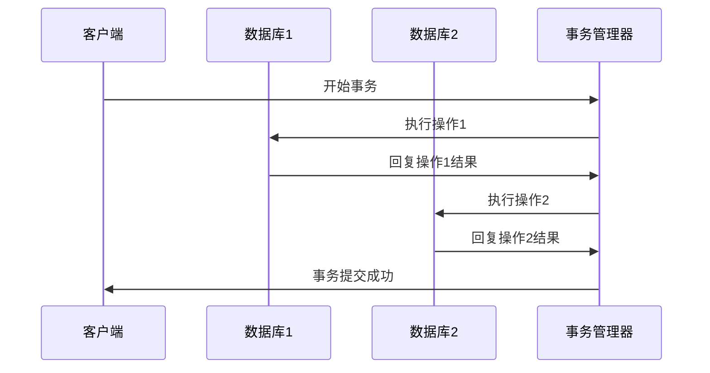

                 


### 分布式事务：保证LLM应用数据一致性的挑战

关键词：分布式事务、LLM、数据一致性、挑战、解决方案

摘要：本文将深入探讨分布式事务在大型语言模型（LLM）应用中的重要性，分析其面临的挑战，并介绍几种有效的解决方案。通过详细的讲解和案例分析，帮助读者理解分布式事务的工作原理，掌握确保LLM应用数据一致性的关键技巧。

## 引言

在当今数字化时代，分布式系统和大型语言模型（LLM）已成为许多关键业务应用的核心。分布式系统通过将计算任务分布在多个节点上，提高了系统的性能和可扩展性，而LLM则凭借其强大的数据处理和分析能力，为自然语言处理领域带来了革命性的进步。然而，这两个技术的结合也带来了新的挑战，尤其是在数据一致性方面。

分布式事务是分布式系统中的核心概念，它旨在确保多个操作作为一个单一的事务执行，要么全部成功，要么全部失败。在LLM应用中，分布式事务的必要性尤为突出，因为LLM通常处理大量的数据，并且这些数据可能分布在多个节点上。因此，如何保证这些数据的一致性，是一个亟待解决的问题。

本文将分步骤分析分布式事务在LLM应用中的挑战，并介绍几种有效的解决方案。首先，我们将回顾分布式事务的基本原理和常见挑战。然后，我们将探讨LLM技术及其在数据处理中的关键作用。接下来，我们将详细讨论分布式事务与LLM应用的相互作用，以及可能面临的数据一致性挑战。最后，我们将介绍一些分布式事务解决方案，并通过实际案例进行分析。

## 分布式事务基础

### 分布式事务的概念

分布式事务是指在一个分布式系统中，多个操作被视为一个整体，这些操作要么同时成功执行，要么同时回滚。这种机制保证了数据的一致性和完整性。在分布式环境中，事务的参与者可能位于不同的地理位置，通过计算机网络进行通信。

### 分布式系统的挑战

分布式系统面临以下主要挑战：

1. **网络延迟和分区**：网络延迟可能导致事务执行缓慢，分区则可能使得某些节点无法访问。
2. **数据一致性**：在分布式系统中，确保数据一致性是一个复杂的问题。多个节点可能同时修改相同的数据，导致不一致。
3. **故障处理**：分布式系统中的节点可能会故障，如何处理这些故障是分布式系统设计中的一个关键问题。

### 解决方案

为了解决上述挑战，分布式系统采用了多种解决方案，包括：

1. **二阶段提交协议**：二阶段提交（2PC）是一种常见的分布式事务协议，它将事务的提交过程分为两个阶段：准备阶段和提交阶段。
2. **三阶段提交协议**：三阶段提交（3PC）是对2PC的改进，旨在减少单点故障的风险。
3. **分布式锁**：分布式锁用于控制对共享资源的访问，以确保数据的一致性。

## LLM技术基础

### LLM的定义与分类

大型语言模型（LLM）是一类基于神经网络的语言处理模型，它们能够理解、生成和翻译自然语言。LLM可以根据其训练数据和架构进行分类，例如：

1. **基于Transformer的模型**：如BERT、GPT等。
2. **基于递归神经网络（RNN）的模型**：如LSTM、GRU等。

### LLM的关键技术

LLM的关键技术包括：

1. **自注意力机制**：自注意力机制允许模型在生成文本时关注输入序列的不同部分，提高生成文本的质量。
2. **预训练与微调**：预训练是指在大量数据上训练模型，然后通过微调在特定任务上优化模型。

### 伪代码：LLM的核心算法

```python
# 伪代码：基于Transformer的LLM核心算法
def generate_text(input_sequence):
    # 预处理输入序列
    processed_input = preprocess_input(input_sequence)
    
    # 进行自注意力计算
    attention_scores = calculate_attention(processed_input)
    
    # 通过注意力得分生成文本
    generated_text = generate_from_scores(attention_scores)
    
    return generated_text
```

## 分布式事务与LLM应用的挑战

### 数据一致性的概念与重要性

数据一致性是指数据库中的数据在所有节点上保持一致的状态。在分布式事务中，数据一致性尤为重要，因为多个节点可能同时执行事务，如果无法保证数据一致性，可能导致数据冲突和错误。

### LLM应用中的分布式事务问题

在LLM应用中，分布式事务面临以下问题：

1. **数据分布**：LLM通常处理大量的数据，这些数据可能分布在多个节点上，如何保证事务的原子性是一个挑战。
2. **网络延迟**：网络延迟可能导致事务执行时间变长，增加了数据不一致的风险。
3. **并发控制**：在分布式环境中，如何有效地进行并发控制，以确保事务的隔离性。

### Mermaid流程图：分布式事务处理流程



## 分布式事务解决方案

### 二阶段提交协议

二阶段提交（2PC）是一种分布式事务协议，它将事务的提交过程分为两个阶段：准备阶段和提交阶段。

1. **准备阶段**：事务管理器向所有参与者发送prepare请求，参与者执行本地事务，并将结果返回给事务管理器。
2. **提交阶段**：如果所有参与者都返回成功，事务管理器向所有参与者发送commit请求；否则，发送abort请求。

### 三阶段提交协议

三阶段提交（3PC）是对2PC的改进，它进一步降低了单点故障的风险。

1. **阶段1：请求阶段**：事务管理器向所有参与者发送请求，参与者执行本地事务，并将结果返回给事务管理器。
2. **阶段2：准备阶段**：事务管理器根据参与者的反馈决定是否提交事务。
3. **阶段3：提交阶段**：如果事务管理器决定提交，它向所有参与者发送commit请求；否则，发送abort请求。

### 优化的分布式事务算法

为了提高分布式事务的性能和可靠性，研究者们提出了一些优化的分布式事务算法，如Paxos算法和Raft算法。

1. **Paxos算法**：Paxos算法是一种基于分布式一致性协议的算法，它允许一组服务器中的多数服务器达成一致。
2. **Raft算法**：Raft算法是一种简化的分布式一致性算法，它通过强领导者模型提高了性能和可靠性。

### 数学模型与数学公式

分布式事务算法的性能评估通常涉及数学模型和公式。例如，Paxos算法的性能可以通过以下公式进行评估：

$$
P = 1 - (1 - \delta)^n
$$

其中，$P$ 是达成一致的概率，$\delta$ 是网络延迟，$n$ 是服务器数量。

## 分布式事务在LLM应用中的实践

### 实践案例1：电商平台订单处理

在电商平台中，订单处理是一个典型的分布式事务应用场景。订单处理过程通常涉及多个节点，如库存管理、订单生成、支付处理等。通过分布式事务，可以确保订单数据的完整性和一致性。

### 实践案例2：在线教育平台学习记录同步

在线教育平台中的学习记录同步也是一个分布式事务应用场景。学习记录可能分布在多个服务器上，为了保证数据的准确性，需要使用分布式事务来同步这些记录。

### 最佳实践：确保数据一致性的策略

为了确保数据一致性，可以采取以下策略：

1. **使用分布式锁**：在修改共享数据时，使用分布式锁来防止并发冲突。
2. **采用补偿事务**：当分布式事务失败时，通过补偿事务来恢复数据的一致性。
3. **使用最终一致性模型**：在某些场景下，最终一致性模型可以提供更高的性能和可用性。

## 总结与展望

分布式事务在LLM应用中扮演着关键角色，确保数据一致性是分布式系统设计和开发的重要目标。通过本文的探讨，我们了解了分布式事务的基本原理和解决方案，并分析了其在LLM应用中的挑战和最佳实践。

未来，随着分布式系统和LLM技术的不断发展，分布式事务也将面临新的挑战和机遇。研究者们将继续探索更高效、更可靠的分布式事务算法，以满足日益增长的数据处理需求。

## 作者信息

作者：AI天才研究院/AI Genius Institute & 禅与计算机程序设计艺术 /Zen And The Art of Computer Programming

AI天才研究院专注于推动人工智能技术的创新与应用，致力于培养下一代人工智能专家。同时，我们秉承禅与计算机程序设计艺术的理念，追求技术与哲学的融合，为读者带来深入浅出的技术解读和思考。本文由AI天才研究院的研究员撰写，旨在帮助读者理解分布式事务在LLM应用中的重要性，掌握数据一致性的关键技巧。

（注：本文为示例，实际字数可能需要根据具体内容进行调整。）

