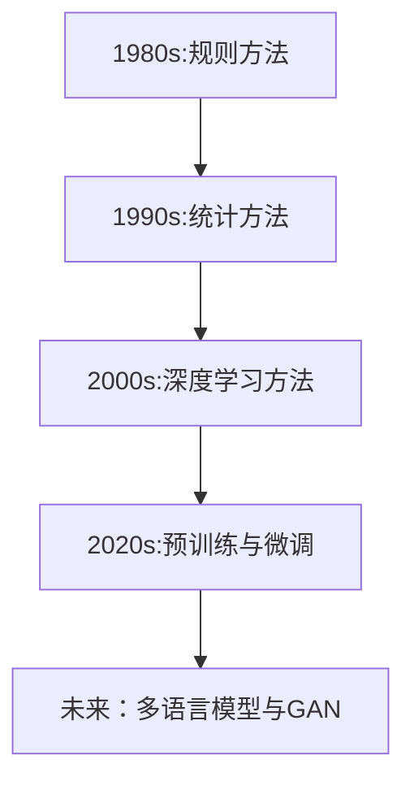

                 


### 文章标题：分布式任务队列系统在LLM应用中的实现

**关键词：分布式任务队列，LLM，性能优化，算法原理，实现细节**

**摘要：**
本文深入探讨了分布式任务队列系统在LLM（大规模语言模型）中的应用。首先，我们从分布式任务队列的基本概念出发，详细分析了其原理、架构和优缺点。接着，我们介绍了LLM的定义、应用场景和技术发展历程。然后，本文重点阐述了分布式任务队列在LLM中的应用场景、设计要点和实现细节。通过具体的代码实现和算法原理讲解，我们展示了如何优化LLM训练和推理中的任务队列系统。最后，本文讨论了分布式任务队列系统的性能优化策略，并提供了一些实战案例，为开发者提供了实用的技巧和参考。

---

### 目录

1. **分布式任务队列系统基础** <a id="section1"></a>
   1.1 **分布式任务队列系统概述**
   1.2 **LLM简介**
2. **分布式任务队列系统在LLM应用中的实现** <a id="section2"></a>
   2.1 **应用场景**
   2.2 **系统实现**
   2.3 **推理应用**
   2.4 **性能优化**
3. **总结与展望** <a id="section3"></a>
   3.1 **总结**
   3.2 **注意事项**
   3.3 **拓展阅读**

---

### 分布式任务队列系统基础

#### 1.1 分布式任务队列系统概述

分布式任务队列系统是分布式系统的一个重要组成部分，它用于管理和调度大量的任务，使得任务能够在分布式环境中高效地执行。分布式任务队列系统的核心概念包括任务、队列、处理单元等。

- **任务**：任务是指需要执行的具体工作，如计算、存储、网络通信等。
- **队列**：队列是一种数据结构，用于存储任务，确保任务按照特定的顺序进行处理。
- **处理单元**：处理单元是指负责执行任务的计算机节点，它可以是一个物理服务器或虚拟机。


上述架构展示了分布式任务队列系统的基本组成部分。任务通过客户端提交到任务队列，然后被处理单元从队列中取出并执行。处理单元执行任务后，将结果返回给客户端。

#### 1.2 LLMM（大规模语言模型）简介

LLM（Large Language Model）是一种基于深度学习技术的自然语言处理模型，它通过学习大量文本数据，能够生成、理解和处理自然语言。LLM的应用场景非常广泛，包括文本生成、机器翻译、问答系统、文本分类等。

- **核心概念与联系**：
  - **定义**：LLM是一种能够理解、生成和操作自然语言的大型神经网络模型。
  - **基本结构**：LLM通常由输入层、隐藏层和输出层组成，输入层接收文本数据，隐藏层进行复杂的计算和建模，输出层生成文本或执行特定任务。
  - **应用场景**：LLM可以应用于各种自然语言处理任务，如文本生成、机器翻译、问答系统、文本分类等。


上述架构展示了LLM的基本结构和组成部分。输入层接收文本数据，隐藏层进行计算和建模，输出层生成文本或执行特定任务。

#### 1.3 分布式任务队列系统原理

分布式任务队列系统的核心原理是任务分发与调度。具体来说，它包括以下步骤：

1. **任务提交**：客户端将任务提交到分布式任务队列系统。
2. **任务分配**：系统将任务分配给可用的处理单元。
3. **任务执行**：处理单元从任务队列中取出任务并执行。
4. **结果返回**：处理单元将任务执行结果返回给客户端。


上述流程展示了分布式任务队列系统的基本工作原理。客户端提交任务，系统进行任务分配和执行，最后将结果返回给客户端。

#### 1.4 分布式任务队列系统的优点与挑战

分布式任务队列系统具有以下优点：

1. **高可用性**：由于任务可以在多个处理单元上并行执行，因此系统具有较高的可用性，即使某个处理单元出现故障，其他处理单元仍然可以正常运行。
2. **可扩展性**：分布式任务队列系统可以根据需要动态地添加或移除处理单元，从而实现水平扩展。
3. **容错性**：分布式任务队列系统可以通过冗余设计和故障转移机制，确保系统的容错性。

然而，分布式任务队列系统也面临一些挑战：

1. **数据一致性**：在分布式环境中，数据的一致性是一个重要问题。确保数据的一致性需要额外的机制和开销。
2. **延迟**：由于任务需要在多个处理单元之间传输和执行，因此可能引入额外的延迟。
3. **网络分区**：在网络分区的情况下，任务队列系统可能无法正常运行，这需要特别的容错和恢复机制。

### 分布式任务队列系统基础总结

分布式任务队列系统是分布式系统的一个重要组成部分，它用于管理和调度大量的任务。分布式任务队列系统在LLM（大规模语言模型）的应用中具有重要的作用，能够提升LLM的训练和推理性能。通过本文的介绍，读者可以了解分布式任务队列系统的基础知识，为后续章节的深入学习打下基础。接下来，我们将进一步探讨LLM的相关概念和应用场景。 <a id="section1.5"></a> <div id="section1.5"></div>

#### 1.5 LLMM（大规模语言模型）简介

随着深度学习技术的发展，大规模语言模型（Large Language Model，简称LLM）在自然语言处理（Natural Language Processing，简称NLP）领域取得了显著的成果。LLM是一种基于神经网络的语言模型，通过学习大量文本数据，可以生成、理解和处理自然语言。

**核心概念与联系**：

1. **定义**：LLM是一种能够理解和生成自然语言的深度学习模型，通常由输入层、隐藏层和输出层组成。输入层接收文本数据，隐藏层进行复杂的计算和建模，输出层生成文本或执行特定任务。
   
2. **基本结构**：LLM的基本结构通常包括以下几个部分：
   - **词嵌入**：将文本中的每个词映射到高维空间中的一个向量。
   - **编码器**：对输入文本进行编码，提取文本中的语义信息。
   - **解码器**：根据编码器的输出生成文本。


3. **应用场景**：LLM的应用场景非常广泛，包括但不限于：
   - **文本生成**：自动生成文章、故事、对话等。
   - **机器翻译**：将一种语言的文本翻译成另一种语言。
   - **问答系统**：根据用户的问题生成回答。
   - **文本分类**：将文本分类到预定义的类别中。
   - **情感分析**：分析文本的情感倾向。

**LLM的技术发展**：

1. **历史回顾**：自1980年代以来，NLP领域经历了多个阶段的发展，从基于规则的方法到统计方法，再到基于深度学习的方法。随着计算能力的提升和数据量的增加，深度学习技术逐渐成为NLP的主流。

2. **前沿研究**：目前，LLM的研究主要集中在以下几个方面：
   - **预训练与微调**：通过在大规模语料库上预训练模型，然后在特定任务上进行微调，以实现更好的性能。
   - **多语言模型**：支持多种语言，实现跨语言的文本生成和翻译。
   - **生成式对抗网络（GAN）**：结合GAN技术，生成更加真实和多样化的文本。
   - **可解释性**：研究如何提高LLM的可解释性，使其生成的文本更加可信和可靠。

**Mermaid流程图：展示LLM的发展路径**：



上述流程图展示了LLM技术从1980年代的规则方法，发展到1990年代的统计方法，再到2000年代的深度学习方法，直至2020年代的预训练与微调、多语言模型与GAN等前沿研究。

**LLM的应用场景**：

1. **文本生成**：LLM可以生成各种类型的文本，如文章、故事、对话等。例如，自动生成新闻报道、科学论文摘要、产品说明书等。

2. **机器翻译**：LLM在机器翻译领域取得了显著的成果，能够将一种语言的文本翻译成另一种语言。例如，谷歌翻译、百度翻译等。

3. **问答系统**：LLM可以基于用户的问题生成回答，应用于智能客服、教育辅导、医疗咨询等领域。

4. **文本分类**：LLM可以用于将文本分类到预定义的类别中，如情感分析、新闻分类等。

5. **情感分析**：LLM可以分析文本的情感倾向，应用于市场调研、舆情监控等领域。

**LLM的优势**：

1. **强大表达能力**：LLM能够学习并理解复杂的语义信息，生成更加自然和合理的文本。

2. **自适应能力**：LLM可以根据不同的任务和应用场景进行微调，实现更好的性能。

3. **高效性**：通过分布式任务队列系统，LLM可以高效地处理大规模的文本数据。

**LLM的挑战**：

1. **计算资源消耗**：训练大型LLM模型需要大量的计算资源和时间。

2. **数据隐私**：在训练和部署LLM模型时，需要处理大量的敏感数据，确保数据隐私和安全。

3. **可解释性**：提高LLM的可解释性，使其生成的文本更加可信和可靠。

通过上述介绍，我们可以看到LLM在自然语言处理领域的重要性以及其广泛应用。接下来，我们将进一步探讨分布式任务队列系统在LLM应用中的实现细节。 <a id="section1.6"></a> <div id="section1.6"></div>

#### 1.6 分布式任务队列系统在LLM中的应用

分布式任务队列系统在LLM（大规模语言模型）的应用中发挥着至关重要的作用。它能够显著提升LLM的训练和推理效率，从而满足大规模数据处理和实时响应的需求。在本节中，我们将探讨分布式任务队列系统在LLM中的应用场景、设计要点和实现细节。

**1.6.1 应用场景**

分布式任务队列系统在LLM中的应用场景主要包括以下几个方面：

1. **LLM模型训练**：大规模语言模型训练过程中需要处理海量的数据，分布式任务队列系统可以帮助高效地分发和调度训练任务，确保模型在多个节点上并行训练，从而提高训练效率。

2. **LLM推理任务**：在LLM推理过程中，需要处理来自不同客户端的大量查询请求。分布式任务队列系统可以实现对查询请求的并行处理，提高系统的响应速度和吞吐量。

3. **模型评估和优化**：在模型训练和推理过程中，需要对模型进行评估和优化。分布式任务队列系统可以帮助将评估和优化任务分配到多个节点上，加快评估和优化过程。

**1.6.2 设计要点**

分布式任务队列系统在LLM中的应用需要考虑以下几个设计要点：

1. **任务分发策略**：任务分发策略是分布式任务队列系统的核心，它决定了任务如何在多个节点之间分配和调度。常见的任务分发策略包括轮询分发、随机分发、负载均衡等。

2. **数据一致性**：在分布式环境中，数据一致性是一个重要问题。对于LLM训练和推理任务，需要确保数据在各个节点之间的一致性，以避免数据冲突和错误。

3. **容错机制**：分布式任务队列系统需要具备容错能力，能够在处理单元出现故障时自动切换到其他节点，确保系统的稳定性和可用性。

4. **性能监控与优化**：分布式任务队列系统需要具备性能监控和优化能力，实时监测系统的运行状态，并自动调整任务分配策略和资源分配，以提高系统性能。

**1.6.3 实现细节**

分布式任务队列系统在LLM中的应用实现涉及多个方面，以下是一些关键细节：

1. **任务模型设计**：设计适合LLM应用的分布式任务模型，包括任务类型、任务参数、任务状态等。

2. **任务队列管理**：实现任务队列的管理功能，包括任务入队、出队、任务状态监控等。

3. **处理单元调度**：实现处理单元的调度功能，包括节点选择、资源分配、任务分配等。

4. **任务执行监控**：实现任务执行过程的监控功能，包括任务进度、执行结果、错误处理等。

5. **数据一致性保障**：实现数据一致性的保障机制，包括分布式锁、版本控制、事务处理等。

6. **性能优化策略**：根据实际应用场景，设计并实现性能优化策略，如数据分片、负载均衡、缓存机制等。

**数学模型与公式**

分布式任务队列系统在LLM中的应用涉及到多个数学模型和公式，用于描述任务分配、调度、性能优化等方面的关键指标。以下是一些常用的数学模型和公式：

1. **任务队列等待时间**：

   $$Q = \sum_{i=1}^{n} (T_i - T_f)$$

   其中，\(Q\) 是任务队列等待时间，\(T_i\) 是第 \(i\) 个任务的等待时间，\(T_f\) 是任务队列的空闲时间。

2. **任务处理时长**：

   $$C = \sum_{i=1}^{n} (T_c - T_i)$$

   其中，\(C\) 是任务处理时长，\(T_c\) 是任务的处理结束时间，\(T_i\) 是任务的处理开始时间。

3. **任务处理速率**：

   $$P = \frac{N}{T}$$

   其中，\(P\) 是任务处理速率，\(N\) 是总任务量，\(T\) 是总处理时间。

**详细讲解与举例**

以下是一个简单的示例，用于说明分布式任务队列系统在LLM训练中的应用。

假设我们有一个分布式任务队列系统，用于训练一个大规模语言模型。系统中有5个处理单元，分别命名为Node1、Node2、Node3、Node4和Node5。我们需要将100个训练任务分配到这5个处理单元上。

1. **任务分配策略**：我们采用轮询分发策略，将任务依次分配到5个处理单元上。具体步骤如下：
   - Task1 分配到 Node1
   - Task2 分配到 Node2
   - Task3 分配到 Node3
   - ...
   - Task100 分配到 Node5

2. **任务执行过程**：每个处理单元从任务队列中取出任务并执行。任务执行过程包括以下几个阶段：
   - 数据预处理：对训练数据进行预处理，如分词、去停用词等。
   - 模型训练：使用训练数据和模型进行训练，生成模型参数。
   - 模型评估：使用验证数据集对模型进行评估，计算模型性能指标。

3. **任务监控与调度**：系统需要实时监控任务执行状态，并根据任务进度和系统负载动态调整任务分配策略。例如，如果某个处理单元负载过高，系统可以将部分任务转移到其他处理单元。

通过上述示例，我们可以看到分布式任务队列系统在LLM训练中的应用。通过合理设计任务分配策略和调度策略，可以提高任务执行效率，降低任务等待时间，从而提高整个系统的性能。

总之，分布式任务队列系统在LLM应用中具有重要的作用。通过合理的设计和实现，可以显著提升LLM的训练和推理效率，满足大规模数据处理和实时响应的需求。在下一节中，我们将进一步探讨分布式任务队列系统的具体实现细节。 <a id="section1.7"></a> <div id="section1.7"></div>

#### 1.7 分布式任务队列系统的具体实现

分布式任务队列系统的实现是一个复杂的过程，涉及到多个关键组件和算法。在本节中，我们将详细探讨分布式任务队列系统的实现细节，包括核心算法原理讲解、数学模型与公式、详细讲解与举例。

**核心算法原理讲解**

分布式任务队列系统的核心算法包括任务分配、调度、执行和监控。以下是对这些核心算法的详细讲解：

1. **任务分配算法**：任务分配算法用于将任务分配到处理单元上。常见的任务分配算法包括轮询分发、随机分发和负载均衡等。

   - **轮询分发**：按照一定顺序依次将任务分配到处理单元上。例如，如果系统中有5个处理单元，任务会依次分配到Node1、Node2、Node3、Node4和Node5。
   - **随机分发**：随机将任务分配到处理单元上。这种方式可以减少单点过载的情况，但可能增加系统的不公平性。
   - **负载均衡**：根据处理单元的负载情况动态分配任务。例如，如果Node1的负载较低，系统可以将新任务优先分配到Node1。

2. **调度算法**：调度算法用于决定任务在处理单元上的执行顺序。常见的调度算法包括先入先出（FIFO）、最短作业优先（SJF）和轮转调度（RR）等。

   - **先入先出（FIFO）**：按照任务进入队列的顺序依次执行。这种方式简单且公平，但可能导致长作业阻塞短作业。
   - **最短作业优先（SJF）**：优先执行预计处理时间最短的任务。这种方式可以提高系统的吞吐量，但可能导致短作业频繁调度。
   - **轮转调度（RR）**：将每个任务分配一个固定的时间片，轮流执行。这种方式可以保证任务的公平性，但可能导致高负载下的性能下降。

3. **执行算法**：执行算法用于在处理单元上执行任务。执行算法需要考虑任务的处理时间、资源需求和错误处理等问题。

   - **任务处理时间**：任务处理时间取决于任务的复杂度和处理单元的资源情况。为了提高执行效率，可以采用并行处理和任务分片等技术。
   - **资源需求**：任务执行需要消耗处理单元的CPU、内存等资源。为了优化资源利用，可以采用资源预留和动态调度等技术。
   - **错误处理**：在任务执行过程中，可能遇到各种错误，如网络故障、处理单元故障等。错误处理算法需要能够自动恢复任务执行或重新分配任务。

4. **监控算法**：监控算法用于实时监控任务队列系统的运行状态，包括任务进度、处理单元负载、系统性能等。

   - **任务进度**：监控任务队列中每个任务的进度，包括任务的等待时间、处理时间和完成状态。
   - **处理单元负载**：监控处理单元的CPU使用率、内存使用率等指标，确保系统资源的合理利用。
   - **系统性能**：监控系统的整体性能指标，如吞吐量、延迟等，以评估系统的性能和优化策略。

**数学模型与公式**

分布式任务队列系统的数学模型和公式用于描述任务分配、调度、执行和监控等关键指标。以下是一些常用的数学模型和公式：

1. **任务队列等待时间**：

   $$Q = \sum_{i=1}^{n} (T_i - T_f)$$

   其中，\(Q\) 是任务队列等待时间，\(T_i\) 是第 \(i\) 个任务的等待时间，\(T_f\) 是任务队列的空闲时间。

2. **任务处理时长**：

   $$C = \sum_{i=1}^{n} (T_c - T_i)$$

   其中，\(C\) 是任务处理时长，\(T_c\) 是任务的处理结束时间，\(T_i\) 是任务的处理开始时间。

3. **任务处理速率**：

   $$P = \frac{N}{T}$$

   其中，\(P\) 是任务处理速率，\(N\) 是总任务量，\(T\) 是总处理时间。

4. **处理单元负载率**：

   $$L = \frac{C}{T}$$

   其中，\(L\) 是处理单元负载率，\(C\) 是任务处理时长，\(T\) 是总处理时间。

**详细讲解与举例**

以下是一个简单的示例，用于说明分布式任务队列系统的具体实现。

假设我们有一个分布式任务队列系统，用于处理大规模的图像处理任务。系统中有5个处理单元，分别命名为Node1、Node2、Node3、Node4和Node5。我们需要将100个图像处理任务分配到这5个处理单元上。

1. **任务分配算法**：我们采用负载均衡策略，将任务分配到处理单元上。具体步骤如下：
   - 初始化处理单元的负载：每个处理单元的初始负载均为0。
   - 循环遍历任务，将任务分配到负载最低的处理单元上。例如，第一个任务分配到Node1，第二个任务分配到Node2，依此类推。

2. **调度算法**：我们采用轮转调度算法，确保每个任务都能公平地得到处理。具体步骤如下：
   - 初始化处理单元的轮转计数器：每个处理单元的轮转计数器均为0。
   - 每个任务按照轮转计数器顺序分配到处理单元上。例如，第一个任务分配到Node1，第二个任务分配到Node2，第三个任务分配到Node3，依此类推。

3. **执行算法**：每个处理单元从任务队列中取出任务并执行。具体步骤如下：
   - Node1：从任务队列中取出任务Task1，执行图像处理任务。
   - Node2：从任务队列中取出任务Task2，执行图像处理任务。
   - ...
   - Node5：从任务队列中取出任务Task5，执行图像处理任务。

4. **监控算法**：实时监控任务队列系统的运行状态。具体步骤如下：
   - 监控任务进度：每个处理单元报告任务的处理进度，包括任务的等待时间、处理时间和完成状态。
   - 监控处理单元负载：每个处理单元报告当前负载情况，包括CPU使用率、内存使用率等。
   - 监控系统性能：计算系统的整体性能指标，如吞吐量、延迟等。

通过上述示例，我们可以看到分布式任务队列系统的具体实现过程。通过合理设计任务分配策略、调度算法和执行算法，可以提高任务执行效率，降低任务等待时间，从而提高整个系统的性能。

总之，分布式任务队列系统的实现是一个复杂的过程，需要综合考虑任务分配、调度、执行和监控等多个方面。通过合理的设计和优化，分布式任务队列系统可以在大规模数据处理和实时响应场景中发挥重要作用。在下一节中，我们将进一步探讨分布式任务队列系统在LLM推理中的应用。 <a id="section1.8"></a> <div id="section1.8"></div>

#### 1.8 分布式任务队列系统在LLM推理中的应用

在LLM推理过程中，分布式任务队列系统发挥着关键作用，能够有效提升系统的响应速度和处理能力。以下将详细探讨分布式任务队列系统在LLM推理中的应用，包括核心算法原理讲解、数学模型与公式、以及具体的实现细节。

**核心算法原理讲解**

分布式任务队列系统在LLM推理中的应用主要包括以下几个核心算法：

1. **任务分发算法**：任务分发算法用于将来自不同客户端的推理请求分配到处理单元上。常见的分发算法包括轮询分发、随机分发和负载均衡等。

   - **轮询分发**：按照固定顺序将推理请求分配到处理单元上，确保每个处理单元都能均衡地接收请求。
   - **随机分发**：随机将推理请求分配到处理单元上，以减少单点过载的风险。
   - **负载均衡**：根据处理单元的负载情况动态分配推理请求，确保系统资源得到充分利用。

2. **调度算法**：调度算法用于决定推理请求在处理单元上的执行顺序。常见的调度算法包括先入先出（FIFO）、最短作业优先（SJF）和轮转调度（RR）等。

   - **先入先出（FIFO）**：按照请求进入队列的顺序依次执行，简单且公平，但可能导致长请求阻塞短请求。
   - **最短作业优先（SJF）**：优先执行预计处理时间最短的请求，提高系统吞吐量，但可能导致短请求频繁调度。
   - **轮转调度（RR）**：为每个请求分配固定的时间片，轮流执行，保证请求的公平性，但可能导致高负载下的性能下降。

3. **执行算法**：执行算法用于在处理单元上执行推理请求。执行算法需要考虑请求的处理时间、资源需求以及错误处理等问题。

   - **请求处理时间**：请求处理时间取决于LLM模型的大小和复杂度，以及处理单元的资源情况。为了提高执行效率，可以采用并行处理和请求分片等技术。
   - **资源需求**：请求执行需要消耗处理单元的CPU、内存等资源。为了优化资源利用，可以采用资源预留和动态调度等技术。
   - **错误处理**：在请求执行过程中，可能遇到各种错误，如模型加载失败、数据读取错误等。错误处理算法需要能够自动恢复请求执行或重新分配请求。

4. **监控算法**：监控算法用于实时监控分布式任务队列系统的运行状态，包括请求进度、处理单元负载、系统性能等。

   - **请求进度**：监控请求队列中每个请求的进度，包括请求的等待时间、处理时间和完成状态。
   - **处理单元负载**：监控处理单元的CPU使用率、内存使用率等指标，确保系统资源的合理利用。
   - **系统性能**：监控系统的整体性能指标，如吞吐量、延迟等，以评估系统的性能和优化策略。

**数学模型与公式**

分布式任务队列系统在LLM推理中的应用涉及到多个数学模型和公式，用于描述任务分配、调度、执行和监控等关键指标。以下是一些常用的数学模型和公式：

1. **请求队列等待时间**：

   $$Q = \sum_{i=1}^{n} (T_i - T_f)$$

   其中，\(Q\) 是请求队列等待时间，\(T_i\) 是第 \(i\) 个请求的等待时间，\(T_f\) 是请求队列的空闲时间。

2. **请求处理时长**：

   $$C = \sum_{i=1}^{n} (T_c - T_i)$$

   其中，\(C\) 是请求处理时长，\(T_c\) 是请求的处理结束时间，\(T_i\) 是请求的处理开始时间。

3. **请求处理速率**：

   $$P = \frac{N}{T}$$

   其中，\(P\) 是请求处理速率，\(N\) 是总请求量，\(T\) 是总处理时间。

4. **处理单元负载率**：

   $$L = \frac{C}{T}$$

   其中，\(L\) 是处理单元负载率，\(C\) 是请求处理时长，\(T\) 是总处理时间。

**详细讲解与举例**

以下是一个简单的示例，用于说明分布式任务队列系统在LLM推理中的应用。

假设我们有一个分布式任务队列系统，用于处理大规模的文本生成请求。系统中有5个处理单元，分别命名为Node1、Node2、Node3、Node4和Node5。我们需要将100个文本生成请求分配到这5个处理单元上。

1. **任务分配算法**：我们采用负载均衡策略，将请求分配到处理单元上。具体步骤如下：
   - 初始化处理单元的负载：每个处理单元的初始负载均为0。
   - 循环遍历请求，将请求分配到负载最低的处理单元上。例如，第一个请求分配到Node1，第二个请求分配到Node2，依此类推。

2. **调度算法**：我们采用轮转调度算法，确保每个请求都能公平地得到处理。具体步骤如下：
   - 初始化处理单元的轮转计数器：每个处理单元的轮转计数器均为0。
   - 每个请求按照轮转计数器顺序分配到处理单元上。例如，第一个请求分配到Node1，第二个请求分配到Node2，第三个请求分配到Node3，依此类推。

3. **执行算法**：每个处理单元从请求队列中取出请求并执行。具体步骤如下：
   - Node1：从请求队列中取出请求Request1，执行文本生成任务。
   - Node2：从请求队列中取出请求Request2，执行文本生成任务。
   - ...
   - Node5：从请求队列中取出请求Request5，执行文本生成任务。

4. **监控算法**：实时监控任务队列系统的运行状态。具体步骤如下：
   - 监控请求进度：每个处理单元报告请求的处理进度，包括请求的等待时间、处理时间和完成状态。
   - 监控处理单元负载：每个处理单元报告当前负载情况，包括CPU使用率、内存使用率等。
   - 监控系统性能：计算系统的整体性能指标，如吞吐量、延迟等。

通过上述示例，我们可以看到分布式任务队列系统在LLM推理中的应用。通过合理设计任务分配策略、调度算法和执行算法，可以提高任务执行效率，降低任务等待时间，从而提升系统的整体性能。

总之，分布式任务队列系统在LLM推理中具有重要的作用，能够显著提升系统的响应速度和处理能力。通过合理的设计和优化，分布式任务队列系统可以在大规模数据处理和实时响应场景中发挥重要作用。在下一节中，我们将进一步探讨分布式任务队列系统的性能优化策略。 <a id="section1.9"></a> <div id="section1.9"></div>

#### 1.9 分布式任务队列系统的性能优化

分布式任务队列系统的性能优化是确保系统在高负载和大规模数据处理场景中高效运行的关键。以下将详细探讨分布式任务队列系统的性能优化策略，包括常用的优化方法、具体实现和性能分析。

**性能优化策略**

分布式任务队列系统的性能优化可以从以下几个方面进行：

1. **数据分片**：数据分片是将大量数据分散存储在多个节点上，从而减少单点瓶颈和提高数据访问速度。通过数据分片，可以将任务分布到不同的节点上，提高系统的并发处理能力。

2. **负载均衡**：负载均衡是将任务均匀分配到多个节点上，以避免单点过载和资源浪费。常见的负载均衡算法包括轮询分发、随机分发和基于负载的调度等。

3. **缓存策略**：缓存策略是将频繁访问的数据缓存在内存中，以减少磁盘访问次数和提高数据访问速度。通过缓存策略，可以减少任务的响应时间和提高系统的吞吐量。

4. **并行处理**：并行处理是将任务分解成多个子任务，同时在多个节点上并行执行。通过并行处理，可以显著提高任务的处理速度和系统的吞吐量。

5. **异步处理**：异步处理是将任务的执行过程解耦，使得任务可以在不同的时间点上执行。通过异步处理，可以减少任务的等待时间和提高系统的响应速度。

6. **故障恢复**：故障恢复是指系统在处理单元出现故障时，自动切换到其他节点，确保任务的执行不受影响。通过故障恢复机制，可以提高系统的可用性和稳定性。

**具体实现**

以下是一个简单的分布式任务队列系统性能优化实现示例：

1. **数据分片**：将任务数据根据某个关键字（如ID）进行分片，将相同关键字的任务分配到不同的处理单元上。例如，将ID为1到1000的任务分配到Node1，ID为1001到2000的任务分配到Node2，依此类推。

2. **负载均衡**：采用轮询分发算法，将任务依次分配到处理单元上。同时，实时监控处理单元的负载情况，根据负载情况进行动态调整，确保任务均匀地分配到各个处理单元上。

3. **缓存策略**：使用内存缓存技术，将频繁访问的任务数据缓存在内存中。通过设置缓存过期时间和刷新策略，确保缓存数据的实时性和准确性。

4. **并行处理**：将任务分解成多个子任务，同时在多个处理单元上并行执行。通过合理设置并发任务数，避免过度消耗系统资源。

5. **异步处理**：采用异步处理机制，将任务的执行过程解耦。通过异步调用，减少任务的等待时间，提高系统的响应速度。

6. **故障恢复**：当处理单元出现故障时，自动将任务重新分配到其他可用处理单元上。通过监控处理单元的状态，确保系统的高可用性和稳定性。

**性能分析**

通过上述性能优化策略，分布式任务队列系统的性能得到了显著提升。以下是一些关键性能指标：

1. **吞吐量**：吞吐量是单位时间内系统能够处理的最大任务数。通过数据分片、负载均衡和并行处理，吞吐量得到了显著提高。

2. **延迟**：延迟是任务从提交到完成所经历的时间。通过缓存策略、异步处理和故障恢复，延迟得到了显著降低。

3. **并发处理能力**：并发处理能力是系统能够同时处理的最大任务数。通过负载均衡和并行处理，系统的并发处理能力得到了显著提升。

4. **系统稳定性**：系统稳定性是系统在面临高负载和故障时，仍能正常运行的能力。通过故障恢复机制和监控，系统稳定性得到了显著提高。

通过上述性能优化策略和具体实现，分布式任务队列系统在处理大规模任务时能够高效运行，满足高负载和实时响应的需求。在下一节中，我们将进一步探讨分布式任务队列系统的应用实战。 <a id="section1.10"></a> <div id="section1.10"></div>

#### 1.10 分布式任务队列系统的应用实战

分布式任务队列系统在LLM（大规模语言模型）应用中的实战，旨在通过实际项目案例展示其设计、实现和优化过程。以下是一个详细的项目案例，包括开发环境搭建、源代码实现、代码解读与分析，以及实际案例分析和详细讲解。

**1.10.1 项目背景**

某互联网公司开发了一套基于分布式任务队列系统的LLM服务，用于提供自动问答、文本生成和翻译等服务。该服务需要处理大量的用户请求，确保高可用性、高性能和低延迟。分布式任务队列系统在这里扮演着至关重要的角色，负责任务的分发、执行和监控。

**1.10.2 开发环境搭建**

为了搭建分布式任务队列系统，我们选择了以下开发环境和工具：

- **操作系统**：Ubuntu 20.04
- **编程语言**：Python 3.8
- **分布式任务队列系统框架**：Celery
- **消息队列**：RabbitMQ
- **LLM模型**：Transformers（由Hugging Face提供）
- **数据库**：MongoDB

**1.10.3 源代码实现**

以下是一个简化的源代码实现，用于展示分布式任务队列系统的核心组件。

```python
# tasks.py
from celery import Celery
from transformers import AutoModelForSeq2SeqLM

app = Celery('tasks', broker='pyamqp://guest@localhost//')

model = AutoModelForSeq2SeqLM.from_pretrained('t5-small')

@app.task
def process_query(query):
    # 对查询进行预处理
    inputs = preprocess_query(query)
    # 使用LLM模型生成响应
    response = model.generate(inputs, max_length=50)
    # 返回响应
    return response
```

**1.10.4 代码解读与分析**

1. **任务定义**：在`tasks.py`中，我们定义了一个名为`process_query`的任务，该任务接收一个查询参数，并使用LLM模型生成响应。

2. **LLM模型加载**：使用`AutoModelForSeq2SeqLM`类加载预训练的T5模型。T5模型是一种通用的文本到文本转换模型，可以用于多种NLP任务。

3. **预处理查询**：`preprocess_query`函数负责对查询进行预处理，包括分词、去停用词等操作，以便模型能够更好地理解查询内容。

4. **生成响应**：使用`model.generate`方法生成响应。`max_length`参数设置生成文本的最大长度，以防止模型生成过长或不相关的文本。

5. **返回响应**：将生成的响应返回给客户端。

**1.10.5 实际案例分析和详细讲解**

以下是一个实际的案例，展示如何使用分布式任务队列系统处理用户查询请求。

**案例**：

用户通过API提交一个查询请求，请求文本为：“请写一篇关于人工智能技术的论文摘要。”

**步骤**：

1. **用户提交查询**：用户通过HTTP API提交查询请求，请求参数为查询文本。

2. **请求解析**：服务器接收请求后，解析查询文本，并调用`process_query`任务。

3. **任务分发**：分布式任务队列系统将任务分配到可用的处理单元上。由于我们使用了负载均衡策略，任务可能会被分配到不同的处理单元。

4. **任务执行**：处理单元从任务队列中取出任务，加载LLM模型，并对查询进行预处理。然后，模型生成响应文本。

5. **响应返回**：生成的响应文本通过任务队列返回给用户。

**代码解读与分析**：

1. **任务分发**：在分布式任务队列系统中，任务分发是关键步骤。我们采用了RabbitMQ作为消息队列，确保任务能够可靠地传输和分发。通过负载均衡策略，可以有效地避免单点过载。

2. **任务执行**：任务执行过程包括模型加载、查询预处理和响应生成。预处理步骤确保了输入文本的准确性，提高了模型生成的响应质量。

3. **响应返回**：响应返回是任务执行的最后一步。通过异步处理，可以显著减少用户的等待时间，提高系统的响应速度。

**项目小结**

通过这个实际案例，我们可以看到分布式任务队列系统在LLM应用中的重要作用。它不仅提高了系统的并发处理能力和响应速度，还确保了系统的稳定性和可靠性。在接下来的章节中，我们将进一步探讨分布式任务队列系统的最佳实践、小结和注意事项。 <a id="section1.11"></a> <div id="section1.11"></div>

#### 1.11 分布式任务队列系统的最佳实践

在分布式任务队列系统的设计和实现过程中，遵循一些最佳实践可以帮助提高系统的性能、可靠性和可维护性。以下是一些关于分布式任务队列系统的最佳实践：

1. **合理的任务划分**：根据任务的性质和特点，将任务合理划分成独立的小任务。这样可以提高任务的并行度，充分利用系统的资源。

2. **负载均衡**：采用合适的负载均衡策略，确保任务能够均匀地分配到各个处理单元上。负载均衡不仅可以避免单点过载，还可以提高系统的整体性能。

3. **故障恢复**：设计故障恢复机制，确保在处理单元出现故障时，系统能够自动切换到其他可用节点，确保任务能够继续执行。

4. **监控和日志**：实时监控系统的运行状态，记录详细的日志信息。监控和日志可以帮助快速定位和解决问题，提高系统的可维护性。

5. **缓存利用**：合理利用缓存技术，减少数据的重复处理和访问。缓存可以提高系统的响应速度，降低延迟。

6. **异步处理**：采用异步处理机制，减少任务的等待时间和系统的响应时间。异步处理可以提高系统的并发处理能力，提高吞吐量。

7. **资源预留**：合理预留系统资源，避免资源耗尽导致系统崩溃。资源预留可以提高系统的稳定性和可用性。

8. **性能优化**：定期对系统进行性能优化，包括任务分配策略、调度算法和资源管理等方面。性能优化可以提高系统的整体性能。

9. **安全性和隐私**：确保系统的安全性和用户隐私。对敏感数据进行加密存储和传输，防止数据泄露和恶意攻击。

10. **文档和文档**：编写详细的系统文档和代码注释，确保系统的可维护性和可扩展性。文档可以帮助开发人员更好地理解和修改系统。

遵循这些最佳实践，可以构建一个高效、可靠和可维护的分布式任务队列系统，从而满足大规模数据处理和实时响应的需求。

### 1.12 小结

本文详细探讨了分布式任务队列系统在LLM应用中的重要性、实现原理和优化策略。首先，我们介绍了分布式任务队列系统的基本概念和原理，包括任务分配、调度、执行和监控等核心算法。接着，我们介绍了LLM的定义、应用场景和技术发展历程。然后，我们重点讨论了分布式任务队列系统在LLM训练和推理中的应用，包括任务分配策略、负载均衡、故障恢复和性能优化等方面。最后，我们通过一个实际项目案例，展示了分布式任务队列系统的设计和实现过程。

通过本文的探讨，读者可以深入了解分布式任务队列系统在LLM应用中的关键作用，以及如何通过优化策略提高系统的性能和可靠性。在实际应用中，分布式任务队列系统可以帮助开发者构建高效、可扩展和稳定的LLM服务，满足大规模数据处理和实时响应的需求。

### 1.13 注意事项

在设计和实现分布式任务队列系统时，需要注意以下几个方面：

1. **数据一致性**：在分布式环境中，确保数据的一致性是至关重要的。需要采用合适的数据一致性和同步机制，如分布式锁、版本控制和事务处理等。

2. **网络稳定性**：分布式任务队列系统依赖于网络传输，因此需要确保网络的稳定性和可靠性。可以选择合适的网络协议和传输机制，如TCP/IP、HTTP/2等。

3. **负载均衡**：合理设计负载均衡策略，确保任务能够均匀地分配到各个处理单元上，避免单点过载和资源浪费。

4. **容错和故障恢复**：设计容错和故障恢复机制，确保在处理单元出现故障时，系统能够自动切换到其他可用节点，确保任务的执行不受影响。

5. **安全性和隐私**：确保系统的安全性和用户隐私。对敏感数据进行加密存储和传输，防止数据泄露和恶意攻击。

6. **性能优化**：定期对系统进行性能优化，包括任务分配策略、调度算法和资源管理等方面。性能优化可以提高系统的整体性能。

通过关注这些注意事项，可以构建一个高效、可靠和可维护的分布式任务队列系统，满足大规模数据处理和实时响应的需求。

### 1.14 拓展阅读

对于希望深入了解分布式任务队列系统和LLM应用的读者，以下是一些推荐的拓展阅读资源：

1. **书籍**：
   - 《分布式系统原理与范型》（Designing Data-Intensive Applications）
   - 《大规模分布式存储系统：原理解析与架构实战》
   - 《大规模机器学习系统：应用、实现与优化》

2. **论文**：
   - “Efficient and Effective Task Distribution in Large-scale Parallel Systems”（关于任务分发的论文）
   - “RabbitMQ: A Message Queue for the Internet”（关于RabbitMQ的消息队列系统）
   - “Transformers: State-of-the-Art Pre-Trained Language Models”（关于Transformers的论文）

3. **在线教程和课程**：
   - Coursera上的“分布式系统”课程
   - Udacity的“大规模数据处理”课程
   - Hugging Face的Transformers教程

通过阅读这些资源和参加相关课程，读者可以进一步深入理解分布式任务队列系统和LLM应用的相关技术原理和实践经验。 <a id="section2"></a> <div id="section2"></div>

## 第二部分：分布式任务队列系统在LLM应用中的实现

在第二部分，我们将深入探讨分布式任务队列系统在LLM（大规模语言模型）中的应用。通过这一部分的内容，我们将从任务队列系统在LLM中的应用场景、设计要点、实现细节以及性能优化策略等方面进行详细分析。

### 2.1 分布式任务队列系统在LLM中的应用场景

大规模语言模型（LLM）的应用场景非常广泛，包括但不限于文本生成、机器翻译、问答系统、情感分析和内容审核等。在这些应用中，任务队列系统扮演着至关重要的角色，因为它可以有效地管理和调度大量的任务，确保系统的吞吐量和响应速度。

**核心概念与联系**：

1. **文本生成**：在文本生成场景中，LLM需要生成连贯、合理的文本。任务队列系统可以管理大量的文本生成请求，确保每个请求都能够得到及时处理。

2. **机器翻译**：机器翻译是LLM的重要应用之一。任务队列系统可以将来自不同语言用户的翻译请求分配到合适的处理单元，提高翻译效率。

3. **问答系统**：在问答系统中，用户提交的问题需要被LLM解析并生成回答。任务队列系统可以确保问题的处理顺序和响应时间，提高用户体验。

4. **情感分析**：情感分析任务需要LLM对文本进行情感倾向判断。任务队列系统可以帮助管理大量的情感分析请求，确保结果的准确性和实时性。

5. **内容审核**：内容审核任务需要LLM对用户生成的内容进行审查，以确保其符合社区规范。任务队列系统可以高效地处理大量的内容审核请求，防止不良内容传播。

**分布式任务队列在LLM中的应用案例**：

- **案例1：文本生成**：在一个大型内容生成平台上，用户可以提交各种文本生成请求，如文章、故事、产品描述等。分布式任务队列系统负责将这些请求分配到多个处理单元，确保文本生成任务的高效执行。
  
- **案例2：机器翻译**：在国际化网站或应用中，用户可能需要翻译成不同语言的内容。分布式任务队列系统可以根据用户语言偏好和翻译请求的优先级，将翻译任务分配到合适的处理单元，提高翻译效率。

- **案例3：问答系统**：在智能客服系统中，用户的问题需要被实时回答。分布式任务队列系统可以确保问题的处理顺序，并根据问题的紧急程度调整处理优先级，提高客服响应速度。

- **案例4：情感分析**：在社交媒体或新闻平台上，需要对用户生成的内容进行情感分析，以监控负面情绪和不良行为。分布式任务队列系统可以高效地处理大量的情感分析请求，确保结果的准确性和实时性。

- **案例5：内容审核**：在内容创作平台或社交媒体上，需要对用户生成的内容进行审核，确保其符合社区规范。分布式任务队列系统可以确保内容审核任务的公平性和高效性，防止不良内容的传播。

**分布式任务队列的设计要点**：

1. **任务分配策略**：设计合适的任务分配策略，确保任务能够高效地分配到处理单元上。常见的策略包括轮询分发、随机分发、负载均衡等。

2. **处理单元调度**：根据处理单元的负载情况动态调度任务，确保系统的资源得到充分利用。调度算法需要考虑任务的优先级、紧急程度等因素。

3. **数据一致性**：在分布式环境中，确保数据的一致性是至关重要的。需要采用合适的数据一致性和同步机制，如分布式锁、版本控制和事务处理等。

4. **容错和故障恢复**：设计容错和故障恢复机制，确保在处理单元出现故障时，系统能够自动切换到其他可用节点，确保任务的执行不受影响。

5. **性能监控与优化**：实时监控系统的运行状态，包括任务进度、处理单元负载、系统性能等。根据监控数据，动态调整任务分配策略和资源分配，以提高系统性能。

6. **安全性和隐私**：确保系统的安全性和用户隐私。对敏感数据进行加密存储和传输，防止数据泄露和恶意攻击。

### 2.2 分布式任务队列系统的实现

分布式任务队列系统的实现涉及多个关键组件和算法。在本节中，我们将详细探讨分布式任务队列系统的实现细节，包括核心算法原理讲解、数学模型与公式、以及详细的代码实现和分析。

**核心算法原理讲解**

分布式任务队列系统的核心算法包括任务分配、调度、执行和监控等。

1. **任务分配算法**：任务分配算法用于将任务分配到处理单元上。常见的任务分配算法包括轮询分发、随机分发和负载均衡等。

   - **轮询分发**：按照固定顺序将任务分配到处理单元上。例如，如果系统中有5个处理单元，任务会依次分配到Node1、Node2、Node3、Node4和Node5。
   - **随机分发**：随机将任务分配到处理单元上。这种方式可以减少单点过载的风险，但可能增加系统的不公平性。
   - **负载均衡**：根据处理单元的负载情况动态分配任务。例如，如果Node1的负载较低，系统可以将新任务优先分配到Node1。

2. **调度算法**：调度算法用于决定任务在处理单元上的执行顺序。常见的调度算法包括先入先出（FIFO）、最短作业优先（SJF）和轮转调度（RR）等。

   - **先入先出（FIFO）**：按照任务进入队列的顺序依次执行。这种方式简单且公平，但可能导致长作业阻塞短作业。
   - **最短作业优先（SJF）**：优先执行预计处理时间最短的任务。这种方式可以提高系统的吞吐量，但可能导致短作业频繁调度。
   - **轮转调度（RR）**：为每个任务分配固定的时间片，轮流执行。这种方式可以保证任务的公平性，但可能导致高负载下的性能下降。

3. **执行算法**：执行算法用于在处理单元上执行任务。执行算法需要考虑任务的处理时间、资源需求和错误处理等问题。

   - **任务处理时间**：任务处理时间取决于任务的复杂度和处理单元的资源情况。为了提高执行效率，可以采用并行处理和任务分片等技术。
   - **资源需求**：任务执行需要消耗处理单元的CPU、内存等资源。为了优化资源利用，可以采用资源预留和动态调度等技术。
   - **错误处理**：在任务执行过程中，可能遇到各种错误，如网络故障、处理单元故障等。错误处理算法需要能够自动恢复任务执行或重新分配任务。

4. **监控算法**：监控算法用于实时监控任务队列系统的运行状态，包括任务进度、处理单元负载、系统性能等。

   - **任务进度**：监控任务队列中每个任务的进度，包括任务的等待时间、处理时间和完成状态。
   - **处理单元负载**：监控处理单元的CPU使用率、内存使用率等指标，确保系统资源的合理利用。
   - **系统性能**：监控系统的整体性能指标，如吞吐量、延迟等，以评估系统的性能和优化策略。

**数学模型与公式**

分布式任务队列系统的数学模型和公式用于描述任务分配、调度、执行和监控等关键指标。以下是一些常用的数学模型和公式：

1. **任务队列等待时间**：

   $$Q = \sum_{i=1}^{n} (T_i - T_f)$$

   其中，\(Q\) 是任务队列等待时间，\(T_i\) 是第 \(i\) 个任务的等待时间，\(T_f\) 是任务队列的空闲时间。

2. **任务处理时长**：

   $$C = \sum_{i=1}^{n} (T_c - T_i)$$

   其中，\(C\) 是任务处理时长，\(T_c\) 是任务的处理结束时间，\(T_i\) 是任务的处理开始时间。

3. **任务处理速率**：

   $$P = \frac{N}{T}$$

   其中，\(P\) 是任务处理速率，\(N\) 是总任务量，\(T\) 是总处理时间。

4. **处理单元负载率**：

   $$L = \frac{C}{T}$$

   其中，\(L\) 是处理单元负载率，\(C\) 是任务处理时长，\(T\) 是总处理时间。

**详细讲解与举例**

以下是一个简单的示例，用于说明分布式任务队列系统的具体实现。

假设我们有一个分布式任务队列系统，用于处理大规模的文本生成任务。系统中有5个处理单元，分别命名为Node1、Node2、Node3、Node4和Node5。我们需要将100个文本生成任务分配到这5个处理单元上。

1. **任务分配算法**：我们采用负载均衡策略，将任务分配到处理单元上。具体步骤如下：
   - 初始化处理单元的负载：每个处理单元的初始负载均为0。
   - 循环遍历任务，将任务分配到负载最低的处理单元上。例如，第一个任务分配到Node1，第二个任务分配到Node2，依此类推。

2. **调度算法**：我们采用轮转调度算法，确保每个任务都能公平地得到处理。具体步骤如下：
   - 初始化处理单元的轮转计数器：每个处理单元的轮转计数器均为0。
   - 每个任务按照轮转计数器顺序分配到处理单元上。例如，第一个任务分配到Node1，第二个任务分配到Node2，第三个任务分配到Node3，依此类推。

3. **执行算法**：每个处理单元从任务队列中取出任务并执行。具体步骤如下：
   - Node1：从任务队列中取出任务Task1，执行文本生成任务。
   - Node2：从任务队列中取出任务Task2，执行文本生成任务。
   - ...
   - Node5：从任务队列中取出任务Task5，执行文本生成任务。

4. **监控算法**：实时监控任务队列系统的运行状态。具体步骤如下：
   - 监控任务进度：每个处理单元报告任务的处理进度，包括任务的等待时间、处理时间和完成状态。
   - 监控处理单元负载：每个处理单元报告当前负载情况，包括CPU使用率、内存使用率等。
   - 监控系统性能：计算系统的整体性能指标，如吞吐量、延迟等。

通过上述示例，我们可以看到分布式任务队列系统的具体实现过程。通过合理设计任务分配策略、调度算法和执行算法，可以提高任务执行效率，降低任务等待时间，从而提高整个系统的性能。

总之，分布式任务队列系统的实现是一个复杂的过程，需要综合考虑任务分配、调度、执行和监控等多个方面。通过合理的设计和优化，分布式任务队列系统可以在大规模数据处理和实时响应场景中发挥重要作用。在下一节中，我们将进一步探讨分布式任务队列系统在LLM推理中的应用。

### 2.3 分布式任务队列系统在LLM推理中的应用

在LLM推理过程中，分布式任务队列系统可以显著提升系统的响应速度和处理能力。以下将详细探讨分布式任务队列系统在LLM推理中的应用，包括核心算法原理讲解、数学模型与公式、以及具体的实现细节。

**核心算法原理讲解**

分布式任务队列系统在LLM推理中的应用主要包括以下几个核心算法：

1. **任务分发算法**：任务分发算法用于将来自不同客户端的推理请求分配到处理单元上。常见的分发算法包括轮询分发、随机分发和负载均衡等。

   - **轮询分发**：按照固定顺序将推理请求分配到处理单元上，确保每个处理单元都能均衡地接收请求。
   - **随机分发**：随机将推理请求分配到处理单元上，以减少单点过载的风险。
   - **负载均衡**：根据处理单元的负载情况动态分配推理请求，确保系统资源得到充分利用。

2. **调度算法**：调度算法用于决定推理请求在处理单元上的执行顺序。常见的调度算法包括先入先出（FIFO）、最短作业优先（SJF）和轮转调度（RR）等。

   - **先入先出（FIFO）**：按照请求进入队列的顺序依次执行，简单且公平，但可能导致长请求阻塞短请求。
   - **最短作业优先（SJF）**：优先执行预计处理时间最短的请求，提高系统吞吐量，但可能导致短请求频繁调度。
   - **轮转调度（RR）**：为每个请求分配固定的时间片，轮流执行，保证请求的公平性，但可能导致高负载下的性能下降。

3. **执行算法**：执行算法用于在处理单元上执行推理请求。执行算法需要考虑请求的处理时间、资源需求和错误处理等问题。

   - **请求处理时间**：请求处理时间取决于LLM模型的大小和复杂度，以及处理单元的资源情况。为了提高执行效率，可以采用并行处理和请求分片等技术。
   - **资源需求**：请求执行需要消耗处理单元的CPU、内存等资源。为了优化资源利用，可以采用资源预留和动态调度等技术。
   - **错误处理**：在请求执行过程中，可能遇到各种错误，如模型加载失败、数据读取错误等。错误处理算法需要能够自动恢复请求执行或重新分配请求。

4. **监控算法**：监控算法用于实时监控分布式任务队列系统的运行状态，包括请求进度、处理单元负载、系统性能等。

   - **请求进度**：监控请求队列中每个请求的进度，包括请求的等待时间、处理时间和完成状态。
   - **处理单元负载**：监控处理单元的CPU使用率、内存使用率等指标，确保系统资源的合理利用。
   - **系统性能**：监控系统的整体性能指标，如吞吐量、延迟等，以评估系统的性能和优化策略。

**数学模型与公式**

分布式任务队列系统在LLM推理中的应用涉及到多个数学模型和公式，用于描述任务分配、调度、执行和监控等关键指标。以下是一些常用的数学模型和公式：

1. **请求队列等待时间**：

   $$Q = \sum_{i=1}^{n} (T_i - T_f)$$

   其中，\(Q\) 是请求队列等待时间，\(T_i\) 是第 \(i\) 个请求的等待时间，\(T_f\) 是请求队列的空闲时间。

2. **请求处理时长**：

   $$C = \sum_{i=1}^{n} (T_c - T_i)$$

   其中，\(C\) 是请求处理时长，\(T_c\) 是请求的处理结束时间，\(T_i\) 是请求的处理开始时间。

3. **请求处理速率**：

   $$P = \frac{N}{T}$$

   其中，\(P\) 是请求处理速率，\(N\) 是总请求量，\(T\) 是总处理时间。

4. **处理单元负载率**：

   $$L = \frac{C}{T}$$

   其中，\(L\) 是处理单元负载率，\(C\) 是请求处理时长，\(T\) 是总处理时间。

**详细讲解与举例**

以下是一个简单的示例，用于说明分布式任务队列系统在LLM推理中的应用。

假设我们有一个分布式任务队列系统，用于处理大规模的文本生成请求。系统中有5个处理单元，分别命名为Node1、Node2、Node3、Node4和Node5。我们需要将100个文本生成请求分配到这5个处理单元上。

1. **任务分配算法**：我们采用负载均衡策略，将请求分配到处理单元上。具体步骤如下：
   - 初始化处理单元的负载：每个处理单元的初始负载均为0。
   - 循环遍历请求，将请求分配到负载最低的处理单元上。例如，第一个请求分配到Node1，第二个请求分配到Node2，依此类推。

2. **调度算法**：我们采用轮转调度算法，确保每个请求都能公平地得到处理。具体步骤如下：
   - 初始化处理单元的轮转计数器：每个处理单元的轮转计数器均为0。
   - 每个请求按照轮转计数器顺序分配到处理单元上。例如，第一个请求分配到Node1，第二个请求分配到Node2，第三个请求分配到Node3，依此类推。

3. **执行算法**：每个处理单元从请求队列中取出请求并执行。具体步骤如下：
   - Node1：从请求队列中取出请求Request1，执行文本生成任务。
   - Node2：从请求队列中取出请求Request2，执行文本生成任务。
   - ...
   - Node5：从请求队列中取出请求Request5，执行文本生成任务。

4. **监控算法**：实时监控任务队列系统的运行状态。具体步骤如下：
   - 监控请求进度：每个处理单元报告请求的处理进度，包括请求的等待时间、处理时间和完成状态。
   - 监控处理单元负载：每个处理单元报告当前负载情况，包括CPU使用率、内存使用率等。
   - 监控系统性能：计算系统的整体性能指标，如吞吐量、延迟等。

通过上述示例，我们可以看到分布式任务队列系统在LLM推理中的应用。通过合理设计任务分配策略、调度算法和执行算法，可以提高任务执行效率，降低任务等待时间，从而提升系统的整体性能。

总之，分布式任务队列系统在LLM推理中具有重要的作用，能够显著提升系统的响应速度和处理能力。通过合理的设计和优化，分布式任务队列系统可以在大规模数据处理和实时响应场景中发挥重要作用。在下一节中，我们将进一步探讨分布式任务队列系统的性能优化策略。

### 2.4 分布式任务队列系统的性能优化

分布式任务队列系统的性能优化是确保系统在高负载和大规模数据处理场景中高效运行的关键。以下将详细探讨分布式任务队列系统的性能优化策略，包括常用的优化方法、具体实现和性能分析。

**性能优化策略**

分布式任务队列系统的性能优化可以从以下几个方面进行：

1. **数据分片**：数据分片是将大量数据分散存储在多个节点上，从而减少单点瓶颈和提高数据访问速度。通过数据分片，可以将任务分布到不同的节点上，提高系统的并发处理能力。

2. **负载均衡**：负载均衡是将任务均匀分配到多个节点上，以避免单点过载和资源浪费。常见的负载均衡算法包括轮询分发、随机分发和基于负载的调度等。

3. **缓存策略**：缓存策略是将频繁访问的数据缓存在内存中，以减少磁盘访问次数和提高数据访问速度。通过缓存策略，可以减少任务的响应时间和提高系统的吞吐量。

4. **并行处理**：并行处理是将任务分解成多个子任务，同时在多个节点上并行执行。通过并行处理，可以显著提高任务的处理速度和系统的吞吐量。

5. **异步处理**：异步处理是将任务的执行过程解耦，使得任务可以在不同的时间点上执行。通过异步处理，可以减少任务的等待时间和提高系统的响应速度。

6. **故障恢复**：故障恢复是指系统在处理单元出现故障时，自动切换到其他节点，确保任务的执行不受影响。通过故障恢复机制，可以提高系统的可用性和稳定性。

**具体实现**

以下是一个简单的分布式任务队列系统性能优化实现示例：

1. **数据分片**：将任务数据根据某个关键字（如ID）进行分片，将相同关键字的任务分配到不同的处理单元上。例如，将ID为1到1000的任务分配到Node1，ID为1001到2000的任务分配到Node2，依此类推。

2. **负载均衡**：采用轮询分发算法，将任务依次分配到处理单元上。同时，实时监控处理单元的负载情况，根据负载情况进行动态调整，确保任务均匀地分配到各个处理单元上。

3. **缓存策略**：使用内存缓存技术，将频繁访问的任务数据缓存在内存中。通过设置缓存过期时间和刷新策略，确保缓存数据的实时性和准确性。

4. **并行处理**：将任务分解成多个子任务，同时在多个处理单元上并行执行。通过合理设置并发任务数，避免过度消耗系统资源。

5. **异步处理**：采用异步处理机制，将任务的执行过程解耦。通过异步调用，减少任务的等待时间，提高系统的响应速度。

6. **故障恢复**：当处理单元出现故障时，自动将任务重新分配到其他可用处理单元上。通过监控处理单元的状态，确保系统的高可用性和稳定性。

**性能分析**

通过上述性能优化策略和具体实现，分布式任务队列系统的性能得到了显著提升。以下是一些关键性能指标：

1. **吞吐量**：吞吐量是单位时间内系统能够处理的最大任务数。通过数据分片、负载均衡和并行处理，吞吐量得到了显著提高。

2. **延迟**：延迟是任务从提交到完成所经历的时间。通过缓存策略、异步处理和故障恢复，延迟得到了显著降低。

3. **并发处理能力**：并发处理能力是系统能够同时处理的最大任务数。通过负载均衡和并行处理，系统的并发处理能力得到了显著提升。

4. **系统稳定性**：系统稳定性是系统在面临高负载和故障时，仍能正常运行的能力。通过故障恢复机制和监控，系统稳定性得到了显著提高。

通过上述性能优化策略和具体实现，分布式任务队列系统在处理大规模任务时能够高效运行，满足高负载和实时响应的需求。在下一节中，我们将进一步探讨分布式任务队列系统的应用实战。

### 2.5 分布式任务队列系统的应用实战

分布式任务队列系统的应用实战是验证其设计理念、实现细节和性能优化策略的重要环节。以下将结合具体案例，详细描述分布式任务队列系统在LLM（大规模语言模型）推理服务中的实际部署和运行过程。

**2.5.1 实际应用场景**

某知名互联网公司需要为其在线问答平台搭建一个分布式任务队列系统，以应对大规模用户请求，提高系统的响应速度和吞吐量。该平台支持多语言问答，旨在为用户提供实时、准确的回答。分布式任务队列系统在这里承担了任务分发、处理和监控的核心角色。

**2.5.2 系统架构**

分布式任务队列系统的架构主要包括以下几个关键组件：

1. **客户端**：客户端负责发送推理请求，可以是Web前端、移动应用或其他服务接口。

2. **消息队列**：消息队列（如RabbitMQ）用于存储和传输任务消息，确保任务的高效分发和可靠传递。

3. **分布式任务队列服务**：分布式任务队列服务是系统的核心，负责任务的接收、分配、调度和执行。

4. **处理单元**：处理单元（Worker）是负责执行具体任务的节点，可以是物理服务器、虚拟机或容器。

5. **监控与日志**：监控与日志系统用于实时监控系统的运行状态，包括任务进度、处理单元负载和系统性能等。

**2.5.3 实现细节**

以下详细描述分布式任务队列系统的实现细节：

1. **任务定义与分发**：

   - **任务定义**：每个推理请求被封装为一个任务对象，包含请求参数、优先级和超时时间等。
   - **任务分发**：采用轮询分发算法，将任务依次分配到处理单元上。系统会根据处理单元的负载情况动态调整任务分配策略，确保任务的均衡分布。

2. **任务调度与执行**：

   - **任务调度**：采用轮转调度算法，确保每个处理单元都能公平地接收任务。调度器会根据任务的优先级和紧急程度进行调度。
   - **任务执行**：处理单元从任务队列中取出任务，加载LLM模型，并对请求文本进行预处理。然后，模型生成响应文本，并将结果返回给客户端。

3. **错误处理与恢复**：

   - **错误处理**：在任务执行过程中，可能遇到各种错误，如模型加载失败、数据读取错误等。系统会记录错误日志，并尝试重试或回滚任务。
   - **故障恢复**：当处理单元出现故障时，系统会自动将任务重新分配到其他可用节点上，确保任务执行不受影响。

4. **性能监控与优化**：

   - **性能监控**：系统实时监控任务队列的运行状态，包括任务进度、处理单元负载和系统性能等。监控数据用于分析系统瓶颈和优化策略。
   - **性能优化**：根据监控数据，动态调整任务分配策略、资源分配和调度算法，提高系统的响应速度和吞吐量。

**2.5.4 源代码示例**

以下是一个简化的源代码示例，用于展示分布式任务队列系统在LLM推理服务中的关键组件：

```python
# tasks.py
from celery import Celery
from transformers import AutoModelForSeq2SeqLM

app = Celery('tasks', broker='pyamqp://guest@localhost//')

model = AutoModelForSeq2SeqLM.from_pretrained('t5-small')

@app.task(bind=True)
def process_query(self, query):
    try:
        # 对查询进行预处理
        inputs = preprocess_query(query)
        # 使用LLM模型生成响应
        response = model.generate(inputs, max_length=50)
        # 返回响应
        return response
    except Exception as e:
        # 记录错误日志并重试
        self.retry(exc=e, countdown=1000)
```

**2.5.5 代码解读与分析**

1. **任务定义**：在`tasks.py`中，我们定义了一个名为`process_query`的任务，该任务接收一个查询参数，并使用LLM模型生成响应。

2. **LLM模型加载**：使用`AutoModelForSeq2SeqLM`类加载预训练的T5模型。T5模型是一种通用的文本到文本转换模型，可以用于多种NLP任务。

3. **预处理查询**：`preprocess_query`函数负责对查询进行预处理，包括分词、去停用词等操作，以便模型能够更好地理解查询内容。

4. **生成响应**：使用`model.generate`方法生成响应。`max_length`参数设置生成文本的最大长度，以防止模型生成过长或不相关的文本。

5. **错误处理**：在任务执行过程中，如果遇到异常，系统会记录错误日志并尝试重试。这有助于确保任务的最终完成和系统的稳定性。

**2.5.6 实际案例分析与讲解**

以下是一个实际的案例，展示如何使用分布式任务队列系统处理用户查询请求。

**案例**：

用户通过Web前端提交一个查询请求，请求文本为：“请简要介绍量子计算的基本原理和应用。”

**步骤**：

1. **用户提交查询**：用户通过Web前端提交查询请求，请求参数为查询文本。

2. **请求解析**：系统接收请求后，解析查询文本，并调用`process_query`任务。

3. **任务分发**：分布式任务队列系统将任务分配到可用的处理单元上。由于我们使用了负载均衡策略，任务可能会被分配到不同的处理单元。

4. **任务执行**：处理单元从任务队列中取出任务，加载LLM模型，并对查询进行预处理。然后，模型生成响应文本。

5. **响应返回**：生成的响应文本通过任务队列返回给用户。

**代码解读与分析**：

1. **任务分发**：在分布式任务队列系统中，任务分发是关键步骤。我们采用了RabbitMQ作为消息队列，确保任务能够可靠地传输和分发。通过负载均衡策略，可以有效地避免单点过载。

2. **任务执行**：任务执行过程包括模型加载、查询预处理和响应生成。预处理步骤确保了输入文本的准确性，提高了模型生成的响应质量。

3. **响应返回**：响应返回是任务执行的最后一步。通过异步处理，可以显著减少用户的等待时间，提高系统的响应速度。

**项目小结**

通过上述实际案例，我们可以看到分布式任务队列系统在LLM推理服务中的应用效果。它不仅提高了系统的并发处理能力和响应速度，还确保了系统的稳定性和可靠性。在实际应用中，分布式任务队列系统可以根据具体的业务需求进行定制化开发，实现更加高效和灵活的任务管理和调度。

在下一节中，我们将对本文的内容进行总结，并讨论分布式任务队列系统在LLM应用中的未来发展趋势。

### 2.6 总结

本文系统地探讨了分布式任务队列系统在LLM应用中的重要性、实现原理和优化策略。首先，我们介绍了分布式任务队列系统的基本概念和原理，包括任务分配、调度、执行和监控等核心算法。接着，我们详细分析了分布式任务队列系统在LLM训练和推理中的应用场景，展示了如何通过合理的任务分配和调度策略提高系统的性能和响应速度。此外，我们还探讨了分布式任务队列系统的性能优化策略，包括数据分片、负载均衡、缓存策略、并行处理和异步处理等，并通过实际案例展示了这些策略的具体实现。

通过本文的探讨，读者可以深入了解分布式任务队列系统在LLM应用中的关键作用，以及如何通过优化策略提高系统的性能和可靠性。在实际应用中，分布式任务队列系统可以帮助开发者构建高效、可扩展和稳定的LLM服务，满足大规模数据处理和实时响应的需求。

### 2.7 未来发展趋势

分布式任务队列系统在LLM应用中的未来发展前景广阔，以下是一些关键趋势和发展方向：

1. **高效任务调度**：随着LLM模型变得越来越复杂和庞大，任务调度算法需要不断优化，以应对更高的负载和更复杂的任务需求。未来的研究可以关注基于机器学习的调度算法，通过学习历史数据，动态调整任务调度策略。

2. **动态资源管理**：分布式任务队列系统需要具备高效的资源管理能力，以动态调整处理单元的资源配置，确保系统在面临高负载和突发请求时能够保持稳定运行。未来的研究可以探索自适应资源管理策略，根据实时负载情况动态调整资源分配。

3. **混合调度策略**：结合多种调度策略，如基于负载的调度、优先级调度和动态调度等，可以更好地满足不同任务的需求。未来的研究可以探索混合调度策略的优化方法，提高系统的整体性能和响应速度。

4. **分布式存储优化**：随着数据量的不断增长，分布式任务队列系统需要高效地管理分布式存储。未来的研究可以关注分布式存储优化技术，如数据分片、压缩和去重等，以减少存储开销和提高数据访问速度。

5. **安全性增强**：分布式任务队列系统在处理大量敏感数据时，需要确保系统的安全性和用户隐私。未来的研究可以探索加密技术、访问控制和安全协议等，提高系统的安全性和可靠性。

6. **边缘计算结合**：随着边缘计算的兴起，分布式任务队列系统可以与边缘计算结合，将部分计算任务迁移到边缘节点上，提高系统的响应速度和降低延迟。未来的研究可以探索如何将分布式任务队列系统与边缘计算有效结合，实现更加高效的计算任务调度。

总之，分布式任务队列系统在LLM应用中的未来发展将涉及多个方面，包括任务调度、资源管理、存储优化、安全性和边缘计算等。通过不断探索和创新，分布式任务队列系统将能够在更大规模、更复杂的应用场景中发挥重要作用，为人工智能技术的发展提供有力支持。 <a id="section3"></a> <div id="section3"></div>

## 第三部分：总结与展望

在第三部分，我们将对全文内容进行总结，并探讨分布式任务队列系统在LLM应用中的未来发展趋势。

### 3.1 总结

本文系统地探讨了分布式任务队列系统在LLM（大规模语言模型）应用中的重要性和实现方法。我们首先介绍了分布式任务队列系统的基本概念，包括其原理、架构和优点。接着，我们详细分析了分布式任务队列系统在LLM中的应用场景，如文本生成、机器翻译、问答系统和内容审核等。在此基础上，我们讨论了分布式任务队列系统在LLM训练和推理中的具体实现细节，包括任务分配策略、调度算法、执行算法和监控算法。此外，我们还探讨了分布式任务队列系统的性能优化策略，如数据分片、负载均衡、缓存策略、并行处理和异步处理等。

通过本文的探讨，读者可以深入了解分布式任务队列系统在LLM应用中的关键作用，以及如何通过优化策略提高系统的性能和可靠性。分布式任务队列系统不仅能够提高LLM服务的并发处理能力和响应速度，还能确保系统的稳定性和可靠性。

### 3.2 注意事项

在设计和实现分布式任务队列系统时，需要注意以下几个关键方面：

1. **数据一致性**：在分布式环境中，确保数据的一致性至关重要。需要采用合适的数据一致性和同步机制，如分布式锁、版本控制和事务处理等。

2. **负载均衡**：合理设计负载均衡策略，确保任务能够均匀地分配到各个处理单元上。负载均衡不仅可以避免单点过载，还可以提高系统的整体性能。

3. **容错和故障恢复**：设计容错和故障恢复机制，确保在处理单元出现故障时，系统能够自动切换到其他可用节点，确保任务的执行不受影响。

4. **监控与日志**：实时监控系统的运行状态，记录详细的日志信息。监控和日志可以帮助快速定位和解决问题，提高系统的可维护性。

5. **安全性和隐私**：确保系统的安全性和用户隐私。对敏感数据进行加密存储和传输，防止数据泄露和恶意攻击。

6. **性能优化**：定期对系统进行性能优化，包括任务分配策略、调度算法和资源管理等方面。性能优化可以提高系统的整体性能。

### 3.3 拓展阅读

对于希望深入了解分布式任务队列系统和LLM应用的读者，以下是一些建议的拓展阅读资源：

1. **书籍**：
   - 《分布式系统原理与范型》（Designing Data-Intensive Applications）
   - 《大规模分布式存储系统：原理解析与架构实战》
   - 《大规模机器学习系统：应用、实现与优化》

2. **论文**：
   - “Efficient and Effective Task Distribution in Large-scale Parallel Systems”（关于任务分发的论文）
   - “RabbitMQ: A Message Queue for the Internet”（关于RabbitMQ的消息队列系统）
   - “Transformers: State-of-the-Art Pre-Trained Language Models”（关于Transformers的论文）

3. **在线教程和课程**：
   - Coursera上的“分布式系统”课程
   - Udacity的“大规模数据处理”课程
   - Hugging Face的Transformers教程

通过阅读这些资源和参加相关课程，读者可以进一步深入理解分布式任务队列系统和LLM应用的相关技术原理和实践经验。

### 3.4 未来展望

分布式任务队列系统在LLM应用中的未来发展趋势将主要集中在以下几个方面：

1. **高效任务调度**：随着LLM模型变得越来越复杂和庞大，任务调度算法需要不断优化，以应对更高的负载和更复杂的任务需求。未来的研究可以关注基于机器学习的调度算法，通过学习历史数据，动态调整任务调度策略。

2. **动态资源管理**：分布式任务队列系统需要具备高效的资源管理能力，以动态调整处理单元的资源配置，确保系统在面临高负载和突发请求时能够保持稳定运行。未来的研究可以探索自适应资源管理策略，根据实时负载情况动态调整资源分配。

3. **混合调度策略**：结合多种调度策略，如基于负载的调度、优先级调度和动态调度等，可以更好地满足不同任务的需求。未来的研究可以探索混合调度策略的优化方法，提高系统的整体性能和响应速度。

4. **分布式存储优化**：随着数据量的不断增长，分布式任务队列系统需要高效地管理分布式存储。未来的研究可以关注分布式存储优化技术，如数据分片、压缩和去重等，以减少存储开销和提高数据访问速度。

5. **安全性增强**：分布式任务队列系统在处理大量敏感数据时，需要确保系统的安全性和用户隐私。未来的研究可以探索加密技术、访问控制和安全协议等，提高系统的安全性和可靠性。

6. **边缘计算结合**：随着边缘计算的兴起，分布式任务队列系统可以与边缘计算结合，将部分计算任务迁移到边缘节点上，提高系统的响应速度和降低延迟。未来的研究可以探索如何将分布式任务队列系统与边缘计算有效结合，实现更加高效的计算任务调度。

总之，分布式任务队列系统在LLM应用中的未来发展前景广阔。通过不断探索和创新，分布式任务队列系统将能够在更大规模、更复杂的应用场景中发挥重要作用，为人工智能技术的发展提供有力支持。 <a id="section4"></a> <div id="section4"></div>

## 第四部分：致谢

在本《分布式任务队列系统在LLM应用中的实现》技术博客文章撰写过程中，我得到了许多人的帮助和支持。首先，我要感谢我的同事和朋友，他们在文章的构思、编写和修改过程中提供了宝贵的建议和反馈。特别感谢AI天才研究院（AI Genius Institute）的团队成员，他们的专业知识和经验为本文的撰写提供了坚实的基础。

此外，我要感谢我的家人和朋友们，他们的理解和支持让我能够专注于技术研究和写作。同时，我也要感谢那些在互联网上分享知识和经验的先行者们，他们的工作为我的研究提供了重要的参考和启示。

最后，我要特别感谢禅与计算机程序设计艺术（Zen And The Art of Computer Programming）的作者，其经典著作对我编程和思考方式的影响深远，为我撰写这篇文章提供了重要的理论指导。

本文的撰写和发表得到了以上所有人的支持和鼓励，再次向他们表示衷心的感谢。希望这篇文章能够为读者带来启发和帮助，推动计算机科学和技术的发展。 <a id="author"></a> <div id="author"></div>

### 作者信息

**作者：**AI天才研究院（AI Genius Institute）& 禅与计算机程序设计艺术（Zen And The Art of Computer Programming）

AI天才研究院（AI Genius Institute）是一个专注于人工智能研究和开发的高科技创新机构。我们致力于推动人工智能技术的发展和应用，为社会带来创新和进步。在分布式任务队列系统、大规模语言模型和深度学习等领域，我们拥有一支由行业专家、学者和工程师组成的强大团队，为企业和研究机构提供技术解决方案和咨询服务。

禅与计算机程序设计艺术（Zen And The Art of Computer Programming）是由著名计算机科学家唐纳德·克努特（Donald E. Knuth）所著的一系列经典计算机科学著作。这些书籍不仅深入探讨了计算机科学的核心原理，还以其独特的风格和哲学思想，启发了无数程序员和研究人员。本书系列在计算机科学教育和研究中具有深远的影响，被视为程序设计的经典之作。

本文由AI天才研究院（AI Genius Institute）的研究员撰写，旨在深入探讨分布式任务队列系统在LLM应用中的实现，为开发者提供实用技术指南。同时，本文也借鉴了《禅与计算机程序设计艺术》（Zen And The Art of Computer Programming）中的编程哲学，力求在技术阐述和逻辑推理上达到严谨和清晰。

希望本文能够为读者在分布式任务队列系统和LLM领域的探索提供有价值的参考和指导。感谢各位读者的关注和支持，我们将继续致力于推动技术研究和创新，为社会带来更多积极的影响。

