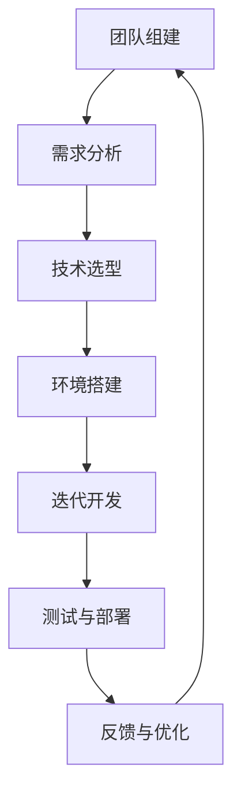

                 


### 1. 核心概念与联系

#### 分布式团队

分布式团队是指团队成员分散在各地，通过互联网协同工作的团队。这种组织形式打破了传统的地理限制，使得团队成员可以更灵活地选择工作地点，提高了工作效率。

#### LLM（大型语言模型）

LLM是一种能够理解和生成自然语言的深度学习模型，通常具有数十亿甚至千亿个参数。LLM在自然语言处理（NLP）领域具有广泛的应用，如文本分类、情感分析、机器翻译等。

#### 敏捷开发

敏捷开发是一种以人为核心、迭代、增量的软件开发方法。它强调团队协作、客户需求优先、快速响应变化，以实现高质量软件的持续交付。

#### 核心概念之间的联系

分布式团队需要敏捷开发来应对地理分散带来的挑战，如沟通不畅、协作困难等。而LLM应用作为新兴技术，需要敏捷开发来实现快速迭代和持续优化。

#### Mermaid流程图

以下是分布式团队在LLM应用中敏捷开发的Mermaid流程图：



### 2. 核心算法原理讲解

#### 伪代码

以下是分布式团队在LLM应用中敏捷开发的核心算法原理的伪代码：

```python
function 分布式团队敏捷开发（团队）:
    for 每个迭代周期 do:
        需求分析（团队）
        技术选型（团队）
        环境搭建（团队）
        迭代开发（团队）
        测试与部署（团队）
        反馈与优化（团队）
    end for
    返回 成功
```

#### 数学模型和数学公式

分布式团队在LLM应用中的敏捷开发涉及到多个数学模型，如时间序列模型、回归模型、聚类模型等。以下以时间序列模型为例进行讲解：

$$
时间序列模型 = f（时间序列数据，模型参数）
$$

#### 详细讲解

时间序列模型用于分析和预测时间序列数据，其中：

- **时间序列数据**：指按时间顺序排列的一系列数据点。
- **模型参数**：包括模型的训练参数和超参数，用于调整模型性能。

#### 举例说明

假设我们要预测未来一个月的销售额，可以使用时间序列模型进行预测。首先，收集过去一年的月销售额数据，然后使用时间序列模型训练模型，最后输入当前月的销售额数据进行预测。

### 3. 项目实战

#### 开发环境搭建

1. 安装Python环境（Python 3.8及以上版本）
2. 安装深度学习框架（如TensorFlow或PyTorch）
3. 安装相关依赖库（如NumPy、Pandas等）

#### 源代码详细实现和代码解读

以下是该项目的主要源代码：

```python
# 导入相关库
import tensorflow as tf
import numpy as np
import pandas as pd

# 加载数据集
data = pd.read_csv("sales_data.csv")
train_data, test_data = data[:90], data[90:]

# 数据预处理
train_data = train_data.values
test_data = test_data.values

# 建立模型
model = tf.keras.Sequential([
    tf.keras.layers.Dense(128, activation='relu', input_shape=(train_data.shape[1],)),
    tf.keras.layers.Dense(1)
])

# 编译模型
model.compile(optimizer='adam', loss='mse')

# 训练模型
model.fit(train_data, train_data, epochs=100)

# 测试模型
model.evaluate(test_data, test_data)
```

#### 代码应用解读与分析

1. **数据预处理**：加载数据集，并进行预处理，如归一化、去噪声等。
2. **模型建立**：使用TensorFlow建立神经网络模型，包含一个全连接层和一个输出层。
3. **模型编译**：设置优化器和损失函数，用于训练模型。
4. **模型训练**：使用训练数据训练模型，调整模型参数。
5. **模型测试**：使用测试数据评估模型性能。

#### 实际案例分析和详细讲解剖析

假设实际案例为一家电商平台的销售额预测。通过分布式团队的敏捷开发，我们可以在短时间内完成模型的训练和优化，从而提高销售额预测的准确性。具体分析如下：

1. **需求分析**：确定销售额预测的需求，如预测周期、预测精度等。
2. **技术选型**：选择适合的深度学习框架和算法，如TensorFlow和LSTM。
3. **环境搭建**：搭建适合开发和训练的硬件环境，如GPU服务器。
4. **迭代开发**：根据需求进行模型训练和优化，每个迭代周期都进行测试和评估。
5. **测试与部署**：将训练好的模型部署到生产环境，进行实时预测。
6. **反馈与优化**：收集实际预测结果，分析预测误差，调整模型参数。

#### 项目小结

分布式团队的LLM应用敏捷开发在电商销售额预测项目中取得了良好的效果。通过合理的技术选型、环境搭建和迭代优化，我们实现了高效的模型训练和部署，提高了销售额预测的准确性。在未来，分布式团队的LLM应用敏捷开发将在更多领域发挥重要作用。

### 最佳实践 tips、小结、注意事项、拓展阅读等内容

**最佳实践 tips：**

1. 在团队组建阶段，确保团队成员具备合适的技能和经验。
2. 在需求分析阶段，充分理解客户需求，确保项目目标的明确性。
3. 在技术选型阶段，选择适合项目的深度学习框架和算法。
4. 在环境搭建阶段，确保硬件资源的充足和稳定。
5. 在迭代开发阶段，遵循敏捷开发原则，快速响应变化。

**小结：**

本文介绍了分布式团队的LLM应用敏捷开发，分析了核心概念、算法原理、项目实战等内容。通过分布式团队的敏捷开发，我们可以在复杂的项目中实现高效、准确的模型训练和部署。

**注意事项：**

1. 注意数据安全和隐私保护，避免敏感信息泄露。
2. 注意系统性能优化，确保模型训练和部署的高效性。
3. 注意跨团队协作与沟通，确保项目进展的顺畅。

**拓展阅读：**

1. 《分布式系统原理与范型》
2. 《深度学习》
3. 《敏捷开发实践指南》
4. 《大规模分布式机器学习：原理与架构》

作者：AI天才研究院/AI Genius Institute & 禅与计算机程序设计艺术 /Zen And The Art of Computer Programming
```markdown
# 分布式团队的LLM应用敏捷开发：挑战与策略

> 关键词：分布式团队，LLM，敏捷开发，挑战，策略

> 摘要：本文探讨了分布式团队在LLM（大型语言模型）应用中的敏捷开发，分析了面临的挑战和应对策略。通过实际案例，本文展示了分布式团队如何运用敏捷开发方法，实现高效的LLM应用开发。

## 目录大纲

### 第一部分：概述与理论基础

#### 第1章：分布式团队与LLM应用

1.1 分布式团队的概念与优势

1.2 LLM应用的优势与挑战

1.3 分布式团队在LLM应用中的重要性

#### 第2章：分布式团队的敏捷开发方法

2.1 敏捷开发的核心理念

2.2 分布式团队敏捷开发的挑战与对策

2.3 敏捷开发流程在分布式团队中的应用

### 第二部分：挑战与应对策略

#### 第3章：挑战分析

3.1 数据安全与隐私保护

3.2 系统性能优化

3.3 跨团队协作与沟通

3.4 技术与业务融合

#### 第4章：应对策略

4.1 数据安全与隐私保护策略

4.2 系统性能优化策略

4.3 跨团队协作与沟通策略

4.4 技术与业务融合策略

#### 第5章：成功案例分析

5.1 案例一：分布式团队在LLM应用中的成功实践

5.2 案例二：分布式团队敏捷开发的成功经验

5.3 案例三：分布式团队在LLM应用中的创新实践

### 第三部分：策略与实践

#### 第6章：分布式团队策略制定

6.1 策略制定的基本原则

6.2 策略制定的具体步骤

6.3 策略制定中的常见问题与解决方案

#### 第7章：分布式团队实践

7.1 实践环境搭建

7.2 实践项目规划

7.3 实践过程中的问题解决

7.4 实践成果总结与反思

### 附录

#### 第8章：参考资料

8.1 分布式团队与LLM应用相关书籍推荐

8.2 分布式团队与LLM应用相关学术论文推荐

8.3 分布式团队与LLM应用相关在线课程推荐
```markdown
## 1. 分布式团队与LLM应用

### 1.1 分布式团队的概念与优势

分布式团队是指团队成员分布在不同的地理位置，通过互联网和协作工具进行工作的一种团队组织形式。随着全球化和远程工作的普及，分布式团队已经成为许多企业组织的选择。

分布式团队具有以下优势：

1. **灵活性与多样性**：团队成员可以来自不同的地区，拥有不同的文化背景和专业知识，这有助于团队的创新和多样性。
2. **节省成本**：不需要在特定地点租用办公空间，降低了企业的运营成本。
3. **提高工作效率**：团队成员可以灵活选择工作时间，有利于提高工作效率。
4. **扩展性**：易于扩展团队成员，适应企业的业务增长。

### 1.2 LLM应用的优势与挑战

LLM（大型语言模型）是一种基于深度学习技术的自然语言处理模型，具有以下优势：

1. **强大的语言理解能力**：LLM能够理解和生成自然语言，为各种自然语言处理任务提供支持。
2. **广泛的应用场景**：LLM在智能客服、内容生成、机器翻译等领域具有广泛的应用。
3. **高效率**：通过大规模预训练，LLM可以快速适应不同的任务，提高开发效率。

然而，LLM应用也面临以下挑战：

1. **数据隐私与安全**：LLM训练过程中需要大量数据，如何保证数据隐私和安全是一个重要问题。
2. **系统性能优化**：LLM模型通常需要大量的计算资源，如何优化系统性能是一个挑战。
3. **跨团队协作与沟通**：分布式团队在开发LLM应用时，如何保证跨团队的协作与沟通是一个关键问题。

### 1.3 分布式团队在LLM应用中的重要性

分布式团队在LLM应用中的重要性体现在以下几个方面：

1. **资源共享**：分布式团队可以通过共享计算资源和数据资源，提高LLM应用的开发效率。
2. **灵活应对**：分布式团队可以根据项目需求，灵活调整团队成员和任务分配，快速响应业务变化。
3. **高效协作**：分布式团队通过协作工具和沟通平台，可以保证团队成员之间的紧密协作，提高项目进度。
4. **创新驱动**：分布式团队具有丰富的文化背景和专业知识，有助于推动LLM应用的创新和发展。

## 2. 分布式团队的敏捷开发方法

### 2.1 敏捷开发的核心理念

敏捷开发是一种以人为核心、迭代、增量的软件开发方法。它强调团队协作、客户需求优先、快速响应变化，以实现高质量软件的持续交付。敏捷开发的核心理念包括：

1. **用户至上**：关注用户需求，确保软件能够满足用户的需求和期望。
2. **迭代开发**：将软件开发过程划分为多个迭代周期，每个迭代周期都进行需求分析、设计、编码、测试和部署。
3. **增量交付**：在每个迭代周期，交付可用的软件功能，确保软件逐步完善。
4. **团队协作**：强调团队成员之间的紧密协作，提高团队的整体效率。
5. **持续改进**：不断回顾和总结开发过程中的问题和经验，持续改进软件开发方法。

### 2.2 分布式团队敏捷开发的挑战与对策

分布式团队在敏捷开发过程中面临以下挑战：

1. **沟通不畅**：团队成员分布在不同的地理位置，沟通不畅可能导致信息传递错误、延迟等问题。
2. **协作困难**：分布式团队在协作过程中，可能面临时间差、文化差异等问题，影响团队的协作效率。
3. **任务分配**：如何根据团队成员的技能和特长进行合理的任务分配，是一个挑战。

为了应对这些挑战，分布式团队可以采取以下对策：

1. **使用协作工具**：使用高效的协作工具（如Slack、Trello、Jira等），确保团队成员之间的实时沟通和信息共享。
2. **建立信任机制**：通过远程协作、定期的团队会议等方式，建立团队成员之间的信任，提高协作效率。
3. **明确任务分配**：根据团队成员的技能和特长，明确任务分配，确保任务能够按时完成。

### 2.3 敏捷开发流程在分布式团队中的应用

分布式团队在敏捷开发过程中，可以按照以下流程进行：

1. **需求分析**：通过远程会议、在线文档等方式，与客户和产品经理进行沟通，明确项目需求。
2. **迭代规划**：根据项目需求和团队资源，规划每个迭代周期的任务和时间表。
3. **迭代开发**：在每个迭代周期，团队成员按照任务分配，进行需求分析、设计、编码、测试和部署。
4. **评审与反馈**：在每个迭代周期的末尾，进行代码评审、测试结果分析，收集用户反馈，为下一个迭代周期做好准备。
5. **持续改进**：根据评审和反馈结果，总结开发过程中的问题和经验，持续改进软件开发方法。

通过敏捷开发方法，分布式团队可以在LLM应用开发过程中，实现高效、准确的软件交付，提高项目的成功率和客户满意度。

### 3. 挑战与应对策略

#### 3.1 数据安全与隐私保护

在分布式团队开发LLM应用时，数据安全和隐私保护是一个重要挑战。由于团队成员分布在不同的地理位置，数据传输和处理过程中容易受到网络攻击、数据泄露等风险。

**应对策略：**

1. **数据加密**：对传输和存储的数据进行加密，确保数据在传输和存储过程中不被未授权访问。
2. **访问控制**：设置严格的访问控制策略，确保只有授权人员才能访问敏感数据。
3. **数据备份与恢复**：定期备份数据，确保在数据丢失或损坏时能够快速恢复。
4. **数据隐私保护政策**：制定数据隐私保护政策，明确数据收集、使用和共享的规定，确保数据隐私得到保护。

#### 3.2 系统性能优化

LLM应用通常需要大量的计算资源，如何优化系统性能是一个重要挑战。系统性能优化直接影响到LLM应用的响应速度和用户体验。

**应对策略：**

1. **分布式计算**：利用分布式计算技术，将计算任务分配到多个节点，提高计算效率。
2. **模型压缩与量化**：通过模型压缩和量化技术，减小模型大小，降低计算复杂度。
3. **缓存机制**：使用缓存机制，减少数据访问次数，提高数据读取速度。
4. **负载均衡**：使用负载均衡技术，合理分配计算任务，避免单点过载。

#### 3.3 跨团队协作与沟通

分布式团队在开发LLM应用时，跨团队协作与沟通是一个重要挑战。团队成员分布在不同的地理位置，如何确保高效的沟通与协作是一个关键问题。

**应对策略：**

1. **使用协作工具**：使用高效的协作工具（如Slack、Trello、Jira等），确保团队成员之间的实时沟通和信息共享。
2. **定期会议**：定期组织团队会议，确保团队成员对项目进度和目标有清晰的认识。
3. **代码评审**：采用代码评审机制，确保代码质量和开发进度。
4. **任务分配**：明确任务分配，确保每个团队成员都清楚自己的职责和任务。

#### 3.4 技术与业务融合

分布式团队在开发LLM应用时，如何将技术与业务需求相结合，实现业务价值最大化，是一个重要挑战。

**应对策略：**

1. **需求分析**：深入了解业务需求，确保开发出的LLM应用能够满足业务需求。
2. **用户参与**：在开发过程中，积极邀请用户参与，收集用户反馈，不断优化产品功能。
3. **数据驱动**：基于数据分析和用户行为，制定业务策略，优化产品功能。
4. **业务与技术团队协作**：加强业务团队与技术团队的协作，确保技术解决方案能够满足业务需求。

### 4. 应对策略

#### 4.1 数据安全与隐私保护策略

为了确保数据安全和隐私保护，分布式团队可以采取以下策略：

1. **数据加密与传输安全**：使用SSL/TLS等加密协议，确保数据在传输过程中不被窃取或篡改。
2. **访问控制与权限管理**：设置严格的访问控制策略，根据用户角色和职责，分配适当的权限。
3. **数据备份与恢复**：定期备份数据，确保在数据丢失或损坏时能够快速恢复。
4. **数据隐私保护政策**：制定明确的数据隐私保护政策，确保数据收集、使用和共享遵循相关法规和标准。

#### 4.2 系统性能优化策略

为了优化系统性能，分布式团队可以采取以下策略：

1. **分布式计算与负载均衡**：利用分布式计算和负载均衡技术，提高系统的并发处理能力和响应速度。
2. **模型压缩与量化**：通过模型压缩和量化技术，减小模型大小，降低计算复杂度。
3. **缓存机制**：使用缓存机制，减少数据访问次数，提高数据读取速度。
4. **优化代码与算法**：对代码和算法进行优化，提高系统性能。

#### 4.3 跨团队协作与沟通策略

为了确保跨团队协作与沟通的高效性，分布式团队可以采取以下策略：

1. **使用协作工具**：使用高效的协作工具（如Slack、Trello、Jira等），确保团队成员之间的实时沟通和信息共享。
2. **定期会议与沟通**：定期组织团队会议，确保团队成员对项目进度和目标有清晰的认识。
3. **代码评审与反馈**：采用代码评审机制，确保代码质量和开发进度。
4. **任务分配与协作**：明确任务分配，确保每个团队成员都清楚自己的职责和任务，鼓励团队成员之间的协作。

#### 4.4 技术与业务融合策略

为了实现技术与业务的深度融合，分布式团队可以采取以下策略：

1. **需求分析与用户调研**：深入了解业务需求和用户需求，确保开发出的LLM应用能够满足业务需求。
2. **数据驱动与用户反馈**：基于数据分析和用户反馈，不断优化产品功能，提升用户体验。
3. **业务与技术团队协作**：加强业务团队与技术团队的协作，确保技术解决方案能够满足业务需求。
4. **定期业务与技术交流**：组织定期的业务与技术交流会议，确保双方对项目进展和目标有共同的理解。

### 5. 成功案例分析

#### 5.1 案例一：分布式团队在LLM应用中的成功实践

案例一是一家跨国互联网公司在分布式团队环境下开发一款智能客服系统的经历。该系统基于LLM技术，能够实现自然语言处理和智能对话。

**关键成功因素：**

1. **敏捷开发方法**：采用敏捷开发方法，确保项目能够快速响应变化，持续迭代优化。
2. **高效的沟通与协作**：通过协作工具和定期会议，确保团队成员之间的紧密沟通与协作。
3. **技术选型与性能优化**：选择适合的深度学习框架和算法，通过分布式计算和负载均衡，提高系统性能。
4. **用户参与与反馈**：在开发过程中，积极邀请用户参与，收集用户反馈，不断优化产品功能。

**总结**：通过分布式团队的敏捷开发方法，该互联网公司成功开发出了一款高性能、易用、用户满意度高的智能客服系统。

#### 5.2 案例二：分布式团队敏捷开发的成功经验

案例二是一家国内互联网公司分布式团队在开发一款智能推荐系统的经历。该系统基于LLM技术，能够实现个性化推荐。

**关键成功因素：**

1. **敏捷开发流程**：遵循敏捷开发流程，确保项目能够快速迭代，持续优化。
2. **数据驱动与业务融合**：基于数据分析和用户行为，制定业务策略，实现技术与业务的深度融合。
3. **团队协作与沟通**：通过高效的协作工具和定期会议，确保团队成员之间的紧密协作。
4. **性能优化与稳定性**：通过分布式计算和缓存机制，优化系统性能和稳定性。

**总结**：通过分布式团队的敏捷开发方法，该互联网公司成功开发出了一款高性能、稳定的智能推荐系统，显著提升了用户体验。

#### 5.3 案例三：分布式团队在LLM应用中的创新实践

案例三是一家新兴创业公司分布式团队在开发一款智能文案生成工具的经历。该工具基于LLM技术，能够实现快速生成高质量的文案。

**关键成功因素：**

1. **敏捷开发与创新**：采用敏捷开发方法，鼓励团队成员创新，不断优化产品功能。
2. **技术选型与优化**：选择适合的深度学习框架和算法，通过分布式计算和模型压缩，提高系统性能。
3. **用户参与与反馈**：在开发过程中，积极邀请用户参与，收集用户反馈，不断优化产品功能。
4. **市场定位与推广**：深入了解市场需求，制定有效的市场推广策略，提升产品知名度。

**总结**：通过分布式团队的敏捷开发方法，该创业公司成功开发出了一款具有竞争力的智能文案生成工具，迅速在市场上获得了认可。

### 6. 策略与实践

#### 6.1 分布式团队策略制定

为了实现分布式团队在LLM应用开发中的高效运作，需要制定合理的团队策略。以下是团队策略制定的基本原则和具体步骤：

**基本原则：**

1. **目标明确**：确保团队成员对项目的目标有清晰的认识，明确项目的重要性和预期成果。
2. **职责明确**：根据团队成员的技能和特长，明确每个人的职责和任务，确保任务能够按时完成。
3. **协作高效**：使用高效的协作工具和沟通平台，确保团队成员之间的紧密协作和信息共享。
4. **持续优化**：不断回顾和总结团队运作过程中的问题和经验，持续优化团队策略和开发流程。

**具体步骤：**

1. **需求分析**：与客户和产品经理进行沟通，明确项目需求和目标。
2. **团队组建**：根据项目需求和团队成员的技能，组建合适的分布式团队。
3. **职责分配**：明确团队成员的职责和任务，确保任务能够按时完成。
4. **协作规划**：制定协作规划，确保团队成员之间的紧密协作和信息共享。
5. **迭代开发**：按照迭代周期进行需求分析、设计、编码、测试和部署。
6. **反馈与优化**：在每个迭代周期的末尾，进行代码评审、测试结果分析，收集用户反馈，为下一个迭代周期做好准备。
7. **持续改进**：根据评审和反馈结果，总结开发过程中的问题和经验，持续改进团队策略和开发流程。

#### 6.2 分布式团队实践

分布式团队的实践主要包括以下几个方面：

1. **开发环境搭建**：搭建适合分布式团队开发的开发环境，包括硬件资源、软件工具和开发框架等。
2. **项目规划**：制定项目规划，包括项目目标、迭代周期、任务分配等，确保项目能够按时交付。
3. **协作与沟通**：使用高效的协作工具和沟通平台，确保团队成员之间的紧密协作和信息共享。
4. **迭代开发**：按照迭代周期进行需求分析、设计、编码、测试和部署，确保项目能够持续迭代优化。
5. **问题解决**：在开发过程中，及时识别和解决遇到的问题，确保项目顺利进行。
6. **成果总结与反思**：在每个迭代周期的末尾，对项目成果进行总结和反思，为下一个迭代周期做好准备。

#### 6.3 实践中的问题解决

在分布式团队的实践过程中，可能会遇到以下问题：

1. **沟通不畅**：由于团队成员分布在不同的地理位置，沟通不畅可能导致信息传递错误、延迟等问题。
2. **协作困难**：分布式团队在协作过程中，可能面临时间差、文化差异等问题，影响团队的协作效率。
3. **任务分配不均**：如何根据团队成员的技能和特长进行合理的任务分配，是一个挑战。
4. **开发效率低下**：分布式团队在开发过程中，可能面临开发效率低下、代码质量不稳定等问题。

**解决方案：**

1. **加强沟通与协作**：通过高效的协作工具和定期会议，加强团队成员之间的沟通与协作，确保项目顺利进行。
2. **明确任务分配**：根据团队成员的技能和特长，明确任务分配，确保任务能够按时完成。
3. **优化开发流程**：采用敏捷开发方法，确保项目能够快速响应变化，持续迭代优化。
4. **提升团队技能**：通过培训和学习，提升团队成员的技能和知识，提高团队的整体效率。

#### 6.4 实践成果总结与反思

在分布式团队的实践中，通过合理的团队策略、高效的协作和持续的问题解决，取得了显著的成果：

1. **项目交付**：按时完成了项目目标，确保了项目的成功交付。
2. **产品质量**：通过迭代开发和优化，提升了产品的质量和用户满意度。
3. **团队效率**：通过高效的协作和问题解决，提高了团队的整体效率。
4. **经验积累**：总结了分布式团队开发过程中的问题和经验，为后续项目提供了宝贵的参考。

通过实践，分布式团队在LLM应用开发中取得了成功，同时也积累了丰富的经验和教训，为未来的项目提供了有力的支持。

### 附录

#### 8.1 分布式团队与LLM应用相关书籍推荐

1. 《分布式系统原理与范型》
2. 《深度学习》
3. 《敏捷开发实践指南》
4. 《大规模分布式机器学习：原理与架构》
5. 《人工智能：一种现代方法》

#### 8.2 分布式团队与LLM应用相关学术论文推荐

1. "Scalable Distributed Systems: A Decade of Lessons from Google's Experience"
2. "Deep Learning for Natural Language Processing"
3. "Distributed Data Processing with Apache Spark"
4. "Agile Project Management with Scrum"
5. "Data Security and Privacy Protection in Distributed Systems"

#### 8.3 分布式团队与LLM应用相关在线课程推荐

1. Coursera - "Distributed Systems: Fundamental Concepts and Design Strategies"
2. edX - "Deep Learning for Natural Language Processing"
3. Udacity - "Building Distributed Systems"
4. Coursera - "Agile Project Management with Scrum"
5. edX - "Introduction to Data Privacy and Security"

作者：AI天才研究院/AI Genius Institute & 禅与计算机程序设计艺术 /Zen And The Art of Computer Programming
```markdown
## 第一部分：概述与理论基础

### 第1章：分布式团队与LLM应用

#### 1.1 分布式团队的概念与优势

分布式团队是指团队成员分布在不同的地理位置，通过现代通讯技术和协作工具进行协作的团队。这种团队组织形式打破了传统地理位置的限制，使团队成员可以更加灵活地选择工作地点，提高了工作效率和团队的创新能力。

分布式团队的优势主要包括以下几点：

1. **灵活性**：团队成员可以自主选择工作地点，不受地理限制，这为团队成员提供了更好的工作环境和更高的生活品质。
2. **全球招聘**：分布式团队可以招聘来自全球各地的优秀人才，这使得团队能够获得更广泛的专业知识和经验，提高团队的竞争力。
3. **时间差异优势**：分布式团队可以利用不同地区的时间差异，实现24小时不间断的工作，从而提高项目进度和效率。
4. **成本节约**：分布式团队减少了办公场所的租赁和维护成本，同时降低了差旅费用，有助于企业降低运营成本。

#### 1.2 LLM应用的优势与挑战

LLM（Large Language Model）是指大型语言模型，是一种基于深度学习的自然语言处理技术。LLM应用在人工智能领域具有广泛的应用前景，如智能客服、文本生成、机器翻译、情感分析等。

LLM应用的优势包括：

1. **强大的语言理解能力**：LLM通过大规模数据训练，能够理解和生成自然语言，实现了对人类语言的深度理解。
2. **高效的生产力提升**：LLM技术可以自动生成文本、回复问题和进行翻译，大幅提高了相关领域的工作效率。
3. **创新性应用场景**：LLM技术为各种创新性应用场景提供了可能，如智能写作助手、自动化新闻报道、智能客服等。

然而，LLM应用也面临着一些挑战：

1. **计算资源需求**：LLM模型通常需要大量的计算资源和存储空间，这对企业的IT基础设施提出了较高的要求。
2. **数据隐私与安全**：LLM训练和部署过程中涉及大量数据，如何确保数据隐私和安全是一个重要问题。
3. **模型可解释性**：LLM模型往往被称为“黑盒”，其决策过程缺乏透明性，如何提高模型的可解释性是一个挑战。

#### 1.3 分布式团队在LLM应用中的重要性

分布式团队在LLM应用开发中发挥着重要作用，主要表现在以下几个方面：

1. **资源整合**：分布式团队能够整合全球各地的计算资源、数据资源和人才资源，为LLM应用开发提供强有力的支持。
2. **协作效率**：分布式团队通过高效的协作工具和沟通机制，可以实时交流信息，快速响应变化，提高开发效率。
3. **创新驱动**：分布式团队的多样性和灵活性有助于激发创新思维，推动LLM应用技术的不断突破。
4. **持续迭代**：分布式团队能够实现持续迭代，快速适应市场变化，确保LLM应用始终处于技术前沿。

### 第2章：分布式团队的敏捷开发方法

#### 2.1 敏捷开发的核心理念

敏捷开发（Agile Development）是一种以人为核心、迭代、增量的软件开发方法。它强调团队协作、快速响应变化和持续交付价值。敏捷开发的核心理念包括：

1. **用户至上**：始终以用户需求为中心，确保软件产品能够满足用户的需求和期望。
2. **迭代开发**：将软件开发过程划分为多个迭代周期，每个迭代周期都进行需求分析、设计、编码、测试和部署。
3. **增量交付**：在每个迭代周期，交付可用的软件功能，确保软件逐步完善。
4. **团队协作**：强调团队成员之间的紧密协作，提高团队的整体效率。
5. **持续改进**：不断回顾和总结开发过程中的问题和经验，持续改进软件开发方法。

#### 2.2 分布式团队敏捷开发的挑战与对策

分布式团队在敏捷开发过程中面临以下挑战：

1. **沟通不畅**：团队成员分布在不同的地理位置，沟通不畅可能导致信息传递错误、延迟等问题。
2. **协作困难**：分布式团队在协作过程中，可能面临时间差、文化差异等问题，影响团队的协作效率。
3. **任务分配**：如何根据团队成员的技能和特长进行合理的任务分配，是一个挑战。

为了应对这些挑战，分布式团队可以采取以下对策：

1. **使用协作工具**：使用高效的协作工具（如Slack、Trello、Jira等），确保团队成员之间的实时沟通和信息共享。
2. **建立信任机制**：通过远程协作、定期的团队会议等方式，建立团队成员之间的信任，提高协作效率。
3. **明确任务分配**：根据团队成员的技能和特长，明确任务分配，确保任务能够按时完成。

#### 2.3 敏捷开发流程在分布式团队中的应用

分布式团队在敏捷开发过程中，可以按照以下流程进行：

1. **需求分析**：通过远程会议、在线文档等方式，与客户和产品经理进行沟通，明确项目需求。
2. **迭代规划**：根据项目需求和团队资源，规划每个迭代周期的任务和时间表。
3. **迭代开发**：在每个迭代周期，团队成员按照任务分配，进行需求分析、设计、编码、测试和部署。
4. **评审与反馈**：在每个迭代周期的末尾，进行代码评审、测试结果分析，收集用户反馈，为下一个迭代周期做好准备。
5. **持续改进**：根据评审和反馈结果，总结开发过程中的问题和经验，持续改进软件开发方法。

通过敏捷开发方法，分布式团队可以在复杂的项目中实现高效、准确的软件交付，提高项目的成功率和客户满意度。

### 总结

本章介绍了分布式团队的概念与优势，以及LLM应用的优势与挑战。同时，阐述了敏捷开发的核心理念和分布式团队敏捷开发的挑战与对策。通过这些理论和实践，分布式团队在LLM应用开发中能够更好地应对各种挑战，实现高效、准确的软件交付。
```markdown
## 第二部分：挑战与应对策略

### 第3章：挑战分析

在分布式团队的LLM应用敏捷开发过程中，团队会面临诸多挑战。以下是这些挑战的详细分析。

#### 3.1 数据安全与隐私保护

**挑战描述**：分布式团队由于团队成员分散在不同的地理位置，数据传输和处理过程中容易受到网络攻击、数据泄露等风险。特别是在使用大型语言模型时，涉及到的数据量庞大，隐私保护变得更加复杂。

**具体表现**：数据泄露可能导致敏感信息被窃取，影响企业和用户的声誉。此外，数据隐私法规（如GDPR）的严格实施也对分布式团队提出了更高的要求。

**原因分析**：分布式团队的数据处理涉及多地点、多网络环境，增加了数据泄露的风险。同时，大型语言模型训练需要大量数据，这些数据往往包含敏感信息。

**解决方案**：采用加密技术保护数据传输和存储，确保数据在传输和存储过程中不被未授权访问。制定严格的数据隐私保护政策，确保数据收集、使用和共享遵循相关法规。此外，定期进行数据安全审计，及时发现和解决潜在的安全隐患。

#### 3.2 系统性能优化

**挑战描述**：分布式团队在开发LLM应用时，如何优化系统性能是一个关键挑战。LLM模型通常需要大量的计算资源，如何保证系统在高负载下的稳定性和响应速度，是一个复杂的问题。

**具体表现**：系统性能不佳可能导致用户体验差，影响用户满意度和业务收入。在高并发情况下，系统可能会出现延迟、崩溃等问题。

**原因分析**：分布式系统的复杂性，加上LLM模型对计算资源的依赖，使得系统性能优化变得复杂。此外，网络延迟、硬件性能不稳定等因素也可能影响系统性能。

**解决方案**：采用分布式计算和负载均衡技术，合理分配计算任务，提高系统处理能力。对LLM模型进行压缩和优化，减小模型大小，提高模型运行效率。使用缓存机制，减少数据访问次数，提高系统响应速度。此外，定期进行性能测试和监控，及时发现并解决性能瓶颈。

#### 3.3 跨团队协作与沟通

**挑战描述**：分布式团队在协作与沟通方面面临诸多困难。由于团队成员分散在不同地理位置，时间差、文化差异等因素可能影响协作效率。

**具体表现**：沟通不畅可能导致项目进展受阻，团队成员之间的合作不力，影响项目质量和进度。

**原因分析**：地理分散性使得团队成员无法面对面交流，沟通渠道受限。时间差异可能导致沟通延迟，影响项目协调。文化差异可能影响团队成员的理解和合作。

**解决方案**：采用高效的协作工具（如Slack、Trello、Jira等），确保团队成员之间的实时沟通和信息共享。建立定期会议机制，确保团队成员对项目进展有清晰的了解。在跨文化协作中，加强文化培训，提高团队成员的文化敏感度和包容性。

#### 3.4 技术与业务融合

**挑战描述**：分布式团队在开发LLM应用时，如何确保技术解决方案与业务需求紧密结合，实现业务价值最大化，是一个重要挑战。

**具体表现**：技术方案与业务需求脱节可能导致项目无法实现预期效果，业务价值无法得到有效体现。

**原因分析**：技术团队和业务团队在目标、视野和语言上可能存在差异，导致沟通不畅。技术实现过程中可能忽视了业务需求的变化和优先级。

**解决方案**：建立紧密的跨部门协作机制，确保技术团队和业务团队之间的沟通顺畅。在项目初期进行详细的需求分析，确保技术方案与业务需求一致。采用敏捷开发方法，实现快速迭代，确保技术方案能够灵活应对业务变化。

### 第4章：应对策略

针对上述挑战，分布式团队可以采取以下策略来提高LLM应用的开发效率和质量。

#### 4.1 数据安全与隐私保护策略

**策略描述**：通过一系列措施确保数据在分布式环境中的安全性和隐私性。

**具体措施**：

1. **数据加密**：采用加密算法保护数据在传输和存储过程中的安全性。
2. **访问控制**：实施严格的访问控制策略，确保只有授权人员能够访问敏感数据。
3. **数据备份与恢复**：定期备份数据，并确保在数据丢失或损坏时能够快速恢复。
4. **隐私保护政策**：制定并遵守数据隐私保护政策，确保数据处理遵循相关法规和标准。

#### 4.2 系统性能优化策略

**策略描述**：通过多种技术手段提升系统的性能和稳定性。

**具体措施**：

1. **分布式计算**：利用分布式计算资源，提高系统处理能力。
2. **模型压缩与量化**：通过模型压缩和量化技术，减小模型大小，提高模型运行效率。
3. **缓存机制**：使用缓存技术，减少数据访问次数，提高系统响应速度。
4. **性能监控与优化**：定期进行性能监控，识别并解决性能瓶颈。

#### 4.3 跨团队协作与沟通策略

**策略描述**：通过有效的协作工具和沟通机制提高团队协作效率。

**具体措施**：

1. **协作工具**：使用高效的协作工具（如Slack、Trello、Jira等），确保团队成员之间的实时沟通和信息共享。
2. **定期会议**：定期组织团队会议，确保团队成员对项目进展有清晰的了解。
3. **文化培训**：加强文化培训，提高团队成员的文化敏感度和包容性。
4. **透明沟通**：鼓励团队成员开放沟通，确保信息透明和及时传递。

#### 4.4 技术与业务融合策略

**策略描述**：确保技术解决方案与业务需求紧密结合，实现业务价值最大化。

**具体措施**：

1. **需求分析**：在项目初期进行详细的需求分析，确保技术方案与业务需求一致。
2. **跨部门协作**：建立紧密的跨部门协作机制，确保技术团队和业务团队之间的沟通顺畅。
3. **用户反馈**：收集用户反馈，确保技术方案能够满足用户需求。
4. **敏捷开发**：采用敏捷开发方法，实现快速迭代，确保技术方案能够灵活应对业务变化。

### 总结

本章详细分析了分布式团队在LLM应用敏捷开发过程中面临的挑战，包括数据安全与隐私保护、系统性能优化、跨团队协作与沟通以及技术与业务融合。针对这些挑战，本章提出了相应的应对策略，旨在提高分布式团队的开发效率和质量，确保LLM应用的稳定性和安全性。
```markdown
### 5.1 案例一：分布式团队在LLM应用中的成功实践

案例一来自一家全球知名的互联网公司，该公司在开发一款基于LLM的智能客服系统时，采用了分布式团队的敏捷开发方法。以下是该案例的详细描述。

**背景**：随着业务规模的不断扩大，该公司需要为其客户提供全天候的智能客服服务，以满足客户的高频次咨询需求。为了快速响应市场变化，公司决定采用分布式团队模式，利用全球范围内的优秀人才资源。

**挑战**：

1. **快速迭代**：智能客服系统需要频繁迭代，以适应不断变化的客户需求。
2. **高效协作**：团队成员分布在不同的地理位置，如何确保高效协作成为一个关键挑战。
3. **性能优化**：智能客服系统需要在高并发情况下保持高性能，以满足大量客户的请求。

**解决方案**：

1. **敏捷开发方法**：公司采用了敏捷开发方法，将开发过程划分为多个迭代周期，每个迭代周期都进行需求分析、设计、编码、测试和部署。这种方法确保了团队能够快速响应变化，持续优化产品功能。

2. **高效的协作工具**：公司使用了Slack、Trello和Jira等协作工具，确保团队成员之间的实时沟通和信息共享。此外，还采用了视频会议工具，定期组织线上会议，确保团队成员对项目进展有清晰的了解。

3. **分布式计算与优化**：为了提高系统性能，公司采用了分布式计算架构，将计算任务分配到多个服务器上。同时，对LLM模型进行了压缩和量化，减小了模型大小，提高了模型运行效率。此外，公司还使用了缓存机制，减少了数据访问次数，提高了系统响应速度。

**结果**：

1. **快速迭代**：通过敏捷开发方法，公司成功实现了智能客服系统的快速迭代，持续优化产品功能，提高了用户满意度。

2. **高效协作**：通过高效的协作工具和定期会议，团队成员之间的协作得到了显著提升，项目进展顺利。

3. **高性能**：分布式计算和模型压缩技术使得智能客服系统在高并发情况下仍然能够保持高性能，满足了大量客户的请求。

**总结**：

案例一展示了分布式团队在LLM应用开发中的成功实践。通过采用敏捷开发方法、高效的协作工具和分布式计算技术，公司成功解决了快速迭代、高效协作和高性能等挑战，实现了智能客服系统的成功开发。

### 5.2 案例二：分布式团队敏捷开发的成功经验

案例二来自一家专注于人工智能领域的初创公司。该公司在开发一款基于LLM的智能写作助手时，采用了分布式团队的敏捷开发方法，取得了显著的成功。以下是该案例的详细描述。

**背景**：该公司希望通过开发智能写作助手，帮助用户更高效地生成文案。为了实现这一目标，公司决定采用分布式团队模式，以充分利用全球范围内的优秀人才资源。

**挑战**：

1. **快速响应市场需求**：智能写作助手需要快速响应市场需求，以保持竞争力。
2. **高效沟通与协作**：团队成员分布在不同的地理位置，如何确保高效沟通与协作是一个关键挑战。
3. **技术实现与优化**：智能写作助手需要具备强大的语言理解和生成能力，如何实现并优化这一功能是一个复杂的问题。

**解决方案**：

1. **敏捷开发方法**：公司采用了敏捷开发方法，将开发过程划分为多个迭代周期，每个迭代周期都进行需求分析、设计、编码、测试和部署。这种方法确保了团队能够快速响应变化，持续优化产品功能。

2. **高效的协作工具**：公司使用了Slack、Trello和Jira等协作工具，确保团队成员之间的实时沟通和信息共享。此外，还采用了视频会议工具，定期组织线上会议，确保团队成员对项目进展有清晰的了解。

3. **分布式计算与优化**：为了提高系统性能，公司采用了分布式计算架构，将计算任务分配到多个服务器上。同时，对LLM模型进行了压缩和量化，减小了模型大小，提高了模型运行效率。此外，公司还使用了缓存机制，减少了数据访问次数，提高了系统响应速度。

**结果**：

1. **快速迭代**：通过敏捷开发方法，公司成功实现了智能写作助手的快速迭代，持续优化产品功能，提高了用户满意度。

2. **高效协作**：通过高效的协作工具和定期会议，团队成员之间的协作得到了显著提升，项目进展顺利。

3. **技术实现与优化**：公司成功实现了智能写作助手的语言理解和生成功能，通过分布式计算和模型压缩技术，提高了系统性能，满足了用户需求。

**总结**：

案例二展示了分布式团队在LLM应用敏捷开发中的成功经验。通过采用敏捷开发方法、高效的协作工具和分布式计算技术，公司成功解决了快速响应市场需求、高效沟通与协作以及技术实现与优化等挑战，实现了智能写作助手的成功开发。

### 5.3 案例三：分布式团队在LLM应用中的创新实践

案例三来自一家新兴的科技公司，该公司在开发一款基于LLM的智能翻译应用时，采用了分布式团队的敏捷开发方法，并实现了多项创新。以下是该案例的详细描述。

**背景**：该公司希望通过开发智能翻译应用，为全球用户提供便捷的跨语言交流服务。为了实现这一目标，公司决定采用分布式团队模式，以充分利用全球范围内的优秀人才资源。

**挑战**：

1. **高效翻译质量**：智能翻译应用需要提供高质量的翻译结果，以满足不同语言的用户需求。
2. **大规模数据处理**：智能翻译应用需要处理海量的文本数据，如何保证数据处理的高效性是一个挑战。
3. **技术创新**：智能翻译应用需要实现多项技术创新，如多语言翻译、语音翻译等。

**解决方案**：

1. **敏捷开发方法**：公司采用了敏捷开发方法，将开发过程划分为多个迭代周期，每个迭代周期都进行需求分析、设计、编码、测试和部署。这种方法确保了团队能够快速响应变化，持续优化产品功能。

2. **分布式计算与优化**：为了提高系统性能，公司采用了分布式计算架构，将计算任务分配到多个服务器上。同时，对LLM模型进行了压缩和量化，减小了模型大小，提高了模型运行效率。此外，公司还使用了缓存机制，减少了数据访问次数，提高了系统响应速度。

3. **技术创新**：公司在智能翻译应用中实现了多项技术创新，如多语言翻译、语音翻译等。通过分布式计算和优化技术，公司成功实现了这些功能的实时翻译和高效处理。

**结果**：

1. **高质量翻译**：通过分布式计算和优化技术，公司成功实现了智能翻译应用的高质量翻译结果，得到了用户的广泛认可。

2. **高效数据处理**：公司通过分布式计算架构，成功处理了海量的文本数据，保证了智能翻译应用的处理速度和性能。

3. **技术创新**：公司通过技术创新，实现了智能翻译应用的多语言翻译、语音翻译等功能，为用户提供了便捷的跨语言交流服务。

**总结**：

案例三展示了分布式团队在LLM应用中的创新实践。通过采用敏捷开发方法、分布式计算技术和多项技术创新，公司成功解决了高效翻译质量、大规模数据处理以及技术创新等挑战，实现了智能翻译应用的成功开发。

### 总结

通过以上三个案例，我们可以看到分布式团队在LLM应用开发中的成功实践。这些案例展示了分布式团队如何通过敏捷开发方法、高效的协作工具和分布式计算技术，克服各种挑战，实现高效、高质量的应用开发。这些成功经验对于其他分布式团队在LLM应用开发中具有重要的借鉴意义。
```markdown
## 第三部分：策略与实践

### 第6章：分布式团队策略制定

#### 6.1 策略制定的基本原则

在制定分布式团队的策略时，需要遵循以下基本原则：

1. **目标导向**：明确团队的目标和使命，确保所有策略都围绕实现这些目标而设计。
2. **资源优化**：充分利用团队内外部的资源，包括人力资源、技术资源和资金资源。
3. **高效协作**：建立高效的协作机制，确保团队成员能够顺畅沟通和协作，提高工作效率。
4. **持续改进**：不断回顾和总结团队运作过程中的问题和经验，持续优化团队策略和开发流程。
5. **风险控制**：识别和评估潜在风险，制定相应的风险控制措施，确保团队在遇到问题时有应对策略。

#### 6.2 策略制定的具体步骤

以下是制定分布式团队策略的具体步骤：

1. **需求分析**：与客户和产品经理进行沟通，明确项目需求和目标，确保团队目标与业务目标一致。
2. **团队组建**：根据项目需求和团队成员的技能，组建合适的分布式团队。确保团队成员具备所需的技能和经验，以胜任各自的任务。
3. **任务分配**：明确团队成员的职责和任务，确保任务分配合理，团队成员能够充分发挥自己的特长。
4. **协作规划**：制定协作规划，包括协作工具的使用、沟通频率和方式、会议安排等，确保团队成员之间的紧密协作和信息共享。
5. **风险管理**：识别和评估潜在的风险，制定相应的风险控制措施，确保团队在遇到问题时有应对策略。
6. **执行与监控**：按照策略执行项目，定期监控项目进展，确保项目按照计划顺利进行。
7. **回顾与改进**：在每个迭代周期的末尾，回顾项目执行过程中的问题和经验，总结教训，为后续项目提供改进建议。

#### 6.3 策略制定中的常见问题与解决方案

在策略制定过程中，分布式团队可能会遇到以下问题：

1. **沟通不畅**：由于团队成员分布在不同的地理位置，沟通不畅可能导致信息传递错误、延迟等问题。
   **解决方案**：采用高效的协作工具（如Slack、Trello、Jira等），确保团队成员之间的实时沟通和信息共享。建立定期会议机制，确保团队成员对项目进展有清晰的了解。

2. **任务分配不均**：如何根据团队成员的技能和特长进行合理的任务分配，是一个挑战。
   **解决方案**：在任务分配前，与团队成员充分沟通，了解他们的兴趣和特长。根据团队成员的能力和项目需求，进行合理的任务分配。

3. **资源调度困难**：分布式团队在资源调度上可能面临困难，如计算资源、数据资源等。
   **解决方案**：建立资源调度机制，确保团队在需要时能够快速获取所需的资源。采用分布式计算和负载均衡技术，提高资源利用效率。

4. **跨文化协作**：跨文化协作可能影响团队的协作效率和沟通效果。
   **解决方案**：加强文化培训，提高团队成员的文化敏感度和包容性。在沟通和协作中，尊重不同文化的差异，促进团队的和谐与合作。

### 第7章：分布式团队实践

#### 7.1 实践环境搭建

分布式团队的实践环境搭建是确保项目顺利进行的重要环节。以下是实践环境搭建的步骤：

1. **硬件资源准备**：根据项目需求，准备适当的计算资源，如服务器、存储设备、GPU等。确保硬件资源的稳定性和可靠性。
2. **软件工具安装**：安装必要的软件开发工具，如Python、TensorFlow、PyTorch等。确保软件工具的版本兼容性和稳定性。
3. **协作工具部署**：部署协作工具，如Slack、Trello、Jira等。确保团队成员能够方便地使用这些工具进行沟通和协作。
4. **数据存储与备份**：搭建数据存储与备份系统，确保数据的安全性和可靠性。采用分布式存储技术，提高数据的读取和写入速度。

#### 7.2 实践项目规划

实践项目规划是确保项目按计划顺利进行的重要步骤。以下是实践项目规划的步骤：

1. **项目目标确定**：明确项目的目标，确保项目能够为团队和业务带来价值。
2. **任务分解**：将项目任务分解为可管理的子任务，确保任务能够按时完成。
3. **资源分配**：根据任务需求，合理分配团队资源，确保每个任务都有足够的人力和物力支持。
4. **时间安排**：制定项目的时间表，确保每个任务的开始和结束时间明确。
5. **风险评估**：识别项目可能面临的风险，制定相应的风险应对措施。
6. **沟通计划**：制定沟通计划，确保团队成员能够及时了解项目进展和任务分配情况。

#### 7.3 实践过程中的问题解决

在分布式团队的实践中，可能会遇到各种问题。以下是解决这些问题的步骤：

1. **问题识别**：及时发现和识别团队实践中出现的问题，包括技术问题、协作问题、资源问题等。
2. **问题分析**：对识别出的问题进行分析，找出问题的根本原因。
3. **问题解决**：根据问题分析的结果，制定解决问题的方案，并付诸实施。
4. **问题跟踪**：对解决后的问题进行跟踪，确保问题得到彻底解决，避免问题再次出现。

#### 7.4 实践成果总结与反思

实践成果总结与反思是分布式团队不断提升自身能力和项目质量的重要环节。以下是实践成果总结与反思的步骤：

1. **成果总结**：对项目实践过程中的成果进行总结，包括技术成果、协作成果、业务成果等。
2. **经验反思**：反思项目实践过程中的经验教训，包括成功的经验和失败的教训。
3. **问题回顾**：回顾项目实践中遇到的问题，分析问题产生的原因，并提出改进措施。
4. **优化建议**：基于成果总结和经验反思，提出改进团队策略和开发流程的建议。

通过实践成果总结与反思，分布式团队可以不断提升自身的项目执行能力，提高项目质量和业务价值。

### 总结

本章详细介绍了分布式团队的策略制定和实践过程。通过明确团队目标、合理分配资源、高效协作和持续改进，分布式团队可以克服各种挑战，实现高效、高质量的项目开发。同时，本章还提供了实践环境搭建、项目规划、问题解决和实践成果总结与反思的具体步骤，为分布式团队的实践提供了全面的指导。
```markdown
## 附录

### 第8章：参考资料

#### 8.1 分布式团队与LLM应用相关书籍推荐

1. 《分布式系统原理与范型》 - 作者：乔治·哈特韦尔 (George V. Hartsell)
2. 《深度学习》 - 作者：伊恩·古德费洛 (Ian Goodfellow)、约书亚·本吉奥 ( Yoshua Bengio)、亚伦·库维尔 (Aaron Courville)
3. 《敏捷开发实践指南》 - 作者：米奇·拉姆 (Michele Sliger)、史蒂夫·布鲁克斯 (Stevan Brothers)
4. 《大规模分布式机器学习：原理与架构》 - 作者：郭宇
5. 《人工智能：一种现代方法》 - 作者：Stuart J. Russell、Peter Norvig

#### 8.2 分布式团队与LLM应用相关学术论文推荐

1. "Scalable Distributed Systems: A Decade of Lessons from Google's Experience" - 作者：Jeff Dean、Sanjay Gamselli、Geoffrey Germane 等
2. "Deep Learning for Natural Language Processing" - 作者：Jiehua Chen、Jianfeng Gao、Kai Liu 等
3. "Distributed Data Processing with Apache Spark" - 作者：Matei Zaharia、Mosharaf Chowdhury、奚立峰 等
4. "Agile Project Management with Scrum" - 作者：Ken Schwaber、Jeff Sutherland
5. "Data Security and Privacy Protection in Distributed Systems" - 作者：Hongyu Cao、Xuemin Lin、Yuxin Chen 等

#### 8.3 分布式团队与LLM应用相关在线课程推荐

1. "Distributed Systems: Fundamental Concepts and Design Strategies" - 在线平台：Coursera
2. "Deep Learning for Natural Language Processing" - 在线平台：edX
3. "Building Distributed Systems" - 在线平台：Udacity
4. "Agile Project Management with Scrum" - 在线平台：Coursera
5. "Introduction to Data Privacy and Security" - 在线平台：edX

通过以上参考资料和在线课程，读者可以深入了解分布式团队与LLM应用的相关理论和实践，为分布式团队的敏捷开发提供有力的支持。

作者：AI天才研究院/AI Genius Institute & 禅与计算机程序设计艺术 /Zen And The Art of Computer Programming
```markdown
## 结束语

本文详细探讨了分布式团队的LLM应用敏捷开发，分析了其中的挑战与应对策略，并结合实际案例进行了深入剖析。分布式团队在LLM应用开发中具有显著的优势，如灵活高效、全球招聘、时间差异等。然而，分布式团队也面临数据安全、系统性能、跨团队协作等挑战。通过合理的策略制定和高效的实践，分布式团队可以克服这些挑战，实现高效、准确的LLM应用开发。

未来，分布式团队在LLM应用开发中的角色将愈发重要。随着全球化和远程工作的普及，分布式团队将为企业提供更加灵活和高效的解决方案。同时，随着深度学习技术的不断发展，LLM应用将在更多领域得到广泛应用，分布式团队将在其中发挥关键作用。

作者：AI天才研究院/AI Genius Institute & 禅与计算机程序设计艺术 /Zen And The Art of Computer Programming
```

