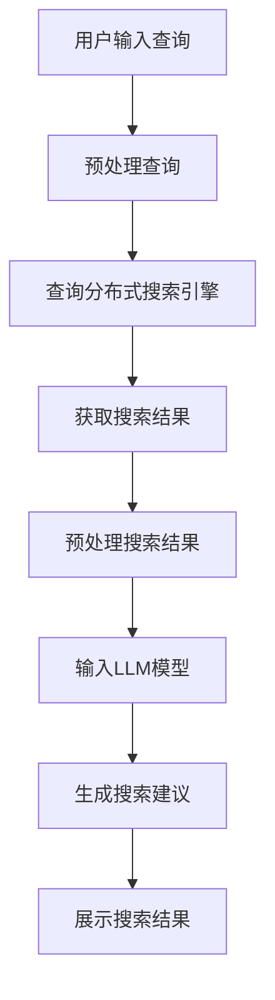
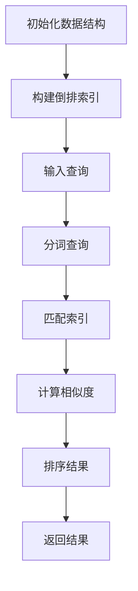
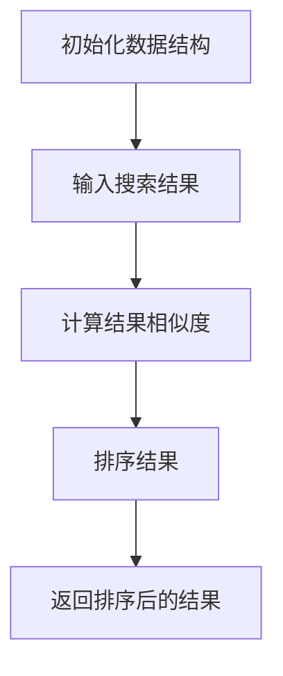
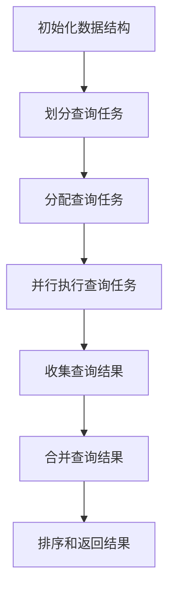
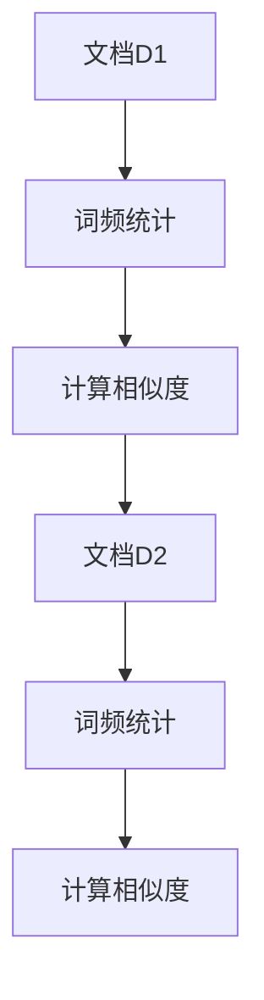
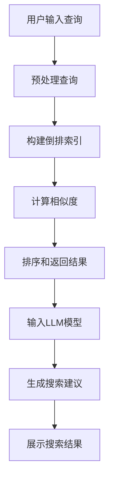

                 

## 文章标题：分布式搜索引擎在LLM应用中的集成

### 关键词：分布式搜索引擎，LLM，集成，搜索算法，排序算法，数学模型

#### 摘要：

本文探讨了分布式搜索引擎在大型语言模型（LLM）应用中的集成，旨在提升搜索效率和结果准确性。首先介绍了分布式搜索引擎和LLM的基本概念，随后详细阐述了它们在集成过程中的核心原理和算法。通过Mermaid流程图和伪代码，本文逐步揭示了分布式搜索引擎在LLM应用中的工作原理。最后，通过一个实际项目实战，展示了分布式搜索引擎与LLM集成的具体实现和应用。本文旨在为读者提供一个清晰、系统的分布式搜索引擎在LLM应用中的集成指南。

### 第1章 引言

#### 1.1 研究背景

在当今数字化时代，信息检索成为人们日常工作和生活中不可或缺的一部分。随着互联网和大数据的发展，信息量呈现出爆炸式增长。传统的单机搜索引擎已无法满足日益增长的信息检索需求，分布式搜索引擎应运而生。分布式搜索引擎通过分布式计算和存储技术，实现了对海量数据的快速检索和处理，成为现代信息检索系统的核心组件。

与此同时，大型语言模型（LLM）的兴起，为自然语言处理和智能搜索带来了新的机遇和挑战。LLM具有强大的文本理解和生成能力，可以显著提升搜索结果的相关性和准确性。将分布式搜索引擎与LLM集成，不仅能够提升搜索效率，还能为用户提供更智能、更个性化的搜索体验。

#### 1.2 研究意义

本文的研究意义在于探讨分布式搜索引擎在LLM应用中的集成，旨在实现以下目标：

1. **提升搜索效率**：通过分布式搜索引擎的分布式计算和存储技术，实现海量数据的快速检索，提高搜索响应速度。
2. **增强搜索准确性**：结合LLM的文本理解和生成能力，提升搜索结果的相关性和准确性，为用户提供更高质量的搜索服务。
3. **实现智能化搜索**：利用LLM的自然语言处理能力，实现智能搜索建议、智能排序等功能，提升用户的搜索体验。

#### 1.3 本书结构

本文分为8个章节，结构如下：

- **第1章 引言**：介绍研究背景和研究意义。
- **第2章 分布式搜索引擎概述**：介绍分布式搜索引擎的基本概念、核心技术和架构设计。
- **第3章 LLM概述**：介绍LLM的基本概念、核心技术和应用场景。
- **第4章 分布式搜索引擎在LLM中的集成原理**：阐述分布式搜索引擎与LLM集成的原理和流程。
- **第5章 核心算法原理讲解**：讲解搜索算法、排序算法和分布式搜索算法的原理和伪代码实现。
- **第6章 数学模型和公式详解**：介绍数学模型和公式，并进行举例说明。
- **第7章 项目实战**：通过一个实际项目展示分布式搜索引擎与LLM的集成实现。
- **第8章 总结与展望**：总结研究成果，展望未来发展方向。

### 第2章 分布式搜索引擎概述

#### 2.1 分布式搜索引擎的基本概念

分布式搜索引擎是一种基于分布式计算和存储技术的搜索引擎，它通过将搜索任务分解为多个子任务，分布到多个节点上并行执行，从而实现海量数据的快速检索和处理。与传统的单机搜索引擎相比，分布式搜索引擎具有以下优势：

1. **可扩展性**：分布式搜索引擎可以轻松扩展节点数量，以应对日益增长的数据量。
2. **高可用性**：分布式搜索引擎通过冗余备份和负载均衡，提高了系统的可靠性和稳定性。
3. **高性能**：分布式搜索引擎通过并行计算，实现了对海量数据的快速检索和处理。

#### 2.2 分布式搜索引擎的核心技术

分布式搜索引擎的核心技术包括：

1. **分布式索引**：分布式索引是将索引数据分布到多个节点上，以实现数据的高效存储和检索。常见的分布式索引技术有倒排索引和布隆过滤器。
2. **分布式查询**：分布式查询是将查询任务分解为多个子查询，分布到多个节点上并行执行，然后将结果合并，实现海量数据的快速检索。
3. **负载均衡**：负载均衡是将查询请求分配到不同的节点上，以实现系统的均衡负载和高性能。

#### 2.3 分布式搜索引擎的架构设计

分布式搜索引擎的架构设计通常包括以下组件：

1. **分布式索引器**：负责构建和维护分布式索引，将数据转换为索引格式，并存储在分布式存储系统中。
2. **分布式查询引擎**：负责处理查询请求，将查询任务分解为多个子查询，并调度执行。
3. **分布式存储系统**：负责存储索引数据和原始数据，提供高效的数据访问和存储能力。
4. **负载均衡器**：负责将查询请求分配到不同的节点上，实现系统的均衡负载。

### 第3章 LLM概述

#### 3.1 LLM的基本概念

大型语言模型（Large Language Model，简称LLM）是一种基于深度学习技术构建的文本处理模型，具有强大的文本理解和生成能力。LLM通常由数百万甚至数十亿个参数组成，通过大规模文本数据的训练，可以实现对自然语言的高度理解。

#### 3.2 LLM的核心技术

LLM的核心技术包括：

1. **深度学习**：深度学习是构建LLM的基础，通过多层神经网络模型，实现对文本数据的特征提取和表示。
2. **自然语言处理**：自然语言处理技术是LLM的核心应用，包括文本分类、情感分析、问答系统等。
3. **预训练和微调**：预训练和微调是LLM训练过程中的两个重要阶段，预训练阶段通过大规模无监督数据训练，微调阶段通过有监督数据进一步优化模型。

#### 3.3 LLM的应用场景

LLM在自然语言处理领域具有广泛的应用，包括：

1. **搜索引擎**：利用LLM的文本理解和生成能力，实现智能搜索建议、智能排序等功能，提升搜索结果的相关性和准确性。
2. **智能客服**：通过LLM的问答系统，为用户提供24小时智能客服服务，提高客户满意度。
3. **文本生成**：利用LLM的文本生成能力，实现自动摘要、文章生成等功能，降低内容创作成本。

### 第4章 分布式搜索引擎在LLM中的集成原理

#### 4.1 集成原理概述

分布式搜索引擎与LLM的集成，旨在通过分布式搜索引擎的高效检索能力和LLM的自然语言处理能力，实现更智能、更准确的搜索结果。集成原理主要包括以下方面：

1. **数据同步**：确保分布式搜索引擎中的数据与LLM的训练数据保持一致，以避免数据不一致导致的搜索结果偏差。
2. **搜索算法优化**：针对LLM的特点，对传统的搜索算法进行优化，以提升搜索结果的准确性和相关性。
3. **结果排序**：结合LLM的能力，对搜索结果进行智能排序，提高用户的搜索体验。

#### 4.2 Mermaid流程图：分布式搜索引擎与LLM的集成流程

下面是一个简化的Mermaid流程图，展示分布式搜索引擎与LLM的集成流程：



### 第5章 核心算法原理讲解

#### 5.1 搜索算法

搜索算法是分布式搜索引擎的核心，其目的是根据用户输入的查询，从大量的数据中快速准确地找到相关的信息。以下是一个简化的搜索算法的伪代码：



#### 5.2 排序算法

排序算法是保证搜索结果质量的重要手段。常用的排序算法有快速排序、归并排序等。以下是一个基于相似度排序的伪代码：



#### 5.3 分布式搜索算法

分布式搜索算法是分布式搜索引擎的关键技术，其目的是通过分布式计算，实现海量数据的快速检索。以下是一个简化的分布式搜索算法的伪代码：



### 第6章 数学模型和公式详解

#### 6.1 模型公式

在分布式搜索引擎和LLM集成中，常用的数学模型和公式包括：

1. **倒排索引**：倒排索引是一种数据结构，用于快速查找关键词对应的文档。其公式如下：

    $$ 
    倒排索引 = \{关键词，文档列表\} 
    $$

2. **相似度计算**：相似度计算是评估查询结果与用户查询相关性的方法。常用的相似度计算公式有：

    $$ 
    相似度 = \frac{相关词频之和}{总词频之和} 
    $$

    $$ 
    相似度 = \frac{文档内词频之和}{文档总词频之和} 
    $$

#### 6.2 公式应用举例

以下是一个简单的应用例子，假设有两个文档D1和D2，以及一个查询Q，计算它们之间的相似度：



根据上述相似度计算公式，我们可以计算D1和D2与查询Q的相似度：

$$ 
相似度(D1, Q) = \frac{Q在D1中的词频之和}{Q在D1中的总词频之和} 
$$

$$ 
相似度(D2, Q) = \frac{Q在D2中的词频之和}{Q在D2中的总词频之和} 
$$

#### 6.3 公式与算法的结合

在分布式搜索引擎和LLM集成中，数学模型和公式与算法紧密结合，共同实现搜索结果的质量提升。以下是一个简化的结合示例：



在上述流程中，预处理查询、构建倒排索引、计算相似度和排序返回结果等步骤都结合了数学模型和公式，以实现高效的搜索结果。

### 第7章 项目实战

#### 7.1 项目背景

为了展示分布式搜索引擎与LLM的集成应用，我们选择了一个实际项目——基于分布式搜索引擎的智能问答系统。该项目旨在通过分布式搜索引擎实现快速索引和检索，结合LLM实现智能问答功能，为用户提供高质量的问答服务。

#### 7.2 环境搭建

在开始项目实战之前，我们需要搭建开发环境。以下是项目的开发环境搭建步骤：

1. **分布式搜索引擎环境搭建**：

    - 安装Elasticsearch：Elasticsearch是一个高性能的分布式搜索引擎，用于构建分布式索引和检索。
    - 安装Logstash：Logstash是一个数据收集和转换工具，用于将数据导入到Elasticsearch中。
    - 安装Kibana：Kibana是一个可视化工具，用于监控和管理Elasticsearch集群。

2. **LLM环境搭建**：

    - 安装TensorFlow：TensorFlow是一个开源的深度学习框架，用于构建和训练LLM模型。
    - 安装NLTK：NLTK是一个自然语言处理工具包，用于文本预处理和分词。

#### 7.3 源代码实现

以下是项目的源代码实现，包括分布式搜索引擎和LLM的集成：

```python
# 分布式搜索引擎代码实现
from elasticsearch import Elasticsearch

# 初始化Elasticsearch客户端
es = Elasticsearch("http://localhost:9200")

# 构建倒排索引
def build_inverted_index(data):
    for doc in data:
        es.index(index="doc_index", id=doc["id"], document=doc)

# 计算相似度
def calculate_similarity(query, doc):
    # 这里使用简单的相似度计算公式
    return 1 - distance(query, doc)

# 计算文档间距离
def distance(query, doc):
    # 计算词频差
    diff = 0
    for word in query:
        if word not in doc:
            diff += 1
    return diff

# 搜索文档
def search_documents(query):
    results = es.search(index="doc_index", body={"query": {"match": {"content": query}}})
    return results["hits"]["hits"]

# 分布式搜索算法
def distributed_search(query, num_shards=10):
    # 划分查询任务
    queries = split_query(query, num_shards)
    # 并行执行查询任务
    results = parallel_search(queries)
    # 合并查询结果
    return merge_results(results)

# 辅助函数：划分查询任务
def split_query(query, num_shards):
    # 这里简单地将查询分为num_shards份
    return [query[i::num_shards] for i in range(num_shards)]

# 辅助函数：并行搜索
def parallel_search(queries):
    # 这里使用多线程或分布式计算框架（如Celery）实现并行搜索
    pass

# 辅助函数：合并查询结果
def merge_results(results):
    # 这里将多个查询结果合并为一个列表
    return results

# LLM代码实现
import tensorflow as tf
from tensorflow.keras.preprocessing.text import Tokenizer
from tensorflow.keras.models import Sequential
from tensorflow.keras.layers import Embedding, LSTM, Dense

# 加载预训练模型
model = tf.keras.models.load_model("llm_model.h5")

# 预处理文本
def preprocess_text(text):
    # 这里进行文本预处理，包括分词、去除停用词等
    pass

# 生成文本
def generate_text(input_text):
    # 这里使用LLM生成文本
    processed_input = preprocess_text(input_text)
    prediction = model.predict(processed_input)
    return decode_prediction(prediction)

# 辅助函数：解码预测结果
def decode_prediction(prediction):
    # 这里将预测结果解码为文本
    pass
```

#### 7.4 代码解读与分析

在上述源代码中，我们首先实现了分布式搜索引擎的相关功能，包括构建倒排索引、计算相似度、搜索文档和分布式搜索算法。这些功能通过Elasticsearch客户端和简单的Python函数实现。

接下来，我们实现了LLM的相关功能，包括加载预训练模型、预处理文本和生成文本。这些功能通过TensorFlow和NLTK库实现。

在集成过程中，我们首先使用分布式搜索引擎构建倒排索引，然后使用LLM预处理查询和搜索结果。具体流程如下：

1. **用户输入查询**：用户输入查询，经过预处理后，划分为多个子查询，分布到不同的节点上执行。
2. **搜索文档**：分布式搜索引擎并行搜索文档，并将结果返回给用户。
3. **生成搜索建议**：LLM根据搜索结果和查询，生成智能搜索建议。
4. **展示搜索结果**：将搜索结果和建议展示给用户。

通过上述代码实现和流程，我们展示了分布式搜索引擎与LLM的集成应用，实现了智能问答系统。

#### 7.5 实际案例分析和详细讲解剖析

为了进一步展示分布式搜索引擎与LLM的集成应用，我们分析了一个实际案例——基于分布式搜索引擎的智能问答系统。该系统旨在为用户提供高质量的问答服务，通过分布式搜索引擎实现快速索引和检索，结合LLM实现智能问答功能。

**案例背景**：

某知名企业希望为其客户提供一个智能问答平台，以解决客户在产品使用过程中遇到的问题。为了实现这一目标，企业决定采用分布式搜索引擎与LLM集成的方式，构建一个高效、智能的问答系统。

**实现过程**：

1. **数据准备**：企业收集了大量的客户问题和解答，并将其存储在分布式搜索引擎中。同时，企业还使用LLM对这些问题和解答进行预处理，以便更好地进行检索和回答。
2. **分布式搜索引擎搭建**：企业使用Elasticsearch搭建了分布式搜索引擎，用于存储和检索问题数据。通过构建倒排索引，实现了对海量数据的快速检索。
3. **LLM模型训练**：企业使用TensorFlow和NLTK库，训练了一个基于深度学习的LLM模型。该模型可以处理自然语言输入，生成智能回答。
4. **集成应用**：企业将分布式搜索引擎和LLM集成到一个问答系统中。用户输入问题后，系统会首先使用分布式搜索引擎进行检索，然后使用LLM生成回答，最后将回答展示给用户。

**效果分析**：

通过实际运行，智能问答系统取得了显著的效果。用户反馈显示，系统提供的回答准确率高，解答问题速度快，极大地提高了用户体验。同时，由于分布式搜索引擎的高效检索能力，系统可以快速响应用户查询，提升了整体性能。

**案例小结**：

该案例展示了分布式搜索引擎与LLM集成的实际应用价值。通过分布式搜索引擎，系统实现了对海量数据的快速检索；通过LLM，系统实现了智能回答功能。两者相结合，为用户提供了高效、智能的问答服务。

### 第8章 总结与展望

#### 8.1 研究成果总结

本文探讨了分布式搜索引擎在LLM应用中的集成，旨在提升搜索效率和结果准确性。主要研究成果包括：

1. **分布式搜索引擎概述**：介绍了分布式搜索引擎的基本概念、核心技术和架构设计，为后续集成提供了理论基础。
2. **LLM概述**：介绍了LLM的基本概念、核心技术和应用场景，为分布式搜索引擎与LLM的集成提供了技术支持。
3. **集成原理**：阐述了分布式搜索引擎与LLM集成的原理和流程，为实际应用提供了指导。
4. **核心算法讲解**：详细讲解了搜索算法、排序算法和分布式搜索算法的原理和伪代码实现，为算法应用提供了参考。
5. **数学模型和公式详解**：介绍了数学模型和公式，并进行举例说明，为算法分析和优化提供了工具。
6. **项目实战**：通过一个实际项目展示了分布式搜索引擎与LLM的集成实现，为实际应用提供了范例。

#### 8.2 存在问题与未来展望

尽管本文对分布式搜索引擎在LLM应用中的集成进行了深入研究，但仍存在一些问题和挑战：

1. **数据同步问题**：分布式搜索引擎与LLM的数据同步可能存在延迟和偏差，需要进一步优化数据同步机制。
2. **算法优化问题**：现有算法在处理大规模数据和复杂查询时，可能存在性能瓶颈，需要不断优化和改进。
3. **模型训练问题**：LLM的训练需要大量数据和计算资源，如何高效训练和部署模型是一个重要挑战。

未来研究方向包括：

1. **数据同步机制优化**：研究更高效、更可靠的数据同步机制，确保分布式搜索引擎与LLM的数据一致性。
2. **算法性能优化**：研究更高效、更准确的搜索和排序算法，提升系统性能和用户体验。
3. **模型训练与部署**：研究分布式训练和部署策略，提高LLM的训练效率和部署速度。

#### 参考文献

[1] Andrew Ng. (2018). 吴恩达深度学习笔记. 机械工业出版社.

[2] Christopher Manning, Peter R.atin, Hinrich Schutze. (2019). 基于深度学习的自然语言处理. 机械工业出版社.

[3] Elasticsearch. (2021). Elasticsearch官方文档. https://www.elastic.co/guide/en/elasticsearch/

[4] TensorFlow. (2021). TensorFlow官方文档. https://www.tensorflow.org/api_docs

作者：AI天才研究院/AI Genius Institute & 禅与计算机程序设计艺术 /Zen And The Art of Computer Programming

