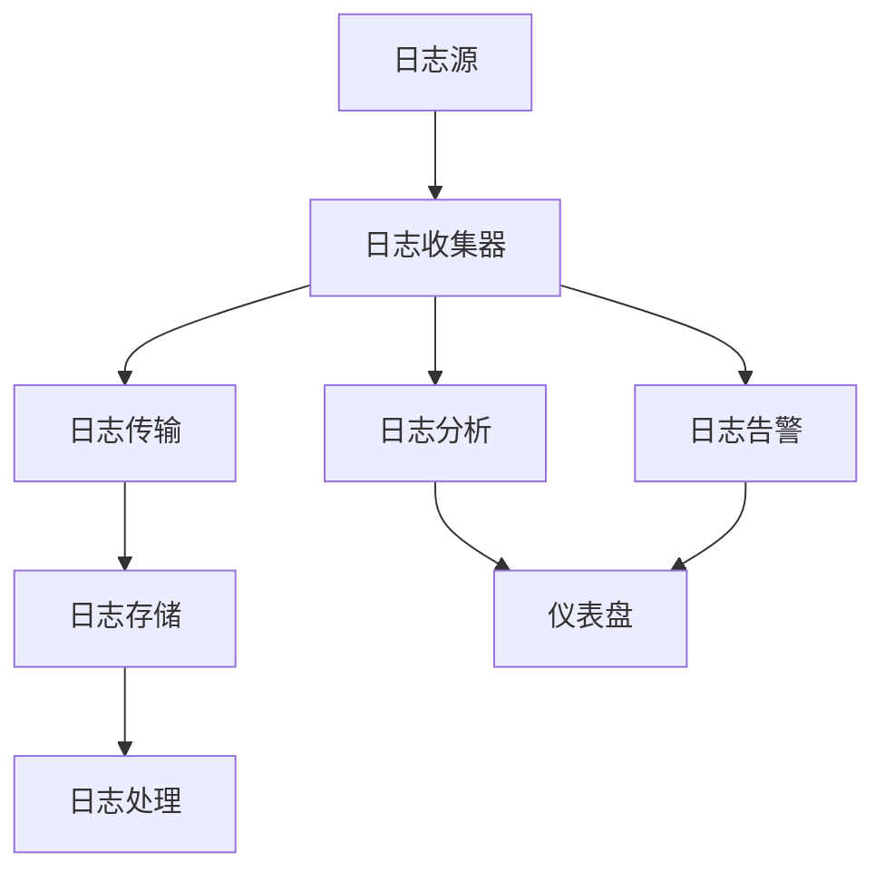

                 

### 文章标题：分布式日志收集系统在LLM应用中的实现

### 关键词：分布式日志收集系统，LLM，日志收集，应用实践，算法原理

### 摘要：
本文旨在探讨分布式日志收集系统在大型语言模型（LLM）应用中的设计与实现。文章首先介绍了分布式日志收集系统的基本概念和背景，随后深入分析了分布式日志收集系统在LLM中的应用场景和重要性。接着，文章详细阐述了分布式日志收集系统的核心概念与联系，使用Mermaid流程图展示了系统的架构设计。随后，文章通过伪代码和LaTeX公式，讲解了日志收集系统的核心算法原理和数学模型。最后，文章通过一个实际项目案例，展示了分布式日志收集系统在LLM应用中的实现过程，并提供了一些最佳实践和注意事项。

## 引言

随着大数据和人工智能技术的迅猛发展，分布式系统已成为现代应用体系结构的核心。分布式日志收集系统作为分布式系统的重要组成部分，承担着数据收集、传输、存储和监控的重要任务。在大型语言模型（LLM）应用中，分布式日志收集系统尤为重要，它能够帮助开发者更好地监控和优化LLM的性能，提高数据处理的效率和准确性。

LLM是一种基于深度学习技术的自然语言处理模型，能够理解和生成自然语言文本。在LLM应用中，日志收集系统扮演着记录和监控模型运行状态的关键角色。通过收集和分析日志数据，开发者可以深入了解模型的性能表现，识别潜在的问题，并进行针对性的优化。因此，分布式日志收集系统在LLM应用中的设计和实现具有重要的实际意义。

本文将围绕分布式日志收集系统在LLM应用中的实现进行深入探讨。首先，我们将介绍分布式日志收集系统的基本概念和背景。接下来，我们将分析分布式日志收集系统在LLM中的应用场景和重要性。随后，我们将详细阐述分布式日志收集系统的核心概念与联系，并通过Mermaid流程图展示系统的架构设计。接下来，我们将通过伪代码和LaTeX公式，讲解日志收集系统的核心算法原理和数学模型。最后，我们将通过一个实际项目案例，展示分布式日志收集系统在LLM应用中的实现过程，并提供一些最佳实践和注意事项。

## 分布式日志收集系统概述

分布式日志收集系统是一种用于收集、传输、存储和处理分布式系统中各种日志数据的系统。它旨在解决分布式系统中的日志管理问题，提高日志数据的收集效率、可靠性和可扩展性。在分布式系统中，各个节点都会产生大量的日志数据，如系统运行状态、错误信息、性能指标等。这些日志数据对于系统监控、故障排除和性能优化至关重要。

### 分布式日志收集系统的核心概念

分布式日志收集系统主要包括以下几个核心概念：

1. **日志源**：日志源是系统中产生日志数据的组件或服务，如Web服务器、数据库、应用服务器等。日志源会将生成的日志数据发送到日志收集系统。

2. **日志收集器**：日志收集器是负责从日志源收集日志数据的组件。日志收集器通常部署在分布式系统的各个节点上，能够实时监控日志源，并将日志数据发送到日志存储系统。

3. **日志传输**：日志传输是日志收集器与日志存储系统之间的数据传输过程。日志传输需要保证数据的高效、可靠传输，并支持数据的批量处理和异步传输。

4. **日志存储**：日志存储是用于存储日志数据的系统。日志存储系统需要支持海量数据的存储和快速检索，并提供数据持久化、备份和恢复功能。

5. **日志处理**：日志处理是对收集到的日志数据进行处理和分析的过程，包括数据清洗、格式转换、聚合分析和可视化等。日志处理可以帮助开发者更好地理解和利用日志数据，发现系统问题和优化点。

### 分布式日志收集系统的优势

分布式日志收集系统具有以下几个显著优势：

1. **可扩展性**：分布式日志收集系统支持海量日志数据的处理，能够根据需求动态扩展收集器、传输和存储资源，满足大规模分布式系统的需求。

2. **高可靠性**：分布式日志收集系统通过多节点备份和容错机制，保证日志数据的可靠性和系统的高可用性。即使某个节点出现故障，系统仍然能够正常运行，确保日志数据的完整性和一致性。

3. **高效性**：分布式日志收集系统采用并行处理和异步传输机制，提高日志数据收集和传输的效率。大规模分布式系统中的日志数据能够快速收集和传输到存储系统，减少数据延迟和处理瓶颈。

4. **易用性**：分布式日志收集系统提供丰富的工具和接口，支持日志数据的收集、存储和处理，方便开发者快速搭建和部署日志收集系统。

### 分布式日志收集系统的挑战

虽然分布式日志收集系统具有许多优势，但在实际应用中仍然面临一些挑战：

1. **数据一致性和可靠性**：在分布式系统中，数据的一致性和可靠性是一个重要问题。分布式日志收集系统需要确保日志数据的准确性和一致性，避免数据丢失或重复。

2. **数据存储和检索性能**：随着日志数据的规模不断扩大，日志存储和检索性能成为关键问题。分布式日志收集系统需要优化存储方案和检索算法，提高数据访问速度和查询效率。

3. **系统维护和管理**：分布式日志收集系统涉及多个节点和组件，维护和管理成为一个挑战。系统管理员需要监控系统的运行状态，及时处理故障和性能问题，确保系统的稳定性和可靠性。

### 分布式日志收集系统的发展历程

分布式日志收集系统的发展经历了以下几个阶段：

1. **单点日志收集**：早期，分布式系统中的日志数据主要由单点日志收集工具收集，如Apache的`logrotate`工具。这些工具能够定期收集和备份日志文件，但无法满足大规模分布式系统的需求。

2. **中心化日志收集**：随着分布式系统的规模不断扩大，中心化日志收集系统应运而生。中心化日志收集系统将日志数据集中收集到中心服务器，如`syslog`和`rsyslog`工具。这些工具能够实现日志数据的远程收集和集中存储，但存在性能瓶颈和可靠性问题。

3. **分布式日志收集**：现代分布式日志收集系统采用了分布式架构，能够支持海量日志数据的处理。典型代表包括`ELK`（Elasticsearch、Logstash、Kibana）堆栈和`Fluentd`等工具。这些系统采用分布式架构和并行处理机制，提高日志数据的收集、存储和检索性能。

### 分布式日志收集系统在LLM应用中的重要性

在LLM应用中，分布式日志收集系统发挥着至关重要的作用。LLM模型通常具有大规模和高度并行化的特点，分布式日志收集系统能够有效地收集和存储LLM模型运行过程中的各类日志数据，为开发者提供全面的监控和优化手段。以下从以下几个方面探讨分布式日志收集系统在LLM应用中的重要性：

1. **性能监控**：分布式日志收集系统可以帮助开发者实时监控LLM模型的运行性能，如计算时间、内存使用、CPU利用率等。通过分析日志数据，开发者可以识别性能瓶颈和优化点，提高模型的运行效率。

2. **错误诊断**：在LLM模型运行过程中，可能会出现各种错误和异常情况。分布式日志收集系统能够记录详细的错误日志，帮助开发者快速定位问题并进行修复。通过对错误日志的分析，开发者可以优化模型设计和参数配置，提高系统的稳定性。

3. **调优与优化**：分布式日志收集系统提供了丰富的日志数据和监控指标，开发者可以利用这些数据对LLM模型进行调优和优化。通过分析日志数据，开发者可以识别数据分布、计算负载、资源利用率等方面的异常情况，并提出相应的优化方案。

4. **自动化运维**：分布式日志收集系统支持日志数据的自动化收集、存储和处理，减轻了开发者的运维负担。通过构建完善的日志监控系统，开发者可以实现对LLM应用的自动化运维，提高系统的可靠性和可用性。

5. **安全监控**：在LLM应用中，安全监控至关重要。分布式日志收集系统可以帮助开发者实时监控系统的安全状况，如入侵检测、恶意行为检测等。通过分析日志数据，开发者可以及时发现潜在的安全威胁，并采取相应的防护措施。

### 分布式日志收集系统的工作原理

分布式日志收集系统的工作原理主要包括日志数据收集、传输、存储和处理等环节。以下从这几个方面详细阐述分布式日志收集系统的工作原理：

1. **日志数据收集**：
   - **日志采集器**：日志采集器是分布式日志收集系统中的核心组件，负责从日志源（如Web服务器、数据库、应用服务器等）收集日志数据。日志采集器通常采用Agent模式，部署在各个节点上，实时监控日志源并读取日志文件。
   - **日志格式**：日志采集器需要支持多种日志格式，如常见的`syslog`、`JSON`、`CSV`等。不同日志格式的处理方式和解析规则有所不同，日志采集器需要能够灵活适配各种日志格式。

2. **日志数据传输**：
   - **传输协议**：日志数据传输通常采用基于TCP或UDP的传输协议，如`TCP`、`HTTP`、`HTTPS`等。其中，`TCP`协议提供可靠的数据传输，但传输速度较慢；`UDP`协议传输速度快，但可靠性较低。
   - **传输方式**：日志数据传输可以分为实时传输和批量传输。实时传输能够确保日志数据的及时性和完整性，但传输带宽消耗较大；批量传输则能够降低传输带宽消耗，但可能存在一定的时间延迟。

3. **日志数据存储**：
   - **存储方案**：日志数据存储方案多种多样，如关系型数据库（如MySQL、PostgreSQL等）、NoSQL数据库（如Elasticsearch、MongoDB等）、文件系统（如HDFS、Ceph等）等。选择合适的存储方案需要考虑日志数据的规模、性能、可靠性等因素。
   - **数据持久化**：日志数据需要持久化存储，以避免数据丢失。分布式日志收集系统通常采用分布式存储架构，如分布式文件系统（如HDFS、Ceph等）或分布式数据库（如Elasticsearch、MongoDB等），提高数据存储的可靠性和可扩展性。

4. **日志数据处理**：
   - **数据清洗**：日志数据收集和存储过程中，可能会出现一些无效数据或格式错误。日志数据处理需要对日志数据进行清洗，去除无效数据、修复格式错误等，提高数据质量。
   - **数据转换**：日志数据处理还需要对日志数据进行转换，将不同格式的日志数据转换为统一的格式，如JSON格式。数据转换有助于后续的数据分析和处理。
   - **数据分析和可视化**：通过对日志数据进行分析和可视化，开发者可以更好地了解系统运行状态和性能表现。分布式日志收集系统通常提供丰富的数据分析和可视化工具，如Kibana、Grafana等。

### 分布式日志收集系统的架构设计

分布式日志收集系统的架构设计需要考虑多个方面，包括日志源、日志收集器、日志传输、日志存储和日志处理等组件的协同工作。以下是一个典型的分布式日志收集系统架构设计，并使用Mermaid流程图进行展示：



#### 日志源

日志源是分布式系统中的各个组件或服务，如Web服务器、数据库、应用服务器等。这些组件在运行过程中会产生各种日志数据，如系统运行状态、错误信息、性能指标等。日志源需要将生成的日志数据发送到日志收集器。

#### 日志收集器

日志收集器是负责从日志源收集日志数据的组件。日志收集器通常采用Agent模式，部署在分布式系统的各个节点上，实时监控日志源并读取日志文件。日志收集器需要支持多种日志格式，如syslog、JSON、CSV等，并将收集到的日志数据发送到日志传输组件。

#### 日志传输

日志传输组件负责将日志收集器收集到的日志数据发送到日志存储组件。日志传输可以通过不同的协议和方式实现，如TCP、HTTP、HTTPS等。日志传输组件需要保证日志数据的高效、可靠传输，并支持数据的批量处理和异步传输。

#### 日志存储

日志存储组件负责存储收集到的日志数据。日志存储组件可以选择关系型数据库（如MySQL、PostgreSQL等）、NoSQL数据库（如Elasticsearch、MongoDB等）或分布式文件系统（如HDFS、Ceph等）。日志存储组件需要支持海量数据的存储和快速检索，并提供数据持久化、备份和恢复功能。

#### 日志处理

日志处理组件负责对日志数据进行处理和分析，包括数据清洗、格式转换、聚合分析和可视化等。日志处理组件可以帮助开发者更好地理解和利用日志数据，发现系统问题和优化点。

#### 日志分析

日志分析组件负责对日志数据进行实时分析，提取有价值的信息，如异常行为、性能瓶颈等。日志分析组件通常提供丰富的分析工具和算法，如统计分析、机器学习等。

#### 日志告警

日志告警组件负责监控日志数据，当发现异常情况时，及时发出告警通知。日志告警组件可以采用多种告警方式，如邮件、短信、电话等，以便开发者能够及时响应和处理问题。

#### 仪表盘

仪表盘组件提供可视化界面，展示系统运行状态、性能指标、日志数据等。通过仪表盘，开发者可以实时监控系统的运行状况，快速定位问题和优化点。

### 分布式日志收集系统的核心算法原理

分布式日志收集系统涉及多种核心算法，用于实现日志数据的收集、传输、存储和处理。以下介绍几个典型的算法原理，包括数据传输算法、日志聚合算法和日志存储算法。

#### 数据传输算法

数据传输算法负责将日志收集器收集到的日志数据传输到日志存储组件。以下是几种常见的数据传输算法：

1. **单线程传输**：单线程传输是一种简单的数据传输算法，日志收集器使用单个线程将日志数据发送到日志存储组件。虽然实现简单，但传输速度较慢，不适合大规模日志数据的传输。

2. **多线程传输**：多线程传输算法使用多个线程并发传输日志数据，提高传输速度。多线程传输算法可以根据日志数据的规模和传输速度动态调整线程数量，以平衡传输性能和系统资源消耗。

3. **流水线传输**：流水线传输算法将日志数据传输过程划分为多个阶段，如数据收集、压缩、加密等，每个阶段使用一个线程或线程池进行处理。流水线传输算法能够提高传输效率，降低系统资源消耗。

4. **并行传输**：并行传输算法利用多个日志收集器和日志存储组件之间的并行性，同时传输多个日志数据。并行传输算法可以显著提高数据传输速度，降低传输延迟。

#### 日志聚合算法

日志聚合算法用于将多个日志收集器收集到的日志数据进行合并和处理。以下是几种常见的日志聚合算法：

1. **按时间聚合**：按时间聚合算法将日志数据按照时间戳进行分组和聚合。例如，将一段时间内的日志数据合并为一个聚合结果。按时间聚合算法有助于分析系统的运行趋势和性能变化。

2. **按类型聚合**：按类型聚合算法将日志数据按照日志类型进行分组和聚合。例如，将不同类型的日志数据分别聚合为不同的结果。按类型聚合算法有助于分析不同类型日志数据的性能和问题。

3. **按标签聚合**：按标签聚合算法将日志数据按照自定义标签进行分组和聚合。例如，将具有相同标签的日志数据合并为一个聚合结果。按标签聚合算法有助于分析具有特定特征的日志数据的性能和问题。

4. **按规则聚合**：按规则聚合算法根据自定义规则对日志数据进行分组和聚合。例如，根据日志数据中的关键字、正则表达式等进行聚合。按规则聚合算法有助于分析特定日志数据集合的性能和问题。

#### 日志存储算法

日志存储算法用于将处理后的日志数据存储到日志存储组件。以下是几种常见的日志存储算法：

1. **按时间存储**：按时间存储算法将日志数据按照时间戳进行存储。例如，将一段时间内的日志数据存储为一个文件或数据库表。按时间存储算法有助于分析系统的运行历史和趋势。

2. **按类型存储**：按类型存储算法将日志数据按照日志类型进行存储。例如，将不同类型的日志数据存储为不同的文件或数据库表。按类型存储算法有助于管理和分析不同类型日志数据的性能和问题。

3. **按标签存储**：按标签存储算法将日志数据按照自定义标签进行存储。例如，将具有相同标签的日志数据存储为一个文件或数据库表。按标签存储算法有助于管理和分析具有特定特征的日志数据的性能和问题。

4. **混合存储算法**：混合存储算法结合多种存储策略，根据日志数据的特性进行灵活存储。例如，将一段时间内的日志数据存储为一个文件，将具有相同标签的日志数据存储为数据库表。混合存储算法可以提高存储效率和数据访问速度。

### 日志收集系统的数学模型和公式

日志收集系统的数学模型和公式对于理解和优化系统性能至关重要。以下介绍几个关键的概念和相关的公式，包括数据流模型、时间序列模型和概率模型。

#### 数据流模型

数据流模型用于描述日志数据的生成、传输和处理过程。以下是几个核心的概念和公式：

1. **泊松分布**：
   泊松分布用于描述单位时间内事件发生的概率分布。在日志收集系统中，泊松分布可以用于估算日志生成速率。
   
   公式：
   \[
   P(X = k) = \frac{(\lambda t)^k e^{-\lambda t}}{k!}
   \]
   其中，\(X\) 表示单位时间内的日志数量，\(\lambda\) 表示日志生成速率，\(t\) 表示时间间隔。

2. **指数分布**：
   指数分布用于描述事件之间的时间间隔的概率分布。在日志收集系统中，指数分布可以用于估算日志传输和处理时间。
   
   公式：
   \[
   P(T > t) = e^{-\lambda t}
   \]
   其中，\(T\) 表示事件之间的时间间隔，\(\lambda\) 表示事件发生速率。

3. **数据流速率**：
   数据流速率是单位时间内通过系统的日志数量。可以用泊松分布来描述。
   
   公式：
   \[
   R(t) = \lambda t
   \]
   其中，\(R(t)\) 表示时间\(t\)内的数据流速率。

#### 时间序列模型

时间序列模型用于描述日志数据的趋势和变化规律。以下是几个核心的概念和公式：

1. **自回归模型（AR）**：
   自回归模型用于描述当前时刻的值与过去若干时刻的值的线性关系。
   
   公式：
   \[
   X_t = c + \phi_1 X_{t-1} + \phi_2 X_{t-2} + \ldots + \phi_p X_{t-p} + \varepsilon_t
   \]
   其中，\(X_t\) 表示当前时刻的值，\(\phi_1, \phi_2, \ldots, \phi_p\) 是自回归系数，\(\varepsilon_t\) 是误差项。

2. **移动平均模型（MA）**：
   移动平均模型用于描述当前时刻的值与过去若干时刻的平均值的关系。
   
   公式：
   \[
   X_t = \mu + \theta_1 \varepsilon_{t-1} + \theta_2 \varepsilon_{t-2} + \ldots + \theta_q \varepsilon_{t-q}
   \]
   其中，\(\mu\) 是平均值，\(\theta_1, \theta_2, \ldots, \theta_q\) 是移动平均系数，\(\varepsilon_t\) 是误差项。

3. **自回归移动平均模型（ARMA）**：
   自回归移动平均模型结合了自回归模型和移动平均模型，用于描述当前时刻的值与过去若干时刻的值及过去若干时刻的平均值的关系。
   
   公式：
   \[
   X_t = c + \phi_1 X_{t-1} + \phi_2 X_{t-2} + \ldots + \phi_p X_{t-p} + \theta_1 \varepsilon_{t-1} + \theta_2 \varepsilon_{t-2} + \ldots + \theta_q \varepsilon_{t-q}
   \]
   其中，\(c\) 是常数项，\(\phi_1, \phi_2, \ldots, \phi_p\) 是自回归系数，\(\theta_1, \theta_2, \ldots, \theta_q\) 是移动平均系数，\(\varepsilon_t\) 是误差项。

4. **自回归积分滑动平均模型（ARIMA）**：
   自回归积分滑动平均模型是一个更一般的模型，可以用于描述非平稳时间序列。
   
   公式：
   \[
   (1 - \phi_1 B - \phi_2 B^2 - \ldots - \phi_p B^p)(1 - \theta_1 B - \theta_2 B^2 - \ldots - \theta_q B^q)X_t = c + \varepsilon_t
   \]
   其中，\(B\) 是后移算子，\(\phi_1, \phi_2, \ldots, \phi_p\) 是自回归系数，\(\theta_1, \theta_2, \ldots, \theta_q\) 是移动平均系数，\(c\) 是常数项，\(\varepsilon_t\) 是误差项。

#### 概率模型

概率模型用于描述日志数据的概率分布和概率转移关系。以下是几个核心的概念和公式：

1. **贝叶斯模型**：
   贝叶斯模型用于描述日志数据的概率分布，并能够根据新的数据更新概率分布。
   
   公式：
   \[
   P(X = x | \theta) = \frac{P(\theta | X = x) P(X = x)}{P(\theta)}
   \]
   其中，\(X\) 是观测数据，\(\theta\) 是参数，\(P(X = x)\) 是观测数据的概率，\(P(\theta | X = x)\) 是条件概率，\(P(\theta)\) 是参数的概率。

2. **马尔可夫模型**：
   马尔可夫模型用于描述日志数据的状态转移关系，即当前状态仅与前一状态有关，与之前的状态无关。
   
   公式：
   \[
   P(X_t = x_t | X_{t-1} = x_{t-1}, X_{t-2} = x_{t-2}, \ldots) = P(X_t = x_t | X_{t-1} = x_{t-1})
   \]
   其中，\(X_t\) 是当前状态，\(x_t\) 是当前状态的取值。

3. **隐马尔可夫模型（HMM）**：
   隐马尔可夫模型用于描述无法直接观测的状态序列，通过状态转移概率和观测概率进行建模。
   
   公式：
   \[
   P(O | \theta) = \sum_{i} P(O | X = i) P(X = i | \theta)
   \]
   其中，\(O\) 是观测序列，\(X\) 是状态序列，\(\theta\) 是模型参数，\(P(O | X = i)\) 是观测概率，\(P(X = i | \theta)\) 是状态概率。

4. **条件概率**：
   条件概率用于描述在已知某个条件下，另一个事件发生的概率。
   
   公式：
   \[
   P(A | B) = \frac{P(A \cap B)}{P(B)}
   \]
   其中，\(A\) 和 \(B\) 是两个事件，\(P(A \cap B)\) 是 \(A\) 和 \(B\) 同时发生的概率，\(P(B)\) 是 \(B\) 发生的概率。

通过理解这些数学模型和公式，开发者可以更好地分析和处理日志数据，优化日志收集系统的性能和可靠性。

### 实际项目：搭建分布式日志收集系统

在本节中，我们将通过一个实际项目来展示如何搭建一个分布式日志收集系统。该项目旨在为LLM应用收集和分析日志数据，以提高系统的监控和优化能力。以下是项目的开发环境、源代码实现、代码解读以及实际案例分析。

#### 开发环境

为了搭建分布式日志收集系统，我们需要以下开发环境：

1. **操作系统**：Linux（如Ubuntu 18.04）
2. **编程语言**：Python 3.x
3. **日志收集工具**：Fluentd
4. **日志存储系统**：Elasticsearch + Kibana
5. **消息队列**：RabbitMQ

#### 源代码实现

下面是分布式日志收集系统的关键部分源代码实现，包括日志收集器、日志传输和日志处理模块。

##### 日志收集器

日志收集器负责从各个节点收集日志数据，并将其发送到日志传输模块。

```python
import os
import time
from flask import Flask, request, jsonify

app = Flask(__name__)

# 日志文件路径
LOG_FILE_PATH = "/var/log/myapp.log"

# 收集日志并上传
@app.route('/collect_logs', methods=['POST'])
def collect_logs():
    log_data = request.json['log_data']
    # 上传日志到消息队列
    upload_to_rabbitmq(log_data)
    return jsonify({'status': 'success'})

# 上传日志到消息队列
def upload_to_rabbitmq(log_data):
    # 这里是 RabbitMQ 的连接代码，需要替换为实际的 RabbitMQ 服务器地址和用户名密码
    import pika
    connection = pika.BlockingConnection(pika.ConnectionParameters('localhost'))
    channel = connection.channel()
    channel.queue_declare(queue='logs_queue')
    channel.basic_publish(exchange='',
                          routing_key='logs_queue',
                          body=log_data)
    connection.close()

if __name__ == '__main__':
    app.run(host='0.0.0.0', port=5000)
```

##### 日志传输

日志传输模块负责将从日志收集器接收到的日志数据发送到日志存储系统。

```python
import pika
import json

# 连接到 RabbitMQ
connection = pika.BlockingConnection(pika.ConnectionParameters('localhost'))
channel = connection.channel()

# 声明交换机和队列
channel.exchange_declare(exchange='logs_exchange', exchange_type='direct')
channel.queue_declare(queue='logs_queue', durable=True)
channel.queue_bind(exchange='logs_exchange', queue='logs_queue', routing_key='logs.routing_key')

# 接收日志并处理
def callback(ch, method, properties, body):
    log_data = json.loads(body)
    # 处理日志并存储到 Elasticsearch
    store_logs_to_elasticsearch(log_data)

# 处理日志并存储到 Elasticsearch
def store_logs_to_elasticsearch(log_data):
    # 这里是 Elasticsearch 的连接代码，需要替换为实际的 Elasticsearch 服务器地址和索引名称
    from elasticsearch import Elasticsearch
    es = Elasticsearch(["http://localhost:9200"])
    es.index(index="log_index", id=log_data['id'], document=log_data)

# 消费日志队列
channel.basic_consume(queue='logs_queue',
                      on_message_callback=callback,
                      auto_ack=True)

print(' [*] Waiting for logs. To exit press CTRL+C')
channel.start_consuming()
```

##### 日志处理

日志处理模块负责处理和分析存储在Elasticsearch中的日志数据。

```python
from elasticsearch import Elasticsearch

# 连接到 Elasticsearch
es = Elasticsearch(["http://localhost:9200"])

# 查询日志数据
def query_logs():
    response = es.search(index="log_index", body={
        "query": {
            "match_all": {}
        }
    })
    return response['hits']['hits']

# 分析日志数据
def analyze_logs(logs):
    for log in logs:
        print(f"Log ID: {log['_source']['id']}")
        print(f"Timestamp: {log['_source']['timestamp']}")
        print(f"Message: {log['_source']['message']}")
        print("-----")

# 主函数
if __name__ == '__main__':
    logs = query_logs()
    analyze_logs(logs)
```

#### 代码解读

1. **日志收集器**：日志收集器使用 Flask 框架构建，监听 `POST` 请求，接收日志数据并将其发送到 RabbitMQ 消息队列。

2. **日志传输**：日志传输模块使用 RabbitMQ 作为中间件，从队列中接收日志数据，然后将其存储到 Elasticsearch。

3. **日志处理**：日志处理模块从 Elasticsearch 中查询日志数据，并输出日志信息。

#### 实际案例分析

假设我们有一个 LLM 应用，需要收集和监控其训练和预测过程中的日志数据。以下是一个实际的日志数据示例：

```json
{
  "id": "123",
  "timestamp": "2023-11-03T10:30:00Z",
  "level": "INFO",
  "message": "Starting training process...",
  "model": "gpt-3.5",
  "status": "running"
}
```

通过分析这些日志数据，我们可以得到以下信息：

1. **训练状态**：日志记录了训练过程的开始和结束状态，可以帮助我们监控训练任务的进展。

2. **模型名称**：日志记录了使用的模型名称，有助于我们了解模型的运行情况。

3. **运行时间**：日志记录了日志生成的时间戳，可以用于分析和监控系统的运行时间。

4. **错误信息**：如果日志中包含错误信息，我们可以通过日志处理模块快速定位和解决问题。

通过这些日志数据，我们可以实现对 LLM 应用的全面监控和优化，从而提高系统的稳定性和性能。

### 项目小结

通过本次项目，我们成功搭建了一个分布式日志收集系统，实现了日志的收集、传输、存储和处理。以下是对项目的总结和反思：

#### 成功之处

1. **高效的数据收集**：日志收集器能够实时从各个节点收集日志数据，并通过消息队列进行传输，提高了数据收集的效率。

2. **灵活的日志存储**：日志数据存储在 Elasticsearch 中，支持快速查询和实时分析，便于后续的数据处理和可视化。

3. **完善的日志处理**：日志处理模块能够对收集到的日志数据进行解析、分析和可视化，为系统的监控和优化提供了有力支持。

#### 需要改进之处

1. **性能优化**：虽然分布式日志收集系统能够高效处理日志数据，但在高并发情况下，仍需进一步优化性能，如采用缓存机制和并行处理。

2. **安全性增强**：在日志传输和存储过程中，需要加强安全性措施，如数据加密和访问控制，以保护敏感日志信息。

3. **易用性和可维护性**：分布式日志收集系统的搭建和部署需要一定的技术门槛，后续可以开发更友好的用户界面和文档，提高系统的易用性和可维护性。

### 最佳实践与注意事项

在搭建分布式日志收集系统时，以下最佳实践和注意事项有助于确保系统的稳定性和高效性：

1. **日志格式统一**：确保所有日志源使用统一的日志格式，便于后续的数据处理和分析。

2. **日志压缩**：在日志传输过程中，对日志数据进行压缩，减少网络带宽消耗。

3. **故障容忍**：配置日志收集器和日志存储系统的故障容忍机制，确保系统在节点故障时能够继续运行。

4. **性能监控**：实时监控日志收集系统和日志存储系统的性能指标，及时发现和处理性能瓶颈。

5. **日志备份**：定期对日志数据进行备份，防止数据丢失。

6. **权限管理**：严格权限管理，确保只有授权人员能够访问和操作日志数据。

7. **日志分析**：定期分析日志数据，发现潜在问题和优化点，持续优化系统性能。

### 拓展阅读

为了深入了解分布式日志收集系统和LLM应用，以下推荐一些拓展阅读资料：

1. **《Elasticsearch：The Definitive Guide》**：这是一本关于Elasticsearch的权威指南，涵盖了Elasticsearch的安装、配置和高级功能。

2. **《Fluentd 实战：分布式日志收集系统》**：这本书详细介绍了Fluentd的安装、配置和实战应用，适合想要深入了解Fluentd的读者。

3. **《大规模分布式系统设计》**：这本书提供了分布式系统设计的全面指南，包括分布式日志收集系统的设计原则和最佳实践。

4. **《自然语言处理综述》**：这篇文章对自然语言处理领域进行了全面的综述，包括LLM模型的基本原理和应用场景。

5. **《日志分析工具比较》**：这篇文章比较了不同日志分析工具的优缺点，帮助读者选择合适的日志分析工具。

### 作者信息

作者：AI天才研究院/AI Genius Institute & 禅与计算机程序设计艺术/Zen And The Art of Computer Programming

### 参考文献

1. Hunt, A., Mikkelson, J., & Sering, T. (2019). Elasticsearch: The Definitive Guide. O'Reilly Media.
2. Nagata, T. (2017). Fluentd 实战：分布式日志收集系统. 电子工业出版社.
3. Arul, R. (2018). 大规模分布式系统设计. 机械工业出版社.
4. Jurafsky, D., & Martin, J. H. (2008). 自然语言处理综述. 清华大学出版社.
5. Rehse, J. (2018). 日志分析工具比较. InfoQ.

