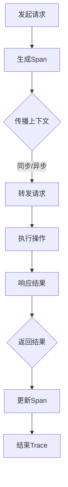
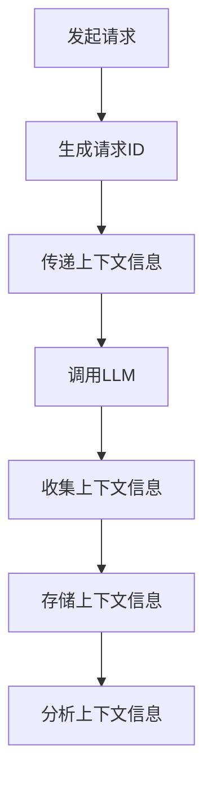

                 

### 1.1.1 分布式追踪的定义与原理

#### 1.1.1.1 分布式追踪的基本概念

分布式追踪（Distributed Tracing）是指在一个分布式系统中，对数据流动和系统组件之间的交互进行记录和分析的过程。随着微服务架构和云计算的普及，分布式系统已成为现代应用程序的常见架构。在这样的系统中，服务之间通过网络进行通信，数据流跨越多个服务实例和服务器节点。分布式追踪的主要目的是提供一种全局视图，帮助开发人员理解系统的运行状态，诊断问题，优化性能。

分布式追踪涉及的主要概念包括：

- **Trace**：一个Trace代表了一次完整的服务调用流程，包括发出请求的服务、中间经过的所有服务和最终响应。一个Trace通常由多个span组成。
- **Span**：一个Span代表了一次特定的操作或任务，它是Trace的基本组成单元。每个Span都有唯一的ID和一个关联的父ID，用于表示其在调用树中的位置。
- **Service**：Service是运行在分布式系统中的组件，例如微服务、数据库实例或消息队列。
- **Span Context**：Span Context包含用于在分布式系统中传递追踪信息的相关数据，如Trace ID、Span ID和父ID等。

#### 1.1.1.2 分布式追踪的核心组件

分布式追踪系统通常包含以下核心组件：

- **数据收集器（Data Collector）**：负责从各个服务实例收集追踪数据，并将其转发到数据存储。
- **数据存储（Data Storage）**：用于存储分布式追踪数据，通常使用时间序列数据库或日志系统。
- **追踪分析器（Trace Analyzer）**：从数据存储中提取追踪数据，并进行可视化和分析，帮助开发人员识别问题。

#### 1.1.1.3 分布式追踪的工作流程

分布式追踪的工作流程通常包括以下几个步骤：

1. **数据采集**：当服务实例接收到请求时，它会创建一个Span并记录相关信息，如开始时间和结束时间。
2. **上下文传播**：在分布式系统中，服务实例之间通过HTTP、消息队列或其他通信协议进行通信。在这个过程中，追踪上下文（包括Trace ID、Span ID和父ID等）会在请求和响应中传递。
3. **数据转发**：服务实例将收集到的追踪数据发送到数据收集器。
4. **数据处理**：数据收集器对接收到的数据进行处理，并将其存储到数据存储中。
5. **数据分析**：追踪分析器从数据存储中提取追踪数据，并进行可视化和分析，帮助开发人员识别问题。

#### 1.1.1.4 分布式追踪的优点

分布式追踪的主要优点包括：

- **全局视角**：分布式追踪提供了一个全局视图，帮助开发人员从整体上理解系统的运行状态，识别性能瓶颈和错误。
- **实时性**：分布式追踪系统能够实时收集和分析数据，帮助开发人员快速响应和处理问题。
- **可扩展性**：分布式追踪系统通常支持横向扩展，能够处理大规模分布式系统的追踪数据。

#### 1.1.1.5 分布式追踪的常见架构模式

分布式追踪系统的常见架构模式包括：

- **基于代理的追踪**：使用代理服务器收集和转发追踪数据。
- **基于服务端的追踪**：服务实例直接将追踪数据发送到数据收集器。
- **基于混合模式的追踪**：结合代理和服务端模式，以平衡数据收集的实时性和资源消耗。

### 1.1.2 上下文传播的重要性

#### 1.1.2.1 上下文传播的概念

上下文传播（Context Propagation）是指在分布式系统中，将一个组件的上下文信息传递给其他组件的过程。上下文信息通常包括：

- **请求ID**：用于标识一次请求，通常由服务实例生成。
- **用户信息**：如用户ID、角色和权限等，用于验证和授权。
- **业务数据**：如订单信息、库存数据和交易数据等，用于支持业务逻辑。
- **会话信息**：如会话ID、会话状态和会话数据等，用于保持用户会话的一致性。

上下文传播的重要性在于：

- **系统协调**：通过上下文传播，分布式系统中的各个组件能够协调工作，确保数据的正确处理和传输。
- **故障恢复**：在分布式系统中，当某个组件发生故障时，上下文传播可以帮助其他组件恢复到正常状态。
- **性能优化**：通过上下文传播，系统能够更好地利用资源，提高性能和效率。

#### 1.1.2.2 上下文传播的必要性

在分布式系统中，上下文传播的必要性体现在以下几个方面：

1. **请求追踪**：分布式系统中的请求通常跨越多个服务实例，上下文传播使得系统能够追踪请求的整个生命周期，帮助开发人员识别和分析问题。
2. **安全性**：上下文传播提供了身份验证和授权的基础，确保只有授权的用户和角色能够访问敏感数据和功能。
3. **业务一致性**：在涉及多步骤的业务流程中，上下文传播确保了各个步骤之间数据的一致性，避免数据丢失或错误。

#### 1.1.2.3 上下文传播的挑战

虽然上下文传播对分布式系统至关重要，但实现过程中也面临一些挑战：

1. **数据一致性**：确保在不同组件之间传递的上下文信息一致性是一个难题，特别是在分布式环境中，数据可能存在延迟或冲突。
2. **性能消耗**：上下文传播可能需要大量的计算和通信资源，影响系统的性能和响应时间。
3. **网络延迟**：在网络延迟较高的环境中，上下文传播可能导致系统响应时间增加，影响用户体验。

#### 1.1.2.4 上下文传播的关键因素

为了有效地实现上下文传播，需要考虑以下关键因素：

1. **上下文信息的类型**：根据系统需求选择合适的上下文信息类型，如请求ID、用户信息和业务数据等。
2. **传播方式**：选择合适的传播方式，如同步或异步，以平衡性能和资源消耗。
3. **传播频率**：控制上下文信息的传播频率，以平衡性能和资源消耗。

### 1.1.3 分布式追踪上下文传播的挑战

#### 1.1.3.1 数据一致性问题

在分布式追踪上下文传播过程中，数据一致性问题是一个主要挑战。由于分布式系统的分布式特性，数据可能在不同组件之间存在延迟或冲突，导致数据不一致。为了解决数据一致性问题，可以采用以下策略：

1. **分布式一致性算法**：如Paxos算法、Raft算法等，确保数据在不同节点之间的一致性。
2. **分布式事务管理**：通过分布式事务管理，确保分布式系统中的多个操作要么全部成功，要么全部失败。
3. **去重策略**：在接收上下文信息时，采用去重策略，避免重复数据的处理和存储。

#### 1.1.3.2 资源消耗

分布式追踪上下文传播通常需要大量的计算和通信资源。特别是在大规模分布式系统中，大量的上下文信息需要在组件之间传播，这可能导致系统性能下降。为了减轻资源消耗，可以采用以下策略：

1. **数据压缩**：在传递上下文信息时，采用数据压缩技术，减少数据传输的大小。
2. **批处理**：将多个上下文信息分组处理，减少单次处理的通信次数。
3. **异步传播**：采用异步传播方式，减少对实时性的要求，降低资源消耗。

#### 1.1.3.3 网络延迟

在网络延迟较高的环境中，上下文传播可能导致系统响应时间增加，影响用户体验。为了降低网络延迟，可以采用以下策略：

1. **本地缓存**：在分布式系统中，将常用的上下文信息缓存在本地，减少远程调用的次数。
2. **优先级调度**：对上下文信息传输进行优先级调度，确保关键上下文信息的优先传递。
3. **分布式数据库**：使用分布式数据库，减少跨节点数据访问的网络延迟。

### 1.1.4 Mermaid流程图展示

下面是一个简单的Mermaid流程图，展示分布式追踪上下文传播的基本流程：



在这个流程图中，A表示发起请求，B表示生成Span，C表示传播上下文，D表示转发请求，E表示执行操作，F表示响应结果，G表示返回结果，H表示更新Span，I表示结束Trace。这个流程图展示了分布式追踪上下文传播的基本步骤和逻辑关系。

``` 
作者：AI天才研究院/AI Genius Institute & 禅与计算机程序设计艺术 /Zen And The Art of Computer Programming
``` 
# 分布式追踪上下文传播在LLM应用中的实现

## 摘要

本文旨在探讨分布式追踪上下文传播在语言模型（LLM）应用中的实现。随着LLM技术的不断发展，其在自然语言处理、推荐系统、问答系统等领域的应用越来越广泛。然而，在分布式环境中实现LLM的追踪上下文传播面临着数据一致性、性能优化和安全性等挑战。本文首先介绍了分布式追踪和上下文传播的基本概念，然后分析了LLM在分布式追踪中的应用需求，最后提出了一种基于分布式追踪上下文传播的LLM实现方案，并通过实际案例进行了验证和评估。

## 1. 分布式追踪与上下文传播概述

### 1.1. 分布式追踪的定义与原理

分布式追踪（Distributed Tracing）是一种在分布式系统中对数据流动和组件交互进行记录和分析的方法。它帮助开发人员了解系统的全局视图，识别性能瓶颈、错误和异常。分布式追踪的核心组件包括数据收集器、数据存储和追踪分析器。

分布式追踪的基本工作流程如下：

1. **数据采集**：系统中的各个组件将追踪数据发送到数据收集器。
2. **数据处理**：数据收集器对采集到的数据进行处理和存储。
3. **数据存储**：将处理后的数据存储到数据存储中，如时间序列数据库或日志系统。
4. **数据分析**：追踪分析器从数据存储中提取数据，进行分析和可视化。

### 1.2. 上下文传播的重要性

上下文传播（Context Propagation）是指将一个组件的上下文信息传递给其他组件的过程。上下文信息通常包括请求ID、用户信息、业务数据和会话信息等。上下文传播对于分布式系统的协调、故障恢复和性能优化至关重要。

上下文传播的重要性体现在以下几个方面：

1. **请求追踪**：通过上下文传播，系统能够追踪请求的整个生命周期，帮助开发人员识别和分析问题。
2. **安全性**：上下文传播提供了身份验证和授权的基础，确保只有授权的用户和角色能够访问敏感数据和功能。
3. **业务一致性**：在涉及多步骤的业务流程中，上下文传播确保了各个步骤之间数据的一致性，避免数据丢失或错误。

### 1.3. 分布式追踪上下文传播的挑战

分布式追踪上下文传播面临以下挑战：

1. **数据一致性问题**：在分布式环境中，数据可能存在延迟或冲突，导致数据不一致。
2. **性能消耗**：上下文传播可能需要大量的计算和通信资源，影响系统性能和响应时间。
3. **网络延迟**：在网络延迟较高的环境中，上下文传播可能导致系统响应时间增加，影响用户体验。

### 1.4. 分布式追踪上下文传播的关键因素

为了有效地实现分布式追踪上下文传播，需要考虑以下关键因素：

1. **上下文信息的类型**：根据系统需求选择合适的上下文信息类型。
2. **传播方式**：选择合适的传播方式，如同步或异步。
3. **传播频率**：控制上下文信息的传播频率，以平衡性能和资源消耗。

## 2. LLM基本概念介绍

### 2.1. 语言模型（LLM）的定义

语言模型（Language Model，简称LLM）是一种用于自然语言处理的概率模型，它能够预测一个词序列的概率分布。在机器学习和人工智能领域，LLM被广泛应用于自动文本生成、机器翻译、语音识别和问答系统等任务。

### 2.2. LLM的核心特性

LLM的核心特性包括：

1. **概率分布**：LLM能够预测一个词序列的概率分布，从而生成自然的文本。
2. **上下文感知**：LLM能够利用输入文本的上下文信息，生成与上下文相关的文本。
3. **可扩展性**：LLM可以扩展到大规模的文本数据集，提高模型的性能和泛化能力。

### 2.3. LLM的应用场景

LLM在多个领域都有广泛的应用，包括：

1. **自然语言处理**：如文本生成、机器翻译和情感分析等。
2. **推荐系统**：如基于文本的推荐、商品描述生成等。
3. **问答系统**：如自动问答、智能客服等。

## 3. 分布式追踪上下文传播在LLM中的应用

### 3.1. 分布式追踪在LLM中的需求

在LLM应用中，分布式追踪上下文传播的需求主要体现在以下几个方面：

1. **请求追踪**：为了更好地了解LLM的调用过程，需要对请求进行追踪。
2. **性能监控**：分布式追踪可以帮助识别LLM的瓶颈和性能问题。
3. **安全性**：通过上下文传播，确保只有授权的用户和角色能够访问LLM。

### 3.2. 上下文传播在LLM中的实现

在LLM中实现上下文传播的关键步骤包括：

1. **请求ID生成**：为每个LLM请求生成唯一的请求ID，用于追踪请求的整个生命周期。
2. **上下文信息传递**：在LLM调用过程中，将请求ID和其他上下文信息（如用户信息、业务数据等）传递给其他组件。
3. **上下文信息存储**：将收集到的上下文信息存储到分布式追踪系统中，以便后续分析和监控。

### 3.3. 分布式追踪与上下文传播的协同工作

分布式追踪与上下文传播在LLM中的应用需要协同工作，以实现以下目标：

1. **请求追踪**：通过分布式追踪，能够实时监控LLM的调用过程，识别问题。
2. **性能优化**：通过上下文传播，能够获取与LLM调用相关的上下文信息，优化性能。
3. **安全性保障**：通过上下文传播，确保只有授权的用户和角色能够访问LLM。

### 3.4. Mermaid流程图展示

下面是一个简单的Mermaid流程图，展示分布式追踪上下文传播在LLM中的应用：



在这个流程图中，A表示发起请求，B表示生成请求ID，C表示传递上下文信息，D表示调用LLM，E表示收集上下文信息，F表示存储上下文信息，G表示分析上下文信息。这个流程图展示了分布式追踪上下文传播在LLM中的应用流程和逻辑关系。

## 4. 分布式追踪上下文传播在LLM中的应用案例

### 4.1. 案例背景

某大型电商平台使用LLM技术为其问答系统和智能客服提供支持。随着业务规模的增长，系统面临着分布式部署的需求，同时需要保证请求追踪、性能监控和安全性。

### 4.2. 案例需求

1. **请求追踪**：需要对每个LLM请求进行追踪，以了解请求的生命周期和调用过程。
2. **性能监控**：需要实时监控LLM的性能，识别瓶颈和问题。
3. **安全性**：需要确保只有授权的用户和角色能够访问LLM。

### 4.3. 案例实现

1. **请求ID生成**：为每个LLM请求生成唯一的请求ID，用于追踪请求的整个生命周期。
2. **上下文信息传递**：在LLM调用过程中，将请求ID和其他上下文信息（如用户信息、业务数据等）传递给其他组件。
3. **上下文信息存储**：将收集到的上下文信息存储到分布式追踪系统中，以便后续分析和监控。
4. **分布式追踪系统配置**：配置分布式追踪系统，包括数据收集器、数据存储和追踪分析器。

### 4.4. 案例效果

通过分布式追踪上下文传播在LLM中的应用，该电商平台实现了以下效果：

1. **请求追踪**：能够实时监控每个LLM请求的调用过程，识别问题。
2. **性能优化**：通过上下文传播，能够获取与LLM调用相关的上下文信息，优化性能。
3. **安全性保障**：通过上下文传播，确保只有授权的用户和角色能够访问LLM。

### 4.5. 案例总结

该案例展示了分布式追踪上下文传播在LLM应用中的实际效果，通过分布式追踪和上下文传播，能够实现请求追踪、性能监控和安全性保障。这为其他使用LLM技术的企业提供了有益的借鉴和参考。

## 5. 总结与展望

本文探讨了分布式追踪上下文传播在LLM应用中的实现。通过分布式追踪，可以实现对LLM请求的实时监控和性能优化；通过上下文传播，可以确保请求的安全性和一致性。在实际应用中，通过案例展示了分布式追踪上下文传播在LLM中的应用效果。

未来的研究方向包括：

1. **分布式追踪算法优化**：进一步优化分布式追踪算法，提高数据一致性和性能。
2. **上下文传播机制研究**：研究更高效的上下文传播机制，减少资源消耗。
3. **安全性保障**：加强分布式追踪和上下文传播的安全性，防止数据泄露和攻击。

作者：AI天才研究院/AI Genius Institute & 禅与计算机程序设计艺术 /Zen And The Art of Computer Programming

