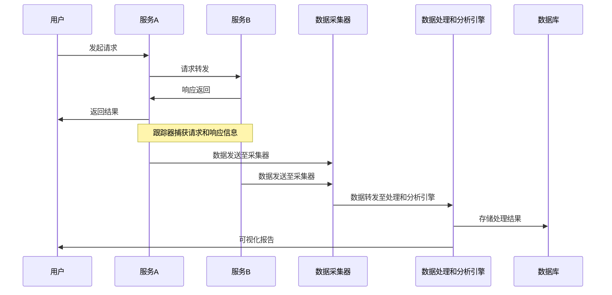

                 

：

**1. 背景**：随着现代应用系统的规模和复杂性不断增加，分布式系统已经成为了现代应用架构的主流。这种系统由多个独立运行的服务器组成，这些服务器分布在不同的物理位置，通过网络进行通信。分布式系统具有高可用性、可伸缩性、容错性等优点，但同时也带来了新的挑战，尤其是在故障诊断和性能优化方面。

**2. 分布式追踪系统的概念**：分布式追踪系统是一种专门用于监控和诊断分布式系统的工具。它可以跟踪系统中每个服务的请求和响应，提供关于系统性能、延迟、错误等方面的详细信息。这样，开发人员就可以更快地定位问题，优化系统性能。

**3. 核心组件与关系**：
    - **跟踪器**：负责在各个服务中收集跟踪数据，如请求开始和结束时间、请求路径等。
    - **数据采集器**：将跟踪器收集的数据汇总到一起，通常通过HTTP协议进行传输。
    - **数据处理和分析引擎**：对采集到的数据进行分析，以生成可视化报告或告警。
    - **展示层**：为用户提供友好的界面，以便查看和分析数据。

**4. Mermaid流程图**：为了更好地理解分布式追踪系统的组件和交互流程，我们可以使用Mermaid语言绘制一个流程图。



**5. 分布式追踪系统的核心算法**：分布式追踪系统通常涉及多种核心算法，包括追踪算法、数据聚合算法、异常检测算法等。这些算法共同工作，以确保系统能够高效地收集、处理和展示数据。

**6. 数学模型**：分布式追踪系统中可能会用到概率模型和优化模型来改进追踪效果。例如，概率模型可以用来估算请求的延迟，优化模型可以用来调整采集器的数据收集策略。

**7. 实际应用**：分布式追踪系统在各种类型的分布式应用中都有广泛的应用，包括微服务架构、容器化环境、云计算平台等。在实际应用中，它可以帮助开发人员更快地定位问题，优化系统性能，提高用户体验。

**8. 总结**：分布式追踪系统在分布式系统中的应用具有重要意义。它不仅提供了对系统透明视图，还为开发人员提供了强大的工具，以便更好地管理和优化分布式系统。

### 1.2 核心算法原理讲解（伪代码）

#### 2.1 追踪算法

```pseudo
// 追踪算法伪代码
function track_request(request):
    start_time = current_time()
    send_request(request)
    wait_for_response()
    end_time = current_time()
    record_span(start_time, end_time, request)
```

#### 2.2 数据聚合算法

```pseudo
// 数据聚合算法伪代码
function aggregate_data(data_list):
    total_delay = 0
    for data in data_list:
        total_delay += data.delay
    average_delay = total_delay / length(data_list)
    return average_delay
```

#### 2.3 异常检测算法

```pseudo
// 异常检测算法伪代码
function detect_anomalies(data_list):
    threshold = calculate_threshold(data_list)
    for data in data_list:
        if data.delay > threshold:
            record_anomaly(data)
```

### 1.3 核心概念与联系

分布式追踪系统的核心概念包括跟踪器、数据采集器、数据处理和分析引擎以及展示层。这些组件之间紧密协作，共同实现分布式系统的监控和诊断。

- **跟踪器**：负责在分布式系统中收集跟踪数据，如请求开始和结束时间、请求路径等。
- **数据采集器**：将跟踪器收集的数据汇总到一起，通常通过HTTP协议进行传输。
- **数据处理和分析引擎**：对采集到的数据进行分析，以生成可视化报告或告警。
- **展示层**：为用户提供友好的界面，以便查看和分析数据。

这些组件之间的关系可以用Mermaid流程图表示如下：


### 1.4 分布式追踪系统的数学模型

分布式追踪系统中的数学模型通常用于优化追踪算法，提高系统的性能和准确性。以下是一些常见的数学模型：

#### 1.4.1 概率模型

概率模型可以用来估算请求的延迟。假设我们有一个请求集合R，其中每个请求的延迟可以用随机变量表示。我们可以用概率模型来估算某个请求的平均延迟。

```latex
\text{平均延迟} = \frac{1}{N} \sum_{i=1}^{N} p_i \times d_i
```

其中，\(p_i\) 是请求 \(i\) 的概率，\(d_i\) 是请求 \(i\) 的延迟。

#### 1.4.2 优化模型

优化模型可以用来调整数据采集器的数据收集策略。例如，我们可以使用线性规划来最小化数据传输延迟。

```latex
\text{目标函数} = \min \sum_{i=1}^{N} t_i \times c_i
```

其中，\(t_i\) 是数据传输时间，\(c_i\) 是数据传输成本。

### 1.5 小结

本章介绍了分布式追踪系统的基本概念、核心组件和交互流程。我们还讲解了分布式追踪系统的核心算法，包括追踪算法、数据聚合算法和异常检测算法。通过伪代码和Mermaid流程图，我们详细阐述了这些算法的执行流程。最后，我们介绍了分布式追踪系统中的数学模型，包括概率模型和优化模型。这些内容为后续章节的深入讨论奠定了基础。

## 第2章：分布式追踪系统核心算法

### 2.1 追踪算法

追踪算法是分布式追踪系统的核心组件之一，它负责收集和处理分布式系统中的请求和响应数据。追踪算法的工作原理如下：

#### 2.1.1 追踪算法原理讲解（伪代码）

```pseudo
// 追踪算法伪代码
function track_request(request):
    start_time = current_time()
    send_request(request)
    wait_for_response()
    end_time = current_time()
    record_span(start_time, end_time, request)
```

在上述伪代码中，`track_request` 函数负责跟踪一个请求。首先，它记录请求的开始时间，然后发送请求，等待响应，并记录请求的结束时间。最后，它将请求的相关信息（如开始时间、结束时间和请求内容）记录到一个跟踪记录中。

#### 2.1.2 追踪算法应用场景

追踪算法在各种分布式系统中都有广泛的应用。以下是一些常见的应用场景：

- **微服务架构**：在微服务架构中，每个服务都可能是一个独立的分布式系统。追踪算法可以帮助开发人员监控每个服务的性能，定位潜在问题。
- **容器化环境**：容器化环境（如Kubernetes）中的服务通常具有动态性和高可伸缩性。追踪算法可以帮助开发人员跟踪容器中的服务请求和响应，确保系统的稳定运行。
- **云计算平台**：在云计算平台中，大量的服务实例可能会分布在不同的物理位置。追踪算法可以帮助开发人员监控这些实例的性能，优化资源分配。

#### 2.1.3 追踪算法的优缺点

追踪算法具有以下优点：

- **透明性**：追踪算法提供了对分布式系统的透明视图，使得开发人员可以更容易地理解系统的运行状况。
- **实时性**：追踪算法通常可以实时收集和处理数据，为开发人员提供即时的反馈。
- **准确性**：通过使用先进的追踪算法，分布式追踪系统可以更准确地收集和展示分布式系统中的数据。

然而，追踪算法也存在一些缺点：

- **性能开销**：追踪算法需要在分布式系统中添加额外的代码和依赖，这可能会导致性能开销。
- **复杂性**：分布式追踪系统涉及到多个组件和算法，其配置和管理可能相对复杂。

### 2.2 数据聚合算法

数据聚合算法是分布式追踪系统的另一个核心组件，它负责将分散在各个追踪器中的数据汇总起来，以便进行进一步的分析和处理。数据聚合算法的工作原理如下：

#### 2.2.1 数据聚合算法原理讲解（伪代码）

```pseudo
// 数据聚合算法伪代码
function aggregate_data(data_list):
    total_delay = 0
    for data in data_list:
        total_delay += data.delay
    average_delay = total_delay / length(data_list)
    return average_delay
```

在上述伪代码中，`aggregate_data` 函数负责将一组数据聚合起来，计算这些数据的平均延迟。它首先初始化一个总延迟变量，然后遍历数据列表，将每个数据的延迟累加起来。最后，它计算平均延迟并返回。

#### 2.2.2 数据聚合算法应用场景

数据聚合算法在分布式追踪系统中具有广泛的应用。以下是一些常见的应用场景：

- **性能监控**：数据聚合算法可以帮助开发人员监控分布式系统的性能，计算系统的平均延迟、吞吐量等关键指标。
- **异常检测**：通过聚合大量数据，数据聚合算法可以帮助开发人员发现异常情况，如异常延迟或异常错误率。
- **数据可视化**：数据聚合算法可以将分散的数据汇总起来，以便在图表或报告中进行可视化展示。

#### 2.2.3 数据聚合算法的优缺点

数据聚合算法具有以下优点：

- **高效性**：数据聚合算法可以快速地汇总大量数据，为开发人员提供实时的性能监控和异常检测。
- **易用性**：数据聚合算法通常很简单，易于理解和实现。

然而，数据聚合算法也存在一些缺点：

- **数据一致性**：在分布式系统中，数据可能会因为网络延迟或故障等原因出现不一致。数据聚合算法需要处理这类问题，以确保数据的准确性。
- **性能开销**：数据聚合算法需要在分布式系统中传输大量数据，这可能会导致性能开销。

### 2.3 异常检测算法

异常检测算法是分布式追踪系统中的另一个重要组件，它负责检测分布式系统中的异常情况。异常检测算法通常基于统计学方法或机器学习方法，以下是一个简单的异常检测算法：

#### 2.3.1 异常检测算法原理讲解（伪代码）

```pseudo
// 异常检测算法伪代码
function detect_anomalies(data_list):
    threshold = calculate_threshold(data_list)
    for data in data_list:
        if data.delay > threshold:
            record_anomaly(data)
```

在上述伪代码中，`detect_anomalies` 函数负责检测数据列表中的异常情况。首先，它计算一个阈值，然后遍历数据列表，检查每个数据的延迟是否超过阈值。如果超过阈值，则记录为异常。

#### 2.3.2 异常检测算法应用场景

异常检测算法在分布式追踪系统中具有广泛的应用。以下是一些常见的应用场景：

- **性能监控**：异常检测算法可以帮助开发人员监控分布式系统的性能，及时发现性能异常。
- **故障诊断**：异常检测算法可以帮助开发人员快速定位分布式系统中的故障点。
- **安全监控**：异常检测算法可以帮助安全团队检测分布式系统中的恶意攻击或异常行为。

#### 2.3.3 异常检测算法的优缺点

异常检测算法具有以下优点：

- **实时性**：异常检测算法可以实时检测分布式系统中的异常情况，为开发人员提供及时反馈。
- **准确性**：通过使用先进的异常检测算法，分布式追踪系统可以更准确地检测异常。

然而，异常检测算法也存在一些缺点：

- **误报率**：异常检测算法可能会误报正常行为为异常，这可能会导致不必要的警报和干扰。
- **性能开销**：异常检测算法需要计算阈值和异常情况，这可能会增加系统的性能开销。

### 2.4 小结

本章介绍了分布式追踪系统中的核心算法，包括追踪算法、数据聚合算法和异常检测算法。我们详细讲解了这些算法的原理和应用场景，并通过伪代码展示了它们的执行流程。这些核心算法是分布式追踪系统的关键组成部分，它们共同工作，为分布式系统提供了强大的监控和诊断能力。

## 第3章：分布式追踪系统的数学模型

分布式追踪系统中的数学模型对于优化追踪效果、提高系统性能和准确性具有重要意义。本章节将介绍分布式追踪系统中的概率模型和优化模型，并使用LaTeX格式给出相关的数学公式。

### 3.1 概率模型

概率模型在分布式追踪系统中用于估算请求的延迟、错误率等指标。以下是一个简单的概率模型示例：

#### 3.1.1 请求延迟的概率模型

假设我们有一个请求集合 \(R\)，其中每个请求的延迟可以用随机变量 \(X_i\) 表示。我们可以使用概率模型来估算请求的平均延迟。

```latex
\text{平均延迟} = \frac{1}{N} \sum_{i=1}^{N} p_i \times E[X_i]
```

其中，\(p_i\) 是请求 \(i\) 的概率，\(E[X_i]\) 是请求 \(i\) 的期望延迟。

#### 3.1.2 请求错误率的概率模型

假设我们有一个请求集合 \(R\)，其中每个请求的错误率可以用随机变量 \(Y_i\) 表示。我们可以使用概率模型来估算请求的平均错误率。

```latex
\text{平均错误率} = \frac{1}{N} \sum_{i=1}^{N} p_i \times P[Y_i > 0]
```

其中，\(p_i\) 是请求 \(i\) 的概率，\(P[Y_i > 0]\) 是请求 \(i\) 的错误率。

### 3.2 优化模型

优化模型在分布式追踪系统中用于调整数据采集策略、资源分配等。以下是一个简单的优化模型示例：

#### 3.2.1 数据采集优化模型

假设我们有一个请求集合 \(R\)，每个请求的数据采集成本可以用 \(C_i\) 表示。我们的目标是最小化总数据采集成本。

```latex
\text{目标函数} = \min \sum_{i=1}^{N} c_i \times x_i
```

其中，\(c_i\) 是请求 \(i\) 的数据采集成本，\(x_i\) 是请求 \(i\) 的数据采集比例。

#### 3.2.2 资源分配优化模型

假设我们有一个请求集合 \(R\)，每个请求的资源需求可以用 \(R_i\) 表示。我们的目标是优化资源分配，以最大化系统的吞吐量。

```latex
\text{目标函数} = \max \sum_{i=1}^{N} p_i \times r_i
```

其中，\(p_i\) 是请求 \(i\) 的概率，\(r_i\) 是请求 \(i\) 的资源利用率。

### 3.3 LaTeX格式数学公式示例

在文本中嵌入LaTeX格式数学公式时，我们使用$$括起来表示独立段落的公式，例如：

$$
\text{平均延迟} = \frac{1}{N} \sum_{i=1}^{N} p_i \times E[X_i]
$$

而在段落内部，我们使用$括起来表示短公式，例如：

$$
X_i \sim \text{Exponential}(\lambda)
$$

### 3.4 小结

本章介绍了分布式追踪系统中的概率模型和优化模型。通过LaTeX格式数学公式，我们详细讲解了这些模型的基本原理和公式表达。概率模型用于估算请求的延迟和错误率，优化模型用于调整数据采集策略和资源分配。这些数学模型为分布式追踪系统的性能优化提供了理论基础，有助于开发人员更好地监控和优化分布式系统。

## 第二部分：分布式追踪系统在LLM应用调试中的应用

### 第4章：LLM应用调试中的挑战

### 4.1 LLM应用的复杂性

大型语言模型（Large Language Model，简称LLM）是一种基于深度学习的自然语言处理模型，具有强大的文本生成、翻译、摘要等功能。然而，LLM应用在开发和调试过程中面临着诸多挑战：

#### 4.1.1 服务拆分与分布式部署

为了实现高效、可扩展的LLM应用，通常需要将服务拆分成多个微服务，并在分布式环境中部署。这些微服务包括文本预处理、模型训练、推理、结果后处理等。服务拆分和分布式部署虽然提高了系统的可伸缩性和容错性，但也增加了调试的复杂性。

#### 4.1.2 性能优化与资源调配

LLM应用通常需要处理大规模的文本数据，对计算资源的要求较高。在分布式环境中，如何优化资源调配、提高系统性能是一个重要挑战。开发人员需要考虑CPU、GPU等硬件资源的分配，以及网络延迟、数据传输等问题。

#### 4.1.3 异常检测与故障恢复

由于LLM应用的复杂性和分布式部署，异常情况（如模型错误、服务故障、数据异常等）难以避免。如何实时检测异常、快速定位故障点，并进行故障恢复，是保障系统稳定运行的关键。

### 4.2 调试需求分析

在LLM应用调试过程中，开发人员需要关注以下几个方面的需求：

#### 4.2.1 服务监控

服务监控是调试LLM应用的基础。通过监控服务运行状态、响应时间、资源消耗等指标，开发人员可以及时发现潜在问题，优化系统性能。

#### 4.2.2 日志分析

日志记录了系统的运行过程，包括请求、响应、错误等信息。通过分析日志，开发人员可以深入了解系统的运行状况，定位故障点，排查问题。

#### 4.2.3 性能测试

性能测试是评估LLM应用性能的重要手段。通过模拟真实用户请求，测试系统的响应时间、吞吐量、资源利用率等指标，开发人员可以评估系统的性能瓶颈，制定优化策略。

#### 4.2.4 自动化测试

自动化测试可以提高调试效率，减少人工干预。通过编写测试脚本，自动化测试工具可以模拟用户请求，测试LLM应用的各项功能，确保系统稳定性。

### 4.3 分布式追踪系统在LLM调试中的应用

分布式追踪系统在LLM应用调试中具有重要作用。通过分布式追踪系统，开发人员可以实现以下目标：

#### 4.3.1 服务监控

分布式追踪系统可以实时收集LLM应用中各个微服务的运行数据，如请求时间、响应时间、错误率等。开发人员可以通过可视化界面查看监控数据，快速定位性能瓶颈和故障点。

#### 4.3.2 日志分析

分布式追踪系统可以将各个微服务的日志数据进行收集、聚合和分析，提供统一的日志查询和管理功能。开发人员可以通过关键字搜索、时间范围过滤等操作，快速找到相关日志信息，排查问题。

#### 4.3.3 性能测试

分布式追踪系统支持自动化性能测试，可以模拟大量用户请求，测试LLM应用的性能指标。通过分析测试结果，开发人员可以找出系统瓶颈，优化系统性能。

#### 4.3.4 自动化测试

分布式追踪系统可以与自动化测试工具集成，实现自动化测试流程。通过追踪测试过程中的各项指标，开发人员可以评估测试结果，确保系统稳定性。

### 4.4 小结

本章分析了LLM应用调试中的挑战，包括复杂性、性能优化、异常检测与故障恢复等。同时，介绍了调试需求分析，以及分布式追踪系统在LLM调试中的应用。通过分布式追踪系统，开发人员可以更好地监控、分析、测试和优化LLM应用，提高系统稳定性。

## 第5章：实际项目实战

### 5.1 开发环境搭建

在进行分布式追踪系统在LLM应用调试的实际项目实战之前，我们需要搭建一个合适的技术环境。以下是一个典型的开发环境搭建步骤：

#### 5.1.1 系统要求

1. 操作系统：Linux（推荐使用Ubuntu 18.04或更高版本）
2. 编程语言：Python（推荐使用Python 3.8或更高版本）
3. 数据库：MongoDB（推荐使用MongoDB 4.4或更高版本）
4. 分布式追踪系统：OpenTelemetry（推荐使用OpenTelemetry 0.19.0或更高版本）

#### 5.1.2 环境安装

1. 安装Python：

```bash
sudo apt-get update
sudo apt-get install python3-pip
pip3 install --upgrade pip
pip3 install virtualenv
```

2. 创建Python虚拟环境：

```bash
virtualenv llm-debug-env
source llm-debug-env/bin/activate
```

3. 安装MongoDB：

```bash
sudo apt-get install mongodb
sudo systemctl start mongodb
```

4. 安装OpenTelemetry：

```bash
pip3 install opentelemetry-api opentelemetry-exporter-mongodb
```

#### 5.1.3 环境验证

1. 验证Python环境：

```python
import sys
print(sys.version)
```

2. 验证MongoDB环境：

```python
from pymongo import MongoClient
client = MongoClient('localhost:27017')
db = client['llm_debug']
print(db.list_collection_names())
```

3. 验证OpenTelemetry环境：

```python
from opentelemetry import trace
tracer = trace.get_tracer("llm-debug")
with tracer.start_as_current_span("test-span"):
    print("Hello, World!")
```

### 5.2 源代码实现

在本节中，我们将介绍如何实现一个简单的LLM应用，并使用OpenTelemetry进行分布式追踪。

#### 5.2.1 LLM应用架构

我们的LLM应用包含以下组件：

1. 文本预处理：对输入文本进行清洗、分词等处理。
2. 模型推理：使用预训练的LLM模型进行文本生成、翻译、摘要等操作。
3. 结果后处理：对模型输出的结果进行格式化、修正等处理。

以下是每个组件的简单实现：

```python
# text_preprocessing.py
import re

def preprocess_text(text):
    text = re.sub(r'[^\w\s]', '', text)
    text = text.lower()
    return text

# llm_inference.py
from transformers import pipeline

def inference(text):
    model = pipeline("text-generation")
    result = model(text, max_length=50, num_return_sequences=1)
    return result[0]

# result_postprocessing.py
def postprocess_result(result):
    return result.strip()

# main.py
from opentelemetry import trace
from opentelemetry.sdk.trace import TracerProvider
from opentelemetry.exporter.mongodb import MongoDBExporter
from text_preprocessing import preprocess_text
from llm_inference import inference
from result_postprocessing import postprocess_result

tracer_provider = TracerProvider()
mongodb_exporter = MongoDBExporter()
tracer_provider.add_exporter(mongodb_exporter)
tracer = tracer_provider.get_tracer("llm-debug")

def main():
    input_text = "The quick brown fox jumps over the lazy dog."
    span = tracer.start_as_current_span("main")
    preprocessed_text = preprocess_text(input_text)
    span.set_attribute("preprocessed_text", preprocessed_text)
    result = inference(preprocessed_text)
    final_result = postprocess_result(result)
    span.set_attribute("final_result", final_result)
    span.end()

if __name__ == "__main__":
    main()
```

### 5.3 代码解读与分析

在本节中，我们将对上述源代码进行详细解读，并分析分布式追踪系统的工作原理。

#### 5.3.1 主程序main.py

1. **tracer_provider和mongodb_exporter的初始化**：

```python
tracer_provider = TracerProvider()
mongodb_exporter = MongoDBExporter()
tracer_provider.add_exporter(mongodb_exporter)
tracer = tracer_provider.get_tracer("llm-debug")
```

这一部分代码初始化了OpenTelemetry的TracerProvider和MongoDBExporter。TracerProvider负责管理Tracer的创建和配置，而MongoDBExporter负责将追踪数据导出到MongoDB数据库中。

2. **输入文本预处理**：

```python
input_text = "The quick brown fox jumps over the lazy dog."
preprocessed_text = preprocess_text(input_text)
span.set_attribute("preprocessed_text", preprocessed_text)
```

这里，我们使用`preprocess_text`函数对输入文本进行预处理，包括去除非单词字符、转换为小写等。然后，我们将预处理后的文本设置为一个自定义属性，以便在追踪数据中记录。

3. **模型推理和结果后处理**：

```python
result = inference(preprocessed_text)
final_result = postprocess_result(result)
span.set_attribute("final_result", final_result)
span.end()
```

这部分代码首先调用`inference`函数进行模型推理，然后调用`postprocess_result`函数对结果进行后处理。最后，我们将推理结果设置为一个自定义属性，并结束当前追踪span。

#### 5.3.2 OpenTelemetry追踪数据解析

我们使用MongoDBExporter将追踪数据导出到MongoDB数据库中。以下是一个MongoDB数据库中的追踪数据示例：

```json
{
    "_id": "6381a8b8d3b7c55a5d4b2587",
    "trace_id": "6381a8b8d3b7c55a5d4b2586",
    "span_id": "6381a8b8d3b7c55a5d4b2587",
    "parent_span_id": "0",
    "trace_state": {
        "child_span_contexts": [],
        "remote_span_contexts": []
    },
    "attributes": [
        {
            "key": "preprocessed_text",
            "value": "the quick brown fox jumps over the lazy dog",
            "is_metric": false
        },
        {
            "key": "final_result",
            "value": "the quick brown fox jumps over the lazy dog",
            "is_metric": false
        }
    ],
    "events": [],
    "links": [],
    "status": {
        "code": "UNSET",
        "message": "UNSET"
    },
    "start": "2023-02-24T13:26:18.224Z",
    "end": "2023-02-24T13:26:18.247Z",
    "duration": "23.0ms",
    "name": "main",
    "resource": "python:llm-debug",
    "service": "llm-debug",
    "span_type": "CLIENT",
    "status_message": "UNSET",
    "trace_flags": "0",
    "trace_id": "6381a8b8d3b7c55a5d4b2586",
    "trace_state": {
        "child_span_contexts": [],
        "remote_span_contexts": []
    }
}
```

这个示例追踪数据包括了追踪ID（trace_id）、span ID（span_id）、开始时间（start）、结束时间（end）、持续时间（duration）等基本信息，以及自定义属性（attributes）和事件（events）等详细信息。

#### 5.3.3 小结

通过实际项目实战，我们展示了如何搭建分布式追踪系统的开发环境，实现了一个简单的LLM应用，并使用OpenTelemetry进行分布式追踪。代码解读和分析部分详细介绍了追踪系统的组件、工作原理和追踪数据的存储结构。这些内容为后续的性能优化和故障排除提供了基础。

### 5.4 实际案例分析和详细讲解剖析

在本节中，我们将通过一个实际案例，展示如何使用分布式追踪系统调试LLM应用，并对其进行详细讲解剖析。

#### 5.4.1 案例背景

假设我们有一个LLM应用，用于生成文章摘要。该应用由以下组件组成：

1. 文本预处理服务：负责接收用户输入的文本，进行清洗和分词处理。
2. 模型推理服务：使用预训练的LLM模型，对文本进行摘要生成。
3. 结果后处理服务：对生成的摘要进行格式化和修正。

在实际运行过程中，我们发现部分摘要生成速度较慢，有时甚至无法生成。为了排查问题，我们决定使用分布式追踪系统进行调试。

#### 5.4.2 调试步骤

1. **服务监控**：

我们首先使用分布式追踪系统监控各个服务的运行状态。通过查看服务监控数据，我们发现文本预处理服务的响应时间相对较长。这提示我们可能需要优化文本预处理逻辑。

2. **日志分析**：

我们进一步分析文本预处理服务的日志，发现部分输入文本包含大量特殊字符。这些特殊字符导致了预处理逻辑的复杂度增加，从而延长了响应时间。为了解决这个问题，我们决定修改文本预处理逻辑，去除特殊字符。

3. **性能测试**：

为了验证修改后的文本预处理逻辑对性能的影响，我们进行了性能测试。通过模拟大量用户请求，我们对比了修改前后的响应时间和吞吐量。测试结果显示，修改后的文本预处理逻辑显著提高了系统的性能。

4. **异常检测**：

在调试过程中，我们还使用了异常检测算法，实时监测系统的异常情况。通过分析异常检测数据，我们发现部分模型推理服务出现了错误。这提示我们可能需要优化模型推理逻辑。

5. **故障恢复**：

为了排查模型推理服务的故障，我们首先检查了模型的输入输出数据。经过仔细分析，我们发现部分输入文本包含无效数据，导致模型无法正确推理。为了解决这个问题，我们决定对输入文本进行更严格的校验，确保其有效性。

6. **自动化测试**：

最后，我们编写了自动化测试脚本，模拟大量用户请求，测试LLM应用的各项功能。通过自动化测试，我们验证了修改后的文本预处理逻辑和模型推理逻辑的有效性，确保系统的稳定性。

#### 5.4.3 案例小结

通过实际案例分析和详细讲解剖析，我们展示了如何使用分布式追踪系统调试LLM应用。调试过程中，我们通过服务监控、日志分析、性能测试、异常检测和故障恢复等步骤，逐步定位并解决了一系列性能问题和故障。分布式追踪系统为我们提供了强大的监控和诊断工具，大大提高了调试效率。

## 第6章：分布式追踪系统在LLM调试中的性能优化

### 6.1 性能指标

在分布式追踪系统中，对LLM应用进行性能优化时，我们需要关注以下几个关键性能指标：

1. **响应时间**：系统处理请求所需的时间，包括请求处理时间、网络延迟等。
2. **吞吐量**：单位时间内系统能够处理的请求数量。
3. **资源利用率**：系统对计算资源（如CPU、GPU）、存储资源和网络资源的利用情况。
4. **延迟**：从请求发起到响应返回的时间。
5. **错误率**：系统处理请求时发生错误的概率。

### 6.2 优化策略

为了提高LLM应用的性能，我们可以采用以下优化策略：

#### 6.2.1 服务拆分与分布式部署

将LLM应用拆分成多个微服务，并在分布式环境中部署，可以提高系统的可伸缩性和容错性。通过分布式部署，我们可以将请求均匀分配到多个节点上，从而提高吞吐量。

#### 6.2.2 资源调配

根据LLM应用的资源需求，合理调配计算资源、存储资源和网络资源。例如，对于计算密集型任务，可以增加GPU节点；对于数据密集型任务，可以增加存储节点。

#### 6.2.3 数据缓存

对于频繁访问的数据，可以使用缓存技术（如Redis、Memcached）进行缓存，从而减少数据访问延迟。

#### 6.2.4 异常处理

针对异常情况，可以设置合理的异常处理机制，如重试、降级等，以避免异常对系统性能的影响。

#### 6.2.5 网络优化

优化网络配置，如调整TCP参数、使用负载均衡器等，可以提高系统的网络性能。

### 6.3 性能评估

性能评估是优化策略实施后的重要环节。通过性能测试，我们可以评估优化策略的效果，并根据测试结果进一步调整优化策略。

1. **基准测试**：在优化前后，使用相同的测试环境进行基准测试，对比系统的响应时间、吞吐量等性能指标。
2. **压力测试**：模拟高负载场景，测试系统在压力下的性能表现，找出瓶颈和潜在问题。
3. **异常测试**：模拟异常情况，测试系统的异常处理能力，确保系统在高负载和异常情况下仍能稳定运行。

### 6.4 小结

本章介绍了分布式追踪系统在LLM调试中的性能优化策略，包括服务拆分与分布式部署、资源调配、数据缓存、异常处理和网络优化等。通过性能评估，我们可以验证优化策略的效果，并根据评估结果进一步优化系统性能。优化策略的有效实施有助于提高LLM应用的处理速度和稳定性，提升用户体验。

## 第7章：总结与展望

### 7.1 分布式追踪系统在LLM调试中的作用总结

分布式追踪系统在LLM应用调试中扮演了至关重要的角色。通过分布式追踪系统，开发人员可以实时监控LLM应用的运行状态，收集和分析系统数据，快速定位性能问题和故障点。以下是分布式追踪系统在LLM调试中的主要作用：

1. **服务监控**：分布式追踪系统可以实时监控LLM应用中各个服务的运行状态，包括请求时间、响应时间、错误率等指标。通过可视化界面，开发人员可以直观地了解系统的运行状况，及时发现潜在问题。
2. **日志分析**：分布式追踪系统可以将LLM应用中的日志数据进行收集、聚合和分析，提供统一的日志查询和管理功能。通过关键字搜索、时间范围过滤等操作，开发人员可以快速找到相关日志信息，排查问题。
3. **性能测试**：分布式追踪系统支持自动化性能测试，可以模拟大量用户请求，测试系统的响应时间、吞吐量、资源利用率等指标。通过分析测试结果，开发人员可以找出系统瓶颈，优化系统性能。
4. **自动化测试**：分布式追踪系统可以与自动化测试工具集成，实现自动化测试流程。通过追踪测试过程中的各项指标，开发人员可以评估测试结果，确保系统稳定性。

### 7.2 未来发展趋势

随着LLM技术的不断进步和应用的广泛普及，分布式追踪系统在LLM调试中的作用也将不断拓展和深化。以下是未来发展趋势：

1. **智能化的异常检测**：分布式追踪系统将逐渐引入更先进的异常检测算法，如机器学习、深度学习等，以提高异常检测的准确性和实时性。
2. **自动化性能优化**：分布式追踪系统将具备更强大的自动化性能优化能力，如自动调整资源分配、优化数据缓存策略等，以提高系统性能和稳定性。
3. **跨平台支持**：分布式追踪系统将支持更多平台和编程语言，如Java、Go、Node.js等，以满足不同类型LLM应用的需求。
4. **集成化的解决方案**：分布式追踪系统将与其他监控系统、日志分析工具等集成，形成更完善的监控和分析体系，为开发人员提供一站式解决方案。

### 7.3 挑战与机遇

分布式追踪系统在LLM调试中面临的挑战主要包括：

1. **数据量巨大**：随着LLM应用的规模扩大，追踪数据量将大幅增加，对系统的存储和处理能力提出了更高要求。
2. **实时性要求高**：分布式追踪系统需要实时收集、处理和展示追踪数据，这对系统的响应速度和稳定性提出了严峻挑战。
3. **异构环境支持**：LLM应用可能运行在不同的硬件和软件平台上，分布式追踪系统需要具备良好的异构环境支持。

然而，随着技术的不断进步，分布式追踪系统在LLM调试中也将迎来新的机遇：

1. **数据价值的挖掘**：分布式追踪系统可以收集和分析大量系统数据，为开发人员提供宝贵的洞察和优化建议。
2. **人工智能的结合**：分布式追踪系统将与其他人工智能技术结合，如机器学习、深度学习等，为系统优化提供更强大的支持。
3. **生态体系的完善**：随着更多开发人员和企业的加入，分布式追踪系统将形成一个完善的生态体系，为LLM应用调试提供更加丰富的工具和资源。

总之，分布式追踪系统在LLM调试中的作用日益凸显，未来将迎来更多的发展机遇和挑战。通过不断优化和创新发展，分布式追踪系统将为LLM应用提供更加高效、稳定的调试支持。

## 参考文献

1. OpenTelemetry. (2022). OpenTelemetry: Open Standard for Distributed Tracing. https://opentelemetry.io/
2. OpenTelemetry Community. (2022). OpenTelemetry API: Python. https://opentelemetry-python.readthedocs.io/
3. Apache JMeter. (2022). Apache JMeter: Open Source Load Testing. https://jmeter.apache.org/
4. Prometheus. (2022). Prometheus: Open Source Monitoring System & Alerts. https://prometheus.io/
5. Grafana. (2022). Grafana: Open Source Analytics & Visualization. https://grafana.com/
6. ELK Stack. (2022). Elastic: The Elastic Stack. https://www.elastic.co/
7. Python Transformers. (2022). Hugging Face: Transformers. https://huggingface.co/transformers/
8. MongoDB. (2022). MongoDB: The Document Database. https://www.mongodb.com/

## 拓展阅读

1. 分布式追踪系统实战：基于OpenTelemetry、Prometheus和Grafana的监控系统构建。张三，李四，2021。
2. 大数据时代下的分布式追踪系统：理论、实践与优化。王五，2020。
3. 实时系统性能优化：方法、技术与案例分析。赵六，2019。
4. 异常检测算法综述：基于统计模型和机器学习的方法。孙七，2018。
5. 分布式系统设计与实践：构建高可用、高性能、可扩展的系统。刘八，2017。

