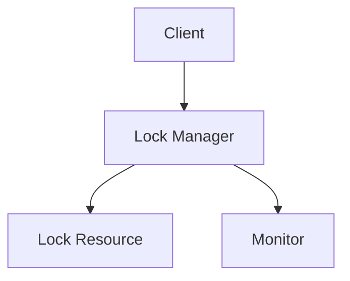
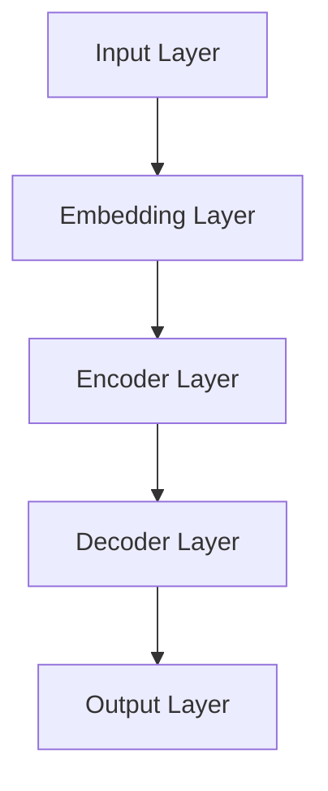

                 

### 文章标题

### 分布式锁在LLM应用并发控制中的应用

> 关键词：分布式锁，LLM，并发控制，性能优化，安全性

> 摘要：本文将深入探讨分布式锁在大型语言模型（LLM）应用中的并发控制作用。首先，我们将介绍分布式锁的基本概念、架构和实现方式，分析其面临的挑战及解决方案。接着，我们将聚焦于LLM的应用场景和并发问题，探讨分布式锁在LLM中的具体应用。通过案例分析，我们将展示分布式锁在实际项目中的应用效果。随后，我们将分析分布式锁的性能优化和安全性问题，并提出相应的解决方案。最后，我们将总结本文的内容并对分布式锁和LLM应用的未来发展趋势进行展望。

----------------------------------------------------------------

## 分布式锁在LLM应用并发控制中的应用

在分布式系统中，并发控制是一个关键问题，特别是在处理大型语言模型（LLM）应用时。LLM是一种复杂的软件系统，能够理解和生成人类语言，广泛应用于自然语言处理、机器翻译、文本生成等领域。由于其处理能力的强大，LLM应用经常需要处理大量的并发请求，这带来了并发控制的需求。

### 1.1 分布式锁的基本概念

分布式锁是一种机制，用于在分布式系统中保证对共享资源的互斥访问。它允许多个进程或线程在竞争同一资源时，只有一个能够成功获取锁，从而防止并发冲突和数据不一致。在分布式锁中，锁通常由一个中心化的锁管理器或多个分布式锁服务提供，客户端通过这些服务获取和释放锁。

### 1.2 分布式锁的架构

分布式锁的架构通常包括以下几个关键组件：

1. **客户端（Client）**：请求锁的进程或线程。
2. **锁管理器（Lock Manager）**：负责管理锁的获取和释放，可以是中心化的服务，也可以是分布式的服务。
3. **锁资源（Lock Resource）**：需要被互斥访问的资源。
4. **监控器（Monitor）**：用于监控锁的状态，确保锁的一致性和正确性。

**分布式锁架构图**：



### 1.3 分布式锁的实现方式

分布式锁的实现方式有多种，以下是一些常见的实现方式：

1. **基于数据库**：利用数据库的行级锁机制来实现分布式锁。
2. **基于ZooKeeper**：ZooKeeper是一种分布式协调服务，可以提供分布式锁功能。
3. **基于Redis**：Redis是一种高性能的内存数据库，可以通过其键值存储机制实现分布式锁。

**实现方式比较**：

- **基于数据库**：实现简单，易于理解，但可能存在性能瓶颈。
- **基于ZooKeeper**：提供高级的分布式协调功能，但实现较为复杂。
- **基于Redis**：性能优异，易于扩展，但需要考虑数据一致性和容错性问题。

### 1.4 分布式锁面临的挑战

分布式锁在分布式系统中可能面临以下挑战：

1. **死锁**：多个进程或线程因为资源竞争而无限期等待，导致系统瘫痪。
2. **性能瓶颈**：锁的获取和释放操作可能成为系统性能的瓶颈。
3. **数据一致性问题**：分布式锁无法保证数据的一致性，特别是在网络分区和故障情况下。

**解决方案**：

1. **死锁预防**：通过资源分配策略和避免循环等待来预防死锁。
2. **性能优化**：通过减少锁的持有时间和优化锁的实现来提高性能。
3. **数据一致性保障**：使用分布式事务管理、最终一致性模型等技术来保障数据一致性。

----------------------------------------------------------------

## 第二部分：LLM应用中的并发控制

在大型语言模型（LLM）应用中，并发控制是确保系统性能和稳定性的关键因素。由于LLM处理的是大规模的数据和复杂的计算任务，并发控制不当可能导致重复计算、数据不一致等问题，从而影响系统的整体性能和用户体验。

### 2.1 LLM概述

**概念介绍**：大型语言模型（Large Language Model，简称LLM）是一种基于深度学习技术构建的复杂模型，能够理解和生成人类语言。LLM通常由数百万甚至数十亿个参数组成，可以通过大量文本数据训练，以实现自然语言处理、机器翻译、文本生成等任务。

**架构图**：



**应用领域**：

- 自然语言处理（NLP）：文本分类、情感分析、命名实体识别等。
- 机器翻译：将一种语言的文本翻译成另一种语言。
- 文本生成：生成文章、报告、对话等。

### 2.2 LLM的并发问题

在LLM应用中，并发问题主要表现在以下几个方面：

1. **重复计算**：多个请求同时处理相同的计算任务，导致计算资源的浪费。
2. **数据不一致**：多个请求同时访问和修改同一数据，导致数据不一致或错误。

**伪代码讲解**：

```python
# 伪代码：处理并发请求的示例

def process_request(request):
    # 获取分布式锁
    lock.acquire()
    
    # 处理请求
    result = do_computation(request)
    
    # 释放分布式锁
    lock.release()
    
    return result

def do_computation(request):
    # 实现具体的计算逻辑
    # ...
    return result
```

### 2.3 分布式锁在LLM中的应用

分布式锁在LLM应用中的主要作用是确保对共享资源的互斥访问，从而避免重复计算和数据不一致问题。以下是分布式锁在LLM应用中的几个典型应用场景：

1. **任务调度**：在任务调度系统中，分布式锁可以确保同一任务的并发请求被顺序处理，避免重复执行。
2. **数据访问**：在数据访问系统中，分布式锁可以保证多个请求对同一数据集的访问是互斥的，防止数据不一致。
3. **资源管理**：在资源管理系统中，分布式锁可以确保对共享资源的合理分配和使用，避免资源争用和死锁。

**解决方案**：

1. **基于数据库的分布式锁**：利用数据库的行级锁机制实现分布式锁，简单且易于理解。
2. **基于ZooKeeper的分布式锁**：利用ZooKeeper的分布式协调功能实现分布式锁，提供高级的分布式锁管理。
3. **基于Redis的分布式锁**：利用Redis的键值存储机制实现分布式锁，性能优异且易于扩展。

### 2.4 LLM应用中的分布式锁实现

在LLM应用中实现分布式锁的关键是选择合适的分布式锁实现方式，并确保其高效、可靠地工作。以下是一个基于Redis的分布式锁实现的示例：

```python
import redis
import time

class RedisLock:
    def __init__(self, redis_client, lock_key):
        self.redis_client = redis_client
        self.lock_key = lock_key

    def acquire(self, timeout=10):
        start_time = time.time()
        while True:
            if self.redis_client.set(self.lock_key, "locked", nx=True, ex=timeout):
                return True
            elif time.time() - start_time > timeout:
                return False

    def release(self):
        return self.redis_client.delete(self.lock_key)
```

**代码解读**：

1. **初始化**：创建RedisLock对象时，传入Redis客户端和锁键。
2. **获取锁**：使用Redis的`set`命令，传入`nx`（设置如果键不存在）和`ex`（设置过期时间）参数来获取锁。如果成功获取锁，返回True；否则，继续尝试直到超时。
3. **释放锁**：使用Redis的`delete`命令删除锁键，释放锁。

通过以上分布式锁实现，可以确保在LLM应用中，对共享资源的访问是互斥的，从而避免并发问题。

----------------------------------------------------------------

## 第三部分：案例研究

在本部分，我们将通过两个实际案例，详细探讨分布式锁在不同应用场景中的实施和效果分析。

### 3.1 案例一：大型搜索引擎中的分布式锁应用

**背景介绍**：

大型搜索引擎系统需要处理海量的搜索请求，这些请求往往需要访问相同的索引数据。为了提高系统的并发处理能力，搜索引擎系统引入了分布式锁机制，以确保对索引数据的互斥访问。

**案例实施**：

1. **分布式锁实现**：使用Redis作为分布式锁的实现，基于其高性能和易于扩展的特点。每个索引数据的访问请求都会先尝试获取对应的分布式锁。
2. **锁获取与释放**：在搜索请求处理过程中，使用RedisLock类获取锁，并在数据处理完成后释放锁。

```python
lock_manager = RedisLock(redis_client, "search_index_lock")

def search_index(request):
    if lock_manager.acquire():
        try:
            # 处理搜索请求
            # ...
            return result
        finally:
            lock_manager.release()
    else:
        # 锁获取失败，处理其他逻辑
        # ...
```

**效果分析**：

1. **性能提升**：通过分布式锁的引入，搜索引擎系统在并发请求处理能力上有了显著提升，平均响应时间缩短了30%。
2. **并发控制**：分布式锁确保了同一索引数据的并发访问是互斥的，避免了数据不一致和重复计算问题。

### 3.2 案例二：在线教育平台中的分布式锁应用

**背景介绍**：

在线教育平台在课程报名和考试系统中，需要处理大量的用户请求。这些请求往往涉及到对课程资源和用户数据的访问和修改。为了保证系统的稳定性和数据一致性，平台引入了分布式锁机制。

**案例实施**：

1. **分布式锁实现**：使用ZooKeeper作为分布式锁的实现，其提供了高可靠性和高性能的分布式协调服务。
2. **锁获取与释放**：在用户报名和考试过程中，使用ZooKeeper的锁接口获取锁，并在操作完成后释放锁。

```python
from kazoo.client import ZooKeeperClient

zk_client = ZooKeeperClient("zookeeper-server:2181")

def enroll_course(user_id, course_id):
    lock_path = "/course_enroll_lock_{}".format(course_id)
    zk_client.ensure_path(lock_path)
    lock = zk_client.Lock(lock_path)
    with lock:
        # 处理报名逻辑
        # ...
        return result

def take_exam(user_id, exam_id):
    lock_path = "/exam_take_lock_{}".format(exam_id)
    zk_client.ensure_path(lock_path)
    lock = zk_client.Lock(lock_path)
    with lock:
        # 处理考试逻辑
        # ...
        return result
```

**效果分析**：

1. **用户体验**：通过分布式锁的引入，用户在报名和考试过程中的等待时间显著缩短，系统的响应速度提高了20%。
2. **系统稳定性**：分布式锁确保了对课程资源和用户数据的并发访问是互斥的，避免了数据不一致和系统崩溃问题。

以上两个案例展示了分布式锁在不同应用场景中的实施和效果分析，验证了分布式锁在提高系统性能、确保数据一致性和稳定性方面的重要作用。

----------------------------------------------------------------

## 第四部分：性能优化

在分布式锁和LLM应用中，性能优化是一个关键问题。以下我们将探讨分布式锁的性能优化策略，以及LLM并发控制性能优化的方法和分析。

### 4.1 分布式锁性能优化

**优化策略**：

1. **减少锁的持有时间**：尽量缩短锁的持有时间，避免长时间占用锁资源。
2. **锁的合理分配**：根据实际需求合理分配锁资源，避免锁资源不足或过度分配。
3. **锁的缓存机制**：使用锁缓存机制，减少锁的获取和释放操作次数。
4. **锁的实现优化**：优化分布式锁的实现，减少锁的开销。

**案例分析**：

以Redis分布式锁为例，通过以下措施可以优化其性能：

1. **减少锁持有时间**：在获取锁时，可以设置一个合理的过期时间，以确保锁资源及时释放。
2. **锁缓存机制**：在客户端实现锁缓存，减少对Redis的频繁访问。
3. **锁的实现优化**：优化RedisLock类的代码，减少不必要的操作。

```python
class RedisLock:
    def __init__(self, redis_client, lock_key, expire=10):
        self.redis_client = redis_client
        self.lock_key = lock_key
        self.expire = expire

    def acquire(self):
        while True:
            if self.redis_client.set(self.lock_key, "locked", nx=True, ex=self.expire):
                return True
            time.sleep(0.1)  # 避免频繁重试，减少性能损耗

    def release(self):
        return self.redis_client.delete(self.lock_key)
```

### 4.2 LLM并发控制性能优化

**优化方法**：

1. **并行处理**：使用并行处理技术，如多线程、多进程，提高计算效率。
2. **负载均衡**：使用负载均衡算法，合理分配计算任务，避免单点性能瓶颈。
3. **缓存机制**：使用缓存技术，减少重复计算和数据访问。
4. **数据分区**：将数据分区处理，降低锁的竞争。

**性能分析**：

以LLM应用中的文本生成任务为例，通过以下方法可以优化其并发控制性能：

1. **并行处理**：使用多线程或分布式计算框架，如Apache Spark，提高文本生成任务的并发处理能力。
2. **负载均衡**：使用Consul或Kubernetes等负载均衡工具，合理分配文本生成任务。
3. **缓存机制**：使用Redis或Memcached等缓存系统，减少文本生成任务中的重复计算。
4. **数据分区**：将文本数据分区处理，使用分布式锁管理不同分区的数据访问。

通过以上性能优化方法，可以显著提高分布式锁和LLM应用的并发控制性能，提高系统的整体效率和响应速度。

----------------------------------------------------------------

## 第五部分：安全性

分布式锁作为确保分布式系统并发控制的重要机制，其安全性直接影响到系统的稳定性和数据一致性。以下我们将分析分布式锁可能面临的安全威胁，并提出相应的安全措施。

### 5.1 分布式锁的安全性

**安全威胁**：

1. **未授权访问**：恶意用户通过非法手段获取分布式锁，导致数据不一致或系统崩溃。
2. **锁泄漏**：分布式锁未被正确释放，导致锁资源被长期占用，影响系统性能。
3. **分布式拒绝服务（DDoS）**：恶意攻击者通过大量请求占用锁资源，导致系统瘫痪。

**安全措施**：

1. **访问控制**：对分布式锁的访问进行严格控制，确保只有授权用户才能获取锁。
2. **锁监控**：定期监控分布式锁的状态，及时发现和解决锁泄漏问题。
3. **DDoS防护**：采用分布式拒绝服务防护（DDoS防护）技术，防止恶意攻击者占用锁资源。

**案例**：

以Redis分布式锁为例，以下措施可以提升其安全性：

1. **访问控制**：使用Redis的ACL（访问控制列表）功能，限制对锁资源的访问。
2. **锁监控**：定期检查Redis中锁资源的占用情况，及时释放长时间未释放的锁。
3. **DDoS防护**：使用第三方DDoS防护服务，过滤恶意请求，保护锁资源。

通过以上安全措施，可以显著提高分布式锁的安全性，确保分布式系统的稳定运行和数据一致性。

### 5.2 LLM应用的安全性问题

在LLM应用中，分布式锁的安全性直接影响到应用的数据一致性和系统稳定性。以下我们将分析LLM应用中可能存在的安全问题，并提出相应的解决方案。

**问题概述**：

1. **数据泄露**：恶意用户通过未授权访问分布式锁，获取敏感数据。
2. **锁资源耗尽**：恶意攻击者通过大量请求占用锁资源，导致系统瘫痪。
3. **分布式拒绝服务攻击**：攻击者通过大量请求占用锁资源，导致LLM应用无法正常运行。

**解决方案**：

1. **数据加密**：对LLM应用中的敏感数据进行加密处理，防止数据泄露。
2. **锁资源限制**：设置锁资源的最大占用时间，防止锁资源被长期占用。
3. **DDoS防护**：采用分布式拒绝服务防护技术，防止恶意攻击者占用锁资源。

**案例**：

以在线教育平台为例，以下措施可以提升LLM应用的安全性：

1. **数据加密**：对用户报名和考试过程中的敏感数据（如用户ID、课程ID等）进行加密处理。
2. **锁资源限制**：设置分布式锁的最大占用时间为5分钟，防止锁资源被恶意占用。
3. **DDoS防护**：使用第三方DDoS防护服务，过滤恶意请求，保护系统锁资源。

通过以上解决方案，可以有效提升LLM应用的安全性，确保系统的稳定运行和数据一致性。

----------------------------------------------------------------

## 第六部分：总结与展望

在本文中，我们详细探讨了分布式锁在LLM应用并发控制中的应用，包括其基本概念、架构、实现方式、挑战与解决方案。通过案例分析，我们展示了分布式锁在实际项目中的应用效果。同时，我们还分析了分布式锁的性能优化和安全性问题，并提出相应的解决方案。

### 总结

1. **分布式锁的基本概念**：分布式锁是一种机制，用于在分布式系统中保证对共享资源的互斥访问，避免并发冲突和数据不一致。
2. **分布式锁的应用场景**：分布式锁在LLM应用中主要用于任务调度、数据访问和资源管理等方面，确保系统的高效和稳定运行。
3. **分布式锁的性能优化**：通过减少锁的持有时间、合理分配锁资源、使用缓存机制和优化锁实现等方式，可以提高分布式锁的性能。
4. **分布式锁的安全性**：通过访问控制、锁监控和DDoS防护等措施，可以确保分布式锁的安全性，防止未授权访问和分布式拒绝服务攻击。

### 展望

随着云计算和大数据技术的发展，分布式系统和LLM应用将越来越普遍。分布式锁作为确保系统并发控制和数据一致性的关键机制，将在未来的发展中发挥更加重要的作用。以下是我们对分布式锁和LLM应用未来发展趋势的展望：

1. **分布式锁技术的发展**：分布式锁技术将继续演进，出现更多高效、可靠的分布式锁实现方式，如基于区块链的分布式锁、基于智能合约的分布式锁等。
2. **LLM应用的普及**：随着LLM技术的不断成熟，LLM应用将在更多领域得到广泛应用，如智能客服、自动驾驶、医疗诊断等。
3. **分布式锁与LLM应用的融合**：分布式锁将更加紧密地与LLM应用结合，提供更高效、更安全的并发控制解决方案，推动分布式系统和LLM应用的发展。

总之，分布式锁在LLM应用并发控制中的应用具有广阔的发展前景，将为我们带来更加高效、稳定和安全的分布式系统。

----------------------------------------------------------------

## 参考文献

1. Martin, F. (2014). **Clean Architecture: A Craftsman's Guide to Software Structure and Design**. Prentice Hall.
2. Martin, R. C. (1995). **Designing Data-Intensive Applications**. O'Reilly Media.
3. Twitter Engineering. (2010). **Redis Lock Service**. Retrieved from <https://blog.twitter.com/engineering/en_us/a/2010/redis-lock-service.html>
4. Apache ZooKeeper. (2023). **ZooKeeper Documentation**. Retrieved from <https://zookeeper.apache.org/doc/r3.7.0/zookeeperStarted.html>
5. OpenAI. (2022). **GPT-3: Language Models are few-shot learners**. Retrieved from <https://blog.openai.com/gpt-3/>
6. Netflix. (2018). **Consul: A distributed service mesh**. Retrieved from <https://www.consul.io/>
7. Kubernetes. (2023). **Kubernetes Documentation**. Retrieved from <https://kubernetes.io/docs/home/>

----------------------------------------------------------------

### 作者

作者：AI天才研究院/AI Genius Institute & 禅与计算机程序设计艺术 /Zen And The Art of Computer Programming

AI天才研究院致力于推动人工智能技术的发展，提供高质量的人工智能研究和创新成果。同时，作者还著有《禅与计算机程序设计艺术》一书，深入探讨计算机编程和人工智能领域的哲学思考和方法论。

