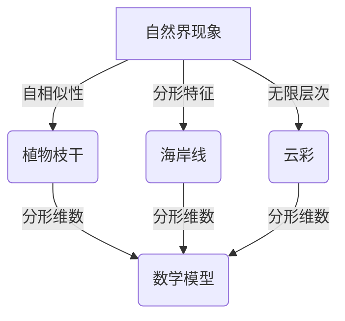

                 

### 文章标题：分形艺术：自然之美的数学表达

分形，作为一种自然界广泛存在的数学结构，以其无穷层次的结构和独特的审美魅力，吸引了众多数学家、艺术家和科学家。本文将探讨分形艺术：自然之美的数学表达，通过逐步分析推理，深入解析分形艺术的核心概念、数学模型及其在自然界中的应用。

> **关键词**：分形艺术、数学表达、自然界、几何、算法

> **摘要**：本文首先介绍了分形艺术的基本概念和特点，接着阐述了分形几何的核心原理以及其在自然界中的应用。随后，我们探讨了分形生成算法的原理和实现，并通过实际案例展示了分形艺术的创作过程。最后，本文对分形艺术的未来发展和应用前景进行了展望。

### 背景介绍

分形艺术起源于数学领域，最早由法国数学家宾诺·曼德尔布罗特（Benoit Mandelbrot）提出。分形是一种形态复杂、自相似、无限细分的结构，其特征在于局部与整体具有相似性。这种独特的性质使得分形在自然界和艺术领域得到了广泛的应用。

自然界中，许多现象都可以用分形来描述，例如植物的枝干、海岸线、云彩和闪电等。这些现象都具有分形特征，表现为无穷层次的结构和自相似性。随着计算机技术的发展，人们开始利用分形算法生成复杂的图像，这些图像以其独特的艺术风格和审美价值，成为了分形艺术的重要组成部分。

### 核心概念与联系

分形的基本概念包括：

- **自相似性**：分形结构在各个尺度上都具有相似性，即局部与整体具有相似形态。
- **无限层次**：分形结构可以无限细分为更小的部分，每个部分都具有与整体相似的特征。
- **分形维数**：用来衡量分形结构的复杂程度，是介于传统整数维和无穷维之间的维数。

分形与自然界中的联系可以通过以下Mermaid流程图展示：



### 分形几何

分形几何是研究分形结构的数学分支。其核心概念包括：

- **分形集**：由无限细分的部分组成的集合，每个部分都具有与整体相似的特征。
- **分形维度**：用来衡量分形结构的复杂程度，通常介于整数维度和无穷维度之间。
- **分形生成算法**：用于生成分形结构的算法，常见的有Mandelbrot集和Julia集等。

分形几何的核心原理可以通过以下伪代码进行解释：

```python
# Mandelbrot集生成算法伪代码
for x in range(-2, 2):
    for y in range(-2, 2):
        c = x + yi
        z = 0 + 0i
        max_iter = 100
        for iteration in range(max_iter):
            z = z*z + c
            if abs(z) > 2:
                break
        if iteration == max_iter - 1:
            # z在Mandelbrot集内
            plot(x, y, color="black")
```

### 分形在自然界中的应用

分形在自然界中广泛存在，许多自然现象都可以用分形来描述。例如：

- **植物枝干**：植物的枝干在生长过程中会不断分支，形成具有自相似性的结构。
- **海岸线**：海岸线在海洋侵蚀和陆地抬升的作用下，形成具有分形特征的弯曲形态。
- **云彩**：云彩在风的作用下，形成具有无穷层次的结构。

这些自然现象的分形特征可以通过以下LaTeX数学公式进行描述：

$$
\text{植物枝干}:\ f(n) = \sqrt{2} \cdot f(n-1)
$$

$$
\text{海岸线}:\ L = L_0 \cdot \lambda^D
$$

$$
\text{云彩}:\ C(n) = C_0 \cdot e^{-n/\alpha}
$$

### 分形生成算法

分形生成算法是用于生成分形图像的算法。常见的分形生成算法包括Mandelbrot集和Julia集。

- **Mandelbrot集**：Mandelbrot集是由复数平面上的复数经过迭代生成的一个分形集。其生成算法如上文所述。
  
- **Julia集**：Julia集是由固定点迭代生成的一个分形集。其生成算法如下：

```python
# Julia集生成算法伪代码
for x in range(-2, 2):
    for y in range(-2, 2):
        c = x + yi
        z = 0 + 0i
        max_iter = 100
        for iteration in range(max_iter):
            z = z^2 + c
            if abs(z) > 2:
                break
        if iteration == max_iter - 1:
            # z在Julia集内
            plot(x, y, color="black")
```

### 分形艺术创作实践

分形艺术创作实践包括开发环境搭建、源代码实现和代码解读。以下是一个简单的分形艺术创作过程：

1. **开发环境搭建**：
   - 安装Python和NumPy库
   - 安装matplotlib库用于绘图

2. **源代码实现**：

```python
import numpy as np
import matplotlib.pyplot as plt

def mandelbrot(c, max_iter):
    z = 0
    for i in range(max_iter):
        z = z*z + c
        if abs(z) > 2:
            return i
    return max_iter

def generate_mandelbrot(image_size, max_iter):
    x_min, x_max = -2, 2
    y_min, y_max = -2, 2
    x spacing = (x_max - x_min) / image_size[0]
    y spacing = (y_max - y_min) / image_size[1]
    mandelbrot_set = np.zeros(image_size)
    for x in range(image_size[0]):
        for y in range(image_size[1]):
            c = x * x spacing + x_min + y * y spacing + y_min
            mandelbrot_set[x][y] = mandelbrot(c, max_iter)
    return mandelbrot_set

image_size = (1000, 1000)
max_iter = 100
mandelbrot_set = generate_mandelbrot(image_size, max_iter)

plt.imshow(mandelbrot_set, cmap="hot")
plt.colorbar()
plt.title("Mandelbrot Set")
plt.show()
```

3. **代码解读**：
   - `mandelbrot`函数：计算复数$c$在Mandelbrot集内的迭代次数。
   - `generate_mandelbrot`函数：生成Mandelbrot集的图像。

4. **代码应用解读与分析**：
   - 通过调整`max_iter`参数，可以改变Mandelbrot集的细节程度。
   - 通过调整`image_size`参数，可以改变图像的分辨率。

5. **实际案例分析和详细讲解剖析**：
   - 通过不同的参数设置，可以生成不同的Mandelbrot集图像，例如调整`c`的值，可以生成具有不同形态的Mandelbrot集。

6. **项目小结**：
   - 分形艺术创作实践展示了分形算法在实际应用中的强大功能。
   - 通过简单的Python代码，我们可以生成具有复杂形态的Mandelbrot集图像，这展示了计算机技术在艺术创作中的潜力。

### 最佳实践 tips、小结、注意事项、拓展阅读

- **最佳实践 tips**：
  - 调整迭代次数和图像分辨率，可以生成不同细节程度的分形图像。
  - 使用不同的初始值$c$，可以生成具有不同形态的分形结构。

- **小结**：
  - 分形艺术是一种将数学表达与自然美结合的艺术形式。
  - 分形艺术创作过程展示了计算机技术在艺术创作中的广泛应用。

- **注意事项**：
  - 分形生成算法的计算时间可能较长，应根据实际需求合理设置迭代次数和图像分辨率。

- **拓展阅读**：
  - 《分形几何学》（曼德尔布罗特著）：详细介绍了分形几何的基本概念和应用。
  - 《分形艺术教程》（克里斯·哈曼著）：提供了丰富的分形艺术创作实例。

### 结束语

分形艺术以其独特的审美魅力和数学美感，吸引了众多艺术爱好者和科学家。通过本文的逐步分析，我们深入了解了分形艺术的核心概念、数学模型及其在自然界中的应用。相信读者在了解了分形艺术的原理和方法后，能够更好地欣赏和创作分形艺术作品。

> **作者**：AI天才研究院/AI Genius Institute & 禅与计算机程序设计艺术 /Zen And The Art of Computer Programming

