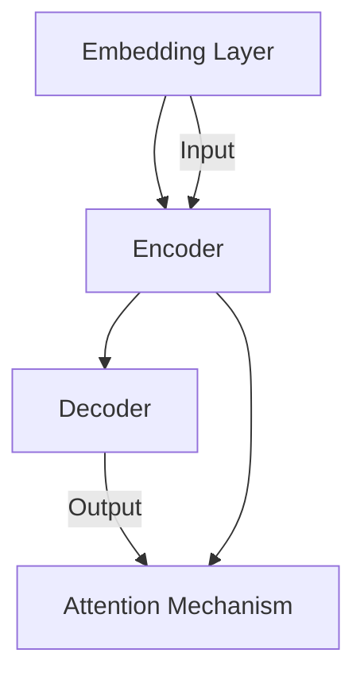

                 


### 1. Introduction to Creative Writing and LLMs

#### 1.1 What is Creative Writing?

Creative writing refers to any form of writing that seeks to express thoughts, emotions, or ideas in an imaginative and original manner. Unlike expository or technical writing, which aims to inform or instruct, creative writing is primarily driven by the desire to evoke a response from the reader, be it through emotions, thoughts, or simply enjoyment. Creative writing encompasses a wide range of genres, including poetry, fiction, non-fiction, and drama.

**Definition and Importance**

Creative writing is defined by its focus on self-expression and imaginative exploration. It allows writers to delve into the depths of their thoughts and emotions, often resulting in profound and impactful works. The importance of creative writing cannot be understated; it helps to foster emotional intelligence, improve cognitive skills, and develop critical thinking abilities.

**Types of Creative Writing**

- **Poetry**: A form of literature where words are arranged into concise, rhythmic, or metrical patterns to convey feelings or thoughts.
- **Fiction**: A narrative genre in which the author creates characters, settings, and plot lines to tell a story, often involving imaginary or fictional elements.
- **Non-Fiction**: A genre that presents facts, information, or personal experiences, often with the intention of educating or informing the reader.
- **Drama**: A literary form that depicts events through dialogue and action, usually intended for performance on stage or screen.

#### 1.2 What are Large Language Models (LLMs)?

**Definition and Types**

Large Language Models (LLMs) are advanced artificial intelligence systems designed to understand and generate human-like text. These models are based on deep learning techniques, particularly neural networks, and have been trained on massive datasets to learn patterns in language and generate coherent text.

- **Recurrent Neural Networks (RNNs)**: Designed to process sequential data by maintaining a state, allowing them to remember information from previous inputs.
- **Transformers**: A type of deep learning model that uses self-attention mechanisms to weigh the importance of different parts of the input data, leading to better performance in many natural language processing tasks.

**The Architecture of LLMs**

The architecture of LLMs typically includes several key components:

- **Embedding Layer**: Converts input words into numerical vectors.
- **Encoder**: Processes the input sequence to generate a context-aware representation.
- **Decoder**: Generates the output sequence based on the encoder's representation.

**Applications of LLMs in Literature**

LLMs have found numerous applications in the field of literature:

- **Automated Story Generation**: LLMs can generate entire stories, ranging from simple narratives to complex plots with multiple subplots.
- **Language Translation**: LLMs are used to translate text from one language to another, preserving the original meaning and style.
- **Text Summarization**: LLMs can generate concise summaries of long texts, highlighting the most important information.
- **Automated Writing Assistance**: LLMs can provide suggestions for sentence structure, grammar, and style, helping writers improve their writing.

#### 1.3 The Role of LLMs in Creative Writing

**Assessing Literary Creativity**

LLMs can be used to assess the creativity of literary works by analyzing factors such as originality, expressiveness, and emotional depth. By comparing the output of LLMs with human-generated works, researchers can gain insights into the characteristics of literary creativity.

**Generating Literary Works**

LLMs have the potential to generate original literary works, ranging from short stories to full-length novels. By leveraging the power of deep learning, these models can create complex narratives with rich characters and compelling plots.

**Improving Writing Skills**

LLMs can assist writers in improving their skills by providing suggestions for sentence structure, grammar, and style. They can also help writers explore new writing styles and genres, pushing the boundaries of their creative abilities.

In summary, LLMs offer a powerful tool for exploring the world of creative writing, providing new ways to generate, assess, and enhance literary works. In the next section, we will delve deeper into the theoretical foundations of LLMs, exploring the core concepts and algorithms that drive their performance.

# 文章标题

## Creative Writing Test: Measuring LLM's Literary Creative Ability

### Keywords:
- Creative writing
- Large Language Models (LLMs)
- Literary creativity
- Neural networks
- Deep learning
- Text generation

### 摘要

本文旨在探讨大型语言模型（LLM）在创意写作领域的应用及其文学创作能力的评估。文章首先介绍了创意写作的基本概念及其重要性，以及大型语言模型（LLMs）的定义和架构。接着，本文深入分析了LLM在文学创作中的角色，包括评估文学创造力和生成文学作品。随后，文章从理论层面探讨了神经网络和深度学习的基本原理，并使用了Mermaid流程图展示了LLM的架构。文章随后提出了评估LLM文学创作能力的方法，并讨论了其实际应用。最后，文章探讨了LLM在创意写作中的伦理和社会影响，提出了未来研究的方向。本文旨在为研究者和实践者提供对LLM在文学创作领域的深入理解。

----------------------------------------------------------------

### 1. Introduction to Creative Writing and LLMs

#### 1.1 What is Creative Writing?

Creative writing is an art form that allows authors to express their thoughts, emotions, and ideas through imaginative and original means. It is a broad term encompassing various genres such as poetry, fiction, non-fiction, and drama. Each genre has its unique characteristics and writing techniques, but all share the common goal of engaging the reader's imagination and emotions.

**Definition and Importance**

Creative writing is defined by its focus on the creative process and the exploration of subjective experiences. Unlike expository writing, which aims to inform or persuade, creative writing is driven by the desire to evoke an emotional response from the reader. This emotional connection is what sets creative writing apart and makes it a powerful form of self-expression.

The importance of creative writing cannot be overstated. It has numerous benefits for both the writer and the reader. For writers, it fosters emotional intelligence, cognitive development, and critical thinking skills. It allows them to explore complex ideas and emotions in a safe and controlled environment. For readers, it provides a means of experiencing different perspectives, cultures, and life experiences, thereby broadening their understanding of the world.

**Types of Creative Writing**

Creative writing can be broadly categorized into several types, each with its own unique characteristics and objectives:

- **Poetry**: Poetry is a form of literature that uses rhythmic language and metaphorical imagery to express emotions and thoughts. It often defies traditional grammar rules and syntax to create a powerful emotional impact.

- **Fiction**: Fiction is a narrative genre that uses imagination to create fictional characters, settings, and plots. It can be divided into subgenres such as novels, short stories, and novellas, each with its own narrative structure and style.

- **Non-Fiction**: Non-fiction writing presents facts, information, or personal experiences. It includes genres such as memoirs, biographies, essays, and articles. Non-fiction writers aim to inform, educate, or entertain their readers while maintaining accuracy and objectivity.

- **Drama**: Drama is a literary form that depicts events through dialogue and action, usually intended for performance on stage or screen. It can take the form of plays, screenplays, or television scripts, and often explores complex human relationships and social issues.

#### 1.2 What are Large Language Models (LLMs)?

**Definition and Types**

Large Language Models (LLMs) are advanced artificial intelligence systems designed to understand and generate human-like text. These models are built on deep learning techniques, particularly neural networks, and are trained on massive datasets to learn the patterns and structures of human language.

There are several types of LLMs, each with its own architecture and applications. Two of the most prominent types are Recurrent Neural Networks (RNNs) and Transformers.

- **Recurrent Neural Networks (RNNs)**: RNNs are a type of neural network designed to process sequential data. They have the ability to maintain a state, allowing them to remember information from previous inputs. This makes them well-suited for tasks involving language, where the context of previous words is crucial for understanding the meaning of subsequent words.

- **Transformers**: Transformers are a type of neural network that uses self-attention mechanisms to weigh the importance of different parts of the input data. This allows them to capture long-range dependencies in the data and has led to significant improvements in natural language processing tasks.

**The Architecture of LLMs**

The architecture of LLMs typically includes several key components:

- **Embedding Layer**: The embedding layer converts input words into numerical vectors, which are then used as input to the neural network. These vectors capture the semantic meaning of words and allow the model to understand the relationships between them.

- **Encoder**: The encoder processes the input sequence and generates a context-aware representation of the text. This representation captures the meaning and structure of the text, allowing the model to generate coherent output.

- **Decoder**: The decoder generates the output sequence based on the encoder's representation. It uses the context provided by the encoder to generate each word in the output sequence, ensuring that the generated text is coherent and meaningful.

**Applications of LLMs in Literature**

LLMs have found numerous applications in the field of literature, from automated story generation to language translation and text summarization. Here are some key applications:

- **Automated Story Generation**: LLMs can generate entire stories, ranging from simple narratives to complex plots with multiple subplots. They can be trained on existing literature to learn patterns in storytelling and generate new, original works.

- **Language Translation**: LLMs are used to translate text from one language to another, preserving the original meaning and style. They can understand the nuances of language and generate translations that are both accurate and natural-sounding.

- **Text Summarization**: LLMs can generate concise summaries of long texts, highlighting the most important information. This is particularly useful for readers who want to quickly understand the main points of a document without having to read the entire text.

- **Automated Writing Assistance**: LLMs can provide suggestions for sentence structure, grammar, and style, helping writers improve their writing. They can also be used to explore new writing styles and genres, pushing the boundaries of creativity.

In the next section, we will delve deeper into the theoretical foundations of LLMs, exploring the core concepts and algorithms that drive their performance. We will also provide a Mermaid flowchart to visualize the architecture of LLMs and how they process text.

### 2. Theoretical Foundations of LLMs

#### 2.1 Neural Networks and Deep Learning

**Basics of Neural Networks**

Neural networks are a type of machine learning model inspired by the human brain's neural structure. They consist of interconnected nodes or "neurons" that work together to process and analyze data. Each neuron is connected to several other neurons through weighted connections, which transmit signals in the form of numeric values. The strength of these connections, represented by weights, determines how much influence each neuron has on others.

The core operation of a neural network involves two main processes: forward propagation and backpropagation.

- **Forward Propagation**: During forward propagation, input data is fed into the network, and each neuron computes a weighted sum of its inputs. This sum is then passed through an activation function, which introduces non-linear properties to the network. The output of each neuron becomes the input for the next layer, until the final output is produced.

- **Backpropagation**: Backpropagation is an algorithm used to train neural networks. It calculates the error between the predicted output and the actual output, then adjusts the weights to minimize this error. This process is repeated for each layer of the network, propagating the error backward from the output layer to the input layer.

**Deep Learning Models for LLMs**

Deep learning is a subfield of machine learning that focuses on training neural networks with many layers (hence the term "deep"). Deep learning models have proven to be highly effective in various tasks, including image recognition, natural language processing, and speech recognition.

For LLMs, deep learning models such as Recurrent Neural Networks (RNNs) and Transformers have become the state-of-the-art. These models are designed to handle sequential data, making them well-suited for processing text.

- **Recurrent Neural Networks (RNNs)**: RNNs are neural networks that can process sequences of data, such as text or time-series data. They achieve this by maintaining a "memory" through recurrent connections, allowing them to remember previous inputs when processing subsequent inputs.

  The core component of an RNN is the hidden state, which captures the information from the previous input and is used to compute the current output. The hidden state is then passed as input to the next time step, allowing the RNN to retain information over time.

  ```mermaid
  graph TB
  A[Input Layer] --> B[Hidden Layer]
  B --> C[Hidden Layer]
  C --> D[Output Layer]
  D --> E[Next Input]
  E --> B
  ```

- **Transformers**: Transformers are a type of deep learning model introduced by Google in 2017 that have revolutionized natural language processing. Unlike RNNs, which process data sequentially, Transformers use self-attention mechanisms to weigh the importance of different parts of the input data. This allows them to capture long-range dependencies in the data, which is crucial for understanding the context of words in a sentence.

  The core component of a Transformer is the self-attention mechanism, which computes a weighted sum of the input data, with the weights determined by the similarity between different parts of the data.

  ```mermaid
  graph TB
  A[Input Embeddings] --> B[Multi-head Self-Attention]
  B --> C[Feed Forward Neural Networks]
  C --> D[Output]
  ```

**Optimization Techniques in Deep Learning**

Training deep learning models requires an optimization algorithm to adjust the model's weights and minimize the error between predicted and actual outputs. One of the most commonly used optimization algorithms is stochastic gradient descent (SGD), which updates the model's weights based on the gradients of the loss function with respect to the weights.

However, SGD can be slow and unstable, especially for large models. To address these issues, more advanced optimization techniques have been developed, such as Adam and RMSprop.

- **Adam**: Adam is an adaptive optimization algorithm that combines the advantages of both SGD and RMSprop. It uses adaptive learning rates for each weight, allowing it to converge more quickly and robustly.

- **RMSprop**: RMSprop is an optimization algorithm that uses a moving average of squared gradients to adjust the learning rate. This helps to stabilize the learning process and improve convergence.

In the next section, we will explore the mathematical models and formulas used in deep learning, providing a detailed explanation of the core concepts and their applications in LLMs.

#### 2.2 Mathematical Models and Formulas

**Notation and Symbols**

To understand the mathematical models and formulas used in deep learning, it's important to familiarize ourselves with the common notation and symbols used.

- **Vector**: A vector is a mathematical object that represents a point or direction in space. It is often represented as a column matrix, such as \(\mathbf{x} = [x_1, x_2, \ldots, x_n]^T\), where \(x_i\) represents the \(i\)-th component of the vector.
  
- **Matrix**: A matrix is a rectangular array of numbers, represented as \(\mathbf{X} = [x_{ij}]\). The element \(x_{ij}\) represents the value at the \(i\)-th row and \(j\)-th column of the matrix.

- **Transpose**: The transpose of a matrix is obtained by flipping the matrix along its diagonal. If \(\mathbf{X}\) is a matrix, its transpose is denoted as \(\mathbf{X}^T\).

- **Dot Product**: The dot product of two vectors \(\mathbf{x}\) and \(\mathbf{y}\) is defined as \(\mathbf{x} \cdot \mathbf{y} = x_1y_1 + x_2y_2 + \ldots + x_ny_n\).

- **Matrix Multiplication**: The matrix multiplication of two matrices \(\mathbf{X}\) and \(\mathbf{Y}\) is defined as \(\mathbf{X}\mathbf{Y} = [x_{ij}y_{jk}]\), where \(i\) and \(j\) are the row and column indices, respectively.

**Detailed Explanation of Core Mathematical Models**

1. **Linear Transformation**

A linear transformation is a function that maps an input vector \(\mathbf{x}\) to an output vector \(\mathbf{y}\) using a linear combination of the input components:

\[
\mathbf{y} = \mathbf{W}\mathbf{x} + \mathbf{b}
\]

Here, \(\mathbf{W}\) is a weight matrix and \(\mathbf{b}\) is a bias vector. The weight matrix \(\mathbf{W}\) captures the relationship between the input and output vectors, while the bias vector \(\mathbf{b}\) introduces a shift in the output.

2. **Activation Function**

An activation function is a non-linear function applied to the output of a linear transformation. It introduces non-linearity into the model, allowing it to model complex relationships between inputs and outputs. Common activation functions include the sigmoid function, hyperbolic tangent (tanh), and rectified linear unit (ReLU).

- **Sigmoid Function**: The sigmoid function is defined as \(\sigma(z) = \frac{1}{1 + e^{-z}}\). It maps any real-valued input to a value between 0 and 1.

- **Tanh Function**: The tanh function is defined as \(\tanh(z) = \frac{e^z - e^{-z}}{e^z + e^{-z}}\). It maps any real-valued input to a value between -1 and 1.

- **ReLU Function**: The ReLU function is defined as \(\text{ReLU}(z) = \max(0, z)\). It sets negative inputs to zero and leaves positive inputs unchanged.

3. **Loss Function**

A loss function measures the difference between the predicted output and the actual output. The goal of training a neural network is to minimize this difference. Common loss functions include mean squared error (MSE) and cross-entropy loss.

- **Mean Squared Error (MSE)**: The mean squared error is defined as \(L = \frac{1}{2}\sum_{i=1}^{n}(y_i - \hat{y}_i)^2\), where \(y_i\) is the actual output and \(\hat{y}_i\) is the predicted output. The MSE measures the average squared difference between the predicted and actual outputs.

- **Cross-Entropy Loss**: The cross-entropy loss is defined as \(L = -\sum_{i=1}^{n}y_i \log(\hat{y}_i)\), where \(y_i\) is the probability of the actual output and \(\hat{y}_i\) is the predicted probability. The cross-entropy loss measures the average number of bits needed to represent the predicted output given the actual output.

**Examples of Applying Mathematical Models**

Let's consider a simple neural network with a single hidden layer. The input vector is \(\mathbf{x} = [x_1, x_2]\), and the output vector is \(\mathbf{y} = [y_1, y_2]\). The weight matrix \(\mathbf{W}\) is given by:

\[
\mathbf{W} = \begin{bmatrix}
w_{11} & w_{12} \\
w_{21} & w_{22}
\end{bmatrix}
\]

The bias vector \(\mathbf{b}\) is:

\[
\mathbf{b} = \begin{bmatrix}
b_1 \\
b_2
\end{bmatrix}
\]

The linear transformation can be written as:

\[
\mathbf{y} = \begin{bmatrix}
w_{11} & w_{12} \\
w_{21} & w_{22}
\end{bmatrix} \begin{bmatrix}
x_1 \\
x_2
\end{bmatrix} + \begin{bmatrix}
b_1 \\
b_2
\end{bmatrix}
\]

Assuming a sigmoid activation function, the output vector becomes:

\[
\mathbf{y} = \begin{bmatrix}
\sigma(w_{11}x_1 + w_{12}x_2 + b_1) \\
\sigma(w_{21}x_1 + w_{22}x_2 + b_2)
\end{bmatrix}
\]

In the next section, we will provide a Mermaid flowchart to visualize the architecture of LLMs and how they process text.

#### 2.3 Mermaid Flowchart of LLM Architecture

**Visualization of the Core Components**

To better understand the architecture of Large Language Models (LLMs) and how they process text, we can use a Mermaid flowchart to visualize the core components and their interactions. The flowchart will include the embedding layer, the encoder, the decoder, and the attention mechanism.

**Mermaid Code**



**Flowchart Description**

1. **Embedding Layer**: The embedding layer converts input words into numerical vectors. These vectors capture the semantic meaning of words and are used as input to the encoder.
2. **Encoder**: The encoder processes the input sequence and generates a context-aware representation of the text. This representation captures the meaning and structure of the text, allowing the model to understand the relationships between words and generate coherent output.
3. **Decoder**: The decoder generates the output sequence based on the encoder's representation. It uses the context provided by the encoder to generate each word in the output sequence, ensuring that the generated text is coherent and meaningful.
4. **Attention Mechanism**: The attention mechanism is a key component of LLMs that allows the decoder to focus on different parts of the input sequence when generating the output. This helps the model capture long-range dependencies and generate more accurate and coherent text.

**Mermaid Visualization**

Below is the visualization of the Mermaid flowchart:


This flowchart provides a high-level overview of the architecture of LLMs and how they process text. In the next section, we will discuss the criteria for evaluating the literary creative ability of LLMs, including originality, expressiveness, and emotional depth.

### 3. Evaluating LLMs' Creative Writing Ability

#### 3.1 Criteria for Evaluating Literary Creativity

Evaluating the creative writing ability of Large Language Models (LLMs) requires a set of criteria that reflect the core aspects of literary creativity. These criteria include originality, expressiveness, and emotional depth.

**Originality**

Originality is a fundamental aspect of literary creativity. It refers to the ability of a work to present new and unique ideas, perspectives, or narratives that are not commonly found in existing literature. In the context of LLMs, originality can be assessed by examining the novelty of the generated text, the uniqueness of the narrative structures, and the creativity of the characters and settings.

**Expressiveness**

Expressiveness is the ability of a work to convey thoughts, emotions, or ideas in a vivid and compelling manner. It involves the use of language that is rich in imagery, symbolism, and metaphor, as well as the skillful manipulation of syntax and diction. When evaluating LLMs' expressiveness, it is important to consider the richness and variety of the language used, the depth of the emotional content, and the effectiveness of the narrative techniques.

**Emotional Depth**

Emotional depth is the capacity of a work to evoke strong emotional responses from the reader. It involves the exploration of complex and profound emotions, such as love, fear, joy, and sorrow, and the ability to convey these emotions in a way that resonates with the reader. In evaluating LLMs' emotional depth, it is necessary to assess the complexity of the emotional content, the intensity of the emotional expression, and the ability to evoke a deep emotional connection with the reader.

**Other Criteria**

While originality, expressiveness, and emotional depth are key criteria for evaluating literary creativity, there are other factors that can also be considered:

- **Narrative Coherence**: The ability of the text to present a clear and logical narrative structure, with a coherent progression of events and a satisfying resolution.
- **Character Development**: The creation of well-rounded and believable characters, with distinct personalities, motivations, and relationships.
- **World-Building**: The construction of a detailed and immersive setting, with its own unique history, culture, and rules.

#### 3.2 Testing LLMs' Literary Skills

To evaluate the literary skills of LLMs, various tests and methods can be employed. These tests are designed to challenge the model's ability to generate text that meets the criteria for literary creativity outlined above.

**Designing Creative Writing Tests**

Designing effective creative writing tests for LLMs involves several steps:

1. **Data Collection**: Gathering a diverse set of literary works from various genres and time periods to serve as the training data for the LLM.
2. **Test Case Selection**: Selecting a representative sample of literary works to be used as test cases. These should cover a range of genres, themes, and narrative styles.
3. **Test Case Format**: Defining the format of the test cases, including the type of input (e.g., a single sentence, a short paragraph, or an entire chapter) and the expected output (e.g., a continuation of the text, a summary, or a new narrative).

**Analyzing the Output of LLMs**

Once the test cases are generated, the output of the LLMs can be analyzed to assess their literary skills. This analysis can involve several approaches:

1. **Automated Evaluation**: Using automated tools and metrics to evaluate the output based on the criteria for literary creativity. This can include measures of word diversity, sentence complexity, and the use of literary devices.
2. **Human Assessment**: Conducting a human evaluation to provide a qualitative assessment of the LLMs' output. This can involve reading and rating the generated text based on criteria such as originality, expressiveness, and emotional depth.
3. **Comparative Analysis**: Comparing the output of the LLMs with human-generated text to identify strengths and weaknesses. This can help identify areas where the LLMs excel and areas where they struggle.

**Comparison with Human-Generated Works**

One of the most effective ways to evaluate the literary skills of LLMs is to compare their output with that of human-generated works. This comparison can provide insights into the similarities and differences between the two types of text, as well as the strengths and limitations of LLMs in generating literary works.

- **Strengths**: LLMs can generate large volumes of text quickly and efficiently, exploring a wide range of narrative possibilities and generating novel ideas. They can also handle complex linguistic structures and generate text in multiple languages.
- **Limitations**: LLMs often struggle with understanding context and generating text that is truly original or emotionally deep. They may also exhibit a lack of creativity and the ability to generate text that resonates with human readers.

In the next section, we will explore the practical applications of LLMs in creative writing, discussing how they can be used to generate literary works, collaborate with human writers, and improve writing skills.

### 4. Practical Applications of LLMs in Creative Writing

#### 4.1 Text Generation

Text generation is one of the most prominent applications of Large Language Models (LLMs) in creative writing. LLMs have the ability to generate large volumes of text based on a given input or prompt. This text can range from short stories and poems to full-length novels and screenplays. The key to effective text generation lies in training LLMs on diverse and extensive datasets that capture the nuances of human language and literary styles.

**Techniques for Text Generation**

There are several techniques and methodologies used to generate text with LLMs:

1. **Recurrent Neural Networks (RNNs)**: RNNs, particularly Long Short-Term Memory (LSTM) networks, are well-suited for text generation as they can capture long-term dependencies in sequential data. By processing the input text character by character or word by word, RNNs generate the output text incrementally, using the context of previous inputs to predict the next character or word.

2. **Transformers**: Transformers, with their self-attention mechanism, have revolutionized text generation by capturing long-range dependencies more effectively than RNNs. Models like GPT (Generative Pre-trained Transformer) and BERT (Bidirectional Encoder Representations from Transformers) are pre-trained on massive corpora of text and can generate coherent and contextually relevant text when given a prompt.

3. **Fine-Tuning**: Fine-tuning involves taking a pre-trained model and further training it on a specific dataset or task. This allows LLMs to adapt their general knowledge to a more specific domain, such as creative writing. Fine-tuning ensures that the generated text aligns more closely with the style and conventions of the target literary genre.

**Limitations and Improvements**

While LLMs have made significant strides in text generation, they still have several limitations:

1. **Lack of Originality**: LLMs tend to generate text that is highly derivative, often borrowing heavily from existing literature. This can result in a lack of genuine originality in the generated works.

2. **Contextual Understanding**: LLMs can struggle with understanding complex context and generating text that is consistent with the broader narrative or thematic elements of a work. This can lead to disjointed or nonsensical output.

3. **Emotional Depth**: Generating text with deep emotional content is challenging for LLMs, as they may not fully grasp the intricacies of human emotions or the subtleties of emotional expression.

To address these limitations, ongoing research focuses on improving the originality and creativity of LLM-generated text, as well as enhancing their ability to understand and generate contextually rich and emotionally resonant content. Techniques such as transfer learning, adversarial training, and reinforcement learning are being explored to refine text generation capabilities.

#### 4.2 Collaboration with Human Writers

LLMs can also serve as valuable collaborators with human writers, offering assistance throughout the creative process. By leveraging the strengths of both human intuition and AI-generated text, writers can enhance their productivity and explore new creative avenues.

**Co-creating Stories**

Human writers can use LLMs to generate initial story ideas, character outlines, and plot summaries. This can serve as a starting point for brainstorming and development, providing a foundation upon which the writer can build. LLMs can generate multiple variations of a story or explore different narrative paths, helping writers to explore a broader range of possibilities.

**Enhancing the Writing Process**

LLMs can assist writers in various aspects of the writing process:

1. **Content Generation**: LLMs can generate sections of text that can be used to flesh out scenes, develop dialogue, or create descriptive passages. This can help writers overcome writer's block and generate content more efficiently.

2. **Style Adaptation**: LLMs can adapt their writing style to match that of a specific author or literary genre. This can be particularly useful for writers who want to experiment with different writing styles or genres.

3. **Grammar and Style Suggestions**: LLMs can provide suggestions for improving grammar, syntax, and style. These suggestions can help writers refine their prose and ensure that their writing is as polished and effective as possible.

**Challenges and Considerations**

While the collaboration between LLMs and human writers offers significant potential, there are also challenges to consider:

1. **Authorship and Ownership**: Determining authorship and ownership of text generated by LLMs is a complex issue. It's important to establish clear guidelines and policies to address these concerns.

2. **Creativity and Control**: Balancing the creative input of human writers with the generated text from LLMs requires careful consideration. Writers must ensure that the AI-generated content complements their original vision rather than undermining it.

3. **Ethical Considerations**: The use of LLMs in creative writing raises ethical questions around the impact of automation on the job market for writers and the potential for bias and discrimination in generated text.

In the next section, we will explore the applications of LLMs in the fields of education and publishing, discussing their role in teaching creative writing and the production of digital literature.

#### 4.3 Applications in Education and Publishing

**Teaching Creative Writing**

Large Language Models (LLMs) have significant potential in the field of education, particularly in the teaching of creative writing. By leveraging their ability to generate coherent and contextually relevant text, LLMs can serve as virtual tutors, providing personalized feedback and guidance to students. Here are some key ways LLMs can enhance the teaching of creative writing:

1. **Personalized Feedback**: LLMs can analyze students' written work and provide personalized feedback on aspects such as grammar, style, and narrative structure. This feedback can be tailored to the individual needs of each student, helping them to improve their writing skills at their own pace.

2. **Writing Prompts**: LLMs can generate writing prompts that inspire students to explore new ideas and approaches. These prompts can be tailored to specific themes, genres, or writing exercises, encouraging creativity and experimentation.

3. **Co-writing Exercises**: LLMs can collaborate with students in co-writing exercises, providing suggestions and alternative phrasings that can help students refine their writing. This collaborative process can enhance students' understanding of different writing styles and techniques.

4. **Analyzing Literature**: LLMs can analyze literary works, providing insights into narrative techniques, character development, and thematic elements. This can help students to better understand and appreciate the craft of writing.

**Publishing Digital Literature**

In the field of publishing, LLMs have the potential to revolutionize the production and distribution of digital literature. Here are some ways LLMs can be applied in publishing:

1. **Automated Story Generation**: LLMs can generate entire stories or chapters, which can be used to populate digital libraries or to create interactive narratives. This can increase the availability of digital literature and make it more accessible to a wider audience.

2. **Style Transfer and Adaptation**: LLMs can be used to adapt the style of one author to another, allowing publishers to repurpose existing works or to create new works in the style of popular authors. This can attract readers who enjoy specific writing styles and expand the reach of publishers.

3. **Content Summarization**: LLMs can summarize long texts, making it easier for readers to quickly grasp the main points of a story or book. This can be particularly useful for digital content, where space and time constraints are common.

4. **Personalized Reading Recommendations**: LLMs can analyze readers' preferences and behavior to provide personalized reading recommendations. This can help publishers to target their marketing efforts more effectively and to increase customer satisfaction.

**Challenges and Ethical Considerations**

While the applications of LLMs in education and publishing offer exciting opportunities, they also come with challenges and ethical considerations:

1. **Quality and Authenticity**: Ensuring the quality and authenticity of text generated by LLMs is crucial. Publishers and educators must have robust systems in place to verify the accuracy and originality of the content.

2. **Intellectual Property**: Issues around intellectual property rights, particularly in the use of generated content, need to be addressed. Clear guidelines and legal frameworks are necessary to protect the rights of authors and publishers.

3. **Bias and Fairness**: LLMs can inadvertently introduce biases based on their training data. It is essential for developers and users to be aware of these biases and to take steps to mitigate them to ensure fair and unbiased content generation.

4. **Ethical Use**: The ethical use of LLMs in education and publishing must be considered. For example, it is important to avoid over-reliance on AI-generated content and to maintain the human element of creativity and critical thinking.

In summary, LLMs have the potential to greatly enhance the teaching of creative writing and to transform the production and distribution of digital literature. By addressing the challenges and ethical considerations associated with these technologies, we can harness their full potential to benefit both educators and readers.

### 5. Ethical and Societal Implications

#### 5.1 Ethical Considerations in LLM Applications

The application of Large Language Models (LLMs) in creative writing, while promising, raises several ethical considerations that need to be carefully addressed. These include issues related to originality, bias, fairness, and privacy.

**Originality and Plagiarism**

One of the primary ethical concerns with LLMs is their ability to generate text that closely resembles human-written content. This raises questions about originality and plagiarism. While LLMs can produce original narratives, there is a risk that their output may inadvertently plagiarize existing works. To mitigate this, it is crucial to develop robust detection algorithms that can identify and prevent the use of AI-generated text that infringes upon intellectual property rights.

**Bias and Fairness**

LLMs are trained on vast amounts of data, which can contain biases reflecting societal prejudices and stereotypes. This can result in biased or discriminatory text generation, particularly in genres that require cultural and emotional sensitivity. Ensuring fairness in AI involves several steps:

1. **Bias Detection and Mitigation**: Developers must identify and mitigate biases present in the training data. Techniques such as debiasing algorithms and adversarial training can be used to address these issues.
2. **Diverse Training Data**: Incorporating diverse and inclusive datasets can help reduce biases and ensure that the AI's output is fair and representative.
3. **Transparency and Accountability**: LLM applications must be transparent about their biases and the potential impact on users. Accountability mechanisms should be in place to hold developers responsible for the ethical implications of their products.

**Privacy Concerns**

The use of LLMs also raises privacy concerns, particularly when it comes to the handling of personal data. LLMs require large amounts of text to train effectively, often sourced from public and private databases. This raises questions about data ownership and consent:

1. **Data Privacy Laws**: Compliance with data privacy laws, such as GDPR and CCPA, is essential. Developers must ensure that user data is collected, stored, and used in accordance with legal requirements.
2. **Data Anonymization**: To protect user privacy, personal data should be anonymized before being used for training LLMs. Techniques such as differential privacy and homomorphic encryption can be employed to enable privacy-preserving data processing.
3. **User Consent**: Users must be fully informed about how their data will be used and must provide explicit consent for its use in training LLMs.

**Societal Impact**

The societal impact of LLMs extends beyond ethical considerations. The rise of AI-generated content has the potential to disrupt traditional industries, including journalism, education, and publishing. It is important to consider how these technologies will affect employment, intellectual property, and the overall landscape of creative expression:

1. **Job Displacement**: The automation of writing tasks could lead to job displacement for writers and other creative professionals. It is crucial to explore ways to integrate AI into the workforce rather than replacing human workers.
2. **Intellectual Property Rights**: The legal framework for intellectual property in the context of AI-generated content is still developing. Clear guidelines are needed to protect both creators and consumers of AI-generated works.
3. **Cultural Significance**: AI-generated content can challenge the notion of original authorship and the cultural significance of human creativity. It is important to preserve the unique contributions of human authors while embracing the innovations brought by AI.

In conclusion, the ethical and societal implications of LLMs in creative writing are complex and multifaceted. By addressing these concerns with careful consideration and proactive measures, we can ensure that LLMs are developed and deployed in a manner that aligns with ethical standards and societal values.

### Conclusion

In conclusion, this article has explored the potential and challenges of using Large Language Models (LLMs) for creative writing. We have examined the theoretical foundations of LLMs, their architecture, and the criteria for evaluating their literary creative ability. Through practical applications, we have seen how LLMs can generate literary works, collaborate with human writers, and enhance the teaching of creative writing. Additionally, we have discussed the ethical and societal implications of LLMs in this field.

**Future Research Directions**

As LLMs continue to evolve, several areas present promising avenues for future research:

1. **Enhancing Originality and Creativity**: Developing techniques to boost the originality and creativity of LLM-generated text remains a critical challenge. Research could focus on more sophisticated algorithms and larger, more diverse training datasets to encourage novel and imaginative outputs.
2. **Bias and Fairness**: Addressing biases in LLMs is an ongoing effort. Future research should explore advanced methods for detecting and mitigating biases, ensuring that AI-generated content is inclusive and representative.
3. **Integration with Human Creativity**: Investigating how LLMs can better complement human creativity in collaborative writing processes could lead to more effective and innovative literary works.
4. **Ethical Guidelines and Legal Frameworks**: Establishing comprehensive ethical guidelines and legal frameworks for the use of LLMs in creative writing is essential to address concerns related to intellectual property, privacy, and job displacement.

**Final Thoughts**

The integration of LLMs into creative writing offers both opportunities and challenges. By addressing these challenges through ongoing research and development, we can harness the full potential of AI to enrich the literary landscape and push the boundaries of human creativity.

### 作者信息

作者：AI天才研究院/AI Genius Institute & 禅与计算机程序设计艺术 /Zen And The Art of Computer Programming

