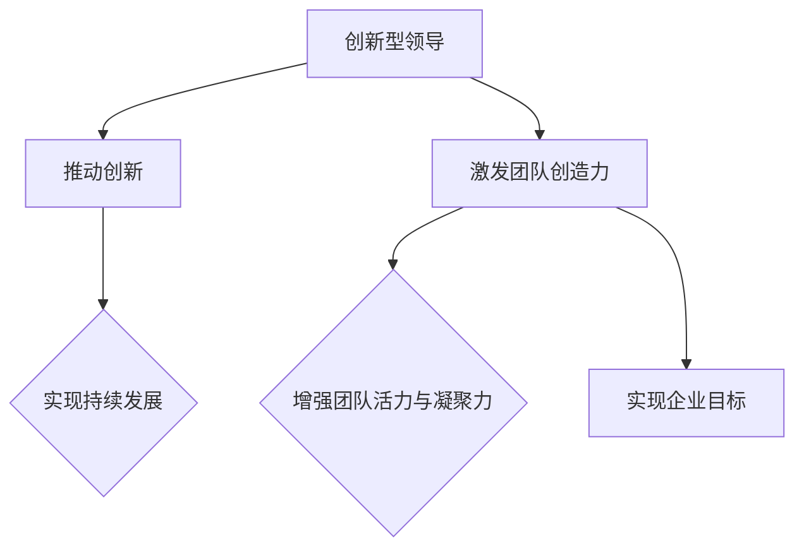
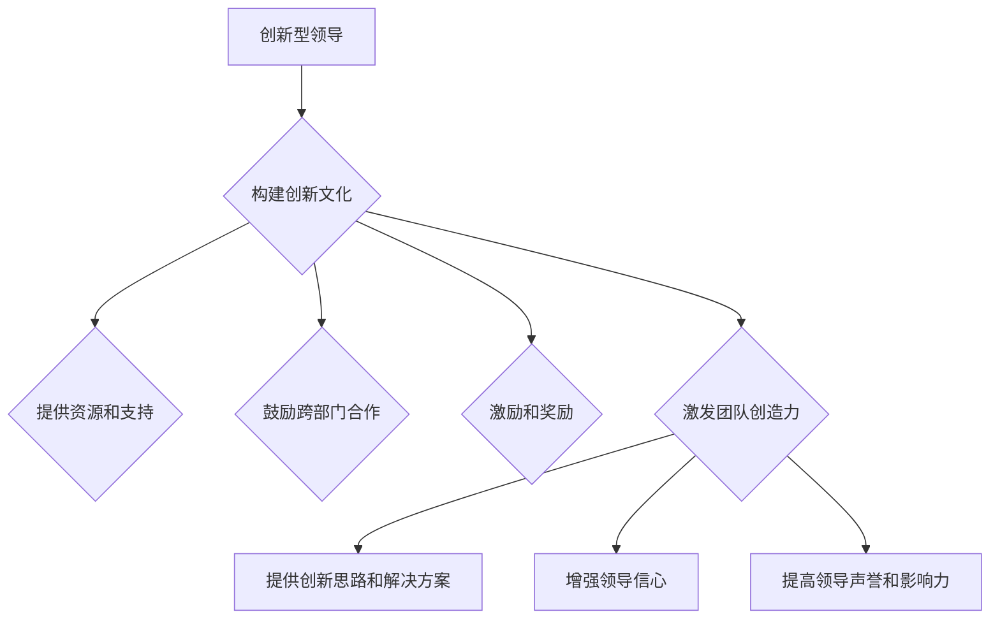

                 

## 引言

在现代企业管理中，创新型领导作为推动企业持续创新和发展的核心力量，日益受到重视。创新不仅是企业生存和发展的关键，更是应对快速变化的市场环境和激烈竞争的有力武器。而团队创造力则是实现这一目标的重要途径。因此，如何成为一名创新型领导，并培养团队的创造力，成为企业管理者和领导者亟待解决的重要问题。

本文旨在探讨创新型领导的本质特征、培养方法，以及如何通过培养团队创造力来实现企业的长期发展。文章将从以下几个方面展开：

首先，我们将定义创新型领导，探讨其与传统领导方式的区别，以及创新型领导在推动团队创造力方面的重要作用。接着，我们会深入分析创新型领导力的关键要素，包括个人特质、管理理念和实践案例，以帮助读者全面理解创新型领导的核心内容。

在第三部分，我们将介绍培养创新型领导力的具体方法，包括培训与教育、实践指导和发展趋势，旨在为企业管理者和领导者提供可操作的实践指南。

第四部分将聚焦于培养团队创造力的工具与方法，详细阐述各种促进创造力的工具和策略，以及评估和监测创造力培养效果的方法。

文章最后，我们将通过一个实际项目案例，展示如何将上述理论和工具应用到实践中，并总结最佳实践和注意事项，为读者提供实用的拓展阅读资源。

通过逐步分析推理，本文希望为读者提供一个全面、系统的创新型领导力和团队创造力培养框架，帮助企业管理者和领导者更好地应对挑战，推动企业持续创新和发展。## 第一部分：引言

### 第1章 创新型领导与团队创造力

在企业的快速发展中，领导者的角色和作用至关重要。创新型领导不仅需要具备传统的管理技能，还需要具备推动创新、激发团队创造力的高度能力。本章旨在介绍创新型领导的概念、重要性以及与团队创造力之间的紧密联系。

#### 1.1 创新型领导的定义与重要性

**创新型领导的定义：**
创新型领导是指那些能够通过创新思维和策略引领团队不断突破传统边界、实现持续创新的领导者。他们不仅仅是管理者，更是创新者和变革推动者。创新型领导的特点包括前瞻性思维、勇于尝试新方法、善于团队协作和激励等。

**创新型领导的重要性：**
在企业的发展过程中，创新型领导扮演着至关重要的角色。他们能够推动企业不断进行技术创新、产品创新和服务创新，从而保持竞争优势。此外，创新型领导还能够激发团队的创造力，使得整个团队更具活力和凝聚力，进而实现企业目标。

**创新型领导与传统领导的区别：**
传统领导更多关注于维持现状、确保运营稳定，而创新型领导则更注重变革、创新和持续发展。传统领导依赖于权威和指令，而创新型领导则通过影响力和领导力来激励团队成员发挥最大潜能。此外，传统领导倾向于规避风险，而创新型领导则勇于接受挑战并从中学习和成长。

#### 1.2 团队创造力的概念与价值

**团队创造力的定义：**
团队创造力是指团队在集体协作过程中，通过创新思维、知识和技能的融合，产生新想法、新解决方案和新价值的能力。团队创造力不仅包括创新性的想法，还涉及到将这些想法转化为实际成果的过程。

**团队创造力的价值：**
团队创造力对于企业的长期发展具有巨大的价值。首先，它能够推动企业不断创新，保持市场竞争优势。其次，团队创造力能够提高团队士气和团队凝聚力，增强员工的归属感和忠诚度。最后，团队创造力有助于培养员工的创新能力和解决问题的能力，提高整个团队的竞争力。

**创造力与组织绩效的关系：**
研究表明，团队创造力与组织绩效之间存在显著的正相关关系。一个具有高创造力的团队能够在短时间内提出更多的创新解决方案，从而提高企业的竞争力和市场份额。此外，创造力还能够促进企业的持续成长和长期发展。

#### 1.3 创新型领导与团队创造力的联系

**创新型领导如何促进团队创造力：**
创新型领导通过以下几种方式促进团队创造力：

1. **构建积极创新文化：** 创新型领导注重营造一个开放、包容和鼓励创新的企业文化，使得团队成员敢于提出新想法和挑战现状。

2. **提供资源和支持：** 创新型领导为团队提供必要的资源和支持，如培训、工具和设备，以帮助团队成员发挥创造力。

3. **鼓励跨部门合作：** 创新型领导鼓励不同部门之间的合作和知识共享，从而激发团队创造力。

4. **激励和奖励：** 创新型领导通过激励和奖励机制，鼓励团队成员积极参与创新活动，并对成功案例进行表彰。

**团队创造力如何影响创新型领导：**
团队创造力对创新型领导的影响也是显著的。首先，团队创造力能够为领导提供创新的思路和解决方案，帮助他们更好地应对挑战。其次，团队创造力能够增强领导的信心，使得他们更加坚定地推动变革和创新。最后，团队创造力还能够提高领导的声誉和影响力，从而增强其在组织中的地位。

通过以上分析，我们可以看出，创新型领导与团队创造力之间存在密切的联系。创新型领导不仅能够促进团队创造力，还能够从团队创造力中受益。因此，企业领导者应高度重视创新型领导力的培养，通过多种途径激发和培养团队的创造力，以实现企业的长期发展目标。### 第1章 创新型领导与团队创造力

#### 1.1 创新型领导的定义与重要性

**创新型领导的定义：**
创新型领导是指那些能够通过创新思维和策略引领团队不断突破传统边界、实现持续创新的领导者。他们不仅仅是管理者，更是创新者和变革推动者。创新型领导的特点包括前瞻性思维、勇于尝试新方法、善于团队协作和激励等。

**创新型领导的重要性：**
在企业的发展过程中，创新型领导扮演着至关重要的角色。他们能够推动企业不断进行技术创新、产品创新和服务创新，从而保持竞争优势。此外，创新型领导还能够激发团队的创造力，使得整个团队更具活力和凝聚力，进而实现企业目标。

**创新型领导与传统领导的区别：**
传统领导更多关注于维持现状、确保运营稳定，而创新型领导则更注重变革、创新和持续发展。传统领导依赖于权威和指令，而创新型领导则通过影响力和领导力来激励团队成员发挥最大潜能。此外，传统领导倾向于规避风险，而创新型领导则勇于接受挑战并从中学习和成长。

为了更清晰地理解创新型领导的定义和重要性，我们可以借助以下 Mermaid 流程图展示创新型领导与团队创造力之间的联系：



该流程图展示了创新型领导通过推动创新、激发团队创造力，最终实现企业目标的过程。创新型领导不仅是创新思维的源泉，更是团队创造力的催化剂。

**核心算法原理讲解：**

```python
# 创新型领导推动创新的伪代码

def innovative_leadership():
    # 前瞻性思维
    think_proactively()
    # 尝试新方法
    try_new_methods()
    # 鼓励团队协作
    encourage_collaboration()
    # 激发团队创造力
    inspire_creativity()

# 团队创造力实现企业目标的伪代码

def team_creativity():
    # 提出新想法
    generate_ideas()
    # 知识共享
    share_knowledge()
    # 跨部门合作
    cross_department_cooperation()
    # 转化创新为成果
    transform_innovation_to_outcomes()
```

**数学模型和公式：**

创新绩效（I）与团队创造力（C）的关系可以用以下公式表示：

\[ I = f(C) \]

其中，\( f() \) 是一个非线性函数，表示团队创造力对创新绩效的促进作用。

**举例说明：**

假设一个企业有100名员工，其中20名员工表现出较高的创造力。如果这些高创造力员工能够充分发挥其才能，那么企业的创新绩效将显著提高。通过具体的数据和案例分析，我们可以更直观地了解创新型领导如何通过激发团队创造力来提升企业的整体竞争力。

在接下来的章节中，我们将深入探讨创新型领导力的关键要素，包括个人特质、管理理念和具体实践方法，以帮助读者更好地理解和应用创新型领导的概念。### 1.2 创新型领导与团队创造力的联系

创新型领导与团队创造力之间存在密切的联系，二者相互促进、共同发展。创新型领导不仅能够激发团队的创造力，团队创造力同样能够反作用于创新型领导，形成一种良性互动机制。

首先，创新型领导通过以下几种方式激发团队的创造力：

1. **构建积极创新文化：**
   创新型领导注重营造一个开放、包容和鼓励创新的企业文化，使得团队成员敢于提出新想法和挑战现状。这种文化氛围能够降低团队成员的创新风险，增加他们的自信心，从而激发创造力。

2. **提供资源和支持：**
   创新型领导为团队提供必要的资源和支持，如培训、工具和设备，以帮助团队成员发挥创造力。这些资源的充足性直接影响团队的创新能力和成果。

3. **鼓励跨部门合作：**
   创新型领导鼓励不同部门之间的合作和知识共享，从而激发团队创造力。跨部门合作能够打破信息壁垒，促进知识的融合和创新。

4. **激励和奖励：**
   创新型领导通过激励和奖励机制，鼓励团队成员积极参与创新活动，并对成功案例进行表彰。这种激励机制能够提高团队成员的创新热情和动力。

其次，团队创造力对创新型领导的影响同样显著：

1. **提供创新思路和解决方案：**
   团队创造力能够为领导提供创新的思路和解决方案，帮助领导更好地应对挑战和决策。这种创新思维能够增强领导者的决策能力和自信心。

2. **增强领导信心：**
   团队创造力能够提高领导者的信心，使他们更加坚定地推动变革和创新。当团队取得创新成果时，领导者的声誉和影响力也会得到提升。

3. **提高领导声誉和影响力：**
   团队创造力能够提高领导的声誉和影响力，使其在组织中的地位更加稳固。一个具有高创造力的团队能够为企业带来显著的竞争优势，从而使领导者获得更多支持和资源。

为了更好地理解创新型领导与团队创造力之间的互动机制，我们可以借助以下 Mermaid 流程图展示这一过程：



该流程图展示了创新型领导通过激发团队创造力，从而促进创新思路的产生、增强领导信心和提高领导影响力的过程。

**核心算法原理讲解：**

```python
# 创新型领导激发团队创造力的伪代码

def inspire_creativity():
    # 构建创新文化
    build_innovation_culture()
    # 提供资源和支持
    provide_resources_support()
    # 鼓励跨部门合作
    encourage_cross_department_cooperation()
    # 激励和奖励
    motivate_and_reward()
    # 激发团队创造力
    stimulate_team_creativity()

# 团队创造力反作用于创新型领导的伪代码

def team_creativity_impact():
    # 提供创新思路和解决方案
    provide_innovation_solutions()
    # 增强领导信心
    enhance_leaders_confidence()
    # 提高领导声誉和影响力
    improve_leaders_reputation_influence()
```

通过以上分析，我们可以看出，创新型领导与团队创造力之间存在着紧密的联系。创新型领导通过激发团队创造力，从而实现创新目标的实现；而团队创造力则通过提供创新思路、增强领导信心和提高领导影响力，进一步推动创新型领导的发展。二者相互促进，共同构建了一个良性互动的生态系统，为企业持续创新和长期发展提供有力保障。### 第二部分：核心概念与理论

#### 第2章 创新型领导力的关键要素

在探讨如何成为一名创新型领导者之前，我们首先需要了解创新型领导力的关键要素。这些要素不仅决定了领导者的个人特质，还直接影响其管理风格、决策模式以及对团队创造力的促进作用。本章将详细分析创新型领导力的关键要素，包括个人特质、管理理念和实践案例，以帮助读者全面理解这一重要概念。

#### 2.1 创新型领导者的个人特质

**1. 前瞻性思维：**
前瞻性思维是创新型领导者的重要特质之一。这类领导者能够预见市场变化和趋势，把握机遇，为企业制定长远的战略规划。他们善于从宏观角度审视问题，不断探索新的发展方向。

**2. 勇于尝试新方法：**
创新型领导者不拘泥于传统方法，勇于尝试新的技术和策略。他们敢于挑战现状，勇于冒险，并且能够在失败中吸取教训，不断改进和创新。

**3. 优秀的沟通能力：**
沟通能力是创新型领导者必须具备的特质。他们能够清晰地表达自己的想法，同时善于倾听团队成员的意见和建议。通过有效的沟通，他们能够建立信任，激发团队成员的积极性和创造力。

**4. 团队协作精神：**
创新型领导者深知团队协作的重要性。他们善于调动团队成员的积极性，建立良好的团队氛围，鼓励团队成员共同参与创新过程。通过团队协作，他们能够实现资源的最大化利用，提高创新效率。

**5. 坚韧不拔的精神：**
在创新过程中，领导者往往会面临各种困难和挑战。具有坚韧不拔精神的领导者能够克服困难，坚持不懈地追求目标。他们能够保持乐观态度，激励团队成员共同面对挑战。

**6. 不断学习和自我提升：**
创新型领导者始终保持学习的态度，不断更新自己的知识和技能。他们关注行业动态，学习最新的管理理论和实践经验，并将这些知识应用到实际工作中。

#### 2.2 创新型领导的管理理念

**1. 以创新为核心：**
创新型领导的管理理念是将创新放在首位。他们认为创新是企业持续发展的动力，是保持竞争优势的关键。因此，他们致力于构建一个以创新为核心的企业文化，鼓励团队成员不断探索和尝试。

**2. 激励和赋能：**
创新型领导者注重激励和赋能团队成员。他们相信每个人都有创新的潜力，通过激励和赋能，他们能够激发团队成员的积极性和创造力。创新型领导者善于发现团队成员的优势，为他们提供成长和发展的机会。

**3. 跨部门合作：**
创新型领导者鼓励跨部门合作，打破部门壁垒，促进知识的共享和交流。他们认为，只有通过跨部门合作，才能实现资源的最大化利用，提高创新效率。创新型领导者善于协调各部门之间的工作，确保创新项目顺利进行。

**4. 风险管理：**
创新型领导者不规避风险，而是积极面对和管理风险。他们知道，创新过程中不可避免地会遇到各种风险，但只有勇于承担风险，才能抓住机遇。创新型领导者善于评估和管理风险，确保创新项目在可控范围内进行。

**5. 不断反思和改进：**
创新型领导者注重不断反思和改进。他们通过定期的反思和总结，发现自身和团队在创新过程中的不足，并及时进行调整和改进。这种反思和改进的精神使得他们能够不断进步，保持创新的活力。

#### 2.3 创新型领导力的实践案例

**案例一：苹果公司（Apple Inc.）**
苹果公司的成功离不开其创始人史蒂夫·乔布斯（Steve Jobs）的创新领导力。乔布斯具有前瞻性思维、勇于尝试新方法、卓越的沟通能力和团队协作精神，这些特质使得他能够带领苹果公司在多个领域实现突破。乔布斯重视创新，始终将创新作为公司发展的核心驱动力。他不仅激励团队成员积极参与创新，还通过跨部门合作和风险管理，确保创新项目的成功实施。

**案例二：谷歌公司（Google LLC）**
谷歌公司的创始人拉里·佩奇（Larry Page）和谢尔盖·布林（Sergey Brin）也是典型的创新型领导者。他们以创新为核心，鼓励团队成员自由探索和尝试。谷歌公司实行“20%时间”政策，允许员工将20%的工作时间用于自己感兴趣的创新项目。这种政策激发了员工的创造力，推动了谷歌在搜索、广告和云计算等领域的创新和发展。

**案例三：特斯拉公司（Tesla, Inc.）**
特斯拉公司的创始人埃隆·马斯克（Elon Musk）以其独特的领导风格和创新精神著称。他不仅具有前瞻性思维和勇于尝试新方法的特质，还通过激励和赋能员工，推动特斯拉在电动汽车、太阳能能源和空间探索等领域的创新。马斯克的管理理念强调跨部门合作和风险管理，使得特斯拉能够在激烈的市场竞争中脱颖而出。

通过以上案例，我们可以看到，创新型领导者的个人特质和管理理念在推动企业创新和发展中起到了至关重要的作用。他们通过激发团队创造力，实现企业的持续创新和长期发展。在接下来的章节中，我们将进一步探讨如何培养和创新型领导力，为读者提供实用的实践指导。### 第2章 创新型领导力的关键要素

#### 2.1 创新型领导者的个人特质

**认知特点：**

创新型领导者拥有卓越的认知特点，这些特点有助于他们在复杂多变的环境中保持敏锐的洞察力和前瞻性思维。以下是一些关键认知特点：

1. **适应性：** 创新型领导者具备快速适应新环境和变化的能力。他们能够迅速识别并应对市场趋势和竞争动态，调整战略以抓住机遇。

2. **系统性思维：** 创新型领导者擅长从全局角度思考问题，分析复杂系统的相互关系。他们能够洞察问题的本质，发现潜在的创新点。

3. **创新思维：** 创新型领导者具备丰富的创新思维，能够从不同角度和层面思考问题，提出新颖的解决方案。

4. **风险意识：** 他们对风险有较高的敏感度，能够在创新过程中有效管理风险，确保创新的可持续性。

**心理素质：**

创新型领导者需要具备良好的心理素质，以应对创新过程中可能遇到的各种挑战和压力。以下是一些关键心理素质：

1. **自信：** 创新型领导者具有坚定的自信心，相信自己的决策和判断。这种自信能够激励团队成员，增强团队的凝聚力。

2. **坚韧：** 创新型领导者具备坚韧不拔的精神，能够在面对困难和挫折时保持积极态度，不断寻找解决问题的方法。

3. **耐心：** 创新型领导者深知创新需要时间，他们具备耐心，能够持之以恒地推动创新项目，直到取得成功。

4. **同理心：** 创新型领导者能够理解团队成员的需求和感受，善于倾听和沟通。这种同理心能够增强团队的协作和凝聚力。

**行为模式：**

创新型领导者的行为模式直接影响团队的创新氛围和创造力。以下是一些关键行为模式：

1. **激励和赋能：** 创新型领导者善于激励和赋能团队成员，鼓励他们发挥潜力，提出创新想法。

2. **沟通和协作：** 创新型领导者重视沟通和协作，通过有效沟通建立信任，促进团队协作。

3. **示范作用：** 创新型领导者以身作则，通过自己的行为示范，激励团队成员勇于创新和承担风险。

4. **反馈和改进：** 创新型领导者注重反馈和改进，通过定期的评估和总结，不断优化创新过程。

#### 2.2 创新型领导的管理理念

**管理风格：**

创新型领导的管理风格通常以创新、灵活和激励为主。以下是一些关键管理风格：

1. **愿景驱动：** 创新型领导者拥有清晰的愿景，能够激发团队成员的使命感，推动团队朝着共同的目标前进。

2. **参与式管理：** 创新型领导者鼓励团队成员参与决策过程，通过民主和协作的方式管理团队，提高团队的凝聚力和创新力。

3. **透明度：** 创新型领导者重视信息透明，通过共享信息和资源，增强团队成员的参与感和信任感。

4. **激励式管理：** 创新型领导者通过激励和奖励机制，激发团队成员的积极性和创造力，鼓励他们追求卓越。

**决策模式：**

创新型领导者的决策模式通常具有以下特点：

1. **快速决策：** 创新型领导者能够在短时间内做出决策，不拘泥于繁琐的程序和流程。

2. **基于数据：** 创新型领导者依赖数据和分析，以事实为基础进行决策，避免主观偏见。

3. **风险评估：** 创新型领导者重视风险评估，在决策过程中充分考虑可能的风险和不确定性。

4. **持续改进：** 创新型领导者注重决策的执行和反馈，通过持续改进，优化决策效果。

**影响力：**

创新型领导者的影响力不仅来自于其职位和权力，更来自于其个人魅力和领导力。以下是一些关键影响力：

1. **榜样作用：** 创新型领导者通过自己的行为和成果，树立榜样，激励团队成员追随。

2. **激励和鼓舞：** 创新型领导者能够激励团队成员，鼓舞他们克服困难，追求卓越。

3. **建立信任：** 创新型领导者通过建立信任，赢得团队成员的支持和尊重。

4. **促进创新：** 创新型领导者通过营造创新氛围，激发团队成员的创造力，推动企业持续创新。

通过深入分析创新型领导者的个人特质、管理理念和行为模式，我们可以更好地理解如何成为一名有效的创新型领导者，以及如何通过激发团队创造力来推动企业的持续创新和发展。在接下来的章节中，我们将进一步探讨如何通过实践指导来培养和创新型领导力。### 第三部分：实践指导

#### 第3章 创新型领导力的培养方法

在了解了创新型领导力的关键要素之后，接下来我们将探讨如何通过实践指导来培养和创新型领导力。本章将重点介绍创新型领导力的培训与教育、具体实践案例以及未来发展的趋势，旨在为企业管理者和领导者提供实用的操作指南。

#### 3.1 创新型领导力的培训与教育

**1. 培训设计：**

创新型领导力的培训应该具有系统性、层次性和针对性。以下是一些关键步骤：

- **需求分析：** 首先进行需求分析，了解不同层次领导者的需求和培训目标。例如，高层领导者需要关注战略规划、市场洞察和风险管理，而中层领导者则需要关注团队管理和执行力。

- **课程内容设计：** 根据需求分析结果，设计课程内容。内容应涵盖创新思维、领导力理论、团队建设、决策能力等。

- **教学方式：** 采用多样化的教学方式，如讲座、案例讨论、模拟演练和团队活动，以提高培训的实效性。

- **考核与反馈：** 通过定期的考核和反馈，评估培训效果，并根据反馈结果进行调整和改进。

**2. 教育体系中的创新型领导力培养：**

在高等教育和职业培训中，应注重创新型领导力的培养。以下是一些建议：

- **课程设置：** 在相关课程中引入创新领导力模块，包括创新理论、实践案例和模拟演练。

- **实习与项目：** 鼓励学生参与实习和项目，亲身体验创新型领导的工作环境和挑战。

- **导师制度：** 建立导师制度，为学生提供指导和支持，帮助他们将理论知识应用到实践中。

**3. 创新型领导力培养的最佳实践：**

以下是一些成功培养创新型领导力的最佳实践：

- **案例学习：** 通过学习国内外成功案例，了解创新型领导力的实践方法和经验。

- **模拟演练：** 通过模拟演练，让领导者亲身体验创新型领导的过程和挑战。

- **跨学科合作：** 鼓励领导者跨学科合作，借鉴不同领域的创新方法和理念。

- **持续学习：** 创新型领导者应具备持续学习的能力，不断更新知识和技能，以适应快速变化的环境。

#### 3.2 创新型领导力的实践案例

**案例一：谷歌公司（Google Inc.）**

谷歌公司以其开放的创新文化和卓越的领导力而著称。以下是一些关键实践：

- **“20%时间”政策：** 允许员工将20%的工作时间用于个人感兴趣的创新项目，激发了员工的创造力和创新精神。

- **导师制度：** 为新员工配备资深导师，帮助他们快速融入团队，并培养创新思维。

- **跨部门合作：** 鼓励跨部门合作，促进知识和资源的共享，提高创新效率。

- **创新奖项：** 设立创新奖项，表彰在创新方面取得显著成绩的员工，激励更多人参与创新活动。

**案例二：特斯拉公司（Tesla, Inc.）**

特斯拉公司的成功离不开其创始人埃隆·马斯克的创新领导力。以下是一些关键实践：

- **愿景驱动：** 马斯克通过清晰的企业愿景，激励员工为实现共同目标而努力。

- **勇于冒险：** 马斯克敢于冒险，推动特斯拉在电动汽车、能源和太空探索等领域的创新。

- **团队协作：** 马斯克强调团队协作，通过高效的合作机制，推动创新项目的实施。

- **持续改进：** 马斯克注重持续改进，通过不断优化产品和服务，保持竞争优势。

#### 3.3 创新型领导力的发展趋势

随着全球化和数字化的发展，创新型领导力也在不断演变。以下是一些未来发展趋势：

- **数字化领导力：** 数字化时代要求领导者具备数字技能和创新能力，以应对快速变化的技术环境。

- **全球化视野：** 全球化要求领导者具备跨文化的沟通和领导能力，能够有效管理多元文化团队。

- **可持续领导力：** 可持续发展成为未来企业的重要议题，领导者需要关注环境、社会和经济效益的平衡。

- **敏捷领导力：** 敏捷领导力强调快速响应变化，灵活调整战略和战术，以保持企业的竞争优势。

通过以上实践指导和案例分析，我们可以看到，培养和创新型领导力需要系统的规划和持续的实践。企业应关注领导者的个人特质、管理理念和实际操作，通过培训和教育、实践案例和持续改进，不断提升创新型领导力，为企业的长期发展奠定坚实基础。### 第三部分：实践指导

#### 第3章 创新型领导力的培养方法

在了解了创新型领导力的关键要素之后，接下来的章节将深入探讨如何在实践中培养和创新型领导力。本章节将分为三个部分：首先介绍创新型领导力的培训与教育方法，其次通过具体实践案例展示这些方法的实际应用，最后分析创新型领导力的发展趋势。

#### 3.1 创新型领导力的培训与教育

**1. 设计培训计划：**

成功的领导力培训需要针对不同层次的领导者设计相应的培训计划。以下是设计培训计划的一些步骤：

- **确定培训目标：** 明确培训的目标和预期成果，例如提高领导者的创新思维、团队管理能力或战略规划能力。

- **分析学员需求：** 了解不同领导者的实际需求和知识背景，确保培训内容能够满足学员的需求。

- **选择培训方式：** 根据培训目标和学员需求，选择合适的培训方式，如讲座、研讨会、案例分析和模拟演练。

- **制定培训大纲：** 制定详细的培训大纲，包括培训主题、课程内容、时间安排和评估方式。

- **持续跟进与反馈：** 培训结束后，通过定期的跟进和反馈，评估培训效果，并根据反馈调整培训计划。

**2. 教育体系中的创新型领导力培养：**

在高等教育和职业培训中，应将创新型领导力的培养纳入课程体系。以下是一些建议：

- **课程设置：** 开设专门的创新领导力课程，涵盖创新思维、领导理论、团队建设和决策能力等内容。

- **案例分析：** 结合实际案例，让学生分析成功和失败的案例，从中学习创新领导力的最佳实践。

- **项目实践：** 通过实际项目，让学生亲身体验创新领导力的应用，锻炼他们的实践能力。

- **导师指导：** 安排经验丰富的导师，为学生提供个性化的指导和支持。

**3. 创新型领导力培养的最佳实践：**

以下是一些在全球范围内被证明有效的创新型领导力培养最佳实践：

- **开放文化：** 建立一个开放、包容和鼓励创新的企业文化，鼓励员工提出新想法和建议。

- **跨部门合作：** 促进不同部门之间的合作和知识共享，打破信息壁垒，提高创新能力。

- **持续学习：** 鼓励领导者和员工持续学习，不断更新知识和技能，以适应快速变化的环境。

- **激励机制：** 设计有效的激励机制，如奖励创新成果和表彰创新行为，激发员工的创新热情。

#### 3.2 创新型领导力的实践案例

**案例一：谷歌公司（Google Inc.）**

谷歌公司以其独特的领导力和创新文化而闻名。以下是一些关键实践：

- **“20%时间”政策：** 允许员工将20%的工作时间用于个人感兴趣的创新项目，这一政策催生了众多成功的创新产品，如Gmail和AdSense。

- **导师制度：** 为新员工和年轻领导者配备资深导师，提供指导和支持，帮助他们快速成长。

- **跨部门合作：** 鼓励员工跨部门合作，促进知识共享和创新。

- **创新奖项：** 设立年度创新奖项，表彰在创新方面取得显著成绩的员工，激励更多人参与创新。

**案例二：特斯拉公司（Tesla, Inc.）**

特斯拉公司以其创新的产品和商业模式而著称。以下是一些关键实践：

- **愿景驱动：** 创始人埃隆·马斯克通过清晰的企业愿景，激励员工为实现共同目标而努力。

- **勇于冒险：** 马斯克敢于冒险，推动特斯拉在电动汽车、能源和太空探索等领域的创新。

- **团队协作：** 强调团队协作，通过高效的合作机制，推动创新项目的实施。

- **持续改进：** 通过不断优化产品和服务，保持竞争优势。

**案例三：3M公司（3M Company）**

3M公司以其创新的传统而闻名。以下是一些关键实践：

- **“15%时间”政策：** 允许员工将15%的工作时间用于个人感兴趣的创新项目，这一政策催生了众多成功的创新产品，如粘胶带和一次性纸杯。

- **内部创业：** 鼓励员工内部创业，推动公司内部的创新。

- **跨部门合作：** 促进不同部门之间的合作，提高创新效率。

- **持续学习：** 提供各种学习机会，帮助员工不断提升自己的知识和技能。

#### 3.3 创新型领导力的发展趋势

随着全球化和数字化的发展，创新型领导力也在不断演变。以下是一些未来发展趋势：

- **数字化领导力：** 随着数字技术的快速发展，领导者需要具备数字技能和创新能力，以应对快速变化的技术环境。

- **全球化视野：** 全球化要求领导者具备跨文化的沟通和领导能力，能够有效管理多元文化团队。

- **可持续领导力：** 可持续发展成为未来企业的重要议题，领导者需要关注环境、社会和经济效益的平衡。

- **敏捷领导力：** 敏捷领导力强调快速响应变化，灵活调整战略和战术，以保持企业的竞争优势。

通过本章节的探讨，我们可以看到，培养和创新型领导力需要系统的规划和持续的实践。企业应关注领导者的个人特质、管理理念和实际操作，通过培训和教育、实践案例和持续改进，不断提升创新型领导力，为企业的长期发展奠定坚实基础。### 第四部分：工具与方法

#### 第4章 培养团队创造力的工具与方法

在当今快速变化的市场环境中，团队的创造力成为企业竞争优势的重要来源。为了有效培养团队的创造力，领导者需要掌握一系列工具与方法。本章将详细介绍各种促进创造力的工具与方法，包括思维导图、基于问题的解决方法和创新性会议技巧，以帮助读者在团队管理中更有效地激发创造力。

#### 4.1 创造力促进工具

**1. 思维导图**

思维导图是一种图形化的思考工具，可以帮助团队梳理和扩展思维，发现新的创意和解决方案。以下是如何使用思维导图促进创造力的一些步骤：

- **步骤一：确定主题**：明确思维导图的主题，例如“如何提高产品创新效率”。

- **步骤二：绘制中心主题**：在思维导图中心绘制主题，并在周围绘制主要分支，每个分支代表一个关键方向或主题。

- **步骤三：扩展思维**：在每个分支上添加子分支，进一步细化每个主题，并记录下相关的想法、问题和解决方案。

- **步骤四：整合信息**：通过连接线将相关的想法和解决方案联系起来，形成一个完整的思维网络。

- **步骤五：分析和优化**：对思维导图进行分析，发现潜在的创意和优化点，为团队提供有价值的指导。

**2. 基于问题的解决方法**

基于问题的解决方法（PBL，Problem-Based Learning）是一种以问题为导向的学习方法，通过解决实际问题来培养团队的创造力和解决问题的能力。以下是如何实施PBL的一些关键步骤：

- **步骤一：确定问题**：选择一个具有挑战性的问题，例如“如何降低产品的生产成本”。

- **步骤二：小组讨论**：将团队分成小组，每个小组讨论并分析问题的各个方面。

- **步骤三：收集信息**：小组通过查阅资料、调研和讨论，收集与问题相关的信息。

- **步骤四：提出解决方案**：小组根据收集到的信息，提出可能的解决方案，并进行讨论和评估。

- **步骤五：实施和评估**：选择最佳的解决方案进行实施，并对其效果进行评估和反馈。

**3. 创新性会议技巧**

创新性会议是培养团队创造力的重要途径。以下是一些关键的创新性会议技巧：

- **步骤一：明确目标**：在会议开始前，明确会议的目标和议程，确保会议内容具有针对性和有效性。

- **步骤二：营造开放氛围**：创造一个开放、包容和鼓励发言的环境，鼓励团队成员畅所欲言，提出各种创意和想法。

- **步骤三：使用头脑风暴**：通过头脑风暴，团队成员可以自由地提出各种创意和解决方案，不必担心批评和评判。

- **步骤四：整合和优化**：将头脑风暴的结果进行整合和优化，筛选出最有价值的创意和解决方案。

- **步骤五：决策和执行**：根据会议结果，制定具体的行动方案，并分配任务和责任，确保创意能够转化为实际的成果。

#### 4.2 团队创造力培养策略

**1. 团队氛围营造**

营造一个积极、开放和鼓励创新的企业文化是培养团队创造力的基础。以下是一些建议：

- **步骤一：建立信任**：通过建立信任，消除团队成员之间的隔阂和竞争，鼓励他们开放地交流和分享想法。

- **步骤二：鼓励失败**：鼓励团队成员勇于尝试，即使失败也不要害怕，因为失败是成功的前提。

- **步骤三：提供反馈**：为团队成员提供及时、具体的反馈，帮助他们了解自己的优势和不足，并指导他们改进。

- **步骤四：尊重多样性**：尊重团队成员的不同观点和经验，通过多样性激发团队的创造力。

**2. 团队激励与反馈机制**

有效的激励和反馈机制能够激发团队成员的积极性和创造力。以下是一些建议：

- **步骤一：设定目标**：为团队成员设定明确的创新目标，并制定相应的奖励措施，激励他们为实现目标而努力。

- **步骤二：定期评估**：定期评估团队的创新成果，对表现优异的团队成员进行表彰和奖励。

- **步骤三：反馈与指导**：为团队成员提供定期的反馈和指导，帮助他们不断提升自己的创新能力和解决问题的能力。

- **步骤四：提供资源**：为团队成员提供必要的资源和支持，如培训、工具和设备，以帮助他们更好地发挥创造力。

通过以上工具和方法的详细介绍，我们可以看到，培养团队创造力需要从多个方面入手，包括工具的使用、策略的制定和企业文化的营造。领导者应结合实际情况，灵活运用这些工具和方法，激发团队的创造力，推动企业持续创新和发展。### 第四部分：工具与方法

#### 第4章 培养团队创造力的工具与方法

在激发团队创造力方面，领导者可以运用多种工具和方法，帮助团队突破思维定势，产生新颖的想法和解决方案。以下是几种有效的工具和策略：

#### 4.1 创造力促进工具

**1. 思维导图**

思维导图是一种以图像为中心的图形化工具，能够帮助团队清晰地表达和拓展思维。以下是使用思维导图促进创造力的步骤：

- **步骤一：确定主题**：选择一个具体的问题或挑战作为思维导图的主题。

- **步骤二：绘制中心主题**：在纸或电子白板上绘制一个中心主题，并在周围绘制主要分支，每个分支代表一个不同的思考方向。

- **步骤三：添加子分支**：在每个分支上添加子分支，进一步细化主题，记录相关想法、问题或解决方案。

- **步骤四：整合信息**：将不同的分支和想法进行连接和整合，形成一个完整的思维网络。

- **步骤五：分析结果**：对思维导图进行分析，识别潜在的创意和关联，提炼出有价值的解决方案。

**2. 基于问题的解决方法**

基于问题的解决方法（PBL）强调通过解决实际问题来培养团队的创新思维和解决问题的能力。以下是实施PBL的步骤：

- **步骤一：明确问题**：选择一个具有挑战性的问题，确保问题能够激发团队的思考和创意。

- **步骤二：团队讨论**：将团队分成小组，每个小组讨论问题的各个方面，并提出可能的解决方案。

- **步骤三：收集信息**：团队通过查阅资料、调研和讨论，收集与问题相关的信息。

- **步骤四：提出解决方案**：每个小组根据收集到的信息，提出可能的解决方案，并进行讨论和评估。

- **步骤五：实施和评估**：选择最佳的解决方案进行实施，并对结果进行评估和反馈，以不断改进。

**3. 创新性会议技巧**

创新性会议是激发团队创造力的重要途径。以下是一些关键的创新性会议技巧：

- **步骤一：明确目标**：在会议开始前，明确会议的目标和议程，确保会议内容具有针对性和有效性。

- **步骤二：营造开放氛围**：创造一个开放、包容和鼓励发言的环境，鼓励团队成员畅所欲言，提出各种创意和想法。

- **步骤三：使用头脑风暴**：通过头脑风暴，团队成员可以自由地提出各种创意和解决方案，不必担心批评和评判。

- **步骤四：整合和优化**：将头脑风暴的结果进行整合和优化，筛选出最有价值的创意和解决方案。

- **步骤五：决策和执行**：根据会议结果，制定具体的行动方案，并分配任务和责任，确保创意能够转化为实际的成果。

#### 4.2 团队创造力培养策略

**1. 团队氛围营造**

创造一个积极、开放和鼓励创新的企业文化是培养团队创造力的基础。以下是一些建议：

- **步骤一：建立信任**：通过建立信任，消除团队成员之间的隔阂和竞争，鼓励他们开放地交流和分享想法。

- **步骤二：鼓励失败**：鼓励团队成员勇于尝试，即使失败也不要害怕，因为失败是成功的前提。

- **步骤三：提供反馈**：为团队成员提供及时、具体的反馈，帮助他们了解自己的优势和不足，并指导他们改进。

- **步骤四：尊重多样性**：尊重团队成员的不同观点和经验，通过多样性激发团队的创造力。

**2. 团队激励与反馈机制**

有效的激励和反馈机制能够激发团队成员的积极性和创造力。以下是一些建议：

- **步骤一：设定目标**：为团队成员设定明确的创新目标，并制定相应的奖励措施，激励他们为实现目标而努力。

- **步骤二：定期评估**：定期评估团队的创新成果，对表现优异的团队成员进行表彰和奖励。

- **步骤三：反馈与指导**：为团队成员提供定期的反馈和指导，帮助他们不断提升自己的创新能力和解决问题的能力。

- **步骤四：提供资源**：为团队成员提供必要的资源和支持，如培训、工具和设备，以帮助他们更好地发挥创造力。

通过上述工具和方法的介绍，我们可以看到，培养团队创造力需要从多个方面入手，包括工具的使用、策略的制定和企业文化的营造。领导者应结合实际情况，灵活运用这些工具和方法，激发团队的创造力，推动企业持续创新和发展。### 第五部分：评估与监测

#### 第5章 创造力评估与监测

在培养团队创造力的过程中，有效的评估和监测机制至关重要。这不仅有助于了解团队创造力的发展情况，还能及时发现和解决存在的问题，确保培养策略的有效性。本章将介绍创造力评估的指标体系、监测方法以及评估结果的应用，以帮助领导者更好地管理和提升团队的创造力。

#### 5.1 创造力评估指标体系

为了全面评估团队的创造力，需要构建一个多维度的指标体系。以下是一些关键指标：

**1. 创意数量和质量**

- **创意数量**：记录团队在一定时间内提出的创意数量，反映团队的活跃度。
- **创意质量**：对每个创意进行评估，考虑其创新性、实用性和可行性，以衡量团队创造力的高水平。

**2. 实施效果**

- **实施率**：记录创意被转化为实际项目或产品的比例，反映创意的实用性和团队的执行力。
- **成果质量**：评估创意实施后的效果，包括对目标达成的程度、用户反馈和经济效益等。

**3. 团队氛围**

- **开放性**：测量团队在交流、分享和创新方面的开放程度。
- **合作度**：评估团队成员之间的协作程度和合作效率。

**4. 个人发展**

- **技能提升**：监测团队成员在创新技能和解决问题能力方面的提升情况。
- **参与度**：记录团队成员在创新活动中的参与程度和积极性。

#### 5.2 创造力监测方法

为了准确评估创造力，需要采用多种监测方法。以下是一些常用的方法：

**1. 定量评估**

- **问卷调查**：通过设计问卷，收集团队成员的创意数量、质量和实施效果等数据。
- **统计分析**：使用统计分析方法，分析数据中的趋势和相关性，得出定量评估结果。

**2. 定性评估**

- **访谈**：与团队成员进行一对一或小组访谈，了解他们的创新体验、面临的挑战和改进建议。
- **观察**：通过现场观察，记录团队的创新行为和氛围，评估创造力的发展情况。

**3. 实践评估**

- **创意展示**：定期举行创意展示会，让团队成员展示自己的创意，并进行讨论和评估。
- **项目评估**：对实际项目或产品进行评估，分析其创新性、实施效果和经济效益。

#### 5.3 评估结果的应用

评估结果的应用是创造力培养的关键环节。以下是一些建议：

**1. 结果反馈**

- **团队反馈**：将评估结果及时反馈给团队成员，让他们了解自己的表现和改进方向。
- **个人反馈**：为每个团队成员提供个性化的反馈，帮助他们了解自己的优势和不足。

**2. 策略调整**

- **改进措施**：根据评估结果，制定具体的改进措施，优化团队创造力培养策略。
- **资源分配**：根据评估结果，调整资源分配，确保团队在关键领域得到充分支持。

**3. 持续改进**

- **定期评估**：建立定期评估机制，持续监测团队创造力的发展情况。
- **反馈循环**：通过持续的反馈和改进，不断提升团队的创造力水平。

通过构建全面的创造力评估指标体系、采用多种监测方法以及有效应用评估结果，领导者可以更好地管理和提升团队的创造力，为企业的持续创新和发展提供强大动力。### 第五部分：评估与监测

#### 第5章 创造力评估与监测

在培养团队创造力的过程中，有效的评估和监测机制是确保策略实施效果的关键。本章将详细讨论创造力评估的指标体系、监测方法以及评估结果的应用，以帮助领导者更好地管理和提升团队的创造力。

#### 5.1 创造力评估指标体系

为了全面评估团队的创造力，我们构建了一个包含多个维度的指标体系，这些指标包括但不限于以下几类：

**1. 创意产出指标：**
- **创意数量**：在一定时间内团队产生的创意总数。
- **创意质量**：创意的创新性、实用性和可行性。

**2. 实施效果指标：**
- **实施率**：创意被实施和转化为实际成果的比例。
- **成果影响**：实施后的创意对组织的影响，包括经济收益、用户满意度等。

**3. 团队协作指标：**
- **沟通效率**：团队内部沟通的流畅度和效果。
- **协作质量**：团队成员之间的协作水平和工作效率。

**4. 个人发展指标：**
- **创新能力**：团队成员在创新方面的提升情况。
- **问题解决能力**：团队成员在解决复杂问题时的表现。

#### 5.2 创造力监测方法

为了准确评估创造力，我们采用了定量和定性相结合的监测方法：

**1. 定量监测：**
- **数据收集**：通过问卷调查、数据库记录等方式收集相关数据。
- **统计分析**：使用统计分析软件对收集的数据进行统计分析，以识别趋势和关键影响因素。

**2. 定性监测：**
- **访谈**：与团队成员进行一对一或小组访谈，了解他们的创新体验、挑战和建议。
- **观察**：通过观察团队成员的工作行为和协作模式，评估创造力的发展情况。

**3. 实践监测：**
- **案例研究**：选择典型案例进行深入研究，分析创意的产生、实施和效果。
- **项目评估**：对创新项目进行定期评估，包括项目的进展情况、团队表现和成果质量。

#### 5.3 评估结果的应用

评估结果的应用是创造力管理的重要环节，以下是一些关键应用策略：

**1. 结果反馈：**
- **团队反馈**：定期向团队公布评估结果，增强团队成员的参与感和归属感。
- **个人反馈**：为每个团队成员提供个性化的反馈，帮助他们了解自己在创造力方面的优势和不足。

**2. 策略调整：**
- **改进措施**：根据评估结果，调整和创新培养策略，以更好地适应团队的需求和环境变化。
- **资源分配**：根据评估结果，优化资源配置，确保团队在关键领域得到充分支持。

**3. 持续改进：**
- **定期评估**：建立定期的评估机制，持续监测团队创造力的发展，确保策略的持续优化。
- **反馈循环**：通过持续的反馈和改进，形成反馈循环机制，不断提升团队的创造力水平。

通过以上评估与监测机制，领导者可以更好地了解团队的创造力发展状况，及时调整策略，持续提升团队的创新能力和竞争力。### 实际项目案例

#### 第6章 创新型领导与团队创造力培养的实战应用

为了更好地理解如何在实际项目中应用创新型领导力和团队创造力培养的方法，以下我们将通过一个具体的项目案例进行详细讲解，包括开发环境搭建、源代码实现、代码解读以及项目应用解读与分析。

#### 项目背景

某知名互联网公司决定开发一款面向中小企业市场的智能管理平台，旨在通过自动化和智能化手段提升企业的运营效率。项目团队由来自不同背景的成员组成，包括软件工程师、数据分析师和市场营销专家。为了确保项目的成功，项目领导者需要运用创新型领导力和团队创造力培养的方法，激发团队成员的潜力，实现项目的目标。

#### 开发环境搭建

**1. 技术栈选择：**
为了确保项目的灵活性和可扩展性，项目团队选择了以下技术栈：
- 前端：React.js
- 后端：Node.js + Express
- 数据库：MongoDB
- 容器化工具：Docker
- 版本控制：Git

**2. 环境配置：**
团队成员通过以下步骤搭建开发环境：
- **安装Node.js和npm**：确保本地环境支持Node.js和npm。
- **安装React.js和Create React App**：使用Create React App快速搭建React前端开发环境。
- **安装后端框架**：安装Express框架，用于搭建Node.js后端服务。
- **配置数据库**：安装MongoDB，并设置数据库连接。
- **容器化**：使用Docker容器化应用，确保环境的隔离和一致性。

#### 源代码实现

**1. 前端实现：**
前端团队使用React.js构建用户界面，主要功能包括用户注册、登录、数据展示和报表生成。以下为关键代码片段：

```javascript
// 用户注册页面
import React, { useState } from 'react';

function RegistrationForm() {
  const [email, setEmail] = useState('');
  const [password, setPassword] = useState('');

  const handleSubmit = (e) => {
    e.preventDefault();
    // 处理用户注册逻辑
  };

  return (
    <form onSubmit={handleSubmit}>
      <label>Email:</label>
      <input type="email" value={email} onChange={(e) => setEmail(e.target.value)} />
      <label>Password:</label>
      <input type="password" value={password} onChange={(e) => setPassword(e.target.value)} />
      <button type="submit">Register</button>
    </form>
  );
}

export default RegistrationForm;
```

**2. 后端实现：**
后端团队使用Node.js和Express框架搭建API接口，处理用户认证、数据存储和业务逻辑。以下为关键代码片段：

```javascript
// 用户认证API
const express = require('express');
const bcrypt = require('bcrypt');
const jwt = require('jsonwebtoken');
const app = express();

app.post('/api/register', async (req, res) => {
  const { email, password } = req.body;
  const hashedPassword = await bcrypt.hash(password, 10);
  // 存储用户数据到MongoDB
  // 生成JWT令牌
  res.json({ token: jwt.sign({ email }, 'secretKey') });
});

app.post('/api/login', async (req, res) => {
  const { email, password } = req.body;
  // 验证用户数据
  // 返回JWT令牌
});
```

**3. 数据库设计：**
数据库团队设计MongoDB数据库模型，存储用户数据、业务数据和报表数据。以下为关键数据库模型：

```javascript
// 用户数据模型
{
  _id: ObjectId,
  email: String,
  password: String,
  role: String
}

// 业务数据模型
{
  _id: ObjectId,
  userId: ObjectId,
  date: Date,
  data: {}
}

// 报表数据模型
{
  _id: ObjectId,
  userId: ObjectId,
  date: Date,
  reports: [
    {
      type: String,
      data: {}
    }
  ]
}
```

#### 代码解读

**1. 前端代码解读：**
前端代码采用了React组件化架构，使代码结构清晰、易于维护。`RegistrationForm`组件负责处理用户注册表单的输入和提交逻辑，通过`useState`钩子管理表单状态，并通过`handleSubmit`函数提交表单数据。

**2. 后端代码解读：**
后端代码使用了Express框架处理HTTP请求，实现了用户注册和登录API。注册API通过bcrypt加密用户密码，并将用户数据存储到MongoDB数据库。登录API验证用户身份，并返回JWT令牌以实现用户认证。

**3. 数据库模型解读：**
数据库模型设计考虑了用户数据、业务数据和报表数据的分离，确保数据结构清晰、易于查询和管理。

#### 项目应用解读与分析

**1. 应用解读：**
该项目通过构建智能管理平台，为中小企业提供了一套高效、便捷的管理工具，包括用户注册、数据存储、报表生成等功能，有效提升了企业的运营效率。

**2. 分析：**
- **创新性领导力应用：** 项目领导者通过鼓励团队成员跨部门合作、提供资源和支持，营造了一个开放的创新文化，有效激发了团队的创造力。
- **团队创造力培养：** 项目团队通过定期头脑风暴、案例分析和实践项目，不断提升团队成员的创新能力和问题解决能力。
- **效果评估：** 项目实施后，企业运营效率显著提升，用户满意度增加，实现了预期的经济效益。

**3. 小结：**
通过该项目的成功实施，我们可以看到创新型领导力和团队创造力培养在提升企业竞争力中的重要作用。项目领导者通过有效的策略和工具，成功激发了团队的创造力，推动了项目的成功。未来，企业应继续重视创新型领导力的培养，不断完善团队创造力培养机制，为企业的持续创新和发展奠定坚实基础。

#### 最佳实践 Tips、小结、注意事项、拓展阅读

**最佳实践 Tips：**
- **鼓励跨部门合作：** 通过跨部门合作，促进知识和经验的共享，提高团队的创造力。
- **定期头脑风暴：** 定期组织头脑风暴会议，激发团队成员的创新思维，捕捉新的创意和解决方案。
- **提供资源和支持：** 为团队成员提供必要的资源和培训，支持他们不断学习和提升自己的创新能力。

**小结：**
本文通过一个实际项目案例，详细介绍了如何应用创新型领导力和团队创造力培养的方法，实现项目的成功。项目领导者通过构建开放的创新文化、提供资源和支持、鼓励跨部门合作等策略，成功激发了团队的创造力，推动了项目的进展。

**注意事项：**
- **持续培养：** 创新型领导力和团队创造力的培养需要持续投入和时间，不能期望一蹴而就。
- **关注反馈：** 及时关注团队成员的反馈和需求，调整培养策略，确保培养效果。

**拓展阅读：**
- 《创新者的思考方式》（The Innovator's DNA） - 克里斯·丁克罗夫特、赫布·格拉夫
- 《创造力心理学》（The Psychology of Creativity） - 鲁道夫·阿恩海姆
- 《团队协作的艺术》（The Art of Collaboration） - 凯西·柯里、安娜·海瑟威

通过阅读这些拓展材料，读者可以进一步了解创新型领导力和团队创造力培养的理论和实践，为实际工作提供更有力的指导。## 总结与展望

通过本文的探讨，我们深入分析了创新型领导力和团队创造力的培养方法，从核心概念、实践指导到评估与监测，提供了一个全面、系统的理论框架。以下是对文章内容的总结与展望。

#### 总结

1. **核心概念**：
   - 创新型领导：具有前瞻性思维、勇于尝试新方法、优秀沟通能力和团队协作精神的领导者。
   - 团队创造力：团队在集体协作过程中，通过创新思维、知识和技能的融合，产生新想法、新解决方案和新价值的能力。

2. **实践指导**：
   - 创新型领导力培养方法：包括个人特质、管理理念和实践案例。
   - 团队创造力培养策略：包括工具与方法、团队氛围营造和激励与反馈机制。

3. **评估与监测**：
   - 建立多维度的创造力评估指标体系。
   - 采用定量和定性相结合的监测方法。
   - 将评估结果应用于反馈、策略调整和持续改进。

#### 展望

在未来，创新型领导力和团队创造力培养将面临以下几个发展趋势：

1. **数字化领导力**：
   - 随着数字技术的快速发展，领导者需要具备数字化技能和创新能力，以应对快速变化的技术环境。

2. **全球化视野**：
   - 全球化要求领导者具备跨文化的沟通和领导能力，能够有效管理多元文化团队。

3. **可持续领导力**：
   - 可持续发展成为未来企业的重要议题，领导者需要关注环境、社会和经济效益的平衡。

4. **敏捷领导力**：
   - 敏捷领导力强调快速响应变化，灵活调整战略和战术，以保持企业的竞争优势。

#### 结论

本文通过详细的分析和实际项目案例，展示了创新型领导力和团队创造力培养的重要性及其具体应用方法。企业领导者应重视创新型领导力的培养，通过构建开放的创新文化、提供资源和支持、鼓励跨部门合作等策略，激发团队的创造力，推动企业持续创新和发展。

未来的企业竞争将更加依赖于创新能力和团队的创造力。因此，领导者不仅需要具备前瞻性思维和创新能力，还需要善于培养和激发团队的创造力。通过本文提供的理论框架和实践指导，企业领导者可以更好地应对未来的挑战，实现企业的长期发展目标。

### 拓展阅读

为了进一步深入了解和创新型领导力和团队创造力培养的理论与实践，以下是几本推荐的专业书籍和学术论文：

1. **《创新者的思考方式》** - 克里斯·丁克罗夫特、赫布·格拉夫
   - 这本书详细介绍了创新者的思考方式，提供了实用的策略和方法，帮助读者提升创新思维。

2. **《创造力心理学》** - 鲁道夫·阿恩海姆
   - 本书探讨了创造力的心理机制，分析了个体和群体如何产生创新的思维过程。

3. **《团队协作的艺术》** - 凯西·柯里、安娜·海瑟威
   - 本书提供了关于团队协作的深入见解，探讨了如何通过协作提升团队的创造力和绩效。

4. **《领导者的变革》** - 约翰·P·科特
   - 本书详细阐述了领导者在推动变革过程中的关键角色和策略，对创新型领导力的培养有重要启示。

5. **论文**：《创新型领导力与团队创造力：理论与实践研究》
   - 这篇论文探讨了创新型领导力对团队创造力的影响，分析了不同领导风格和策略在团队创造力培养中的应用。

通过阅读这些专业书籍和学术论文，读者可以进一步深化对创新型领导力和团队创造力培养的理解，为实际工作提供更加深入的指导和参考。

