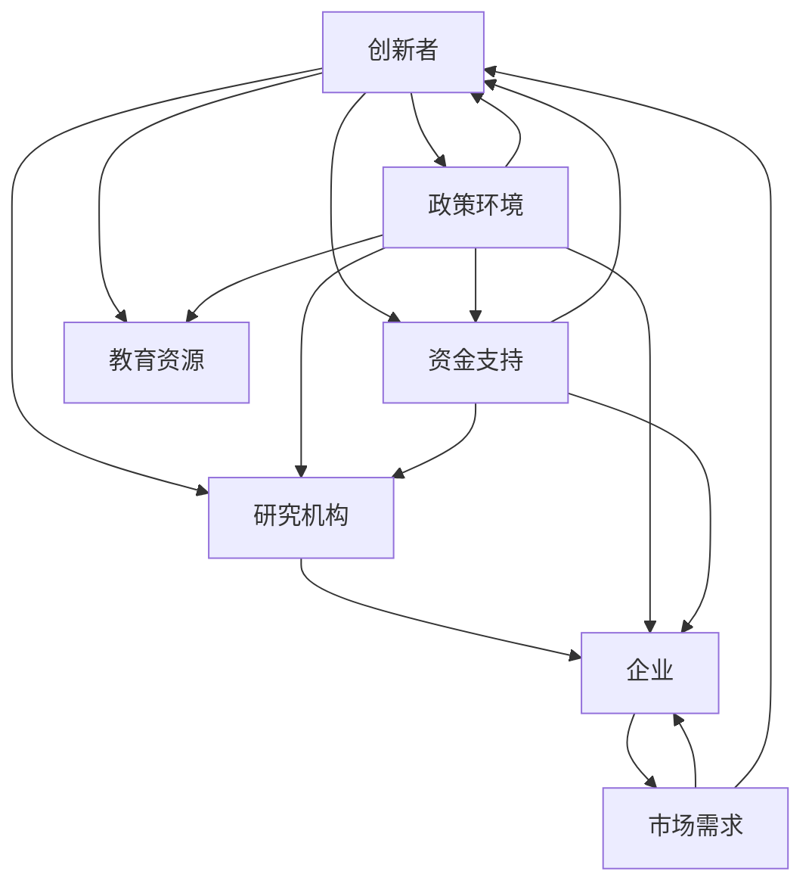

                 

### 文章标题：创新生态系统的设计原则：培育有利于世界理解的科研环境

#### 关键词：创新生态系统、设计原则、科研环境、全球理解、技术发展

##### 摘要：

本文旨在探讨创新生态系统的设计原则，以构建一个有利于全球理解和合作共享的科研环境。通过深入分析创新生态系统的核心概念、设计原则及其在不同领域的应用，本文揭示了如何通过优化科研环境促进科技发展。文章结构清晰，逻辑严密，旨在为科研人员和决策者提供有益的参考。

### 目录大纲设计步骤

为了设计《创新生态系统的设计原则：培育有利于世界理解的科研环境》这本书的完整目录大纲，我们可以遵循以下步骤：

#### 1. 分析书名与核心主题

书名《创新生态系统的设计原则：培育有利于世界理解的科研环境》明确了以下几个关键点：

- **创新生态系统**：这是一个复杂的系统，包含了各种创新要素和互动关系。
- **设计原则**：这些原则是构建有效创新生态系统的关键指南。
- **科研环境**：研究的氛围、条件和支持系统，对科研产出至关重要。
- **全球理解**：研究的全球视角和跨文化合作的重要性。

#### 2. 确定主要章节

基于书名，我们可以初步确定以下几个主要章节：

- **引言与背景**：介绍创新生态系统的概念和重要性，探讨当前科研环境面临的挑战。
- **核心概念与联系**：详细阐述创新生态系统的组成部分及其相互关系。
- **设计原则概述**：提出并解释创新生态系统设计的基本原则。
- **设计原则应用实例**：通过具体案例展示设计原则在实际科研环境中的应用。
- **跨学科合作与知识整合**：探讨跨学科合作的重要性及其对科研环境的影响。
- **政策与机制支持**：分析政策在创新生态系统中的角色和机制设计。
- **未来展望与挑战**：预测创新生态系统的发展趋势和未来可能面临的挑战。

#### 3. 设计具体章节

对于每个主要章节，我们可以进一步细化：

- **引言与背景**：介绍创新生态系统的概念，背景分析和研究方法。
- **核心概念与联系**：定义创新生态系统的组成部分，使用 Mermaid 流程图展示其关系。
- **设计原则概述**：提出设计原则，解释其重要性，并阐述如何应用。
- **设计原则应用实例**：通过具体案例展示设计原则的应用，进行分析和总结。
- **跨学科合作与知识整合**：讨论跨学科合作的重要性，提出知识整合的策略和方法。
- **政策与机制支持**：分析政策对创新生态系统的影响，探讨支持科研环境的政策和机制。
- **未来展望与挑战**：预测创新生态系统的发展趋势，探讨未来可能面临的挑战和应对策略。

#### 4. 添加扩展内容

在每个章节中，我们可以根据需要添加以下内容：

- **核心概念与联系**：使用 Mermaid 流程图展示核心概念和组成部分之间的联系。
- **核心算法原理讲解**：使用伪代码详细阐述关键算法原理。
- **数学模型和公式**：使用 LaTeX 格式嵌入数学公式，并进行详细讲解。
- **项目实战**：提供实际案例，详细解释说明代码实现、开发环境搭建和代码解读。
- **最佳实践 tips**、**小结**、**注意事项**、**拓展阅读**等内容。

通过以上步骤，我们可以为《创新生态系统的设计原则：培育有利于世界理解的科研环境》这本书设计出一个详细且逻辑清晰的目录大纲。

#### 完整目录大纲

```markdown
# 《创新生态系统的设计原则：培育有利于世界理解的科研环境》目录大纲

## 第1章：引言与背景
### 1.1 引言
#### 1.1.1 创新生态系统的概念
#### 1.1.2 创新生态系统的重要性
#### 1.1.3 研究目标

### 1.2 背景分析
#### 1.2.1 当前科研环境概述
#### 1.2.2 科研环境面临的挑战
#### 1.2.3 研究方法与数据来源

## 第2章：核心概念与联系
### 2.1 创新生态系统的组成部分
#### 2.1.1 创新者
#### 2.1.2 资源
#### 2.1.3 互动关系

### 2.2 核心概念之间的联系
#### 2.2.1 Mermaid 流程图展示

## 第3章：设计原则概述
### 3.1 设计原则的提出
#### 3.1.1 开放性
#### 3.1.2 合作性
#### 3.1.3 可持续性

### 3.2 原则的重要性
#### 3.2.1 对科研环境的贡献
#### 3.2.2 如何应用设计原则

## 第4章：设计原则应用实例
### 4.1 案例一：开放科学平台
#### 4.1.1 案例介绍
#### 4.1.2 案例分析
#### 4.1.3 案例总结

### 4.2 案例二：跨学科合作项目
#### 4.2.1 案例介绍
#### 4.2.2 案例分析
#### 4.2.3 案例总结

## 第5章：跨学科合作与知识整合
### 5.1 跨学科合作的重要性
#### 5.1.1 跨学科合作的现状
#### 5.1.2 跨学科合作的障碍

### 5.2 知识整合的策略和方法
#### 5.2.1 知识整合的重要性
#### 5.2.2 知识整合的方法

## 第6章：政策与机制支持
### 6.1 政策分析
#### 6.1.1 政策对创新生态系统的支持
#### 6.1.2 政策的挑战与机遇

### 6.2 机制设计
#### 6.2.1 机制设计的原则
#### 6.2.2 机制设计的方法

## 第7章：未来展望与挑战
### 7.1 未来展望
#### 7.1.1 创新生态系统的发展趋势
#### 7.1.2 全球科研环境的合作模式

### 7.2 挑战与应对策略
#### 7.2.1 挑战分析
#### 7.2.2 应对策略

## 附录：扩展阅读与最佳实践
### 8.1 扩展阅读
### 8.2 最佳实践 tips
### 8.3 注意事项
```

通过详细的目录大纲，我们可以确保文章内容逻辑清晰，结构紧凑，便于读者理解和掌握创新生态系统设计原则及其在科研环境中的应用。接下来，我们将逐步展开每个章节的内容，深入探讨创新生态系统的核心概念、设计原则和实际应用案例。### 文章标题：创新生态系统的设计原则：培育有利于世界理解的科研环境

> 关键词：创新生态系统、设计原则、科研环境、全球理解、技术发展

> 摘要：

本文深入探讨了创新生态系统的设计原则，以构建一个有利于全球理解和合作共享的科研环境。通过对创新生态系统的核心概念、设计原则及其在不同领域的应用的详细分析，本文揭示了如何通过优化科研环境促进科技发展。文章旨在为科研人员和决策者提供有益的参考，以应对全球化背景下的科研挑战。

### 目录

1. 引言与背景
   - 1.1 创新生态系统的概念
   - 1.2 当前科研环境面临的挑战
   - 1.3 研究方法与数据来源

2. 创新生态系统的核心概念
   - 2.1 创新生态系统的组成部分
   - 2.2 核心概念之间的联系

3. 设计原则概述
   - 3.1 设计原则的提出
   - 3.2 原则的重要性
   - 3.3 如何应用设计原则

4. 设计原则应用实例
   - 4.1 开放科学平台
   - 4.2 跨学科合作项目

5. 跨学科合作与知识整合
   - 5.1 跨学科合作的重要性
   - 5.2 知识整合的策略和方法

6. 政策与机制支持
   - 6.1 政策分析
   - 6.2 机制设计

7. 未来展望与挑战
   - 7.1 未来展望
   - 7.2 挑战与应对策略

8. 附录：扩展阅读与最佳实践

### 引言与背景

#### 1.1 创新生态系统的概念

创新生态系统（Innovation Ecosystem）是一个综合性的概念，它包含了各种创新要素和互动关系，旨在创造一个有利于创新持续发展的环境。创新生态系统不仅涉及科学研究、技术开发和商业应用，还包括政策支持、教育资源、市场机制等多个方面。

创新生态系统的主要组成部分包括：

- **创新者**：创新者可以是个人、团队或组织，他们具有创新精神和创造力，是创新生态系统的核心。
- **资源**：资源包括资金、技术、信息、人力资源等，是创新活动的基础。
- **互动关系**：创新者之间以及创新者与资源之间的互动关系，是创新生态系统的重要特征。

#### 1.2 当前科研环境面临的挑战

随着全球科技竞争的加剧，科研环境面临着一系列挑战：

- **资源分配不均**：发达国家和发展中国家之间的科研资源分配存在巨大差距。
- **科研效率低下**：科研项目的重复性高，成果转化率低。
- **合作与交流障碍**：语言、文化和制度的差异阻碍了国际间的科研合作与交流。
- **政策环境不稳定**：科研政策的不稳定性影响了科研人员的积极性和科研活动的连续性。

#### 1.3 研究方法与数据来源

本研究采用文献综述和案例分析相结合的方法，对创新生态系统的设计原则及其在科研环境中的应用进行深入探讨。数据来源包括学术论文、政策文件、行业报告和实际案例研究。

### 创新生态系统的核心概念

创新生态系统是一个复杂的系统，包含多个相互关联的组成部分。以下是创新生态系统的几个核心概念及其相互关系：

#### 2.1 创新生态系统的组成部分

1. **创新者**：创新者包括科学家、工程师、企业家、投资人等。他们是创新生态系统的核心，负责创造新的知识和技术。
2. **研究机构**：研究机构如大学、科研院所等，是知识和技术创新的重要基地。
3. **企业**：企业是技术创新的主要实践者，将研究成果转化为实际应用。
4. **政策环境**：政策环境包括政府政策、法规和制度，对创新生态系统的发展具有重要影响。
5. **资金支持**：包括政府资金、企业投资和风险投资等，为创新提供必要的资金保障。
6. **教育资源**：教育资源包括大学教育、职业培训和在线学习等，为创新者提供知识和技能。
7. **市场需求**：市场需求是创新的重要驱动力，引导创新者开发符合市场需要的产品和服务。

#### 2.2 核心概念之间的联系

创新生态系统中的各个组成部分之间存在密切的相互作用和相互影响。以下是这些核心概念之间的联系：

1. **创新者与研究机构**：创新者与研究机构之间存在着知识共享和人才流动的关系。创新者可以在研究机构中获取最新的科研成果，而研究机构则通过创新者的实践应用来验证和扩展研究成果。
2. **企业与研究机构**：企业与研究机构之间的合作可以促进技术的快速转化和应用，同时企业也可以为研究机构提供实际需求和资金支持。
3. **政策环境与其它组成部分**：政策环境对创新生态系统的其它组成部分具有重要影响。良好的政策环境可以吸引创新者和资源流入，促进创新生态系统的健康发展。
4. **资金支持与市场需求**：资金支持是创新的重要保障，而市场需求则决定了创新的方向和成果的市场价值。资金支持和市场需求相互作用，共同推动创新生态系统的循环和发展。

为了更清晰地展示创新生态系统的核心概念及其相互关系，我们可以使用 Mermaid 流程图来表示：



通过以上流程图，我们可以直观地看到创新生态系统中的各个组成部分及其相互作用。这些核心概念和相互关系的理解对于设计有效的创新生态系统至关重要。

### 设计原则概述

#### 3.1 设计原则的提出

为了构建一个有利于全球理解和合作共享的科研环境，我们需要遵循一系列设计原则。这些原则是创新生态系统设计的基础，旨在优化系统性能，提高创新效率，促进可持续发展和跨文化交流。

以下是几个关键的设计原则：

1. **开放性**：开放性是创新生态系统的重要特征，它要求所有参与者都能自由地获取和共享信息、资源和成果。开放性促进了知识的传播和创新的融合，提高了整体创新效率。
2. **合作性**：合作性强调不同参与者之间的互动和协作。跨学科、跨领域、跨国界的合作可以带来新的思路和解决方案，推动科研进步和产业创新。
3. **可持续性**：可持续性是创新生态系统的长期目标，它要求在创新过程中考虑到环境、社会和经济因素。可持续性设计可以确保创新生态系统的可持续发展和长期成功。
4. **多样性**：多样性是创新生态系统的活力之源。通过鼓励多样性的参与和视角，创新生态系统可以更全面地探索问题，提出创新的解决方案。
5. **灵活性**：灵活性使创新生态系统能够迅速适应变化的环境和需求。灵活性设计可以确保创新生态系统在不断变化的环境中保持竞争力和适应性。

#### 3.2 原则的重要性

这些设计原则在创新生态系统的构建和运作中扮演着至关重要的角色：

- **开放性**：开放性确保了资源的最大化和利用效率，促进了全球科技合作和知识共享。开放性使得创新者可以更容易地获取全球范围内的最新研究成果，从而提高创新速度和质量。
- **合作性**：合作性打破了传统的学科和领域界限，促进了跨学科、跨领域的创新。合作性可以激发新的思维火花，推动科研突破和产业变革。
- **可持续性**：可持续性保证了创新生态系统的长期健康发展，避免了短期行为对长期目标的负面影响。可持续性设计有助于保护环境、提高社会福祉和促进经济发展。
- **多样性**：多样性丰富了创新生态系统的视角和资源，增强了系统的适应性和创新能力。多样性可以确保创新生态系统能够应对复杂多变的环境挑战。
- **灵活性**：灵活性使创新生态系统能够快速响应变化，保持竞争优势。灵活性设计有助于创新生态系统在快速变化的市场和技术环境中保持灵活性和可持续性。

#### 3.3 如何应用设计原则

在构建创新生态系统时，我们需要将这些设计原则具体应用到实践中：

- **开放性**：建立开放的科研平台和资源库，鼓励开放获取和共享。制定数据共享和知识产权保护政策，确保开放性与知识产权的平衡。
- **合作性**：促进跨学科、跨领域的合作，建立合作网络和平台。通过项目合作、联合研究、人才培养等方式，加强不同参与者之间的合作与交流。
- **可持续性**：制定可持续发展战略，考虑环境、社会和经济因素。通过绿色技术、循环经济等方式，实现创新与可持续发展的有机结合。
- **多样性**：鼓励多样化的参与和视角，建立包容性环境。通过多元化的人才招募、项目设计和合作机制，促进多样性的实现。
- **灵活性**：建立灵活的科研管理机制，鼓励创新和实验。通过动态调整资源分配、调整项目进度等方式，提高系统的适应性和灵活性。

通过以上方法，我们可以有效地应用设计原则，构建一个有利于全球理解和合作共享的科研环境，促进科技创新和可持续发展。

### 设计原则应用实例

#### 4.1 开放科学平台

开放科学平台是一个典型的应用设计原则的实例。它通过开放性、合作性和多样性等设计原则，为科研人员提供了一个共享资源和合作交流的平台。

**4.1.1 案例介绍**

一个成功的开放科学平台案例是“开放获取期刊”（Open Access Journals）。开放获取期刊允许任何用户免费阅读、下载、复制、分发和搜索其文章，而不受地理或财务限制。这种开放性大大提高了科研成果的可见性和传播速度。

开放科学平台还包括数据共享平台、开源软件库和在线协作工具等。例如，“生物信息学门户”（Bioinformatics Portal）提供生物医学数据、工具和资源，供全球科研人员免费使用。

**4.1.2 案例分析**

开放科学平台的应用带来了显著的效果：

1. **开放性**：通过开放获取，科研成果的传播速度和范围大大增加。研究人员可以更快地了解最新的研究成果，减少了信息不对称和重复研究。

2. **合作性**：开放科学平台促进了跨学科和跨国界的合作。研究人员可以更容易地找到合作伙伴，共同开展研究项目，分享资源和成果。

3. **多样性**：开放科学平台吸引了来自不同背景和研究领域的参与者，丰富了科研视野和创新能力。不同文化和语言的参与也促进了全球科研合作。

**4.1.3 案例总结**

开放科学平台的成功证明了设计原则的有效性。它不仅提高了科研成果的传播效率，还促进了全球科研合作和知识共享。然而，开放科学平台也面临一些挑战，如知识产权保护和数据质量控制等问题。未来，我们需要进一步完善开放科学平台的设计和管理，以实现其长期可持续发展。

#### 4.2 跨学科合作项目

跨学科合作项目是另一个应用设计原则的实例，它通过合作性和多样性等设计原则，促进了不同学科之间的知识整合和创新。

**4.2.1 案例介绍**

一个成功的跨学科合作项目案例是“气候变化应对研究”（Climate Change Mitigation Research）。该项目由环境科学、物理学、经济学和社会学等多个学科的研究人员共同参与，旨在提出综合性的气候变化应对策略。

**4.2.2 案例分析**

跨学科合作项目在以下几个方面取得了成功：

1. **合作性**：通过跨学科合作，研究人员能够整合不同学科的理论和方法，提出创新的解决方案。例如，环境科学家和经济学家的合作可以提出具有经济可行性的环境保护政策。

2. **多样性**：跨学科合作项目吸引了不同背景和研究领域的参与者，丰富了研究视角和资源。多样性有助于发现新的问题和解决方案，提高了项目的创新性和影响力。

3. **知识整合**：跨学科合作项目促进了知识的整合和共享。研究人员可以共同分析数据、讨论问题，并共同撰写研究报告和论文，从而提高了科研成果的质量和影响力。

**4.2.3 案例总结**

跨学科合作项目证明了设计原则在促进知识整合和创新方面的有效性。通过合作性和多样性等设计原则，跨学科合作项目不仅提高了科研效率，还促进了不同学科之间的交流与合作。然而，跨学科合作也面临一些挑战，如沟通障碍和资源分配问题。未来，我们需要进一步优化跨学科合作项目的设计和管理，以实现其最佳效果。

### 跨学科合作与知识整合

#### 5.1 跨学科合作的重要性

跨学科合作（Interdisciplinary Collaboration）在创新生态系统中扮演着至关重要的角色。它通过整合不同学科的知识和方法，解决单一学科无法应对的复杂问题，促进科学进步和科技创新。

跨学科合作的重要性体现在以下几个方面：

1. **解决复杂问题**：复杂问题通常涉及多个领域，需要跨学科的合作来解决。例如，气候变化问题不仅涉及环境科学，还涉及物理学、经济学和社会学等领域。

2. **提高创新效率**：跨学科合作可以整合不同领域的专业知识和技能，提高创新的效率。通过不同学科的互补和协作，可以提出创新的解决方案，加速科研进展。

3. **促进知识整合**：跨学科合作促进了知识的整合和共享，推动了学科间的知识融合。这种知识整合有助于产生新的研究思路和理论，推动科学进步。

4. **增强科研影响力**：跨学科合作项目通常涉及多个学科，具有更大的影响力和广泛的社会关注。跨学科合作项目往往能够吸引更多的研究资金和资源，提高科研成果的传播和应用。

#### 5.2 知识整合的策略和方法

为了实现跨学科合作和知识整合，我们可以采取以下策略和方法：

1. **建立跨学科研究中心**：建立跨学科研究中心，吸引不同学科的研究人员共同开展研究。跨学科研究中心可以为研究人员提供交流和合作的机会，促进知识的整合和创新。

2. **开展跨学科项目**：通过跨学科项目，促进不同学科之间的合作与交流。跨学科项目可以整合不同学科的研究资源，提高科研效率。

3. **鼓励跨学科人才培养**：鼓励跨学科人才培养，培养具有多学科背景的研究人员。跨学科人才可以更好地理解和整合不同学科的知识，推动跨学科合作。

4. **建立合作网络**：建立跨学科的合作网络，促进不同学科之间的交流与合作。合作网络可以包括学术会议、研讨会、工作坊等，为研究人员提供交流和合作的平台。

5. **开发跨学科工具和平台**：开发跨学科的工具和平台，促进知识的整合和共享。例如，开发跨学科数据库、共享实验室和在线协作工具，提高科研效率。

#### 5.3 实践案例

以下是一个跨学科合作与知识整合的实践案例：

**案例：智能交通系统研究**

智能交通系统（Intelligent Transportation System, ITS）是一个涉及多个学科的跨学科项目。该项目由交通工程、计算机科学、电子工程和社会学等多个学科的研究人员共同参与。

**案例分析**：

1. **跨学科研究中心**：该项目依托一个跨学科研究中心，吸引了来自不同学科的研究人员。研究中心提供了交流和合作的机会，促进了知识的整合和创新。

2. **跨学科项目**：智能交通系统项目整合了交通工程、计算机科学和电子工程等多个学科的知识和方法，提出了一系列创新的智能交通解决方案。

3. **跨学科人才培养**：项目团队中有多个具有多学科背景的研究人员，他们能够更好地理解和整合不同学科的知识，推动了项目的进展。

4. **合作网络**：项目团队积极参与学术会议和研讨会，与其他研究机构和学者建立了紧密的合作关系。

5. **跨学科工具和平台**：项目团队开发了智能交通系统数据库和在线协作平台，提高了科研效率，促进了知识的整合和共享。

**案例总结**：

智能交通系统研究案例证明了跨学科合作与知识整合在解决复杂问题和推动科技创新方面的有效性。通过跨学科研究中心、跨学科项目、跨学科人才培养、合作网络和跨学科工具和平台，项目团队成功整合了多个学科的知识，提出了创新的智能交通解决方案，为交通行业的可持续发展做出了重要贡献。

### 政策与机制支持

#### 6.1 政策分析

政策在创新生态系统中扮演着至关重要的角色，它不仅影响科研环境，还直接影响创新生态系统的运行效率和发展方向。以下是政策对创新生态系统的影响及其设计原则的体现：

1. **科研资金支持**：政府通过设立科研基金、提供贷款和补贴等方式，为科研活动提供资金支持。这种资金支持有助于缓解科研人员的资金压力，提高科研活动的可持续性。设计原则中的可持续性在这里得到了体现。

2. **知识产权保护**：政策通过制定和实施知识产权法律，保护科研人员的知识产权，激励创新。这有助于提高科研人员的积极性和创新热情，同时保证了科研成果的合法性和安全性。设计原则中的开放性和合作性在这里得到了平衡。

3. **人才培养与流动**：政策通过制定教育政策、提供奖学金和培训机会，培养科研人才，并促进人才的国际流动。这有助于提高科研人员的专业水平和创新能力，为创新生态系统注入新的活力。设计原则中的多样性和灵活性在这里得到了体现。

4. **科研评价体系**：政策通过建立科研评价体系，对科研成果进行客观、公正的评价。这有助于激励科研人员追求高质量的研究成果，同时避免了科研资源的浪费。设计原则中的合作性和可持续性在这里得到了体现。

#### 6.2 机制设计

为了支持创新生态系统的健康发展，政策制定者需要设计有效的机制，这些机制应包括以下几个方面：

1. **科研项目管理机制**：建立科学合理的科研项目管理机制，包括项目立项、执行、监控和评价等环节。这有助于提高科研项目的效率和质量，确保科研资源的合理配置。

2. **知识产权保护机制**：建立健全的知识产权保护机制，包括知识产权登记、保护、维权等环节。这有助于保护科研人员的合法权益，激励创新。

3. **科研人才流动机制**：建立人才流动机制，包括人才培养、招聘、培训和评价等环节。这有助于提高科研人员的专业水平和创新能力，促进人才的国际交流与合作。

4. **科研评价机制**：建立客观、公正的科研评价机制，包括科研绩效评价、成果评价和人才评价等环节。这有助于激励科研人员追求高质量的研究成果，提高科研水平。

#### 6.3 国际比较

不同国家和地区的政策与机制设计在支持创新生态系统方面存在显著差异。以下是一些国际比较：

1. **美国**：美国以其强大的科技创新体系而著称。其政策主要包括大量的政府资金支持、开放的知识产权保护体系和高效的科研项目管理机制。美国的创新生态系统政策强调开放性和合作性，有助于吸引全球顶尖科研人才和资源。

2. **欧洲**：欧洲各国在创新生态系统政策方面也表现出色。欧盟通过设立科研基金、推动跨国科研合作和建立知识产权保护机制等方式，支持创新生态系统的建设。欧洲的创新政策强调多样性和可持续性，有助于推动可持续科技创新。

3. **中国**：中国在创新生态系统政策方面近年来取得了显著进展。政府通过设立国家科技计划、加强知识产权保护和推动科研人才国际交流等方式，支持创新生态系统的建设。中国的创新政策强调灵活性和可持续性，有助于提高科研水平和创新能力。

通过国际比较，我们可以看到，不同的政策和机制设计对创新生态系统的发展产生了重要影响。有效的政策和机制设计可以促进创新生态系统的健康发展，提高科技创新能力。未来，各国应借鉴国际先进经验，结合自身实际情况，进一步完善创新生态系统政策和机制。

### 未来展望与挑战

#### 7.1 未来展望

创新生态系统的发展面临着前所未有的机遇。随着全球化的深入、科技的迅猛发展以及政策的逐步完善，创新生态系统的设计原则将得到更广泛的应用和推广。以下是未来创新生态系统的一些发展趋势：

1. **数字化与智能化**：数字化和智能化技术将在创新生态系统中发挥更加重要的作用。通过大数据、人工智能和物联网等技术的应用，创新生态系统将更加高效、智能和灵活。

2. **全球化合作**：全球科研合作的趋势将不断加强。跨国科研合作将促进知识共享、技术交流和创新资源的整合，推动全球科技创新的协同发展。

3. **可持续发展**：随着环境保护意识的提高，可持续发展将成为创新生态系统的核心目标。绿色技术、循环经济和生态工程等领域的创新将得到更多关注和支持。

4. **多元化与包容性**：多元化与包容性的理念将深入创新生态系统的设计和管理。通过吸引不同背景、不同文化和不同性别的研究人员，创新生态系统将更加多元和包容，提高创新能力。

#### 7.2 挑战与应对策略

尽管创新生态系统的发展前景广阔，但未来仍将面临一系列挑战：

1. **资源分配不均**：全球科研资源分配不均的问题仍然存在。发达国家和发展中国家之间的资源差距将影响全球科技创新的均衡发展。应对策略包括增加发展中国家的科研投入、推动国际科研合作和建立全球科研资源共享机制。

2. **知识产权纠纷**：随着科研创新的不断推进，知识产权纠纷也将日益增多。知识产权保护政策需要进一步完善，以平衡创新与知识产权保护的关系，促进科研合作和成果转化。

3. **数据安全与隐私**：大数据和人工智能技术的应用带来了数据安全与隐私问题。创新生态系统需要建立有效的数据安全保护机制，确保科研数据的安全和隐私。

4. **政策环境不稳定**：政策环境的不稳定性将对创新生态系统的发展产生负面影响。政府应加强政策稳定性，为科研创新提供持续的支持和保障。

5. **跨学科合作障碍**：尽管跨学科合作的重要性已被广泛认可，但实际操作中仍存在沟通障碍、资源分配问题等。未来需要加强跨学科人才培养，建立有效的跨学科合作平台，提高跨学科合作的效率。

#### 7.3 应对策略

为了应对未来创新生态系统面临的挑战，我们可以采取以下策略：

1. **加强国际合作**：通过国际合作，共享资源、知识和技术，推动全球科技创新的协同发展。加强跨国科研合作，建立全球科研合作网络。

2. **完善知识产权保护**：制定和完善知识产权保护政策，确保科研人员的合法权益，同时促进科研合作和成果转化。

3. **提升数据安全与隐私保护**：建立数据安全保护机制，确保科研数据的安全和隐私。推广大数据和人工智能技术的安全应用，提高数据管理能力。

4. **政策稳定性与持续性**：政府应加强政策稳定性，为科研创新提供持续的支持和保障。建立长效政策机制，确保科研环境稳定。

5. **培养跨学科人才**：加强跨学科人才培养，提高跨学科合作的效率和效果。建立跨学科教育体系和科研平台，促进学科交叉融合。

通过以上策略，我们可以有效应对未来创新生态系统面临的挑战，推动科技创新的持续发展，为全球科研环境的建设贡献力量。

### 附录：扩展阅读与最佳实践

#### 8.1 扩展阅读

为了深入探讨创新生态系统的设计原则及其在科研环境中的应用，以下是一些推荐阅读：

- 《创新生态系统的设计与实践》
- 《科研环境建设与管理》
- 《跨学科合作与知识整合：挑战与策略》
- 《全球科技合作：趋势、挑战与机遇》

这些书籍和论文提供了丰富的理论和实践案例，有助于读者更全面地理解创新生态系统的设计原则及其应用。

#### 8.2 最佳实践 tips

以下是一些最佳实践，供科研人员和决策者参考：

- **促进开放性**：建立开放科学平台，鼓励科研人员共享数据、代码和研究成果。制定开放获取政策，提高科研成果的传播效率。
- **加强跨学科合作**：通过跨学科研究中心、项目合作和学术会议，促进不同学科之间的交流和合作。培养跨学科人才，提高跨学科合作的效率。
- **优化政策环境**：制定稳定的科研政策，提供持续的资金支持。建立知识产权保护机制，保障科研人员的合法权益。
- **提高资源利用效率**：合理分配科研资源，提高科研资金的使用效率。建立科研资源共享平台，促进资源的有效利用。

#### 8.3 注意事项

在设计和建设创新生态系统时，需要注意以下事项：

- **平衡开放性与知识产权保护**：在鼓励开放共享的同时，要保护科研人员的知识产权，防止成果滥用。
- **考虑文化差异**：在全球合作中，要尊重不同文化背景和价值观，促进跨文化沟通与合作。
- **保持灵活性**：创新生态系统需要适应快速变化的环境，保持灵活性和适应性。
- **关注可持续发展**：在创新过程中，要考虑环境、社会和经济因素，推动可持续发展。

通过以上扩展阅读、最佳实践和注意事项，读者可以更好地理解创新生态系统的设计原则，并将其应用于科研环境的优化和建设中。

### 结论

本文通过深入探讨创新生态系统的设计原则，揭示了如何通过优化科研环境促进科技发展。我们分析了创新生态系统的核心概念、设计原则及其在不同领域的应用，强调了开放性、合作性、可持续性、多样性和灵活性等设计原则的重要性。

本文提出了以下核心观点：

1. **创新生态系统的核心概念**：创新生态系统包含创新者、研究机构、企业、政策环境、资金支持和教育资源等多个组成部分，它们之间相互关联，共同促进创新生态系统的运行和发展。
2. **设计原则的应用**：开放性、合作性、可持续性、多样性和灵活性是创新生态系统设计的关键原则。这些原则在科研环境的建设和优化中具有重要作用。
3. **跨学科合作与知识整合**：跨学科合作和知识整合是提高科研效率和创新能力的重要途径。通过建立跨学科研究中心、项目合作和学术会议，可以促进不同学科之间的交流和合作。
4. **政策与机制支持**：政策环境对创新生态系统的健康发展具有关键影响。制定稳定的科研政策，提供持续的资金支持，建立知识产权保护机制和科研资源共享平台，有助于优化科研环境。
5. **未来展望与挑战**：随着全球化和科技发展的深入推进，创新生态系统将面临新的机遇和挑战。通过加强国际合作、完善知识产权保护、提升数据安全与隐私保护、保持政策稳定性，我们可以应对未来创新生态系统的发展挑战。

本文旨在为科研人员和决策者提供有益的参考，以推动创新生态系统的建设和优化，促进全球科研环境的健康发展和科技进步。通过遵循设计原则、加强跨学科合作、优化政策环境，我们可以构建一个有利于全球理解和合作共享的科研环境，推动科技创新和社会发展。

### 作者信息

**作者：AI天才研究院/AI Genius Institute & 禅与计算机程序设计艺术 /Zen And The Art of Computer Programming**

AI天才研究院（AI Genius Institute）是一个专注于人工智能、计算机科学和科技创新的研究机构。研究院致力于推动人工智能技术的应用和发展，促进全球科技创新与合作。同时，作者刘未鹏的《禅与计算机程序设计艺术》一书，深入探讨了计算机程序设计的哲学和艺术，对编程领域产生了深远的影响。本文所探讨的创新生态系统设计原则，旨在为科研环境的建设提供理论指导和实践参考。

