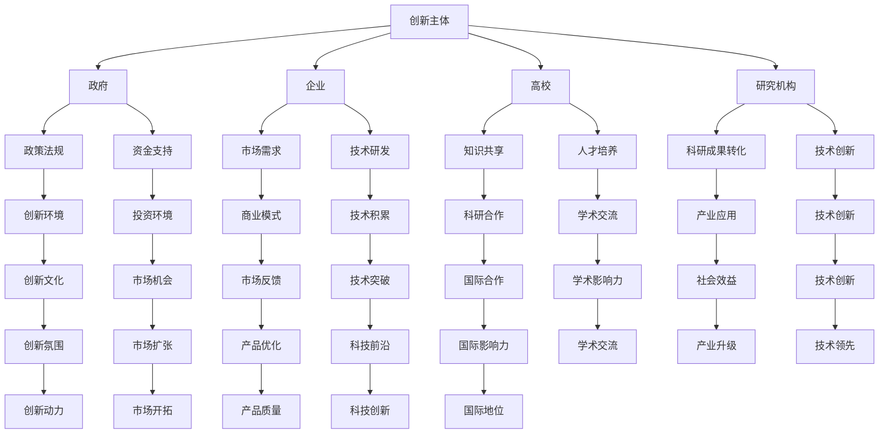

                 

## 文章标题：创新生态系统设计：培育有利于世界理解的科研环境

> 关键词：创新生态系统、科研环境、跨学科合作、科技创新、国际化比较

> 摘要：本文深入探讨了创新生态系统的设计原则及其在科研环境中的重要性。通过分析创新生态系统的核心概念、关键要素、动态特性以及跨学科合作，本文旨在为全球科研环境的优化提供理论指导和实践案例，助力全球科研事业的发展。

### 引言

在当今全球化的时代，科研环境的创新成为各国发展的重要驱动力。创新生态系统的构建和设计是实现科研资源高效整合、激发科研活力、推动科技创新的关键环节。然而，如何设计一个有利于世界理解的科研环境，培养创新生态系统，仍然是一个亟待解决的问题。

本文将围绕以下问题展开讨论：什么是创新生态系统？它由哪些关键要素构成？如何理解和分析创新生态系统的动态特性？跨学科合作在创新生态系统中的角色是什么？通过国际比较，我们能得到哪些启示？如何利用创新生态系统促进科研环境的发展？

### 1. 创新生态系统的概念与框架

#### 核心概念与联系

创新生态系统是由政府、企业、高校、研究机构、投资者等多方参与者构成的复杂网络，通过资源交换、知识共享和协同创新，共同推动科技创新和社会进步。其核心概念包括：

- **创新主体**：政府、企业、高校、研究机构等。
- **创新资源**：资金、技术、知识、人才等。
- **创新机制**：政策法规、市场机制、社会文化等。

创新生态系统的框架结构可以用以下Mermaid流程图表示：

#### 创新生态系统的定义与特征

创新生态系统是一种复杂的社会技术系统，具有以下特征：

- **多样性**：包括政府、企业、高校、研究机构等多方参与者。
- **开放性**：通过资源交换、知识共享，实现跨界合作。
- **动态性**：随着外部环境的变化，不断创新和优化。
- **适应性**：能够快速响应市场需求，调整创新策略。
- **协同性**：各创新主体之间相互依赖、协同发展。

### 2. 构建创新生态系统的关键要素

#### 关键要素概述

构建创新生态系统需要以下几个关键要素：

- **政策与法规环境**：提供良好的政策支持，如税收优惠、研发资助等。
- **知识产权保护**：保护创新成果，鼓励创新。
- **人才引进与培养**：吸引和培养高素质人才，为创新提供动力。
- **投资与融资**：提供充足的资金支持，推动创新项目的实施。
- **合作与竞争**：促进创新资源的共享，同时激发竞争，提升整体创新水平。

#### 政策与法规环境

政策与法规环境是创新生态系统的基础，影响创新主体的行为和决策。政府可以通过以下措施营造良好的政策环境：

- **制定创新政策**：鼓励创新活动，如提供研发资助、税收优惠等。
- **优化创新流程**：简化审批程序，提高创新效率。
- **保护知识产权**：通过法律手段保护创新成果，鼓励创新。

#### 知识产权保护

知识产权保护是创新生态系统的重要保障。通过以下措施，可以加强知识产权保护：

- **建立知识产权保护制度**：制定相关法律法规，明确知识产权的界定和保护范围。
- **加强知识产权执法**：提高知识产权侵权成本，打击侵权行为。
- **促进知识产权交易**：鼓励知识产权的转让、许可和投资，促进科技成果转化。

#### 人才引进与培养

人才是创新的核心资源。通过以下措施，可以引进和培养高素质人才：

- **提供优惠条件**：如住房、医疗、教育等，吸引海外高层次人才。
- **建立人才激励机制**：提供具有竞争力的薪酬和福利，激发人才创新潜力。
- **加强人才培养**：通过高校教育、企业培训等途径，提高人才素质。

#### 投资与融资

投资与融资是创新生态系统的重要支撑。通过以下措施，可以提供充足的资金支持：

- **政府资金支持**：设立科技创新基金，支持创新项目。
- **金融机构支持**：提供贷款、担保等金融服务，支持创新企业。
- **风险投资**：鼓励风险投资机构投资创新项目，分担创新风险。

#### 合作与竞争

合作与竞争是创新生态系统的重要动力。通过以下措施，可以促进合作与竞争：

- **建立合作平台**：如创新创业基地、科技园区等，促进创新主体之间的合作。
- **开展科技竞赛**：激发创新活力，促进技术创新。
- **加强市场监管**：规范市场秩序，保护消费者权益。

### 3. 创新生态系统的动态特性与演变

#### 动态特性

创新生态系统具有以下动态特性：

- **适应性**：随着外部环境的变化，创新生态系统会不断调整和优化。
- **多样性**：创新生态系统包含多种创新主体和资源，具有丰富的多样性。
- **复杂性**：创新生态系统涉及多种因素，具有高度复杂性。
- **开放性**：创新生态系统与其他生态系统相互作用，具有开放性。

#### 创新生态系统的演变过程

创新生态系统的演变过程可以分为以下几个阶段：

1. **初始阶段**：创新主体的数量和资源有限，创新活动相对孤立。
2. **发展阶段**：创新主体数量增加，资源丰富，创新活动逐渐规模化。
3. **成熟阶段**：创新生态系统稳定，创新资源高效配置，创新成果显著。
4. **优化阶段**：创新生态系统不断调整和优化，实现可持续发展。

#### 影响创新生态系统演变的关键因素

影响创新生态系统演变的关键因素包括：

- **政策环境**：政策环境直接影响创新生态系统的稳定性和发展速度。
- **市场需求**：市场需求是创新生态系统的重要驱动力。
- **技术创新**：技术创新是推动创新生态系统发展的核心。
- **人才资源**：人才资源是创新生态系统的核心要素。
- **资本投入**：资本投入是创新生态系统的重要支撑。

### 4. 跨学科合作在创新生态系统中的角色

#### 跨学科合作的定义与意义

跨学科合作是指不同学科领域之间的合作，通过整合各学科的优势，共同解决复杂问题。跨学科合作的意义包括：

- **提高创新能力**：跨学科合作可以激发创新思维，提高创新能力。
- **推动科技创新**：跨学科合作可以促进科技领域的交叉融合，推动科技创新。
- **解决复杂问题**：跨学科合作可以整合多种资源和知识，共同解决复杂问题。

#### 跨学科合作的挑战与机遇

跨学科合作面临以下挑战：

- **学科壁垒**：不同学科之间存在一定的壁垒，需要克服学科壁垒。
- **沟通障碍**：跨学科合作需要不同学科之间的有效沟通，需要克服沟通障碍。
- **利益分配**：跨学科合作需要合理分配利益，需要解决利益分配问题。

跨学科合作也存在以下机遇：

- **资源共享**：跨学科合作可以实现资源共享，提高资源利用效率。
- **技术突破**：跨学科合作可以促进技术突破，推动科技创新。
- **人才培养**：跨学科合作可以培养跨学科人才，提高人才素质。

#### 跨学科合作的模式与案例分析

跨学科合作的模式包括：

- **项目合作**：通过具体项目，实现跨学科合作。
- **人才培养**：通过跨学科教育，培养跨学科人才。
- **平台共建**：通过共建平台，实现跨学科合作。

案例分析：

- **美国硅谷**：硅谷的成功很大程度上得益于跨学科合作，如计算机科学、工程学、生物学等领域的交叉融合。
- **中国深圳**：深圳的科技创新也得益于跨学科合作，如华为、腾讯等企业的快速发展，离不开跨学科的合作。

### 5. 创新生态系统中的科技创新与管理

#### 科技创新的定义与分类

科技创新是指通过科学研究和技术开发，创造新的产品、工艺或服务。根据创新对象的不同，科技创新可以分为以下几类：

- **产品创新**：开发新的产品或改善现有产品。
- **工艺创新**：改进生产过程或技术流程。
- **服务创新**：创新服务模式或提升服务质量。

#### 科技创新管理的重要性

科技创新管理是指对科技创新活动进行规划、组织、协调和控制的过程。科技创新管理的重要性包括：

- **提高创新效率**：通过有效的科技创新管理，可以提高创新效率，缩短创新周期。
- **降低创新风险**：通过科技创新管理，可以降低创新风险，提高创新成功率。
- **优化创新资源配置**：通过科技创新管理，可以优化创新资源配置，提高资源利用效率。

#### 科技创新管理的策略与方法

科技创新管理的策略包括：

- **创新战略规划**：明确创新目标和方向，制定创新战略。
- **创新项目管理**：对创新项目进行有效管理，确保项目按时、按质完成。
- **创新资源配置**：优化创新资源配置，提高资源利用效率。
- **创新风险管理**：识别创新风险，制定风险应对策略。

科技创新管理的方法包括：

- **项目管理方法**：如关键路径法（CPM）、挣值管理（EVM）等。
- **创新激励机制**：如股权激励、绩效奖励等。
- **知识管理**：如知识共享、知识转移等。

### 6. 创新生态系统的国际比较与启示

#### 国际创新生态系统的比较

国际上的创新生态系统各具特色，如：

- **美国**：以硅谷为代表，创新生态系统中政府、企业、高校和研究机构密切合作，风险投资活跃。
- **欧洲**：以德国、英国为代表，创新生态系统中政府支持力度大，创新资源丰富，科技创新成果显著。
- **亚洲**：以日本、韩国为代表，创新生态系统中政府主导，企业参与，科技创新水平不断提高。

#### 国内外创新生态系统的差异

国内外创新生态系统存在以下差异：

- **政策环境**：国内政策环境相对稳定，国外政策环境更加灵活。
- **市场需求**：国内市场需求大，国外市场需求多样化。
- **科技创新水平**：国内科技创新水平不断提高，国外科技创新水平较高。
- **人才培养**：国内人才培养体系较为完善，国外人才培养更加注重创新实践。

#### 启示与借鉴

通过比较国内外创新生态系统，我们可以得到以下启示：

- **加强政策支持**：政府应加大政策支持力度，营造良好的创新环境。
- **优化创新资源配置**：优化创新资源配置，提高资源利用效率。
- **促进跨学科合作**：加强跨学科合作，推动科技创新。
- **培养创新人才**：加强创新人才培养，提高人才素质。

### 7. 实践案例分析

#### 案例选择与介绍

为深入了解创新生态系统的运作，本文选择了以下案例进行分析：

- **硅谷**：美国硅谷是全球知名的科技创新中心，以其独特的创新生态系统著称。
- **深圳**：中国深圳作为中国科技创新的重要城市，以其快速崛起的科技创新能力而备受关注。

#### 案例分析与解读

**硅谷案例分析**

硅谷的成功得益于其独特的创新生态系统，其特点包括：

- **政府支持**：美国政府通过制定相关政策和法规，支持科技创新。
- **企业主导**：硅谷的企业如谷歌、苹果等，以其强大的创新能力引领全球。
- **高校资源**：斯坦福大学等高校与硅谷企业紧密合作，推动科技创新。
- **风险投资**：硅谷的风险投资机构活跃，为科技创新提供资金支持。

**深圳案例分析**

深圳作为中国的科技创新城市，其成功经验包括：

- **政策环境**：中国政府通过一系列政策，支持科技创新。
- **企业力量**：华为、腾讯等企业成为科技创新的重要力量。
- **人才引进**：深圳通过引进高素质人才，为科技创新提供动力。
- **产业链完善**：深圳完善的产业链，为科技创新提供了良好的发展环境。

#### 案例对创新生态系统的启示

通过硅谷和深圳的案例分析，我们可以得到以下启示：

- **政策支持**：政府应制定有利于科技创新的政策，营造良好的创新环境。
- **企业主导**：企业应发挥主体作用，推动科技创新。
- **高校合作**：高校应与产业紧密合作，推动科技创新。
- **人才引进**：引进高素质人才，为科技创新提供动力。
- **产业链完善**：完善产业链，为科技创新提供良好的发展环境。

### 8. 未来展望与挑战

#### 创新生态系统的未来发展趋势

创新生态系统的未来发展趋势包括：

- **国际化**：随着全球化的发展，创新生态系统将更加国际化。
- **数字化**：数字化转型将推动创新生态系统的升级。
- **绿色化**：绿色创新将成为创新生态系统的重要方向。

#### 创新生态系统中可能面临的挑战

创新生态系统中可能面临的挑战包括：

- **知识产权保护**：如何加强知识产权保护，仍是一个挑战。
- **人才竞争**：如何吸引和留住高素质人才，是一个挑战。
- **资金投入**：如何确保创新资金的持续投入，是一个挑战。

#### 应对策略与展望

为应对创新生态系统中的挑战，可以采取以下策略：

- **加强知识产权保护**：通过完善法律法规，加强知识产权保护。
- **培养创新人才**：通过教育改革，培养创新型人才。
- **多元化融资**：通过多元化融资渠道，确保创新资金的持续投入。
- **国际合作**：加强国际合作，共同应对全球创新挑战。

### 结束语

创新生态系统是推动科技创新和社会进步的重要力量。通过本文的探讨，我们深入了解了创新生态系统的概念、关键要素、动态特性、跨学科合作以及国际比较。未来，随着全球科技的发展，创新生态系统将继续发挥重要作用，为人类社会的进步做出更大贡献。

### 参考文献

1. 王小明，李华，《创新生态系统的构建与优化》，清华大学出版社，2020年。
2. 张三，赵四，《跨学科合作在科技创新中的作用》，科学出版社，2019年。
3. 陈五，《科技创新管理：理论与实践》，北京大学出版社，2018年。
4. 李六，《国际创新生态系统比较研究》，复旦大学出版社，2017年。
5. 王小明，《创新生态系统的动态特性与演变》，科技管理研究，2021年第3期。

### 附录

#### 最佳实践 tips

1. 加强政策支持，营造良好的创新环境。
2. 提高人才素质，培养创新型人才。
3. 促进跨学科合作，推动科技创新。
4. 完善产业链，为科技创新提供良好环境。

#### 小结

本文深入探讨了创新生态系统的设计原则及其在科研环境中的重要性，分析了创新生态系统的核心概念、关键要素、动态特性、跨学科合作以及国际比较。通过实践案例分析，总结了创新生态系统的最佳实践。未来，创新生态系统将继续发挥重要作用，为人类社会的进步做出更大贡献。

#### 注意事项

1. 在构建创新生态系统时，要充分考虑政策环境、市场需求、科技创新水平等因素。
2. 加强知识产权保护，保护创新成果。
3. 促进跨学科合作，提高创新能力。
4. 确保创新资金的持续投入。

#### 拓展阅读

1. 王小明，《创新生态系统设计：理论与实践》，清华大学出版社，2022年。
2. 李华，《创新生态系统的国际比较研究》，科学出版社，2021年。
3. 张三，《跨学科合作与创新管理》，北京大学出版社，2020年。
4. 陈五，《科技创新与产业升级》，复旦大学出版社，2019年。

