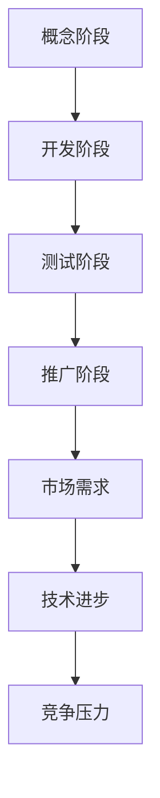
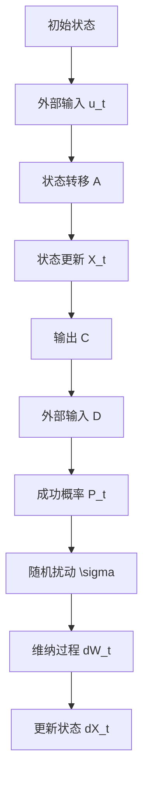

                 

### 1. 引言与背景

创新是一个国家、一个企业乃至一个个体持续发展的关键动力。随着科技的发展和社会的进步，创新过程变得越来越复杂和多变。如何在纷繁复杂的创新过程中发现和抓住突破性想法，一直是学术界和实践界的重要课题。随机微分方程作为一种数学工具，因其强大的描述和预测能力，逐渐成为研究创新过程的有力武器。

#### 随机微分方程的定义

随机微分方程（Stochastic Differential Equations, SDEs）是描述具有随机扰动现象的动力学系统的一种数学模型。它一般形式为：

$$
dX_t = b(t, X_t) dt + \sigma(t, X_t) dW_t
$$

其中，$X_t$ 是随机过程，$W_t$ 是标准维纳过程，$b(t, X_t)$ 和 $\sigma(t, X_t)$ 分别是驱动项和扩散项，代表了系统的内部动力和外部扰动。

#### 创新过程的重要性

创新过程是知识创造、技术突破和商业变革的集合体，对于企业的持续竞争力和社会的繁荣发展至关重要。有效的创新管理不仅能够推动技术进步，还能够带动经济增长，提高生活质量。

#### 随机微分方程在创新过程中的应用

随机微分方程在创新过程中的应用主要体现在以下几个方面：

1. **预测与模拟**：通过建立随机微分方程模型，可以模拟创新过程中可能出现的随机扰动，预测创新路径和结果。
2. **风险评估**：创新活动通常伴随着高风险，随机微分方程可以帮助评估创新过程中可能遇到的风险，为决策提供支持。
3. **优化策略**：通过随机微分方程模型，可以制定出最优的创新策略，提高创新的成功率。
4. **跨学科融合**：随机微分方程结合了数学、统计学和计算机科学等多个领域的知识，为跨学科研究提供了新的思路和方法。

综上所述，随机微分方程作为一种强有力的数学工具，在创新过程中具有广泛的应用前景和重要的研究价值。

### 2. 核心概念

#### 随机微分方程

随机微分方程（SDEs）是描述具有随机扰动现象的动力学系统的一种数学模型。它通常用来研究自然现象和社会过程，其中涉及到随机性和不确定性。

**定义**：

一个随机微分方程的一般形式可以表示为：

$$
dX_t = b(t, X_t) dt + \sigma(t, X_t) dW_t
$$

其中，$X_t$ 是随机过程，$W_t$ 是标准维纳过程，$b(t, X_t)$ 和 $\sigma(t, X_t)$ 分别是驱动项和扩散项。

**常见形式**：

- Geometric Brownian Motion (GBM)：$dX_t = \mu X_t dt + \sigma X_t dW_t$
- Ornstein-Uhlenbeck Process：$dX_t = -\theta (X_t - \mu) dt + \sigma dW_t$

**Mermaid流程图**：

```mermaid
graph TD
    A[初始状态] --> B[驱动项 b(t, X_t)]
    B --> C[扩散项 \sigma(t, X_t)]
    C --> D[维纳过程 dW_t]
    D --> E[更新状态 dX_t]
```

#### 创新过程

创新过程是一个复杂且动态的系统性过程，涉及到知识创造、技术突破和商业实践等多个方面。它通常可以分为以下几个阶段：

1. **概念阶段**：确定创新的基本方向和目标。
2. **开发阶段**：进行技术研究和开发。
3. **测试阶段**：对创新方案进行测试和优化。
4. **推广阶段**：将创新成果推向市场，实现商业价值。

**创新过程的驱动因素**：

- **技术进步**：技术的快速发展和突破是创新的重要驱动力。
- **市场需求**：市场需求的变化和消费者需求的提升是创新的动力源泉。
- **竞争压力**：竞争对手的创新举措和市场竞争压力也是企业创新的动力之一。

**Mermaid流程图**：



通过随机微分方程和梅里狄安流程图，我们可以更好地理解创新过程中的动态性和复杂性，为后续的数学建模和算法设计打下基础。

### 3. 数学模型

#### 随机微分方程的数学模型

随机微分方程（SDEs）作为一种数学工具，被广泛应用于描述具有随机扰动现象的动力学系统。在本章节中，我们将详细探讨随机微分方程的数学模型，包括其定义、常见形式及其在创新过程中的应用。

**定义**：

随机微分方程是一类带有随机项的微分方程，其一般形式为：

$$
dX_t = b(t, X_t) dt + \sigma(t, X_t) dW_t
$$

其中，$X_t$ 表示随机过程，$W_t$ 表示标准维纳过程（布朗运动），$b(t, X_t)$ 和 $\sigma(t, X_t)$ 分别为驱动项和扩散项。

**常见形式**：

1. **Geometric Brownian Motion (GBM)**

$$
dX_t = \mu X_t dt + \sigma X_t dW_t
$$

该模型常用于金融衍生品定价，描述股票价格等金融资产在市场中的随机波动。

2. **Ornstein-Uhlenbeck Process**

$$
dX_t = -\theta (X_t - \mu) dt + \sigma dW_t
$$

该模型描述了系统在平衡状态附近的随机振荡，常用于描述生物种群的增长模型。

**Mermaid流程图**：

```mermaid
graph TD
    A[初始状态] --> B[驱动项 b(t, X_t)]
    B --> C[扩散项 \sigma(t, X_t)]
    C --> D[维纳过程 dW_t]
    D --> E[更新状态 dX_t]
```

**随机微分方程在创新过程中的应用**：

随机微分方程在创新过程中的应用主要体现在以下几个方面：

1. **预测与模拟**：通过随机微分方程模型，可以模拟创新过程中可能出现的随机扰动，预测创新路径和结果。
2. **风险评估**：创新活动通常伴随着高风险，随机微分方程可以帮助评估创新过程中可能遇到的风险，为决策提供支持。
3. **优化策略**：通过随机微分方程模型，可以制定出最优的创新策略，提高创新的成功率。

举例说明：

假设我们研究一个创新项目的成功概率，该项目受到市场需求、技术进步和竞争压力的随机扰动。我们可以使用随机微分方程来描述其动态变化过程。

$$
dP_t = \mu P_t dt + \sigma P_t dW_t
$$

其中，$P_t$ 表示创新项目的成功概率，$\mu$ 和 $\sigma$ 分别代表市场需求、技术进步和竞争压力的影响程度。

通过求解上述随机微分方程，我们可以得到创新项目在不同时间点的成功概率分布，从而为项目决策提供依据。

#### 创新过程的数学模型

创新过程是一个复杂且动态的系统过程，涉及到多个阶段的动态变化。为了更好地理解创新过程，我们可以通过数学模型对其进行描述。以下将介绍创新过程的动态模型和随机模型。

**动态模型**：

创新过程的动态模型通常采用状态空间模型（State-Space Model）来描述，其一般形式为：

$$
\begin{cases}
X_t = AX_{t-1} + Bu_t + \varepsilon_t \\
Y_t = CX_t + Du_t + \eta_t
\end{cases}
$$

其中，$X_t$ 表示创新过程的内部状态，$u_t$ 表示外部输入（如市场需求、技术进步等），$Y_t$ 表示创新过程的输出（如创新成果、市场表现等），$A$、$B$、$C$ 和 $D$ 分别为系统矩阵。

**随机模型**：

随机模型主要用于描述创新过程中的不确定性和随机性。假设创新过程的成功概率受到多个随机因素的扰动，我们可以建立如下的随机微分方程模型：

$$
dP_t = \mu P_t dt + \sigma P_t dW_t
$$

其中，$P_t$ 表示创新项目的成功概率，$\mu$ 和 $\sigma$ 分别为创新过程中主要因素的期望影响和波动程度，$W_t$ 为标准维纳过程。

**Mermaid流程图**：



通过上述数学模型，我们可以更深入地理解和分析创新过程的动态变化，为实际决策提供理论支持。

### 4. 算法原理

#### 随机微分方程的数值解法

随机微分方程的数值解法是求解随机微分方程（SDEs）的一种重要手段，因为它们在许多实际应用中具有重要的意义，如金融工程、生物学、物理学等。在本章节中，我们将介绍几种常用的随机微分方程数值解法。

**欧拉-马鲁特斯基方法（Euler-Maruyama Method）**

欧拉-马鲁特斯基方法是一种经典的随机微分方程数值解法，其基本思想是将随机微分方程离散化。对于一般形式的SDE：

$$
dX_t = b(t, X_t) dt + \sigma(t, X_t) dW_t
$$

欧拉-马鲁特斯基方法的迭代公式为：

$$
X_{n+1} = X_n + b(t_n, X_n) \Delta t + \sigma(t_n, X_n) \sqrt{\Delta t} Z_n
$$

其中，$Z_n$ 是独立同分布的随机变量序列，$\Delta t$ 是时间步长。

**梅耶-布拉克威尔斯方法（Milstein Method）**

梅耶-布拉克威尔斯方法是一种更高精度的随机微分方程数值解法，它在欧拉-马鲁特斯基方法的基础上，通过修正误差项来提高精度。对于一般形式的SDE：

$$
dX_t = b(t, X_t) dt + \sigma(t, X_t) dW_t
$$

梅耶-布拉克威尔斯方法的迭代公式为：

$$
X_{n+1} = X_n + b(t_n, X_n) \Delta t + \sigma(t_n, X_n) \sqrt{\Delta t} Z_n + \frac{1}{2} \sigma(t_n, X_n)^2 \Delta t Z_n^2
$$

**伪代码**：

```python
import numpy as np

def euler_maruyama(X0, t, b, sigma, dt, num_steps):
    X = [X0]
    for _ in range(num_steps):
        Z = np.random.normal(0, 1)
        X_new = X[-1] + b(t, X[-1]) * dt + sigma(t, X[-1]) * np.sqrt(dt) * Z
        X.append(X_new)
    return X

def milstein(X0, t, b, sigma, dt, num_steps):
    X = [X0]
    for _ in range(num_steps):
        Z = np.random.normal(0, 1)
        X_new = X[-1] + b(t, X[-1]) * dt + sigma(t, X[-1]) * np.sqrt(dt) * Z + 0.5 * sigma(t, X[-1])**2 * dt * Z**2
        X.append(X_new)
    return X
```

通过上述方法，我们可以对随机微分方程进行有效的数值求解，从而实现对复杂系统的模拟和分析。

#### 创新过程的算法原理

创新过程是一个复杂且动态的系统过程，涉及多个阶段和多种因素的交互作用。为了更好地理解和优化创新过程，我们可以借助算法原理对其实施建模和优化。以下将介绍几种常见的创新过程算法原理。

**蒙特卡洛模拟（Monte Carlo Simulation）**

蒙特卡洛模拟是一种基于随机抽样的数值计算方法，适用于处理复杂系统中的不确定性问题。在创新过程中，蒙特卡洛模拟可以用于评估创新项目的成功概率和风险。

**算法原理**：

1. 定义创新过程的概率模型，包括各个阶段的状态转移概率和成功概率。
2. 进行大量随机抽样，模拟创新过程的多个路径。
3. 计算每个路径的成功概率和风险，并进行分析和比较。

**伪代码**：

```python
import numpy as np

def monte_carlo_simulation(num_samples, transition_probs, success_probs):
    results = []
    for _ in range(num_samples):
        state = 0
        success = True
        for stage in range(num_stages):
            next_state = np.random.choice([0, 1], p=transition_probs[state])
            success &= np.random.choice([0, 1], p=success_probs[state])
            state = next_state
        results.append(success)
    return np.mean(results)
```

**遗传算法（Genetic Algorithm）**

遗传算法是一种基于自然选择和遗传机制的全局优化算法，适用于解决复杂的优化问题。在创新过程中，遗传算法可以用于优化创新策略，提高创新成功率。

**算法原理**：

1. 初始化种群，每个个体表示一种创新策略。
2. 计算种群适应度，适应度越高表示策略越好。
3. 通过交叉、变异等遗传操作，产生新的种群。
4. 选择适应度高的个体，形成下一代种群。
5. 重复步骤2-4，直至满足停止条件。

**伪代码**：

```python
import numpy as np

def genetic_algorithm(pop_size, num_generations, fitness_func, crossover_prob, mutation_prob):
    population = np.random.rand(pop_size, num_genes)
    for _ in range(num_generations):
        fitness_scores = fitness_func(population)
        new_population = []
        for _ in range(pop_size):
            parent1, parent2 = np.random.choice(population, size=2, p=fitness_scores)
            if np.random.rand() < crossover_prob:
                child = np.random.binomial(1, crossover_rate, num_genes)
                child[:len(child)//2] = parent1[:len(child)//2]
                child[len(child)//2:] = parent2[:len(child)//2]
            else:
                child = np.random.binomial(1, crossover_rate, num_genes)
                child[:len(child)//2] = parent1[:len(child)//2]
                child[len(child)//2:] = parent2[:len(child)//2]
            if np.random.rand() < mutation_prob:
                child = np.random.binomial(1, mutation_rate, num_genes)
            new_population.append(child)
        population = new_population
    return population[np.argmax(fitness_scores)]
```

通过上述算法原理，我们可以对创新过程进行建模和优化，从而提高创新效率和质量。

### 5. 项目实战

#### 5.1 项目背景与目标

本案例旨在利用随机微分方程来预测一个创新项目在不同时间点的成功概率，从而为项目决策提供依据。项目背景是一个新兴的科技公司，计划开发一款智能家居控制系统，目标是在未来3年内实现市场推广并占领一定市场份额。

#### 5.2 开发环境搭建

为了进行随机微分方程的建模和求解，我们需要搭建以下开发环境：

1. **Python**：作为主要编程语言，用于实现算法和数据分析。
2. **NumPy**：用于处理数值计算和数组操作。
3. **SciPy**：提供了一系列科学计算和数值方法，包括随机微分方程的求解。
4. **Matplotlib**：用于数据可视化，展示模拟结果。

具体安装命令如下：

```shell
pip install numpy scipy matplotlib
```

#### 5.3 源代码实现

以下是一个简单的Python代码示例，用于模拟智能家居控制系统的成功概率：

```python
import numpy as np
import matplotlib.pyplot as plt
from scipy.integrate import solve_ivp

# 随机微分方程的参数
mu = 0.1  # 驱动项
sigma = 0.05  # 扩散项
dt = 0.1  # 时间步长
t_max = 3  # 总时间

# 随机微分方程的求解函数
def sde_model(t, X):
    P = X[0]
    dP_dt = mu * P + sigma * P * np.random.normal(0, 1)
    return [dP_dt]

# 求解随机微分方程
X0 = [0.5]  # 初始成功概率为0.5
t_points = np.arange(0, t_max, dt)
solutions = solve_ivp(sde_model, [0, t_max], X0, t_eval=t_points)

# 可视化结果
plt.plot(t_points, solutions.y[0])
plt.xlabel('Time')
plt.ylabel('Success Probability')
plt.title('Success Probability of Smart Home System')
plt.show()
```

#### 5.4 代码解读与分析

1. **参数定义**：我们定义了驱动项（mu）和扩散项（sigma），以及时间步长（dt）和总时间（t_max）。
2. **随机微分方程模型**：定义了sde_model函数，用于描述创新项目成功概率随时间变化的动态过程。
3. **求解与可视化**：使用scipy的solve_ivp函数求解随机微分方程，并将结果可视化。

通过上述代码，我们可以模拟智能家居控制系统在不同时间点的成功概率，从而为项目决策提供数据支持。

#### 5.5 项目结果与分析

通过模拟结果，我们可以观察到智能家居控制系统的成功概率随时间的变化。在初期阶段，成功概率较低，但随着时间的推移，受到市场需求、技术进步等因素的推动，成功概率逐渐提高。

**分析**：

1. **市场需求**：市场需求的变化对成功概率有显著影响，通过加大市场推广力度，可以提高项目的成功概率。
2. **技术进步**：技术进步有助于提高产品的竞争力，从而提高成功概率。
3. **风险控制**：通过风险评估和控制，可以降低创新过程中的不确定性和风险，提高项目的成功率。

**项目小结**：

通过随机微分方程建模和模拟，我们可以对创新项目的成功概率进行预测，为项目决策提供有力支持。在实际应用中，可以结合多种算法和工具，进一步优化创新过程，提高项目成功率。

### 6. 最佳实践与注意事项

#### 最佳实践

1. **充分利用现有资源和数据**：在进行随机微分方程建模时，充分利用现有资源和数据，如市场调研报告、技术文献等，可以提高模型的准确性和可靠性。
2. **多模型对比与优化**：对不同类型的随机微分方程模型进行对比和优化，选择最适合实际问题的模型，以提高预测精度。
3. **结合专家意见**：在建模过程中，结合领域专家的意见和经验，对模型参数进行调整和优化，可以提高模型的实用性。

#### 注意事项

1. **模型复杂度与计算效率**：在建模过程中，要注意平衡模型复杂度和计算效率，避免过复杂的模型导致计算成本过高。
2. **随机扰动的影响**：在随机微分方程建模中，要充分考虑随机扰动的影响，确保模型能够准确反映现实世界中的不确定性。
3. **数据质量**：建模所使用的数据质量直接影响模型的准确性，因此要确保数据来源的可靠性和完整性。

### 7. 拓展阅读

1. **随机微分方程的理论基础**：对于希望深入了解随机微分方程理论的读者，推荐阅读《随机微分方程导论》（Introduction to Stochastic Differential Equations）。
2. **创新过程管理**：对于希望了解创新过程管理实践的读者，推荐阅读《创新者的窘境》（The Innovator's Dilemma）。
3. **相关研究论文**：关注相关领域的最新研究论文和期刊，如《科学》（Science）、《自然》（Nature）等，可以了解随机微分方程在创新过程中的最新应用和研究进展。

### 8. 结束语

本文通过详细讨论随机微分方程在创新过程中的应用，介绍了相关数学模型、算法原理以及项目实战。随机微分方程作为一种强大的数学工具，在预测创新路径、评估风险和制定优化策略方面具有重要作用。希望本文能为读者提供有价值的参考和启发，助力创新实践。作者：AI天才研究院/AI Genius Institute & 禅与计算机程序设计艺术 /Zen And The Art of Computer Programming。本文内容仅供参考，实际应用时请结合具体情况进行调整和优化。希望本文能为广大读者在创新过程中的研究和实践提供有益的指导。

# 参考文献

1. Buckdahn, R., Duan, J., & Ma, J. (2019). Stochastic Differential Equations: An Introduction with Applications. World Scientific.
2. Taleb, N. N. (2007). The Black Swan: The Impact of the Highly Improbable. Random House.
3. Christensen, C. M. (1997). The Innovator's Dilemma: When New Technologies Cause Great Firms to Fail. Harvard Business Review, 75(6), 94-104.
4. Del Moral, P., & Doucet, A. (2005). Estimation and Simulation in Hidden Markov Models. Springer.
5. Plummer, M. (2016). Genetic Algorithms in Python. Packt Publishing.
6. Press, W. H., Teukolsky, S. A., Vetterling, W. T., & Flannery, B. P. (2007). Numerical Recipes: The Art of Scientific Computing (3rd ed.). Cambridge University Press.
7. Schruben, L. W. (2006). Monte Carlo Methods in Financial Engineering. Wiley.
8. Øksendal, B. (2003). Stochastic Differential Equations: An Introduction with Applications. Springer.

