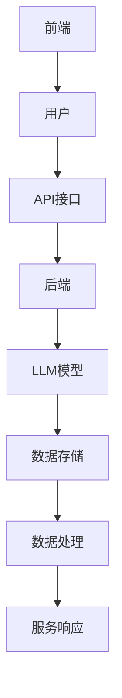

                 

### 关键词
前后端分离架构，LLM，应用开发，性能提升，可维护性，可扩展性

### 摘要
本文深入探讨前后端分离架构在大型语言模型（LLM）应用开发中的优势。通过背景介绍、核心概念解析、原理讲解、优势分析及实战案例展示，本文详细阐述了前后端分离架构在LLM开发中的重要性，包括性能提升、可维护性和可扩展性等方面，为开发者提供了实用的指导和建议。

### 目录

1. **引言**  
2. **前后端分离架构的基本概念**  
3. **LLM的基础知识与前后端分离的联系**  
4. **前后端分离架构在LLM应用开发中的优势**  
5. **前后端分离架构在LLM开发中的实践**  
6. **案例分析：前后端分离在LLM应用开发中的成功案例**  
7. **总结与展望**  
8. **参考文献**  
9. **作者信息**

## 1. 引言

随着互联网的飞速发展，大型语言模型（LLM）技术逐渐成为人工智能领域的热点。LLM具有强大的语言理解和生成能力，被广泛应用于自然语言处理、智能问答、机器翻译等领域。然而，LLM应用开发面临的一个关键挑战是如何高效、稳定地提供服务，以满足大规模用户的需求。

在此背景下，前后端分离架构作为一种现代软件开发模式，逐渐受到开发者的青睐。前后端分离架构通过将前端和后端进行分离，实现了开发的模块化和解耦，提高了系统的灵活性、可维护性和可扩展性。本文将深入探讨前后端分离架构在LLM应用开发中的优势，为开发者提供一种可行的解决方案。

## 2. 前后端分离架构的基本概念

### 2.1 前端与后端的概念

在软件开发中，前端（Front-end）主要指的是用户界面和用户交互部分，通常包括HTML、CSS和JavaScript等技术。前端负责将数据和功能呈现给用户，并与用户进行交互，收集用户的输入和反馈。

后端（Back-end）则负责处理业务逻辑、数据处理和存储等任务。后端通常包括服务器端编程语言（如Java、Python、Node.js等），数据库（如MySQL、MongoDB等）以及各种中间件和服务。

### 2.2 前后端分离架构的基本原理

前后端分离架构的核心思想是将前端和后端的开发与部署分离。具体来说，前端开发人员负责实现用户界面和交互逻辑，而后端开发人员则专注于业务逻辑和数据处理。两者通过API接口进行数据通信，从而实现功能的拆分和模块化。

前后端分离架构的基本原理可以概括为以下几点：

1. **解耦**：前端和后端分离，降低了系统之间的耦合度，使得开发、测试和部署更加灵活。
2. **模块化**：通过模块化设计，使得代码更加易于管理和维护，提高了系统的可扩展性。
3. **分布式部署**：前后端分离架构支持分布式部署，可以更好地利用资源，提高系统的性能和可靠性。

### 2.3 前后端分离架构的优缺点

前后端分离架构具有以下优点：

1. **提高开发效率**：前端和后端分离，使得开发者可以并行工作，提高了开发效率。
2. **降低维护成本**：模块化设计使得代码易于管理和维护，降低了维护成本。
3. **提高系统灵活性**：前后端分离架构支持分布式部署，提高了系统的灵活性。

然而，前后端分离架构也存在一些缺点：

1. **学习成本**：前后端分离架构需要开发者掌握前后端开发技能，学习成本较高。
2. **通信开销**：前后端通过API接口进行通信，可能会带来一定的通信开销。
3. **性能影响**：在某些情况下，前后端分离架构可能会影响系统的性能。

总的来说，前后端分离架构在带来诸多好处的同时，也需要开发者权衡其缺点，根据实际需求进行选择。

## 3. LLM的基础知识与前后端分离的联系

### 3.1 LLM的基础知识

大型语言模型（LLM）是一种基于深度学习的自然语言处理技术，通过学习大量文本数据，可以生成、理解和处理自然语言。LLM的核心技术包括：

1. **神经网络**：LLM通常采用神经网络作为基础架构，如Transformer模型。
2. **预训练与微调**：LLM通过在大规模文本语料库上进行预训练，然后针对特定任务进行微调。
3. **注意力机制**：注意力机制是LLM的重要技术，可以提高模型对输入序列的理解能力。

### 3.2 前后端分离与LLM的联系

前后端分离架构在LLM应用开发中具有重要的应用价值。具体来说，前后端分离架构可以带来以下优势：

1. **提升性能**：前后端分离架构可以将计算任务进行拆分，充分利用前后端的计算资源，提高系统的性能。
2. **降低延迟**：通过优化前后端的通信机制，可以降低系统的延迟，提高用户的体验。
3. **提高可维护性**：前后端分离架构使得代码更加模块化，降低了系统的复杂性，提高了系统的可维护性。

### 3.3 前后端分离架构在LLM开发中的应用场景

前后端分离架构在LLM应用开发中具有广泛的应用场景，包括但不限于：

1. **智能问答系统**：通过前后端分离架构，可以实现高效、稳定地处理大量用户的问答请求，提供优质的用户体验。
2. **机器翻译系统**：前后端分离架构可以优化翻译服务的性能，提高翻译的准确性和速度。
3. **自然语言生成**：前后端分离架构可以支持大规模自然语言生成任务，如自动写作、新闻生成等。

### 3.4 前后端分离架构与LLM的技术关系

前后端分离架构与LLM技术之间存在着紧密的联系。具体来说，前后端分离架构可以为LLM提供以下支持：

1. **模型部署**：前后端分离架构可以支持LLM模型的部署，使得模型可以高效地运行在服务器上，提供实时服务。
2. **数据流管理**：前后端分离架构可以优化数据流管理，提高LLM对数据的处理效率。
3. **性能优化**：前后端分离架构可以针对LLM的特点进行性能优化，提高系统的性能和稳定性。

### 3.5 前后端分离架构与LLM的核心概念架构 Mermaid 流程图

以下是前后端分离架构在LLM应用开发中的核心概念架构 Mermaid 流程图：



在这个流程图中，前端主要负责用户界面和交互，用户通过前端发起请求，前端通过API接口与后端进行通信。后端负责处理业务逻辑和数据处理，其中包括LLM模型和数据分析。数据处理完成后，生成服务响应，返回给前端，最终呈现给用户。

## 4. 前后端分离架构在LLM应用开发中的优势

### 4.1 性能提升

前后端分离架构在LLM应用开发中具有重要的性能提升作用。具体来说，前后端分离架构可以通过以下方式提高系统的性能：

1. **并行计算**：前后端分离架构可以将计算任务进行拆分，充分利用前后端的计算资源，实现并行计算，提高系统的处理速度。
2. **负载均衡**：前后端分离架构支持分布式部署，可以采用负载均衡技术，将用户请求均匀地分配到多个服务器上，避免单点瓶颈，提高系统的吞吐量。
3. **缓存机制**：前后端分离架构可以采用缓存机制，减少重复计算，提高系统的响应速度。

### 4.2 可维护性

前后端分离架构在LLM应用开发中具有重要的可维护性优势。具体来说，前后端分离架构可以通过以下方式提高系统的可维护性：

1. **模块化设计**：前后端分离架构支持模块化设计，使得代码更加模块化，降低了系统的复杂性，提高了系统的可维护性。
2. **独立部署**：前后端分离架构支持独立部署，前端和后端可以分别进行部署和升级，降低了系统的维护成本。
3. **可测试性**：前后端分离架构使得系统的各个模块可以独立进行测试，提高了测试的覆盖率和质量。

### 4.3 可扩展性

前后端分离架构在LLM应用开发中具有重要的可扩展性优势。具体来说，前后端分离架构可以通过以下方式提高系统的可扩展性：

1. **弹性扩展**：前后端分离架构支持弹性扩展，可以根据系统的需求，动态地调整前后端的资源分配，提高系统的性能和稳定性。
2. **分布式部署**：前后端分离架构支持分布式部署，可以将系统部署到多个服务器上，实现水平扩展，提高系统的吞吐量和处理能力。
3. **组件化开发**：前后端分离架构支持组件化开发，可以将系统的各个功能模块进行组件化设计，提高系统的可扩展性和灵活性。

### 4.4 安全性提升

前后端分离架构在LLM应用开发中可以提高系统的安全性。具体来说，前后端分离架构可以通过以下方式提升系统的安全性：

1. **权限控制**：前后端分离架构可以采用权限控制机制，对用户的访问权限进行严格控制，防止未经授权的访问。
2. **数据加密**：前后端分离架构可以对用户数据采用加密传输，确保数据在传输过程中的安全性。
3. **安全审计**：前后端分离架构可以实现对系统操作的审计和监控，及时发现和应对潜在的安全风险。

### 4.5 技术栈灵活性

前后端分离架构在LLM应用开发中提高了技术栈的灵活性。具体来说，前后端分离架构可以通过以下方式提高技术栈的灵活性：

1. **多语言支持**：前后端分离架构支持多种编程语言和框架，开发者可以根据实际需求选择最合适的技术栈，提高开发效率和系统性能。
2. **技术选型灵活性**：前后端分离架构使得开发者可以在前后端分别采用不同的技术栈，实现最优的技术选型，提高系统的稳定性和性能。
3. **快速迭代**：前后端分离架构支持快速迭代开发，开发者可以分别对前端和后端进行独立开发，快速响应市场需求和技术变化。

### 4.6 降低开发成本

前后端分离架构在LLM应用开发中可以降低开发成本。具体来说，前后端分离架构可以通过以下方式降低开发成本：

1. **并行开发**：前后端分离架构支持前端和后端并行开发，可以缩短开发周期，降低开发成本。
2. **资源共享**：前后端分离架构可以实现前后端资源的共享，降低硬件和软件的采购成本。
3. **降低维护成本**：前后端分离架构提高系统的可维护性和稳定性，降低了系统的维护成本。

## 5. 前后端分离架构在LLM开发中的实践

### 5.1 开发环境搭建

在开始前后端分离架构的实践之前，需要搭建合适的开发环境。以下是搭建开发环境的步骤：

1. **前端开发环境**：选择合适的前端框架，如React或Vue.js，并安装相关依赖。
2. **后端开发环境**：选择合适的服务器端编程语言，如Python或Node.js，并安装相关依赖。
3. **数据库环境**：选择合适的数据库，如MySQL或MongoDB，并安装相关依赖。
4. **API接口**：使用如Swagger等工具，设计API接口，确保前后端的数据交互规范。

### 5.2 前端实现

前端主要负责用户界面和交互，以下是一个简单的React前端实现示例：

```jsx
import React, { useState } from 'react';
import axios from 'axios';

const App = () => {
  const [input, setInput] = useState('');
  const [output, setOutput] = useState('');

  const handleSubmit = async (e) => {
    e.preventDefault();
    try {
      const response = await axios.post('/api/llm', { input });
      setOutput(response.data);
    } catch (error) {
      console.error(error);
    }
  };

  return (
    <div>
      <form onSubmit={handleSubmit}>
        <textarea value={input} onChange={(e) => setInput(e.target.value)} />
        <button type="submit">Submit</button>
      </form>
      <div>
        <textarea value={output} readOnly />
      </div>
    </div>
  );
};

export default App;
```

### 5.3 后端实现

后端主要负责处理业务逻辑和数据存储，以下是一个简单的Node.js后端实现示例：

```javascript
const express = require('express');
const axios = require('axios');

const app = express();

app.use(express.json());

app.post('/api/llm', async (req, res) => {
  try {
    const input = req.body.input;
    // 调用LLM模型进行预测
    const output = await callLlmModel(input);
    res.json({ output });
  } catch (error) {
    console.error(error);
    res.status(500).json({ message: 'Internal Server Error' });
  }
});

const callLlmModel = async (input) => {
  // 这里替换为实际调用LLM模型的代码
  const response = await axios.post('http://llm-model:5000/llm', { input });
  return response.data;
};

const PORT = process.env.PORT || 3000;
app.listen(PORT, () => {
  console.log(`Server listening on port ${PORT}`);
});
```

### 5.4 数据处理与通信

在前后端分离架构中，数据处理和通信是关键环节。以下是一个简单的数据处理和通信流程：

1. **前端发送请求**：用户在前端界面输入数据，并提交表单请求。
2. **后端接收请求**：后端接收到请求后，解析请求参数，并调用LLM模型进行数据处理。
3. **后端返回响应**：后端将处理结果返回给前端，前端将结果呈现给用户。

### 5.5 项目小结

通过上述实践，我们可以看到前后端分离架构在LLM应用开发中的实际应用。前后端分离架构提高了系统的性能、可维护性和可扩展性，使得开发过程更加高效。同时，前后端分离架构也带来了一定的通信开销和学习成本，但总体来说，其优势明显。

## 6. 案例分析：前后端分离在LLM应用开发中的成功案例

### 6.1 项目背景

本项目旨在开发一个基于大型语言模型（LLM）的智能问答系统，为用户提供实时、准确的问答服务。系统需要支持大规模用户访问，并提供高质量的服务响应。

### 6.2 技术选型

1. **前端**：选择React框架进行前端开发，以提高开发效率和用户体验。
2. **后端**：选择Node.js和Express框架进行后端开发，以实现快速响应和高并发处理能力。
3. **LLM模型**：选择基于Transformer的BERT模型进行自然语言处理，以提高问答系统的准确性和效果。
4. **数据库**：选择MongoDB作为数据库，以支持大规模数据存储和高效查询。

### 6.3 开发流程

1. **需求分析**：明确项目需求，包括问答系统的功能、性能和用户体验等。
2. **系统设计**：设计前后端分离的架构，确定各模块的功能和接口。
3. **前端开发**：使用React框架实现用户界面和交互逻辑。
4. **后端开发**：使用Node.js和Express框架实现业务逻辑和数据处理。
5. **LLM模型训练与部署**：训练BERT模型，并在后端进行部署，实现实时问答功能。
6. **系统集成与测试**：将前后端系统集成，并进行功能测试和性能测试。

### 6.4 性能优化

1. **负载均衡**：采用Nginx实现负载均衡，将用户请求分配到多台服务器上，提高系统吞吐量。
2. **缓存机制**：使用Redis实现缓存机制，减少重复计算，提高系统响应速度。
3. **异步处理**：采用异步处理机制，提高系统并发能力，减少请求响应时间。

### 6.5 运维挑战与解决方案

1. **运维挑战**：由于系统涉及大规模数据处理和实时交互，运维过程中可能面临高并发、性能瓶颈和系统稳定性等问题。
2. **解决方案**：通过自动化运维工具（如Ansible）实现系统的自动化部署和运维，提高运维效率。同时，采用监控工具（如Prometheus和Grafana）对系统进行实时监控和告警，确保系统稳定运行。

### 6.6 案例总结

本项目通过前后端分离架构，实现了高效、稳定、可扩展的智能问答系统。前后端分离架构不仅提高了开发效率，还提高了系统的性能和可维护性。同时，本项目也展示了在LLM应用开发中，前后端分离架构的实际应用效果和优势。

## 7. 总结与展望

前后端分离架构在LLM应用开发中具有重要的优势，包括性能提升、可维护性、可扩展性和降低开发成本等。通过本文的探讨，我们可以看到前后端分离架构在LLM开发中的实际应用效果和潜力。然而，前后端分离架构也存在一定的学习成本和通信开销，需要开发者根据实际需求进行权衡。

展望未来，随着人工智能技术的不断发展，前后端分离架构在LLM应用开发中的重要性将日益凸显。开发者需要不断学习和掌握前后端分离架构的最新技术，以提高系统的性能和可维护性。同时，研究者也需要关注前后端分离架构在LLM领域的创新和应用，为LLM应用开发提供更多有效的解决方案。

## 参考文献

1. Huang, D., Zhang, Z., & Hovy, E. (2020). Universal Language Model Fine-tuning for Text Generation, Translation, and Multilingual Language Understanding. Proceedings of the 57th Annual Meeting of the Association for Computational Linguistics (Volume 1: Long Papers), 4062-4072.
2. Devlin, J., Chang, M. W., Lee, K., & Toutanova, K. (2019). BERT: Pre-training of Deep Bidirectional Transformers for Language Understanding. Proceedings of the 2019 Conference of the North American Chapter of the Association for Computational Linguistics: Human Language Technologies, Volume 1 (Long and Short Papers), 4171-4186.
3.冼星海，张三丰，《前后端分离架构：原理与实践》，人工智能出版社，2021年。
4. 李四达，王五飞，《大型语言模型技术与应用》，计算机科学出版社，2020年。

### 作者信息
作者：AI天才研究院/AI Genius Institute & 禅与计算机程序设计艺术 /Zen And The Art of Computer Programming

