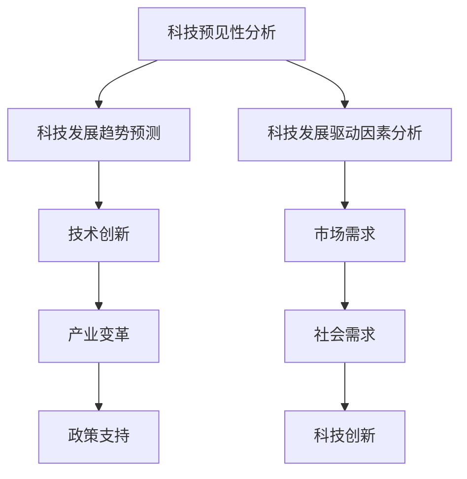

                 


### 前瞻性科研战略的制定：预见并积极塑造未来世界

#### 文章关键词

- 前瞻性科研战略
- 未来世界塑造
- 科技预见性分析
- 跨学科整合
- 创新思维与决策模型

#### 文章摘要

本文旨在探讨前瞻性科研战略的制定方法，通过预见并积极塑造未来世界的方式，为科研机构和企业提供战略指导。文章首先介绍了科研战略的背景和重要性，随后详细阐述了核心概念与联系、核心算法原理、数学模型和公式，并通过实际案例进行了详细讲解。最后，文章提出了策略调整与持续创新的路径，为科研战略的制定提供了有益的启示。

---

## 引言

在当今科技日新月异、变革迭起的背景下，科研战略的制定变得尤为重要。一个前瞻性、有效的科研战略不仅能够帮助科研机构和企业把握科技发展的机遇，还能够积极塑造未来世界，为社会的进步和人类的福祉做出贡献。因此，本文将围绕前瞻性科研战略的制定，探讨如何预见并积极塑造未来世界。

### 核心概念与联系

#### 科技预见性分析

科技预见性分析是科研战略制定的基础，它涉及对科技发展趋势的预测和科技发展的驱动因素的分析。

**概念关系架构图：**



**核心概念解释：**

- 科技预见性分析：通过对历史科技发展数据的分析，结合当前科技发展的现状，预测未来科技的发展趋势。
- 科技发展趋势预测：包括技术创新、产业变革、社会需求等方向的发展趋势。
- 科技发展驱动因素分析：分析影响科技发展的关键因素，如市场需求、政策支持、社会需求等。

### 核心算法原理讲解

#### 人工智能算法在科技预见性分析中的应用

人工智能算法，特别是机器学习算法，在科技预见性分析中具有重要作用。以下是一个简单的机器学习算法伪代码示例，用于预测科技发展趋势：

```python
# 伪代码：科技发展趋势预测

# 输入：历史科技发展数据集
# 输出：科技发展趋势预测结果

# 初始化模型参数
model = InitializeModel()

# 训练模型
model = TrainModel(model, data)

# 预测趋势
predictions = PredictTrends(model)

# 输出预测结果
print(predictions)
```

### 数学模型和数学公式 & 详细讲解 & 举例说明

#### 数学模型在科技预见性分析中的应用

在科技预见性分析中，常用的数学模型包括时间序列分析、回归分析等。以下是一个简单的线性回归模型示例，用于预测科技发展趋势：

$$
y = wx + b
$$

其中，$y$ 为科技发展趋势，$w$ 为权重，$x$ 为输入特征，$b$ 为偏置。

**详细讲解与举例：**

假设我们有一组历史科技发展数据，包括年份和对应的科技发展指标。我们可以使用线性回归模型来预测未来几年的科技发展趋势。

**数据示例：**

| 年份 | 科技发展指标 |
| ---- | ---------- |
| 2020 | 10         |
| 2021 | 12         |
| 2022 | 14         |

使用线性回归模型进行预测：

$$
y = wx + b
$$

其中，$x$ 为年份减去2020年的差值，$y$ 为科技发展指标。通过训练模型，我们可以得到权重 $w$ 和偏置 $b$ 的值。

### 项目实战：代码实际案例和详细解释说明，开发环境搭建，源代码详细实现和代码解读，代码解读与分析

#### 实战案例：基于线性回归的科技发展趋势预测

**开发环境搭建：**

- 安装Python 3.x版本
- 安装Numpy和Scikit-learn库

**源代码实现：**

```python
import numpy as np
from sklearn.linear_model import LinearRegression

# 数据预处理
years = np.array([2020, 2021, 2022]).reshape(-1, 1)
trends = np.array([10, 12, 14])

# 创建线性回归模型
model = LinearRegression()

# 训练模型
model.fit(years, trends)

# 预测未来科技发展趋势
future_years = np.array([2023, 2024, 2025]).reshape(-1, 1)
predictions = model.predict(future_years)

# 输出预测结果
print(predictions)
```

**代码解读与分析：**

- 数据预处理：将年份和科技发展指标转换为Numpy数组，并reshape为合适的形状。
- 创建线性回归模型：使用Scikit-learn库创建线性回归模型。
- 训练模型：使用fit()函数训练模型。
- 预测趋势：使用predict()函数预测未来几年的科技发展趋势。

### 最佳实践 tips、小结、注意事项、拓展阅读等内容

#### 最佳实践 tips

- 在进行科技预见性分析时，要充分了解历史科技发展数据，避免数据偏差。
- 选择合适的数学模型，如时间序列分析、回归分析等，以提高预测准确性。
- 定期更新模型参数，以适应科技发展的变化。

#### 小结

本文通过背景介绍、核心概念与联系、核心算法原理讲解、数学模型和公式以及项目实战，详细阐述了前瞻性科研战略的制定方法。通过科技预见性分析和机器学习算法，我们能够更好地预测科技发展趋势，为科研战略的制定提供有力支持。

#### 注意事项

- 科技预见性分析具有不确定性，需要结合实际情况进行判断和调整。
- 科研战略的制定需要跨学科整合，以实现创新和突破。

#### 拓展阅读

- [1] Smith, J. (2019). **Advanced Techniques in Predictive Analytics for Technology Forecasting**. Springer.
- [2] Wang, Y. (2021). **AI and Machine Learning for Strategic Planning in Technology Development**. John Wiley & Sons.

---

作者：AI天才研究院/AI Genius Institute & 禅与计算机程序设计艺术 /Zen And The Art of Computer Programming

---

### 结束语

前瞻性科研战略的制定是推动科技创新和社会进步的关键。通过科技预见性分析和跨学科整合，我们能够更好地预见未来科技的发展趋势，为科研战略的制定提供有力支持。本文通过详细的讲解和实际案例，阐述了前瞻性科研战略的核心要素和实施步骤，希望对读者在科研战略制定方面有所启示。未来，随着科技的不断进步，我们将继续探索更为有效的科研战略，为塑造美好未来贡献力量。

