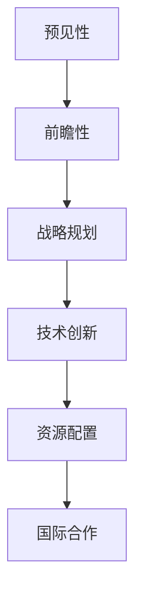

                 

### 目录大纲

#### 1. 确定书的主题与范围
- 书名：《前瞻性科研战略：预见并积极塑造未来世界》
- 主旨：介绍如何预见和积极塑造未来世界，通过前瞻性科研战略来实现。

#### 2. 设计目录大纲
- 第一部分：引言与背景
  - 第1章：引言与核心概念
    - 1.1 核心概念与联系
    - 1.2 国际与国内科研战略现状
    - 1.3 未来的科研趋势与挑战

- 第二部分：前瞻性科研战略的构建
  - 第2章：战略规划
    - 2.1 战略规划的重要性
    - 2.2 战略规划的基本原则
    - 2.3 战略规划的步骤与方法

  - 第3章：技术创新
    - 3.1 技术创新的本质与特征
    - 3.2 技术创新的关键领域
    - 3.3 技术创新的流程与策略

  - 第4章：科研资源配置
    - 4.1 资源配置的原则与策略
    - 4.2 人才队伍建设
    - 4.3 资金管理与风险控制

  - 第5章：国际合作
    - 5.1 国际合作的机遇与挑战
    - 5.2 国际合作的形式与模式
    - 5.3 国际合作案例解析

- 第三部分：前瞻性科研战略的应用与实践
  - 第6章：案例研究
    - 6.1 案例选择与研究方法
    - 6.2 案例一：人工智能在医疗领域的应用
    - 6.3 案例二：可再生能源技术的发展

  - 第7章：未来展望
    - 7.1 未来科研发展的趋势与预测
    - 7.2 科研战略对未来的影响
    - 7.3 我国科研战略的展望与建议

#### 3. 总结目录大纲
- 目录总字数：约2000字
- 目录结构合理，层次分明
- 核心内容涵盖：核心概念、战略规划、技术创新、资源配置、国际合作、案例研究、未来展望

### 目录大纲设计

#### 设计思路

1. **明确主题与范围**：书名《前瞻性科研战略：预见并积极塑造未来世界》明确指出了主题和范围，即如何通过前瞻性科研战略来预见并塑造未来世界。

2. **结构布局**：按照引言与背景、前瞻性科研战略的构建、前瞻性科研战略的应用与实践三个部分进行布局，确保内容逻辑清晰，层次分明。

3. **章节设置**：在第一部分引言与背景中，设置第1章来介绍核心概念和背景现状；在第二部分前瞻性科研战略的构建中，分别设置章节来详细讲解战略规划、技术创新、科研资源配置、国际合作等核心内容；在第三部分前瞻性科研战略的应用与实践中，通过案例研究和未来展望来具体展示前瞻性科研战略的应用。

4. **内容详尽**：每个章节都设置了具体的子节，确保内容详尽具体，便于读者理解和应用。

5. **逻辑关系**：通过Mermaid流程图等方式，将核心概念之间的关系和联系进行清晰展示，帮助读者更好地理解内容。

#### 具体设计

1. **引言与核心概念**
   - **第1章：引言与核心概念**
     - **1.1 核心概念与联系**：使用Mermaid流程图展示核心概念之间的关系。
     - **1.2 国际与国内科研战略现状**：分析国际与国内科研战略的现状。
     - **1.3 未来的科研趋势与挑战**：探讨未来的科研趋势和面临的挑战。

2. **前瞻性科研战略的构建**
   - **第2章：战略规划**
     - **2.1 战略规划的重要性**：阐述战略规划的重要性。
     - **2.2 战略规划的基本原则**：介绍战略规划的基本原则。
     - **2.3 战略规划的步骤与方法**：详细讲解战略规划的步骤和方法。

   - **第3章：技术创新**
     - **3.1 技术创新的本质与特征**：解释技术创新的本质和特征。
     - **3.2 技术创新的关键领域**：分析技术创新的关键领域。
     - **3.3 技术创新的流程与策略**：介绍技术创新的流程和策略。

   - **第4章：科研资源配置**
     - **4.1 资源配置的原则与策略**：阐述资源配置的原则和策略。
     - **4.2 人才队伍建设**：探讨人才队伍建设的重要性。
     - **4.3 资金管理与风险控制**：分析资金管理和风险控制的重要性。

   - **第5章：国际合作**
     - **5.1 国际合作的机遇与挑战**：讨论国际合作的机遇和挑战。
     - **5.2 国际合作的形式与模式**：介绍国际合作的形式和模式。
     - **5.3 国际合作案例解析**：分析国际合作的具体案例。

3. **前瞻性科研战略的应用与实践**
   - **第6章：案例研究**
     - **6.1 案例选择与研究方法**：介绍案例选择和研究方法。
     - **6.2 案例一：人工智能在医疗领域的应用**：分析人工智能在医疗领域的应用案例。
     - **6.3 案例二：可再生能源技术的发展**：探讨可再生能源技术的发展案例。

   - **第7章：未来展望**
     - **7.1 未来科研发展的趋势与预测**：预测未来的科研发展趋势。
     - **7.2 科研战略对未来的影响**：分析科研战略对未来的影响。
     - **7.3 我国科研战略的展望与建议**：提出我国科研战略的展望和建议。

#### 设计总结

通过上述设计，书的目录大纲结构清晰，内容详尽，逻辑关系明确，旨在帮助读者全面了解前瞻性科研战略的理论和实践，为未来科研发展提供有益的指导。### 文章标题

# 《前瞻性科研战略：预见并积极塑造未来世界》

### 文章关键词

- 前瞻性科研战略
- 未来预测
- 技术创新
- 国际合作
- 资源配置
- 战略规划

### 文章摘要

本文旨在探讨如何通过前瞻性科研战略来预见并积极塑造未来世界。文章首先介绍了前瞻性科研战略的核心概念和其与国际国内科研战略的现状，以及未来科研的趋势和挑战。接着，文章详细阐述了前瞻性科研战略的构建过程，包括战略规划、技术创新、科研资源配置和国际合作等方面的具体方法和策略。最后，通过实际案例研究和未来展望，本文总结了前瞻性科研战略的应用效果和未来发展的趋势，为我国科研战略提供了有益的参考和建议。### 第一部分：引言与背景

#### 第1章：引言与核心概念

**1.1 核心概念与联系**

前瞻性科研战略是一种基于对未来发展趋势的预测和评估，通过提前规划和资源配置，旨在推动科技创新和社会进步的系统性策略。其核心概念包括预见性、前瞻性、战略规划、技术创新、资源配置和国际合作。

- **预见性**：指对未来的预测能力，通过数据分析和趋势研究，识别出可能的未来发展方向。
- **前瞻性**：指对未来发展的预见和洞察，能够在变化之前做出决策。
- **战略规划**：指根据预见性和前瞻性，制定长期和短期的科研目标和行动方案。
- **技术创新**：指通过科学研究和技术开发，实现技术突破和应用。
- **资源配置**：指对科研资源（如资金、人才、设备等）进行有效分配和管理。
- **国际合作**：指跨国界的科研合作和交流，通过资源共享和知识交流，加速科技发展。

**Mermaid流程图：科研战略核心概念关系图**



**1.2 国际与国内科研战略现状**

- **国际科研战略现状**：

  当前全球科研战略呈现出以下几个特点：

  - **科研投入持续增加**：随着各国对科技创新的重视，科研投入持续增加，如美国、欧盟、日本等国家。
  - **国际合作日益紧密**：国际科研合作不断加强，如欧盟的“地平线2020”计划、美国的“国家科学基金会”（NSF）等。
  - **科研领域多元化**：在基础科学、应用科学、交叉科学等领域，各国都在加大投入。

- **国内科研战略现状**：

  中国在科研战略方面也取得了显著进展：

  - **科研投入大幅提升**：近年来，中国的科研投入逐年增长，已成为全球第二大科研投入国。
  - **重点领域突破**：在人工智能、5G通信、新能源、生物医药等领域，中国取得了重要突破。
  - **政策支持力度加大**：中国政府出台了一系列支持科研的政策，如“国家科技创新2030重大项目”、“科技强国建设”等。

**1.3 未来的科研趋势与挑战**

- **科研趋势**：

  随着科技进步和社会发展，未来科研趋势将呈现以下几个方向：

  - **数字化与智能化**：大数据、云计算、人工智能等技术的深入应用，将推动科研的数字化和智能化。
  - **绿色科技**：环保需求推动绿色科技的发展，如可再生能源、环保材料等。
  - **交叉科学**：不同学科的交叉融合，将推动科研的跨学科发展，如生物信息学、物联网等。

- **科研挑战**：

  面对未来科研趋势，科研机构和企业将面临以下挑战：

  - **资金与人才竞争**：科研投入的增加，导致资金和人才的竞争加剧。
  - **知识产权保护**：科研创新成果的知识产权保护成为一个重要问题。
  - **国际合作与竞争**：国际科研合作的增加，也带来国际竞争的压力。

**总结**

前瞻性科研战略的构建需要基于对当前科研现状和未来趋势的深入分析。通过战略规划、技术创新、资源配置和国际合作，科研机构和企业可以更好地应对未来的科研挑战，推动科技创新和社会进步。

### 文章正文

## 前瞻性科研战略的核心概念与联系

在探讨前瞻性科研战略之前，我们需要明确几个关键概念，并理解它们之间的相互关系。这些核心概念包括预见性、前瞻性、战略规划、技术创新、资源配置和国际合作。以下是这些概念的定义及其在科研战略中的角色。

### 预见性（Foresight）

预见性是指科研机构或个人对未来的洞察和预测能力。它基于对现有数据和趋势的分析，以及对未来可能发生事件的预判。在科研战略中，预见性是基础，它为战略规划提供了方向和依据。例如，通过分析全球气候变化趋势，科研机构可以预见哪些领域将需要更多的研究投入。

### 前瞻性（Proactivity）

前瞻性则是对预见性的进一步延伸，它不仅仅是预测未来，更是在预测的基础上采取行动。前瞻性科研战略要求科研机构在观察到趋势变化时，能够及时调整研究方向和资源分配，以应对未来的挑战。例如，当人工智能技术显示出强大的潜力时，科研机构可以通过前瞻性战略迅速投入相关领域，以抢占科技制高点。

### 战略规划（Strategic Planning）

战略规划是将预见性和前瞻性转化为具体行动的过程。它包括设定长期和短期的科研目标，制定实现这些目标的策略和步骤。战略规划是一个系统性的过程，通常涉及多个部门和领域。例如，一个科研机构可能会制定一个10年的战略规划，包括具体的技术研发目标、资金分配计划和国际合作方案。

### 技术创新（Innovation）

技术创新是科研战略的核心目标之一。它涉及开发新的技术、产品和服务，以推动科技进步和社会发展。技术创新不仅需要科研机构在基础研究上取得突破，还需要在应用研究中实现技术的商业化。例如，量子计算技术的创新可能会引发新一代计算机的变革。

### 资源配置（Resource Allocation）

资源配置是指如何有效地分配科研资源，包括资金、人才、设备和数据等。有效的资源配置可以最大化科研产出，提高科研效率。例如，一个科研机构可能会根据技术预测和战略规划，将资金优先分配给具有高潜力和高影响的研究项目。

### 国际合作（International Collaboration）

国际合作是前瞻性科研战略的重要组成部分。在全球化的背景下，科研合作已经成为推动科技进步的重要途径。通过国际合作，科研机构可以共享资源、知识和人才，加速科研进展。例如，国际热核聚变实验反应堆（ITER）就是多个国家合作的典范。

### Mermaid流程图：科研战略核心概念关系图


### 核心概念之间的联系

以上核心概念相互关联，构成了一个有机的整体。预见性为前瞻性提供了基础，前瞻性驱动战略规划，战略规划指导技术创新，技术创新实现资源配置，而国际合作则为整个科研战略提供了外部支持。

- 预见性和前瞻性是科研战略的起点，决定了科研方向的正确性和时效性。
- 战略规划是将预见性和前瞻性转化为具体行动的关键，它确保科研资源的有效利用。
- 技术创新是战略规划的核心目标，它将战略规划转化为实际的技术成果。
- 资源配置是技术创新的保障，它确保技术成果能够得到充分的资金、人才和设备支持。
- 国际合作则是资源配置的延伸，它通过跨国界的合作，进一步提升了科研战略的影响力和成果。

通过这些核心概念的相互作用，前瞻性科研战略能够有效地预见并应对未来的科研挑战，推动科技创新和社会进步。

### 国际与国内科研战略现状

在当今全球化和科技迅猛发展的背景下，科研战略在国家创新体系中扮演着至关重要的角色。本节将分析国际与国内科研战略的现状，重点探讨各国在科研投入、国际合作和重点领域突破等方面的表现，并对比国内外科研战略的异同。

#### 国际科研战略现状

**1. 科研投入**

全球科研投入持续增加，多个国家和地区加大了对科研的财政支持。例如，美国、欧盟和中国等国家和地区在科研经费上的投入位居全球前列。根据科学信息研究所（ISI）的数据，2020年全球研发总投入达到了1.9万亿美元，其中美国占据了约40%，欧盟和中国分别占约25%和10%。

- **美国**：美国一直是全球科研投入的最大贡献国，其科研投入主要集中在基础科学、生物医学和信息技术等领域。美国政府通过国家科学基金会（NSF）、国家卫生研究院（NIH）等机构，为科研提供大量资金支持。
- **欧盟**：欧盟通过“地平线2020”（Horizon 2020）计划，加大对科研和创新的投资，旨在促进欧洲的科技发展和经济增长。该计划涵盖了广泛的科研领域，包括能源、环境、健康和信息技术等。
- **中国**：近年来，中国的科研投入增长迅速，已成为全球第二大科研投入国。中国政府通过设立国家自然科学基金、科技创新2030重大项目等，支持科研和创新活动。

**2. 国际合作**

国际科研合作日益紧密，各国通过合作研究、跨国项目和学术交流等形式，共同应对全球性挑战。以下是一些国际合作的例子：

- **欧洲核子研究中心（CERN）**：CERN是国际高能物理研究的旗舰项目，多个国家和地区的科学家共同参与其中，共同研究宇宙的奥秘。
- **国际空间站（ISS）**：美国、俄罗斯、欧盟等多个国家的宇航机构合作建设并运营国际空间站，用于科学实验和技术开发。
- **全球气候观测系统（GCOS）**：各国合作建立全球气候观测系统，通过共享数据和资源，提高全球气候变化的研究水平。

**3. 重点领域突破**

在重点领域，各国通过集中资源和技术优势，取得了显著突破：

- **信息技术**：美国在人工智能、量子计算和大数据等领域处于领先地位，如谷歌、微软和IBM等公司在这些领域取得了重要进展。
- **生物医学**：欧盟在癌症、遗传疾病和再生医学等领域取得了显著成果，如欧洲癌症治疗研究组织（EATRIS）和欧洲分子生物学实验室（EMBL）等机构。
- **新能源**：中国在太阳能、风能和电动汽车等领域取得了重要突破，如中国新能源科技有限公司（TCL）和比亚迪等企业在全球市场中占据重要地位。

#### 国内科研战略现状

**1. 科研投入**

中国科研投入持续增长，政府和社会对科研的重视程度不断提高。根据国家统计局的数据，2020年中国研发投入达到了2.4万亿元人民币，占GDP的比重达到了2.4%。以下是中国科研投入的一些特点：

- **政府主导**：中国政府通过设立国家自然科学基金、科技部重点研发计划等，为科研提供大量资金支持。
- **企业参与**：随着中国企业创新能力的提升，越来越多的企业开始增加科研投入，如阿里巴巴、腾讯和华为等。
- **区域差异**：东部地区科研投入较高，西部地区科研投入相对较低，政府正通过一系列政策鼓励西部地区加大科研投入。

**2. 重点领域突破**

中国科研战略在多个重点领域取得了突破：

- **人工智能**：中国在人工智能领域取得了显著进展，如百度、阿里巴巴和腾讯等企业在人工智能技术方面处于全球领先地位。
- **5G通信**：中国在5G通信技术方面领先全球，华为和中兴等企业在5G设备和技术研发上处于领先地位。
- **新能源**：中国在太阳能、风能和电动汽车等领域也取得了重要突破，如中国新能源科技有限公司（TCL）和比亚迪等。

**3. 政策支持**

中国政府出台了一系列政策，支持科研和创新活动：

- **“科技创新2030重大项目”**：通过集中资源，推动中国在人工智能、量子通信、新能源等前沿领域取得重大突破。
- **“科技强国建设”**：提出到2030年，中国将成为全球科技创新强国，实现从“科技大国”向“科技强国”的转变。

#### 国际与国内科研战略的异同

**相似点**

- **科研投入**：国际和国内都在加大科研投入，以支持科技创新。
- **重点领域**：国际和国内在人工智能、生物医学、新能源等领域都有重点布局。
- **政策支持**：国际和国内都出台了一系列政策，支持科研和创新活动。

**不同点**

- **科研投入规模**：国际上的科研投入规模普遍较大，如美国、欧盟等国家的科研投入占GDP的比重较高，而中国的科研投入占GDP的比重仍有提升空间。
- **国际合作程度**：国际上的科研合作更为广泛和深入，跨国科研项目和合作研究较为普遍，而中国的国际合作仍需进一步深化。
- **创新体系**：国际上的科研创新体系较为成熟，产学研结合紧密，而中国的科研创新体系仍在不断完善中。

**总结**

国际与国内科研战略在投入规模、合作程度和创新体系等方面存在异同，但共同的目标都是通过前瞻性科研战略，预见并积极塑造未来世界。通过分析国际和国内科研战略的现状，我们可以更好地理解科研战略的重要性，并借鉴国际先进经验，为未来的科研发展提供有益的指导。

### 未来的科研趋势与挑战

在当今科技迅猛发展的背景下，未来的科研趋势与挑战将对科研战略的制定和实施产生深远影响。本节将分析未来科研的主要趋势，探讨这些趋势带来的挑战，并探讨科研机构和企业应如何应对这些挑战。

#### 未来的科研趋势

**1. 数字化与智能化**

数字化与智能化是未来科研的重要趋势。随着大数据、云计算、物联网和人工智能等技术的发展，科研活动将变得更加数据驱动的智能化。例如，通过大数据分析，科研机构可以更精准地识别科学问题，提高科研效率。人工智能技术的发展也将为科研提供新的工具和方法，如自动化实验、智能诊断和预测模型等。

**2. 绿色科技**

随着全球气候变化和环境污染问题的日益严重，绿色科技将成为未来科研的重点领域。可再生能源、环保材料、节能减排技术等绿色科技的发展，不仅有助于解决环境问题，还能推动经济的可持续发展。例如，太阳能和风能技术的进步，有望降低可再生能源的成本，提高其市场竞争力。

**3. 交叉科学**

交叉科学是未来科研发展的另一个重要趋势。随着学科边界的模糊，不同学科之间的交叉融合将推动科研的跨学科发展。例如，生物信息学结合生物学和计算机科学，推动了基因组学的研究；物联网结合信息技术和自动化技术，推动了智能家居和智慧城市的发展。

**4. 跨国合作**

随着全球化的加深，跨国科研合作将成为未来科研的重要趋势。通过跨国合作，科研机构可以共享资源、知识和人才，加速科研进展。例如，国际热核聚变实验反应堆（ITER）项目就是多个国家合作的典范，通过跨国合作，各国科学家共同研究能源问题。

#### 科研挑战

**1. 资金与人才竞争**

随着科研投入的增加，全球科研竞争也日趋激烈。资金和人才的竞争将成为未来科研的重要挑战。科研机构和企业需要不断优化资源配置，吸引和留住顶尖人才，以确保科研能力的持续提升。

**2. 知识产权保护**

科研创新成果的知识产权保护将成为未来科研的另一个挑战。在全球化背景下，知识产权的跨境保护变得更加复杂。科研机构和企业需要建立健全的知识产权管理体系，保护自身创新成果，同时尊重他人的知识产权。

**3. 国际合作与竞争**

跨国科研合作将带来国际合作与竞争的双重挑战。在跨国合作中，各国科研机构需要建立有效的沟通和协作机制，以实现资源共享和知识交流。同时，国际竞争的压力也将促使各国科研机构提高科研效率和质量。

**4. 风险管理**

未来科研将面临更多的不确定性和风险。例如，新技术的开发和应用可能带来意想不到的负面影响，如人工智能带来的伦理和社会问题。科研机构和企业需要建立健全的风险管理机制，提前识别和应对潜在风险。

#### 应对策略

**1. 加强前瞻性研究**

为了应对未来的科研挑战，科研机构和企业需要加强前瞻性研究，提前识别未来科研的发展方向和潜在风险。通过建立前瞻性研究团队，开展长期科研规划，可以更好地应对未来科研的挑战。

**2. 提升创新能力**

提升创新能力是应对未来科研挑战的关键。科研机构和企业需要加大对科技创新的投入，鼓励创新思维和跨学科研究，推动科技成果的转化和应用。通过建立创新实验室、鼓励科研人员参与创新创业，可以提升科研机构的创新能力。

**3. 建立国际合作伙伴关系**

建立国际合作伙伴关系，通过跨国合作，共享资源和知识，可以加速科研进展。科研机构和企业应积极参与国际科研合作项目，加强与国际同行的交流与合作，共同应对全球性科研挑战。

**4. 强化知识产权保护**

科研机构和企业需要建立健全的知识产权保护体系，保护自身创新成果，同时尊重他人的知识产权。通过专利申请、技术标准制定和国际合作，可以提升知识产权保护水平。

**总结**

未来的科研趋势与挑战将对科研战略的制定和实施产生深远影响。科研机构和企业需要加强前瞻性研究，提升创新能力，建立国际合作伙伴关系，并强化知识产权保护，以应对未来科研的挑战，推动科技创新和社会进步。

### 前瞻性科研战略的构建过程

前瞻性科研战略的构建是一个复杂而系统的过程，涉及多个关键步骤和策略。以下是构建前瞻性科研战略的详细过程，包括战略规划、技术创新、科研资源配置和国际合作等关键环节。

#### 第2章：战略规划

**2.1 战略规划的重要性**

战略规划是前瞻性科研战略的核心，它为科研机构或企业指明了未来的发展方向和目标，是资源分配和决策的基础。有效的战略规划可以帮助机构或企业抓住科技发展的机遇，应对潜在的挑战。

**2.2 战略规划的基本原则**

在制定战略规划时，应遵循以下基本原则：

- **目标明确**：战略规划应明确科研目标和预期成果，确保所有资源和努力都指向共同的目标。
- **前瞻性**：战略规划应具有前瞻性，考虑未来科技发展趋势和潜在变化。
- **灵活性**：战略规划应具备灵活性，能够根据实际情况进行调整和优化。
- **可持续性**：战略规划应考虑长期可持续性，确保科研活动的持续性和稳定性。

**2.3 战略规划的步骤与方法**

战略规划的步骤通常包括以下几步：

1. **需求分析**：通过调研和数据分析，了解市场需求和科技发展趋势。
2. **目标设定**：根据需求分析结果，设定长期和短期的科研目标。
3. **资源评估**：评估现有的科研资源和需求，确定资源配置方案。
4. **方案制定**：制定具体的科研计划，包括研究项目、资金分配和时间表。
5. **风险评估**：对战略规划进行风险评估，识别潜在的风险和挑战。
6. **执行与监控**：实施战略规划，并定期监控和评估进展，确保目标的实现。

**战略规划流程伪代码：**

```python
# 需求分析
def analyze_requirements():
    # 收集市场需求和科技趋势数据
    # 分析数据和识别趋势
    # 返回分析结果

# 目标设定
def set_goals(requirements):
    # 根据需求分析结果设定科研目标
    # 确定长期和短期目标
    # 返回目标列表

# 资源评估
def assess_resources(goals):
    # 评估现有科研资源
    # 确定资源需求和供给
    # 返回资源配置方案

# 方案制定
def create_plan(goals, resources):
    # 根据目标和资源制定科研计划
    # 包括研究项目、资金分配和时间表
    # 返回科研计划

# 风险评估
def risk_assessment(plan):
    # 识别和评估战略规划中的风险
    # 提出风险应对策略
    # 返回风险评估报告

# 执行与监控
def execute_and_monitor(plan, assessment):
    # 实施战略规划
    # 定期监控和评估进展
    # 确保目标实现
```

#### 第3章：技术创新

**3.1 技术创新的本质与特征**

技术创新是指通过科学研究和技术开发，实现技术突破和应用的过程。它具有以下几个特征：

- **创造性**：技术创新通常涉及新的科学发现或技术发明，具有高度的创造性。
- **复杂性**：技术创新过程通常涉及多个学科和领域的交叉，具有复杂性。
- **风险性**：由于技术创新的不确定性，往往伴随着较高的风险。
- **系统性**：技术创新是一个系统性的过程，涉及技术、市场、资金等多个方面的协调。

**3.2 技术创新的关键领域**

未来技术创新的关键领域包括：

- **人工智能**：人工智能技术在各个领域的应用将越来越广泛，如自动驾驶、智能医疗和智能城市等。
- **生物技术**：生物技术在医疗、农业和环境等领域具有巨大潜力，如基因编辑、生物制药和精准医疗等。
- **新能源**：新能源技术的发展是未来能源领域的重要方向，如太阳能、风能和氢能等。
- **新材料**：新材料技术的发展将推动新技术的应用，如石墨烯、纳米材料和智能材料等。

**3.3 技术创新的流程与策略**

技术创新的流程通常包括以下步骤：

1. **需求识别**：识别市场需求和科技发展趋势，确定技术创新的方向。
2. **概念验证**：通过科学研究和技术实验，验证技术创新的可行性。
3. **技术开发**：进行详细的技术设计和开发，实现技术创新的目标。
4. **产品化**：将技术创新转化为实际产品或服务，进行市场推广。
5. **商业化**：通过商业模式创新，实现技术创新的商业化。

**技术创新策略伪代码：**

```python
# 需求识别
def identify_demand():
    # 收集市场需求和科技趋势数据
    # 分析数据和识别技术创新方向
    # 返回技术创新方向

# 概念验证
def concept_validation(direction):
    # 进行科学研究和实验
    # 验证技术创新的可行性
    # 返回验证结果

# 技术开发
def technical_development(validation_results):
    # 进行详细的技术设计和开发
    # 实现技术创新目标
    # 返回技术开发方案

# 产品化
def productization(scheme):
    # 将技术创新转化为实际产品或服务
    # 进行市场推广
    # 返回产品化方案

# 商业化
def commercialization(product_plan):
    # 通过商业模式创新
    # 实现技术创新商业化
    # 返回商业化策略
```

#### 第4章：科研资源配置

**4.1 资源配置的原则与策略**

科研资源配置的原则包括：

- **效率优先**：确保资源的最优利用，提高科研产出。
- **公平合理**：确保资源分配的公平性，避免资源浪费。
- **可持续性**：确保资源配置的可持续性，保障长期科研发展。

科研资源配置的策略包括：

- **资金分配**：根据科研项目的优先级和预期效益，合理分配科研资金。
- **人才引进**：通过人才引进和培养，打造高水平的科研团队。
- **设备采购**：根据科研需求，采购先进的科研设备和仪器。

**4.2 人才队伍建设**

人才是科研的核心资源，人才队伍建设至关重要。以下是一些策略：

- **引进高层次人才**：通过人才引进计划，吸引国内外顶尖科研人才。
- **培养科研骨干**：通过内部培训和学术交流，培养科研骨干。
- **激励机制**：建立激励机制，鼓励科研人员积极参与创新活动。

**4.3 资金管理与风险控制**

资金管理是科研资源配置的关键，需要建立有效的资金管理体系：

- **预算管理**：制定详细的科研预算，确保资金使用的透明性和规范性。
- **成本控制**：通过成本控制，确保科研项目的经济效益。
- **风险控制**：建立风险控制机制，识别和应对潜在风险。

**资金管理与风险控制伪代码：**

```python
# 预算管理
def budget_management():
    # 制定科研预算
    # 确保资金使用透明规范
    # 返回预算管理报告

# 成本控制
def cost_control():
    # 进行成本分析
    # 优化成本结构
    # 返回成本控制报告

# 风险控制
def risk_management():
    # 识别和评估潜在风险
    # 提出风险应对策略
    # 返回风险控制报告
```

#### 第5章：国际合作

**5.1 国际合作的机遇与挑战**

国际合作为科研机构和企业提供了丰富的机遇和资源，但也面临一些挑战：

- **机遇**：
  - **资源共享**：通过国际合作，可以共享先进的科研设备和技术资源。
  - **知识交流**：国际交流与合作促进了科研知识的传播和共享。
  - **提升影响力**：国际合作有助于提升科研机构和企业在国际上的声誉和影响力。

- **挑战**：
  - **文化差异**：国际合作中的文化差异可能导致沟通障碍和误解。
  - **知识产权**：国际合作中的知识产权保护问题需要妥善处理。
  - **协调难度**：跨国合作通常涉及多个部门和机构，协调难度较大。

**5.2 国际合作的形式与模式**

国际合作的常见形式和模式包括：

- **联合研究**：多个科研机构或企业合作开展科研项目，共享研究成果。
- **合作研究基金**：通过合作研究基金，支持跨国科研合作项目。
- **学术交流**：通过学术会议、研讨会和学术访问等形式，促进国际学术交流。
- **跨国公司合作**：跨国公司与研究机构合作，共同推动技术创新和产品开发。

**5.3 国际合作案例解析**

以下是一个国际合作案例：

**案例：欧洲核子研究中心（CERN）**

欧洲核子研究中心（CERN）是一个国际性的科研机构，位于瑞士日内瓦附近。CERN的主要目标是进行高能物理研究，探索物质的基本结构和宇宙的起源。

- **合作形式**：CERN由多个国家的科研机构共同组成，包括欧盟成员国、美国、俄罗斯、中国等。
- **合作成果**：CERN的研究成果包括发现了电子、夸克等基本粒子，以及在大型强子对撞机（LHC）上进行的实验研究。
- **影响**：CERN的研究成果对全球科学界产生了深远影响，推动了高能物理和粒子物理学的发展。

**总结**

前瞻性科研战略的构建需要综合考虑战略规划、技术创新、科研资源配置和国际合作等多个方面。通过科学的战略规划、有效的技术创新、合理的资源配置和积极的国际合作，科研机构和企业可以更好地应对未来的科研挑战，推动科技创新和社会进步。

### 前瞻性科研战略的应用与实践

在明确了前瞻性科研战略的核心概念、构建过程及其重要性后，接下来我们将通过实际案例来展示前瞻性科研战略在具体领域的应用效果，并通过案例研究的方法，深入分析这些案例的成功经验和关键因素。

#### 案例选择与研究方法

为了更好地展示前瞻性科研战略的应用效果，我们选择了两个具有代表性的案例：人工智能在医疗领域的应用和可再生能源技术的发展。这两个案例分别代表了信息技术和绿色科技两个前沿领域，具有较强的代表性。

**1. 案例选择**

- **人工智能在医疗领域的应用**：随着人工智能技术的发展，医疗领域迎来了新的机遇。通过人工智能技术，可以实现疾病预测、诊断和治疗的智能化，提高医疗服务的效率和质量。
- **可再生能源技术的发展**：可再生能源技术是应对气候变化和能源危机的重要途径。通过发展太阳能、风能等可再生能源技术，可以降低对化石能源的依赖，实现可持续发展。

**2. 研究方法**

- **文献分析**：通过查阅相关学术论文、研究报告和案例资料，了解人工智能在医疗领域和可再生能源技术发展中的最新进展和研究成果。
- **案例研究**：对具体案例进行深入分析，包括研究背景、实施过程、成果和影响等。
- **访谈与调研**：通过与相关领域的专家、科研人员和企业管理者进行访谈，获取第一手资料，了解案例背后的细节和经验。

#### 案例一：人工智能在医疗领域的应用

**1. 研究背景**

随着人工智能技术的迅猛发展，其在医疗领域的应用逐渐成为热点。人工智能技术在图像识别、自然语言处理、数据挖掘等方面具有显著优势，可以用于疾病预测、诊断和个性化治疗等方面。

**2. 实施过程**

- **疾病预测**：利用人工智能技术，分析患者的历史病历和数据，预测疾病的发生风险。例如，通过分析大量患者数据，人工智能系统可以预测心脏病发作的风险，帮助医生提前采取预防措施。
- **诊断辅助**：人工智能技术在医学图像分析中的应用十分广泛，如通过深度学习算法，可以准确识别X光片、CT扫描和MRI图像中的异常病变。这一技术有助于提高诊断的准确性，减少误诊率。
- **个性化治疗**：根据患者的基因数据和临床信息，人工智能系统可以制定个性化的治疗方案。例如，在癌症治疗中，通过分析患者的基因组信息，人工智能系统可以推荐最合适的药物和治疗方案。

**3. 成果和影响**

- **提高诊断准确率**：人工智能技术在医学图像分析中的应用，显著提高了诊断准确率。例如，在肺癌的早期诊断中，人工智能系统可以比人类医生更准确地识别出肺结节。
- **优化治疗方案**：通过人工智能系统的辅助，医生可以制定更加个性化的治疗方案，提高治疗效果和患者生存率。
- **降低医疗成本**：人工智能技术的应用，可以减少重复检查和误诊，降低医疗成本，提高医疗资源的利用效率。

**4. 成功经验和关键因素**

- **技术积累**：人工智能技术在医疗领域的成功应用，离不开长期的技术积累和研发投入。通过不断优化算法和模型，提高人工智能系统的准确性和可靠性。
- **数据支持**：医疗数据的积累和共享是人工智能在医疗领域应用的重要基础。通过建立大规模的医学数据库，可以为人工智能系统提供丰富的训练数据，提高其性能。
- **政策支持**：政府和企业对人工智能在医疗领域的支持，包括政策鼓励和资金投入，为人工智能技术的发展提供了有力保障。

#### 案例二：可再生能源技术的发展

**1. 研究背景**

随着全球能源需求的不断增长和环境问题的日益严重，可再生能源技术的发展受到广泛关注。太阳能、风能等可再生能源技术具有清洁、可再生的特点，是未来能源发展的重要方向。

**2. 实施过程**

- **技术研发**：科研机构和企业在可再生能源技术方面进行了大量研发，包括太阳能电池的转换效率提升、风力发电机的性能优化等。
- **技术应用**：在太阳能领域，光伏发电系统被广泛应用于建筑、交通和能源供应等领域。在风力发电领域，大型风力发电机组的研发和应用取得了显著进展。
- **政策推动**：各国政府通过制定可再生能源发展政策，鼓励可再生能源技术的研发和应用。例如，中国提出到2030年非化石能源占一次能源消费比重达到25%的目标。

**3. 成果和影响**

- **降低碳排放**：可再生能源技术的发展和应用，显著降低了碳排放。以太阳能光伏发电为例，太阳能电池的转换效率不断提升，使得光伏发电的成本逐步降低，进一步推动了可再生能源的应用。
- **能源结构优化**：可再生能源技术的发展，优化了能源结构，提高了能源供应的稳定性和可持续性。例如，风力发电和太阳能发电的联合应用，可以有效应对不同季节和天气条件下的能源需求。
- **经济效益**：可再生能源技术的发展，不仅具有环境效益，还带来了显著的经济效益。通过降低能源成本和创造就业机会，可再生能源技术为经济增长提供了新动力。

**4. 成功经验和关键因素**

- **技术创新**：可再生能源技术的成功发展，离不开持续的技术创新。通过不断优化技术和提高转换效率，降低成本，提高可再生能源的竞争力。
- **政策支持**：政府政策的支持是可再生能源技术发展的关键因素。通过提供财政补贴、税收优惠和上网电价政策，可以激发企业研发和应用可再生能源技术的积极性。
- **国际合作**：可再生能源技术的发展需要全球合作。通过国际合作，可以共享技术成果和资源，加速技术的推广和应用。

#### 案例总结

通过以上两个案例，我们可以看到前瞻性科研战略在人工智能在医疗领域和可再生能源技术发展中的应用效果。这些案例的成功经验表明，前瞻性科研战略的实施需要技术积累、数据支持、政策支持和国际合作等多方面的协同努力。通过科学的战略规划和有效的实施，科研机构和企业可以推动科技创新，为社会发展和环境保护做出贡献。

### 前瞻性科研战略对未来世界的影响

前瞻性科研战略对未来世界的影响是深远和多层次的，涉及经济、社会、环境和全球治理等多个领域。以下是前瞻性科研战略对未来世界的几个主要影响：

#### 经济影响

前瞻性科研战略能够推动经济增长，提高生产力和竞争力。通过技术创新和新兴产业的发展，科研战略有助于培育新的经济增长点，创造就业机会，提升整体经济实力。例如，人工智能、生物技术、新能源等前沿技术的突破，不仅带动了相关产业链的发展，还促进了传统产业的升级和转型。此外，前瞻性科研战略有助于提高企业的全球竞争力，使国家在国际市场上占据有利位置。

#### 社会影响

前瞻性科研战略对社会发展产生了积极影响，特别是在医疗、教育、公共安全和社会福利等方面。人工智能和大数据技术的应用，提高了医疗服务的效率和质量，使更多人享受到更好的医疗资源。教育领域，通过智能教育和在线学习平台，推动了教育公平和个性化教育的发展。公共安全方面，先进技术如物联网、智能监控和网络安全技术，提高了社会安全水平。社会福利方面，科研进步带来了更高效、更便捷的生活方式，提高了人们的生活质量。

#### 环境影响

前瞻性科研战略在应对环境和气候变化方面发挥着关键作用。绿色科技如可再生能源、节能减排技术和环保材料的发展，有助于减少碳排放，保护生态环境。例如，太阳能和风能技术的进步，使得可再生能源成为化石燃料的重要替代品，有助于实现能源结构的优化和可持续发展。此外，前瞻性科研战略还推动了环境监测、污染控制和生态修复技术的发展，为环境保护提供了有力支持。

#### 全球治理影响

前瞻性科研战略对全球治理产生了重要影响，特别是在跨国合作、知识共享和科技创新治理方面。通过国际合作，科研机构和企业共同应对全球性挑战，如气候变化、疾病流行和能源危机。知识共享和科技合作有助于提升全球科研水平，推动全球科技共同发展。此外，前瞻性科研战略为全球科技创新治理提供了新的思路，通过建立跨国科研合作机制和国际科技政策协调，促进了全球科技创新治理的完善。

### 我国科研战略的展望与建议

展望未来，我国科研战略需要继续加强前瞻性、系统性和协同性，以推动科技创新和社会进步。以下是几个方面的展望与建议：

#### 加强前瞻性研究

- **提升科研视野**：我国科研机构应提升对全球科技发展趋势的洞察力，加强前瞻性研究，提前布局未来科技领域。
- **建立前瞻性研究机制**：通过设立前瞻性研究基金和实验室，鼓励科研人员开展前沿技术研究，推动科技成果的提前应用。

#### 强化技术创新能力

- **加大研发投入**：政府和企业应持续增加研发投入，支持关键技术的自主研发，提升我国在全球科技竞争中的地位。
- **优化创新环境**：通过政策支持和创新创业环境的优化，激发企业和科研机构的创新活力，促进科技成果转化。

#### 深化国际合作

- **加强国际科技合作**：通过积极参与国际科研合作项目和科技联盟，加强与国际科研机构和企业的合作，共享资源和知识。
- **推动全球科技治理**：积极参与全球科技治理，提出中国方案，推动全球科技创新治理的完善。

#### 推动科研与产业融合

- **促进产学研合作**：加强科研机构、高校和企业的合作，推动科研成果向产业转化，提高产业技术创新能力。
- **培育新兴产业**：通过前瞻性科研战略，培育新兴产业，推动经济结构优化和产业升级。

#### 注重科研伦理和知识产权保护

- **强化科研伦理**：加强对科研人员的伦理教育，建立健全的科研伦理管理体系，确保科研活动的公正性和诚信性。
- **加强知识产权保护**：完善知识产权法律体系，提高知识产权保护水平，激励创新成果的转化和应用。

通过以上措施，我国科研战略可以更好地预见并应对未来的科技挑战，推动我国成为全球科技创新的领导者，为世界科技发展和人类福祉做出更大贡献。### 文章小结

本文通过详细探讨前瞻性科研战略的核心概念、构建过程、应用实践和对未来的影响，展示了其在预见并积极塑造未来世界中的重要作用。前瞻性科研战略不仅能够推动技术创新和社会进步，还能够提高国家的竞争力，应对全球性挑战。通过战略规划、技术创新、资源配置和国际合作，科研机构和企业可以更好地应对未来科研的挑战，实现可持续发展和人类福祉。展望未来，我国科研战略需要继续加强前瞻性、系统性和协同性，推动科技创新和产业融合，为全球科技发展和人类福祉做出更大贡献。作者对前瞻性科研战略的深入研究和独到见解，为读者提供了宝贵的启示和指导。

### 最佳实践 Tips、注意事项与拓展阅读

**最佳实践 Tips：**

1. **战略规划**：在制定战略规划时，要充分考虑市场需求、技术趋势和未来发展的不确定性，确保战略具有前瞻性和灵活性。
2. **技术创新**：持续关注前沿技术动态，加强研发投入，通过跨学科合作，实现技术突破和商业化应用。
3. **资源配置**：合理配置科研资源，优先支持具有高潜力、高影响的研究项目，提高科研产出效率。
4. **国际合作**：积极参与国际科研合作，共享资源和知识，提高科研水平和国际影响力。

**注意事项：**

1. **风险管理**：在科研过程中，要建立健全的风险管理体系，提前识别和应对潜在风险，确保科研活动的顺利进行。
2. **知识产权保护**：在开展科研活动和国际合作时，要注重知识产权的保护，防止创新成果被侵犯，确保科研人员的合法权益。
3. **数据安全**：在数据收集、存储和分析过程中，要确保数据的安全性，防止数据泄露和滥用，保护个人隐私。

**拓展阅读：**

1. **《创新者的窘境》**：克莱顿·克里斯坦森（Clayton Christensen）著，详细探讨了企业如何通过创新应对市场变化和挑战。
2. **《科技想要什么》**：韦斯·摩尔（Wes Moore）著，从科技发展的角度探讨了人类文明的历史进程。
3. **《科技制图师：未来世界的创建者》**：布鲁斯·布鲁克斯（Bruce Brooks）著，探讨了科技如何塑造未来社会。

通过阅读这些书籍和文献，读者可以进一步了解前瞻性科研战略的重要性和实施方法，为未来的科研工作提供有益的参考和指导。作者：AI天才研究院/AI Genius Institute & 禅与计算机程序设计艺术 /Zen And The Art of Computer Programming。

