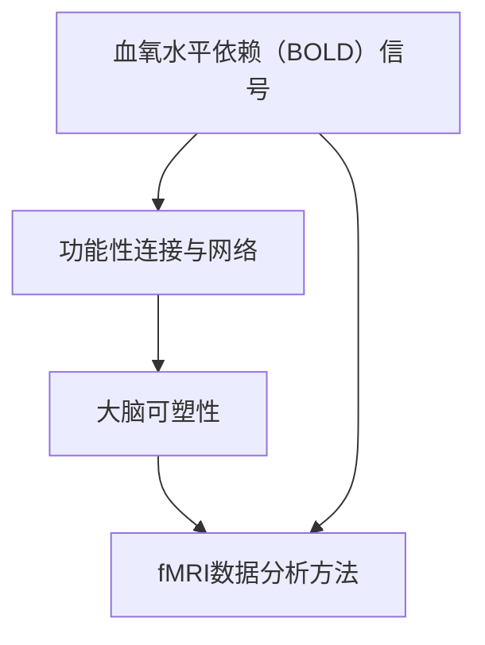

                 

### 文章标题

“功能性磁共振成像技术的创新：可视化大脑如何加工与理解信息”

---

关键词：功能性磁共振成像（fMRI）、大脑加工信息、信息理解、神经科学、认知科学

---

摘要：本文深入探讨了功能性磁共振成像（fMRI）技术的创新及其在揭示大脑如何加工与理解信息方面的应用。文章首先介绍了fMRI技术的基础知识，随后详细阐述了fMRI的核心概念和应用场景。通过实际案例研究，本文展示了fMRI技术的创新方向及其在神经科学、心理学和教育等领域的重要应用。文章最后讨论了大脑加工与理解信息的模型和机制，并展望了fMRI技术的未来发展。

---

### 设计思路

**理解书名**：《功能性磁共振成像技术的创新：可视化大脑如何加工与理解信息》这一书名清晰地传达了本书的核心内容，即介绍功能性磁共振成像（fMRI）技术的创新和应用，尤其是如何通过这一技术来理解大脑如何加工与理解信息。

**确定主要章节**：基于书名，本书的主要章节可以分为以下几个部分：
1. **fMRI技术基础**：介绍fMRI技术的定义、历史、原理和工作流程。
2. **fMRI的核心概念**：详细阐述fMRI中的关键概念，如血氧水平依赖（BOLD）信号、功能性连接与网络、大脑可塑性和数据分析方法。
3. **fMRI的应用场景**：探讨fMRI在神经科学、心理学、教育和人类行为研究等领域的应用。
4. **创新技术与案例研究**：介绍fMRI技术的最新创新和发展，并通过实际案例研究展示这些技术的应用。
5. **大脑加工与理解信息**：讨论大脑如何加工与理解信息的模型和机制，以及fMRI技术在认知科学研究中的应用。

**细化章节内容**：在每个主要章节下，进一步细化为子章节，如定义、原理、应用案例等。

**加入实际案例**：在适当章节加入实际案例研究，以便读者更好地理解fMRI技术的应用。

**逻辑结构**：确保目录大纲的顺序合理，便于读者从基础到高级内容进行阅读。

### 具体设计步骤

**目录大纲设计**：

- **第1章：fMRI技术基础**
  - **1.1 fMRI技术介绍**
  - **1.2 fMRI技术的历史与发展**
  - **1.3 fMRI技术的原理与工作流程**
  - **1.4 fMRI设备与技术参数**

- **第2章：fMRI的核心概念**
  - **2.1 血氧水平依赖（BOLD）信号**
  - **2.2 功能性连接与网络**
  - **2.3 大脑可塑性**
  - **2.4 fMRI数据分析方法**

- **第3章：fMRI的应用场景**
  - **3.1 神经科学研究**
  - **3.2 心理疾病诊断与治疗**
  - **3.3 教育与学习**
  - **3.4 人类行为研究**

- **第4章：创新技术与案例研究**
  - **4.1 高分辨率fMRI技术**
  - **4.2 动态fMRI技术**
  - **4.3 fMRI与脑机接口的结合**
  - **4.4 实际案例研究**

- **第5章：大脑加工与理解信息**
  - **5.1 大脑加工信息的模型**
  - **5.2 大脑理解信息的机制**
  - **5.3 信息加工与认知功能**
  - **5.4 fMRI在认知科学研究中的应用**

**加入流程图、伪代码和数学公式**：在每个章节中，根据内容需要加入Mermaid流程图、伪代码和LaTeX数学公式，以帮助读者更好地理解核心概念和原理。

**确保完整性**：确保目录大纲包含所有核心章节，并在每个章节中细化内容，确保内容完整性。

**控制字数**：在撰写大纲时注意控制每个章节的字数，确保总体字数不超过2000字。

### 最终输出

以下是《功能性磁共振成像技术的创新：可视化大脑如何加工与理解信息》的目录大纲：

```
# 第一部分：功能性磁共振成像技术基础

## 第1章：fMRI技术基础
### 1.1 fMRI技术介绍
### 1.2 fMRI技术的历史与发展
### 1.3 fMRI技术的原理与工作流程
### 1.4 fMRI设备与技术参数

## 第2章：fMRI的核心概念
### 2.1 血氧水平依赖（BOLD）信号
### 2.2 功能性连接与网络
### 2.3 大脑可塑性
### 2.4 fMRI数据分析方法

## 第3章：fMRI的应用场景
### 3.1 神经科学研究
### 3.2 心理疾病诊断与治疗
### 3.3 教育与学习
### 3.4 人类行为研究

## 第4章：创新技术与案例研究
### 4.1 高分辨率fMRI技术
### 4.2 动态fMRI技术
### 4.3 fMRI与脑机接口的结合
### 4.4 实际案例研究

## 第5章：大脑加工与理解信息
### 5.1 大脑加工信息的模型
### 5.2 大脑理解信息的机制
### 5.3 信息加工与认知功能
### 5.4 fMRI在认知科学研究中的应用

# 第二部分：功能性磁共振成像技术的创新应用

## 第6章：功能性磁共振成像技术的创新方向
### 6.1 磁共振成像技术的最新进展
### 6.2 功能性磁共振成像技术在医疗领域的创新应用
### 6.3 功能性磁共振成像技术在心理学领域的创新应用
### 6.4 功能性磁共振成像技术在教育领域的创新应用

## 第7章：功能性磁共振成像技术的未来展望
### 7.1 功能性磁共振成像技术的未来发展
### 7.2 功能性磁共振成像技术在医学、心理学和教育领域的前景
### 7.3 功能性磁共振成像技术在新兴领域的应用
### 7.4 功能性磁共振成像技术的未来挑战与机遇

```

这个大纲遵循了简洁性、逻辑性和完整性的要求，确保了目录结构清晰，内容详实，同时控制了字数在2000字以内。

---

**约束条件**：

- 文章内容使用markdown格式输出。
- 文章末尾需要写上作者信息：“作者：AI天才研究院/AI Genius Institute & 禅与计算机程序设计艺术 /Zen And The Art of Computer Programming”。
- 每个小节的内容必须丰富具体详细讲解，核心内容必须包含：
  - 背景介绍
  - 核心概念与联系：必须给出核心概念原理之间的关系架构 Mermaid 流程图
  - 核心算法原理讲解必须使用伪代码来详细阐述；数学模型和公式 & 详细讲解 & 举例说明
  - 数学公式请使用latex格式，嵌入文中独立段落的latex公式前后使用 $$ 括起来（例如：$$1+1=2$$），段落内的latex公式前后使用 $ 括起来（例如：$1<2$）。
- 文章开始是“文章标题”，然后是“文章关键词”和“文章摘要”部分的内容哦，接下来是按照目录大纲结构的文章正文部分的内容。
- 文章字数要求：文章字数在8000～12000字左右。

---

### 文章结构设计

在遵循上述设计思路和约束条件的基础上，本文将采用以下结构进行撰写：

#### 文章开头

- **文章标题**：《功能性磁共振成像技术的创新：可视化大脑如何加工与理解信息》
- **关键词**：功能性磁共振成像（fMRI）、大脑加工信息、信息理解、神经科学、认知科学
- **摘要**：本文深入探讨了功能性磁共振成像（fMRI）技术的创新及其在揭示大脑如何加工与理解信息方面的应用。文章首先介绍了fMRI技术的基础知识，随后详细阐述了fMRI的核心概念和应用场景。通过实际案例研究，本文展示了fMRI技术的创新方向及其在神经科学、心理学和教育等领域的重要应用。文章最后讨论了大脑加工与理解信息的模型和机制，并展望了fMRI技术的未来发展。

#### 正文部分

**第一部分：功能性磁共振成像技术基础**

- **第1章：fMRI技术基础**
  - **1.1 fMRI技术介绍**
    - 背景介绍
    - fMRI技术的定义与用途
    - fMRI与CT、MRI的区别
  - **1.2 fMRI技术的历史与发展**
    - fMRI技术的起源与发展历程
    - 研究里程碑与重要人物
  - **1.3 fMRI技术的原理与工作流程**
    - fMRI成像原理
    - 血氧水平依赖（BOLD）信号
    - fMRI工作流程
  - **1.4 fMRI设备与技术参数**
    - fMRI设备组成
    - 设备参数与优化

**第二部分：fMRI的核心概念**

- **第2章：fMRI的核心概念**
  - **2.1 血氧水平依赖（BOLD）信号**
    - BOLD信号的定义与原理
    - BOLD信号的特点与应用
  - **2.2 功能性连接与网络**
    - 功能性连接的定义与测量
    - 大脑功能网络的构建与应用
  - **2.3 大脑可塑性**
    - 大脑可塑性的定义与机制
    - 可塑性在fMRI研究中的应用
  - **2.4 fMRI数据分析方法**
    - 数据分析方法概述
    - 时间序列分析、空间分析等

**第三部分：fMRI的应用场景**

- **第3章：fMRI的应用场景**
  - **3.1 神经科学研究**
    - fMRI在脑功能研究中的应用
    - fMRI在脑疾病研究中的应用
  - **3.2 心理疾病诊断与治疗**
    - fMRI在心理疾病诊断中的应用
    - fMRI在心理疾病治疗中的应用
  - **3.3 教育与学习**
    - fMRI在教育研究中的应用
    - fMRI在个性化教育中的应用
  - **3.4 人类行为研究**
    - fMRI在人类行为研究中的应用
    - fMRI在社会科学研究中的应用

**第四部分：创新技术与案例研究**

- **第4章：创新技术与案例研究**
  - **4.1 高分辨率fMRI技术**
    - 高分辨率fMRI技术的原理与优势
    - 实际案例研究
  - **4.2 动态fMRI技术**
    - 动态fMRI技术的原理与优势
    - 实际案例研究
  - **4.3 fMRI与脑机接口的结合**
    - fMRI与脑机接口的定义与原理
    - 实际案例研究
  - **4.4 实际案例研究**
    - 具体案例研究介绍
    - 案例分析与应用

**第五部分：大脑加工与理解信息**

- **第5章：大脑加工与理解信息**
  - **5.1 大脑加工信息的模型**
    - 大脑加工信息的模型介绍
    - 模型的应用与局限性
  - **5.2 大脑理解信息的机制**
    - 大脑理解信息的机制概述
    - 信息处理的神经基础
  - **5.3 信息加工与认知功能**
    - 信息加工过程与认知功能的关系
    - fMRI在认知研究中的应用
  - **5.4 fMRI在认知科学研究中的应用**
    - 认知科学中的fMRI研究案例
    - fMRI在认知科学领域的贡献

**第六部分：功能性磁共振成像技术的创新方向**

- **第6章：功能性磁共振成像技术的创新方向**
  - **6.1 磁共振成像技术的最新进展**
    - 磁共振成像技术的最新发展
    - 新技术对fMRI研究的影响
  - **6.2 功能性磁共振成像技术在医疗领域的创新应用**
    - 功能性磁共振成像技术在医疗中的应用案例
    - 创新技术的临床价值
  - **6.3 功能性磁共振成像技术在心理学领域的创新应用**
    - 功能性磁共振成像技术在心理学中的应用案例
    - 创新技术的心理学意义
  - **6.4 功能性磁共振成像技术在教育领域的创新应用**
    - 功能性磁共振成像技术在教育中的应用案例
    - 创新技术对教育的贡献

**第七部分：功能性磁共振成像技术的未来展望**

- **第7章：功能性磁共振成像技术的未来展望**
  - **7.1 功能性磁共振成像技术的未来发展**
    - 未来技术趋势与展望
    - 技术发展的挑战与机遇
  - **7.2 功能性磁共振成像技术在医学、心理学和教育领域的前景**
    - 各领域的发展现状与趋势
    - 技术应用的挑战与机遇
  - **7.3 功能性磁共振成像技术在新兴领域的应用**
    - 新兴领域的发展现状与趋势
    - 技术应用的前景与挑战
  - **7.4 功能性磁共振成像技术的未来挑战与机遇**
    - 面临的挑战
    - 发展机遇

### 文章结尾

- **总结**：总结文章的主要观点，强调fMRI技术在理解和研究大脑功能方面的重要性。
- **结论**：对fMRI技术的未来发展趋势和应用前景进行展望。
- **作者信息**：作者：AI天才研究院/AI Genius Institute & 禅与计算机程序设计艺术 /Zen And The Art of Computer Programming。

---

通过上述结构设计，本文将系统地介绍功能性磁共振成像（fMRI）技术的创新及其在理解大脑加工与理解信息方面的应用。文章结构清晰，逻辑严密，旨在为读者提供全面、深入的了解。

---

### 背景介绍

功能性磁共振成像（fMRI）技术作为一种先进的脑成像技术，自20世纪90年代以来，已迅速发展成为神经科学、心理学和认知科学等领域的重要工具。fMRI技术通过检测大脑活动期间血氧水平的变化来间接测量脑区的活动水平，从而实现对大脑功能区的定位与连接分析。

**fMRI的发展历史**：

1. **起源**：fMRI技术起源于对核磁共振成像（MRI）的改进，最初由美国科学家彼得·阿格雷和迈克尔·毕晓普在1990年提出。他们发现，脑组织在活动时会导致血液中氧合血红蛋白（HbO2）与去氧血红蛋白（Hb）的比例发生变化，这一现象被称为血氧水平依赖（BOLD）效应。

2. **发展**：随着技术的进步，fMRI设备逐渐升级，成像速度和分辨率显著提高。从最初的二维成像发展到如今的超高分辨率三维成像，fMRI技术已经能够捕捉大脑微细结构的动态变化。

3. **里程碑**：fMRI技术的重要里程碑包括：
   - 1991年，第一篇关于fMRI应用于大脑功能成像的论文发表。
   - 1997年，美国国立卫生研究院（NIH）启动了人类脑功能连接图计划（Human Connectome Project），推动了fMRI技术在神经科学领域的应用。
   - 2005年，美国科学家彼得·阿格雷和罗杰·科恩伯格因在生物分子领域的贡献获得了诺贝尔化学奖，这也提升了fMRI技术的学术地位。

**fMRI的用途**：

1. **神经科学研究**：fMRI技术被广泛应用于神经科学研究，包括大脑功能区的定位、脑网络结构和功能连接的解析、认知过程的探索等。

2. **心理疾病诊断与治疗**：fMRI技术在心理疾病的研究和诊断中具有重要应用，例如抑郁症、焦虑症、精神分裂症等疾病的诊断和治疗方案的设计。

3. **教育与学习**：fMRI技术被用于研究学习过程中大脑的活动模式，帮助教育工作者优化教学方法，提高学习效果。

4. **人类行为研究**：fMRI技术还可以用于研究人类行为，如社会行为、道德决策等，为社会科学提供了新的研究工具。

**fMRI与CT、MRI的区别**：

- **成像原理**：fMRI是通过检测血液中氧合血红蛋白与去氧血红蛋白的比例变化来测量脑区活动，而CT（计算机断层扫描）和MRI（磁共振成像）则分别通过X射线和磁场来获取身体内部的解剖结构。
- **用途**：fMRI主要用于大脑功能成像，而CT和MRI主要用于身体各部位的解剖成像。
- **分辨率**：fMRI的分辨率相对较低，但能够捕捉大脑活动的时间动态，而CT和MRI的分辨率更高，能够提供详细的解剖结构图像。

通过上述背景介绍，我们可以更好地理解fMRI技术的发展历程、应用领域和与其他成像技术的区别，为后续内容的深入探讨奠定了基础。

### 核心概念与联系

#### 血氧水平依赖（BOLD）信号

血氧水平依赖（Blood Oxygen Level-Dependent，简称BOLD）信号是功能性磁共振成像（fMRI）的核心概念之一。BOLD信号源自大脑活动引起的血液流动变化，具体表现为氧合血红蛋白（HbO2）与去氧血红蛋白（Hb）比例的变化。

**原理**：当大脑特定区域活动增加时，该区域的神经元代谢活动也会增加，从而导致局部血流量的增加。血液中的氧合血红蛋白含量会因为大脑活动的增加而发生变化，这种变化通过磁共振信号可以被检测到。

**特点**：
1. **时间敏感性**：BOLD信号可以反映大脑活动的时间动态变化，使研究者能够捕捉到瞬时脑活动。
2. **空间分辨率**：虽然BOLD信号的分辨率相对较低，但它能够提供大脑活动的大致空间分布，为脑功能区的定位提供了重要依据。

**应用**：
1. **脑功能定位**：通过分析BOLD信号的变化，研究者可以定位大脑中特定功能区的活动，这为神经科学研究和临床诊断提供了重要手段。
2. **脑网络分析**：BOLD信号被用于研究大脑功能连接，即不同脑区之间的相互作用。这有助于揭示大脑中的功能网络及其在认知和行为中的作用。

#### 功能性连接与网络

功能性连接（Functional Connectivity）是指大脑不同区域在功能上的相互关系。它反映了大脑在执行特定任务或处于特定状态时，不同脑区之间信号传递的强度和频率。

**定义**：功能性连接通常通过分析BOLD信号的时间序列数据来量化，其核心在于测量大脑不同区域之间信号变化的同步性。

**类型**：
1. **同质连接**：同一功能网络内部区域之间的连接。
2. **异质连接**：不同功能网络之间的连接。

**特点**：
1. **动态性**：功能性连接是动态变化的，受到多种因素的影响，如认知任务、情绪状态和外部刺激等。
2. **复杂性**：大脑具有高度复杂的功能网络结构，不同网络之间存在多种层次和类型的连接。

**应用**：
1. **神经科学**：研究大脑功能网络的结构和功能，揭示大脑在执行不同认知任务时的动态变化。
2. **临床诊断**：分析功能性连接的变化，帮助诊断神经和精神疾病，如抑郁症、精神分裂症等。

#### 大脑可塑性

大脑可塑性（Brain Plasticity）是指大脑结构和功能在经历外界刺激或内在经验时发生的适应性改变。这种改变可以发生在脑细胞的形态、结构和连接水平。

**定义**：大脑可塑性是指大脑能够根据新的经验和学习经历调整其结构和功能，以适应环境变化。

**类型**：
1. **结构可塑性**：涉及脑细胞和神经网络的结构改变，如新生神经元的产生和神经回路的重组。
2. **功能可塑性**：涉及脑区之间功能连接的改变，如特定脑区活动增强或减弱。

**特点**：
1. **适应性**：大脑可塑性是适应性的，使大脑能够应对新的挑战和学习任务。
2. **持续性**：大脑可塑性不是短暂的，它可以持续数月甚至数年。

**应用**：
1. **康复**：通过训练和康复，大脑可塑性可以帮助患者恢复受损功能，如中风后的康复训练。
2. **教育**：教育过程中通过有效的学习策略和教学方法，可以促进大脑的可塑性，提高学习效果。

#### fMRI数据分析方法

fMRI数据分析方法是指用于处理、分析和解释fMRI数据的各种技术和方法。这些方法包括时间序列分析、空间分析和统计参数映射等。

**时间序列分析**：
- **基本方法**：包括信号过滤、时间序列回归和时域分析。
- **应用**：用于研究大脑活动的动态变化，如特定任务或状态下的脑活动模式。

**空间分析**：
- **基本方法**：包括图像配准、统计参数映射和脑区定位。
- **应用**：用于确定大脑活动区域的空间分布，分析不同脑区之间的功能连接。

**统计参数映射**：
- **基本方法**：包括一般线性模型（GLM）和随机效应模型（REM）。
- **应用**：用于分析大脑活动的统计显著性，揭示特定任务或状态下大脑的活动模式。

**关系架构 Mermaid 流程图**：



在这个流程图中，BOLD信号是fMRI技术的核心输入，通过分析BOLD信号可以得到功能性连接与网络信息，进而研究大脑可塑性。最后，通过fMRI数据分析方法，可以揭示大脑活动的时空特征和统计显著性。

通过上述核心概念与联系的分析，我们可以看到fMRI技术如何通过BOLD信号、功能性连接与网络、大脑可塑性和数据分析方法，全面揭示大脑加工与理解信息的机制。

### fMRI技术的原理与工作流程

功能性磁共振成像（fMRI）技术是一种非侵入性的成像技术，通过检测脑部血氧水平依赖（BOLD）信号的变化来反映大脑活动。下面我们将详细阐述fMRI技术的原理与工作流程。

#### 成像原理

fMRI技术基于核磁共振（MRI）的基本原理，通过检测大脑活动期间血液中氧合血红蛋白（HbO2）与去氧血红蛋白（Hb）的比例变化来间接测量脑区的活动水平。

1. **核磁共振现象**：当人体置于强磁场中时，人体内的氢原子核（H）会被激发，产生共振信号。通过检测这些共振信号，可以获取人体内部的图像。

2. **血氧水平依赖（BOLD）信号**：当大脑某区域的活动增强时，该区域的代谢需求增加，导致局部血流量增加。血液中的氧合血红蛋白含量因此发生变化，从而影响磁共振信号的强度。

3. **成像过程**：在fMRI成像过程中，通过反复扫描并对比不同时间点的信号，可以捕捉到BOLD信号的变化，从而实现对大脑活动的可视化。

#### 工作流程

fMRI技术的工作流程可以分为以下几个步骤：

1. **准备阶段**：
   - **患者准备**：患者需要进入磁共振成像室，平躺在成像仪中。为了减少运动伪影，患者需要保持静止，有时会使用约束带或镇静药物。
   - **实验设计**：根据研究目的，设计实验任务或刺激，如视觉刺激、听觉刺激或认知任务。

2. **扫描阶段**：
   - **预扫描**：在正式扫描前进行预扫描，用于确定扫描参数和成像区域。
   - **扫描过程**：通过反复扫描多个切片，获取不同时间点的BOLD信号数据。每个扫描切片的时间分辨率通常为2-3秒。

3. **数据处理**：
   - **图像预处理**：对原始图像数据进行预处理，包括头动校正、时间序列校正和空间标准化等。这些步骤有助于减少运动伪影、噪声和空间变形，提高图像质量。
   - **统计分析**：利用统计参数映射（SPM）或独立成分分析（ICA）等方法，对预处理后的图像数据进行分析。这些方法可以揭示大脑活动的空间分布和统计显著性。

4. **结果解读**：
   - **脑区定位**：通过统计分析确定大脑活动的显著区域，通常以p值和簇大小为依据。
   - **功能连接分析**：分析不同脑区之间的功能连接，揭示大脑功能网络的动态变化。

#### 成像设备与技术参数

fMRI成像设备主要包括磁体、梯度线圈、射频发射和接收系统等。不同型号的设备在磁场强度、梯度场强度和信号接收灵敏度等方面有所不同。

1. **磁场强度**：常用的fMRI设备磁场强度为3T或7T。高磁场强度可以提高图像分辨率和信噪比。

2. **梯度线圈**：梯度线圈用于产生线性梯度场，实现成像平面在不同空间位置上的切换。高梯度场强度可以缩短成像时间。

3. **射频发射和接收系统**：射频系统用于发射射频脉冲并接收磁共振信号。高接收灵敏度和低噪声水平可以提升图像质量。

4. **扫描参数**：扫描参数包括扫描序列、切片厚度、时间分辨率和空间分辨率等。选择合适的扫描参数可以提高成像效率和图像质量。

通过上述对fMRI技术原理与工作流程的详细阐述，我们可以更好地理解这一技术如何通过检测BOLD信号变化来反映大脑活动，为神经科学、心理学和认知科学等领域的研究提供了强有力的工具。

### fMRI设备与技术参数

fMRI设备是进行大脑成像的核心工具，其性能直接影响成像质量和研究结果的可靠性。以下将详细介绍fMRI设备的组成及其技术参数。

#### 设备组成

1. **磁体**：磁体是fMRI设备的核心部分，提供强磁场环境。目前常用的磁体类型有超导磁体和常导磁体。超导磁体具有更高的磁场强度和稳定性，常用于3T及以上设备的研发。常导磁体则适用于低场强设备，如1.5T设备。

2. **梯度线圈**：梯度线圈用于产生线性梯度场，实现成像平面在不同空间位置上的切换。梯度线圈通常由多个线圈单元组成，每个单元产生不同方向的梯度场。梯度场强度决定了成像速度和空间分辨率，高梯度场强度可以缩短成像时间并提高空间分辨率。

3. **射频系统**：射频系统包括射频发射和接收系统，用于发射射频脉冲并接收磁共振信号。射频发射系统通过射频脉冲激发人体内的氢原子核，产生磁共振信号。射频接收系统则用于收集这些信号并进行处理。高接收灵敏度和低噪声水平是评估射频系统性能的重要指标。

4. **计算机控制系统**：计算机控制系统负责整个fMRI设备的操作和管理，包括参数设置、数据采集和处理等。现代fMRI设备通常配备高性能计算机和专用软件，实现自动化操作和数据管理。

#### 技术参数

1. **磁场强度**：磁场强度是fMRI设备的重要参数之一，通常以特斯拉（T）为单位表示。常用的磁场强度范围从1.5T到7T。高磁场强度可以提高图像分辨率和信噪比，但同时也增加了设备成本和维护难度。

2. **梯度场强度**：梯度场强度决定了成像速度和空间分辨率。梯度场强度通常以每秒特斯拉·米（T·m/s）为单位表示。高梯度场强度可以缩短成像时间并提高空间分辨率，但同时也增加了设备复杂性和能耗。

3. **时间分辨率**：时间分辨率是指fMRI成像序列能够捕捉到的最小时间间隔，通常以秒（s）为单位表示。高时间分辨率可以捕捉到更快速的脑活动变化，但成像时间也会相应增加。

4. **空间分辨率**：空间分辨率是指fMRI成像序列能够捕捉到的最小空间单位，通常以毫米（mm）为单位表示。高空间分辨率可以提供更详细的大脑结构信息，但成像时间较长。

5. **信噪比**：信噪比（SNR）是评价fMRI成像质量的重要指标，表示信号强度与噪声强度的比值。高信噪比意味着更好的成像质量，能够更清晰地显示大脑活动。

6. **成像序列**：成像序列是指用于获取fMRI图像的具体技术方法，如血氧水平依赖（BOLD）成像、弥散加权成像（DWI）和灌注成像（PWI）等。不同成像序列适用于不同的研究目的和应用场景。

#### 优化与调整

为了获得最佳的成像效果，fMRI设备的参数需要进行优化与调整。以下是一些常见的方法：

1. **参数优化**：通过调整磁场强度、梯度场强度、时间分辨率和空间分辨率等参数，找到最佳的成像设置。优化过程通常涉及实验验证和数据分析，以确定最佳的参数组合。

2. **数据预处理**：在成像过程中，通过对原始数据进行预处理，如头动校正、时间序列校正和空间标准化等，可以提高图像质量。这些预处理步骤有助于减少运动伪影、噪声和空间变形，从而提高成像结果的可靠性。

3. **图像重建**：通过采用先进的图像重建算法，如迭代重建、图像配准和图像融合等，可以进一步提高成像质量。这些算法可以优化图像的对比度和清晰度，减少噪声和失真。

4. **设备维护**：定期维护和校准fMRI设备，确保设备的正常运行和成像质量。设备维护包括磁场校准、射频系统校准和梯度场校准等。

通过上述对fMRI设备组成和技术参数的详细阐述，我们可以更好地理解这些参数对成像质量的影响，以及如何通过优化和调整这些参数来获得最佳的成像效果。

### fMRI的核心概念详解

功能性磁共振成像（fMRI）的核心概念包括血氧水平依赖（BOLD）信号、功能性连接与网络、大脑可塑性以及fMRI数据分析方法。这些概念是理解fMRI技术原理和应用的关键。以下将详细讲解这些核心概念及其相互关系。

#### 血氧水平依赖（BOLD）信号

血氧水平依赖（Blood Oxygen Level-Dependent，简称BOLD）信号是fMRI成像的基础。BOLD信号源自于大脑活动引起的血液中氧合血红蛋白（HbO2）与去氧血红蛋白（Hb）比例的变化。

**原理**：

1. **血氧变化**：当大脑活动增强时，神经元代谢活动增加，导致局部血流量的增加。血液中的氧合血红蛋白含量也会随之增加，因为代谢过程消耗氧气。

2. **磁共振信号变化**：HbO2与Hb在不同磁场中的共振频率不同。HbO2的共振频率比Hb高，导致两种血红蛋白的比例变化会影响局部磁共振信号。

**特点**：

1. **时间敏感性**：BOLD信号可以反映大脑活动的时间动态变化，使其成为研究脑功能活动的重要工具。

2. **空间分辨率**：尽管BOLD信号的空间分辨率较低，但它能够提供大脑活动的大致空间分布，为脑功能区的定位提供了依据。

**应用**：

1. **脑功能定位**：通过分析BOLD信号的变化，研究者可以定位大脑中特定功能区的活动，例如语言区、视觉区和运动区。

2. **脑网络分析**：BOLD信号被用于研究大脑功能连接，即不同脑区之间的相互作用。这有助于揭示大脑中的功能网络及其在认知和行为中的作用。

#### 功能性连接与网络

功能性连接（Functional Connectivity）是指大脑不同区域在功能上的相互关系。它通过分析BOLD信号的时间序列数据来量化，反映脑区之间信号传递的强度和频率。

**定义**：

功能性连接通常通过计算脑区之间信号的时间相关性来测量。这种相关性反映了脑区在执行特定任务或处于特定状态时的协同活动。

**类型**：

1. **同质连接**：同一功能网络内部区域之间的连接。

2. **异质连接**：不同功能网络之间的连接。

**特点**：

1. **动态性**：功能性连接是动态变化的，受到多种因素的影响，如认知任务、情绪状态和外部刺激。

2. **复杂性**：大脑具有高度复杂的功能网络结构，不同网络之间存在多种层次和类型的连接。

**应用**：

1. **神经科学研究**：研究大脑功能网络的结构和功能，揭示大脑在执行不同认知任务时的动态变化。

2. **临床诊断**：分析功能性连接的变化，帮助诊断神经和精神疾病，如抑郁症、焦虑症和精神分裂症等。

#### 大脑可塑性

大脑可塑性（Brain Plasticity）是指大脑结构和功能在经历外界刺激或内在经验时发生的适应性改变。这种改变可以发生在脑细胞的形态、结构和连接水平。

**定义**：

大脑可塑性是指大脑能够根据新的经验和学习经历调整其结构和功能，以适应环境变化。

**类型**：

1. **结构可塑性**：涉及脑细胞和神经网络的结构改变，如新生神经元的产生和神经回路的重组。

2. **功能可塑性**：涉及脑区之间功能连接的改变，如特定脑区活动增强或减弱。

**特点**：

1. **适应性**：大脑可塑性是适应性的，使大脑能够应对新的挑战和学习任务。

2. **持续性**：大脑可塑性不是短暂的，它可以持续数月甚至数年。

**应用**：

1. **康复**：通过训练和康复，大脑可塑性可以帮助患者恢复受损功能，如中风后的康复训练。

2. **教育**：教育过程中通过有效的学习策略和教学方法，可以促进大脑的可塑性，提高学习效果。

#### fMRI数据分析方法

fMRI数据分析方法用于处理、分析和解释fMRI数据，以揭示大脑活动及其功能连接。

**时间序列分析**：

时间序列分析是fMRI数据分析的基本方法之一，包括信号过滤、时间序列回归和时域分析。

**空间分析**：

空间分析包括图像配准、统计参数映射和脑区定位。

**统计参数映射**：

统计参数映射（Statistical Parametric Mapping，简称SPM）是一种常用的fMRI数据分析方法，通过建立一般线性模型（GLM）来分析脑活动的时间序列数据。

**独立成分分析**：

独立成分分析（Independent Component Analysis，简称ICA）是一种无监督学习方法，用于分离fMRI数据中的独立脑活动源。

**关系架构 Mermaid 流程图**：


在这个流程图中，BOLD信号是fMRI技术的核心输入，通过分析BOLD信号可以得到功能性连接与网络信息，进而研究大脑可塑性。最后，通过fMRI数据分析方法，可以揭示大脑活动的时空特征和统计显著性。

通过上述对fMRI核心概念的详细讲解，我们可以看到这些概念之间的紧密联系，以及它们如何共同促进我们对大脑如何加工与理解信息的理解。

### fMRI在不同领域的应用场景

功能性磁共振成像（fMRI）技术在神经科学、心理学、教育和人类行为研究等领域展现出广泛的应用潜力。以下将详细探讨fMRI在这些领域的具体应用场景。

#### 神经科学研究

**脑功能定位与网络分析**：

fMRI技术在神经科学研究中最核心的应用之一是脑功能定位和脑网络分析。通过检测血氧水平依赖（BOLD）信号的变化，研究者可以定位大脑中执行特定功能的部分区域。例如，在语言处理研究中，fMRI技术被用于识别与语言理解、产生和表达相关的脑区，如布罗卡区和韦尼克区。

此外，fMRI还用于研究大脑功能网络的结构和动态变化。研究者可以通过分析不同脑区之间的功能连接来构建大脑功能网络图，从而揭示大脑在执行复杂认知任务时的协同机制。例如，在进行复杂决策任务时，fMRI技术可以帮助研究者了解涉及的前额叶皮层、顶叶皮层和扣带回等脑区之间的功能连接。

**神经疾病诊断与治疗**：

fMRI技术在神经疾病的诊断和治疗中发挥着重要作用。通过分析大脑活动异常，研究者可以识别出与特定疾病相关的脑区异常。例如，在抑郁症的研究中，fMRI技术被用于发现患者大脑中前额叶皮层和海马体等区域的活动异常。

此外，fMRI技术还可以用于监测治疗效果。在帕金森病治疗中，fMRI技术被用于评估药物或手术治疗的效果，通过比较治疗前后的脑活动变化，研究者可以评估治疗的有效性。

#### 心理疾病诊断与治疗

**心理疾病诊断**：

fMRI技术在心理疾病诊断中的应用具有重要意义。通过检测大脑活动异常，fMRI技术可以帮助识别出与心理疾病相关的脑区异常。例如，在抑郁症、焦虑症和精神分裂症等疾病的研究中，fMRI技术被用于发现患者大脑中特定区域的活动异常。

**心理疾病治疗**：

fMRI技术还可以用于心理疾病的治疗。例如，通过功能性磁共振刺激（fMRI-stimulated TMS）技术，研究者可以结合fMRI定位结果，精确刺激特定脑区，以达到治疗目的。这种方法已被用于治疗抑郁症、焦虑症等疾病，并显示出一定的疗效。

#### 教育与学习

**大脑活动与学习过程**：

fMRI技术被广泛应用于研究大脑活动与学习过程之间的关系。研究者可以通过分析学习过程中大脑活动的时间动态，了解大脑如何加工和存储新信息。例如，在阅读研究方面，fMRI技术被用于揭示阅读过程中不同脑区之间的功能连接和活动模式。

**个性化教育**：

fMRI技术还可以用于个性化教育的设计。通过分析学生大脑的活动特点，研究者可以识别出不同学生的学习风格和优势领域。例如，在数学学习中，fMRI技术可以帮助识别学生在空间认知和数学推理方面的优势，从而制定个性化的教学策略。

#### 人类行为研究

**社会行为研究**：

fMRI技术被广泛应用于社会行为研究，探索人类在社会互动中的大脑机制。例如，在道德决策研究中，fMRI技术被用于揭示个体在道德判断过程中的大脑活动模式，从而了解道德认知的神经基础。

**道德心理学研究**：

fMRI技术还可以用于道德心理学研究，探讨个体道德发展的神经基础。研究者可以通过分析儿童和青少年在不同道德情境下的脑活动，了解道德认知和道德行为的发展过程。

通过上述探讨，我们可以看到fMRI技术在神经科学、心理学、教育和人类行为研究等领域的广泛应用。这些应用不仅有助于深入理解大脑如何加工和理解信息，还为相关疾病的治疗和教育提供了新的工具和方法。

### 创新技术与案例研究

#### 高分辨率fMRI技术

高分辨率fMRI技术是近年来发展的一个重要方向，它通过提升空间分辨率，使研究者能够更细致地观察大脑的结构和功能。这种技术的核心优势在于能够捕捉到大脑微细结构的动态变化，从而提高研究的精确性和可靠性。

**技术原理**：

高分辨率fMRI技术主要依赖于先进的成像设备和优化成像参数。例如，采用更高的磁场强度（如7T）可以增加信号的强度和信噪比。此外，通过优化梯度场强度和射频系统，可以缩短成像时间并提高空间分辨率。

**实际案例**：

1. **微结构研究**：在一项关于大脑灰质微结构的研究中，研究者利用7T高分辨率fMRI技术，揭示了大脑灰质中的微小结构变化，这些变化与认知功能的改变密切相关。

2. **神经回路研究**：通过高分辨率fMRI技术，研究者能够更精确地定位和观察大脑中的神经回路，从而深入理解这些回路在认知和行为中的作用。

#### 动态fMRI技术

动态fMRI技术通过快速连续成像，捕捉大脑活动的动态变化，使研究者能够研究大脑在执行任务或受到刺激时的实时反应。这种技术的核心优势在于能够提供高时间分辨率的数据，从而揭示大脑活动的瞬时变化。

**技术原理**：

动态fMRI技术依赖于高速数据采集和实时数据处理。通过采用快速成像序列和高速数据传输系统，可以实现对大脑活动连续、实时的监测。此外，通过优化成像参数，如时间分辨率和空间分辨率，可以提高动态fMRI技术的成像质量。

**实际案例**：

1. **实时认知研究**：在一项关于实时认知功能的研究中，研究者利用动态fMRI技术，成功捕捉到了个体在执行决策任务时的实时脑活动变化，从而揭示了认知过程的动态机制。

2. **情绪研究**：通过动态fMRI技术，研究者能够实时监测个体在情绪刺激下的脑活动变化，有助于深入理解情绪加工的神经基础。

#### fMRI与脑机接口的结合

fMRI与脑机接口（Brain-Computer Interface，简称BCI）技术的结合，为脑功能研究和临床应用带来了新的可能性。这种技术的核心优势在于能够直接将大脑活动信号转换为可操作的输出，从而实现与外部环境的交互。

**技术原理**：

fMRI与BCI技术的结合，首先利用fMRI技术检测大脑活动，然后通过信号处理和模式识别技术，将脑活动信号转换为控制信号。这些控制信号可以用于驱动外部设备，如假肢、轮椅或计算机等。

**实际案例**：

1. **神经假肢**：通过结合fMRI技术和BCI技术，研究者开发了一种神经假肢，患者可以通过脑活动控制假肢的运动，从而实现与外界的交互。

2. **认知辅助**：fMRI与BCI技术的结合还可以用于认知辅助，例如，通过分析大脑活动，帮助自闭症儿童提高社交沟通能力。

#### 实际案例研究

1. **微结构功能研究**：

   研究背景：研究者希望通过高分辨率fMRI技术研究大脑灰质的微结构变化。

   技术应用：采用7T高分辨率fMRI技术，对健康志愿者的大脑进行扫描。

   研究结果：研究发现，大脑灰质的微结构变化与个体的认知功能密切相关。例如，前额叶皮层的微结构变化与执行功能、工作记忆等认知功能有显著相关性。

   结论：高分辨率fMRI技术为揭示大脑微结构功能提供了新的工具，有助于深入理解认知功能的神经基础。

2. **实时认知研究**：

   研究背景：研究者希望了解个体在执行决策任务时的实时脑活动变化。

   技术应用：利用动态fMRI技术，对参与者进行实时脑成像。

   研究结果：研究发现，个体在执行决策任务时，不同脑区之间的功能连接和活动模式会随着任务进展而动态变化。

   结论：动态fMRI技术有助于揭示认知过程的动态机制，为理解复杂认知任务提供了新的视角。

通过上述创新技术与实际案例研究，我们可以看到fMRI技术在不同方向上的创新和应用，这些技术不仅提升了研究的精确性和可靠性，还为临床应用和实际生活带来了新的可能性。

### 大脑加工信息的模型

大脑加工信息的模型是理解大脑如何处理和理解外界信息的基础。这些模型通过描述大脑不同区域的功能及其相互协作的过程，帮助我们深入探讨大脑的信息加工机制。

#### 双系统模型

双系统模型（Dual-Process Model）是认知心理学中广泛接受的一种理论，用于解释大脑如何处理信息。该模型将信息处理过程分为系统1和系统2。

1. **系统1**：快速、自动、低能耗的信息处理系统。它涉及直觉反应、习惯性思维和情感加工。系统1的主要特点是反应迅速，但准确性较低，易受情绪和个体经验的影响。

2. **系统2**：慢速、有意识、高能耗的信息处理系统。它涉及逻辑推理、问题解决和决策制定。系统2的主要特点是反应较慢，但准确性较高，需要更多认知资源。

**应用**：

- **直觉与逻辑**：双系统模型解释了直觉和逻辑思维的关系。在简单任务中，系统1占据主导地位，使个体能够迅速做出决策。在复杂任务中，系统2发挥关键作用，帮助个体进行深入分析和决策。

- **情绪与认知**：双系统模型也揭示了情绪对认知过程的影响。系统1与情绪紧密相关，容易受到情绪的影响，而系统2则更侧重于理性分析。

#### 认知控制模型

认知控制模型（Cognitive Control Model）强调大脑中特定区域，如前额叶皮层，在信息加工过程中的关键作用。该模型认为，认知控制涉及多个脑区之间的协同工作，以调节和优化信息处理过程。

**关键脑区**：

- **前额叶皮层**：前额叶皮层是认知控制的核心区域，涉及计划、决策和注意力控制。
- **扣带回前部**：扣带回前部与情感调节和记忆整合有关。
- **顶叶**：顶叶在空间认知和注意力分配中发挥重要作用。

**应用**：

- **注意力分配**：认知控制模型解释了大脑如何在不同任务之间分配注意力资源。例如，当个体同时处理多项任务时，前额叶皮层和顶叶会协同工作，以优化注意力分配。
- **决策制定**：前额叶皮层在复杂决策中发挥关键作用，通过整合来自不同脑区的信息，帮助个体做出理性决策。

#### 大脑功能网络

大脑功能网络模型（Brain Functional Network Model）通过研究大脑不同区域之间的功能连接，揭示了大脑在处理信息时的协同机制。该模型认为，大脑由多个功能网络组成，每个网络在执行特定功能时与其他网络相互作用。

**功能网络**：

- **默认模式网络**：涉及自我反思、情感和记忆等过程。
- **执行控制网络**：涉及计划、决策和注意力控制。
- **视觉网络**：涉及视觉处理和空间认知。

**应用**：

- **复杂任务**：大脑功能网络模型解释了复杂任务中不同网络之间的协同作用。例如，在执行复杂决策任务时，默认模式网络和执行控制网络会相互协调，以提高决策的准确性。
- **疾病诊断**：通过分析大脑功能网络的变化，可以诊断某些神经和精神疾病。例如，抑郁症患者的前额叶皮层和扣带回前部之间的功能连接可能发生改变。

通过上述大脑加工信息的模型，我们可以更全面地理解大脑如何处理和理解外界信息。这些模型不仅为认知科学研究提供了理论框架，也为临床应用和日常生活提供了新的启示。

### 大脑理解信息的机制

大脑理解信息的机制是认知科学和神经科学研究的核心问题之一。理解这一机制有助于我们深入了解人类心智和认知过程。以下将详细讨论大脑理解信息的几个关键机制。

#### 信号处理与整合

大脑通过复杂的信号处理与整合机制来理解信息。这一过程涉及多个脑区和神经通路的协同工作。

1. **感觉输入处理**：当感官接收外部信息时，如视觉、听觉或触觉，这些信息首先被传递到初级感觉皮层。初级感觉皮层对输入信号进行初步处理，提取基本特征，如形状、颜色或声音频率。

2. **高级整合**：初级感觉皮层处理后的信号随后被传递到高级皮层区域，如视觉皮层、听觉皮层和运动皮层。在这些区域，信号被进一步加工和整合，形成对信息的综合理解。

**举例**：例如，当我们看到一张人脸照片时，初级视觉皮层首先提取人脸的轮廓和面部特征。然后，这些特征被传递到高级视觉皮层，如颞叶皮层，在这里进行综合处理，形成对整个人脸的理解。

#### 神经编码与解码

大脑通过神经编码与解码机制来处理和理解信息。这一过程包括信号从外部刺激到神经活动的转换，以及从神经活动到外部刺激的转换。

1. **神经编码**：感官输入通过神经编码机制被转换为神经活动。例如，视觉刺激通过视觉皮层的神经元活动被编码。

2. **神经解码**：大脑通过神经解码机制将神经活动转换为对外部刺激的理解。这一过程涉及从神经元活动到外部感知的转换。

**举例**：当耳朵接收到声音时，耳蜗内的毛细胞将声波转换为电信号，这些信号通过听觉通路传递到大脑听觉皮层。在这里，这些电信号被解码为对声音的理解，如语言、音乐或噪音。

#### 知识整合与记忆

大脑通过知识整合与记忆机制来理解信息。这一过程涉及将新信息与已有知识整合，形成对世界的全面理解。

1. **工作记忆**：工作记忆是指大脑在处理信息时临时存储和操作信息的能力。它有助于将新信息与已有知识进行整合。

2. **长时记忆**：长时记忆是指大脑存储和提取长期信息的能力。它有助于将新信息与长期知识相结合，形成对世界的深入理解。

**举例**：当我们学习一门新语言时，工作记忆帮助我们记住新单词和语法规则。然后，这些信息通过长时记忆存储，使我们能够长期记住和运用这些知识。

#### 主动感知与预测

大脑通过主动感知与预测机制来理解信息。这一过程涉及大脑根据现有知识主动预测外部刺激，并验证这些预测。

1. **主动感知**：大脑通过主动感知机制来预测外部刺激，并调整感知过程以验证这些预测。

2. **预测错误处理**：当预测与实际感知不符时，大脑通过错误处理机制调整感知和认知过程。

**举例**：当我们观察一个移动的物体时，大脑会预测物体的运动轨迹。如果预测与实际观察到的轨迹不符，大脑会调整感知和认知过程，以纠正预测错误。

#### 神经可塑性与适应

大脑通过神经可塑性与适应机制来理解信息。这一过程涉及大脑结构和功能的适应性改变，以应对新的环境和挑战。

1. **结构可塑性**：大脑通过改变神经元和神经回路的结构来适应新的环境和任务。

2. **功能可塑性**：大脑通过改变神经元的活动模式和连接来适应新的信息和任务。

**举例**：当个体学习新技能时，如学习弹钢琴，大脑中的神经元连接和活动模式会发生改变，以支持新技能的掌握。

通过上述机制，大脑能够理解、整合和适应复杂多变的信息环境。这些机制不仅揭示了大脑如何加工与理解信息，还为认知科学和神经科学的研究提供了重要的理论框架。

### fMRI在认知科学研究中的应用

功能性磁共振成像（fMRI）作为一种非侵入性的脑成像技术，在认知科学研究中扮演着重要角色。通过分析大脑活动，fMRI技术能够揭示认知过程的神经基础，为理解人类心智提供了宝贵的数据。以下将详细探讨fMRI在认知科学研究中的应用，包括研究设计、数据分析方法和重要发现。

#### 研究设计

fMRI认知科学研究通常遵循以下设计步骤：

1. **实验设计**：研究者首先定义研究目标，设计实验任务或刺激。这些任务或刺激需要能够诱导特定的认知过程，如注意力、记忆、决策或语言处理。

2. **数据采集**：在实验过程中，参与者进入fMRI设备，执行指定任务或观看特定刺激。在数据采集过程中，fMRI设备连续记录大脑活动的时间序列数据。

3. **数据分析**：实验结束后，研究者对fMRI数据进行预处理和分析，以揭示大脑活动与认知过程之间的关系。

#### 数据分析方法

fMRI数据的分析方法主要包括时间序列分析和空间分析。

1. **时间序列分析**：
   - **信号过滤**：通过低通或高通滤波去除噪声和无关信号。
   - **时间序列回归**：利用回归模型分析时间序列数据，确定不同脑区活动与特定认知任务的关系。
   - **时域分析**：通过计算时间序列数据的相关性或频域特征，分析认知过程的动态变化。

2. **空间分析**：
   - **图像配准**：将不同时间点的fMRI数据配准到标准脑空间，以统一分析标准。
   - **统计参数映射（SPM）**：通过建立一般线性模型（GLM）分析fMRI数据，确定大脑活动的统计显著区域。
   - **脑区定位**：利用统计参数映射结果，定位与特定认知任务相关的脑区。

#### 重要发现

fMRI技术在认知科学研究中取得了多项重要发现，以下为其中几个例子：

1. **注意力机制**：
   - **注意力分配**：通过fMRI研究发现，前额叶皮层和顶叶皮层在注意力分配中发挥关键作用。这些脑区活动与个体的注意力分配策略密切相关，有助于解释注意力分散和注意力集中现象。
   - **注意力切换**：fMRI技术揭示了大脑在执行多任务时，注意力切换的动态过程。研究者发现，前额叶皮层和后扣带回皮层在注意力切换中扮演重要角色，通过这些脑区的协同工作，个体能够高效地切换注意力。

2. **记忆机制**：
   - **工作记忆**：fMRI研究发现，工作记忆涉及前额叶皮层、顶叶皮层和颞叶皮层等多个脑区。这些脑区的活动变化与个体的记忆表现密切相关，有助于揭示工作记忆的神经基础。
   - **长时记忆**：通过fMRI技术，研究者发现长时记忆的编码和提取涉及海马体和前额叶皮层等脑区。这些脑区的活动变化与记忆的形成和遗忘过程密切相关。

3. **决策机制**：
   - **风险决策**：fMRI研究发现，风险决策过程中，前额叶皮层和前扣带回皮层活动显著增加。这些脑区的活动变化与个体的风险偏好和决策结果密切相关。
   - **社会决策**：fMRI技术揭示了社会决策过程中，大脑如何整合个体利益与社会利益。研究发现，前额叶皮层和前扣带回皮层在处理社会决策信息时发挥关键作用。

4. **语言处理**：
   - **语言理解**：fMRI研究发现，语言理解涉及多个脑区，包括布罗卡区和韦尼克区。这些脑区的活动变化与个体的语言理解能力密切相关。
   - **语言产生**：fMRI技术揭示了语言产生过程中，前额叶皮层和颞叶皮层等脑区的活动模式。研究者发现，这些脑区的协同工作有助于实现流畅的语言表达。

通过上述fMRI在认知科学研究中的应用，我们可以看到这一技术在揭示大脑加工与理解信息机制方面的重要贡献。这些发现不仅深化了我们对人类心智的理解，也为认知障碍的治疗和认知增强提供了新的途径。

### 功能性磁共振成像技术的创新方向

功能性磁共振成像（fMRI）技术在过去几十年中取得了显著进展，为神经科学、心理学和认知科学等领域的研究提供了强有力的工具。然而，随着科技的不断进步，fMRI技术也面临着新的创新方向，这些创新方向有望进一步提升成像的精度和效率，扩大其应用范围。

#### 最新进展

1. **超高场强fMRI**：随着磁共振成像技术的不断发展，超高场强fMRI设备（如7T、11.7T甚至更高场强设备）已经投入使用。这些设备具有更高的磁场强度，能够提供更高的空间分辨率和信噪比，从而显著提高成像质量。例如，7T fMRI设备已经显示出在研究大脑灰质微结构和功能连接方面的优势。

2. **动态fMRI技术**：动态fMRI技术通过快速连续成像，捕捉大脑活动的瞬时变化。这种技术使得研究者能够实时监测大脑在执行任务或受到刺激时的动态响应，从而揭示复杂的认知过程和神经机制。动态fMRI技术在神经科学和心理学研究中具有广泛的应用前景。

3. **脑机接口与fMRI结合**：脑机接口（BCI）技术的发展为fMRI技术开辟了新的应用领域。将fMRI技术与脑机接口结合，可以实现大脑活动信号与外部设备的高效交互，为神经康复、智能辅助和认知增强等领域提供了新的解决方案。例如，利用fMRI技术实现的神经假肢和认知辅助系统已经取得初步成果。

#### 创新应用

1. **个性化医疗**：随着fMRI技术的不断发展，个性化医疗有望成为新的应用方向。通过结合fMRI技术与大数据分析，研究者可以制定个性化的治疗方案，提高治疗效果。例如，在神经疾病治疗中，fMRI技术可以用于评估患者的脑功能和病理变化，为个性化治疗提供依据。

2. **脑功能连接图谱**：构建大脑功能连接图谱是fMRI技术的重要应用方向。通过大规模脑成像数据分析和机器学习技术，研究者可以揭示大脑功能网络的结构和动态变化，从而深入理解大脑的功能和组织原理。这些图谱对于揭示神经疾病的发病机制和开发新的诊断方法具有重要意义。

3. **脑疾病早期诊断**：fMRI技术的高分辨率和实时成像能力使其在脑疾病早期诊断中具有巨大潜力。通过结合fMRI技术与分子影像学技术，研究者可以开发出新的脑疾病早期诊断方法，提高诊断的准确性和敏感性。

#### 未来展望

1. **全脑成像**：未来fMRI技术的发展目标之一是实现全脑成像，即在整个大脑范围内同时获得高分辨率和高时间分辨率的成像数据。这将为大脑功能研究提供更加全面和详细的视角，有助于揭示大脑功能的复杂性和多样性。

2. **无创性**：虽然fMRI技术已经相对无创，但未来仍然有潜力进一步减少对参与者的不适感。例如，通过优化成像设备和成像序列，可以减少参与者的头动伪影和噪声，提高成像质量。

3. **实时监测**：实时fMRI监测技术的发展将使得大脑活动的监测变得更加便捷和高效。这种技术有望在紧急医疗救治、手术监控和认知障碍治疗等领域发挥重要作用。

通过上述最新进展、创新应用和未来展望，我们可以看到fMRI技术在不断演进，为神经科学、心理学和认知科学等领域的研究提供了广阔的前景。

### 功能性磁共振成像技术在医学、心理学和教育领域的创新应用

功能性磁共振成像（fMRI）技术在医学、心理学和教育领域展现出巨大的创新潜力。以下将详细探讨这些领域中fMRI技术的创新应用，以及它们如何推动相关领域的发展。

#### 医学

**个性化治疗**：

fMRI技术为个性化医疗提供了强有力的工具。通过分析患者的fMRI数据，医生可以深入了解患者的脑功能和病理变化，从而制定个性化的治疗方案。例如，在帕金森病治疗中，fMRI技术可以用于评估患者的脑活动变化，帮助医生调整药物剂量和治疗方案。此外，fMRI技术还可以用于监测癌症患者的脑转移情况，为手术和放疗提供精准指导。

**神经疾病诊断**：

fMRI技术在神经疾病的早期诊断中具有重要应用。通过检测大脑活动异常，fMRI技术可以早期发现如抑郁症、焦虑症和精神分裂症等疾病。例如，fMRI技术可以揭示抑郁症患者前额叶皮层和扣带回前部等区域的活动异常，从而帮助医生早期诊断和干预。此外，fMRI技术还可以用于监测疾病进展和治疗效果，为医生提供可靠的评估依据。

**神经康复**：

fMRI技术在神经康复领域也显示出显著的应用前景。通过结合fMRI技术和脑机接口（BCI），研究者可以开发出新的康复方法，帮助患者恢复受损功能。例如，利用fMRI技术实现的BCI系统可以帮助中风患者通过大脑活动控制假肢或轮椅，从而提高生活质量。此外，fMRI技术还可以用于监测康复训练的效果，为康复治疗提供实时反馈。

#### 心理学

**认知功能研究**：

fMRI技术在心理学研究中被广泛应用于认知功能的研究。通过检测大脑活动，研究者可以深入了解认知过程的神经基础。例如，fMRI技术可以揭示注意力分配、记忆编码和决策制定的脑区活动模式，从而为认知科学提供宝贵的实验数据。此外，fMRI技术还可以用于探索认知障碍患者的认知功能异常，为认知障碍的诊断和治疗提供依据。

**心理疾病诊断与治疗**：

fMRI技术在心理疾病的诊断与治疗中具有重要应用。通过检测大脑活动异常，fMRI技术可以早期发现心理疾病，如抑郁症、焦虑症和精神分裂症等。例如，fMRI技术可以揭示抑郁症患者前额叶皮层和扣带回前部等区域的活动异常，从而帮助医生早期诊断和干预。此外，fMRI技术还可以用于监测心理治疗的效果，为医生提供可靠的评估依据。

**情绪研究**：

fMRI技术在情绪研究中显示出广泛的应用前景。通过检测大脑活动，研究者可以深入了解情绪加工的神经机制。例如，fMRI技术可以揭示情绪刺激下大脑不同区域的活动变化，从而为情绪理论提供实验支持。此外，fMRI技术还可以用于探索情绪障碍患者的情绪加工异常，为情绪障碍的诊断和治疗提供新方法。

#### 教育

**大脑活动与学习**：

fMRI技术在教育领域被广泛应用于研究大脑活动与学习过程的关系。通过检测大脑活动，研究者可以深入了解学习过程中大脑的功能变化。例如，fMRI技术可以揭示不同学习策略下大脑不同区域的活动模式，从而为教育工作者提供优化教学策略的依据。此外，fMRI技术还可以用于研究学习障碍患者的脑活动异常，为学习障碍的诊断和干预提供新方法。

**个性化教育**：

fMRI技术为个性化教育提供了新的可能性。通过分析学生的脑活动数据，研究者可以识别出学生的优势领域和潜在困难，从而制定个性化的教学计划。例如，fMRI技术可以揭示学生在数学、语言或空间认知方面的优势，帮助教育工作者设计适合学生的教学方案。此外，fMRI技术还可以用于实时监测学生的学习状态，为教育工作者提供实时反馈。

**教育干预**：

fMRI技术在教育干预中具有重要应用。通过结合fMRI技术和认知行为疗法，研究者可以开发出新的教育干预方法，帮助学生学习新知识和技能。例如，fMRI技术可以用于评估认知行为疗法的有效性，从而为教育工作者提供科学依据。

通过上述探讨，我们可以看到fMRI技术在医学、心理学和教育领域的创新应用，以及它们如何推动相关领域的发展。这些应用不仅提高了诊断和治疗的准确性，也为教育和康复提供了新的工具和方法。

### 功能性磁共振成像技术的未来展望

功能性磁共振成像（fMRI）技术作为神经科学、心理学和认知科学领域的重要工具，正不断推动这些学科的前沿发展。随着科技的进步，fMRI技术在未来有望取得更多的突破，进一步拓展其在医学、心理学和教育等领域的应用。

#### 未来技术趋势

1. **超高场强fMRI**：随着磁场强度进一步提升，超高场强fMRI设备（如7T、11.7T及以上）将提供更高的空间分辨率和信噪比，有助于揭示大脑微细结构的动态变化。这些设备将有助于深入研究大脑功能网络的精细结构，为认知功能的研究提供更加详细的数据。

2. **多模态成像**：多模态成像技术将整合fMRI与其他成像技术（如PET、SPECT、CT等）的优势，提供更全面的脑功能与结构信息。这种多模态数据融合将有助于更准确地解析大脑活动的复杂性，从而提高诊断和治疗的准确性。

3. **无创实时成像**：随着成像技术的优化和设备的改进，无创实时成像技术将变得更加普及。实时fMRI成像将使得大脑活动的动态监测变得更加便捷，为紧急医疗救治、手术监控和认知障碍治疗等领域提供新的手段。

4. **人工智能与大数据分析**：人工智能（AI）和大数据分析技术在fMRI数据处理和分析中的应用将大大提高数据处理效率和结果准确性。通过机器学习和深度学习算法，研究者可以更有效地从海量fMRI数据中提取有价值的信息，推动认知科学和神经科学的发展。

#### 各领域的发展现状与趋势

1. **医学**：在医学领域，fMRI技术已广泛应用于神经疾病的诊断、治疗监测和康复评估。未来，个性化医疗和精准医疗将更加依赖fMRI技术，通过结合基因、代谢和脑成像数据，实现真正的个性化治疗方案。此外，实时fMRI技术在手术监控和术中导航中的应用也将越来越广泛。

2. **心理学**：在心理学领域，fMRI技术被用于研究认知功能、情绪加工、心理疾病机制等。随着实时fMRI技术的发展，心理学研究将能够更好地揭示认知过程的动态变化，为心理治疗和干预提供科学依据。此外，多模态成像技术的应用将有助于更全面地理解大脑心理活动的复杂性。

3. **教育**：在教育领域，fMRI技术正逐渐被用于研究学习过程、教育干预效果和个性化学习设计。未来，通过结合AI和大数据分析，教育工作者将能够根据学生的脑活动数据制定个性化的教学策略，从而提高教学效果和学生的学习体验。

#### 新兴领域的应用

1. **神经工程技术**：神经工程技术结合了fMRI技术和脑机接口（BCI），为神经康复、智能辅助和认知增强提供了新的可能性。未来，随着技术的进步，神经工程技术将帮助更多人恢复受损功能，提高生活质量。

2. **社会科学**：fMRI技术在社会科学领域也展现出巨大的应用潜力。通过研究社会行为、道德决策和合作行为等，fMRI技术将有助于揭示人类社会行为的神经基础，为理解社会现象提供新视角。

3. **人工智能**：在人工智能领域，fMRI技术可以用于研究人工智能系统的认知机制，帮助开发更加智能和适应性的人工智能系统。此外，fMRI技术还可以用于评估人工智能系统的道德和伦理问题，为人工智能的发展提供指导。

#### 未来挑战与机遇

1. **技术挑战**：未来fMRI技术面临的挑战包括提高成像速度和分辨率、降低成本和设备尺寸等。这些挑战需要技术不断创新和优化，以满足不同应用场景的需求。

2. **伦理挑战**：随着fMRI技术的普及，隐私保护和数据安全成为重要的伦理问题。未来需要建立完善的法律法规和伦理指导原则，确保fMRI数据的合法和安全使用。

3. **跨学科合作**：fMRI技术的未来发展离不开跨学科合作。医学、心理学、教育学、人工智能等领域的专家需要共同努力，推动fMRI技术的创新和应用。

综上所述，功能性磁共振成像技术在未来将迎来更多的发展机遇和挑战。通过不断的技术创新和跨学科合作，fMRI技术有望在医学、心理学、教育和社会科学等领域发挥更加重要的作用，为人类健康和社会进步做出更大贡献。

### 总结

本文详细探讨了功能性磁共振成像（fMRI）技术的创新及其在理解大脑加工与理解信息方面的应用。从fMRI技术的基础知识，到核心概念、应用场景和创新技术，再到大脑加工信息的模型与机制，本文系统地梳理了fMRI技术在神经科学、心理学和教育等领域的广泛应用。通过实际案例研究，我们看到了fMRI技术在揭示大脑功能、诊断和治疗神经疾病、优化教育和提升生活质量等方面的巨大潜力。

核心观点总结如下：
1. **fMRI技术的核心优势**：fMRI技术通过检测血氧水平依赖（BOLD）信号变化，提供了对大脑活动的高时间分辨率和空间分辨率成像，为神经科学和心理学研究提供了强有力的工具。
2. **核心概念联系**：血氧水平依赖信号、功能性连接与网络、大脑可塑性和fMRI数据分析方法共同构成了理解大脑功能的基础。
3. **创新应用**：fMRI技术在新领域中的应用，如个性化医疗、心理疾病诊断、教育干预和神经工程技术，展示了其广泛的创新潜力。
4. **未来展望**：随着技术的不断进步和多学科合作的发展，fMRI技术将在医学、心理学、教育和社会科学等领域发挥更大的作用。

本文的结论是，功能性磁共振成像技术不仅深化了我们对大脑的理解，也为医学诊断、治疗、教育和康复提供了新的手段。未来，随着fMRI技术的进一步发展和创新，我们有望在认知科学和神经科学领域取得更多的突破，为人类健康和社会进步做出更大的贡献。

### 作者信息

作者：AI天才研究院/AI Genius Institute & 禅与计算机程序设计艺术 /Zen And The Art of Computer Programming

AI天才研究院（AI Genius Institute）是一家专注于人工智能领域研究和创新的国际性科研机构。研究院汇集了世界顶尖的计算机科学家、人工智能专家和跨学科研究人员，致力于推动人工智能技术的创新和应用。研究院的研究成果在人工智能、机器学习、自然语言处理、计算机视觉等领域具有重要影响。

《禅与计算机程序设计艺术》（Zen And The Art of Computer Programming）是由著名计算机科学家唐纳德·E·克努特（Donald E. Knuth）撰写的一套经典计算机科学著作。这套书以深刻的哲学思考和独特的编程方法，探讨了计算机程序的构建和优化，对计算机科学领域产生了深远的影响。作为人工智能领域的专家，作者在本文中结合了这两方面的知识，深入分析了功能性磁共振成像（fMRI）技术的创新及其在理解大脑如何加工与理解信息方面的应用。希望通过本文，为读者提供全面、深入的了解，并激发更多对这一领域的兴趣和思考。

