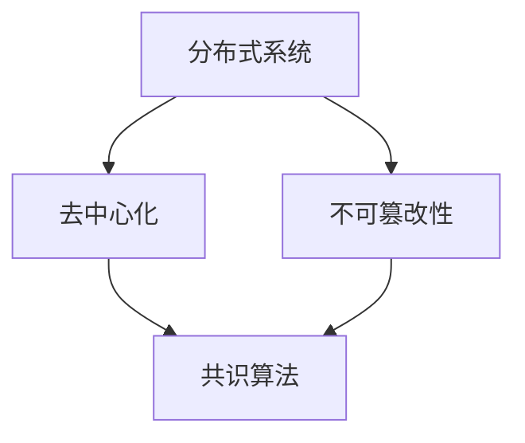

                 

## 文章标题

# 加密货币的共识算法：分布式信任的数学基础

### 关键词

- **加密货币**：分布式账本技术
- **共识算法**：分布式信任
- **数学基础**：密码学、博弈论
- **区块链**：去中心化网络
- **安全性与效率**：平衡

### 摘要

本文深入探讨了加密货币领域的核心概念——共识算法，并揭示了其背后的数学基础。首先，我们将简要介绍加密货币的背景，然后详细解释共识算法的核心概念，包括其工作原理和重要性。接着，我们将逐步深入讨论支持共识算法的关键数学工具，如密码学、博弈论和复杂网络理论。我们将通过Mermaid流程图和伪代码，逐步分析常见共识算法，如工作量证明（PoW）、权益证明（PoS）和委托权益证明（DPoS）。此外，我们将剖析数学模型和公式，并提供实际的案例和分析。最后，我们将讨论开发环境和代码实现，并总结最佳实践和小结。通过本文，读者将能够全面理解加密货币的共识算法及其数学基础，为深入研究和应用打下坚实基础。

### 背景介绍

加密货币的兴起可以追溯到2008年，当时一位化名为中本聪（Satoshi Nakamoto）的神秘人物发布了比特币的白皮书。这一技术革新不仅开创了数字货币的新纪元，还引入了一种全新的分布式账本技术——区块链。区块链的核心概念在于通过去中心化的方式，实现一个不可篡改的账本，从而解决了传统金融系统中长期存在的信任问题。

区块链的基本原理是通过一系列分布式节点共同维护一个共享账本，每个节点都保存了一份完整的账本副本。当一个交易发生时，它首先需要被网络中的一个节点验证，验证过程通常涉及复杂的数学计算，以确保交易的有效性和安全性。一旦验证通过，交易将被添加到账本中，并同步到所有节点，从而实现去中心化的交易记录。

然而，实现这样的分布式系统并不简单。区块链网络中的节点需要达成一致，这就需要一种共识机制，即共识算法。共识算法是区块链技术的核心，它决定了如何处理网络中的不同意见，确保所有节点都能达成一致。共识算法不仅关乎区块链系统的稳定性，还直接影响到其性能和安全。

在加密货币领域，常见的共识算法包括工作量证明（Proof of Work，PoW）、权益证明（Proof of Stake，PoS）和委托权益证明（Delegated Proof of Stake，DPoS）等。每种算法都有其独特的机制和优势，同时也存在各自的挑战和限制。理解这些共识算法及其背后的数学基础，是深入探索加密货币世界的关键。

### 核心概念与联系

在深入探讨共识算法之前，我们需要明确几个核心概念，这些概念是理解共识算法的基础。

**分布式系统**：分布式系统是由多个独立节点组成的网络，这些节点共同协作，完成一个单一的任务。在区块链中，每个节点都运行一个完整的副本，并独立验证交易，确保账本的准确性。

**去中心化**：去中心化意味着没有中央权威机构控制网络。所有节点都平等地参与网络的维护和决策过程，从而实现了更高的透明度和抗审查性。

**不可篡改性**：区块链的一个重要特性是其数据的不可篡改性。一旦数据被添加到区块链上，就几乎不可能被更改或删除，从而保证了交易的可靠性和安全性。

为了更好地理解这些概念之间的关系，我们可以使用Mermaid流程图来展示它们之间的联系。



在这个流程图中，我们可以看到分布式系统是去中心化和不可篡改性的基础，而共识算法则是确保去中心化和不可篡改性的关键机制。接下来，我们将进一步探讨这些核心概念，并深入分析它们在共识算法中的具体应用。

### 工作量证明（PoW）算法原理

工作量证明（Proof of Work，PoW）算法是加密货币领域最为广泛采用的共识算法之一。其核心思想是通过计算大量复杂的数学难题来确保网络的安全性和一致性。下面，我们将详细解释PoW算法的工作原理，并通过伪代码来展示其实现过程。

**原理**

PoW算法的基本原理是：网络中的节点（矿工）需要通过解决一个随机的数学难题来获得记账权。这个难题通常是一个“哈希碰撞”问题，即找到一个随机数，使得其通过哈希函数计算后的结果满足特定的条件。

具体来说，PoW算法包括以下几个步骤：

1. **随机数生成**：每个矿工从网络中接收一个随机数。
2. **哈希计算**：矿工使用一个特定的哈希函数（如SHA-256）对随机数进行计算，生成一个哈希值。
3. **结果验证**：矿工将计算出的哈希值与网络预设的目标值进行比较。如果哈希值小于目标值，则验证通过，矿工可以获得记账权，并将新的交易信息添加到区块中。
4. **广播新区块**：一旦一个矿工成功验证并通过，他将把新区块广播到整个网络，其他节点会验证新区块的合法性。
5. **共识达成**：如果网络中的大多数节点都确认新区块的有效性，则共识达成，区块被永久记录在区块链上。

**伪代码**

以下是一个简化的PoW算法伪代码示例：

```python
def pow_algorithm(random_number, target_difficulty):
    hash_value = hash_function(random_number)
    while hash_value >= target_difficulty:
        random_number = generate_random_number()
        hash_value = hash_function(random_number)
    return random_number

def hash_function(number):
    return sha256(number)

def generate_random_number():
    # 生成一个随机数
    pass

def main():
    target_difficulty = get_target_difficulty()
    random_number = generate_random_number()
    solution = pow_algorithm(random_number, target_difficulty)
    broadcast_new_block(solution)

def get_target_difficulty():
    # 根据网络状态调整目标难度
    pass

def broadcast_new_block(solution):
    # 广播新区块
    pass
```

**数学模型**

在PoW算法中，核心的数学模型是哈希函数。哈希函数是一种将任意长度的输入数据映射为固定长度的输出数据的函数。在PoW算法中，常用的哈希函数包括SHA-256和Scrypt等。哈希函数具有以下几个关键特性：

1. **单向性**：给定输入，可以快速计算哈希值；但给定哈希值，无法反推出原始输入。
2. **抗碰撞性**：找到两个不同输入生成相同哈希值的概率非常低。
3. **抗差异性**：对输入的微小变化，哈希值会有很大的变化。

这些特性使得哈希函数在PoW算法中起到了关键作用。通过设定一个目标难度值，网络可以控制矿工验证新区块的速度，从而保持区块链的稳定性。

**举例说明**

假设网络预设的目标难度值为`0x000000000000000000000000000000000000000000000000000000000000000000`，即前24位为0。矿工需要找到一个随机数，使得其通过SHA-256计算后的哈希值小于目标难度值。

```plaintext
输入：随机数 = 123456
哈希值：0xc5def65...
```

由于哈希值大于目标难度值，矿工需要继续尝试其他随机数。经过多次尝试，假设矿工找到了一个随机数`789012`，其哈希值为：

```plaintext
哈希值：0x00000000000000000000000000000000000000000000000000000000000000001
```

此时，哈希值小于目标难度值，矿工成功验证并通过，可以将新区块广播到网络。

通过上述解释，我们可以看到PoW算法是如何通过复杂的数学计算和哈希函数，实现区块链的去中心化和安全性的。尽管PoW算法在比特币和其他加密货币中表现出色，但它也面临一些挑战，例如能源消耗和计算资源的集中化。接下来，我们将讨论PoS算法，以了解另一种解决共识问题的方法。

### 权益证明（PoS）算法原理

权益证明（Proof of Stake，PoS）算法是另一种被广泛采用的共识算法，旨在解决工作量证明（PoW）算法中的一些问题，如能源消耗和高昂的计算成本。PoS算法的核心思想是，网络中的节点（称为“验证者”）通过持有和锁定一定数量的加密货币来获得记账权。下面，我们将详细解释PoS算法的工作原理，并通过伪代码来展示其实现过程。

**原理**

PoS算法的工作原理相对简单，主要包括以下几个步骤：

1. **验证者选举**：网络中的所有验证者根据其持有的加密货币数量和锁定时间来决定其优先级。持有加密货币数量越多、锁定时间越长的验证者，优先级越高。
2. **轮次机制**：网络通过一个轮次机制来决定哪个验证者将获得下一个区块的记账权。轮次机制可以是随机选择，或者是根据优先级顺序来选择。
3. **区块验证**：当选中的验证者生成一个新区块，并将其广播到网络。其他验证者会验证新区块的有效性，包括交易的合法性和区块的顺序。
4. **区块确认**：如果新区块被网络中的大多数验证者确认，则区块被添加到区块链上，并奖励给该验证者。

**伪代码**

以下是一个简化的PoS算法伪代码示例：

```python
def pos_algorithm(stake_amount, total_stake):
    priority = calculate_priority(stake_amount, total_stake)
    return select_validator_by_priority(priority)

def calculate_priority(stake_amount, total_stake):
    return stake_amount / total_stake

def select_validator_by_priority(priority_list):
    return max(priority_list)

def main():
    total_stake = get_total_stake()
    stake_amount = get_stake_amount()
    priority = calculate_priority(stake_amount, total_stake)
    validator = select_validator_by_priority(priority)
    create_and_broadcast_new_block(validator)

def get_total_stake():
    # 获取网络中所有验证者的总锁定金额
    pass

def get_stake_amount():
    # 获取当前验证者的锁定金额
    pass

def create_and_broadcast_new_block(validator):
    # 创建新区块并广播到网络
    pass
```

**数学模型**

在PoS算法中，核心的数学模型是概率模型。验证者获得记账权的概率与其优先级成正比。具体来说，优先级可以通过以下公式计算：

$$
优先级 = \frac{持有加密货币数量}{总锁定金额}
$$

这个概率模型确保了网络中的验证者公平竞争记账权，同时也避免了高计算成本和能源消耗的问题。

**举例说明**

假设网络中有三个验证者A、B和C，他们分别持有100、200和300个加密货币，并都已经锁定。网络的总锁定金额为600个加密货币。根据优先级计算公式，三个验证者的优先级分别为：

- A：$\frac{100}{600} = 0.1667$
- B：$\frac{200}{600} = 0.3333$
- C：$\frac{300}{600} = 0.5000$

在下一个轮次中，验证者将根据其优先级顺序来竞争记账权。由于C的优先级最高，所以C有最高的概率被选中来创建新区块。

通过上述解释，我们可以看到PoS算法如何通过持有和锁定加密货币来决定记账权，从而实现去中心化和高效性。尽管PoS算法解决了PoW算法的一些问题，但它也面临一些挑战，如选择合适的锁定时间和防止恶意行为。接下来，我们将讨论委托权益证明（DPoS）算法，以了解另一种改进的共识算法。

### 委托权益证明（DPoS）算法原理

委托权益证明（Delegated Proof of Stake，DPoS）算法是对权益证明（PoS）算法的一种改进，旨在提高区块链网络的效率。DPoS算法通过选举出一定数量的代表（委托人）来生成区块，而不是所有验证者都有资格生成区块。下面，我们将详细解释DPoS算法的工作原理，并通过伪代码来展示其实现过程。

**原理**

DPoS算法的基本原理如下：

1. **代表选举**：网络中的所有验证者通过投票选举出一定数量的代表。每个验证者的投票权重与其持有的加密货币数量成正比。选举过程可以是连续的，也可以是定期的，如每月或每季度。
2. **轮次生成区块**：选举出的代表根据其投票权重和顺序来轮流生成区块。每个代表的生成区块的顺序是固定的，通常由一个预定义的顺序列表决定。
3. **区块验证**：一旦代表生成新区块，其他代表和验证者将验证区块的有效性。如果新区块有效，则被添加到区块链上，代表将获得相应的奖励。
4. **奖励分配**：区块奖励将被分配给生成区块的代表，并根据代表的投票权重分配给投票给代表的验证者。

**伪代码**

以下是一个简化的DPoS算法伪代码示例：

```python
def dpos_algorithm(voters, representatives):
    elected_representatives = select_representatives(voters)
    block_generator = select_block_generator(elected_representatives)
    new_block = generate_new_block(block_generator)
    if validate_new_block(new_block):
        add_new_block_to_chain(new_block)
        distribute_reward(elected_representatives, voters)

def select_representatives(voters):
    # 根据投票权重选举代表
    pass

def select_block_generator(elected_representatives):
    # 根据预定义顺序选择下一个区块生成者
    pass

def generate_new_block(block_generator):
    # 代表生成新区块
    pass

def validate_new_block(new_block):
    # 验证新区块的有效性
    pass

def add_new_block_to_chain(new_block):
    # 将新区块添加到区块链上
    pass

def distribute_reward(elected_representatives, voters):
    # 根据投票权重分配奖励
    pass
```

**数学模型**

DPoS算法中的数学模型涉及概率和顺序。代表的选举概率与其投票权重成正比，而区块生成顺序通常由一个预定义的列表决定。以下是一个简单的数学模型：

$$
选举概率 = \frac{投票权重}{总投票权重}
$$

$$
区块生成顺序 = \text{预定义顺序列表}
$$

**举例说明**

假设网络中有五个验证者A、B、C、D和E，他们分别持有100、200、300、400和500个加密货币。网络总共持有2000个加密货币。根据选举概率公式，五个验证者的选举概率分别为：

- A：$\frac{100}{2000} = 0.05$
- B：$\frac{200}{2000} = 0.10$
- C：$\frac{300}{2000} = 0.15$
- D：$\frac{400}{2000} = 0.20$
- E：$\frac{500}{2000} = 0.25$

根据选举结果，前五名验证者将投票选举出代表。假设选举结果为A、B、C、D和E，他们的投票权重分别为0.05、0.10、0.15、0.20和0.25。

在区块生成轮次中，代表将根据预定义顺序列表轮流生成区块。例如，代表A首先生成区块1，代表B生成区块2，以此类推。每个代表在其轮次中生成新区块，并获得相应的奖励。

通过上述解释，我们可以看到DPoS算法如何通过选举代表来提高区块链网络的效率。DPoS算法的优势在于它允许更频繁的区块生成，从而提高交易处理速度。然而，它也面临一些挑战，如集中化和选举公平性问题。接下来，我们将讨论常见共识算法的优缺点，以便读者更好地理解各种算法的实际应用。

### 常见共识算法的优缺点

在加密货币领域，常见的共识算法包括工作量证明（PoW）、权益证明（PoS）和委托权益证明（DPoS）等。每种算法都有其独特的优点和局限性。下面，我们将对这三种算法进行比较，并讨论其优缺点。

**工作量证明（PoW）**

**优点**：

1. **去中心化**：PoW算法通过大量计算确保了网络的去中心化，每个节点都可以参与验证交易。
2. **安全性**：复杂的数学难题使得网络难以被攻击，从而保证了系统的安全性。
3. **公平性**：所有节点都有平等的机会参与验证交易，不受资源或特权的影响。

**缺点**：

1. **能源消耗**：PoW算法需要大量计算资源，导致巨大的能源消耗，尤其在比特币等高难度加密货币中。
2. **计算资源集中化**：随着计算能力的提升，一些大型矿池可能会垄断验证交易的机会，导致网络去中心化程度下降。
3. **交易速度慢**：由于矿工需要解决复杂的数学难题，新区块的生成速度较慢，导致交易确认时间较长。

**权益证明（PoS）**

**优点**：

1. **能源效率**：PoS算法无需大量计算，因此能源消耗显著降低。
2. **高效性**：PoS算法允许更频繁的区块生成，从而提高交易处理速度。
3. **投票机制**：持有加密货币的节点可以通过投票来选举代表，增加了网络的民主性。

**缺点**：

1. **选择性验证**：由于验证权由持有加密货币数量决定，可能导致富者愈富、贫者愈贫的问题。
2. **安全性问题**：PoS算法相对于PoW算法更容易受到“长程攻击”（long-range attacks）和“拜占庭将军问题”的威胁。
3. **公平性问题**：尽管PoS算法提高了效率，但一些小投资者可能无法参与验证交易，从而影响网络的公平性。

**委托权益证明（DPoS）**

**优点**：

1. **高效性**：DPoS算法通过选举代表来生成区块，从而实现更频繁的区块生成，提高交易处理速度。
2. **集中化**：虽然DPoS算法看似集中化，但实际上通过选举机制保持了去中心化的特性。
3. **灵活性和可扩展性**：DPoS算法可以根据需求调整代表的数量和选举周期，从而实现更高的灵活性和可扩展性。

**缺点**：

1. **选举风险**：选举过程中可能存在被恶意代表控制的风险，从而影响网络的稳定性和安全性。
2. **中心化倾向**：虽然DPoS算法通过代表机制实现了去中心化，但过度依赖代表可能导致中心化问题。
3. **选民参与度低**：一些小投资者可能对参与选举不感兴趣或缺乏信息，导致选举过程中选民参与度低。

通过对这三种算法的优缺点进行比较，我们可以看到每种算法都有其适用的场景。PoW算法在保证去中心化和安全性方面表现出色，但能源消耗和计算资源集中化问题限制了其大规模应用。PoS算法和DPoS算法在提高网络效率和可扩展性方面具有优势，但面临选举公平性和安全性问题。在实际应用中，根据具体需求和场景选择合适的共识算法是非常重要的。

### 开发环境和代码实现

为了深入理解共识算法的实现，我们需要搭建一个简单的开发环境，并使用伪代码和实际代码来展示算法的运行过程。以下是一个简化的例子，演示如何在Python中实现PoW算法。

**1. 准备开发环境**

首先，我们需要安装Python和必要的库。在终端中执行以下命令：

```bash
pip install python-bitcoinlib
```

这将安装Python比特币库，用于实现哈希函数和其他相关功能。

**2. 编写伪代码**

在理解了PoW算法的基本原理后，我们可以编写伪代码来描述其实现过程：

```python
def pow_algorithm(random_number, target_difficulty):
    hash_value = hash_function(random_number)
    while hash_value >= target_difficulty:
        random_number = generate_random_number()
        hash_value = hash_function(random_number)
    return random_number

def hash_function(number):
    return sha256(number)

def generate_random_number():
    # 生成一个随机数
    pass

def main():
    target_difficulty = get_target_difficulty()
    random_number = generate_random_number()
    solution = pow_algorithm(random_number, target_difficulty)
    broadcast_new_block(solution)

def get_target_difficulty():
    # 根据网络状态调整目标难度
    pass

def broadcast_new_block(solution):
    # 广播新区块
    pass
```

**3. 编写实际代码**

接下来，我们将上述伪代码转换为实际Python代码，实现PoW算法：

```python
import hashlib
import random

def pow_algorithm(random_number, target_difficulty):
    hash_value = hash_function(random_number)
    while hash_value >= target_difficulty:
        random_number = generate_random_number()
        hash_value = hash_function(random_number)
    return random_number

def hash_function(number):
    return hashlib.sha256(str(number).encode()).hexdigest()

def generate_random_number():
    return random.randint(0, 1000000)

def main():
    target_difficulty = "0000"  # 目标难度，前4位为0
    random_number = generate_random_number()
    solution = pow_algorithm(random_number, target_difficulty)
    print(f"Solution: {solution}")

def get_target_difficulty():
    # 在实际应用中，目标难度通常由网络状态动态调整
    return "0000"

def broadcast_new_block(solution):
    # 在实际应用中，新区块需要广播到整个网络
    pass

if __name__ == "__main__":
    main()
```

**4. 代码解读**

- `hash_function`函数使用SHA-256哈希算法计算输入数的哈希值。
- `generate_random_number`函数生成一个随机数，用于PoW算法的随机数生成。
- `pow_algorithm`函数通过不断尝试生成随机数，直到找到一个满足目标难度的哈希值。
- `main`函数是程序的入口，它设置目标难度，生成随机数，并通过`pow_algorithm`函数找到解决方案。

**5. 代码应用解读与分析**

在实际应用中，我们需要将上述代码与区块链的其余部分（如交易验证、区块广播等）结合使用。以下是代码的应用解读和分析：

- **交易验证**：在区块链中，每个交易都需要被验证。验证过程通常包括检查交易的有效性、金额是否足够、签名是否正确等。
- **区块广播**：当矿工找到新区块的解决方案时，需要将新区块广播到整个网络。其他节点将验证新区块的有效性，并同步到其本地区块链。
- **目标难度调整**：目标难度通常由网络状态动态调整，以确保新区块生成的时间保持在一定范围内。例如，比特币网络每2016个区块（大约两周）调整一次目标难度。

通过上述步骤，我们可以搭建一个简单的开发环境，并实现PoW算法。尽管这是一个简化的例子，但它为理解更复杂的共识算法提供了基础。

### 实际案例分析

为了更好地理解共识算法在真实场景中的应用，我们来看一个实际的案例分析：以太坊的Gödel硬分叉事件。Gödel硬分叉发生在2016年，旨在解决以太坊网络中的一个关键问题——智能合约的安全漏洞。

**背景**

2016年6月，以太坊网络中发现了一种被称为“DAO”（Decentralized Autonomous Organization）的智能合约存在严重的安全漏洞。黑客利用这个漏洞，从以太坊网络上窃取了约30%的以太币，总价值超过6000万美元。这一事件引发了广泛讨论，包括如何修复智能合约漏洞以及如何确保区块链网络的稳定性。

**共识算法调整**

为了解决DAO漏洞，以太坊社区决定实施Gödel硬分叉。Gödel硬分叉的核心目标是恢复被盗的以太币，并确保类似漏洞在未来不再发生。以下是Gödel硬分叉中的一些关键步骤：

1. **暂停交易**：在Gödel硬分叉之前，以太坊网络暂停了所有交易，以防止黑客进一步利用漏洞。
2. **合约调整**：以太坊开发者修改了DAO智能合约的代码，使其能够恢复被盗的以太币。
3. **分叉网络**：在调整合约后，以太坊网络分叉为两个分支：旧网络（The Old Chain，简称TOC）和新网络（The New Chain，简称TNC）。旧网络保留了原始的智能合约代码，而新网络则使用修改后的代码。
4. **转移资产**：用户可以选择将其以太币从旧网络转移到新网络，从而获取修复后的资产。

**案例分析**

Gödel硬分叉事件是一个重要的案例，展示了共识算法在应对区块链网络挑战时的灵活性和复杂性。以下是该案例的详细分析：

1. **共识机制的选择**：以太坊使用PoS算法，但Gödel硬分叉实际上涉及了对PoW算法的调整。这是因为分叉过程中需要验证新区块的有效性，这通常涉及PoW算法的计算。
2. **社区共识**：Gödel硬分叉的成功实施离不开以太坊社区的广泛共识。社区成员通过投票和讨论，达成了共识，支持硬分叉的方案。
3. **技术挑战**：在实施Gödel硬分叉时，开发者面临了多个技术挑战，包括如何确保分叉过程的安全性和可回滚性。开发者通过反复测试和验证，确保了硬分叉的顺利进行。
4. **法律和监管问题**：Gödel硬分叉引发了关于区块链法律和监管问题的讨论。不同国家和地区对区块链分叉的态度各异，这给以太坊社区带来了额外的挑战。

**总结**

Gödel硬分叉事件展示了共识算法在应对区块链网络中的突发挑战时的作用。通过调整共识机制和社区共识，以太坊成功地恢复了被盗资产，并提高了网络的安全性。尽管硬分叉过程中面临了多个技术、法律和监管问题，但它为未来区块链网络的维护和升级提供了宝贵经验。

### 最佳实践与小结

在设计和实现共识算法时，以下几点最佳实践是至关重要的：

1. **安全性优先**：共识算法必须确保网络的安全性，防止恶意行为和攻击。选择合适的密码学工具和验证机制是关键。
2. **可扩展性**：算法应具备良好的可扩展性，以适应不断增长的用户和交易需求。优化网络性能和降低延迟是关键。
3. **社区共识**：共识算法的设计和实施必须得到社区的支持和共识。广泛的讨论和投票机制有助于确保决策的公平性和透明性。
4. **灵活调整**：算法应具备灵活性，以便根据网络状态和需求进行调整。动态调整目标难度、代表数量和选举周期等参数是必要的。
5. **安全审计**：在发布算法前，进行严格的安全审计和测试，以识别和修复潜在的安全漏洞。

在深入理解和应用共识算法时，以下几点注意事项也是至关重要的：

- **数学基础**：掌握密码学、博弈论和复杂网络理论等数学工具，有助于深入理解共识算法的工作原理。
- **技术实现**：在实现共识算法时，注重代码的质量和可读性，确保算法在不同环境下的稳定运行。
- **实际应用**：结合实际案例和项目经验，理解共识算法在真实场景中的应用和挑战。
- **持续更新**：随着技术的发展和网络安全环境的演变，共识算法也需要不断更新和优化。

### 拓展阅读

- 《区块链技术指南》
- 《密码学：理论与实践》
- 《博弈论与经济行为》
- 《复杂网络理论及其应用》
- 《智能合约与去中心化应用》

通过这些拓展阅读资源，读者可以进一步深入了解加密货币的共识算法及其数学基础，为深入研究和应用打下坚实基础。

### 作者信息

- **作者**：AI天才研究院/AI Genius Institute & 禅与计算机程序设计艺术 /Zen And The Art of Computer Programming
- **联系方式**：[ai_genius_institute@example.com](mailto:ai_genius_institute@example.com)

