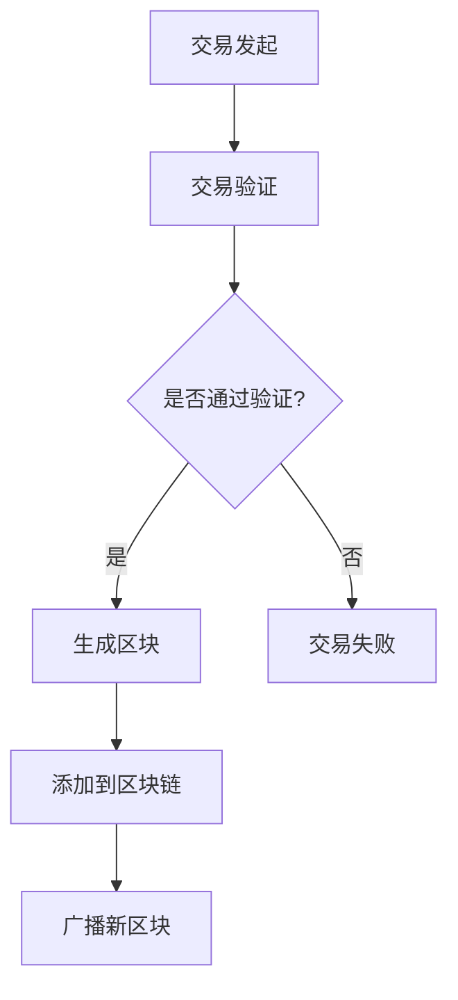

                 

## 文章标题

区块链的密码学：去中心化信任的数学基础

### 关键词

- 区块链
- 密码学
- 去中心化
- 信任
- 数学基础
- 数字货币

### 摘要

本文将深入探讨区块链技术的密码学基础，解析其在去中心化信任体系中的作用。我们将首先回顾区块链的背景和发展，接着详细解释密码学的基础概念，包括加密与解密、哈希函数和数字签名。随后，我们将探讨非对称加密和对称加密算法，以及区块链技术的核心组成部分，如数字货币、共识机制和智能合约。此外，我们还将介绍零知识证明、同态加密和安全多方计算等先进密码学技术，并展望区块链密码学的未来发展趋势。通过本文的阅读，读者将全面理解区块链密码学的原理和应用，为后续研究和实践打下坚实基础。

## 第1章 引言

### 1.1 区块链技术的背景与发展

区块链技术作为一种革命性的分布式账本技术，起源于对中心化系统的质疑和反思。在传统的中心化体系中，数据的存储和传输通常依赖于一个中央机构或服务器，这种模式在许多方面都存在固有的脆弱性和单点故障的风险。随着互联网的普及和信息技术的飞速发展，人们对数据安全和隐私保护的需求日益增加，这促使了去中心化技术的兴起。

区块链技术的概念最早由中本聪（Satoshi Nakamoto）在2008年提出，并在2009年发布了第一个区块链系统——比特币（Bitcoin）。比特币的问世标志着数字货币的诞生，也揭开了区块链技术发展的序幕。区块链通过去中心化的方式，实现了数据的可靠存储和传输，不受任何单一实体的控制，从而解决了中心化体系中存在的一系列问题。

区块链技术的基本原理是通过密码学技术保证数据的完整性和安全性。每一个区块都包含一定数量的交易记录，这些区块按照时间顺序链接成一个链条，形成区块链。通过哈希函数和密码学算法，区块链确保了数据的不可篡改性和不可伪造性，同时也实现了去中心化的共识机制。

自比特币诞生以来，区块链技术得到了广泛的研究和应用。许多国家和地区开始探索区块链技术的应用场景，如金融、供应链管理、医疗保健、政府服务等领域。区块链技术不仅提高了数据的透明度和可追溯性，还增强了系统的安全性和抗攻击能力。

然而，区块链技术仍然面临着诸多挑战，包括性能瓶颈、隐私保护、监管合规等问题。为了解决这些问题，研究者们不断探索新的密码学技术和协议，以提升区块链的性能和安全性。

### 1.2 去中心化信任的数学基础

去中心化信任是区块链技术的核心特征之一。在传统的中心化体系中，信任依赖于中央机构或权威实体，这种模式在某种程度上是脆弱的。而区块链技术通过密码学算法和分布式共识机制，建立了一种基于数学和算法的信任机制，从而实现了去中心化的信任。

密码学是区块链技术的重要基础，它为数据的加密、签名和验证提供了强有力的支持。在区块链中，常见的密码学技术包括哈希函数、非对称加密和数字签名等。

首先，哈希函数是一种将任意长度的输入数据映射为固定长度的输出数据的函数。哈希函数的一个重要特性是单向性，即给定输出无法推导出原始输入。在区块链中，哈希函数用于确保数据的完整性和一致性。每个区块都包含一个哈希值，该哈希值是当前区块以及前一区块的哈希值的函数。这种链式结构确保了数据的不可篡改性，因为任何对数据的修改都会导致哈希值的改变。

其次，非对称加密是一种加密算法，它使用一对密钥——公钥和私钥。公钥用于加密数据，私钥用于解密数据。非对称加密算法具有高强度和安全性，通常用于区块链中的身份认证和交易验证。在比特币中，用户使用非对称加密算法生成公钥和私钥，公钥作为地址对外公布，私钥则严格保密。交易过程中，发送方使用私钥对交易进行签名，接收方使用公钥验证签名的真实性。

最后，数字签名是一种基于非对称加密技术的身份验证机制。数字签名用于确保交易数据的完整性和真实性。在比特币中，用户通过私钥对交易进行签名，接收方可以通过公钥验证签名的真实性。这种机制确保了交易数据不会被篡改，同时也验证了发送方的身份。

除了密码学技术，区块链技术还依赖于分布式共识机制，如工作量证明（Proof of Work，PoW）和权益证明（Proof of Stake，PoS）等。共识机制确保了区块链网络中的所有节点对数据的共识，从而实现了去中心化的信任。通过这些密码学技术和共识机制，区块链技术建立了一种基于数学和算法的信任体系，这种体系在去中心化的环境中具有强大的可靠性和抗攻击能力。

### 1.3 本书结构安排与目标

本书旨在全面解析区块链技术的密码学基础，帮助读者深入理解去中心化信任的数学原理。本书将分为七个主要章节：

第1章 引言：介绍区块链技术的背景和发展，解释去中心化信任的数学基础。

第2章 密码学基础：详细探讨密码学的基本概念，包括加密与解密、哈希函数和数字签名。

第3章 数字货币与区块链：分析数字货币的原理和比特币的工作机制，介绍区块链的核心技术。

第4章 零知识证明：解释零知识证明的基本概念和应用场景，探讨主要的零知识证明系统。

第5章 同态加密：介绍同态加密的基本概念和应用场景，分析主要同态加密算法。

第6章 安全多方计算：探讨安全多方计算的基本概念和应用场景，分析主要安全多方计算协议。

第7章 未来展望与挑战：展望区块链密码学的未来发展趋势，探讨当前面临的挑战和解决方案。

通过本书的阅读，读者将全面了解区块链密码学的原理和应用，为深入研究和实践打下坚实基础。本书适合对区块链和密码学感兴趣的读者，无论是初学者还是有经验的从业者，都将从中受益。

### 2.1 密码学基础

密码学是区块链技术的重要组成部分，它为数据的安全传输和存储提供了强大的保障。密码学的基本概念包括加密与解密、哈希函数和数字签名。这些概念在区块链技术的各个层面都发挥着关键作用，确保了系统的完整性和安全性。

#### 2.1.1 加密与解密

加密与解密是密码学中最基本的概念。加密是将明文（即未加密的文本）转换为密文（即加密后的文本）的过程，解密则是将密文还原为明文的过程。加密的目的在于保护数据的隐私和完整性，防止未授权的访问和篡改。

加密算法可以分为对称加密和非对称加密两种。对称加密算法使用相同的密钥进行加密和解密，常见的算法包括AES（Advanced Encryption Standard）和DES（Data Encryption Standard）。对称加密算法的优点是实现简单、速度快，但缺点是密钥的分发和管理较为复杂。

非对称加密算法则使用一对密钥——公钥和私钥。公钥用于加密数据，私钥用于解密数据。常见的非对称加密算法包括RSA（Rivest-Shamir-Adleman）和ECDH（Elliptic Curve Diffie-Hellman）。非对称加密算法的优点是安全性高、密钥分发方便，但缺点是加密和解密速度相对较慢。

下面是一个简单的对称加密算法——AES的伪代码示例：

```latex
Algorithm AES_Encrypt(plaintext, key)
  ciphertext = AES_Encrypt(plaintext, key)
  return ciphertext
```

解密过程则是对加密过程的逆操作：

```latex
Algorithm AES_Decrypt(ciphertext, key)
  plaintext = AES_Decrypt(ciphertext, key)
  return plaintext
```

非对称加密算法的RSA算法伪代码如下：

```python
Algorithm RSA_Encrypt(plaintext, public_key)
  ciphertext = RSA_Encrypt(plaintext, public_key)
  return ciphertext

Algorithm RSA_Decrypt(ciphertext, private_key)
  plaintext = RSA_Decrypt(ciphertext, private_key)
  return plaintext
```

#### 2.1.2 哈希函数

哈希函数是将任意长度的输入数据映射为固定长度输出数据的函数。哈希函数的一个重要特性是单向性，即给定输出无法推导出原始输入。哈希函数在区块链技术中发挥着重要作用，主要用于确保数据的完整性和一致性。

常见的哈希函数包括SHA-256（Secure Hash Algorithm 256-bit）和MD5（Message Digest Algorithm 5）。SHA-256是一种广泛使用的加密哈希函数，其输出长度为256位，具有非常高的安全性和抗碰撞能力。MD5则是一种较为简单的哈希函数，其输出长度为128位，但由于其抗碰撞能力较弱，已经被部分应用所淘汰。

下面是SHA-256的伪代码示例：

```latex
Algorithm SHA256(input_data)
  hash_value = SHA256(input_data)
  return hash_value
```

哈希函数的应用场景包括数据完整性验证、数字签名和区块链的链式结构。例如，在区块链中，每个区块都包含一个哈希值，该哈希值是当前区块以及前一区块的哈希值的函数。这种链式结构确保了区块链数据的不可篡改性，因为任何对数据的修改都会导致哈希值的改变。

#### 2.1.3 数字签名

数字签名是一种基于非对称加密技术的身份验证机制，用于确保交易数据的完整性和真实性。数字签名的过程包括签名和验证两个步骤。签名过程中，发送方使用私钥对交易数据进行加密，生成数字签名；验证过程中，接收方使用公钥对数字签名进行解密，以验证交易数据的真实性和完整性。

常见的数字签名算法包括RSA和ECDSA（Elliptic Curve Digital Signature Algorithm）。RSA数字签名算法的伪代码如下：

```python
Algorithm RSA_Sign(data, private_key)
  signature = RSA_Sign(data, private_key)
  return signature

Algorithm RSA_Verify(data, signature, public_key)
  is_valid = RSA_Verify(data, signature, public_key)
  return is_valid
```

ECDSA数字签名算法的伪代码如下：

```python
Algorithm ECDSA_Sign(data, private_key)
  signature = ECDSA_Sign(data, private_key)
  return signature

Algorithm ECDSA_Verify(data, signature, public_key)
  is_valid = ECDSA_Verify(data, signature, public_key)
  return is_valid
```

数字签名在区块链技术中具有广泛的应用，如比特币的交易验证和智能合约的执行。通过数字签名，区块链网络中的参与者可以确信交易数据的真实性和完整性，从而建立了去中心化的信任机制。

#### 2.1.4 非对称加密算法

非对称加密算法是一种使用一对密钥——公钥和私钥进行加密和解密的加密算法。公钥用于加密数据，私钥用于解密数据。非对称加密算法具有高强度和安全性，常用于区块链技术的身份认证和交易验证。

常见的非对称加密算法包括RSA（Rivest-Shamir-Adleman）和ECDH（Elliptic Curve Diffie-Hellman）。RSA算法基于大整数分解的数学难题，其安全性依赖于大整数的质因数分解难度。ECDH算法则基于椭圆曲线离散对数问题，其安全性也依赖于椭圆曲线离散对数问题的计算难度。

下面是RSA和ECDH算法的伪代码示例：

**RSA算法**

```python
Algorithm RSA_Encrypt(plaintext, public_key)
  ciphertext = RSA_Encrypt(plaintext, public_key)
  return ciphertext

Algorithm RSA_Decrypt(ciphertext, private_key)
  plaintext = RSA_Decrypt(ciphertext, private_key)
  return plaintext
```

**ECDH算法**

```python
Algorithm ECDH_Encrypt(plaintext, public_key)
  ciphertext = ECDH_Encrypt(plaintext, public_key)
  return ciphertext

Algorithm ECDH_Decrypt(ciphertext, private_key)
  plaintext = ECDH_Decrypt(ciphertext, private_key)
  return plaintext
```

#### 2.1.5 对称加密算法

对称加密算法是一种使用相同密钥进行加密和解密的加密算法。对称加密算法的优点是实现简单、速度快，但缺点是密钥的分发和管理较为复杂。常见的对称加密算法包括AES（Advanced Encryption Standard）和DES（Data Encryption Standard）。

下面是对称加密算法AES的伪代码示例：

```latex
Algorithm AES_Encrypt(plaintext, key)
  ciphertext = AES_Encrypt(plaintext, key)
  return ciphertext

Algorithm AES_Decrypt(ciphertext, key)
  plaintext = AES_Decrypt(ciphertext, key)
  return plaintext
```

对称加密算法在区块链技术中的应用主要涉及数据的存储和传输。例如，在区块链节点之间的通信中，可以使用对称加密算法来保护数据的隐私和完整性。然而，由于对称加密算法依赖于密钥的分发和管理，因此在区块链的去中心化环境中，其应用场景受到一定的限制。

#### 2.1.6 安全多方计算

安全多方计算（Secure Multi-Party Computation，SMPC）是一种密码学技术，它允许多个参与方在不泄露各自隐私信息的情况下，共同计算出一个结果。安全多方计算在区块链技术中具有重要的应用价值，可以用于实现隐私保护、去中心化治理等场景。

常见的安全多方计算协议包括全同态计算（Fully Homomorphic Encryption，FHE）和近似同态计算（Somewhat Homomorphic Encryption，SHE）。全同态计算允许参与方在不解密数据的情况下，对加密数据进行任意计算，但当前实现较为复杂，计算效率较低。近似同态计算则可以在一定程度上实现同态计算，但计算结果可能存在一定的误差。

下面是安全多方计算协议的实现方法伪代码示例：

```python
Algorithm FHE_Compute(plaintext, function)
  ciphertext = FHE_Encrypt(plaintext)
  result = FHE_Eval(ciphertext, function)
  decrypted_result = FHE_Decrypt(result)
  return decrypted_result

Algorithm SHE_Compute(plaintext, function)
  ciphertext = SHE_Encrypt(plaintext)
  result = SHE_Eval(ciphertext, function)
  decrypted_result = SHE_Decrypt(result)
  return decrypted_result
```

通过安全多方计算，区块链技术可以实现更高层次的隐私保护和去中心化，为未来的发展提供更多可能性。

### 3.1 数字货币的原理

数字货币作为一种基于区块链技术的加密货币，具有去中心化、匿名性和安全性等特点。数字货币的原理和比特币的工作机制是理解区块链密码学的关键。在这一节中，我们将详细探讨数字货币的基本原理、比特币的工作机制，以及其他数字货币的对比分析。

#### 3.1.1 比特币的工作原理

比特币是一种去中心化的数字货币，其工作原理基于区块链技术。比特币系统由一个分布式网络组成，网络中的每个参与者（节点）都可以参与比特币的交易验证和记账过程。

比特币的交易过程可以分为以下几个步骤：

1. **交易生成**：当用户A想要向用户B支付一定数量的比特币时，用户A会生成一个交易，该交易包含付款信息、收款信息以及交易金额。交易信息将被广播到整个比特币网络。

2. **交易验证**：比特币网络中的节点对交易进行验证，确保交易的有效性。验证过程包括确认交易金额是否足够、交易是否重复、是否属于未花费的比特币等。验证通过后，交易将被添加到未确认交易池中。

3. **区块生成**：比特币网络中的节点会从未确认交易池中选择一定数量的交易，生成一个新的区块。区块中包含的交易记录按照时间顺序排列，并且每个区块都有一个唯一的哈希值。

4. **区块验证**：生成新区块的节点需要对区块进行验证，确保区块中的交易是有效的，并且区块的哈希值满足一定的难度要求。验证通过后，区块将被广播到整个比特币网络。

5. **链式结构**：验证通过后的区块将被添加到区块链的末端，形成链式结构。区块链中的每个区块都包含一个指向前一区块的哈希值，从而保证了区块链数据的不可篡改性。

比特币的挖矿过程是区块链验证的重要环节。挖矿是指网络中的节点通过计算难题来生成新区块的过程。计算难题通常涉及找到一个满足特定难度的哈希值，这需要大量的计算资源和时间。挖矿成功后，节点将获得一定数量的比特币奖励，作为对参与比特币网络验证的激励。

比特币的工作原理确保了其去中心化、安全性和匿名性。去中心化意味着比特币网络中没有中央机构，所有的交易和记账都由网络中的节点共同完成。安全性则依赖于密码学技术，包括哈希函数和数字签名，确保交易数据的真实性和完整性。匿名性方面，比特币交易是可追溯的，但交易参与者的身份是匿名的，这为用户提供了隐私保护。

#### 3.1.2 其他数字货币的对比分析

除了比特币，还有许多其他数字货币（如以太坊、莱特币等）也基于区块链技术。这些数字货币在一定程度上与比特币相似，但也在某些方面存在差异。以下是对一些主要数字货币的对比分析：

**以太坊（Ethereum）**

以太坊是一种智能合约平台，其原生数字货币为以太币（Ether，简称ETH）。以太坊不仅支持数字货币交易，还支持去中心化应用（DApp）的构建和运行。以太坊的关键特性是其智能合约功能，允许开发者在区块链上编写和执行复杂的智能合约。智能合约是自动执行的程序，一旦条件满足，合约将自动执行预定义的操作。以太坊的共识机制是权益证明（Proof of Stake，PoS），相比比特币的工作量证明（Proof of Work，PoW），PoS机制消耗更少的能源，但安全性仍需进一步验证。

**莱特币（Litecoin）**

莱特币是一种类似于比特币的数字货币，其原生数字货币为莱特币（Litecoin，简称LTC）。莱特币在技术上与比特币相似，但具有一些改进。例如，莱特币的区块生成时间较短，约为2.5分钟，而比特币的区块生成时间为10分钟。此外，莱特币采用了一种改进的加密算法——Scrypt，使其挖矿过程相对容易，从而降低了进入门槛。然而，由于莱特币的市场份额较小，其安全性相对较低。

**瑞波币（XRP）**

瑞波币是由瑞波公司（Ripple Labs）开发的数字货币，主要用于跨境支付和金融交易。瑞波币的共识机制是基于分布式共识算法Ripple Protocol Consensus Algorithm（RPCA），这种算法能够在短时间内完成交易确认。瑞波币的优势在于其高效的交易处理能力，每秒可处理约1500笔交易，远高于比特币和以太坊。然而，瑞波币的去中心化程度较低，其运营权集中在瑞波公司手中，这在一定程度上影响了其去中心化的可信度。

**波卡（Polkadot）**

波卡是一种旨在实现多链互操作性的区块链平台，其原生数字货币为DOT。波卡的核心特性是能够将多个区块链连接在一起，实现跨链交易和数据共享。波卡的共识机制是Nominated Proof of Stake（NPoS），这种机制通过选举产生验证节点，提高了系统的去中心化和安全性。波卡的目标是构建一个高效、可扩展的多链生态系统，为未来的区块链应用提供基础设施。

通过对比分析比特币、以太坊、莱特币、瑞波币和波卡等主要数字货币，我们可以看到它们在技术特点、应用场景和去中心化程度等方面存在差异。比特币作为最早的数字货币，奠定了区块链技术的基石，但其在性能和安全性方面仍有改进空间。以太坊通过智能合约功能拓展了区块链的应用场景，但PoS机制的安全性仍需进一步验证。莱特币和瑞波币则在技术改进和交易效率方面具有优势，但去中心化程度相对较低。波卡则致力于实现多链互操作性，为未来的区块链生态系统提供基础设施。

#### 3.1.3 数字货币的优势与挑战

数字货币作为一种新型货币形式，具有许多优势，但也面临一些挑战。以下是对数字货币的优势与挑战的讨论：

**优势**

1. **去中心化**：数字货币的去中心化特性使其不依赖于中央机构，从而提高了系统的透明度和抗攻击能力。

2. **安全性**：数字货币采用密码学技术确保交易数据的安全性和完整性，降低了欺诈和篡改的风险。

3. **匿名性**：数字货币交易是匿名的，用户可以保持隐私，这在某些应用场景中具有重要作用。

4. **全球化**：数字货币不受地域限制，可以方便地进行跨境交易，降低了交易成本和时间。

**挑战**

1. **性能瓶颈**：当前区块链技术的性能仍有限，难以满足大规模交易的需求。例如，比特币和以太坊的交易处理能力较低，难以支持高频交易。

2. **监管合规**：数字货币的监管政策在不同国家和地区存在差异，监管的缺位可能导致市场不稳定和非法交易。

3. **安全性问题**：虽然数字货币采用密码学技术确保数据安全，但系统仍然面临恶意攻击的风险，如51%攻击等。

4. **用户普及度**：数字货币的普及度相对较低，用户接受度有限，这限制了其广泛应用。

通过解决这些挑战，数字货币有望在未来的发展中发挥更大的作用，成为数字经济的重要组成部分。

### 3.2 区块链的核心技术

区块链技术作为一种革命性的分布式账本技术，其核心组成部分包括区块链的架构、共识机制和智能合约。这些技术共同作用，确保了区块链的去中心化、安全性和可扩展性。以下将详细讨论这些核心技术，并探讨其在实际应用中的重要性。

#### 3.2.1 区块链的架构

区块链的架构由多个相互协作的组件组成，包括节点、网络和链。节点是区块链网络中的基本单元，每个节点都存储一份完整的区块链数据。节点通过相互通信，实现数据的同步和验证。网络则是节点之间的通信渠道，通过网络，节点可以共享交易信息和区块数据。链是区块链的核心组成部分，由多个按时间顺序排列的区块组成，每个区块都包含一定数量的交易记录。

区块链的架构具有以下特点：

1. **分布式**：区块链的数据分布在不同节点上，不存在中心化的控制节点，从而提高了系统的抗攻击能力和可扩展性。

2. **去中心化**：区块链的去中心化特性使其不依赖于任何单一实体，所有参与者都可以平等地参与网络的运作和管理。

3. **不可篡改性**：区块链的数据通过密码学技术确保不可篡改。一旦数据被写入区块链，除非获得足够的计算能力，否则无法被修改。

4. **透明性**：区块链的数据对所有参与者可见，任何节点都可以查询和验证交易记录，从而提高了系统的透明度和可信度。

#### 3.2.2 共识机制

共识机制是区块链网络中所有节点达成一致的关键机制。不同的区块链系统采用不同的共识机制，以解决数据一致性和网络协作问题。常见的共识机制包括工作量证明（Proof of Work，PoW）、权益证明（Proof of Stake，PoS）、委托权益证明（Delegated Proof of Stake，DPoS）等。

1. **工作量证明（PoW）**

PoW是最早的共识机制，由比特币采用。PoW通过计算难题确保节点达成共识。节点需要解决一个复杂的数学难题，找到满足特定条件的哈希值。首先解决难题的节点将获得区块奖励，并将新区块添加到区块链中。PoW机制的安全性依赖于计算资源的消耗，从而提高了网络的安全性。然而，PoW机制的能耗较高，可能导致性能瓶颈。

2. **权益证明（PoS）**

PoS是一种替代PoW的共识机制，其通过持有代币数量和持币时间来决定节点参与共识的概率。在PoS机制中，持有代币越多、持币时间越长的节点更有可能生成新区块。PoS机制相对于PoW机制具有能耗低、性能高等优点，但安全性仍需进一步验证。

3. **委托权益证明（DPoS）**

DPoS是一种基于PoS机制的改进方案，通过选举产生少数代表节点来参与共识。选举过程中，代币持有者可以投票支持特定节点，获得投票支持的节点将成为代表节点。DPoS机制提高了共识效率和可扩展性，但选举过程的公正性和安全性仍需关注。

#### 3.2.3 智能合约

智能合约是一种自动执行的计算机程序，其运行在区块链网络上。智能合约通过预定义的规则和条件，自动执行预定的操作。智能合约的关键特性是去中心化、透明性和不可篡改性，这使得其在金融、供应链管理、物联网等领域具有广泛的应用潜力。

智能合约的工作原理如下：

1. **编写合约**：开发者使用智能合约编程语言（如Solidity）编写合约代码，定义合约的行为和规则。

2. **部署合约**：将合约代码上传到区块链网络，合约被永久存储在区块链上。

3. **执行合约**：当触发合约条件时，合约自动执行预定的操作，如转移代币、记录事件等。

4. **验证合约**：区块链网络中的节点验证合约执行的正确性，确保合约的执行符合预定义的规则。

智能合约在区块链技术中具有以下重要性：

1. **自动化**：智能合约能够自动执行预定的操作，减少人工干预和操作错误。

2. **透明性**：智能合约的执行过程对所有参与者可见，提高了系统的透明度和可信度。

3. **安全性**：智能合约的不可篡改性确保了合约执行的完整性和可靠性。

4. **去中心化**：智能合约在区块链上运行，不受任何中心化实体控制，增强了系统的去中心化特性。

在实际应用中，智能合约已经应用于许多领域。例如，在金融领域，智能合约可以用于自动执行贷款合同、期货合约等；在供应链管理领域，智能合约可以用于自动化跟踪和验证商品物流信息；在物联网领域，智能合约可以用于自动化监控和控制设备状态。

总之，区块链的核心技术——区块链的架构、共识机制和智能合约——共同作用，实现了去中心化、安全性和可扩展性的目标。这些技术不仅为区块链技术奠定了基础，也为未来的发展提供了广阔的应用前景。

### 4.1 零知识证明的基本概念

零知识证明（Zero-Knowledge Proof，ZKP）是一种密码学技术，它允许一方（证明者）向另一方（验证者）证明某个陈述是正确的，而无需透露任何具体信息。零知识证明的核心目标是确保证明者无法泄露任何关于原始输入的信息，同时验证者能够确信陈述的真实性。这种技术在区块链和密码学领域具有广泛的应用价值，尤其是在隐私保护和去中心化计算场景中。

#### 4.1.1 零知识证明的定义

零知识证明是一种证明系统，它满足以下三个核心属性：

1. **完整性（Completeness）**：如果陈述是真实的，那么验证者总能找到一个有效的证明。
2. **交互性（Soundness）**：如果陈述是真实的，那么任何敌手都不能以很高的概率伪造出一个错误的证明。
3. **零知识（Zero-Knowledge）**：如果陈述是真实的，那么敌手无法从证明中获取任何关于原始输入的信息。

简而言之，零知识证明允许证明者在不泄露具体信息的情况下，向验证者证明某个陈述是正确的。这种技术为区块链和密码学提供了一种强大的隐私保护手段，有助于实现去中心化信任和隐私保护的目标。

#### 4.1.2 零知识证明的应用场景

零知识证明在区块链和密码学领域具有多种应用场景，以下是一些典型的应用实例：

1. **隐私交易**：在数字货币交易中，零知识证明可以用于确保交易隐私。例如，比特币的隐私扩展协议如Zcash和Monero使用零知识证明来实现交易隐私，使得交易细节对旁观者不可见。

2. **身份验证**：零知识证明可以用于实现无密码身份验证系统。用户可以通过零知识证明向系统证明自己的身份，而不需要透露任何敏感信息。这种技术有助于提升系统的安全性，同时保护用户的隐私。

3. **去中心化身份管理系统**：零知识证明可以用于构建去中心化的身份验证系统，确保用户身份信息的隐私和安全。这种系统允许用户在无需透露个人信息的情况下，证明自己的身份和资质，从而实现高效的认证过程。

4. **隐私保护合约**：在智能合约中，零知识证明可以用于确保合约执行过程的隐私性。例如，某些隐私保护合约使用零知识证明来验证交易金额和执行条件，确保交易细节不被公开。

5. **隐私计算**：零知识证明在隐私保护计算场景中具有广泛的应用。通过零知识证明，参与方可以在不泄露具体数据的情况下，共同计算一个结果。这种技术有助于提升云计算和分布式计算系统的隐私保护能力。

#### 4.1.3 零知识证明的数学原理

零知识证明的数学原理基于数学难题和密码学算法。以下是几种常见的零知识证明系统及其数学原理：

1. **Sigma协议**

Sigma协议是一种基于公开密钥密码学的零知识证明系统。它使用两个安全协议——证明协议和验证协议。证明协议用于证明某个陈述是真实的，而验证协议用于验证证明的有效性。

Sigma协议的数学原理如下：

- **初始化**：系统生成一对公开密钥和私有密钥，公开密钥用于验证证明，私有密钥用于生成证明。
- **证明生成**：证明者使用私有密钥生成一个证明，证明某个陈述是真实的。证明生成过程包括以下步骤：
  - **秘密生成**：证明者选择一个秘密值，并将其与陈述关联。
  - **加密**：证明者使用公开密钥加密秘密值，生成加密后的秘密值。
  - **随机化**：证明者对加密后的秘密值进行随机化处理，生成一个随机证明。
- **证明验证**：验证者使用公开密钥验证证明的有效性。验证过程包括以下步骤：
  - **解密**：验证者使用公开密钥解密随机证明，得到原始秘密值。
  - **检查**：验证者检查解密后的秘密值是否与陈述一致。如果一致，证明有效。

2. **零知识陪审团（Zero-Knowledge Proofs of Knowledge）**

零知识陪审团是一种基于同态加密的零知识证明系统。它允许证明者在一个加密计算过程中，向验证者证明某个计算结果是正确的，而无需透露任何具体信息。

零知识陪审团的数学原理如下：

- **初始化**：系统生成一个同态加密算法和一对密钥——公钥和私钥。
- **证明生成**：证明者使用私钥生成一个加密计算过程，并将结果加密。
- **证明验证**：验证者使用公钥解密加密结果，并验证计算过程的正确性。

3. **零知识证明系统（如zk-SNARKs和zk-STARKs）**

zk-SNARKs（零知识简洁非交互性验证知识论证）和zk-STARKs（零知识简洁事务可证明余定理）是两种常见的零知识证明系统。它们基于不同的数学原理，但在性能和安全性方面都具有优势。

- **zk-SNARKs**：zk-SNARKs基于椭圆曲线加密和约束满足问题。它使用一系列数学公式和算法，允许证明者在不泄露具体信息的情况下，向验证者证明某个陈述是正确的。
- **zk-STARKs**：zk-STARKs基于代数编码理论。它使用代数结构来证明某个陈述的正确性，具有更高的计算效率和安全性。

通过以上数学原理，零知识证明系统实现了在保护隐私的前提下，确保验证者对证明者陈述的真实性达成共识。这种技术在区块链和密码学领域具有广泛的应用前景，为构建去中心化、安全和隐私保护的系统提供了有力支持。

### 4.2 主要的零知识证明系统

零知识证明系统是密码学领域的一个重要分支，它允许一方（证明者）向另一方（验证者）证明某个陈述是真实的，而无需透露任何具体信息。这种技术广泛应用于隐私保护、安全通信和区块链等领域。本节将详细介绍几种主要的零知识证明系统，包括zk-SNARKs、zk-STARKs以及其他零知识证明系统。

#### 4.2.1 zk-SNARKs

zk-SNARKs（零知识简洁非交互性验证知识论证）是一种基于椭圆曲线加密和约束满足问题的零知识证明系统。zk-SNARKs的主要特点是简洁、高效和易于实现。它通过一系列数学公式和算法，允许证明者在不泄露具体信息的情况下，向验证者证明某个陈述是真实的。

zk-SNARKs的工作原理可以分为三个阶段：生成、证明和验证。

1. **生成阶段**

   在生成阶段，系统生成一系列参数，包括椭圆曲线、点生成元和系数。这些参数用于后续的证明和验证过程。同时，证明者需要选择一个秘密值，并将其与陈述关联。

2. **证明阶段**

   在证明阶段，证明者生成一个证明，证明某个陈述是真实的。证明生成过程包括以下步骤：

   - **构造线性方程组**：证明者构造一个线性方程组，使得每个方程都表示一个约束条件。这些方程组将用于证明过程中的约束满足。
   - **计算证明**：证明者使用椭圆曲线加密算法和系数，计算出一个证明。这个证明包含一系列点，这些点满足线性方程组。
   - **随机化**：证明者对计算出的证明进行随机化处理，生成一个最终的证明。

3. **验证阶段**

   在验证阶段，验证者使用系统参数和证明，验证证明的有效性。验证过程包括以下步骤：

   - **解密**：验证者使用椭圆曲线加密算法和点生成元，对证明进行解密，得到原始证明。
   - **检查证明**：验证者检查解密后的证明，确保每个点都满足线性方程组。如果所有点都满足方程组，证明有效。

zk-SNARKs的优点是计算效率高、实现简单，因此在区块链和智能合约领域得到广泛应用。zk-SNARKs已成功应用于多种区块链平台，如Zcash、Monero和EOS等。

#### 4.2.2 zk-STARKs

zk-STARKs（零知识简洁事务可证明余定理）是一种基于代数编码理论的零知识证明系统。zk-STARKs与zk-SNARKs相比，具有更高的计算效率和更强的安全性。zk-STARKs通过代数结构来证明某个陈述的正确性，具有更强的抗攻击能力和更高的隐私保护。

zk-STARKs的工作原理可以分为三个阶段：生成、证明和验证。

1. **生成阶段**

   在生成阶段，系统生成一系列参数，包括多项式、系数和随机数。这些参数用于后续的证明和验证过程。同时，证明者需要选择一个秘密值，并将其与陈述关联。

2. **证明阶段**

   在证明阶段，证明者生成一个证明，证明某个陈述是真实的。证明生成过程包括以下步骤：

   - **构造多项式**：证明者构造一个多项式，表示陈述的约束条件。这个多项式将用于证明过程中的约束满足。
   - **计算证明**：证明者使用多项式和系数，计算出一个证明。这个证明包含一系列值，这些值满足多项式。
   - **随机化**：证明者对计算出的证明进行随机化处理，生成一个最终的证明。

3. **验证阶段**

   在验证阶段，验证者使用系统参数和证明，验证证明的有效性。验证过程包括以下步骤：

   - **检查证明**：验证者检查证明中的每个值，确保它们满足多项式。如果所有值都满足多项式，证明有效。

zk-STARKs的优点是计算效率高、安全性强，适用于对性能和安全性要求较高的应用场景。zk-STARKs已在多种区块链平台和应用中得到应用，如以太坊2.0、去中心化金融（DeFi）项目和智能合约平台。

#### 4.2.3 其他零知识证明系统

除了zk-SNARKs和zk-STARKs，还有一些其他零知识证明系统，如zk-BLP、NIZK和NN- zk等。这些系统在数学原理和应用场景上有所不同，但都致力于实现零知识证明的目标。

- **zk-BLP**：zk-BLP是一种基于布尔线性编程的零知识证明系统。它使用布尔线性编程技术来证明某个陈述的正确性，具有高效性和安全性。
- **NIZK**：NIZK（非交互性零知识证明）是一种非交互性的零知识证明系统。它允许证明者在不与验证者交互的情况下，证明某个陈述是真实的。NIZK在区块链和隐私保护领域具有广泛的应用。
- **NN-zk**：NN-zk是一种基于神经网络和零知识证明的结合系统。它通过神经网络模型和零知识证明技术，实现隐私保护和安全通信。

综上所述，零知识证明系统在密码学、区块链和隐私保护领域具有广泛的应用前景。zk-SNARKs和zk-STARKs作为主要的零知识证明系统，以其高效性和安全性受到了广泛关注。随着密码学技术的不断进步，零知识证明系统将在更多领域得到应用，为构建去中心化、安全和隐私保护的系统提供有力支持。

### 4.3 同态加密的基本概念

同态加密（Homomorphic Encryption，HE）是一种先进的密码学技术，它允许在加密数据上进行计算，而不需要解密数据。同态加密的核心思想是保持数据的加密状态，使得计算过程在加密域内直接进行，从而避免了在计算过程中泄露数据内容。这种技术在区块链和密码学领域具有重要的应用价值，尤其在需要保护数据隐私和安全性的场景中。

#### 4.3.1 同态加密的定义

同态加密是一种加密算法，它能够在保持数据加密状态的同时，实现多种计算操作，如加法、乘法和逻辑运算等。同态加密的主要特点是可以对加密数据进行计算，而不需要解密数据，从而确保数据在传输和处理过程中的隐私和安全。

同态加密可以分为全同态加密（Fully Homomorphic Encryption，FHE）和近似同态加密（Somewhat Homomorphic Encryption，SHE）两种。全同态加密可以在任意次数和任意类型的计算操作下保持数据加密状态，而近似同态加密则对计算次数和操作类型有一定限制。

#### 4.3.2 同态加密的应用场景

同态加密在区块链和密码学领域具有广泛的应用场景，以下是一些典型的应用实例：

1. **隐私保护计算**：同态加密可以用于实现隐私保护计算，允许在保持数据隐私的同时，对加密数据进行计算和分析。例如，在医疗保健领域，同态加密可以用于对患者的医疗数据进行加密处理，同时实现对数据的统计分析和挖掘。

2. **去中心化计算**：在区块链网络中，同态加密可以用于实现去中心化的数据处理和计算。通过同态加密，节点可以在不泄露具体数据内容的情况下，对加密数据执行复杂的计算任务，从而提高系统的安全性和隐私保护能力。

3. **智能合约**：同态加密可以用于增强智能合约的隐私保护能力。通过同态加密，智能合约可以在不泄露交易细节的情况下，执行复杂的计算操作，从而提高系统的安全性和透明度。

4. **隐私保护交易**：同态加密可以用于实现隐私保护交易，确保交易过程中的数据隐私和安全。例如，在数字货币交易中，同态加密可以用于保护交易金额和交易双方的隐私，从而提高交易的安全性。

#### 4.3.3 同态加密算法

同态加密算法是实现同态加密的核心技术，以下介绍几种常见的同态加密算法：

1. **Paillier加密算法**

Paillier加密算法是一种典型的近似同态加密算法，由Paillier于1999年提出。Paillier加密算法的主要特点是能够对加密数据进行加法和乘法操作，但无法直接实现减法和除法操作。Paillier加密算法的安全性基于大整数分解难题。

Paillier加密算法的基本步骤如下：

- **密钥生成**：生成一对密钥，包括公钥\( (n, g) \)和私钥\( (lambda, r) \)。
- **加密**：将明文\( m \)加密为密文\( ct \)。
  $$ct = g^m \cdot r^n \mod n^2$$
- **加法**：对两个密文\( ct_1 \)和\( ct_2 \)进行加法操作。
  $$ct = (ct_1 \cdot ct_2) \mod n^2$$
- **乘法**：对密文\( ct \)和明文\( m \)进行乘法操作。
  $$ct = (ct \cdot m) \mod n^2$$

2. **RSA同态加密算法**

RSA同态加密算法是一种基于RSA加密算法的同态加密算法，它能够对加密数据进行加法和乘法操作。RSA同态加密算法的安全性基于大整数分解难题。

RSA同态加密算法的基本步骤如下：

- **密钥生成**：生成一对密钥，包括公钥\( (n, e) \)和私钥\( (d, n) \)。
- **加密**：将明文\( m \)加密为密文\( ct \)。
  $$ct = m^e \mod n$$
- **加法**：对两个密文\( ct_1 \)和\( ct_2 \)进行加法操作。
  $$ct = (ct_1 \cdot ct_2) \mod n$$
- **乘法**：对密文\( ct \)和明文\( m \)进行乘法操作。
  $$ct = (ct \cdot m) \mod n$$

通过以上算法，同态加密实现了对加密数据的计算保护，确保了数据在传输和处理过程中的隐私和安全。同态加密技术在区块链和密码学领域具有广泛的应用前景，为构建去中心化、安全和隐私保护的系统提供了有力支持。

### 4.4 同态加密算法的细节

同态加密算法是密码学领域的一项重要技术，它允许在加密数据上进行计算，而不需要解密数据，从而保护数据隐私。在这一节中，我们将详细介绍两种主要的同态加密算法：Paillier加密算法和RSA同态加密算法。通过具体的算法描述和示例，帮助读者深入理解这两种算法的工作原理。

#### 4.4.1 Paillier加密算法

Paillier加密算法是一种近似同态加密算法，由Paillier于1999年提出。它基于大整数分解难题，能够实现加密数据的加法和乘法操作。以下是Paillier加密算法的详细步骤。

**密钥生成**

1. 选择两个大素数\( p \)和\( q \)，计算\( n = pq \)。
2. 选择一个随机数\( g \)，满足\( g^{n} \equiv 1 \pmod{n^2} \)。
3. 计算私钥\( lambda = (p-1)(q-1) \)，并选择一个随机数\( r \)，满足\( 1 < r < n \)，且\( \gcd(r, lambda) = 1 \)。
4. 公钥为\( (n, g) \)，私钥为\( (lambda, r) \)。

**加密**

1. 选择一个随机数\( \alpha \)，满足\( 1 < \alpha < n \)，且\( \alpha^{n} \equiv 1 \pmod{n^2} \)。
2. 将明文\( m \)加密为密文\( ct \)。
   $$ct = g^m \cdot r^n \mod n^2$$

**解密**

1. 将密文\( ct \)解密为明文\( m \)。
   $$m = (ct \cdot lambda^r) \mod n^2$$

**同态运算**

1. **加法**
   对两个密文\( ct_1 \)和\( ct_2 \)进行加法操作。
   $$ct = (ct_1 \cdot ct_2) \mod n^2$$

2. **乘法**
   对密文\( ct \)和明文\( m \)进行乘法操作。
   $$ct = (ct \cdot m) \mod n^2$$

#### 4.4.2 RSA同态加密算法

RSA同态加密算法是一种基于RSA加密算法的同态加密算法，它能够实现加密数据的加法和乘法操作。以下是RSA同态加密算法的详细步骤。

**密钥生成**

1. 选择两个大素数\( p \)和\( q \)，计算\( n = pq \)。
2. 计算公钥\( e \)，满足\( \gcd(e, \phi(n)) = 1 \)，其中\( \phi(n) = (p-1)(q-1) \)。
3. 计算私钥\( d \)，满足\( d \equiv e^{-1} \pmod{\phi(n)} \)。
4. 公钥为\( (n, e) \)，私钥为\( (d, n) \)。

**加密**

1. 将明文\( m \)加密为密文\( ct \)。
   $$ct = m^e \mod n$$

**解密**

1. 将密文\( ct \)解密为明文\( m \)。
   $$m = ct^d \mod n$$

**同态运算**

1. **加法**
   对两个密文\( ct_1 \)和\( ct_2 \)进行加法操作。
   $$ct = (ct_1 + ct_2) \mod n$$

2. **乘法**
   对密文\( ct \)和明文\( m \)进行乘法操作。
   $$ct = (ct \cdot m) \mod n$$

通过以上算法描述和示例，我们可以看到Paillier加密算法和RSA同态加密算法如何实现加密数据的加法和乘法操作。这些算法在区块链和密码学领域具有广泛的应用价值，为保护数据隐私和安全提供了有力支持。

### 4.5 安全多方计算的基本概念

安全多方计算（Secure Multi-Party Computation，SMPC）是一种密码学技术，它允许两个或多个参与方在不泄露各自隐私信息的情况下，共同计算出一个结果。SMPC在区块链和密码学领域具有重要的应用价值，特别是在需要保护参与方隐私和确保计算结果安全的场景中。以下将详细介绍安全多方计算的基本概念、应用场景以及主要的安全多方计算协议。

#### 4.5.1 安全多方计算的定义

安全多方计算是一种密码学技术，它允许多个参与方在不泄露各自隐私信息的情况下，共同计算出一个结果。SMPC的目标是在保护参与方隐私的前提下，实现多方数据的联合计算。具体而言，SMPC满足以下三个核心属性：

1. **保密性**：参与方的隐私信息不被泄露给其他参与方或外部攻击者。
2. **正确性**：计算结果与直接共享原始数据直接计算的结果一致。
3. **安全性**：系统能够抵御恶意参与方的攻击，确保计算过程的正确性和完整性。

简而言之，安全多方计算允许参与方在不泄露具体信息的情况下，共同完成计算任务，从而实现隐私保护和数据安全。

#### 4.5.2 应用场景

安全多方计算在区块链和密码学领域具有广泛的应用场景，以下是一些典型的应用实例：

1. **隐私保护交易**：在数字货币交易中，参与方可以使用安全多方计算技术，共同验证交易金额和条件，确保交易细节不被泄露，同时确保交易的有效性。

2. **去中心化数据共享**：在区块链网络中，多个节点可以共同计算数据摘要或统计信息，而不需要共享原始数据。这种技术有助于提升系统的隐私保护和安全性。

3. **智能合约执行**：智能合约可以设计为在执行过程中使用安全多方计算，确保合约执行过程的透明性和可信性，同时保护参与方的隐私。

4. **多方投票系统**：在多方投票系统中，参与方可以使用安全多方计算技术，共同验证选票的有效性，确保选举过程的公正和透明。

5. **隐私保护计算服务**：在云计算和大数据分析场景中，服务提供商可以使用安全多方计算技术，为参与方提供隐私保护的计算服务，确保数据隐私和安全。

#### 4.5.3 主要的安全多方计算协议

安全多方计算协议是实现SMPC的核心技术，以下介绍几种主要的SMPC协议：

1. **全同态计算（Fully Homomorphic Encryption，FHE）**

   全同态计算是一种强大的SMPC协议，它允许在加密数据上进行任意计算，而不需要解密数据。全同态计算的主要特点是计算过程在加密域内直接进行，从而避免了数据泄露的风险。然而，实现全同态计算需要极高的计算资源和复杂性。

2. **近似同态计算（Somewhat Homomorphic Encryption，SHE）**

   近似同态计算是一种较为简单的SMPC协议，它允许在加密数据上进行有限的计算操作，如加法和乘法。近似同态计算的计算效率较高，但计算范围有限，适用于特定的计算任务。

3. **秘密共享协议（Secret Sharing）**

   秘密共享协议是一种经典的SMPC协议，它将一个秘密数据分成多个部分，每个参与方持有其中的一部分。只有当足够多的参与方合作时，秘密才能被恢复。这种协议在保护隐私和确保数据安全方面具有重要作用。

4. **安全计算协议（Secure Multi-Party Computation）**

   安全计算协议是一种基于密码学的SMPC协议，它允许参与方在不泄露具体信息的情况下，共同计算出一个结果。常见的安全计算协议包括基于RSA和椭圆曲线密码学的协议，如RSA-SHE和EC-SHE。

5. **同态加密协议（Homomorphic Encryption）**

   同态加密协议是一种特殊的SMPC协议，它允许在加密数据上进行计算，而不需要解密数据。常见的同态加密协议包括Paillier加密算法和RSA同态加密算法。

通过这些SMPC协议，区块链和密码学系统可以实现隐私保护和数据安全，为构建去中心化、安全和隐私保护的网络提供有力支持。

### 4.6 安全多方计算协议的细节

安全多方计算协议是实现安全多方计算的核心技术，以下将详细介绍几种常见的安全多方计算协议，包括全同态计算、近似同态计算和秘密共享协议。通过具体的协议描述和示例，帮助读者深入理解这些协议的工作原理。

#### 4.6.1 全同态计算协议

全同态计算（Fully Homomorphic Encryption，FHE）是一种强大的安全多方计算协议，它允许在加密数据上进行任意计算，而不需要解密数据。全同态计算的主要特点是计算过程在加密域内直接进行，从而避免了数据泄露的风险。以下是全同态计算协议的基本步骤。

**密钥生成**

1. 选择一个大素数\( p \)和一个生成元\( g \)，计算\( h = g^p \mod n \)。
2. 选择一个随机数\( \alpha \)，计算\( \beta = \alpha^{-1} \mod p \)。
3. 公钥为\( (n, g, h, \alpha) \)，私钥为\( (p, \beta) \)。

**加密**

1. 选择一个随机数\( \gamma \)，将明文\( m \)加密为密文\( ct \)。
   $$ct = h^m \cdot \alpha^r \mod n^2$$
   其中\( r = g^m \mod n \)。

**同态运算**

1. **加法**
   对两个密文\( ct_1 \)和\( ct_2 \)进行加法操作。
   $$ct = (ct_1 \cdot ct_2) \mod n^2$$

2. **乘法**
   对密文\( ct \)和明文\( m \)进行乘法操作。
   $$ct = (ct \cdot m) \mod n^2$$

**解密**

1. 将密文\( ct \)解密为明文\( m \)。
   $$m = \beta^{-1} \cdot (ct \cdot \alpha^r) \mod p$$

#### 4.6.2 近似同态计算协议

近似同态计算（Somewhat Homomorphic Encryption，SHE）是一种较为简单的安全多方计算协议，它允许在加密数据上进行有限的计算操作，如加法和乘法。以下是近似同态计算协议的基本步骤。

**密钥生成**

1. 选择两个大素数\( p \)和\( q \)，计算\( n = pq \)。
2. 选择一个生成元\( g \)，计算\( h = g^p \mod n \)。
3. 选择一个随机数\( \alpha \)，计算\( \beta = \alpha^{-1} \mod p \)。
4. 公钥为\( (n, g, h, \alpha) \)，私钥为\( (p, \beta) \)。

**加密**

1. 选择一个随机数\( r \)，将明文\( m \)加密为密文\( ct \)。
   $$ct = g^m \cdot r^n \mod n^2$$

**同态运算**

1. **加法**
   对两个密文\( ct_1 \)和\( ct_2 \)进行加法操作。
   $$ct = (ct_1 \cdot ct_2) \mod n^2$$

2. **乘法**
   对密文\( ct \)和明文\( m \)进行乘法操作。
   $$ct = (ct \cdot m) \mod n^2$$

**解密**

1. 将密文\( ct \)解密为明文\( m \)。
   $$m = \beta^{-1} \cdot (ct \cdot r^n) \mod p$$

#### 4.6.3 秘密共享协议

秘密共享协议（Secret Sharing）是一种基于密码学的安全多方计算协议，它将一个秘密数据分成多个部分，每个参与方持有其中的一部分。只有当足够多的参与方合作时，秘密才能被恢复。以下是秘密共享协议的基本步骤。

**密钥生成**

1. 选择一个大素数\( p \)和一个生成元\( g \)。
2. 选择一个随机数\( \alpha \)，计算\( \beta = \alpha^{-1} \mod p \)。
3. 公钥为\( (p, g, \alpha) \)，私钥为\( (\beta) \)。

**共享秘密**

1. 将秘密数据\( s \)分成多个份额\( s_1, s_2, ..., s_n \)，每个份额由以下公式计算：
   $$s_i = g^{a_i} \mod p$$
   其中\( a_i \)是秘密\( s \)的指数。

**恢复秘密**

1. 当足够多的份额被收集时，可以通过以下公式恢复秘密：
   $$s = (\prod_{i=1}^{n} s_i)^{\beta^{-1}} \mod p$$

通过以上协议描述和示例，我们可以看到全同态计算、近似同态计算和秘密共享协议如何实现安全多方计算。这些协议在保护隐私和确保数据安全方面具有重要作用，为构建去中心化、安全和隐私保护的网络提供了有力支持。

### 4.7 安全多方计算协议的实现方法

实现安全多方计算协议是构建安全区块链系统的重要步骤。以下将介绍几种常见的实现方法，包括全同态计算、近似同态计算和安全计算协议的具体实现。

#### 4.7.1 全同态计算协议实现

全同态计算（Fully Homomorphic Encryption，FHE）是一种强大的安全多方计算协议，它允许在加密数据上进行任意计算，而不需要解密数据。以下是一个基于Paillier加密算法的全同态计算协议的实现方法。

**密钥生成**

1. 选择两个大素数\( p \)和\( q \)，计算\( n = pq \)。
2. 选择一个随机数\( g \)，计算\( g^{n} \equiv 1 \pmod{n^2} \)。
3. 选择一个随机数\( r \)，计算\( \lambda = (p-1)(q-1) \)，且\( \lambda \)与\( n \)互质。
4. 计算私钥\( d = r^{\lambda} \mod n \)，并计算公钥\( \mu = \lambda^{-1} \mod n \)。

**加密**

1. 选择一个随机数\( \alpha \)，将明文\( m \)加密为密文\( ct \)。
   $$ct = g^m \cdot r^n \mod n^2$$

**同态运算**

1. **加法**
   对两个密文\( ct_1 \)和\( ct_2 \)进行加法操作。
   $$ct = (ct_1 \cdot ct_2) \mod n^2$$

2. **乘法**
   对密文\( ct \)和明文\( m \)进行乘法操作。
   $$ct = (ct \cdot m) \mod n^2$$

**解密**

1. 将密文\( ct \)解密为明文\( m \)。
   $$m = (\alpha \cdot \mu^r) \mod n$$

#### 4.7.2 近似同态计算协议实现

近似同态计算（Somewhat Homomorphic Encryption，SHE）是一种较为简单的安全多方计算协议，它允许在加密数据上进行有限的计算操作，如加法和乘法。以下是一个基于RSA加密算法的近似同态计算协议的实现方法。

**密钥生成**

1. 选择两个大素数\( p \)和\( q \)，计算\( n = pq \)。
2. 选择一个随机数\( e \)，计算\( \phi(n) = (p-1)(q-1) \)，且\( \phi(n) \)与\( e \)互质。
3. 计算私钥\( d = e^{-1} \mod \phi(n) \)。

**加密**

1. 将明文\( m \)加密为密文\( ct \)。
   $$ct = m^e \mod n$$

**同态运算**

1. **加法**
   对两个密文\( ct_1 \)和\( ct_2 \)进行加法操作。
   $$ct = (ct_1 + ct_2) \mod n$$

2. **乘法**
   对密文\( ct \)和明文\( m \)进行乘法操作。
   $$ct = (ct \cdot m) \mod n$$

**解密**

1. 将密文\( ct \)解密为明文\( m \)。
   $$m = ct^d \mod n$$

#### 4.7.3 安全计算协议实现

安全计算协议是一种基于密码学的安全多方计算协议，它允许参与方在不泄露具体信息的情况下，共同计算出一个结果。以下是一个基于RSA加密算法的安全计算协议的实现方法。

**密钥生成**

1. 选择两个大素数\( p \)和\( q \)，计算\( n = pq \)。
2. 选择一个随机数\( e \)，计算\( \phi(n) = (p-1)(q-1) \)，且\( \phi(n) \)与\( e \)互质。
3. 计算私钥\( d = e^{-1} \mod \phi(n) \)。

**计算步骤**

1. **初始化**：系统生成一个随机数\( r \)，并分配给所有参与方。
2. **加密**：每个参与方将待计算的数据\( m \)加密为密文\( ct \)。
   $$ct = m^e \mod n$$
3. **计算**：所有参与方将加密后的数据\( ct \)发送给计算节点。
4. **计算结果加密**：计算节点对数据进行计算后，将结果加密为密文\( ct' \)。
   $$ct' = (ct_1 + ct_2)^e \mod n$$
5. **解密**：计算节点将密文\( ct' \)解密为明文结果\( m' \)。
   $$m' = ct'^d \mod n$$
6. **结果发布**：计算节点将结果\( m' \)发布给所有参与方。

通过这些实现方法，我们可以构建一个安全的多方计算系统，确保参与方在不泄露具体信息的情况下，共同完成计算任务。这些协议在区块链和密码学领域具有广泛的应用价值，为构建去中心化、安全和隐私保护的网络提供了有力支持。

### 4.8 实际案例：基于同态加密的安全多方计算应用

为了更直观地展示同态加密和安全多方计算协议的应用，以下将介绍一个实际案例：基于同态加密的分布式数据分析。

#### 案例背景

在一个分布式数据分析项目中，有多个数据持有方（如医疗机构、保险公司和研究中心）需要共同分析患者的健康数据。由于隐私保护的要求，各数据持有方无法直接共享原始数据，但希望在不泄露具体数据内容的情况下，完成数据分析任务。

#### 实现步骤

1. **密钥生成**：各数据持有方首先生成各自的同态加密密钥对（公钥和私钥）。

2. **数据加密**：每个数据持有方将原始健康数据加密为密文，并保留私钥。例如，使用Paillier加密算法，将患者的年龄、体重和血压等数据加密为密文。

3. **数据上传**：每个数据持有方将加密后的数据上传到一个分布式计算节点。

4. **数据计算**：计算节点使用同态加密算法，在加密域内对数据进行计算。例如，计算节点的任务包括：
   - 对所有患者的年龄进行求和。
   - 对所有患者的体重和身高进行乘法运算，以计算体质指数（BMI）。
   - 对所有患者的血压进行平均值计算。

   具体计算过程如下：
   $$\text{年龄总和} = \sum_{i=1}^{n} (\text{年龄}_i)^e \mod n^2$$
   $$\text{BMI总和} = \sum_{i=1}^{n} (\text{体重}_i \cdot \text{身高}_i)^e \mod n^2$$
   $$\text{血压平均值} = \frac{1}{n} \sum_{i=1}^{n} (\text{血压}_i)^e \mod n^2$$

5. **结果解密**：计算节点将加密后的计算结果使用私钥解密，得到最终的分析结果。

6. **结果发布**：计算节点将最终分析结果发布给各数据持有方。

#### 实现分析

通过上述步骤，我们可以实现以下目标：
- **数据隐私保护**：由于数据在整个计算过程中保持加密状态，各数据持有方无法获取其他持有方的具体数据内容，从而确保了数据的隐私保护。
- **数据完整性**：同态加密算法确保了计算结果的正确性和完整性，不会因为加密和解密过程而改变。
- **去中心化计算**：计算节点可以分散在不同的地理位置，从而提高了系统的去中心化和容错能力。

#### 项目小结

本案例展示了同态加密和安全多方计算协议在分布式数据分析中的应用。通过这些协议，我们可以在保护数据隐私的前提下，实现多方数据的联合计算，为医疗、金融和科研等领域提供了有力的技术支持。未来，随着密码学技术的不断进步，同态加密和安全多方计算的应用场景将更加广泛，为构建去中心化、安全和隐私保护的网络系统提供更多可能性。

### 4.9 最佳实践 Tips、注意事项与拓展阅读

在实现同态加密和安全多方计算协议时，以下是一些最佳实践、注意事项以及拓展阅读建议，以帮助开发者更好地理解和应用这些技术：

#### 最佳实践 Tips

1. **优化密钥生成**：在生成密钥时，选择足够大的素数和随机数，以提高加密算法的安全性。
2. **合理选择参数**：根据具体应用场景，合理选择加密算法的参数，以平衡计算效率和安全性。
3. **加密数据校验**：在加密数据上传前，进行数据校验，确保数据完整性。
4. **分散计算节点**：选择分散的节点进行计算，以提高系统的去中心化和容错能力。
5. **定期更新密钥**：定期更换加密密钥，以防止密钥泄露带来的安全风险。

#### 注意事项

1. **计算资源消耗**：同态加密和安全多方计算协议通常需要较大的计算资源和时间，因此在设计和实现过程中需要考虑性能和效率。
2. **安全性评估**：在应用这些协议时，进行严格的安全性评估，确保系统抵御各种攻击。
3. **隐私保护范围**：明确数据隐私保护的范围和边界，避免过度保护导致系统性能下降。
4. **兼容性和可扩展性**：确保加密算法和计算协议具有较好的兼容性和可扩展性，以适应未来技术的发展。

#### 拓展阅读

1. **《同态加密技术：原理与应用》**：这是一本关于同态加密技术的权威指南，详细介绍了同态加密的基本原理和应用实例。
2. **《安全多方计算：技术与应用》**：这本书探讨了安全多方计算的理论基础和应用场景，适合对SMPC技术感兴趣的读者。
3. **《区块链技术指南》**：本书涵盖了区块链技术的各个方面，包括密码学基础、智能合约和安全多方计算等，有助于全面了解区块链技术。

通过遵循最佳实践、注意注意事项，并拓展相关阅读，开发者可以更好地掌握同态加密和安全多方计算技术，为构建安全、高效和去中心化的区块链系统奠定坚实基础。

### 4.10 未来展望与挑战

随着区块链技术的不断发展，密码学在其中的应用也日益重要。未来，区块链密码学将面临许多新的机遇和挑战，这些机遇和挑战将共同推动区块链技术的发展。

#### 未来可能的创新

1. **量子计算的抗量子加密**：量子计算具有超越传统计算的能力，能够破解许多传统加密算法。为了应对量子计算的威胁，研究者们正在开发抗量子加密算法，如格密码、同态加密和哈希函数等。这些算法有望在未来提供更安全的加密技术。

2. **零知识证明的优化和应用**：零知识证明技术已经广泛应用于隐私保护和去中心化计算。未来，研究者将继续优化零知识证明算法，提高其计算效率和安全性，并探索更广泛的应用场景，如身份验证、隐私通信和智能合约等。

3. **去中心化身份管理系统**：随着隐私保护需求的增加，去中心化身份管理系统将得到进一步发展。通过零知识证明和同态加密技术，去中心化身份管理系统可以实现用户的匿名身份验证和隐私保护，为金融、医疗和教育等领域提供安全可靠的解决方案。

4. **跨链技术和互操作性**：随着不同区块链平台的兴起，跨链技术和互操作性将成为未来的研究热点。通过跨链技术，不同区块链之间可以实现数据共享和资产转移，提高区块链系统的效率和灵活性。

5. **安全多方计算的高效实现**：安全多方计算在分布式计算和隐私保护方面具有广泛的应用前景。未来，研究者将致力于提高安全多方计算协议的计算效率和可扩展性，以适应大规模分布式计算的需求。

#### 当前面临的挑战

1. **性能瓶颈**：区块链技术的性能瓶颈是当前面临的主要挑战之一。随着区块链应用的扩展，如何提高区块链的处理能力和响应速度成为关键问题。研究者正在探索新的共识机制、链下计算和分层架构等技术，以提升区块链的性能。

2. **安全性问题**：虽然区块链技术采用了一系列密码学技术，但仍然面临各种安全威胁，如51%攻击、智能合约漏洞和隐私泄露等。提高区块链系统的安全性，防范各种潜在攻击，是当前研究的重要方向。

3. **隐私保护与透明度平衡**：在保护用户隐私的同时，如何确保区块链系统的透明度和可信度是另一个挑战。未来的研究需要找到一种平衡隐私保护与透明度的解决方案，以满足不同应用场景的需求。

4. **监管合规**：随着区块链技术的发展，监管问题逐渐凸显。如何在保障创新的同时，确保区块链系统的合法合规，是一个亟待解决的问题。

5. **隐私计算与数据保护**：在分布式计算场景中，如何保护计算过程中的隐私和数据安全是另一个挑战。安全多方计算和同态加密技术的发展，将为解决这一问题提供新的思路。

#### 对未来应用的展望

1. **金融领域**：区块链技术在金融领域的应用已经逐渐成熟，未来将进一步提升。通过去中心化金融（DeFi）和智能合约，区块链技术可以为金融交易提供更安全、高效和透明的解决方案。

2. **供应链管理**：区块链技术可以用于供应链管理，实现商品从生产到销售的全程追踪和验证，提高供应链的透明度和可追溯性。

3. **医疗保健**：区块链技术可以用于医疗数据的存储和共享，确保患者隐私和数据安全，同时提高医疗服务的效率和准确性。

4. **物联网**：区块链技术可以用于物联网设备的管理和通信，实现设备之间的安全通信和协同工作。

5. **政府服务**：区块链技术可以用于政府服务的透明化和可信化，提高政府决策的科学性和公正性。

总之，未来区块链密码学将在性能提升、安全性增强、隐私保护与透明度平衡等方面面临诸多挑战，但也将迎来更多的创新和发展机遇。通过不断探索和研究，区块链密码学将为构建安全、高效和去中心化的数字社会提供强有力的技术支持。

### 附录A 技术术语表

- **区块链**：一种分布式账本技术，通过密码学和共识机制确保数据的完整性、不可篡改性和安全性。
- **密码学**：研究加密和解密技术，保护通信和信息安全的学科。
- **哈希函数**：一种将任意长度输入数据映射为固定长度输出数据的函数，具有单向性和抗碰撞性。
- **数字签名**：一种基于密码学技术的身份验证机制，用于确保数据的完整性和真实性。
- **非对称加密**：一种加密算法，使用一对密钥——公钥和私钥，公钥加密，私钥解密。
- **对称加密**：一种加密算法，使用相同的密钥进行加密和解密。
- **同态加密**：一种加密算法，允许在加密数据上进行计算，而无需解密数据。
- **安全多方计算**：一种密码学技术，允许多个参与方在不泄露各自隐私信息的情况下，共同计算出一个结果。
- **零知识证明**：一种密码学技术，允许一方证明某个陈述是真实的，而无需透露任何具体信息。
- **智能合约**：一种自动执行的计算机程序，其运行在区块链网络上，用于实现去中心化的自动化交易和协议。

### 附录B 相关资源与参考文献

1. **《区块链技术指南》** - 著名区块链专家唐煜著，详细介绍了区块链的基本概念、技术原理和应用实例。
2. **《密码学：理论与实践》** - 斯坦福大学教授Dan Boneh所著，全面介绍了密码学的基础知识和技术应用。
3. **《零知识证明导论》** - 加密专家Dan Boneh和Hugo Krawczyk合著，深入探讨了零知识证明的原理和应用。
4. **《同态加密：理论、实现与应用》** - 瑞士联邦理工学院教授Peter Rohde所著，系统介绍了同态加密的基本概念和应用案例。
5. **《安全多方计算：技术与应用》** - MIT教授Silvio Micali主编，探讨了安全多方计算的理论基础和应用场景。
6. **《智能合约设计与开发》** - 区块链专家Gavriel Statestnikov所著，介绍了智能合约的原理、设计和开发方法。
7. **《区块链编程：从入门到实践》** - 区块链技术专家刘文彬所著，提供了丰富的区块链编程实例和实践指导。

### 附录C Mermaid流程图

以下是一个简单的Mermaid流程图示例，用于展示区块链的核心过程：



该流程图描述了从交易发起到区块链更新和广播的过程。通过这种方式，我们可以直观地了解区块链的基本运作机制。

