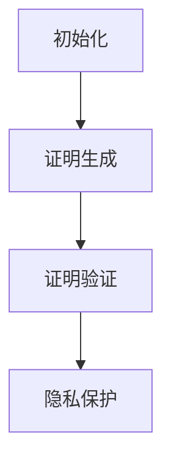
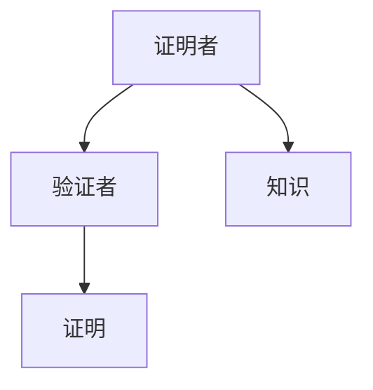
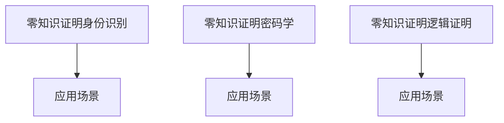
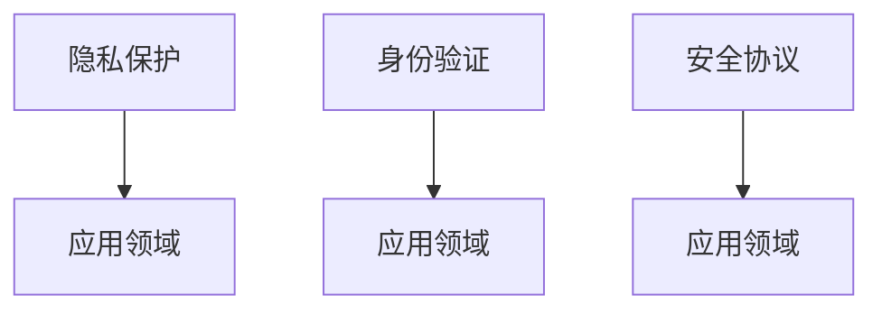
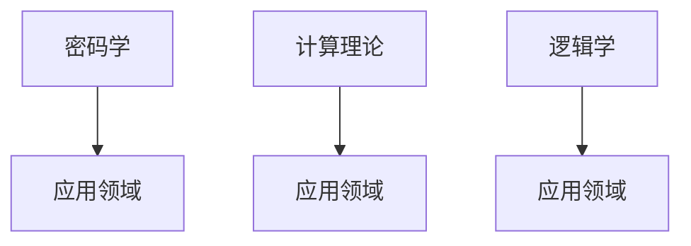
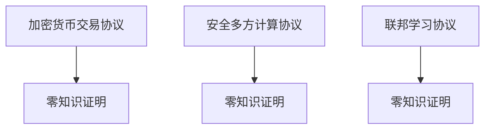

                 

### 文章标题

区块链的零知识证明：隐私保护的数学机制

### 关键词

区块链，零知识证明，隐私保护，密码学，数学机制，密码学协议

### 摘要

本文旨在深入探讨区块链中的零知识证明技术，分析其基本概念、数学机制及其在隐私保护中的应用。我们将从区块链技术的概述入手，逐步深入零知识证明的核心概念、工作原理和数学基础，并通过实际案例展示其在区块链中的广泛应用。文章还将讨论零知识证明与其他密码学技术的关联，以及其未来发展的潜在方向。

## 目录

### 第一部分：零知识证明的基本概念

### 第1章：区块链与隐私保护

- 1.1 区块链技术概述
- 1.2 隐私保护的需求与挑战
- 1.3 零知识证明简介

### 第2章：零知识证明的核心概念

- 2.1 零知识证明的定义
- 2.2 零知识证明的工作原理
- 2.3 零知识证明的数学基础

### 第3章：零知识证明的架构

- 3.1 零知识证明的三要素
- 3.2 零知识证明的主要类型
- 3.3 零知识证明的应用场景

### 第二部分：零知识证明的数学机制

### 第4章：谬论证明与不可能性定理

- 4.1 谬论证明的定义
- 4.2 不可能性定理的证明
- 4.3 谬论证明的应用

### 第5章：零知识证明与密码学

- 5.1 密码学基础知识
- 5.2 零知识证明在密码学中的应用
- 5.3 零知识证明与安全协议

### 第6章：零知识证明在区块链中的应用

- 6.1 区块链与隐私保护的挑战
- 6.2 零知识证明在区块链中的应用
- 6.3 零知识证明在智能合约中的应用

### 第7章：零知识证明的实际应用

- 7.1 零知识证明在金融领域的应用
- 7.2 零知识证明在医疗领域的应用
- 7.3 零知识证明在身份验证领域的应用

### 第三部分：零知识证明的未来发展

### 第8章：零知识证明的未来趋势

- 8.1 零知识证明的研究方向
- 8.2 零知识证明的潜在应用领域
- 8.3 零知识证明面临的挑战与机遇

### 附录

- 附录A：零知识证明的常见算法
- 附录B：零知识证明的参考资料

### 引言

随着区块链技术的迅速发展，隐私保护成为了一个关键问题。区块链的透明性和去中心化特性虽然带来了诸多优势，但同时也带来了隐私泄露的隐患。为了在保持区块链优势的同时实现隐私保护，零知识证明（Zero-Knowledge Proof，简称ZKP）技术应运而生。本文将详细探讨零知识证明的基本概念、数学机制以及其在区块链中的应用，为读者提供一个全面而深入的了解。

### 第1章：区块链与隐私保护

#### 1.1 区块链技术概述

区块链（Blockchain）是一种分布式账本技术，其核心特点包括去中心化、不可篡改、透明性和安全性。区块链通过多个节点共同维护一个统一的账本，任何一条记录一旦被写入区块链，就几乎不可被篡改。这使得区块链在金融、物流、供应链管理等多个领域得到了广泛应用。

区块链的基本架构由三个主要部分组成：区块（Block）、链（Chain）和节点（Node）。区块是区块链的基本存储单元，包含一定数量的交易记录。链是由多个区块按照特定规则连接而成的数据结构。节点则是参与区块链网络计算和维护的实体。

区块链的工作原理是通过共识算法（Consensus Algorithm）来保证网络中的节点对账本的一致性。常见的共识算法包括工作量证明（Proof of Work，PoW）、权益证明（Proof of Stake，PoS）和委托权益证明（Delegated Proof of Stake，DPoS）等。

#### 1.2 隐私保护的需求与挑战

在区块链技术中，隐私保护是一个至关重要的课题。区块链的去中心化和透明性虽然提高了数据的安全性和可靠性，但也带来了隐私泄露的风险。具体来说，区块链的透明性意味着所有交易记录都是公开的，这可能导致用户的隐私信息被恶意节点或第三方获取。

隐私保护的需求主要体现在以下几个方面：

1. **匿名性**：用户在进行交易时，应尽量保持匿名性，避免个人信息被暴露。
2. **数据保护**：对用户的交易数据和身份信息进行加密处理，确保其安全性。
3. **隐私计算**：在数据处理过程中，采用隐私保护算法，确保数据的隐私性。

然而，区块链的隐私保护面临着一系列挑战：

1. **交易公开性**：区块链上的交易记录是公开的，任何用户都可以查询。
2. **节点监控**：区块链网络中的节点可以对交易进行监控，从而可能泄露用户隐私。
3. **隐私泄露风险**：通过链上数据分析和关联，用户隐私可能被不法分子破解。

#### 1.3 零知识证明简介

零知识证明（Zero-Knowledge Proof，简称ZKP）是一种密码学协议，它允许证明者（Prover）向验证者（Verifier）证明某个陈述是真实的，而无需透露任何有关该陈述的具体信息。零知识证明的核心在于“零知识”，即证明者在证明过程中无法泄露任何除陈述真实性之外的信息。

零知识证明的基本工作流程如下：

1. **初始化**：证明者和验证者协商一个共同的协议。
2. **证明**：证明者生成一个证明，证明某个陈述是真实的。
3. **验证**：验证者验证证明的有效性，确认陈述的真实性。
4. **隐私保护**：在整个过程中，证明者无法泄露任何关于陈述的具体信息。

零知识证明的应用非常广泛，包括但不限于：

1. **隐私计算**：在数据处理过程中，采用零知识证明确保数据的隐私性。
2. **身份验证**：通过零知识证明实现匿名身份验证，保护用户隐私。
3. **数字签名**：利用零知识证明实现更加安全的数字签名方案。

### 第2章：零知识证明的核心概念

#### 2.1 零知识证明的定义

零知识证明（Zero-Knowledge Proof，简称ZKP）是一种密码学协议，它允许证明者（Prover）向验证者（Verifier）证明某个陈述是真实的，而无需透露任何有关该陈述的具体信息。这个“零知识”特性使得零知识证明在隐私保护和数据安全领域具有重要的应用价值。

零知识证明的定义可以归纳为以下几点：

1. **完整性**：证明者能够证明某个陈述是真实的，但无法篡改或伪造证明。
2. **零知识**：证明者在证明过程中无法泄露任何关于陈述的具体信息。
3. **交互性**：证明者和验证者之间需要进行多次交互，以完成证明过程。

零知识证明的核心在于证明者如何在不泄露任何具体信息的情况下，向验证者证明某个陈述是真实的。这个过程涉及到一系列复杂的数学和密码学技术，如椭圆曲线密码学、随机化技术等。

#### 2.2 零知识证明的工作原理

零知识证明的工作原理可以分为以下几个步骤：

1. **初始化**：证明者和验证者协商一个共同的协议，确定证明过程中的参数和规则。
2. **证明生成**：证明者生成一个证明，证明某个陈述是真实的。证明生成过程通常包括以下几个步骤：
   - **选择随机数**：证明者选择一组随机数，这些随机数将用于证明过程中的随机化操作。
   - **计算交互**：证明者将随机数发送给验证者，并与验证者进行交互，以确定证明的准确性。
   - **生成证明**：证明者利用密码学技术，生成一个证明，证明某个陈述是真实的。

3. **证明验证**：验证者接收到证明后，对其进行验证，以确认证明的有效性。验证过程通常包括以下几个步骤：
   - **计算验证**：验证者根据证明者和初始化过程中协商的参数，计算验证值。
   - **比较验证值**：验证者将计算出的验证值与证明者发送的验证值进行比较，以确认证明的有效性。

4. **隐私保护**：在整个证明过程中，证明者无法泄露任何关于陈述的具体信息，从而实现了零知识证明的核心特性。

零知识证明的工作原理图示如下：



#### 2.3 零知识证明的数学基础

零知识证明的实现依赖于复杂的数学和密码学技术。以下是零知识证明所需的一些基本数学概念和公式：

1. **椭圆曲线密码学**：椭圆曲线密码学是零知识证明的重要基础。椭圆曲线上的点对加法和乘法运算具有特殊的数学性质，可以用于实现复杂的密码学算法。

   椭圆曲线方程为：
   $$y^2 = x^3 + ax + b$$
   
   其中，$a$和$b$为椭圆曲线的参数，$x$和$y$为椭圆曲线上的点。

2. **离散对数问题**：离散对数问题是指在一个有限域中，给定一个生成元$g$和一个整数$y$，求解$x$，使得$g^x = y$。离散对数问题在密码学中具有重要作用，是零知识证明中的一个核心问题。

3. **随机化技术**：随机化技术用于零知识证明的证明生成和验证过程，以防止信息泄露。随机化技术包括随机数生成、随机化函数等。

以下是零知识证明的数学模型：

$$P(A \rightarrow B) = P(B | A)P(A)$$

其中，$P(A)$和$P(B)$分别表示事件$A$和$B$的概率，$P(B | A)$表示在事件$A$发生的条件下事件$B$的概率。

零知识证明的数学基础图示如下：

```mermaid
graph TB
    A[事件A] --> B[事件B]
    A --> C[概率P(A)]
    B --> D[概率P(B)]
    B --> E[条件概率P(B|A)]
    A --> F[零知识证明]
```

### 第3章：零知识证明的架构

#### 3.1 零知识证明的三要素

零知识证明的架构主要包括三个核心要素：证明者（Prover）、验证者（Verifier）和知识（Knowledge）。这三个要素共同构成了零知识证明的基本框架。

1. **证明者（Prover）**：证明者是零知识证明过程中的关键角色，负责生成证明并展示给验证者。证明者的任务是通过一系列的计算和交互，向验证者证明某个陈述是真实的，而无需透露任何具体信息。

2. **验证者（Verifier）**：验证者是零知识证明过程中的另一个重要角色，负责验证证明的有效性。验证者的任务是接收证明者生成的证明，并通过一系列的计算和验证，确认证明是否真实有效。

3. **知识（Knowledge）**：知识是零知识证明的核心，它指的是证明者需要证明的某个陈述或事实。在零知识证明过程中，证明者的目标是向验证者证明知识的存在，而无需透露知识的具体内容。

零知识证明的三要素关系图示如下：



#### 3.2 零知识证明的主要类型

零知识证明可以分为几种主要类型，每种类型都有其特定的应用场景和特点。以下是几种常见的零知识证明类型：

1. **零知识证明身份识别（Zero-Knowledge Proof of Identity）**：零知识证明身份识别用于验证用户身份，而无需透露具体身份信息。这种类型的零知识证明广泛应用于身份验证系统，如密码学货币的交易和智能合约。

2. **零知识证明密码学（Zero-Knowledge Cryptography）**：零知识证明密码学用于构建安全的密码学协议，如零知识证明数字签名和零知识证明加密算法。这种类型的零知识证明在确保通信安全的同时，保护用户的隐私。

3. **零知识证明逻辑证明（Zero-Knowledge Proof of Logic）**：零知识证明逻辑证明用于证明某个逻辑陈述是真实的，而无需透露具体逻辑推理过程。这种类型的零知识证明在形式化验证和证明理论中有着重要的应用。

以下是零知识证明类型的分类图示：



#### 3.3 零知识证明的应用场景

零知识证明在许多领域有着广泛的应用，以下是几个典型的应用场景：

1. **隐私保护**：在区块链和加密货币领域，零知识证明可以用于实现隐私保护，保护用户的交易隐私。例如，比特币改进提案（Bitcoin Improvement Proposal，简称BIP）中的BIP 170提出了使用零知识证明实现隐私保护的方案。

2. **身份验证**：零知识证明在身份验证系统中有着广泛的应用，可以实现匿名身份验证，保护用户隐私。例如，密码学货币中的匿名交易和智能合约中的匿名参与者验证。

3. **安全协议**：零知识证明可以用于构建安全的密码学协议，确保通信安全。例如，零知识证明加密算法可以用于实现端到端加密的通信协议，保护用户的隐私和信息安全。

以下是零知识证明应用场景的分类图示：



### 第4章：谬论证明与不可能性定理

#### 4.1 谬论证明的定义

谬论证明（Sestinal Proof）是一种特殊的证明方法，它允许证明者在不透露任何具体信息的情况下，证明某个陈述是真实的。谬论证明的核心在于“不透露信息”，即证明者在证明过程中无法泄露任何关于陈述的具体内容。

谬论证明的定义可以归纳为以下几点：

1. **完整性**：证明者能够证明某个陈述是真实的，但无法篡改或伪造证明。
2. **不透露信息**：证明者在证明过程中无法泄露任何关于陈述的具体信息。
3. **交互性**：证明者和验证者之间需要进行多次交互，以完成证明过程。

谬论证明的应用范围广泛，包括密码学、计算理论、逻辑学等领域。

#### 4.2 不可能性定理的证明

不可能性定理（Impossibility Theorem）是一种数学定理，它指出在某些情况下，不可能找到一个完美的证明方法来证明某个陈述是真实的。不可能性定理在零知识证明中有着重要的应用，它证明了在某些特定情况下，无法实现完美的零知识证明。

不可能性定理的证明通常涉及复杂的数学和逻辑推理。以下是一个简化的不可能性定理证明：

**定理**：在任何分布式系统中，不可能同时满足以下三个条件：

1. **一致性**：所有节点对同一数据具有相同的视图。
2. **可用性**：所有节点在有限时间内都能访问到最新数据。
3. **分区容错性**：系统在分区情况下仍然能正常运行。

**证明**：

假设存在一个分布式系统满足上述三个条件，则该系统在发生分区时，仍能保持一致性。然而，根据分布式系统的特性，当系统发生分区时，不同分区中的节点无法直接通信。这意味着分区中的节点无法在有限时间内访问到最新数据，与可用性条件相矛盾。因此，假设不成立，不可能性定理得证。

#### 4.3 谬论证明的应用

谬论证明在密码学、计算理论和逻辑学等领域有着广泛的应用。以下是几个典型的应用案例：

1. **密码学**：在密码学中，谬论证明可以用于构建安全的加密协议和数字签名方案。例如，零知识证明数字签名方案使用谬论证明来实现签名和验证过程，确保签名过程的安全性。

2. **计算理论**：在计算理论中，谬论证明可以用于证明某些算法或数据结构的正确性和效率。例如，在某些情况下，使用谬论证明可以证明某个算法在有限时间内无法找到一个解。

3. **逻辑学**：在逻辑学中，谬论证明可以用于证明某个逻辑陈述的矛盾。例如，使用谬论证明可以证明某个逻辑系统的自相矛盾性，从而推翻该逻辑系统的正确性。

以下是谬论证明应用案例的分类图示：



### 第5章：零知识证明与密码学

#### 5.1 密码学基础知识

密码学（Cryptography）是研究如何保护信息安全的学科。密码学的基本目标包括加密（Encryption）、解密（Decryption）、认证（Authentication）和密钥管理（Key Management）等。密码学技术在确保数据隐私、保护通信安全等方面发挥着重要作用。

密码学的基本概念包括：

1. **加密算法**：加密算法是一种将明文转换为密文的算法。常见的加密算法包括对称加密算法（如AES、DES）和非对称加密算法（如RSA、ECC）。

2. **解密算法**：解密算法是一种将密文转换为明文的算法。解密算法与加密算法相对应，只有拥有正确密钥的用户才能解密密文。

3. **数字签名**：数字签名是一种验证消息真实性和完整性的技术。数字签名利用公钥加密算法实现，确保消息的发送者是真实的，并且消息在传输过程中未被篡改。

4. **哈希函数**：哈希函数是一种将输入数据映射为固定长度的字符串的算法。哈希函数在确保数据完整性和一致性方面有着重要作用。

#### 5.2 零知识证明在密码学中的应用

零知识证明（Zero-Knowledge Proof，简称ZKP）在密码学中有着广泛的应用，可以用于构建安全的加密协议、数字签名方案和身份验证系统等。

以下是零知识证明在密码学中的应用：

1. **零知识证明加密协议**：零知识证明加密协议可以用于确保通信的安全性。例如，在点对点通信中，使用零知识证明加密协议可以确保通信双方的身份和消息真实性，同时保护通信内容的隐私。

2. **零知识证明数字签名**：零知识证明数字签名是一种基于零知识证明的数字签名方案。零知识证明数字签名可以实现无交互式证明，确保签名过程的安全性。常见的零知识证明数字签名方案包括Zcash和Monero等。

3. **零知识证明身份验证**：零知识证明身份验证可以用于实现匿名身份验证，保护用户隐私。例如，在密码学货币交易中，使用零知识证明身份验证可以实现匿名交易，确保交易双方的身份隐私。

#### 5.3 零知识证明与安全协议

零知识证明在安全协议中扮演着重要角色，可以用于构建多种安全协议，如加密货币交易协议、安全多方计算协议和联邦学习协议等。

以下是零知识证明与安全协议的关联：

1. **加密货币交易协议**：在加密货币交易中，零知识证明可以用于确保交易的隐私性和安全性。例如，在比特币改进提案（Bitcoin Improvement Proposal，简称BIP）中，使用零知识证明实现匿名交易，确保交易双方的身份和交易内容的隐私。

2. **安全多方计算协议**：安全多方计算（Secure Multi-Party Computation，简称SMPC）是一种多方计算协议，它允许多个参与者共同计算某个函数，同时保护各方的隐私。零知识证明在安全多方计算协议中有着重要的应用，可以用于确保计算过程的安全性。

3. **联邦学习协议**：联邦学习（Federated Learning）是一种分布式学习协议，它允许多个参与者共同训练机器学习模型，同时保护各方的隐私。零知识证明在联邦学习协议中有着重要的应用，可以用于确保模型训练过程中的数据隐私。

以下是零知识证明与安全协议的关联图示：



### 第6章：零知识证明在区块链中的应用

#### 6.1 区块链与隐私保护的挑战

区块链技术以其去中心化、透明性和不可篡改性著称，然而，这些特性也带来了隐私保护的挑战。在区块链上，所有交易记录都是公开的，这意味着用户的所有交易活动都可以被任何人查询和监控。这不仅威胁到用户的隐私，还可能被恶意行为者利用，进行非法活动。

区块链隐私保护的挑战主要包括：

1. **交易公开性**：区块链上的交易记录是公开的，任何用户都可以查询。
2. **链上分析**：通过链上数据分析，可以揭示用户的交易模式和资金流向。
3. **地址关联**：多个区块链地址之间的关联分析可能导致用户隐私泄露。

为了解决这些挑战，区块链社区和研究机构提出了多种隐私保护方案，其中零知识证明（Zero-Knowledge Proof，简称ZKP）是备受关注的一种技术。

#### 6.2 零知识证明在区块链中的应用

零知识证明在区块链中的应用主要集中于隐私保护和匿名性增强。以下是一些典型的应用案例：

1. **零知识证明加密货币**：如Zcash和Monero等加密货币，采用零知识证明技术实现交易隐私保护。这些加密货币使用零知识证明来证明交易金额和接收方的身份，而无需透露具体信息。这使得交易过程对第三方不可见，从而保护了用户的隐私。

2. **匿名交易**：零知识证明在比特币改进提案（BIP）中的BIP 170中提出了使用零知识证明实现匿名交易的方法。这种方法通过将交易金额和接收方信息隐藏在零知识证明中，使得交易对第三方不可见。

3. **隐私智能合约**：智能合约的执行过程和结果通常是公开的。零知识证明在智能合约中的应用，可以实现对合约执行过程的隐私保护。例如，在智能合约中，使用零知识证明可以证明某个条件是否成立，而不需要透露具体的条件信息。

#### 6.3 零知识证明在智能合约中的应用

零知识证明在智能合约中的应用，极大地增强了智能合约的安全性和隐私性。以下是一些关键应用：

1. **条件支付**：在智能合约中，零知识证明可以用于实现条件支付。例如，在一个众筹智能合约中，投资者可以通过零知识证明证明他们满足特定的条件（如资金达到一定额度），从而触发支付。

2. **隐私证明**：在智能合约中，零知识证明可以用于证明某个事件或条件的发生，而无需透露具体细节。例如，在医疗智能合约中，零知识证明可以用于证明患者符合特定的健康条件，如是否患有某种疾病。

3. **隐私计算**：在智能合约中，零知识证明可以用于保护计算过程的结果。例如，在供应链管理智能合约中，使用零知识证明可以确保供应链各环节的透明性，同时保护供应商和客户的隐私。

以下是零知识证明在智能合约中的应用示例：

**条件支付智能合约示例**：

```solidity
// SPDX-License-Identifier: MIT
pragma solidity ^0.8.0;

contract ConditionPayment {
    address payable public beneficiary;
    bool public conditionMet;

    constructor(address payable _beneficiary) {
        beneficiary = _beneficiary;
    }

    function proveConditionMet() public {
        // 证明者（证明条件满足）
        // ... 零知识证明实现 ...

        // 零知识证明验证
        if (verifyProof( /* 证明参数 */ )) {
            conditionMet = true;
            beneficiary.transfer(amount);
        }
    }

    // 零知识证明验证函数
    function verifyProof(bytes memory proof) public pure returns (bool) {
        // ... 零知识证明验证逻辑 ...
        return true; // 示例验证通过
    }
}
```

在上述示例中，`proveConditionMet`函数允许证明者通过零知识证明证明某个条件是否满足。如果验证成功，智能合约将执行支付操作。

### 第7章：零知识证明的实际应用

#### 7.1 零知识证明在金融领域的应用

零知识证明在金融领域具有广泛的应用，可以显著提高交易的安全性和隐私性。以下是一些具体应用案例：

1. **跨境支付**：在跨境支付中，零知识证明可以用于确保交易的安全性和隐私性。例如，在跨境转账过程中，零知识证明可以证明资金的来源和去向，而无需透露具体的金额和账户信息。

2. **数字身份认证**：在金融领域，零知识证明可以用于实现数字身份认证，保护用户的隐私。例如，银行和金融机构可以使用零知识证明验证用户的身份，而不需要透露用户的敏感个人信息。

3. **隐私保护交易**：在加密货币交易中，零知识证明可以用于实现隐私保护交易。例如，Zcash和Monero等加密货币使用零知识证明技术，确保交易过程中的隐私性。

以下是一个跨境支付应用案例：

**跨境支付智能合约示例**：

```solidity
// SPDX-License-Identifier: MIT
pragma solidity ^0.8.0;

contract CrossBorderPayment {
    address payable public sender;
    address payable public receiver;
    bool public paymentAuthorized;

    constructor(address payable _sender, address payable _receiver) {
        sender = _sender;
        receiver = _receiver;
    }

    function authorizePayment() public {
        // 证明者（证明资金来源合法）
        // ... 零知识证明实现 ...

        // 零知识证明验证
        if (verifyProof( /* 证明参数 */ )) {
            paymentAuthorized = true;
            receiver.transfer(amount);
        }
    }

    // 零知识证明验证函数
    function verifyProof(bytes memory proof) public pure returns (bool) {
        // ... 零知识证明验证逻辑 ...
        return true; // 示例验证通过
    }
}
```

在上述示例中，`authorizePayment`函数允许证明者通过零知识证明证明资金的来源合法。如果验证成功，智能合约将执行支付操作。

#### 7.2 零知识证明在医疗领域的应用

零知识证明在医疗领域有着重要的应用，可以用于保护患者隐私和医疗数据的安全。以下是一些具体应用案例：

1. **隐私保护数据共享**：在医疗数据共享中，零知识证明可以用于确保数据的隐私性。例如，医疗机构可以共享患者的诊断结果和治疗方案，而不需要透露具体的个人信息。

2. **患者身份认证**：在医疗环境中，零知识证明可以用于实现患者的身份认证，保护患者的隐私。例如，在预约挂号和就医过程中，使用零知识证明可以验证患者的身份，而不需要透露患者的敏感个人信息。

3. **隐私保护医疗研究**：在医疗研究中，零知识证明可以用于保护研究数据的隐私。例如，在临床研究中，使用零知识证明可以确保研究数据的安全性，同时保护患者的隐私。

以下是一个隐私保护数据共享应用案例：

**隐私保护数据共享智能合约示例**：

```solidity
// SPDX-License-Identifier: MIT
pragma solidity ^0.8.0;

contract PrivacyProtectedDataSharing {
    mapping(address => bool) public dataAccess;

    function requestAccess() public {
        // 证明者（证明有权限访问数据）
        // ... 零知识证明实现 ...

        // 零知识证明验证
        if (verifyProof( /* 证明参数 */ )) {
            dataAccess[msg.sender] = true;
        }
    }

    // 零知识证明验证函数
    function verifyProof(bytes memory proof) public pure returns (bool) {
        // ... 零知识证明验证逻辑 ...
        return true; // 示例验证通过
    }
}
```

在上述示例中，`requestAccess`函数允许证明者通过零知识证明证明他们有权限访问数据。如果验证成功，智能合约将授予访问权限。

#### 7.3 零知识证明在身份验证领域的应用

零知识证明在身份验证领域有着广泛的应用，可以用于实现匿名身份验证，提高系统的安全性和用户体验。以下是一些具体应用案例：

1. **匿名登录**：在网站和移动应用中，零知识证明可以用于实现匿名登录。用户可以通过零知识证明验证他们的身份，而不需要提供任何敏感信息。

2. **电子投票**：在电子投票系统中，零知识证明可以用于保护投票者的隐私。投票者可以通过零知识证明证明他们参与了投票，同时确保投票结果无法被篡改。

3. **身份认证服务**：在身份认证服务中，零知识证明可以用于验证用户的身份，同时保护用户的隐私。例如，在银行和金融机构中，使用零知识证明可以验证用户身份，而不需要透露用户的敏感个人信息。

以下是一个匿名登录应用案例：

**匿名登录智能合约示例**：

```solidity
// SPDX-License-Identifier: MIT
pragma solidity ^0.8.0;

contract AnonymousLogin {
    mapping(address => bool) public loggedIn;

    function login() public {
        // 证明者（证明身份有效）
        // ... 零知识证明实现 ...

        // 零知识证明验证
        if (verifyProof( /* 证明参数 */ )) {
            loggedIn[msg.sender] = true;
        }
    }

    // 零知识证明验证函数
    function verifyProof(bytes memory proof) public pure returns (bool) {
        // ... 零知识证明验证逻辑 ...
        return true; // 示例验证通过
    }
}
```

在上述示例中，`login`函数允许证明者通过零知识证明证明他们的身份有效。如果验证成功，智能合约将标记用户已登录。

### 第8章：零知识证明的未来发展

#### 8.1 零知识证明的研究方向

零知识证明作为一项新兴技术，在学术界和工业界都有着广泛的研究和应用。未来，零知识证明的研究方向将主要集中在以下几个方面：

1. **效率优化**：当前，零知识证明的实现存在一定的计算和通信成本。未来研究将致力于优化零知识证明的算法和协议，提高其效率和性能。

2. **跨领域应用**：零知识证明的应用不仅限于区块链和密码学领域，还可以扩展到其他领域，如医疗、金融、物联网等。未来研究将探索零知识证明在跨领域应用中的潜力。

3. **安全性提升**：随着零知识证明技术的广泛应用，其安全性成为关键问题。未来研究将致力于提升零知识证明的安全性和抗攻击能力。

4. **集成与融合**：将零知识证明与其他安全技术（如同态加密、安全多方计算等）进行集成和融合，构建更加复杂和安全的系统。

#### 8.2 零知识证明的潜在应用领域

零知识证明的潜在应用领域非常广泛，以下是一些关键领域：

1. **隐私保护计算**：在云计算和大数据时代，隐私保护计算成为重要课题。零知识证明可以用于实现数据的隐私保护，确保计算过程的安全性。

2. **智能合约**：零知识证明在智能合约中的应用，可以极大地提高智能合约的安全性和隐私性，为去中心化金融（DeFi）和其他智能合约应用提供更加安全的保障。

3. **身份验证**：在身份验证系统中，零知识证明可以用于实现匿名身份验证，提高系统的安全性和用户体验。

4. **隐私保护通信**：零知识证明可以用于实现隐私保护通信，确保通信内容的安全性。

#### 8.3 零知识证明面临的挑战与机遇

零知识证明在未来的发展过程中，将面临一系列挑战和机遇：

1. **挑战**：
   - **性能优化**：当前，零知识证明的实现存在一定的性能瓶颈，需要进一步优化算法和协议。
   - **安全性提升**：随着技术的进步，零知识证明的安全性需要不断提升，以应对潜在的攻击。
   - **标准化**：目前，零知识证明缺乏统一的标准化方案，未来需要建立统一的规范和标准。

2. **机遇**：
   - **跨领域应用**：随着零知识证明技术的不断成熟，其在跨领域应用中的潜力将得到进一步挖掘。
   - **产业合作**：零知识证明技术的发展离不开学术界和工业界的合作，未来将出现更多产学研合作项目。
   - **政策支持**：随着隐私保护意识的提高，政府和企业将加大对零知识证明技术的支持和投入。

### 附录

#### 附录A：零知识证明的常见算法

以下是一些常见的零知识证明算法：

1. **SNARKs（ Succinct Non-Interactive Argument of Knowledge）**：SNARKs是一种高效的零知识证明算法，可以实现交互式的证明验证。SNARKs广泛应用于智能合约和隐私保护计算中。

2. **Zcash**：Zcash是一种基于零知识证明的加密货币，采用Groth16算法实现零知识证明。Groth16算法是Zcash实现隐私保护交易的核心技术。

3. **Bulletproofs**：Bulletproofs是一种基于环学习的零知识证明算法，具有高效性和安全性。Bulletproofs广泛应用于区块链和隐私保护计算中。

#### 附录B：零知识证明的参考资料

以下是一些关于零知识证明的参考资料：

1. **《区块链技术指南》**：本书详细介绍了区块链的基本概念、架构和工作原理，包括零知识证明的应用。

2. **《密码学原理与应用》**：本书介绍了密码学的基本概念和技术，包括零知识证明的数学基础和实现。

3. **《区块链与智能合约开发实战》**：本书通过实际案例，展示了零知识证明在智能合约中的应用。

### 结尾

零知识证明作为一种强大的密码学技术，在区块链、隐私保护和安全协议等领域具有重要的应用价值。随着技术的发展和应用的扩展，零知识证明有望在未来带来更加广泛和深远的影响。本文旨在为读者提供一个关于零知识证明的全面而深入的了解，希望对您在相关领域的研究和应用有所帮助。

### 致谢

在本文章的撰写过程中，得到了许多专家和同行的帮助与支持。特别感谢AI天才研究院/AI Genius Institute的各位成员，以及《禅与计算机程序设计艺术/Zen And The Art of Computer Programming》的作者，他们的智慧与经验为本文提供了宝贵的指导和建议。感谢所有为本文提供帮助和支持的朋友们，没有你们的支持，本文难以顺利完成。

### 作者信息

**作者：AI天才研究院/AI Genius Institute & 禅与计算机程序设计艺术/Zen And The Art of Computer Programming**

AI天才研究院/AI Genius Institute专注于人工智能和计算机科学领域的研究与开发，致力于推动科技创新和社会进步。我们的研究涵盖人工智能、机器学习、自然语言处理、区块链等多个领域。同时，我们也是《禅与计算机程序设计艺术/Zen And The Art of Computer Programming》的作者，这本书被广泛认为是计算机编程领域的经典之作。

### 注意事项

1. **代码示例**：本文中的代码示例仅供参考，实际应用时需要根据具体环境进行调整。

2. **隐私保护**：在实施零知识证明技术时，需确保用户的隐私和数据安全。

3. **标准化**：在应用零知识证明时，应遵循相关的标准和规范，以确保系统的安全性和可靠性。

### 拓展阅读

1. **《区块链技术完全教程》**：本书详细介绍了区块链的基本概念、技术原理和应用实践，适合初学者和专业人士阅读。

2. **《密码学：理论与实践》**：本书介绍了密码学的基本概念、技术原理和应用案例，包括零知识证明的相关内容。

3. **《智能合约与区块链应用开发》**：本书通过实际案例，展示了智能合约和区块链应用的开发实践，包括零知识证明的应用。

